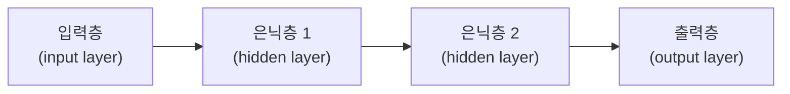

<Callout type="info">
  **이번 문서의 목표:** 이 시리즈 전체에서 반복해 등장하는 용어(모델·파라미터·에폭·배치 등)와 수식 표기($\theta$, $\nabla$, $\partial$ 등)를 미리 익혀, 이후 편에서 수식이 나올 때마다 낯설지 않게 한다.
</Callout>

## 왜 용어 지도를 먼저 그리는가

> **쉽게 말하면:** 딥러닝 문서는 처음 보는 기호와 줄임말이 한 문장에 서너 개씩 나온다. 이 편에서 미리 정리해 두면 이후 계산 과정을 읽을 때 기호 때문에 막히는 일이 없다.

딥러닝(Deep Learning, 여러 층을 깊게 쌓은 신경망으로 데이터의 표현을 스스로 학습하는 방법) 관련 글을 처음 읽으면 $\theta$, $\nabla$, $\partial$ 같은 그리스 문자와 파라미터(parameter)·하이퍼파라미터(hyperparameter)·에폭(epoch) 같은 용어가 뒤섞여 나온다. 이 용어들은 05편 이후 모든 본론 편에서 반복적으로 등장하므로, 이 편에서 한 번에 정리해 두고 뒤에서는 "자세한 내용은 02편"으로 짧게 되짚는 방식을 쓴다.

## 모델을 이루는 기본 단위

### 파라미터와 하이퍼파라미터

> **쉽게 말하면:** 파라미터는 학습 중에 컴퓨터가 스스로 바꾸는 값이고, 하이퍼파라미터는 학습을 시작하기 전에 사람이 미리 정해 주는 값이다.

**파라미터**(parameter, 모델이 데이터를 통해 스스로 조정하는 값)는 신경망의 가중치(weight)와 편향(bias)을 가리킨다. 가중치는 보통 $w$, 편향은 $b$로 쓰고, 여러 층의 가중치를 모두 묶어 $\theta$(세타, 모델이 가진 모든 학습 대상 파라미터를 하나로 묶어 부르는 기호)로 표기하는 경우가 많다.

**하이퍼파라미터**(hyperparameter, 학습 전에 사람이 값을 지정하는 설정)는 학습률(learning rate, $\eta$ 에타)이나 은닉층의 개수, 배치 크기(batch size)처럼 학습 과정 자체를 조절하는 값이다. 파라미터는 학습이 진행되며 자동으로 바뀌지만, 하이퍼파라미터는 사람이 실험을 통해 값을 골라야 한다는 점이 결정적인 차이다.

| 구분 | 예시 | 누가 결정하는가 | 언제 바뀌는가 |
|------|------|------------------|----------------|
| 파라미터 | 가중치 $w$, 편향 $b$ | 학습 알고리즘(경사하강법 등) | 매 학습 스텝마다 |
| 하이퍼파라미터 | 학습률 $\eta$, 배치 크기, 은닉층 수 | 사람(설계자) | 학습을 시작하기 전, 실험적으로 |

### 에폭·배치·이터레이션

> **쉽게 말하면:** 에폭은 전체 데이터를 한 바퀴 다 본 횟수, 배치는 한 번에 넣는 데이터 묶음, 이터레이션은 그 묶음을 몇 번 넣었는지를 센 값이다.

전체 학습 데이터가 1,000개 있고, 이를 한 번에 다 넣지 않고 **배치**(batch, 한 번의 학습 스텝에 사용하는 데이터 묶음) 크기 100씩 나눠 넣는다고 하자.

- **미니배치**(mini-batch): 100개짜리 묶음 하나.
- **이터레이션**(iteration): 미니배치 한 번을 모델에 통과시켜 파라미터를 한 번 갱신하는 것. 1,000개를 100개씩 나누면 이터레이션은 10번 필요하다.
- **에폭**(epoch): 전체 1,000개 데이터를 한 번씩 다 사용하는 것. 위 예에서는 10번의 이터레이션이 1에폭에 해당한다.

$$
\text{1 에폭당 이터레이션 수} = \frac{1000}{100} = 10
$$

- $1000$: 전체 학습 데이터 개수
- $100$: 배치 크기
- $10$: 1에폭을 채우는 데 필요한 이터레이션(가중치 갱신) 횟수

만약 이 모델을 20에폭 학습시킨다면, 전체 가중치 갱신 횟수는 $10 \times 20 = 200$번이 된다.

## 층·노드·필터: 신경망의 구조를 부르는 이름

신경망(neural network)은 입력층(input layer)·은닉층(hidden layer)·출력층(output layer)으로 이루어진 층(layer)의 연속이다. 각 층은 여러 개의 노드(node, 뉴런이라고도 부르며 하나의 계산 단위)로 이루어진다. CNN(합성곱 신경망, 11편에서 자세히 다룬다)에서는 노드 대신 **필터**(filter, 커널이라고도 부르며 이미지의 국소 패턴을 감지하는 작은 가중치 행렬)라는 용어를 쓴다.

이 시리즈에서 "층이 깊다"는 표현은 은닉층의 개수가 많다는 뜻이고, "딥러닝"이라는 이름 자체가 여기서 나왔다. 층을 하나만 가진 퍼셉트론(05편)과 여러 층을 가진 MLP(Multi-Layer Perceptron, 다층 퍼셉트론)의 구조적 차이가 이 시리즈의 첫 번째 핵심 갈림길이다.

## 벡터·행렬·텐서 표기법

> **쉽게 말하면:** 숫자 하나는 스칼라, 숫자를 한 줄로 늘어놓으면 벡터, 격자로 늘어놓으면 행렬, 그 이상 차원으로 늘어놓으면 텐서다.

딥러닝 수식은 숫자 하나가 아니라 숫자 묶음을 다룬다. 차원이 늘어나는 순서대로 이름이 붙는다.

- **스칼라**(scalar): 숫자 하나. 소문자 이탤릭으로 쓴다. 예: $x = 3$
- **벡터**(vector): 숫자를 한 줄로 늘어놓은 것. 굵은 소문자로 쓴다. 예: $\mathbf{x} = [1, 2, 3]$
- **행렬**(matrix): 숫자를 행과 열의 격자로 늘어놓은 것. 굵은 대문자로 쓴다. 예:

$$
\mathbf{W} = \begin{bmatrix} 1 & 2 \\ 3 & 4 \end{bmatrix}
$$

- $\mathbf{W}$: 가중치 행렬(weight matrix). 관례적으로 가중치를 대문자 $W$로 표기한다.
- 첫 번째 행 $[1, 2]$는 하나의 출력 노드에 연결되는 가중치들이고, 두 번째 행 $[3, 4]$는 또 다른 출력 노드에 연결되는 가중치들이다.

- **텐서**(tensor): 행렬보다 차원이 더 높은 숫자 묶음. 예를 들어 컬러 이미지 한 장은 (높이, 너비, 채널) 3차원 텐서이고, 여러 장의 이미지를 배치로 묶으면 (배치 크기, 높이, 너비, 채널) 4차원 텐서가 된다.

### 벡터·행렬 곱셈 한 번 검산하기

입력 벡터 $\mathbf{x} = [1, 2]$와 위의 가중치 행렬 $\mathbf{W}$를 곱해 보자.

$$
\mathbf{W}\mathbf{x} = \begin{bmatrix} 1 & 2 \\ 3 & 4 \end{bmatrix} \begin{bmatrix} 1 \\ 2 \end{bmatrix} = \begin{bmatrix} 1 \times 1 + 2 \times 2 \\ 3 \times 1 + 4 \times 2 \end{bmatrix} = \begin{bmatrix} 5 \\ 11 \end{bmatrix}
$$

- 첫 번째 성분: $1 \times 1 + 2 \times 2 = 1 + 4 = 5$
- 두 번째 성분: $3 \times 1 + 4 \times 2 = 3 + 8 = 11$

결과 벡터 $[5, 11]$이 바로 이 층의 출력(활성화 함수를 거치기 전 값, 06편에서 다룬다)이 된다. 신경망의 순전파(forward propagation, 07편)는 이런 행렬 곱셈을 층마다 반복하는 과정이라고 이해하면 된다.

## 미분·그라디언트 관련 기호

> **쉽게 말하면:** 편미분은 여러 변수 중 하나만 살짝 바꿨을 때 결과가 얼마나 바뀌는지를 재는 도구이고, 그라디언트는 그 편미분들을 모두 모은 벡터다.

신경망 학습은 손실(loss, 모델의 예측이 정답과 얼마나 다른지 나타내는 값)을 줄이는 방향으로 파라미터를 조금씩 움직이는 과정이다. 이때 "어느 방향으로 움직여야 손실이 줄어드는가"를 알려주는 도구가 미분이다.

- $\frac{\partial L}{\partial w}$: 파셜(partial, 편미분 기호 $\partial$를 읽는 방식)로 읽으며, 손실 $L$을 가중치 $w$에 대해 편미분한다는 뜻이다. 다른 변수는 고정한 채 $w$만 살짝 바꿨을 때 $L$이 얼마나 바뀌는지를 나타낸다.
- $\nabla$(나블라): 여러 파라미터에 대한 편미분을 전부 모아 벡터로 만든 것을 **그라디언트**(gradient, 기울기 벡터)라고 부르고 $\nabla L$로 쓴다.
- $\eta$(에타): 학습률(learning rate). 한 번에 얼마나 크게 움직일지를 정하는 하이퍼파라미터다.

경사하강법(gradient descent, 08편에서 자세히 다룬다)의 갱신 규칙은 다음과 같다.

$$
w_{\text{new}} = w_{\text{old}} - \eta \frac{\partial L}{\partial w}
$$

- $w_{\text{old}}$: 갱신 전 가중치
- $\eta$: 학습률
- $\frac{\partial L}{\partial w}$: 손실 $L$을 가중치 $w$로 편미분한 값(그라디언트의 한 성분)
- $w_{\text{new}}$: 갱신 후 가중치

### 실제 숫자로 한 번 갱신해 보기

$w_{\text{old}} = 2$, 학습률 $\eta = 0.1$, 이 지점에서 계산된 그라디언트 $\frac{\partial L}{\partial w} = 4$라고 하자.

$$
w_{\text{new}} = 2 - 0.1 \times 4 = 2 - 0.4 = 1.6
$$

가중치가 $2$에서 $1.6$으로 줄어들었다. 그라디언트가 양수(4)라는 것은 "$w$를 키우면 손실이 커진다"는 뜻이므로, 경사하강법은 반대 방향인 음수 쪽으로 $w$를 움직여 손실을 줄인다. 이 계산 패턴은 07편(역전파)과 08편(최적화)에서 훨씬 복잡한 형태로 반복되므로, 지금 이 한 줄 계산의 의미를 확실히 잡아 두는 것이 중요하다.

## 손실·목적함수·정규화라는 이름들

- **손실 함수**(loss function): 예측 하나에 대한 오차를 숫자로 나타내는 함수. 기호는 보통 $L$ 또는 $\ell$.
- **목적함수**(objective function) 또는 **비용 함수**(cost function): 전체 데이터에 대한 손실의 평균 등을 최종적으로 최소화 대상으로 삼는 함수. 기호는 보통 $J$. 문헌에 따라 손실 함수와 같은 뜻으로 섞어 쓰기도 하므로, 이 시리즈에서는 "샘플 하나당 오차"는 손실, "전체를 요약한 최소화 대상"은 목적함수로 구분해 쓴다.
- **정규화**(regularization): 모델이 학습 데이터에만 과하게 맞춰지는 것(과적합, 09편)을 막기 위해 목적함수에 페널티를 더하거나 학습 방식을 조정하는 기법 전체를 가리키는 말.

## 자주 틀리는 점

- **파라미터와 하이퍼파라미터를 혼동**: "학습률도 파라미터 아닌가?"라고 생각하기 쉽지만, 학습 중 자동으로 갱신되는지(파라미터) 사람이 미리 정하는지(하이퍼파라미터)가 구분 기준이다.
- **에폭과 이터레이션을 같은 것으로 착각**: 에폭은 전체 데이터를 한 바퀴 도는 것, 이터레이션은 배치 하나를 처리하는 것이다. 배치 크기가 작을수록 1에폭 안의 이터레이션 수는 늘어난다.
- **$\partial$(편미분)과 $d$(일반 미분)를 같은 기호로 씀**: 변수가 여러 개인 함수를 한 변수에 대해서만 미분할 때는 $\partial$를 쓴다. 딥러닝의 손실 함수는 파라미터가 수백만 개인 다변수 함수이므로 거의 항상 $\partial$ 표기를 쓴다.
- **그라디언트의 부호를 반대로 해석**: 그라디언트가 양수라는 것은 "그 방향으로 가면 손실이 커진다"는 뜻이다. 경사하강법이 그라디언트의 **반대** 방향으로 움직이는 이유가 여기에 있다.

## 핵심 정리

- 파라미터(가중치 $w$, 편향 $b$)는 학습 중 자동으로 갱신되고, 하이퍼파라미터(학습률 $\eta$, 배치 크기 등)는 학습 전 사람이 정한다.
- 에폭은 전체 데이터 한 바퀴, 배치는 한 번에 넣는 데이터 묶음, 이터레이션은 배치 처리 횟수다.
- 스칼라 → 벡터 → 행렬 → 텐서 순으로 차원이 늘어나며, 신경망의 순전파는 행렬 곱셈의 반복이다.
- $\partial$(편미분), $\nabla$(그라디언트), $\eta$(학습률)는 07·08편의 역전파·최적화 계산에서 계속 재사용되는 핵심 기호다.
- 경사하강법은 그라디언트의 반대 방향으로 파라미터를 이동시켜 손실을 줄인다.

## 마무리 복습

<Quiz
  questionNumber={1}
  question="파라미터와 하이퍼파라미터를 구분하는 가장 결정적인 기준은?"
  options={['값의 크기가 크냐 작냐', '학습 중 알고리즘이 자동으로 갱신하는지, 사람이 미리 정하는지', '그리스 문자로 표기되는지 여부', '벡터인지 스칼라인지 여부']}
  correctAnswer={2}
  explanation="가중치·편향 같은 파라미터는 학습 알고리즘이 자동으로 값을 갱신하고, 학습률·배치 크기 같은 하이퍼파라미터는 학습 전에 사람이 값을 지정한다는 점이 구분 기준이다."
  optionExplanations={['값의 크기는 구분 기준이 아니다.', '정답. 자동 갱신 여부가 핵심 기준이다.', '표기 방식은 부수적인 요소일 뿐 기준이 아니다.', '차원(스칼라·벡터)은 구분과 관계없다.']}
/>

<Quiz
  questionNumber={2}
  question="전체 학습 데이터가 2,000개이고 배치 크기가 200일 때, 1에폭에 필요한 이터레이션 수는?"
  options={['5회', '10회', '20회', '200회']}
  correctAnswer={2}
  explanation="1에폭당 이터레이션 수는 전체 데이터 개수를 배치 크기로 나눈 값이다. 2000 / 200 = 10이므로 10회가 정답이다."
  optionExplanations={['계산값(10)과 다르다.', '정답. 2000 / 200 = 10.', '계산값(10)과 다르다.', '배치 크기(200) 자체와 혼동한 값이다.']}
/>

<Quiz
  questionNumber={3}
  question="$\nabla L$이 의미하는 것으로 가장 정확한 설명은?"
  options={['손실 함수 값 그 자체', '손실 함수를 각 파라미터에 대해 편미분한 값들을 모은 그라디언트 벡터', '학습률과 손실의 곱', '파라미터의 초기값']}
  correctAnswer={2}
  explanation="나블라(∇)는 여러 파라미터에 대한 편미분을 모두 모아 만든 그라디언트 벡터를 나타내는 기호다."
  optionExplanations={['손실 함수 값 자체는 L로 표기한다.', '정답. 그라디언트 벡터를 의미한다.', '학습률과 손실의 곱은 별도로 정의되지 않는다.', '초기값은 그라디언트와 무관한 개념이다.']}
/>

<Quiz
  questionNumber={4}
  question="가중치 $w_{\text{old}} = 5$, 학습률 $\eta = 0.2$, 그라디언트 $\frac{\partial L}{\partial w} = 3$일 때 경사하강법으로 갱신한 $w_{\text{new}}$는?"
  options={['4.4', '5.6', '4.0', '5.0']}
  correctAnswer={1}
  explanation="w_new = w_old - η × (∂L/∂w) = 5 - 0.2 × 3 = 5 - 0.6 = 4.4이므로 4.4가 정답이다."
  optionExplanations={['정답. 5 - 0.2 × 3 = 4.4.', '부호를 반대로 더한 값(5 + 0.6)이다.', '0.2 × 3을 1로 잘못 계산한 값이다.', '갱신을 하지 않은 원래 값이다.']}
/>

<Quiz
  questionNumber={5}
  question="스칼라·벡터·행렬·텐서에 대한 설명으로 옳지 않은 것은?"
  options={['스칼라는 숫자 하나를 의미한다', '벡터는 숫자를 한 줄로 늘어놓은 것이다', '행렬은 숫자를 행과 열의 격자로 늘어놓은 것이다', '텐서는 항상 2차원까지만 표현할 수 있는 숫자 묶음이다']}
  correctAnswer={4}
  explanation="텐서는 행렬보다 차원이 더 높은 숫자 묶음을 가리키는 말로, 3차원 이상도 얼마든지 표현할 수 있다. 예를 들어 컬러 이미지 배치는 4차원 텐서로 표현된다."
  optionExplanations={['스칼라에 대한 옳은 설명이다.', '벡터에 대한 옳은 설명이다.', '행렬에 대한 옳은 설명이다.', '정답. 텐서는 3차원 이상도 표현할 수 있으므로 이 설명은 옳지 않다.']}
/>

## 참고 자료

- [Deep Learning (Goodfellow, Bengio, Courville)](https://www.deeplearningbook.org)
- [국가평생교육진흥원 독학학위제](https://bdes.nile.or.kr)
