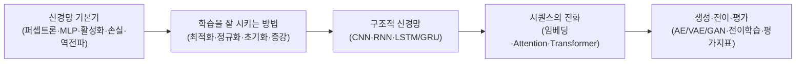

<Callout type="info">
  **이번 문서의 목표:** 독학사 3단계라는 시험 단계와 「딥러닝」 과목의 성격을 파악하고, 국가평생교육진흥원 출제기준 문서를 스스로 읽어 이 시리즈 28편의 학습 순서와 연결 지을 수 있게 한다.
</Callout>

## 독학사 3단계는 어떤 시험인가

> **쉽게 말하면:** 독학사 3단계는 전공을 깊이 다루는 단계이고, 「딥러닝」은 그중 컴퓨터공학·정보통신 계열 전공에서 채택되는 전공심화 과목이다.

독학사(독학에 의한 학위취득시험, 정식 명칭 **독학학위제**)는 대학을 다니지 않고도 국가가 정한 시험 단계를 순서대로 통과하면 학사 학위를 받을 수 있는 제도다. 국가평생교육진흥원(National Institute for Lifelong Education, 학교 밖 교육을 지원·관리하는 국가 기관)이 주관하며, 전체 시험은 4단계로 구성된다.

- **1단계 교양과정 인정시험**: 대학 1~2학년 교양 수준.
- **2단계 전공기초과정 인정시험**: 전공의 기초가 되는 과목들. 컴퓨터공학 계열에서는 자료구조·이산수학·머신러닝 등이 여기 속한다.
- **3단계 전공심화과정 인정시험**: 전공을 깊이 있게 다루는 과목들. 이 시리즈가 다루는 「딥러닝」이 여기에 해당한다.
- **4단계 학위취득 종합시험**: 마지막 종합 평가. 이 단계까지 통과하면 학사 학위가 나온다.

3단계는 2단계보다 한 단계 더 전문화된 내용을 다룬다는 뜻이지, 난이도가 무작정 어렵다는 뜻은 아니다. 다만 「딥러닝」은 신경망(neural network, 사람의 신경세포 연결 구조를 본떠 만든 계산 모델) 자체가 여러 수학적 개념(선형대수·미적분·확률통계) 위에 쌓이는 과목이라, **선행 지식이 정확히 서 있어야 다음 개념이 이해된다**는 점에서 다른 전공심화 과목보다 개념 간 의존이 촘촘하다.

<Callout type="warning">
  독학사 각 단계의 정확한 응시 자격, 과목 조합, 연간 시행 횟수는 국가평생교육진흥원의 **최신 공고를 확인해야 한다**. 이 문서는 학습 전략 수립을 위한 구조 설명이며, 접수 일정이나 응시 자격 같은 행정 정보의 최종 확인처는 언제나 공식 공고다.
</Callout>

## 「딥러닝」 과목이 다루는 범위

독학사 3단계 「딥러닝」은 신경망 기반 학습 방법 전반을 다루는 과목이다. 같은 계열의 2단계 「머신러닝」이 회귀·트리·서포트 벡터 머신(SVM, Support Vector Machine) 같은 고전적 기법에 무게를 둔다면, 3단계 「딥러닝」은 **여러 층으로 쌓은 신경망**과 그 학습 방법인 역전파(backpropagation, 오차를 출력층에서 입력층 방향으로 거꾸로 전달해 가중치를 갱신하는 절차)를 중심으로 한다. 이 시리즈의 목차를 기준으로 출제범위를 다섯 덩어리로 나누면 다음과 같다.

다섯 덩어리는 순서대로 서로를 필요로 한다. 예를 들어 CNN(Convolutional Neural Network, 합성곱 신경망)의 학습 원리를 이해하려면 역전파(A 덩어리)를 먼저 알아야 하고, Transformer의 Self-Attention을 이해하려면 RNN·LSTM(C 덩어리)이 왜 한계를 가지는지 먼저 알아야 한다. 이 시리즈의 본론 편(05~20편)이 이 순서를 그대로 따라가는 이유가 여기 있다.

### 문항 유형: 개념형·계산형·서술형

독학사 3단계는 1·2단계와 달리 **서술형(주관식)** 문항이 함께 출제되는 경우가 많다는 점이 특징이다. 정확한 문항 구성비는 회차마다 다를 수 있으므로 공고 확인이 필요하지만, 유형 자체는 크게 셋으로 나뉜다.

| 유형 | 무엇을 묻는가 | 준비 방법 |
|------|--------------|-----------|
| 개념형 | 용어의 정의, 두 개념의 차이 (예: 배치 정규화와 층 정규화의 차이) | 비슷한 두 개념을 짝지어 경계선을 명확히 하는 방식으로 정리 |
| 계산형 | 역전파 1스텝 갱신, CNN 출력 크기, 혼동행렬에서 정밀도·재현율 계산 | 공식 암기를 넘어 대입부터 답까지 손으로 여러 번 반복 |
| 서술형 | "과적합을 줄이는 방법을 두 가지 이상 설명하라" 같은 논술형 답안 요구 | 핵심 용어를 포함한 완결된 문장으로 답안 구조 만들기(04편에서 다룬다) |

개념형과 서술형은 겹치는 부분이 많다. 개념을 정확히 설명할 수 있으면 객관식 개념형 문항도, 서술형 문항도 함께 대비된다. 계산형은 이 시리즈 전체에서 **중간 단계를 생략하지 않고** 보여주는 방식으로 연습한다.

## 출제기준을 읽는 법

국가평생교육진흥원은 과목마다 **출제기준**(평가영역)을 공고한다. 출제기준은 보통 큰 영역(대영역) 아래 세부 항목(중·소영역)이 나열되는 계층 구조로 되어 있고, 각 항목이 시험 문항과 직접 연결된다. 출제기준을 읽을 때는 다음 순서로 접근하는 것이 효율적이다.

<Steps>
1. **대영역 목록을 먼저 훑는다**: 「딥러닝」이라면 보통 "신경망 기초", "학습 알고리즘", "합성곱 신경망", "순환 신경망", "최신 신경망 구조", "평가와 응용" 같은 큰 갈래로 나뉜다. 이 시리즈의 다섯 덩어리 구조도 이 갈래를 참고해 짰다.
2. **세부 항목에서 동사에 주목한다**: "설명할 수 있다", "계산할 수 있다", "비교할 수 있다"처럼 항목마다 요구하는 행동이 다르다. "계산할 수 있다"로 끝나는 항목은 계산형 문항으로 나올 가능성이 높다는 신호다.
3. **이 시리즈의 목차와 항목을 대응시킨다**: 02_목차.md의 "다루는 개념" 열이 출제기준 항목과 겹치도록 설계되어 있다. 공식 출제기준을 확인한 뒤 이 시리즈의 어느 편이 그 항목을 다루는지 표시해 두면 빠진 부분을 스스로 점검할 수 있다.
4. **회차별 변경 여부를 확인한다**: 출제기준은 개정될 수 있다. 특히 Transformer·생성 모델처럼 비교적 최근에 표준 커리큘럼에 들어온 주제는 항목 문구가 회차마다 조금씩 달라질 수 있으므로, 응시 회차의 최신 공고를 반드시 다시 확인한다.
</Steps>

<Callout type="warning">
  이 시리즈는 국가평생교육진흥원의 공개 출제기준(평가영역) 구조를 바탕으로 재구성한 커리큘럼이다. 실제 문항이나 기출 원문을 그대로 옮기지 않으며, 25~27편의 기출·모의 문제도 출제기준에 근거해 새로 구성한 문항이다. 정확한 최신 항목명과 세부 배점은 **공고 확인 필요**하다.
</Callout>

## 이 과목과 2단계 「머신러닝」의 경계

2단계 「머신러닝」과 3단계 「딥러닝」을 함께 준비하는 수험생이라면 두 과목의 경계를 분명히 해 두는 것이 중요하다.

- **2단계 「머신러닝」**: 선형/로지스틱 회귀, 결정 트리, SVM, 군집화(clustering) 같은 **신경망 이전** 기법과 그 수학적 기반.
- **3단계 「딥러닝」(이 시리즈)**: 퍼셉트론부터 시작해 MLP·CNN·RNN·Transformer·생성 모델까지 **여러 층 신경망**과 그 학습 방법.

같은 용어(예: 손실 함수, 정규화, 평가지표)가 양쪽 과목에 모두 등장할 수 있지만, 이 시리즈에서는 신경망 맥락에서 다시 정리한다. 예를 들어 정규화(regularization)는 2단계에서는 회귀 계수를 억제하는 기법으로, 이 시리즈 09편에서는 L1/L2뿐 아니라 Dropout·Early Stopping·Batch Normalization까지 포함하는 더 넓은 개념으로 다룬다.

## 자주 틀리는 점

- **3단계를 "더 어려운 시험"으로만 이해**: 3단계는 난이도보다 **다루는 전공 영역의 전문성**이 올라가는 단계다. 개념 간 의존이 촘촘하다는 뜻이지, 문항 자체가 무조건 더 계산이 복잡하다는 뜻은 아니다.
- **머신러닝과 딥러닝을 같은 시험 범위로 착각**: 두 과목은 응시 단계(2단계·3단계)가 다른 별개 과목이다. 신경망 이전 기법은 이 시리즈의 범위 밖이며, 필요하면 03편에서 관계만 정리하고 넘어간다.
- **출제기준을 안 읽고 목차만 신뢰**: 이 시리즈는 공개된 출제기준 구조를 참고해 만들었지만, 응시 회차의 최신 공고와 반드시 대조해야 빠진 항목이 없는지 확인할 수 있다.

## 핵심 정리

- 독학사는 1~4단계로 구성되며, 「딥러닝」은 3단계 전공심화과정 과목이다.
- 이 과목은 신경망 기본기 → 학습을 잘 시키는 방법 → 구조적 신경망(CNN·RNN) → 시퀀스·Attention·Transformer → 생성·전이·평가 순으로 논리적으로 이어진다.
- 문항은 개념형·계산형·서술형으로 나뉘며, 3단계부터는 서술형 비중이 커질 수 있다.
- 출제기준은 대영역 → 세부 항목(동사 주목) → 이 시리즈 목차와 대응 → 최신 공고 재확인 순서로 읽는다.
- 2단계 「머신러닝」(신경망 이전)과 3단계 「딥러닝」(신경망 이후)은 응시 단계가 다른 별개 과목이다.

## 마무리 복습

<Quiz
  questionNumber={1}
  question="독학사 제도에서 3단계가 의미하는 것으로 가장 적절한 것은?"
  options={['대학 1~2학년 교양 수준의 시험', '전공을 깊이 있게 다루는 전공심화과정 인정시험', '전공의 기초가 되는 과목만 다루는 시험', '학위 취득 여부를 결정하는 마지막 종합시험']}
  correctAnswer={2}
  explanation="3단계는 전공심화과정 인정시험으로, 전공을 깊이 다루는 과목들을 평가한다. 이 시리즈가 다루는 딥러닝이 여기에 속한다."
  optionExplanations={['교양 수준은 1단계 교양과정 인정시험에 해당한다.', '정답. 3단계는 전공심화과정 인정시험이다.', '전공 기초는 2단계 전공기초과정 인정시험의 성격이다.', '학위 취득 종합시험은 마지막 단계인 4단계다.']}
/>

<Quiz
  questionNumber={2}
  question="2단계 머신러닝과 3단계 딥러닝의 경계에 대한 설명으로 옳은 것은?"
  options={['두 과목은 완전히 같은 범위를 다루는 동일 과목이다', '머신러닝은 신경망 이후, 딥러닝은 신경망 이전 기법을 다룬다', '머신러닝은 회귀·트리·SVM 같은 신경망 이전 기법을, 딥러닝은 퍼셉트론 이후 여러 층 신경망을 다룬다', '딥러닝 시험에는 회귀·트리·SVM 계산 문제가 핵심으로 출제된다']}
  correctAnswer={3}
  explanation="2단계 머신러닝은 신경망 이전의 고전적 기법을, 3단계 딥러닝은 퍼셉트론부터 시작하는 여러 층 신경망과 그 학습 방법을 중심으로 한다."
  optionExplanations={['두 과목은 응시 단계가 다른 별개 과목이다.', '반대로 설명한 보기다. 머신러닝이 신경망 이전, 딥러닝이 신경망 이후다.', '정답. 신경망 이전과 이후로 범위가 나뉜다.', '회귀·트리·SVM은 이 시리즈(딥러닝)의 범위 밖이다.']}
/>

<Quiz
  questionNumber={3}
  question="출제기준의 세부 항목을 읽을 때 특히 주목해야 할 요소는?"
  options={['항목이 몇 번째 줄에 있는지', '항목 문구에 사용된 동사(설명할 수 있다, 계산할 수 있다 등)', '항목의 글자 수', '항목이 표에 있는지 문단에 있는지']}
  correctAnswer={2}
  explanation="세부 항목의 동사는 그 항목이 어떤 유형(개념형·계산형)의 문항으로 나올 가능성이 높은지 알려주는 신호다."
  optionExplanations={['줄 순서는 출제 가능성과 관계가 없다.', '정답. 동사가 요구하는 행동이 문항 유형의 단서가 된다.', '글자 수는 의미 있는 정보가 아니다.', '표기 형식은 출제 가능성과 무관하다.']}
/>

<Quiz
  questionNumber={4}
  question="독학사 3단계 딥러닝의 문항 유형에 대한 설명으로 옳지 않은 것은?"
  options={['개념형은 용어 정의나 두 개념의 차이를 묻는다', '계산형은 역전파 갱신이나 CNN 출력 크기 계산 등을 다룬다', '서술형은 완결된 문장으로 답안을 구성해야 하는 논술형 문항이다', '3단계는 항상 객관식 문항으로만 구성되며 서술형은 출제되지 않는다']}
  correctAnswer={4}
  explanation="독학사 3단계는 1·2단계와 달리 서술형(주관식) 문항이 함께 출제되는 경우가 많다. 항상 객관식만 나온다는 설명은 옳지 않다."
  optionExplanations={['개념형에 대한 옳은 설명이다.', '계산형에 대한 옳은 설명이다.', '서술형에 대한 옳은 설명이다.', '정답. 3단계는 서술형이 함께 출제될 수 있으므로 옳지 않은 설명이다.']}
/>

<Quiz
  questionNumber={5}
  question="이 시리즈와 국가평생교육진흥원 공식 출제기준의 관계에 대한 설명으로 가장 적절한 것은?"
  options={['이 시리즈의 목차가 공식 출제기준을 완전히 대체하므로 공고를 볼 필요가 없다', '이 시리즈는 공개된 출제기준 구조를 참고해 재구성했으므로 응시 회차의 최신 공고와 대조해야 한다', '기출·모의 편은 실제 기출 문제를 그대로 옮겨 수록했다', '출제기준은 한 번 공고되면 이후 절대 바뀌지 않는다']}
  correctAnswer={2}
  explanation="이 시리즈는 공개된 출제기준 구조를 바탕으로 재구성한 커리큘럼이며, 정확한 최신 항목명과 배점은 응시 회차의 공고를 통해 확인해야 한다."
  optionExplanations={['시리즈 목차는 학습 도구이지 공식 공고를 대체하지 않는다.', '정답. 최신 공고와의 대조가 필요하다.', '기출·모의 편은 출제기준에 근거해 새로 구성한 문항이며 실제 기출을 그대로 옮기지 않는다.', '출제기준은 개정될 수 있으므로 회차별 확인이 필요하다.']}
/>

## 참고 자료

- [국가평생교육진흥원 독학학위제](https://bdes.nile.or.kr)
