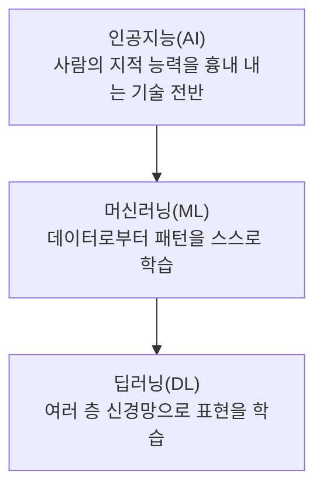
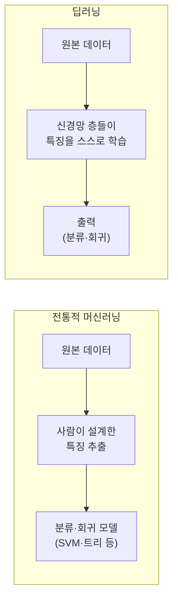

<Callout type="info">
  **이번 문서의 목표:** 머신러닝 안에서 딥러닝이 차지하는 위치를 이해하고, 지도·비지도·강화학습의 차이, 특징 추출과 표현학습의 차이, 딥러닝의 장단점을 설명할 수 있게 한다.
</Callout>

## 인공지능·머신러닝·딥러닝의 포함 관계

> **쉽게 말하면:** 인공지능이 가장 큰 원, 그 안에 머신러닝이라는 원, 그 안에 딥러닝이라는 원이 들어 있는 구조다.

인공지능(AI, Artificial Intelligence, 사람의 지적 능력을 컴퓨터로 흉내 내는 기술 전반)은 규칙을 사람이 직접 짜 넣는 방식(전문가 시스템 등)부터 데이터로부터 규칙을 스스로 찾아내는 방식까지 폭넓게 포함하는 큰 범주다. 그중 **데이터로부터 스스로 패턴을 학습하는 방법**을 머신러닝(Machine Learning, 기계학습)이라 부르고, 머신러닝 중에서도 **여러 층으로 쌓은 신경망**을 사용하는 방법을 딥러닝(Deep Learning)이라고 부른다.

이 시리즈(3단계 딥러닝)는 가장 안쪽 원인 딥러닝에 초점을 맞춘다. 다만 딥러닝도 머신러닝의 한 갈래이므로, 머신러닝 전체를 지배하는 **학습 유형 세 가지**(지도·비지도·강화학습)는 딥러닝에도 그대로 적용된다. 이 개념은 2단계 「머신러닝」 시리즈에서 고전 기법 중심으로 더 깊게 다루므로, 여기서는 딥러닝 맥락에 필요한 만큼만 정리한다.

## 학습 유형 세 가지

### 지도학습

> **쉽게 말하면:** 문제와 정답을 같이 주고, "이 문제를 보면 이 정답을 내라"고 가르치는 방식이다.

지도학습(supervised learning)은 입력 데이터 $x$와 그에 대응하는 정답(레이블, label) $y$가 쌍으로 주어진 데이터셋 $\{(x_1, y_1), (x_2, y_2), \dots, (x_n, y_n)\}$을 이용해, 새로운 입력 $x$가 들어왔을 때 정답 $y$를 예측하는 함수 $f$를 학습하는 방식이다.

- $x$: 입력(예: 이미지 픽셀 값, 문장의 단어 시퀀스)
- $y$: 정답 레이블(예: "고양이"라는 분류, 집값이라는 숫자)
- $n$: 학습에 사용하는 데이터 샘플의 개수
- $f$: 학습을 통해 찾아내려는 예측 함수 (딥러닝에서는 신경망 자체가 $f$의 역할을 한다)

정답이 이산적인 범주(고양이·개·새 등)이면 **분류**(classification), 정답이 연속적인 숫자(집값·기온 등)이면 **회귀**(regression)라고 부른다. 이 시리즈에서 다루는 이미지 분류(CNN, 11~12편), 언어 모델의 다음 단어 예측(RNN·Transformer, 13~15편)은 모두 지도학습의 틀 안에 있다.

### 비지도학습

> **쉽게 말하면:** 정답 없이 데이터만 주고 "여기서 스스로 규칙이나 구조를 찾아내라"고 하는 방식이다.

비지도학습(unsupervised learning)은 레이블 $y$ 없이 입력 데이터 $x$만 주어졌을 때, 데이터 안에 숨어 있는 구조(군집·분포·저차원 표현 등)를 찾아내는 방식이다. 이 시리즈에서는 오토인코더(Autoencoder, 16편)가 대표적인 비지도학습 방법이다. 오토인코더는 입력을 압축했다가 다시 복원하는 과정에서, 사람이 정답을 알려주지 않아도 데이터의 중요한 특징을 스스로 찾아낸다.

### 강화학습

> **쉽게 말하면:** 정답을 직접 알려주지 않고, 행동의 결과로 얻는 보상을 통해 점점 더 나은 행동을 하도록 학습시키는 방식이다.

강화학습(reinforcement learning)은 에이전트(agent, 행동을 선택하는 주체)가 환경(environment)과 상호작용하며 보상(reward)을 최대화하는 방향으로 행동 방식(정책, policy)을 학습하는 방식이다. 알파고(AlphaGo)처럼 게임을 스스로 플레이하며 실력을 늘리는 시스템이 대표적인 예다. 독학사 3단계 「딥러닝」 출제기준에서는 강화학습을 깊게 다루지 않는 경우가 많지만, 세 가지 학습 유형을 구분하는 개념형 문항에는 꾸준히 등장하므로 정의와 예시 정도는 정확히 알아 둔다.

| 학습 유형 | 주어지는 데이터 | 학습 목표 | 딥러닝에서의 예 |
|-----------|------------------|-----------|-------------------|
| 지도학습 | 입력과 정답 쌍 | 입력으로 정답을 예측하는 함수 학습 | 이미지 분류(CNN), 언어 모델(RNN·Transformer) |
| 비지도학습 | 입력만(정답 없음) | 데이터의 숨은 구조·표현 발견 | 오토인코더(AE), 표현 학습 |
| 강화학습 | 상태·행동·보상 | 보상을 최대화하는 행동 정책 학습 | 게임 플레이 에이전트(딥러닝 결합 시 심층강화학습) |

<Callout type="warning">
  GAN(생성적 적대 신경망, 17편)은 생성자와 판별자가 서로 경쟁하며 학습한다는 점에서 강화학습과 헷갈리기 쉽지만, 명시적인 보상 신호나 환경과의 순차적 상호작용이 없다는 점에서 강화학습으로 분류하지 않는다. GAN은 비지도 또는 자기지도(self-supervised) 방식의 생성 모델로 본다.
</Callout>

## 전통적 머신러닝 vs 딥러닝

> **쉽게 말하면:** 전통적 머신러닝은 사람이 먼저 특징을 뽑아 주고, 딥러닝은 신경망이 원본 데이터에서 특징까지 스스로 찾는다.

이미지에서 "고양이인지 아닌지"를 구분하는 문제를 예로 들어 두 접근을 비교해 보자.

- **전통적 머신러닝**: 사람이 먼저 "귀 모양", "털의 질감", "눈동자 색" 같은 특징(feature)을 수치로 뽑아내는 과정(특징 추출, feature extraction)을 설계한다. 그다음 이 수치들을 결정 트리나 SVM 같은 모델에 넣어 분류한다. 특징을 잘 뽑느냐가 성능을 좌우하고, 그 설계는 사람의 도메인 지식에 의존한다.
- **딥러닝**: 원본 이미지 픽셀 값을 그대로 신경망에 입력한다. CNN의 여러 합성곱 층이 학습 과정에서 스스로 "가장자리 → 모서리 → 눈·귀 모양 → 고양이 전체 형태"처럼 점점 더 추상적인 특징을 자동으로 만들어 낸다. 이 과정을 **표현학습**(representation learning, 데이터를 잘 설명하는 특징 자체를 모델이 스스로 학습하는 것)이라고 부른다.

이 차이는 시험에서 "특징 추출을 사람이 하는가 모델이 하는가"라는 형태로 자주 출제된다. 표현학습이 바로 딥러닝을 다른 머신러닝 기법과 구분 짓는 핵심 정체성이라는 점을 기억해야 한다.

## 딥러닝의 장단점

### 장점

- **표현학습을 통한 특징 설계 부담 감소**: 사람이 도메인 지식으로 특징을 일일이 설계하지 않아도, 데이터와 신경망 구조만으로 유용한 특징을 자동으로 찾아낸다.
- **비정형 데이터에 강함**: 이미지·음성·자연어처럼 사람이 특징을 수치로 정의하기 어려운 데이터에서 특히 강력한 성능을 낸다.
- **대량의 데이터·연산 자원이 갖춰지면 성능이 계속 향상**: 데이터와 모델 크기, 연산량(GPU 등)이 늘어날수록 성능이 꾸준히 좋아지는 경향(스케일링 법칙과 관련된 경험적 현상)이 관찰된다.

### 단점

- **많은 데이터와 연산 자원이 필요**: 표현학습을 사람 대신 모델이 하려면 그만큼 많은 데이터와 학습 시간, GPU 같은 연산 자원이 필요하다.
- **해석 가능성이 낮음**: 신경망이 어떤 근거로 특정 출력을 냈는지 사람이 직관적으로 설명하기 어렵다. 이런 특성을 **블랙박스**(black box) 문제라고 부른다.
- **과적합(overfitting, 09편) 위험**: 파라미터 수가 매우 많으므로 데이터가 부족하면 학습 데이터에만 지나치게 맞춰지는 문제가 상대적으로 쉽게 발생한다.
- **적은 데이터·정형 데이터에서는 전통적 머신러닝이 더 나을 수 있음**: 표 형태의 정형 데이터(spreadsheet 형태)이고 데이터 양이 적다면, 오히려 트리 기반 모델 같은 전통적 머신러닝 기법이 더 안정적인 성능을 낼 때가 많다.

## 자주 틀리는 점

- **인공지능 = 머신러닝 = 딥러닝으로 동일시**: 세 개념은 포함 관계(AI ⊃ ML ⊃ DL)에 있는 서로 다른 범주다. "딥러닝은 머신러닝의 한 방법"이라는 표현이 정확하다.
- **비지도학습과 강화학습을 혼동**: 비지도학습은 정답 없이 데이터의 구조를 찾고, 강화학습은 보상 신호를 통해 행동 정책을 학습한다는 점에서 다르다. 둘 다 "정답 레이블이 명시적으로 없다"는 공통점 때문에 혼동하기 쉽다.
- **딥러닝이 항상 전통적 머신러닝보다 우월하다고 단정**: 데이터가 적고 정형화된 문제라면 전통적 머신러닝이 더 적합할 수 있다. "무조건 딥러닝이 낫다"는 진술은 옳지 않은 보기로 자주 등장한다.
- **특징 추출과 표현학습을 같은 것으로 착각**: 특징 추출은 사람이 수행하는 사전 작업, 표현학습은 모델이 학습 과정에서 스스로 수행하는 것이라는 주체의 차이가 핵심이다.

## 핵심 정리

- 인공지능 ⊃ 머신러닝 ⊃ 딥러닝의 포함 관계이며, 딥러닝은 여러 층 신경망을 사용하는 머신러닝의 한 방법이다.
- 학습 유형은 지도학습(입력–정답 쌍), 비지도학습(정답 없이 구조 발견), 강화학습(보상을 통한 정책 학습)으로 나뉜다.
- 전통적 머신러닝은 사람이 특징 추출을 설계하고, 딥러닝은 신경망이 표현학습으로 특징을 스스로 찾는다.
- 딥러닝은 비정형 데이터에 강하지만 많은 데이터·연산 자원이 필요하고 해석 가능성이 낮다는 단점이 있다.
- 데이터가 적고 정형화된 문제에서는 전통적 머신러닝이 더 유리할 수 있다.

## 마무리 복습

<Quiz
  questionNumber={1}
  question="인공지능, 머신러닝, 딥러닝의 관계를 가장 정확히 설명한 것은?"
  options={['세 개념은 서로 독립적인 별개의 분야다', '인공지능이 머신러닝을 포함하고, 머신러닝이 딥러닝을 포함한다', '딥러닝이 머신러닝을 포함하고, 머신러닝이 인공지능을 포함한다', '머신러닝과 딥러닝은 같은 개념이며 인공지능과는 무관하다']}
  correctAnswer={2}
  explanation="딥러닝은 머신러닝의 한 방법이고, 머신러닝은 인공지능의 한 갈래이므로 인공지능이 가장 큰 범주이고 그 안에 머신러닝, 그 안에 딥러닝이 포함되는 구조다."
  optionExplanations={['세 개념은 포함 관계에 있으며 독립적이지 않다.', '정답. 인공지능 ⊃ 머신러닝 ⊃ 딥러닝의 포함 관계다.', '포함 관계가 반대로 서술되었다.', '머신러닝과 딥러닝은 동일한 개념이 아니며 인공지능과도 무관하지 않다.']}
/>

<Quiz
  questionNumber={2}
  question="다음 중 지도학습의 예로 가장 적절한 것은?"
  options={['정답 레이블 없이 고객 데이터를 군집으로 나누는 작업', '이미지와 그에 대응하는 분류 레이블을 함께 학습해 새 이미지를 분류하는 작업', '게임 환경에서 보상을 최대화하도록 행동을 학습하는 작업', '데이터 자체의 압축·복원 과정에서 특징을 찾는 오토인코더']}
  correctAnswer={2}
  explanation="지도학습은 입력과 정답(레이블) 쌍을 이용해 예측 함수를 학습하는 방식이다. 이미지와 분류 레이블을 함께 학습하는 것이 지도학습의 전형적인 예다."
  optionExplanations={['정답 레이블이 없는 군집화는 비지도학습의 예다.', '정답. 입력-정답 쌍을 이용한 지도학습의 예다.', '보상을 통한 학습은 강화학습의 예다.', '오토인코더는 정답 레이블 없이 학습하는 비지도학습의 예다.']}
/>

<Quiz
  questionNumber={3}
  question="전통적 머신러닝과 딥러닝의 차이에 대한 설명으로 옳지 않은 것은?"
  options={['전통적 머신러닝은 대체로 사람이 설계한 특징 추출 과정을 거친다', '딥러닝은 표현학습을 통해 신경망이 특징을 스스로 찾아낸다', '딥러닝은 데이터가 적고 정형화된 문제에서도 항상 전통적 머신러닝보다 우수하다', '딥러닝은 비정형 데이터(이미지·음성·자연어)에서 강력한 성능을 보이는 경우가 많다']}
  correctAnswer={3}
  explanation="딥러닝이 항상 전통적 머신러닝보다 우수한 것은 아니다. 데이터가 적고 정형화된 문제에서는 트리 기반 모델 같은 전통적 머신러닝이 더 안정적인 성능을 낼 수 있다."
  optionExplanations={['전통적 머신러닝에 대한 옳은 설명이다.', '표현학습에 대한 옳은 설명이다.', '정답. 딥러닝이 항상 우월하다는 진술은 옳지 않다.', '딥러닝의 장점에 대한 옳은 설명이다.']}
/>

<Quiz
  questionNumber={4}
  question="GAN(생성적 적대 신경망)을 강화학습으로 분류하지 않는 이유로 가장 적절한 것은?"
  options={['GAN은 신경망을 전혀 사용하지 않기 때문이다', 'GAN에는 명시적인 보상 신호와 환경과의 순차적 상호작용이 없기 때문이다', 'GAN은 지도학습이므로 강화학습과 구분할 필요가 없기 때문이다', 'GAN은 딥러닝이 아니라 전통적 머신러닝 기법이기 때문이다']}
  correctAnswer={2}
  explanation="GAN은 생성자와 판별자가 경쟁하며 학습하지만, 강화학습에서 요구하는 명시적 보상 신호나 환경과의 순차적 상호작용 구조를 갖지 않으므로 강화학습으로 분류하지 않는다."
  optionExplanations={['GAN은 신경망(생성자·판별자)을 사용하는 딥러닝 기법이다.', '정답. 보상 신호와 순차적 상호작용의 부재가 이유다.', 'GAN은 정답 레이블이 필수가 아닌 비지도·자기지도 방식에 가깝다.', 'GAN은 딥러닝 기반의 생성 모델이다.']}
/>

<Quiz
  questionNumber={5}
  question="표현학습(representation learning)에 대한 설명으로 가장 정확한 것은?"
  options={['사람이 도메인 지식을 이용해 특징을 미리 설계하는 과정', '모델이 학습 과정에서 데이터를 잘 설명하는 특징 자체를 스스로 찾아내는 과정', '학습이 끝난 모델의 파라미터를 다른 문제에 재사용하는 과정', '데이터를 여러 배치로 나누어 순차적으로 학습시키는 과정']}
  correctAnswer={2}
  explanation="표현학습은 모델, 특히 딥러닝의 신경망이 학습 과정에서 데이터를 잘 설명하는 특징을 스스로 찾아내는 것을 가리키며, 이는 사람이 특징을 설계하는 전통적 머신러닝과 대비된다."
  optionExplanations={['이는 전통적 머신러닝의 특징 추출에 대한 설명이다.', '정답. 표현학습은 모델이 특징을 스스로 학습하는 과정이다.', '이는 전이학습(18편)에 대한 설명에 가깝다.', '이는 미니배치 학습 방식에 대한 설명이다.']}
/>

## 참고 자료

- [Deep Learning (Goodfellow, Bengio, Courville)](https://www.deeplearningbook.org)
- [scikit-learn: Machine Learning in Python](https://scikit-learn.org/stable/)
