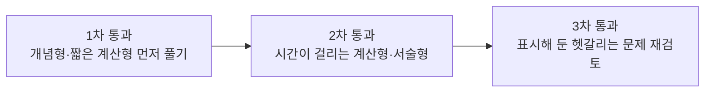

<Callout type="info">
  **이번 문서의 목표:** 딥러닝 시험에서 반복되는 객관식 함정 패턴을 알아채고, 계산형 문제를 빠뜨리지 않고 푸는 루틴과 서술형 답안을 구성하는 방법, 제한 시간 안에서 문제 유형별로 시간을 배분하는 전략을 세울 수 있게 한다.
</Callout>

## 왜 "시험 스킬"을 별도 편으로 다루는가

> **쉽게 말하면:** 개념을 알아도 시험장에서 실수하면 틀린다. 이 편은 "아는 것을 정확히 답으로 옮기는 기술"을 다룬다.

지금까지 01~03편에서 시험 구조와 용어, 머신러닝과의 관계를 정리했다. 이 편은 **내용이 아니라 시험 응시 기술**을 다룬다는 점에서 다른 편과 성격이 다르다. 독학사 3단계는 개념형·계산형·서술형이 섞여 나오므로(01편 참고), 세 유형 각각에 맞는 접근법을 미리 훈련해 두지 않으면 아는 내용도 시간 부족이나 실수로 놓치기 쉽다.

## 객관식 함정 유형 다섯 가지

> **쉽게 말하면:** 객관식은 "몰라서" 틀리기도 하지만, "알면서도 보기의 함정에 걸려서" 틀리는 경우가 더 많다.

딥러닝 객관식 문항에서 반복적으로 나타나는 함정 패턴을 정리하면 다음과 같다.

<Steps>
1. **"옳지 않은 것을 고르시오" 유형에서 질문을 놓침**: 보기 넷 중 셋은 맞는 설명이고 하나만 틀린 설명인데, 급하게 읽다가 "옳은 것"을 고르는 착각을 한다. 문제를 읽고 **밑줄이나 표시로 "않은"을 체크**하는 습관을 들인다.
2. **비슷한 개념을 뒤섞은 보기**: 예를 들어 "Dropout은 학습 시에만 적용되고 추론(inference) 시에는 적용되지 않는다"는 옳은 설명이지만, "Batch Normalization은 학습 시에만 적용되고 추론 시에는 전혀 사용되지 않는다"는 틀린 설명이다(추론 시에는 학습 때 계산해 둔 이동평균 통계량을 사용한다). 두 정규화 기법의 학습·추론 시 동작 차이를 정확히 구분해야 걸리지 않는다.
3. **방향을 반대로 뒤집은 보기**: "그라디언트가 양수이면 그 방향으로 파라미터를 이동시켜 손실을 줄인다"처럼 부호나 방향을 반대로 서술한 보기다. 02편에서 정리한 경사하강법 갱신 규칙 $w_{\text{new}} = w_{\text{old}} - \eta \frac{\partial L}{\partial w}$의 **마이너스 부호**를 정확히 기억하고 있어야 걸리지 않는다.
4. **범위를 과장하거나 축소한 보기**: "항상", "모든 경우에", "전혀"처럼 단정적인 표현이 들어간 보기는 예외가 존재하는 경우가 많다. 예를 들어 "딥러닝은 항상 전통적 머신러닝보다 성능이 우수하다"는 03편에서 다룬 것처럼 옳지 않은 진술이다.
5. **숫자나 공식의 일부만 바꿔치기한 보기**: CNN 출력 크기 공식이나 이터레이션 계산처럼 숫자가 들어가는 문제에서, 계산 과정 중 한 단계만 살짝 틀린 값을 보기로 제시한다. 이 경우 **암산으로 어림잡지 말고 끝까지 손으로 계산**해야 함정에 걸리지 않는다.
</Steps>

## 계산형 문제 풀이 루틴

> **쉽게 말하면:** 공식을 떠올리는 것과 정답을 실제로 맞히는 것 사이에는 "대입 → 계산 → 검산"이라는 세 단계가 더 필요하다.

딥러닝 계산형 문제(역전파 1스텝, CNN 출력 크기, 혼동행렬 지표 등)는 다음 네 단계 루틴으로 접근하면 실수를 줄일 수 있다.

<Steps>
1. **필요한 공식을 정확히 떠올린다**: 예를 들어 CNN 출력 크기 공식은 $O = \frac{N - F + 2P}{S} + 1$이다(11편에서 자세히 다룬다). 비슷하게 생긴 공식(풀링 출력 크기 등)과 헷갈리지 않는지 먼저 확인한다.
2. **문제에서 주어진 값을 표로 정리한다**: 입력 크기, 필터 크기, 패딩, 스트라이드처럼 값이 여러 개 주어지는 문제는 머릿속으로만 계산하지 말고 종이에 값을 나열한 뒤 대입한다.
3. **대입부터 답까지 한 줄씩 적는다**: 중간 단계를 건너뛰면 어디서 실수했는지 찾을 수 없다. 아래 예시처럼 분수 계산, 나눗셈, 반올림까지 전부 적는다.
4. **답의 타당성을 검산한다**: 출력 크기가 음수이거나 정수가 아니면 계산이 잘못됐다는 신호다. 확률 값이 0~1 범위를 벗어나거나 정밀도·재현율이 1을 넘는 경우도 마찬가지다.
</Steps>

### 계산 루틴 실전 예시: CNN 출력 크기

입력 이미지 크기 $N = 28$, 필터 크기 $F = 5$, 패딩 $P = 2$, 스트라이드 $S = 1$일 때 출력 크기 $O$를 구해 보자.

$$
O = \frac{N - F + 2P}{S} + 1
$$

- $N$: 입력의 한 변 크기(가로 또는 세로)
- $F$: 필터(커널)의 한 변 크기
- $P$: 패딩(padding, 입력 가장자리에 덧붙이는 0의 두께)
- $S$: 스트라이드(stride, 필터가 한 번에 이동하는 칸 수)

$$
O = \frac{28 - 5 + 2 \times 2}{1} + 1
$$

- 먼저 괄호 안 곱셈: $2 \times 2 = 4$
- 분자 계산: $28 - 5 + 4 = 27$

$$
O = \frac{27}{1} + 1 = 27 + 1 = 28
$$

출력 크기는 $28 \times 28$이 된다. 입력과 출력 크기가 같게 나온 이유는 패딩 $P=2$가 필터 크기 $F=5$에 맞춰 **크기를 유지하는 패딩**(same padding에 가까운 설정)이 되도록 계산되었기 때문이다. 이 계산 절차는 11편에서 다양한 패딩·스트라이드 조합으로 반복 연습한다.

## 서술형(주관식) 답안 구조

> **쉽게 말하면:** 서술형은 아는 것을 나열하는 것이 아니라, "정의 → 이유 → 예시"라는 완결된 흐름으로 써야 점수를 받는다.

독학사 3단계에서 서술형이 출제된다면(정확한 출제 여부와 배점은 공고 확인 필요), 다음과 같은 답안 구조를 쓰는 것이 안전하다.

| 단계 | 내용 | 예시(문제: "과적합을 줄이는 방법을 두 가지 설명하라") |
|------|------|--------------------------------------------------------|
| 1. 정의 | 묻는 개념의 정의를 한 문장으로 먼저 밝힌다 | "과적합이란 모델이 학습 데이터에는 잘 맞지만 새로운 데이터에는 성능이 떨어지는 현상이다." |
| 2. 방법 나열 | 요구한 개수만큼 방법을 명확히 구분해 제시한다 | "첫째, L2 정규화는 손실 함수에 가중치 크기에 비례하는 페널티를 더해 가중치가 지나치게 커지는 것을 억제한다. 둘째, Dropout은 학습 시 일부 노드를 무작위로 꺼서 특정 노드에 과하게 의존하는 것을 막는다." |
| 3. 근거·효과 | 왜 그 방법이 과적합을 줄이는지 메커니즘을 덧붙인다 | "두 방법 모두 모델이 학습 데이터의 세부 잡음까지 암기하지 못하도록 모델의 유효 복잡도를 낮추는 효과를 낸다." |

이 구조를 지키면 채점자 입장에서 "정의를 아는지", "구체적 방법을 아는지", "원리를 이해했는지"를 한 번에 확인할 수 있다. 반대로 용어만 나열하고 근거를 생략하면 부분 점수만 받을 가능성이 높다.

<Callout type="warning">
  서술형 문항의 실제 출제 여부, 배점, 글자 수 제한은 회차 공고에 따라 다르다. 여기서 제시한 답안 구조는 일반적인 서술형 답안 작성 원칙이며, 정확한 출제 형식은 응시 회차의 공식 공고를 확인해야 한다.
</Callout>

## 시간 배분 전략

> **쉽게 말하면:** 모든 문제에 같은 시간을 쓰지 말고, 어려운 계산형 문제는 나중으로 미루는 순서 전략이 필요하다.

시험 시간은 회차마다 다르므로(공고 확인 필요) 절대적인 분 단위 배분보다 **상대적인 순서 전략**을 세우는 것이 더 안전하다.

- **1차 통과**: 정의를 바로 알 수 있는 개념형 문항과 공식 하나로 끝나는 짧은 계산형 문항을 먼저 처리해 확실한 점수를 확보한다.
- **2차 통과**: 여러 단계를 거쳐야 하는 계산형(예: 역전파 1스텝, CNN 여러 층 출력 크기 누적 계산)과 서술형 문항에 집중한다.
- **3차 통과**: 1차에서 답을 확신하지 못해 표시해 둔 문항, 함정 유형이 의심되는 문항을 다시 검토한다.

이 순서를 지키면 시간이 부족해도 "아는 문제를 놓쳐서" 점수를 잃는 상황을 막을 수 있다. 이 시리즈의 25~27편(기출·모의 편)에서 실제 시간 제한을 두고 이 전략을 연습한다.

## 자주 틀리는 점

- **"옳지 않은 것"과 "옳은 것"을 헷갈림**: 문제를 다 풀고 나서야 질문을 잘못 읽었다는 걸 깨닫는 경우가 많다. 문제 읽는 즉시 질문 유형에 표시하는 습관을 들인다.
- **계산 중간 단계를 암산으로 건너뜀**: 딥러닝 계산형 문제는 값이 여러 개 얽혀 있어 암산으로 어림잡으면 함정 보기(숫자만 살짝 다른 오답)에 걸리기 쉽다.
- **서술형에서 정의 없이 방법만 나열**: 정의를 생략하고 바로 방법을 나열하면 채점 기준의 앞부분 점수를 놓칠 수 있다.
- **어려운 문제에 시간을 다 쓰고 쉬운 문제를 놓침**: 시간 배분 전략 없이 문제 순서대로만 풀면, 뒤쪽의 쉬운 개념형 문항을 시간 부족으로 놓칠 위험이 있다.

## 핵심 정리

- 객관식 함정은 "옳지 않은 것" 오독, 비슷한 개념 뒤섞기, 방향(부호) 뒤집기, 과장된 단정 표현, 숫자 바꿔치기의 다섯 유형으로 정리된다.
- 계산형 문제는 공식 확인 → 값 정리 → 한 줄씩 계산 → 답의 타당성 검산의 네 단계 루틴으로 접근한다.
- 서술형은 정의 → 방법 나열 → 근거·효과 순서로 답안을 구성해야 부분 점수를 놓치지 않는다.
- 시간 배분은 개념형·짧은 계산형 → 복잡한 계산형·서술형 → 재검토의 3단계 통과 전략을 따른다.
- 구체적인 시험 시간·배점·문항 구성은 회차 공고 확인 필요하다.

## 마무리 복습

<Quiz
  questionNumber={1}
  question="객관식 함정 유형 중 방향을 반대로 뒤집은 보기의 예로 가장 적절한 것은?"
  options={['Dropout은 학습 시에만 적용되고 추론 시에는 적용되지 않는다', '그라디언트가 양수이면 그 방향으로 파라미터를 이동시켜 손실을 줄인다', 'CNN은 이미지 처리에 널리 사용되는 신경망 구조다', 'L2 정규화는 손실 함수에 페널티를 더한다']}
  correctAnswer={2}
  explanation="경사하강법은 그라디언트의 반대 방향으로 파라미터를 이동시켜 손실을 줄인다. 그라디언트 방향으로 이동한다고 서술한 보기는 부호를 반대로 뒤집은 함정이다."
  optionExplanations={['Dropout의 학습·추론 시 동작에 대한 옳은 설명이다.', '정답. 실제로는 그라디언트의 반대 방향으로 이동해야 손실이 줄어든다.', 'CNN에 대한 옳은 설명이다.', 'L2 정규화에 대한 옳은 설명이다.']}
/>

<Quiz
  questionNumber={2}
  question="입력 크기 N=32, 필터 크기 F=3, 패딩 P=1, 스트라이드 S=1일 때 CNN 출력 크기는?"
  options={['30', '31', '32', '33']}
  correctAnswer={3}
  explanation="O = (N - F + 2P) / S + 1 = (32 - 3 + 2) / 1 + 1 = 31 / 1 + 1 = 31 + 1 = 32이므로 32가 정답이다."
  optionExplanations={['패딩을 더하지 않고 계산한 값에 가깝다.', '마지막에 1을 더하지 않은 값이다.', '정답. (32-3+2)/1+1 = 32.', '계산 과정에서 값을 하나 더 크게 잘못 더한 결과다.']}
/>

<Quiz
  questionNumber={3}
  question="서술형 답안 작성 원칙으로 가장 적절한 것은?"
  options={['용어만 최대한 많이 나열한다', '정의 없이 바로 구체적 방법을 나열한다', '정의를 먼저 밝히고, 구체적 방법을 제시한 뒤, 그 근거와 효과를 설명한다', '분량을 줄이기 위해 근거 설명은 생략한다']}
  correctAnswer={3}
  explanation="서술형은 정의를 먼저 밝히고, 요구한 방법을 명확히 구분해 제시한 다음, 왜 그 방법이 효과가 있는지 근거를 덧붙이는 구조로 작성해야 채점 기준을 고르게 충족할 수 있다."
  optionExplanations={['용어 나열만으로는 이해도를 보여주지 못한다.', '정의를 생략하면 앞부분 채점 기준을 놓칠 수 있다.', '정답. 정의-방법-근거 순서가 채점 기준을 고르게 충족한다.', '근거 설명을 생략하면 원리 이해 여부를 확인받지 못한다.']}
/>

<Quiz
  questionNumber={4}
  question="시험 시간 배분 전략에서 권장하는 순서로 가장 적절한 것은?"
  options={['어려운 계산형 문제부터 순서대로 푼다', '개념형·짧은 계산형을 먼저 풀고, 복잡한 계산형·서술형을 그다음에 풀고, 마지막에 표시한 문항을 재검토한다', '서술형 문제는 시간이 남으면 풀고 아니면 생략한다', '문제 번호 순서를 절대 바꾸지 않고 그대로 푼다']}
  correctAnswer={2}
  explanation="확실한 점수를 먼저 확보하기 위해 개념형·짧은 계산형을 먼저 풀고, 시간이 걸리는 문항을 그다음에, 마지막으로 표시해 둔 문항을 재검토하는 3단계 순서가 시간 부족으로 인한 실점을 줄인다."
  optionExplanations={['어려운 문제부터 풀면 시간 부족으로 쉬운 문제를 놓칠 위험이 있다.', '정답. 확실한 점수 확보 후 어려운 문항, 마지막 재검토 순서가 안전하다.', '서술형을 생략하면 배점을 놓칠 수 있으므로 권장되지 않는다.', '문제 순서를 고정하면 시간 관리에 불리할 수 있다.']}
/>

<Quiz
  questionNumber={5}
  question="다음 중 계산형 문제 풀이 루틴에 대한 설명으로 옳지 않은 것은?"
  options={['필요한 공식을 정확히 떠올리는 것에서 시작한다', '주어진 값을 표나 목록으로 정리한 뒤 대입한다', '시간 절약을 위해 중간 계산 단계는 암산으로 처리하고 최종 답만 적는다', '계산이 끝나면 답의 타당성(범위·부호 등)을 검산한다']}
  correctAnswer={3}
  explanation="계산형 문제는 함정 보기가 숫자를 살짝 바꾼 형태로 자주 출제되므로, 중간 단계를 암산으로 건너뛰지 않고 한 줄씩 적어야 실수를 줄일 수 있다."
  optionExplanations={['공식을 정확히 떠올리는 것은 루틴의 첫 단계로 옳다.', '값을 정리하는 것은 루틴의 옳은 단계다.', '정답. 암산으로 건너뛰면 함정 보기에 걸리기 쉬우므로 옳지 않은 설명이다.', '검산은 루틴의 마지막 단계로 옳다.']}
/>

## 참고 자료

- [국가평생교육진흥원 독학학위제](https://bdes.nile.or.kr)
- [Deep Learning (Goodfellow, Bengio, Courville)](https://www.deeplearningbook.org)
