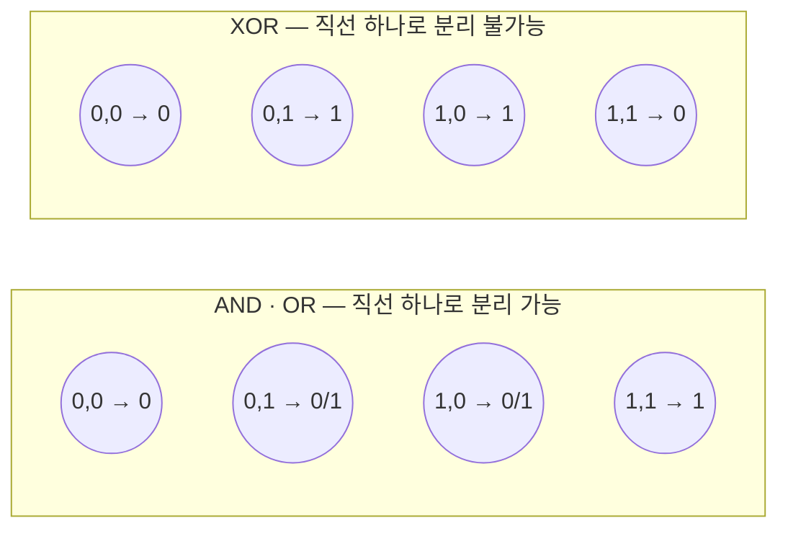
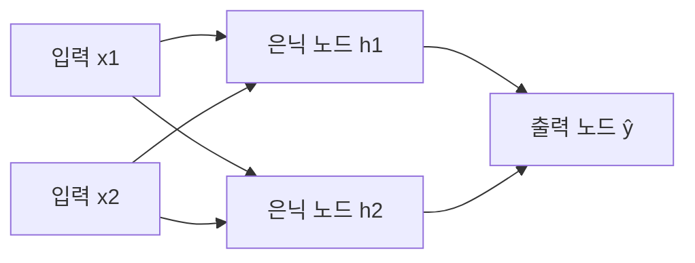

<Callout type="info">
  **이번 문서의 목표:** 이 파일을 다 읽으면 퍼셉트론의 가중치 갱신 규칙을 AND·OR 게이트의 실제 숫자로 몇 에폭(epoch, 학습 데이터 전체를 한 번 도는 단위) 동안 손으로 계산해 수렴시킬 수 있고, 왜 퍼셉트론 하나로는 XOR을 풀 수 없는지 수식으로 증명하며, 다층 퍼셉트론(MLP)의 입력층·은닉층·출력층 구조와 그것이 왜 XOR 문제를 해결하는지 설명할 수 있다.
</Callout>

## 왜 가장 작은 단위부터 봐야 하는가

딥러닝(DL, Deep Learning)의 모든 신경망(neural network)은 결국 아주 단순한 계산 단위를 수없이 많이 쌓아 만든 것이다. 그 가장 단순한 단위가 이 편에서 다룰 **퍼셉트론**(perceptron)이다. 독학사 3단계 딥러닝 시험에서는 "퍼셉트론이 선형분리 가능한 문제만 풀 수 있는 이유는?", "다음 중 퍼셉트론으로 학습할 수 없는 논리 게이트는?"처럼 퍼셉트론의 **한계**를 정확히 아는지 묻는 문항이 자주 나온다. 정의만 외워서는 "왜 안 되는가"를 설명하지 못하므로, 이 편에서는 AND·OR 게이트를 퍼셉트론이 실제로 몇 번 만에 학습해 내는지 숫자로 직접 확인하고, XOR 게이트는 왜 어떤 가중치를 넣어도 풀리지 않는지 부등식으로 증명한 뒤, 그 한계를 넘어서는 다층 퍼셉트론(MLP, Multi-Layer Perceptron) 구조를 소개한다.

## 퍼셉트론의 구조: 입력·가중치·편향·계단함수

> **쉽게 말하면:** 퍼셉트론은 입력값에 각각 중요도(가중치)를 곱해 더한 뒤, 그 합이 어떤 기준선을 넘으면 1, 못 넘으면 0을 출력하는 아주 단순한 판단 장치다.

퍼셉트론(perceptron)은 1958년 프랭크 로젠블랫(Frank Rosenblatt)이 제안한 신경망의 가장 기본 단위로, 생물학적 뉴런(neuron, 신경세포)이 여러 신호를 받아 하나의 신호로 내보내는 과정을 수학적으로 단순화한 모델이다. 퍼셉트론은 다음 네 요소로 이루어진다.

- **입력**(input) $x_1, x_2, \ldots, x_n$: 퍼셉트론이 받는 값들. 예를 들어 논리 게이트라면 $x_1, x_2 \in \{0, 1\}$이다.
- **가중치**(weight) $w_1, w_2, \ldots, w_n$: 각 입력이 결과에 얼마나 영향을 주는지 나타내는 숫자. 가중치가 클수록 그 입력을 더 중요하게 본다는 뜻이다.
- **편향**(bias) $b$: 모든 입력이 0이어도 출력을 얼마나 밀어 올리거나 내릴지 정하는 값. 기하학적으로는 결정 경계(decision boundary, 두 범주를 가르는 선)의 위치를 원점에서 옮기는 역할을 한다.
- **계단함수**(step function, 활성화 함수의 일종): 가중합이 특정 기준을 넘는지에 따라 0 또는 1을 출력하는 함수.

이 네 요소를 합쳐 퍼셉트론의 계산 과정을 두 단계로 쓰면 다음과 같다. 먼저 가중합(net input, 순입력)을 구한다.

$$
z = w_1 x_1 + w_2 x_2 + b
$$

- $z$: 가중합(순입력). 입력들을 가중치로 조합한 하나의 숫자다.
- $w_1, w_2$: 각 입력 $x_1, x_2$에 대한 가중치.
- $b$: 편향.

그다음 이 $z$를 계단함수에 통과시켜 최종 출력 $\hat{y}$(y hat, 모델의 예측값)를 얻는다.

$$
\hat{y} = \begin{cases} 1 & z > 0 \\ 0 & z \le 0 \end{cases}
$$

- $\hat{y}$: 퍼셉트론의 예측 출력(0 또는 1).
- 이 편에서는 기준선을 $z > 0$으로 둔다. 자료에 따라 $z \ge 0$을 쓰기도 하지만, 어느 쪽을 쓰든 편향 $b$가 그 경계를 조정하는 역할은 같다.

**비유로 이해하기:** 퍼셉트론은 여러 사람의 의견(입력)에 각자 다른 신뢰도(가중치)를 곱해 합산한 뒤, 그 합이 어떤 기준점(편향으로 정해지는 문턱)을 넘으면 "찬성", 못 넘으면 "반대"를 선언하는 다수결 위원회와 비슷하다. 편향은 "기본적으로 얼마나 찬성 쪽으로 기울어 있는가"를 나타내는 위원장의 성향이라고 볼 수 있다.

## 퍼셉트론 학습 규칙

> **쉽게 말하면:** 예측이 정답보다 작으면 가중치를 입력 방향으로 키우고, 예측이 정답보다 크면 가중치를 줄인다. 맞았으면 아무것도 바꾸지 않는다.

퍼셉트론은 정답(레이블) $y$와 예측 $\hat{y}$를 비교해 틀렸을 때만 가중치와 편향을 갱신한다. 이 규칙을 **퍼셉트론 학습 규칙**(perceptron learning rule)이라 하며 다음과 같다.

$$
w_i \leftarrow w_i + \eta (y - \hat{y}) x_i
$$

- $w_i$: $i$번째 가중치.
- $\eta$ (에타, learning rate, 학습률): 한 번에 얼마나 크게 갱신할지 정하는 하이퍼파라미터(hyperparameter, 학습 전에 사람이 정하는 값). 이 편의 예시에서는 계산을 단순하게 보이기 위해 $\eta = 1$을 쓴다.
- $y$: 실제 정답(레이블).
- $\hat{y}$: 현재 가중치로 계산한 예측값.
- $(y - \hat{y})$: 오차(error). 정답과 예측이 같으면 0이라 아무 갱신도 일어나지 않는다.
- $x_i$: 갱신 대상 가중치에 대응하는 입력값.

편향은 입력이 항상 1인 특수한 가중치로 볼 수 있으므로 같은 규칙을 따른다.

$$
b \leftarrow b + \eta (y - \hat{y})
$$

## AND 게이트를 실제 숫자로 학습시키기

> **쉽게 말하면:** 처음에는 아무것도 모르는 가중치 0에서 시작해, 틀릴 때마다 정답 쪽으로 조금씩 밀어주면 결국 AND 게이트를 정확히 맞히는 가중치에 도달한다.

AND 게이트는 두 입력이 모두 1일 때만 1을 출력한다.

| $x_1$ | $x_2$ | $y$(정답) |
|---|---|---|
| 0 | 0 | 0 |
| 0 | 1 | 0 |
| 1 | 0 | 0 |
| 1 | 1 | 1 |

초기값을 $w_1 = 0, w_2 = 0, b = 0$, 학습률 $\eta = 1$로 두고 학습을 시작한다. **1 에폭(epoch)은 표의 네 샘플을 위에서 아래로 한 번씩 모두 사용하는 것**을 뜻한다.

### 1 에폭 상세 계산

| 샘플 $(x_1, x_2)$ | $z = w_1x_1+w_2x_2+b$ | $\hat{y}$ | $y$ | 오차 $(y-\hat{y})$ | 갱신 후 $(w_1, w_2, b)$ |
|---|---|---|---|---|---|
| $(0,0)$ | $0$ | $0$ | $0$ | $0$ | $(0, 0, 0)$ (변화 없음) |
| $(0,1)$ | $0$ | $0$ | $0$ | $0$ | $(0, 0, 0)$ (변화 없음) |
| $(1,0)$ | $0$ | $0$ | $0$ | $0$ | $(0, 0, 0)$ (변화 없음) |
| $(1,1)$ | $0$ | $0$ | $1$ | $1$ | $(1, 1, 1)$ |

마지막 샘플 $(1,1)$에서 $z = 0 \cdot 1 + 0 \cdot 1 + 0 = 0$이므로 $z > 0$이 거짓이라 $\hat{y}=0$인데 정답은 $y=1$이다. 오차가 $1$이므로 세 값 모두 $\eta \cdot 1 \cdot x_i$만큼 커진다: $w_1 \leftarrow 0 + 1 \cdot 1 \cdot 1 = 1$, $w_2 \leftarrow 0 + 1 \cdot 1 \cdot 1 = 1$, $b \leftarrow 0 + 1 \cdot 1 = 1$.

### 이후 에폭 요약

같은 방식으로 2 에폭부터 계속 진행하면 다음과 같이 가중치가 바뀐다(각 칸은 그 에폭이 끝난 시점의 값과, 그 에폭에서 오차가 발생한 샘플 수다).

| 에폭 | 에폭 종료 시 $(w_1, w_2, b)$ | 이 에폭에서 틀린 샘플 수 |
|---|---|---|
| 1 | $(1, 1, 1)$ | 1 |
| 2 | $(2, 1, 0)$ | 3 |
| 3 | $(2, 1, -1)$ | 3 |
| 4 | $(2, 2, -1)$ | 2 |
| 5 | $(2, 1, -2)$ | 1 |
| 6 | $(2, 1, -2)$ | 0 |

6 에폭째에 오차가 하나도 없이 전부 맞혔으므로 **수렴**(convergence, 더 이상 가중치가 바뀌지 않는 상태)했다. 최종 가중치 $w_1=2, w_2=1, b=-2$가 실제로 AND를 맞히는지 검산하면 다음과 같다.

$$
z_{(0,0)} = 2(0)+1(0)-2 = -2 \le 0 \Rightarrow \hat{y}=0
$$

$$
z_{(0,1)} = 2(0)+1(1)-2 = -1 \le 0 \Rightarrow \hat{y}=0
$$

$$
z_{(1,0)} = 2(1)+1(0)-2 = 0 \le 0 \Rightarrow \hat{y}=0
$$

$$
z_{(1,1)} = 2(1)+1(1)-2 = 1 > 0 \Rightarrow \hat{y}=1
$$

네 경우 모두 정답 $y$와 일치한다. 즉 직선 $2x_1 + x_2 - 2 = 0$이 $(1,1)$과 나머지 세 점을 정확히 갈라놓는 **결정 경계**가 된 것이다.

## OR 게이트를 실제 숫자로 학습시키기

OR 게이트는 둘 중 하나라도 1이면 1을 출력한다.

| $x_1$ | $x_2$ | $y$(정답) |
|---|---|---|
| 0 | 0 | 0 |
| 0 | 1 | 1 |
| 1 | 0 | 1 |
| 1 | 1 | 1 |

같은 초기값 $w_1=w_2=b=0$, $\eta=1$로 시작해 에폭별 결과만 요약하면 다음과 같다.

| 에폭 | 에폭 종료 시 $(w_1, w_2, b)$ | 이 에폭에서 틀린 샘플 수 |
|---|---|---|
| 1 | $(0, 1, 1)$ | 1 |
| 2 | $(1, 1, 1)$ | 2 |
| 3 | $(1, 1, 0)$ | 1 |
| 4 | $(1, 1, 0)$ | 0 |

OR은 4 에폭 만에 $w_1=1, w_2=1, b=0$으로 수렴한다. 이 결과는 $z = x_1+x_2$가 $0$보다 큰지, 즉 "적어도 하나가 1인가"를 그대로 묻는 것과 같아서 직관과도 잘 맞는다. AND(6 에폭)보다 OR(4 에폭)이 더 빨리 수렴한 것은 우연이 아니라, 초기값 $(0,0,0)$에서 목표로 하는 결정 경계까지의 갱신 경로가 더 짧았기 때문이다 — 학습 속도는 데이터와 초기값의 상대적 위치에 따라 달라진다.

> **자주 틀리는 점:** 퍼셉트론 학습 규칙이 항상 "적게 시도할수록 좋다"는 뜻은 아니다. 에폭 수는 데이터가 얼마나 쉽게 분리되는지, 초기 가중치가 목표에서 얼마나 먼지에 따라 매번 달라진다. 중요한 것은 "선형분리가 가능한 문제라면 유한한 횟수 안에 반드시 수렴한다"는 **퍼셉트론 수렴 정리**(perceptron convergence theorem)의 존재이지, 정확한 에폭 수 자체가 아니다.

## 선형분리 가능성과 XOR의 한계

> **쉽게 말하면:** 퍼셉트론은 2차원 평면 위에 직선 하나를 그어 두 그룹을 나누는 것과 같은 일만 할 수 있다. XOR은 직선 하나로 나눌 수 없는 배치라서 퍼셉트론 하나로는 절대 풀리지 않는다.

퍼셉트론의 결정 경계 $z = w_1x_1+w_2x_2+b=0$은 2차원 평면에서 하나의 **직선**이다. 이 직선으로 정답이 1인 점들과 0인 점들을 완전히 갈라놓을 수 있는 문제를 **선형분리 가능**(linearly separable)하다고 한다. AND와 OR는 앞서 보였듯 실제로 그런 직선(결정 경계)이 존재해서 퍼셉트론이 학습에 성공했다.

XOR(배타적 논리합, exclusive OR) 게이트는 두 입력이 다를 때만 1을 출력한다.

| $x_1$ | $x_2$ | $y$(정답) |
|---|---|---|
| 0 | 0 | 0 |
| 0 | 1 | 1 |
| 1 | 0 | 1 |
| 1 | 1 | 0 |

이 표를 좌표평면에 찍어 보면 $(0,0)$과 $(1,1)$은 한 그룹(정답 0), $(0,1)$과 $(1,0)$은 다른 그룹(정답 1)인데, 이 두 그룹은 정확히 대각선으로 엇갈려 있어 어떤 직선을 그어도 한 그룹만 깔끔하게 분리할 수 없다. 이를 짐작이 아니라 수식으로 증명해 보자. XOR을 만족하는 $w_1, w_2, b$가 존재한다고 가정하면 네 조건이 동시에 성립해야 한다.

$$
(0,0) \to 0: \quad b \le 0
$$

$$
(1,1) \to 0: \quad w_1+w_2+b \le 0
$$

$$
(0,1) \to 1: \quad w_2+b > 0
$$

$$
(1,0) \to 1: \quad w_1+b > 0
$$

세 번째와 네 번째 부등식을 더하면 $w_1+w_2+2b > 0$이 되고, 첫 번째 부등식 $b \le 0$을 이용하면 $w_1+w_2 > -2b \ge 0$이므로 $w_1+w_2 > 0$이어야 한다. 그런데 두 번째 부등식은 $w_1+w_2 \le -b$를 요구하고, $b \le 0$이므로 $-b \ge 0$이라 이 조건 자체는 $w_1+w_2$가 양수여도 만족할 여지가 있어 보인다. 하지만 세 번째·네 번째 부등식을 각각 정리하면 $w_2 > -b$, $w_1 > -b$이고 둘을 더하면 $w_1+w_2 > -2b$인데, 두 번째 부등식은 $w_1+w_2 \le -b$를 요구하므로 두 결과를 합치면 $-2b < w_1+w_2 \le -b$가 되어 $-2b < -b$, 즉 $b > 0$이 강제된다. 이는 첫 번째 조건 $b \le 0$과 정면으로 모순된다. **따라서 네 조건을 동시에 만족하는 $w_1, w_2, b$는 존재하지 않으며, 퍼셉트론 하나로는 XOR을 절대 풀 수 없다.** 이는 1969년 마빈 민스키(Marvin Minsky)와 시모어 페퍼트(Seymour Papert)가 저서 「Perceptrons」에서 지적한 유명한 한계로, 이후 신경망 연구가 한동안 침체되는 계기가 되었다.

## 다층 퍼셉트론(MLP)의 구조와 표현 능력

> **쉽게 말하면:** 직선 하나로 안 되면 직선을 여러 개 겹쳐 쓰면 된다. 퍼셉트론을 층으로 쌓아 은닉층을 하나 더 두면 XOR처럼 구부러진 경계도 표현할 수 있다.

**다층 퍼셉트론**(MLP, Multi-Layer Perceptron)은 퍼셉트론을 한 층에 여러 개 나란히 두고, 그런 층을 다시 여러 겹 쌓은 신경망 구조다. MLP는 크게 세 종류의 층으로 구성된다.

- **입력층**(input layer): 원본 데이터 $x_1, \ldots, x_n$을 그대로 받아들이는 층. 이 층 자체는 계산을 하지 않는다.
- **은닉층**(hidden layer): 입력층과 출력층 사이에서 실제 계산을 수행하는 층. "은닉(hidden)"이라는 이름은 이 층의 출력값이 최종 결과로 직접 드러나지 않고 다음 층의 입력으로만 쓰이기 때문이다. 은닉층은 하나 이상일 수 있으며, 은닉층이 많을수록(그리고 각 은닉층의 노드 수가 많을수록) "깊다(deep)"고 표현하고, 이것이 딥러닝이라는 이름의 유래다.
- **출력층**(output layer): 최종 예측값을 내놓는 층.

각 층의 계산 단위를 **노드**(node) 또는 **유닛**(unit)이라 부르며, 인접한 두 층의 모든 노드가 서로 연결되어 각자의 가중치를 갖는 구조를 **완전연결**(fully connected) 또는 **밀집**(dense) 구조라 한다. 신호는 입력층에서 은닉층을 거쳐 출력층으로 한 방향으로만 흐르는데, 이런 구조를 **전방향 신경망**(feedforward neural network)이라 부른다. 이 계산 흐름을 그림으로 나타내면 다음과 같다.

이 그림은 입력 2개, 은닉 노드 2개, 출력 노드 1개로 이루어진 구조로, 흔히 **2-2-1 구조**라 부른다(각 층의 노드 수를 순서대로 쓴 표기법이다). 은닉층의 각 노드는 입력층과 마찬가지로 가중합을 구한 뒤 활성화 함수를 적용하는데, 이때 계단함수 대신 시그모이드(sigmoid)나 ReLU 같은 매끄러운 활성화 함수를 쓴다 — 그 이유와 각 함수의 차이는 다음 06편에서, 이 2-2-1 구조로 XOR을 실제 숫자로 순전파·역전파하는 전 과정은 07편에서 다룬다.

MLP가 XOR을 풀 수 있는 이유는 직관적으로 이렇게 설명할 수 있다. 은닉 노드 하나가 "OR 비슷한 직선"을, 다른 은닉 노드가 "NAND(AND의 반대) 비슷한 직선"을 각각 학습해 두 직선을 긋고, 출력 노드가 "두 은닉 노드가 동시에 1일 때만 1"이라는 AND 형태의 규칙으로 두 직선의 결과를 다시 조합하면, 두 직선의 조합으로 XOR의 구부러진 경계를 표현할 수 있다. 즉 **은닉층을 하나 추가한다는 것은 "직선 하나"라는 표현력의 한계를 "직선 여러 개의 조합"으로 확장하는 것**이다. 이 성질을 일반화한 것이 **범용 근사 정리**(universal approximation theorem)로, 은닉층이 하나만 있어도 노드 수를 충분히 늘리면 이론적으로 어떤 연속함수든 원하는 정확도로 근사할 수 있다는 정리다. 다만 이 정리는 "가능하다"는 존재성만 보장할 뿐 "그 가중치를 실제로 어떻게 찾는가(학습이 잘 되는가)"는 보장하지 않는다는 점에 유의해야 한다.

> **자주 틀리는 점:** "은닉층이 있으면 무조건 딥러닝이다"라고 오해하기 쉽지만, 은닉층이 1개뿐인 얕은(shallow) MLP도 신경망은 맞지만 관례적으로 "딥"이라 부르지는 않는다. 또한 "MLP는 XOR을 반드시 몇 개의 노드로 풀 수 있다"는 노드 수를 암기하기보다, **은닉층 하나만 추가해도 비선형 결정 경계를 표현할 수 있다는 원리**를 이해하는 것이 시험에서 더 중요하다.

## 핵심 정리

- 퍼셉트론은 입력·가중치·편향의 가중합을 계단함수에 통과시켜 0 또는 1을 출력하는 신경망의 최소 단위다.
- 퍼셉트론 학습 규칙 $w_i \leftarrow w_i + \eta(y-\hat{y})x_i$은 오차가 있을 때만 가중치를 갱신하며, AND는 6 에폭, OR는 4 에폭 만에 수렴한다(초기값·데이터에 따라 에폭 수는 달라질 수 있다).
- 퍼셉트론의 결정 경계는 직선 하나이므로 선형분리가 가능한 문제만 풀 수 있고, XOR은 부등식 모순으로 증명되듯 선형분리가 불가능해 퍼셉트론 하나로는 풀 수 없다.
- 다층 퍼셉트론(MLP)은 은닉층을 추가해 여러 직선을 조합함으로써 비선형 문제를 표현할 수 있으며, 이는 범용 근사 정리로 뒷받침된다.

## 마무리 복습

<Quiz
  questionNumber={1}
  question="퍼셉트론의 가중합 z = w1x1 + w2x2 + b에서 편향(bias) b의 역할로 가장 옳은 것은?"
  options={['입력값의 중요도를 나타낸다', '결정 경계의 위치를 조정한다', '활성화 함수의 종류를 결정한다', '학습률의 크기를 결정한다']}
  correctAnswer={2}
  explanation="편향 b는 모든 입력이 0이어도 가중합에 더해지는 값으로, 결정 경계(z=0인 직선)를 원점에서 평행하게 이동시키는 역할을 한다."
  optionExplanations={['입력값의 중요도는 가중치 w의 역할이다', '편향이 결정 경계의 위치를 조정한다는 것이 옳은 설명이다', '활성화 함수 종류는 편향과 무관하게 별도로 정해진다', '학습률은 별도의 하이퍼파라미터 η가 담당한다']}
/>

<Quiz
  questionNumber={2}
  question="가중치 w1=0, w2=0, b=0에서 시작해 AND 게이트를 학습률 η=1로 학습할 때, 1 에폭째에 오차가 발생하는 샘플은?"
  options={['(0,0)', '(0,1)', '(1,0)', '(1,1)']}
  correctAnswer={4}
  explanation="초기 가중치가 모두 0이면 (0,0), (0,1), (1,0)에서는 z=0이라 예측이 0이 되어 정답과 일치하지만, (1,1)에서는 정답이 1인데도 z=0이라 예측이 0이 되어 오차가 발생한다."
  optionExplanations={['(0,0)의 정답은 0이고 예측도 0이라 오차가 없다', '(0,1)의 정답은 0이고 예측도 0이라 오차가 없다', '(1,0)의 정답은 0이고 예측도 0이라 오차가 없다', '(1,1)의 정답은 1인데 초기 가중치로는 예측이 0이 되어 오차가 발생하는 것이 정답이다']}
/>

<Quiz
  questionNumber={3}
  question="퍼셉트론이 XOR 게이트를 학습할 수 없는 근본적인 이유는?"
  options={['XOR의 정답이 0과 1로만 이루어져 있어서', 'XOR을 만족하는 하나의 직선(결정 경계)이 존재하지 않아서', '학습률을 잘못 설정해서', '입력이 2개뿐이라서']}
  correctAnswer={2}
  explanation="퍼셉트론의 결정 경계는 직선 하나이며, XOR의 네 데이터 점은 어떤 직선으로도 두 그룹으로 완전히 분리할 수 없다는 것이 부등식 모순으로 증명된다. 이를 선형분리 불가능이라 한다."
  optionExplanations={['AND·OR도 정답이 0과 1뿐이지만 학습에 성공하므로 이 이유는 아니다', '직선 하나로 XOR을 분리할 수 없다는 것이 근본 이유이므로 정답이다', '학습률을 아무리 조정해도 애초에 만족하는 직선이 존재하지 않으므로 해결되지 않는다', '입력 개수는 AND·OR와 동일하게 2개이므로 이유가 될 수 없다']}
/>

<Quiz
  questionNumber={4}
  question="다층 퍼셉트론(MLP)에서 은닉층(hidden layer)에 대한 설명으로 옳은 것은?"
  options={['원본 입력을 그대로 다음 층에 전달하기만 하는 층이다', '최종 예측값을 직접 출력하는 층이다', '입력층과 출력층 사이에서 계산을 수행하며 그 결과가 최종 출력으로 직접 드러나지 않는 층이다', '반드시 하나만 존재해야 하는 층이다']}
  correctAnswer={3}
  explanation="은닉층은 입력층에서 받은 값을 가중합하고 활성화 함수를 적용해 계산한 결과를 다음 층에 넘기는 층으로, 그 계산 결과 자체는 최종 출력으로 직접 드러나지 않는다는 뜻에서 은닉(hidden)이라 부른다."
  optionExplanations={['입력을 그대로 전달하기만 하는 것은 입력층의 특징이다', '최종 예측값을 직접 출력하는 것은 출력층의 역할이다', '은닉층의 정의와 정확히 일치하므로 정답이다', '은닉층은 하나 이상 여러 개 쌓을 수 있으며 개수에 제한이 없다']}
/>

<Quiz
  questionNumber={5}
  question="MLP가 은닉층을 추가함으로써 XOR과 같은 문제를 풀 수 있게 되는 이유를 가장 잘 설명한 것은?"
  options={['학습 속도가 빨라지기 때문에', '여러 개의 선형 결정 경계를 조합해 비선형 경계를 표현할 수 있기 때문에', '입력 데이터의 개수가 늘어나기 때문에', '활성화 함수가 사라지기 때문에']}
  correctAnswer={2}
  explanation="은닉층의 각 노드가 각각 직선 형태의 결정 경계를 학습하고, 출력층이 이 직선들의 결과를 다시 조합함으로써 하나의 직선으로는 표현할 수 없는 비선형 경계를 표현할 수 있게 된다."
  optionExplanations={['학습 속도 향상은 은닉층 추가의 직접적인 목적이 아니다', '여러 직선의 조합으로 비선형 경계를 표현한다는 것이 핵심 이유이므로 정답이다', '입력 데이터 개수는 은닉층 추가와 무관하다', '은닉층에도 활성화 함수가 반드시 필요하며 사라지지 않는다']}
/>

<Quiz
  questionNumber={6}
  question="퍼셉트론 학습 규칙 wi ← wi + η(y-ŷ)xi에 대한 설명으로 옳지 않은 것은?"
  options={['예측 ŷ이 정답 y와 같으면 가중치가 갱신되지 않는다', '학습률 η이 클수록 한 번의 갱신 폭이 커진다', '이 규칙은 선형분리가 불가능한 문제에서도 항상 유한한 횟수 안에 수렴을 보장한다', '오차(y-ŷ)의 부호에 따라 가중치가 커지거나 작아진다']}
  correctAnswer={3}
  explanation="퍼셉트론 수렴 정리는 선형분리가 가능한 문제에서만 유한한 횟수 안의 수렴을 보장한다. XOR처럼 선형분리가 불가능한 문제에서는 아무리 반복해도 수렴하지 않는다."
  optionExplanations={['오차가 0이면 갱신량도 0이 되어 옳은 설명이다', '학습률이 갱신 폭을 결정하는 것은 옳은 설명이다', '선형분리 불가능한 문제에서는 수렴이 보장되지 않으므로 이 설명이 옳지 않은 것(정답)이다', '오차의 부호에 따라 가중치가 늘거나 줄어드는 것은 옳은 설명이다']}
/>

## 참고 자료

- [Ian Goodfellow 외, Deep Learning](https://www.deeplearningbook.org) — 퍼셉트론과 다층 퍼셉트론의 역사·구조·표현 능력 정리
- [국가평생교육진흥원 독학학위제](https://bdes.nile.or.kr) — 독학사 3단계 딥러닝 과목 출제기준 확인
