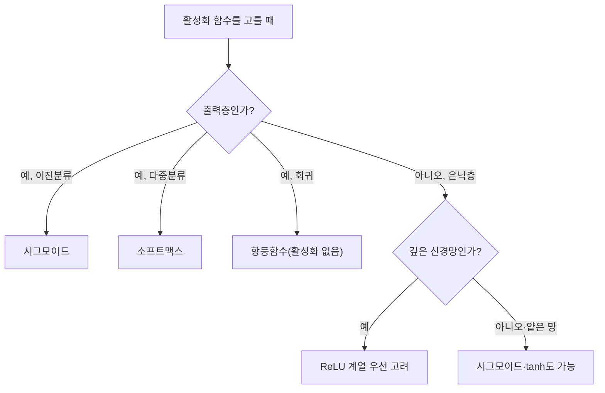

<Callout type="info">
  **이번 문서의 목표:** 이 파일을 다 읽으면 시그모이드·tanh·ReLU·소프트맥스를 같은 입력값에 대해 직접 계산해 비교할 수 있고, 시그모이드·tanh가 왜 기울기 소실을 일으키는지 도함수 값으로 설명하며, 회귀·이진분류·다중분류 문제에서 어떤 손실 함수와 출력층 활성화 함수를 짝지어야 하는지 말할 수 있다.
</Callout>

## 왜 활성화 함수가 필요한가

05편에서 다층 퍼셉트론(MLP)은 은닉층을 쌓아 비선형 문제를 표현할 수 있다고 배웠다. 그런데 만약 은닉층에서 계단함수 대신 아무 활성화 함수도 쓰지 않고 가중합 $z=w_1x_1+w_2x_2+b$를 그대로 다음 층에 전달한다면 어떻게 될까? 선형함수를 아무리 여러 겹 쌓아도 그 합성은 여전히 하나의 선형함수다 — 즉 은닉층을 100개 쌓아도 결국 처음부터 은닉층이 하나도 없는 것과 수학적으로 동일한 표현력만 갖게 된다. 이것이 **활성화 함수**(activation function)가 반드시 필요한 이유다. 활성화 함수는 가중합에 **비선형성**(non-linearity, 직선이 아닌 성질)을 끼워 넣어, 층을 쌓을수록 표현할 수 있는 함수의 종류가 실제로 늘어나게 만든다. 이 편에서는 대표적인 활성화 함수 네 가지를 같은 입력값으로 직접 계산해 비교하고, 학습을 방해하는 기울기 소실 문제와의 관계를 살핀 뒤, 모델의 출력이 틀렸는지 채점하는 손실 함수(loss function)를 정리한다.

## 활성화 함수 네 가지를 같은 입력으로 계산해 보기

> **쉽게 말하면:** 활성화 함수는 가중합이라는 숫자 하나를 받아 "이 뉴런이 얼마나 활성화되었는가"를 나타내는 또 다른 숫자로 바꿔주는 변환기다. 어떤 변환기를 쓰느냐에 따라 출력의 범위와 학습 속도가 달라진다.

가중합 $z \in \{-2, -1, 0, 1, 2\}$라는 같은 다섯 개 입력값에 대해 네 가지 활성화 함수를 계산해 비교한다.

**시그모이드**(sigmoid)는 어떤 실수든 0과 1 사이로 눌러 담는 S자 모양 함수다.

$$
\sigma(z) = \frac{1}{1+e^{-z}}
$$

- $\sigma$ (시그마, sigma): 시그모이드 함수를 가리키는 기호.
- $e$: 자연상수(약 2.71828). $e^{-z}$는 $z$가 커질수록 0에 가까워지고, $z$가 작아질수록(음수로 커질수록) 매우 커진다.

**하이퍼볼릭탄젠트**(tanh, hyperbolic tangent)는 시그모이드를 -1과 1 사이로 옮기고 원점을 중심으로 대칭이 되게 만든 함수다.

$$
\tanh(z) = \frac{e^{z}-e^{-z}}{e^{z}+e^{-z}}
$$

**ReLU**(Rectified Linear Unit, 정류 선형 유닛)는 음수는 모두 0으로 자르고 양수는 그대로 통과시키는 매우 단순한 함수다.

$$
\text{ReLU}(z) = \max(0, z)
$$

같은 값을 다섯 개 입력에 대해 계산한 결과는 다음과 같다.

| $z$ | $\sigma(z)$ (시그모이드) | $\tanh(z)$ | $\text{ReLU}(z)$ |
|---|---|---|---|
| $-2$ | $0.1192$ | $-0.9640$ | $0$ |
| $-1$ | $0.2689$ | $-0.7616$ | $0$ |
| $0$ | $0.5000$ | $0.0000$ | $0$ |
| $1$ | $0.7311$ | $0.7616$ | $1$ |
| $2$ | $0.8808$ | $0.9640$ | $2$ |

예를 들어 $z=1$일 때 시그모이드는 $\sigma(1) = \frac{1}{1+e^{-1}} = \frac{1}{1+0.3679} = \frac{1}{1.3679} = 0.7311$로 계산된다. 표에서 보듯 시그모이드는 항상 $(0,1)$ 구간에, tanh는 $(-1,1)$ 구간에 값이 눌려 있는 반면, ReLU는 양수 구간에서는 입력을 그대로 통과시켜 값이 무한히 커질 수 있다.

> **비유로 이해하기:** 시그모이드와 tanh는 "아무리 세게 눌러도 정해진 범위(고무줄의 최대 늘어남)를 넘지 못하는 고무줄"과 같고, ReLU는 "밀면 미는 만큼 그대로 나가지만, 반대 방향으로는 아예 움직이지 않는 한쪽 방향 도르래"와 같다.

## 기울기 소실 문제와 활성화 함수의 관계

> **쉽게 말하면:** 시그모이드·tanh는 입력이 조금만 커지거나 작아져도 기울기(그래프의 경사)가 거의 0이 되어버려서, 층을 깊게 쌓으면 이 작은 기울기들이 곱해지며 앞쪽 층까지 거의 아무 신호도 전달되지 않는다.

07편에서 배울 역전파(backpropagation)는 각 층의 활성화 함수를 미분한 값(도함수, derivative)을 연쇄적으로 곱해 가며 앞쪽 층의 가중치를 얼마나 바꿀지 계산한다. 그런데 활성화 함수의 도함수 값 자체가 너무 작으면, 여러 층을 거치며 이 작은 값들이 계속 곱해져 최종적으로 0에 가까워지고, 결과적으로 앞쪽(입력에 가까운) 층의 가중치가 거의 갱신되지 않는다. 이 현상을 **기울기 소실**(vanishing gradient)이라 한다.

시그모이드의 도함수는 다음과 같다.

$$
\sigma'(z) = \sigma(z)\bigl(1-\sigma(z)\bigr)
$$

- $\sigma'(z)$ (시그마 프라임): 시그모이드 함수를 $z$에 대해 미분한 도함수. 그래프에서 그 지점의 기울기를 뜻한다.

앞의 표 값을 대입해 도함수를 계산하면 다음과 같다.

| $z$ | $\sigma(z)$ | $\sigma'(z) = \sigma(z)(1-\sigma(z))$ | $1-\tanh^2(z)$ |
|---|---|---|---|
| $-2$ | $0.1192$ | $0.1050$ | $0.0707$ |
| $-1$ | $0.2689$ | $0.1966$ | $0.4200$ |
| $0$ | $0.5000$ | $0.2500$ | $1.0000$ |
| $1$ | $0.7311$ | $0.1966$ | $0.4200$ |
| $2$ | $0.8808$ | $0.1050$ | $0.0707$ |

시그모이드 도함수의 **최댓값은 $z=0$일 때 $0.25$**밖에 되지 않는다. 만약 은닉층이 10개이고 각 층의 도함수가 최댓값인 $0.25$라 하더라도, 역전파 과정에서 이 값들이 곱해지면 $0.25^{10} \approx 0.00000095$로, 사실상 0과 다름없는 값이 된다. tanh는 $z=0$에서 도함수가 $1$로 시그모이드보다 크지만, $|z|$가 조금만 커져도($z=2$에서 $0.0707$) 마찬가지로 매우 작아져 층이 깊어지면 같은 문제를 겪는다. 이렇게 함수의 양 끝에서 도함수가 0에 가까워지는 구간을 **포화**(saturation) 구간이라 한다.

반면 ReLU는 $z>0$인 구간에서 도함수가 항상 정확히 $1$이라(포화되지 않는다) 여러 층을 거쳐도 신호가 줄어들지 않아 깊은 신경망에서 기울기 소실을 크게 완화한다.

$$
\text{ReLU}'(z) = \begin{cases} 0 & z<0 \\ 1 & z>0 \end{cases}
$$

다만 ReLU는 $z<0$인 입력에 대해서는 도함수가 정확히 $0$이 되어, 한 번 음수 쪽으로 크게 치우친 뉴런은 이후 학습에서 계속 $0$만 출력하며 다시는 갱신되지 않는 **죽은 ReLU**(dying ReLU) 문제를 겪을 수 있다. 이를 보완한 것이 **Leaky ReLU**로, 음수 구간에도 아주 작은 기울기 $\alpha$(보통 $0.01$)를 남겨둔다.

$$
\text{LeakyReLU}(z) = \begin{cases} \alpha z & z<0 \\ z & z \ge 0 \end{cases}
$$

같은 입력에 Leaky ReLU($\alpha=0.01$)를 적용하면 $z=-2 \to -0.02$, $z=-1 \to -0.01$처럼 음수에서도 완전히 0이 되지는 않아 그 뉴런이 다시 살아날 여지를 남긴다.

> **자주 틀리는 점:** "ReLU는 항상 시그모이드보다 좋다"고 단정하기 쉽지만, 출력층에서 확률을 나타내야 하는 이진분류·다중분류 문제에는 여전히 시그모이드·소프트맥스가 필요하다. ReLU가 유리한 것은 어디까지나 **은닉층을 깊게 쌓을 때 기울기 소실을 줄이는 측면**이다.

## 소프트맥스: 여러 값을 확률 분포로 바꾸기

> **쉽게 말하면:** 소프트맥스는 여러 개의 점수를 "합이 1이 되는 확률들"로 바꿔주는 함수로, 점수가 클수록 더 큰 확률을 배정하되 나머지 확률도 남겨 둔다.

**소프트맥스**(softmax)는 다중분류(multi-class classification) 문제의 출력층에서 쓰는 함수로, $K$개의 실수 점수(로짓, logit)를 받아 합이 1인 확률 분포로 바꾼다.

$$
\text{softmax}(z_i) = \frac{e^{z_i}}{\sum_{j=1}^{K} e^{z_j}}
$$

- $z_i$: $i$번째 클래스에 대한 로짓(logit, 활성화 함수를 적용하기 전의 원점수).
- $\sum_{j=1}^{K} e^{z_j}$ (시그마, 모두 더하라는 기호): $K$개 클래스 전부의 지수값을 더한 것. 이 값으로 나누어 전체 합이 1이 되게 만든다.

로짓 벡터 $z = (2, 1, 0.1)$(세 개 클래스에 대한 점수)을 예로 계산해 보자.

$$
e^{2}=7.389, \quad e^{1}=2.718, \quad e^{0.1}=1.105
$$

$$
\sum_j e^{z_j} = 7.389+2.718+1.105 = 11.212
$$

$$
\text{softmax}(z) = \left( \frac{7.389}{11.212}, \frac{2.718}{11.212}, \frac{1.105}{11.212} \right) = (0.659,\ 0.242,\ 0.099)
$$

세 확률을 더하면 $0.659+0.242+0.099=1.000$으로 정확히 1이 된다. 가장 큰 로짓이었던 $z_1=2$가 가장 큰 확률($0.659$)을 받았지만, 나머지 클래스도 0이 아닌 확률을 갖는다는 점이 "가장 큰 값만 1, 나머지는 0"으로 처리하는 것과 다르다. 이진분류에서 쓰는 시그모이드는 사실 클래스가 2개(정답/오답)인 소프트맥스의 특수한 경우로 볼 수 있다.

## 손실 함수: 예측이 얼마나 틀렸는지 재는 자

> **쉽게 말하면:** 손실 함수는 모델의 예측과 정답 사이의 거리를 하나의 숫자로 나타내는 채점 기준이며, 이 숫자를 줄이는 방향으로 가중치를 갱신하는 것이 학습이다.

**회귀**(regression, 연속적인 숫자를 예측) 문제에서 가장 널리 쓰는 손실은 **평균제곱오차**(MSE, Mean Squared Error)다.

$$
\text{MSE} = \frac{1}{n}\sum_{i=1}^{n} (y_i - \hat{y}_i)^2
$$

- $n$: 데이터 샘플 개수.
- $y_i$: $i$번째 샘플의 실제 정답값.
- $\hat{y}_i$: $i$번째 샘플에 대한 모델의 예측값.

예를 들어 실제 정답 $y=3$, 예측 $\hat{y}=2.5$인 샘플 하나만 있다면 $\text{MSE} = (3-2.5)^2 = 0.25$다. 오차를 제곱하므로 큰 오차에는 더 큰 벌점을 주고(이상치에 민감), 미분이 매끄러워 경사하강법과 잘 어울린다.

**평균절대오차**(MAE, Mean Absolute Error)는 오차를 제곱하는 대신 절댓값을 쓴다.

$$
\text{MAE} = \frac{1}{n}\sum_{i=1}^{n} |y_i - \hat{y}_i|
$$

같은 예시에서 $\text{MAE} = |3-2.5| = 0.5$다. MAE는 이상치에 MSE보다 덜 민감하지만, $y=\hat{y}$인 지점에서 미분이 불연속(뾰족한 점)이라는 단점이 있다.

**분류**(classification) 문제에서는 **교차엔트로피**(cross-entropy) 손실을 쓴다. 다중분류의 경우 다음과 같다.

$$
L = -\sum_{i=1}^{K} y_i \log(p_i)
$$

- $y_i$: 실제 정답을 원-핫(one-hot, 정답 클래스만 1이고 나머지는 0인 벡터) 형태로 표현했을 때 $i$번째 클래스의 값.
- $p_i$: 모델(소프트맥스 출력)이 예측한 $i$번째 클래스의 확률.
- $\log$: 자연로그.

앞서 계산한 소프트맥스 결과 $p=(0.659, 0.242, 0.099)$에서 실제 정답이 첫 번째 클래스($y=(1,0,0)$)라면, $y_i=0$인 항은 전부 사라지고 정답 클래스 항만 남는다.

$$
L = -\log(0.659) = 0.417
$$

정답 클래스에 배정한 확률이 1에 가까울수록 $-\log(p)$ 값이 0에 가까워져 손실이 작아지고, 확률이 0에 가까울수록 $-\log(p)$가 무한히 커져 큰 벌점을 받는다는 것이 교차엔트로피의 핵심 성질이다.

## 출력층 활성화와 손실 함수의 올바른 조합

> **쉽게 말하면:** 문제 종류에 따라 정해진 짝이 있다 — 회귀는 활성화 없음과 MSE, 이진분류는 시그모이드와 이진 교차엔트로피, 다중분류는 소프트맥스와 교차엔트로피.

| 문제 유형 | 출력층 활성화 | 손실 함수 |
|---|---|---|
| 회귀 | 항등함수(활성화 없음, 그대로 출력) | MSE 또는 MAE |
| 이진분류(클래스 2개) | 시그모이드 | 이진 교차엔트로피(binary cross-entropy) |
| 다중분류(클래스 3개 이상) | 소프트맥스 | (범주형) 교차엔트로피 |

이 조합이 중요한 이유는 활성화 함수와 손실 함수를 함께 미분했을 때 역전파 수식이 매우 단순해지기 때문이다. 실제로 07편에서 다룰 시그모이드+교차엔트로피 조합의 미분은 $(\hat{y}-y)$라는 간단한 형태로 정리된다. 만약 이 조합을 어기고, 예를 들어 다중분류 문제에 시그모이드+MSE를 쓰면 학습이 훨씬 느려지거나 기울기 소실이 심해질 수 있다.

> **자주 틀리는 점:** "분류 문제에는 무조건 MSE를 쓰면 안 된다"고 극단적으로 암기하는 경우가 있는데, 정확히는 "쓸 수는 있지만 교차엔트로피보다 학습이 비효율적"이라는 뜻이다. 반대로 회귀 문제에 교차엔트로피를 쓰는 것은 확률이 아닌 연속값에 로그를 취하는 것이라 정의 자체가 맞지 않으므로 쓰지 않는다.

## 핵심 정리

- 활성화 함수는 신경망에 비선형성을 부여해 층을 쌓는 것이 실제로 의미를 갖게 만든다.
- 같은 입력 $z$에 대해 시그모이드는 $(0,1)$, tanh는 $(-1,1)$ 범위로 값을 눌러 담고, ReLU는 음수를 0으로 자르고 양수는 그대로 통과시킨다.
- 시그모이드·tanh는 $|z|$가 커질수록 도함수가 0에 가까워지는 포화 구간을 가져 깊은 신경망에서 기울기 소실을 일으키며, ReLU는 양수 구간에서 도함수가 항상 1이라 이를 완화하지만 죽은 ReLU 문제가 있을 수 있다.
- 소프트맥스는 여러 로짓을 합이 1인 확률 분포로 바꾸며, 이진분류의 시그모이드는 클래스가 2개인 소프트맥스의 특수한 경우다.
- 회귀는 MSE/MAE, 이진분류는 시그모이드+이진 교차엔트로피, 다중분류는 소프트맥스+교차엔트로피의 조합을 쓴다.

## 마무리 복습

<Quiz
  questionNumber={1}
  question="z=0일 때 시그모이드 함수의 도함수 값은 얼마인가?"
  options={['0', '0.25', '0.5', '1']}
  correctAnswer={2}
  explanation="시그모이드 도함수는 σ'(z)=σ(z)(1-σ(z))이며, z=0에서 σ(0)=0.5이므로 σ'(0)=0.5×0.5=0.25로, 이 값이 시그모이드 도함수의 최댓값이다."
  optionExplanations={['도함수가 0이 되는 것은 z의 절댓값이 매우 클 때(포화 구간)다', '0.5×0.5를 계산하면 0.25가 되므로 정답이다', '0.5는 σ(0) 자체의 값이지 도함수 값이 아니다', '1은 시그모이드가 아니라 z=0에서의 tanh 도함수 값이다']}
/>

<Quiz
  questionNumber={2}
  question="깊은 신경망에서 기울기 소실 문제가 시그모이드보다 ReLU에서 덜 발생하는 핵심 이유는?"
  options={['ReLU는 음수 입력에서도 항상 0이 아닌 값을 출력하기 때문에', 'ReLU는 양수 구간에서 도함수가 항상 1로 포화되지 않기 때문에', 'ReLU는 출력값의 범위가 0과 1 사이로 제한되기 때문에', 'ReLU는 미분이 불가능하기 때문에']}
  correctAnswer={2}
  explanation="ReLU는 z가 양수인 구간에서 도함수가 항상 정확히 1이라 여러 층을 거쳐 곱해져도 값이 줄어들지 않는다. 반면 시그모이드는 z의 절댓값이 커질수록 도함수가 0에 가까워지는 포화 구간을 가져 층이 깊어질수록 기울기가 소실된다."
  optionExplanations={['ReLU는 음수 입력에서 정확히 0을 출력하므로 옳지 않다', 'ReLU 양수 구간의 도함수가 항상 1이라는 것이 기울기 소실을 줄이는 핵심 이유이므로 정답이다', 'ReLU의 출력 범위는 0 이상으로 제한이 없으며, 0과 1 사이로 제한되는 것은 시그모이드다', 'ReLU는 z=0을 제외하면 대부분의 구간에서 미분이 가능하다']}
/>

<Quiz
  questionNumber={3}
  question="로짓 벡터 z=(2, 1, 0.1)에 소프트맥스를 적용했을 때 세 확률의 합은 얼마인가?"
  options={['0', '1', 'e², e¹, e⁰·¹의 합', '입력값에 따라 달라진다']}
  correctAnswer={2}
  explanation="소프트맥스는 각 지수값을 전체 지수값의 합으로 나누도록 정의되어 있어, 계산 결과로 나온 확률들의 합은 로짓 값에 상관없이 항상 정확히 1이 된다."
  optionExplanations={['소프트맥스 확률은 모두 양수이므로 합이 0이 될 수 없다', '분모가 각 항의 합이 되도록 정규화하므로 합은 항상 1이 되며 이것이 정답이다', '그 값은 정규화 전의 분모(11.212)이지 확률의 합이 아니다', '소프트맥스의 정의상 어떤 로짓 값을 넣어도 확률의 합은 항상 1로 고정된다']}
/>

<Quiz
  questionNumber={4}
  question="실제 정답 y=3, 모델 예측 ŷ=2.5인 샘플 하나에 대해 MSE와 MAE를 각각 계산하면?"
  options={['MSE=0.5, MAE=0.25', 'MSE=0.25, MAE=0.5', 'MSE=0.25, MAE=0.25', 'MSE=0.5, MAE=0.5']}
  correctAnswer={2}
  explanation="MSE=(3-2.5)²=0.5²=0.25이고, MAE=|3-2.5|=0.5이다. 오차를 제곱하는 MSE와 절댓값을 취하는 MAE는 같은 오차에 대해 서로 다른 값을 준다."
  optionExplanations={['MSE와 MAE의 값이 서로 바뀌어 있다', '제곱은 0.25, 절댓값은 0.5로 계산되므로 정답이다', 'MAE는 절댓값 0.5이지 0.25가 아니다', 'MSE는 제곱 0.25이지 0.5가 아니다']}
/>

<Quiz
  questionNumber={5}
  question="3개 이상의 클래스를 분류하는 다중분류 문제의 출력층에 일반적으로 짝지어 쓰는 활성화 함수와 손실 함수의 올바른 조합은?"
  options={['시그모이드 + MSE', '항등함수 + MAE', '소프트맥스 + 교차엔트로피', 'ReLU + 이진 교차엔트로피']}
  correctAnswer={3}
  explanation="다중분류는 소프트맥스로 각 클래스에 대한 확률 분포를 만들고, 그 확률과 실제 정답(원-핫 벡터) 사이의 차이를 교차엔트로피 손실로 측정하는 것이 표준 조합이다."
  optionExplanations={['시그모이드+MSE는 회귀나 이진분류에 더 가까운 조합으로 다중분류에는 비효율적이다', '항등함수+MAE는 회귀 문제에 쓰는 조합이다', '소프트맥스+교차엔트로피가 다중분류의 표준 조합이므로 정답이다', 'ReLU는 확률을 표현하지 못하므로 출력층 활성화로 적합하지 않다']}
/>

<Quiz
  questionNumber={6}
  question="교차엔트로피 손실 L = -log(p)에서 정답 클래스에 대한 예측 확률 p가 1에 가까워질수록 손실 L은 어떻게 되는가?"
  options={['무한히 커진다', '0에 가까워진다', '변화가 없다', '음수가 된다']}
  correctAnswer={2}
  explanation="log(1)=0이므로 p가 1에 가까워질수록 -log(p)는 0에 가까워진다. 반대로 p가 0에 가까워질수록 -log(p)는 무한히 커져 큰 벌점을 받는다."
  optionExplanations={['무한히 커지는 것은 p가 0에 가까워질 때의 상황이다', 'p가 1에 가까울수록 log(p)가 0에 가까워지므로 손실도 0에 가까워지는 것이 정답이다', 'p 값에 따라 손실이 뚜렷하게 변하므로 변화가 없다는 것은 옳지 않다', '확률 p는 항상 0과 1 사이이므로 log(p)는 0 이하이고, 앞에 음의 부호가 붙어 손실 L은 항상 0 이상이다']}
/>

## 참고 자료

- [Ian Goodfellow 외, Deep Learning](https://www.deeplearningbook.org) — 활성화 함수·손실 함수의 수식과 기울기 소실 문제 정리
- [scikit-learn User Guide](https://scikit-learn.org/stable/) — 분류·회귀 문제에서 손실 함수 선택 기준 참고
