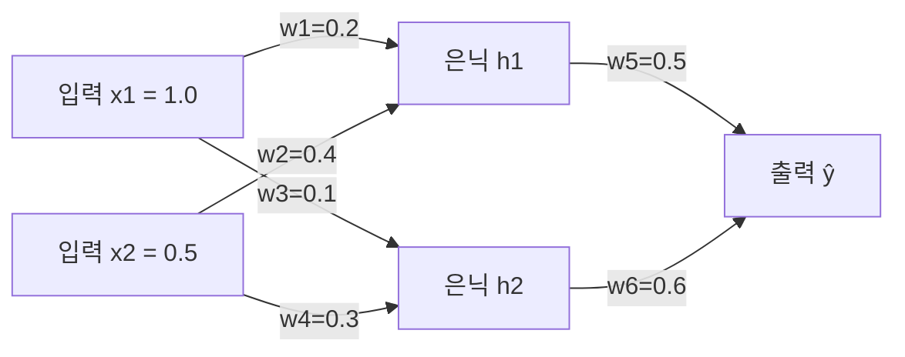
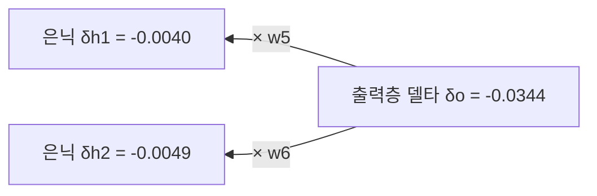

<Callout type="info">
  **이번 문서의 목표:** 이 파일을 다 읽으면 2-2-1 구조의 작은 신경망에서 순전파로 예측값과 손실을 계산하고, 연쇄법칙(chain rule)을 이용한 역전파로 모든 가중치의 기울기를 손으로 구한 뒤, 경사하강법으로 가중치를 한 번 갱신하는 전 과정을 숫자 하나 빠짐없이 재현할 수 있다.
</Callout>

## 왜 이 계산을 손으로 직접 해봐야 하는가

06편까지 활성화 함수와 손실 함수를 각각 따로 살펴봤다. 이 편에서는 그 둘을 하나의 신경망 안에서 실제로 연결해, 입력이 들어가서 예측이 나오기까지의 **순전파**(forward propagation), 그리고 그 예측이 얼마나 틀렸는지를 거슬러 올라가며 모든 가중치의 책임을 나누는 **역전파**(backpropagation)를 숫자로 직접 계산한다. 독학사 시험에서는 작은 신경망을 주고 "은닉층 h1의 가중치 갱신량은?"처럼 중간 계산 단계 하나를 콕 집어 묻는 문제가 나오는데, 공식만 암기하고 실제로 손으로 계산해 본 적이 없으면 첫 단계부터 막힌다. 이 편의 목표는 계산기 없이도(또는 계산기로 검산하며) **대입부터 답까지 한 줄도 건너뛰지 않고** 전체 과정을 따라갈 수 있게 하는 것이다.

## 신경망 구조와 초기값 설정

> **쉽게 말하면:** 입력 2개, 은닉 노드 2개, 출력 노드 1개짜리 아주 작은 신경망 하나를 만들고, 모든 가중치·편향에 구체적인 숫자를 미리 정해 넣는다.

05편에서 소개한 2-2-1 구조(입력 2개, 은닉층 노드 2개, 출력 노드 1개)를 그대로 쓴다. 모든 노드의 활성화 함수는 시그모이드 $\sigma(z) = \frac{1}{1+e^{-z}}$로 통일한다.

이 그림에 대응하는 값을 표로 정리하면 다음과 같다.

| 기호 | 뜻 | 값 |
|---|---|---|
| $x_1, x_2$ | 입력값 | $1.0,\ 0.5$ |
| $w_1, w_2$ | $x_1, x_2 \to h_1$ 가중치 | $0.2,\ 0.4$ |
| $w_3, w_4$ | $x_1, x_2 \to h_2$ 가중치 | $0.1,\ 0.3$ |
| $b_1, b_2$ | 은닉 노드 $h_1, h_2$의 편향 | $0.1,\ 0.2$ |
| $w_5, w_6$ | $h_1, h_2 \to$ 출력 가중치 | $0.5,\ 0.6$ |
| $b_3$ | 출력 노드의 편향 | $0.3$ |
| $y$ | 실제 정답(목표값) | $0.9$ |
| $\eta$ (에타) | 학습률 | $0.5$ |

이 값들은 계산 과정을 보여주기 위해 임의로 정한 작은 숫자이며, 실제 학습에서는 가중치를 이렇게 손으로 정하지 않고 무작위로 초기화한다(초기화 방법은 10편에서 다룬다).

## 1단계 — 순전파: 은닉층 계산

> **쉽게 말하면:** 입력에서 출력까지 화살표 방향대로 가중합을 구하고 활성화 함수를 씌우는 것을 순서대로 반복하면 된다.

먼저 은닉 노드 $h_1$의 가중합을 구한다.

$$
z_{h_1} = w_1 x_1 + w_2 x_2 + b_1 = 0.2(1.0) + 0.4(0.5) + 0.1 = 0.5
$$

이 값을 시그모이드에 통과시켜 $h_1$의 활성화 값을 얻는다.

$$
h_1 = \sigma(z_{h_1}) = \sigma(0.5) = \frac{1}{1+e^{-0.5}} = \frac{1}{1+0.6065} = 0.6225
$$

같은 방식으로 은닉 노드 $h_2$를 계산한다.

$$
z_{h_2} = w_3 x_1 + w_4 x_2 + b_2 = 0.1(1.0) + 0.3(0.5) + 0.2 = 0.45
$$

$$
h_2 = \sigma(z_{h_2}) = \sigma(0.45) = \frac{1}{1+e^{-0.45}} = \frac{1}{1+0.6376} = 0.6107
$$

## 2단계 — 순전파: 출력층 계산

은닉 노드의 출력 $h_1, h_2$를 다시 입력으로 삼아 출력 노드의 가중합을 구한다.

$$
z_o = w_5 h_1 + w_6 h_2 + b_3 = 0.5(0.6225) + 0.6(0.6107) + 0.3 = 0.9777
$$

이 값을 시그모이드에 통과시켜 최종 예측값을 얻는다.

$$
\hat{y} = \sigma(z_o) = \sigma(0.9777) = \frac{1}{1+e^{-0.9777}} = \frac{1}{1+0.3762} = 0.7268
$$

여기까지가 **순전파**다. 입력 $(1.0, 0.5)$에 대해 이 신경망은 $\hat{y}=0.7268$이라는 예측을 내놓았다.

## 3단계 — 손실 계산

> **쉽게 말하면:** 예측과 정답의 차이를 제곱해 절반으로 나눈 값이 이번 예측이 "얼마나 틀렸는지"를 나타내는 손실이다.

06편에서 다룬 평균제곱오차(MSE)를 샘플 하나에 대해 쓰면 다음과 같다(2로 나누는 것은 나중에 미분했을 때 계수를 깔끔하게 만들기 위한 관례다).

$$
L = \frac{1}{2}(y-\hat{y})^2
$$

- $L$: 손실(loss) 값. 이 신경망이 이번 샘플을 얼마나 틀리게 예측했는지 나타내는 하나의 숫자.
- $y=0.9$: 실제 정답.
- $\hat{y}=0.7268$: 방금 순전파로 구한 예측값.

$$
L = \frac{1}{2}(0.9-0.7268)^2 = \frac{1}{2}(0.1732)^2 = \frac{1}{2}(0.03000) = 0.0150
$$

이 손실 $L=0.0150$을 줄이는 방향으로 모든 가중치를 조금씩 바꾸는 것이 역전파와 경사하강법이 하는 일이다.

## 4단계 — 역전파: 연쇄법칙으로 출력층 기울기 구하기

> **쉽게 말하면:** 손실을 각 가중치로 미분한 값(기울기)을 구해야 하는데, 가중치가 손실에 미치는 영향은 여러 함수를 거쳐 간접적으로 전달되므로, 그 경로를 하나씩 따라가며 미분값을 곱해 나간다. 이것이 연쇄법칙이다.

**연쇄법칙**(chain rule)은 $L$이 $\hat{y}$의 함수이고, $\hat{y}$가 $z_o$의 함수이고, $z_o$가 $w_5$의 함수일 때, $L$을 $w_5$로 직접 미분하는 대신 이 사슬을 따라 미분값을 곱해서 구할 수 있다는 미적분의 정리다.

$$
\frac{\partial L}{\partial w_5} = \frac{\partial L}{\partial \hat{y}} \cdot \frac{\partial \hat{y}}{\partial z_o} \cdot \frac{\partial z_o}{\partial w_5}
$$

- $\frac{\partial L}{\partial w_5}$ (편미분, partial derivative): 다른 모든 값은 고정한 채 $w_5$만 아주 조금 바꿨을 때 $L$이 얼마나 바뀌는지 나타내는 기울기.
- 이 기울기를 세 개의 "국소 기울기"(local gradient, 한 단계씩만 떼어서 본 미분값)의 곱으로 나눈 것이 연쇄법칙의 핵심이다.

세 항을 하나씩 계산한다. 첫째, 손실을 예측값으로 미분한다.

$$
\frac{\partial L}{\partial \hat{y}} = \frac{\partial}{\partial \hat{y}}\left[\frac{1}{2}(y-\hat{y})^2\right] = -(y-\hat{y}) = -(0.9-0.7268) = -0.1732
$$

둘째, 예측값을 출력층 가중합으로 미분한다. 시그모이드의 도함수 공식 $\sigma'(z)=\sigma(z)(1-\sigma(z))$을 그대로 적용한다.

$$
\frac{\partial \hat{y}}{\partial z_o} = \hat{y}(1-\hat{y}) = 0.7268(1-0.7268) = 0.7268 \times 0.2732 = 0.1986
$$

이 두 항을 미리 곱해 둔 것을 **출력층 델타**(delta, 그 노드가 손실에 대해 갖는 책임의 크기)라 부르고 $\delta_o$로 표기한다.

$$
\delta_o = \frac{\partial L}{\partial \hat{y}} \cdot \frac{\partial \hat{y}}{\partial z_o} = -0.1732 \times 0.1986 = -0.0344
$$

셋째, 출력층 가중합을 가중치 $w_5, w_6$, 편향 $b_3$로 각각 미분한다. $z_o = w_5 h_1 + w_6 h_2 + b_3$이므로 미분은 계수만 남긴다.

$$
\frac{\partial z_o}{\partial w_5} = h_1 = 0.6225, \qquad \frac{\partial z_o}{\partial w_6} = h_2 = 0.6107, \qquad \frac{\partial z_o}{\partial b_3} = 1
$$

이제 델타에 이 값들을 곱해 최종 기울기를 완성한다.

$$
\frac{\partial L}{\partial w_5} = \delta_o \cdot h_1 = -0.0344 \times 0.6225 = -0.0214
$$

$$
\frac{\partial L}{\partial w_6} = \delta_o \cdot h_2 = -0.0344 \times 0.6107 = -0.0210
$$

$$
\frac{\partial L}{\partial b_3} = \delta_o \cdot 1 = -0.0344
$$

## 5단계 — 역전파: 은닉층까지 거슬러 올라가기

> **쉽게 말하면:** 출력층의 책임(델타)을 가중치를 거슬러 은닉 노드에 나누어 주고, 거기에 각 은닉 노드 자신의 활성화 함수 기울기를 다시 곱하면 은닉층의 델타가 된다.

은닉 노드 $h_1$은 출력 노드로 가는 경로 하나만 가지고 있으므로, $\delta_o$가 가중치 $w_5$를 거쳐 $h_1$에 얼마나 전달되는지부터 구한다.

$$
\frac{\partial L}{\partial h_1} = \delta_o \cdot w_5 = -0.0344 \times 0.5 = -0.0172
$$

여기에 $h_1$ 자신의 활성화 함수(시그모이드) 도함수를 곱하면 은닉층 델타 $\delta_{h_1}$이 된다.

$$
\delta_{h_1} = \frac{\partial L}{\partial h_1} \cdot h_1(1-h_1) = -0.0172 \times \bigl[0.6225 \times (1-0.6225)\bigr]
$$

$$
h_1(1-h_1) = 0.6225 \times 0.3775 = 0.2350
$$

$$
\delta_{h_1} = -0.0172 \times 0.2350 = -0.0040
$$

같은 방식으로 $h_2$의 델타를 구한다.

$$
\frac{\partial L}{\partial h_2} = \delta_o \cdot w_6 = -0.0344 \times 0.6 = -0.0206
$$

$$
h_2(1-h_2) = 0.6107 \times 0.3893 = 0.2378
$$

$$
\delta_{h_2} = -0.0206 \times 0.2378 = -0.0049
$$

이제 $z_{h_1} = w_1 x_1 + w_2 x_2 + b_1$을 $w_1, w_2, b_1$로 미분하면 각각 $x_1, x_2, 1$이 남으므로, 델타에 곱해 입력층 쪽 가중치의 기울기를 완성한다.

$$
\frac{\partial L}{\partial w_1} = \delta_{h_1} \cdot x_1 = -0.0040 \times 1.0 = -0.0040
$$

$$
\frac{\partial L}{\partial w_2} = \delta_{h_1} \cdot x_2 = -0.0040 \times 0.5 = -0.0020
$$

$$
\frac{\partial L}{\partial b_1} = \delta_{h_1} = -0.0040
$$

$$
\frac{\partial L}{\partial w_3} = \delta_{h_2} \cdot x_1 = -0.0049 \times 1.0 = -0.0049
$$

$$
\frac{\partial L}{\partial w_4} = \delta_{h_2} \cdot x_2 = -0.0049 \times 0.5 = -0.0025
$$

$$
\frac{\partial L}{\partial b_2} = \delta_{h_2} = -0.0049
$$

여기서 "역전파"라는 이름의 의미가 뚜렷이 드러난다. 손실 $L$이 출력층에서 계산되었지만, 그 책임(기울기)은 $\delta_o \to \delta_{h_1}, \delta_{h_2}$ 순서로 **출력에서 입력 방향으로 거슬러 흐르며** 각 층의 가중치에 나누어 전달된다. 순전파가 입력에서 출력으로 가는 흐름이라면, 역전파는 정확히 그 반대 방향으로 기울기가 전파되는 흐름이다.

## 6단계 — 경사하강법으로 가중치 한 번 갱신하기

> **쉽게 말하면:** 기울기가 양수면 그 가중치를 줄이고, 음수면 늘리는 방향으로 학습률만큼 이동시킨다. 이 방향이 손실을 가장 가파르게 줄이는 방향이다.

경사하강법(gradient descent)의 갱신 규칙은 다음과 같다.

$$
w \leftarrow w - \eta \frac{\partial L}{\partial w}
$$

- $\eta=0.5$: 이 예제에서 정한 학습률.
- 기울기가 음수이면 $-\eta \times (\text{음수})$는 양수가 되어 가중치가 커지는 방향으로, 기울기가 양수이면 가중치가 작아지는 방향으로 움직인다.

여덟 개 파라미터를 모두 갱신한 결과는 다음과 같다.

| 파라미터 | 기존 값 | 기울기 $\partial L/\partial w$ | 갱신 계산 | 갱신 후 값 |
|---|---|---|---|---|
| $w_1$ | $0.2$ | $-0.0040$ | $0.2-0.5(-0.0040)$ | $0.2020$ |
| $w_2$ | $0.4$ | $-0.0020$ | $0.4-0.5(-0.0020)$ | $0.4010$ |
| $b_1$ | $0.1$ | $-0.0040$ | $0.1-0.5(-0.0040)$ | $0.1020$ |
| $w_3$ | $0.1$ | $-0.0049$ | $0.1-0.5(-0.0049)$ | $0.1025$ |
| $w_4$ | $0.3$ | $-0.0025$ | $0.3-0.5(-0.0025)$ | $0.3012$ |
| $b_2$ | $0.2$ | $-0.0049$ | $0.2-0.5(-0.0049)$ | $0.2025$ |
| $w_5$ | $0.5$ | $-0.0214$ | $0.5-0.5(-0.0214)$ | $0.5107$ |
| $w_6$ | $0.6$ | $-0.0210$ | $0.6-0.5(-0.0210)$ | $0.6105$ |
| $b_3$ | $0.3$ | $-0.0344$ | $0.3-0.5(-0.0344)$ | $0.3172$ |

모든 기울기가 음수였으므로 모든 파라미터가 아주 조금씩 커지는 방향으로 갱신되었다. 이 방향이 맞는지는 새 가중치로 다시 순전파를 해보면 확인할 수 있다. 예를 들어 $w_5$가 $0.5107$로 커지면, $z_o$ 계산에서 $h_1$에 곱해지는 가중치가 커지므로 $z_o$와 $\hat{y}$가 조금 커져 정답 $y=0.9$ 쪽으로 한 걸음 다가가게 된다. 실제로 새 파라미터로 다시 순전파를 하면 $\hat{y}$가 $0.7268$보다 커져 손실 $L$이 $0.0150$보다 작아진다는 것을 확인할 수 있다(정확한 재계산은 다음 스텝에서 반복하면 된다).

> **자주 틀리는 점:** 갱신 규칙이 $w \leftarrow w - \eta \cdot \text{기울기}$라는 것을 $w \leftarrow w + \eta \cdot \text{기울기}$로 부호를 반대로 외우는 실수가 잦다. 기울기는 "손실이 증가하는 방향"을 가리키므로, 손실을 줄이려면 반드시 기울기의 **반대 방향**(빼기)으로 이동해야 한다.

## 핵심 정리

- 순전파는 입력에서 출력 방향으로 가중합(z)과 활성화(σ(z))를 층마다 반복해 예측값을 얻는 과정이다.
- 손실은 예측과 정답의 차이를 하나의 숫자로 나타내며, 이 편의 예제에서는 MSE $L=\frac{1}{2}(y-\hat{y})^2$를 썼다.
- 역전파는 연쇄법칙으로 손실을 각 가중치에 대해 미분한 기울기를 출력층에서 입력층 방향으로 거슬러 계산하며, 각 노드의 델타(δ)를 다음 층으로 전달해 재사용한다.
- 경사하강법은 각 가중치를 기울기의 반대 방향으로 학습률만큼 이동시켜 손실을 줄인다.
- 시그모이드 도함수 $\sigma'(z)=\sigma(z)(1-\sigma(z))$가 역전파 전 구간에서 반복적으로 쓰이므로 반드시 암기해 둔다.

## 마무리 복습

<Quiz
  questionNumber={1}
  question="이 편의 예제에서 은닉 노드 h1의 순전파 값(활성화 값)은 얼마인가?"
  options={['0.5', '0.6107', '0.6225', '0.7268']}
  correctAnswer={3}
  explanation="z_h1 = 0.2(1.0)+0.4(0.5)+0.1 = 0.5이고, 이를 시그모이드에 통과시키면 σ(0.5) = 0.6225가 h1의 활성화 값이다."
  optionExplanations={['0.5는 시그모이드를 통과하기 전의 가중합 z_h1 값이다', '0.6107은 은닉 노드 h2의 활성화 값이다', 'σ(0.5)=0.6225를 계산한 값이 정답이다', '0.7268은 최종 출력 예측값 ŷ이다']}
/>

<Quiz
  questionNumber={2}
  question="MSE 손실 L=(1/2)(y-ŷ)²에서 y=0.9, ŷ=0.7268일 때 손실 L의 값에 가장 가까운 것은?"
  options={['0.0075', '0.0150', '0.0300', '0.1732']}
  correctAnswer={2}
  explanation="(0.9-0.7268)=0.1732이고, 0.1732의 제곱은 약 0.0300이며, 여기에 1/2을 곱하면 0.0150이 된다."
  optionExplanations={['1/2을 두 번 곱하는 등의 계산 실수로 나올 수 있는 값이다', '0.5×0.1732²=0.5×0.0300=0.0150을 정확히 계산한 값이 정답이다', '이 값은 제곱까지만 계산하고 1/2을 곱하지 않은 값이다', '이 값은 y와 ŷ의 차이(오차) 자체이지 손실 값이 아니다']}
/>

<Quiz
  questionNumber={3}
  question="연쇄법칙을 이용해 ∂L/∂w5를 구할 때 곱해야 하는 세 항으로 옳은 것은?"
  options={['∂L/∂ŷ, ∂ŷ/∂zo, ∂zo/∂w5', '∂L/∂w5만 직접 계산', '∂L/∂h1, ∂h1/∂w5, ∂w5/∂zo', '∂ŷ/∂y, ∂y/∂zo, ∂zo/∂w5']}
  correctAnswer={1}
  explanation="연쇄법칙에 따라 손실에서 w5까지 이어지는 경로 L→ŷ→zo→w5를 따라 각 단계의 국소 기울기 ∂L/∂ŷ, ∂ŷ/∂zo, ∂zo/∂w5를 순서대로 곱해야 한다."
  optionExplanations={['L이 ŷ, zo를 거쳐 w5로 이어지는 경로를 정확히 반영한 것이 정답이다', '연쇄법칙 없이 직접 미분하는 것은 이 계산 구조에서는 불가능하거나 매우 복잡하다', 'h1은 w5와 직접 연결되어 있지 않으며 이는 잘못된 경로다', 'y는 상수(정답)이므로 zo에 대해 미분되는 대상이 아니다']}
/>

<Quiz
  questionNumber={4}
  question="출력층 델타 δo = ∂L/∂ŷ × ∂ŷ/∂zo 를 계산하는 데 필요한 두 값으로 옳은 것은?"
  options={['-(y-ŷ)와 h1(1-h1)', '-(y-ŷ)와 ŷ(1-ŷ)', '(y-ŷ)와 x1', 'ŷ(1-ŷ)와 h1(1-h1)']}
  correctAnswer={2}
  explanation="∂L/∂ŷ = -(y-ŷ)이고, ∂ŷ/∂zo는 출력 노드 자신의 시그모이드 도함수인 ŷ(1-ŷ)이다. h1(1-h1)은 은닉 노드의 도함수로 은닉층 델타 계산에 쓰인다."
  optionExplanations={['h1(1-h1)은 은닉 노드의 도함수이지 출력 노드의 도함수가 아니다', '두 값 모두 출력층 델타 계산에 정확히 필요한 값이므로 정답이다', 'x1은 입력값으로 출력층 델타 계산과는 직접 관련이 없다', 'ŷ(1-ŷ)는 맞지만 h1(1-h1)이 아니라 -(y-ŷ)가 함께 곱해져야 한다']}
/>

<Quiz
  questionNumber={5}
  question="은닉층 델타 δh1을 구하는 순서로 옳은 것은?"
  options={['δo에 x1을 곱한 뒤 h1(1-h1)을 곱한다', 'δo에 w5를 곱해 h1으로 전달된 기울기를 구한 뒤, 그 값에 h1(1-h1)을 곱한다', 'δo를 그대로 δh1으로 사용한다', 'x1과 w1을 곱한 값에 δo를 더한다']}
  correctAnswer={2}
  explanation="은닉층 델타는 먼저 출력층 델타 δo가 가중치 w5를 거쳐 h1에 얼마나 전달되는지(δo×w5)를 구하고, 여기에 h1 자신의 활성화 함수 도함수 h1(1-h1)을 곱해 완성한다."
  optionExplanations={['x1은 이후 단계인 w1의 기울기 계산에 쓰이지 델타 계산에 직접 쓰이지 않는다', 'δo에 가중치 w5를 곱한 뒤 국소 기울기를 곱하는 것이 연쇄법칙에 맞는 순서이므로 정답이다', 'δo를 그대로 쓰면 w5를 거치는 경로와 h1 자신의 활성화 함수 기울기가 반영되지 않는다', '이 계산은 델타를 구하는 절차와 무관한 임의의 조합이다']}
/>

<Quiz
  questionNumber={6}
  question="경사하강법의 갱신 규칙 w ← w - η(∂L/∂w)에서, 어떤 가중치의 기울기가 음수로 계산되었다면 갱신 후 그 가중치는 어떻게 되는가?"
  options={['커진다', '작아진다', '변하지 않는다', '부호가 반대로 바뀐다']}
  correctAnswer={1}
  explanation="기울기가 음수이면 -η×(음수)는 양수가 되므로, 기존 가중치에 양수가 더해져 가중치 값이 커진다. 이는 실제로 이 편의 예제에서 모든 기울기가 음수라 모든 파라미터가 커진 것과 일치한다."
  optionExplanations={['음수 기울기에 음의 학습률을 곱하면 양수가 되어 가중치가 커지는 것이 정답이다', '가중치가 작아지는 것은 기울기가 양수일 때의 상황이다', '학습률이 0이 아닌 이상 기울기가 0이 아니면 가중치는 반드시 변한다', '갱신 규칙은 크기만 바꿀 뿐 가중치의 부호 자체를 강제로 반전시키지 않는다']}
/>

## 참고 자료

- [Ian Goodfellow 외, Deep Learning](https://www.deeplearningbook.org) — 순전파·역전파 알고리즘과 연쇄법칙의 수학적 근거
- [국가평생교육진흥원 독학학위제](https://bdes.nile.or.kr) — 독학사 3단계 딥러닝 과목 출제기준 확인
