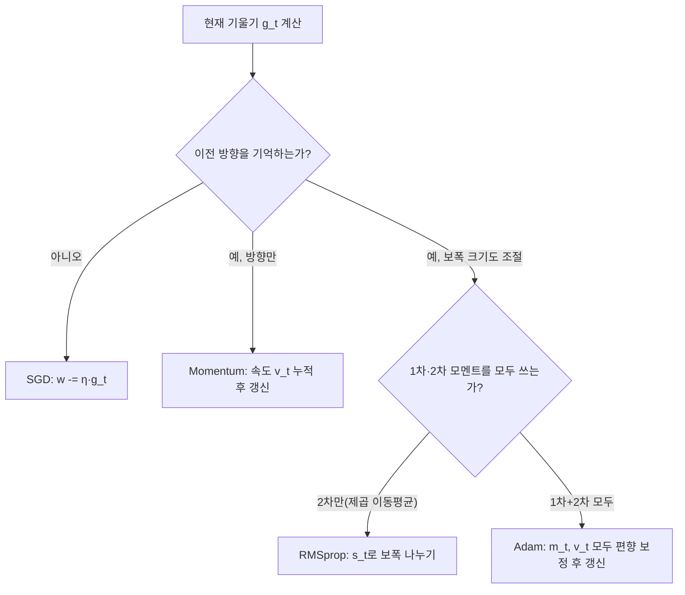

<Callout type="info">
  **이번 문서의 목표:** 이 파일을 다 읽으면 경사하강법의 기본 아이디어를 설명하고, SGD·Momentum·RMSprop·Adam 네 최적화 알고리즘의 갱신 수식을 같은 손실 함수에 대해 2스텝씩 직접 계산해 그 차이를 비교하며, 학습률·모멘텀 같은 하이퍼파라미터가 학습에 미치는 영향을 설명할 수 있다.
</Callout>

## 왜 SGD만으로는 부족한가

07편에서 가중치를 한 번 갱신하는 데 썼던 규칙 $w \leftarrow w - \eta \frac{\partial L}{\partial w}$은 **경사하강법**(gradient descent)의 가장 기본 형태다. 그런데 실제 학습에서는 이 단순한 규칙만으로는 학습이 느리거나, 골짜기 모양의 손실 함수 표면에서 좌우로 진동하며 시간을 낭비하는 경우가 많다. 이 편에서는 기본 경사하강법을 확장한 세 가지 대표 알고리즘 — 이전 방향을 기억하는 **모멘텀**(Momentum), 가중치마다 학습률을 자동 조절하는 **RMSprop**, 이 둘을 결합한 **Adam** — 의 갱신 수식을 같은 간단한 손실 함수에 대해 2스텝씩 직접 계산해 실제로 얼마나 다르게 움직이는지 비교한다.

## 공통 설정: 하나의 손실 함수로 네 알고리즘 비교하기

> **쉽게 말하면:** 네 알고리즘이 얼마나 다르게 움직이는지 보려면, 같은 출발점과 같은 목표를 주고 각자 어떻게 다가가는지 나란히 계산해 보면 된다.

비교를 위해 파라미터 $w$ 하나만 있는 아주 단순한 손실 함수를 쓴다.

$$
L(w) = (w-3)^2
$$

이 함수는 $w=3$일 때 최솟값 $L=0$을 가지므로, 모든 최적화 알고리즘의 목표는 $w$를 $3$에 가깝게 이동시키는 것이다. 이 함수의 기울기(도함수)는 다음과 같다.

$$
\frac{dL}{dw} = 2(w-3)
$$

모든 알고리즘의 출발점을 $w_0=0$, 학습률 $\eta=0.1$로 통일한다. 먼저 첫 번째 기울기를 구해 둔다.

$$
g_0 = 2(w_0-3) = 2(0-3) = -6
$$

- $g_t$: $t$번째 스텝에서 계산한 기울기(gradient). 아래 첨자 $t$는 학습이 진행된 횟수(스텝)를 가리킨다.

## SGD(확률적 경사하강법): 기울기만 보고 바로 이동

> **쉽게 말하면:** 지금 이 순간의 기울기만 보고, 그 반대 방향으로 정해진 보폭만큼 한 걸음 내딛는 가장 단순한 방법이다.

**SGD**(Stochastic Gradient Descent, 확률적 경사하강법)는 전체 데이터가 아니라 미니배치(mini-batch, 데이터를 작게 나눈 묶음. 10편에서 자세히 다룬다) 단위로 기울기를 계산해 매번 갱신하는 경사하강법을 가리키며, 갱신 수식 자체는 07편의 기본 경사하강법과 같다.

$$
w_{t+1} = w_t - \eta \, g_t
$$

**1스텝:**

$$
w_1 = w_0 - \eta g_0 = 0 - 0.1(-6) = 0.6
$$

**2스텝:** 새로운 $w_1=0.6$에서 기울기를 다시 계산한다.

$$
g_1 = 2(w_1-3) = 2(0.6-3) = -4.8
$$

$$
w_2 = w_1 - \eta g_1 = 0.6 - 0.1(-4.8) = 0.6+0.48 = 1.08
$$

두 스텝 만에 $w$가 $0 \to 0.6 \to 1.08$로 목표 $3$을 향해 꾸준히 다가갔지만, 아직 절반도 못 왔다.

## Momentum: 이전 이동 방향을 기억해 가속하기

> **쉽게 말하면:** 언덕에서 공을 굴리면 이전에 굴러가던 속도가 남아 있어 같은 방향이면 더 빨리 가속되는 것처럼, 이전 갱신 방향을 어느 정도 기억해 다음 갱신에 더해준다.

**모멘텀**(Momentum)은 현재 기울기만 보지 않고, 이전 스텝까지 누적된 **속도**(velocity) $v$를 함께 사용한다.

$$
v_t = \beta v_{t-1} + g_t
$$

$$
w_{t+1} = w_t - \eta v_t
$$

- $\beta$ (베타): 이전 속도를 얼마나 반영할지 정하는 하이퍼파라미터(보통 $0.9$). $\beta$가 클수록 과거 방향을 더 오래 기억한다.
- $v_t$: $t$번째 스텝의 누적 속도. 초기값 $v_0=0$에서 시작한다.

**1스텝:** $v_0=0$이므로 첫 스텝은 SGD와 동일하다.

$$
v_1 = \beta v_0 + g_0 = 0.9(0)+(-6) = -6
$$

$$
w_1 = w_0 - \eta v_1 = 0 - 0.1(-6) = 0.6
$$

**2스텝:** 이제부터 SGD와 달라진다. 새 기울기 $g_1=2(0.6-3)=-4.8$을 이전 속도와 합친다.

$$
v_2 = \beta v_1 + g_1 = 0.9(-6)+(-4.8) = -5.4-4.8 = -10.2
$$

$$
w_2 = w_1 - \eta v_2 = 0.6 - 0.1(-10.2) = 0.6+1.02 = 1.62
$$

같은 두 스텝을 거쳤는데도 모멘텀은 $w_2=1.62$로, SGD의 $w_2=1.08$보다 훨씬 더 멀리 이동했다. 이전 스텝의 기울기 $g_0=-6$이 속도에 남아 두 번째 스텝의 힘을 보태 주었기 때문이다. **비유로 이해하기:** SGD가 매 순간 발밑의 경사만 보고 걷는 사람이라면, 모멘텀은 이미 한 방향으로 달리던 관성이 있어 같은 방향의 언덕에서는 더 빨리 가속되는 스케이트보더와 같다.

## RMSprop: 가중치마다 학습률을 자동 조절하기

> **쉽게 말하면:** 최근 기울기가 계속 컸던 방향으로는 보폭을 줄이고, 기울기가 작았던 방향으로는 보폭을 키워서 울퉁불퉁한 지형에서도 안정적으로 이동한다.

**RMSprop**(Root Mean Square Propagation)은 기울기의 제곱을 지수적으로 이동평균(exponential moving average, 최근 값에 더 큰 비중을 두는 평균)한 값 $s$로 학습률을 나누어, 기울기가 컸던 파라미터는 보폭을 줄이고 작았던 파라미터는 보폭을 키운다.

$$
s_t = \beta s_{t-1} + (1-\beta) g_t^2
$$

$$
w_{t+1} = w_t - \frac{\eta}{\sqrt{s_t+\epsilon}} \, g_t
$$

- $s_t$: 기울기 제곱의 이동평균. 초기값 $s_0=0$.
- $\beta=0.9$: 이동평균에서 과거 값을 얼마나 반영할지 정하는 하이퍼파라미터.
- $\epsilon$ (엡실론, 아주 작은 상수, 보통 $10^{-8}$): 분모가 정확히 0이 되어 나눗셈이 정의되지 않는 것을 막기 위한 안전장치.

**1스텝:**

$$
s_1 = \beta s_0 + (1-\beta)g_0^2 = 0.9(0)+0.1(-6)^2 = 0.1(36) = 3.6
$$

$$
w_1 = w_0 - \frac{\eta}{\sqrt{s_1+\epsilon}} g_0 = 0 - \frac{0.1}{\sqrt{3.6}}(-6) = \frac{0.1 \times 6}{1.897} = 0.3163
$$

**2스텝:** 새 기울기 $g_1 = 2(0.3163-3) = -5.3675$를 구한 뒤 이동평균을 갱신한다.

$$
s_2 = \beta s_1 + (1-\beta)g_1^2 = 0.9(3.6)+0.1(5.3675)^2 = 3.24+0.1(28.81) = 3.24+2.881 = 6.121
$$

$$
w_2 = w_1 - \frac{\eta}{\sqrt{s_2+\epsilon}} g_1 = 0.3163 - \frac{0.1}{\sqrt{6.121}}(-5.3675) = 0.3163+\frac{0.53675}{2.474} = 0.3163+0.2170 = 0.5333
$$

RMSprop은 $0 \to 0.3163 \to 0.5333$으로 SGD($0 \to 0.6 \to 1.08$)보다 오히려 느리게 움직였다. 이는 기울기의 절댓값이 처음부터 커서($g_0=-6$) $s$ 값이 커지고, 그만큼 분모 $\sqrt{s+\epsilon}$가 커져 보폭이 줄었기 때문이다. RMSprop의 장점은 이 예제처럼 기울기가 항상 큰 상황보다는, **파라미터마다 기울기의 크기가 서로 크게 다른 실제 신경망**에서 각 파라미터에 맞는 보폭을 자동으로 찾아준다는 데 있다.

## Adam: Momentum과 RMSprop의 결합

> **쉽게 말하면:** Adam은 이전 방향을 기억하는 모멘텀의 아이디어와, 파라미터마다 보폭을 조절하는 RMSprop의 아이디어를 동시에 쓰는 알고리즘으로, 오늘날 가장 널리 쓰이는 기본 선택지다.

**Adam**(Adaptive Moment Estimation)은 1차 모멘트(기울기의 이동평균, 모멘텀과 동일한 개념) $m$과 2차 모멘트(기울기 제곱의 이동평균, RMSprop과 동일한 개념) $v$를 동시에 유지한다.

$$
m_t = \beta_1 m_{t-1} + (1-\beta_1) g_t
$$

$$
v_t = \beta_2 v_{t-1} + (1-\beta_2) g_t^2
$$

- $\beta_1=0.9$, $\beta_2=0.999$: 각각 1차·2차 모멘트의 이동평균 계수로, 관례적으로 이 값을 널리 쓴다.

$m_0=v_0=0$에서 시작하면 초기 몇 스텝 동안 $m, v$가 실제보다 0 쪽으로 치우치는 편향이 생기므로, Adam은 다음과 같은 **편향 보정**(bias correction)을 거친다.

$$
\hat{m}_t = \frac{m_t}{1-\beta_1^{t}}, \qquad \hat{v}_t = \frac{v_t}{1-\beta_2^{t}}
$$

- $\hat{m}_t, \hat{v}_t$ (m 햇, v 햇): 편향을 보정한 1차·2차 모멘트. $t$가 커질수록 $\beta_1^t, \beta_2^t$가 0에 가까워져 보정 효과는 점점 사라진다.

마지막으로 이 보정된 값으로 파라미터를 갱신한다.

$$
w_{t+1} = w_t - \frac{\eta}{\sqrt{\hat{v}_t}+\epsilon}\, \hat{m}_t
$$

**1스텝($t=1$):**

$$
m_1 = \beta_1 m_0+(1-\beta_1)g_0 = 0.1(-6) = -0.6
$$

$$
v_1 = \beta_2 v_0+(1-\beta_2)g_0^2 = 0.001(36) = 0.036
$$

편향 보정을 적용한다. $1-\beta_1^1 = 1-0.9 = 0.1$, $1-\beta_2^1=1-0.999=0.001$이다.

$$
\hat{m}_1 = \frac{-0.6}{0.1} = -6, \qquad \hat{v}_1 = \frac{0.036}{0.001} = 36
$$

$$
w_1 = w_0 - \frac{\eta}{\sqrt{\hat{v}_1}+\epsilon}\hat{m}_1 = 0 - \frac{0.1}{\sqrt{36}}(-6) = 0-\frac{0.1}{6}(-6) = 0+0.1 = 0.1
$$

**2스텝($t=2$):** 새 기울기 $g_1=2(0.1-3)=-5.8$을 구한다.

$$
m_2 = \beta_1 m_1+(1-\beta_1)g_1 = 0.9(-0.6)+0.1(-5.8) = -0.54-0.58 = -1.12
$$

$$
v_2 = \beta_2 v_1+(1-\beta_2)g_1^2 = 0.999(0.036)+0.001(33.64) = 0.035964+0.03364 = 0.069604
$$

$1-\beta_1^2 = 1-0.81 = 0.19$, $1-\beta_2^2 = 1-0.998001 = 0.001999$이다.

$$
\hat{m}_2 = \frac{-1.12}{0.19} = -5.8947, \qquad \hat{v}_2 = \frac{0.069604}{0.001999} = 34.819
$$

$$
w_2 = w_1 - \frac{\eta}{\sqrt{\hat{v}_2}+\epsilon}\hat{m}_2 = 0.1 - \frac{0.1}{\sqrt{34.819}}(-5.8947) = 0.1-\frac{0.1}{5.901}(-5.8947) = 0.1+0.0999 = 0.1999
$$

Adam은 $0 \to 0.1 \to 0.1999$로 이동해, 이 예제에서는 네 알고리즘 중 가장 조심스러운 보폭을 보였다. 편향 보정이 없었다면 초기 $\hat{v}_1$이 실제보다 작게 잡혀 첫 스텝의 보폭이 지나치게 커질 수 있는데, 편향 보정이 이를 막아 준 것이다.

## 네 알고리즘의 이동 궤적 비교

같은 출발점 $w_0=0$, 같은 학습률 $\eta=0.1$에서 2스텝을 진행한 결과를 한 표에 모으면 다음과 같다.

| 알고리즘 | $w_0$ | $w_1$ | $w_2$ |
|---|---|---|---|
| SGD | $0$ | $0.6000$ | $1.0800$ |
| Momentum | $0$ | $0.6000$ | $1.6200$ |
| RMSprop | $0$ | $0.3163$ | $0.5333$ |
| Adam | $0$ | $0.1000$ | $0.1999$ |

같은 손실 함수, 같은 학습률인데도 두 스텝 만에 도달한 위치가 $1.62$(Momentum)부터 $0.20$(Adam)까지 여덟 배 가까이 차이 난다는 점이 이 표의 핵심이다. 이 차이는 알고리즘 성능의 우열이 아니라 **각 알고리즘이 기울기 정보를 반영하는 방식이 다르기 때문**이다. Momentum은 관성으로 가속하고, RMSprop과 Adam은 기울기 제곱의 크기로 보폭을 스스로 줄이므로, 이 예제처럼 기울기의 절댓값이 처음부터 큰 경우 더 신중하게 움직인다.

> **자주 틀리는 점:** "Adam이 항상 SGD보다 빠르다"고 단정하기 쉽지만, 이 예제에서 보듯 Adam은 오히려 가장 보수적으로 움직였다. Adam의 강점은 특정 예제에서의 속도가 아니라, **다양한 문제와 파라미터마다 학습률을 따로 신경 쓰지 않아도 비교적 안정적으로 잘 작동한다는 범용성**에 있다. 또한 학습률 $\eta$는 여전히 사람이 정해야 하는 하이퍼파라미터이며, Adam이라고 해서 학습률을 아무렇게나 정해도 되는 것은 아니다.

## 핵심 정리

- SGD는 현재 기울기만 보고 $w \leftarrow w-\eta g_t$로 갱신하는 가장 단순한 경사하강법이다.
- Momentum은 이전 속도 $v$를 누적해 같은 방향으로는 가속하고 진동은 줄인다($v_t=\beta v_{t-1}+g_t$).
- RMSprop은 기울기 제곱의 이동평균 $s$로 학습률을 나누어 파라미터마다 보폭을 자동 조절한다.
- Adam은 모멘텀(1차 모멘트)과 RMSprop(2차 모멘트)을 결합하고 편향 보정을 더한 알고리즘으로, 오늘날 가장 널리 쓰이는 기본 선택지다.
- 같은 손실 함수·같은 학습률에서도 네 알고리즘의 실제 이동 거리는 크게 다를 수 있으며, 이는 각 알고리즘이 과거 기울기 정보를 반영하는 방식의 차이에서 비롯된다.

## 마무리 복습

<Quiz
  questionNumber={1}
  question="손실 함수 L(w)=(w-3)²에서 w0=0일 때 기울기 g0의 값은?"
  options={['-3', '-6', '3', '6']}
  correctAnswer={2}
  explanation="dL/dw = 2(w-3)이므로 w=0을 대입하면 g0 = 2(0-3) = -6이다."
  optionExplanations={['부호는 맞지만 2배를 하지 않은 값이다', '2(0-3)=-6을 정확히 계산한 값이 정답이다', '부호가 반대이며 2배도 되지 않았다', '부호가 반대다. 기울기는 음수여야 한다']}
/>

<Quiz
  questionNumber={2}
  question="Momentum의 갱신 수식 v_t = βv_{t-1} + g_t에서 β를 크게 설정할수록 나타나는 효과로 가장 옳은 것은?"
  options={['현재 기울기만 반영하고 과거는 완전히 무시한다', '과거 방향을 더 오래, 더 크게 반영해 관성이 강해진다', '학습률이 자동으로 커진다', '기울기 제곱을 사용하게 된다']}
  correctAnswer={2}
  explanation="β는 이전 속도 v_{t-1}에 곱해지는 계수이므로, β가 클수록 과거에 누적된 방향(속도)이 현재 갱신에 더 크게 반영되어 관성 효과가 강해진다."
  optionExplanations={['β가 작을 때 현재 기울기의 비중이 상대적으로 커지는 것과 반대되는 설명이다', '과거 속도를 더 크게 반영해 관성이 강해진다는 것이 정답이다', 'β는 학습률 η과 별개의 하이퍼파라미터로 학습률 자체를 바꾸지 않는다', '기울기 제곱을 사용하는 것은 RMSprop·Adam의 2차 모멘트이지 Momentum의 β와 무관하다']}
/>

<Quiz
  questionNumber={3}
  question="RMSprop에서 기울기의 절댓값이 계속 크게 유지되는 파라미터에 대해 일어나는 일로 옳은 것은?"
  options={['이동평균 s가 커져 보폭이 줄어든다', '이동평균 s가 작아져 보폭이 커진다', '학습률 η 자체가 사람이 재설정해야 한다', '기울기가 자동으로 0으로 바뀐다']}
  correctAnswer={1}
  explanation="s_t = βs_{t-1}+(1-β)g_t²이므로 기울기가 계속 크면 s도 커지고, 갱신식의 분모 √(s+ε)가 커져 학습률 η을 사실상 나누는 효과로 보폭이 줄어든다."
  optionExplanations={['s가 커져 보폭이 줄어든다는 것이 정답이다', 's는 기울기의 제곱을 반영하므로 기울기가 크면 s도 커진다', 'RMSprop은 η을 사람이 다시 설정하지 않아도 s를 통해 자동으로 실질적인 보폭을 조절한다', '기울기 값 자체는 RMSprop이 임의로 바꾸지 않으며, 보폭만 조절될 뿐이다']}
/>

<Quiz
  questionNumber={4}
  question="Adam에서 편향 보정(bias correction)을 하는 이유로 가장 옳은 것은?"
  options={['학습 후반부에 학습률을 0으로 만들기 위해', 'm0=v0=0에서 시작해 학습 초기에 모멘트 추정값이 실제보다 작게 치우치는 것을 보정하기 위해', '기울기의 부호를 항상 양수로 만들기 위해', 'Momentum과 RMSprop을 완전히 동일하게 만들기 위해']}
  correctAnswer={2}
  explanation="Adam은 1차·2차 모멘트를 0에서 시작해 이동평균으로 누적하므로 학습 초기에는 실제 값보다 0 쪽으로 치우친다. 편향 보정은 1-β^t로 나누어 이 초기 편향을 상쇄한다."
  optionExplanations={['편향 보정은 학습률을 0으로 만드는 것과 무관하며 스케줄링은 별도의 개념이다', 'm0=v0=0에서 시작하는 데서 오는 초기 편향을 보정한다는 것이 정답이다', '기울기의 부호는 손실 함수의 실제 기울기를 그대로 반영해야 하며 임의로 바꾸지 않는다', 'Adam은 두 아이디어를 결합할 뿐 두 알고리즘을 동일하게 만들지 않는다']}
/>

<Quiz
  questionNumber={5}
  question="같은 손실 함수와 같은 학습률로 2스텝을 진행했을 때, 이 편의 계산 결과 w2 값이 가장 크게(목표에 가장 빠르게 다가간 것처럼) 나온 알고리즘은?"
  options={['SGD', 'Momentum', 'RMSprop', 'Adam']}
  correctAnswer={2}
  explanation="이 편의 계산에서 w2 값은 SGD=1.08, Momentum=1.62, RMSprop=0.5333, Adam=0.1999였다. 이전 속도를 누적해 가속하는 Momentum이 가장 큰 값으로 이동했다."
  optionExplanations={['SGD의 w2=1.08은 Momentum보다 작다', 'Momentum의 w2=1.62가 네 알고리즘 중 가장 큰 값이므로 정답이다', 'RMSprop은 기울기 제곱으로 보폭을 줄여 오히려 SGD보다도 느리게 이동했다', 'Adam은 이 예제에서 가장 보수적으로 이동해 w2가 가장 작았다']}
/>

<Quiz
  questionNumber={6}
  question="이 편의 계산 결과를 근거로 최적화 알고리즘 선택에 대해 옳지 않은 설명은?"
  options={['Momentum은 이전 방향을 누적해 SGD보다 더 크게 이동할 수 있다', 'RMSprop과 Adam은 기울기 제곱을 이용해 파라미터별 보폭을 조절한다', 'Adam은 이 예제에서 항상 다른 모든 알고리즘보다 더 빠르게 목표에 도달했다', '네 알고리즘 모두 학습률이라는 하이퍼파라미터가 필요하다']}
  correctAnswer={3}
  explanation="이 편의 계산에서 Adam(w2=0.1999)은 오히려 Momentum(1.62)이나 SGD(1.08)보다 느리게 이동했다. Adam이 항상 가장 빠른 것은 아니며, 이 예제가 그 반례를 보여준다."
  optionExplanations={['Momentum이 속도 누적으로 SGD보다 크게 이동한 것은 이 편의 계산 결과와 일치하는 옳은 설명이다', 'RMSprop과 Adam 모두 기울기 제곱의 이동평균을 사용하는 것이 옳은 설명이다', '이 예제에서 Adam이 가장 느리게 이동했으므로 이 설명은 옳지 않은 것(정답)이다', '네 알고리즘 모두 η이라는 학습률 하이퍼파라미터를 필요로 하는 것은 옳은 설명이다']}
/>

## 참고 자료

- [Ian Goodfellow 외, Deep Learning](https://www.deeplearningbook.org) — 경사하강법과 Momentum·RMSprop·Adam 등 최적화 알고리즘의 수식 근거
- [국가평생교육진흥원 독학학위제](https://bdes.nile.or.kr) — 독학사 3단계 딥러닝 과목 출제기준 확인
