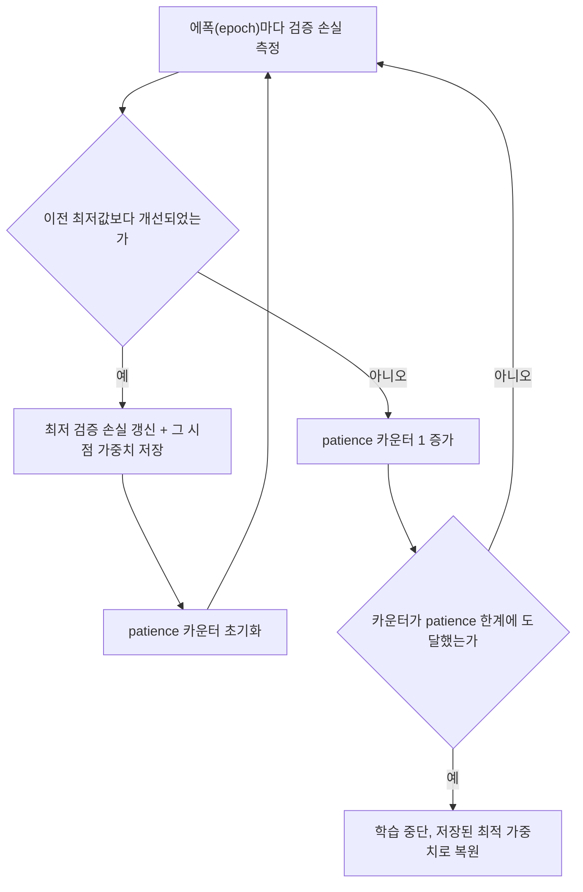

<Callout type="info">
  **이번 문서의 목표:** 이 파일을 다 읽으면 과적합이 왜 일어나는지 편향-분산(bias-variance) 관점으로 설명하고, L1/L2 정규화·드롭아웃(dropout)·조기 종료(early stopping)의 수식과 효과 차이를 비교해 시험 문제에 적용할 수 있다.
</Callout>

## 과적합이란 무엇인가

> **쉽게 말하면:** 모델이 훈련 데이터의 "정답"뿐 아니라 "잡음"까지 외워버려서, 처음 보는 데이터에서는 성능이 떨어지는 현상이다.

07편에서 순전파(forward propagation)와 역전파(backpropagation)로 신경망(neural network)의 가중치(weight)를 갱신하는 방법을 배웠고, 08편에서는 그 갱신을 더 빠르고 안정적으로 만드는 최적화(optimization) 알고리즘을 다뤘다. 그런데 손실(loss)을 훈련 데이터에서 아무리 잘 낮춰도, 그 모델이 실전에서 쓸모 있다는 보장은 없다. 여기서 등장하는 문제가 **과적합**(overfitting, 과대적합이라고도 한다)이다.

과적합을 이해하려면 먼저 **편향**(bias)과 **분산**(variance)이라는 두 개념을 짚어야 한다.

- **편향**은 모델이 참값에서 얼마나 체계적으로 벗어나는가를 뜻한다. 모델이 너무 단순해서(예: 곡선 관계를 직선 하나로 예측) 데이터의 패턴 자체를 못 잡으면 편향이 크다고 한다. 이 상태를 **과소적합**(underfitting)이라 부른다.
- **분산**은 훈련 데이터를 조금만 바꿔도 모델의 예측이 크게 흔들리는 정도를 뜻한다. 모델이 너무 복잡해서 훈련 데이터의 잡음(noise, 실제 패턴과 무관한 우연한 변동)까지 암기하면 분산이 크다고 한다. 이 상태가 바로 **과적합**이다.

이 둘은 트레이드오프(trade-off, 하나를 얻으려면 다른 하나를 희생해야 하는 관계) 관계에 있다. 모델의 표현력(capacity, 얼마나 복잡한 함수를 표현할 수 있는가)을 키우면 편향은 줄지만 분산은 늘고, 표현력을 줄이면 반대가 된다. 신경망은 은닉층(hidden layer)과 노드(node) 수를 늘리면 표현력이 매우 커지므로, 특별한 장치 없이 훈련하면 쉽게 과적합에 빠진다.

과적합이 일어나면 훈련 손실(training loss)은 계속 낮아지는데 검증 손실(validation loss, 훈련에 쓰지 않은 별도 데이터에 대한 손실)은 어느 시점부터 다시 올라간다. 이 두 곡선의 벌어짐이 과적합의 가장 직접적인 증거다.

| 구간 | 훈련 손실 | 검증 손실 | 상태 |
|------|-----------|-----------|------|
| 학습 초반 | 높음 | 높음 | 과소적합 |
| 적정 시점 | 낮음 | 낮음(최소 근처) | 적정 적합 |
| 학습 후반 | 매우 낮음 | 다시 상승 | 과적합 |

**정규화**(regularization)는 모델의 표현력을 인위적으로 억제하거나 훈련 방식을 조정해서, 훈련 손실을 조금 희생하더라도 검증·테스트 성능(즉 **일반화**, generalization 능력)을 높이는 기법들을 통칭한다. 이번 편에서는 L1/L2 정규화, 드롭아웃, 조기 종료 세 가지를 다룬다. 배치 정규화(batch normalization)와 데이터 증강(data augmentation), 초기화(initialization)는 10편에서 이어서 다룬다.

## L2 정규화 (가중치 감쇠)

> **쉽게 말하면:** 손실 함수에 "가중치가 너무 크면 벌점을 준다"는 항을 추가해서, 모델이 꼭 필요한 만큼만 가중치를 키우게 만든다.

**L2 정규화**(L2 regularization)는 **가중치 감쇠**(weight decay)라고도 부른다. 기존 손실 함수 $L_0$ (06편에서 다룬 MSE나 크로스엔트로피 등)에 모든 가중치의 제곱합을 더한다.

$$
L = L_0 + \frac{\lambda}{2} \sum_{i} w_i^2
$$

- $L$ (엘): 정규화가 적용된 최종 손실
- $L_0$: 정규화 항이 없는 원래 손실(예측이 정답과 얼마나 다른지)
- $\lambda$ (람다): 정규화 강도를 조절하는 하이퍼파라미터(hyperparameter, 학습 전에 사람이 정하는 값). 0이면 정규화가 없는 것과 같고, 크면 클수록 가중치를 강하게 억제한다.
- $\sum_i w_i^2$: 모델의 모든 가중치 $w_i$ (더블유, 가중치)를 제곱해서 더한 값. 절대값이 큰 가중치일수록 벌점이 커진다.
- $\frac{1}{2}$: 나중에 미분할 때 계수를 깔끔하게 만들기 위한 관례적인 상수다.

이 손실을 경사하강법(gradient descent)으로 최소화하려면 $L$을 가중치 $w_i$에 대해 미분해야 한다. $L_0$의 그라디언트(gradient, 기울기 벡터)를 $\nabla L_0$라 하면, 정규화 항의 미분은 $\lambda w_i$이므로 갱신식은 다음과 같다.

$$
w_i \leftarrow w_i - \eta \left( \frac{\partial L_0}{\partial w_i} + \lambda w_i \right)
$$

- $\eta$ (에타): 학습률(learning rate). 08편에서 다룬 것과 같은 개념이다.
- $\frac{\partial L_0}{\partial w_i}$: 원래 손실이 가중치 $w_i$의 변화에 얼마나 민감한지 나타내는 편미분(partial derivative)이다.
- $\lambda w_i$: 정규화 때문에 추가로 빠지는 항. 가중치 자체 값에 비례해서 깎인다.

이 식을 정리하면 왜 "가중치 감쇠"라 부르는지 보인다.

$$
w_i \leftarrow (1 - \eta \lambda) \, w_i - \eta \frac{\partial L_0}{\partial w_i}
$$

매 스텝마다 원래 갱신 이외에 $w_i$가 $(1 - \eta\lambda)$배로 곱해져서, 정규화 항이 없을 때보다 조금씩 더 0에 가깝게 줄어든다(decay, 감쇠). $\eta\lambda$가 1보다 훨씬 작은 양수이므로 매 스텝 가중치를 살짝 축소하는 효과가 난다.

**작은 예시로 검산해 보자.** 가중치 $w = 0.5$, 원래 손실의 그라디언트 $\frac{\partial L_0}{\partial w} = 0.1$, 학습률 $\eta = 0.1$, 정규화 강도 $\lambda = 0.2$라 하자.

$$
w \leftarrow 0.5 - 0.1 \times (0.1 + 0.2 \times 0.5) = 0.5 - 0.1 \times 0.2 = 0.48
$$

정규화가 없었다면 $w \leftarrow 0.5 - 0.1 \times 0.1 = 0.49$였을 것이다. L2 정규화 때문에 가중치가 조금 더 많이(0.49가 아니라 0.48로) 줄어든 것을 확인할 수 있다. $\lambda$가 클수록 이 차이는 더 커진다.

## L1 정규화

> **쉽게 말하면:** 절대값의 합에 벌점을 매겨서, 중요하지 않은 가중치를 아예 0으로 만들어버린다.

**L1 정규화**(L1 regularization)는 가중치의 제곱이 아니라 절대값의 합을 손실에 더한다.

$$
L = L_0 + \lambda \sum_{i} |w_i|
$$

- $|w_i|$: 가중치의 절대값. 부호와 무관하게 크기만 본다.

L1은 미분하면 $w_i$의 부호(sign)만 남는다($w_i > 0$이면 $+1$, $w_i < 0$이면 $-1$, $w_i = 0$이면 미분 불가능). 즉 갱신 시 가중치 크기와 무관하게 항상 같은 크기(=$\eta\lambda$)만큼 0 쪽으로 밀어낸다. 그 결과 L1은 중요하지 않은 가중치를 정확히 0으로 만드는 경향이 있는데, 이를 **희소성**(sparsity, 값 대부분이 0인 성질)을 유도한다고 표현한다. 반면 L2는 가중치 크기에 비례해서 깎기 때문에(위 갱신식에서 본 것처럼) 큰 가중치는 더 크게, 작은 가중치는 아주 조금만 줄어들어 0에 정확히 도달하기보다 전체적으로 고르게 작아진다.

| 구분 | L1 정규화 | L2 정규화 |
|------|-----------|-----------|
| 벌점 형태 | 절대값의 합 `\|w\|` | 제곱의 합 $w^2$ |
| 미분 결과 | 부호(상수) | 가중치에 비례 |
| 가중치에 미치는 효과 | 일부를 정확히 0으로(희소성) | 전체적으로 고르게 작게 |
| 대표 활용 | 특징 선택(feature selection)이 필요할 때 | 일반적인 가중치 감쇠 용도 |
| 다른 이름 | Lasso 정규화(회귀 맥락) | Ridge 정규화(회귀 맥락), 가중치 감쇠 |

> **자주 틀리는 점:** "L1과 L2 모두 가중치를 0으로 만든다"는 진술은 옳지 않다. 정확히 0으로 만드는 경향은 **L1의 특징**이고, L2는 0에 가까워지되 정확히 0이 되는 경우가 드물다. 이 차이를 묻는 문제가 자주 나온다.

## 드롭아웃

> **쉽게 말하면:** 학습할 때마다 신경망의 일부 노드를 무작위로 꺼서, 특정 노드에 지나치게 의존하지 못하게 만든다.

**드롭아웃**(dropout)은 2014년 제안된 정규화 기법으로, L1/L2처럼 손실 함수를 바꾸는 대신 **신경망 구조 자체를 학습 중에 무작위로 바꾼다**. 매 학습 스텝(미니배치 하나를 처리할 때)마다, 각 은닉층의 노드를 정해진 확률 $p$로 임시로 꺼버린다(출력을 0으로 만든다).

$$
\tilde{h}_i = h_i \cdot m_i, \quad m_i \sim \text{Bernoulli}(1-p)
$$

- $h_i$: 드롭아웃 적용 전 $i$번째 노드의 출력 값
- $\tilde{h}_i$ (에이치 틸드): 드롭아웃이 적용된 후의 출력 값
- $m_i$: 이 노드를 살릴지 끌지 결정하는 마스크(mask) 값. 0 또는 1
- $\text{Bernoulli}(1-p)$: 베르누이 분포(동전 던지기처럼 두 결과 중 하나만 나오는 확률분포). $1-p$의 확률로 1(노드를 살림), $p$의 확률로 0(노드를 끔)이 나온다
- $p$: 드롭아웃 비율(drop rate). 보통 은닉층에서는 0.5, 입력층에서는 0.1~0.2 정도를 쓴다

드롭아웃이 과적합을 줄이는 이유는 두 가지로 설명한다.

1. **공적응 방지**: 특정 노드 조합이 우연히 잘 맞아떨어져서 서로 의존하게 되는 현상(co-adaptation, 공적응)을 막는다. 어떤 노드가 언제 꺼질지 모르므로, 각 노드는 다른 노드에 의존하지 않고 독립적으로 유용한 특징을 학습해야 한다.
2. **앙상블 효과**: 매 스텝마다 다른 노드 조합이 살아남으므로, 사실상 서로 다른 부분 신경망(sub-network) 여러 개를 동시에 훈련하는 것과 비슷하다. 추론(inference, 실제 예측) 시에는 전체 노드를 다 쓰되 출력에 $(1-p)$를 곱해 스케일을 맞추는데(또는 학습 시 $\frac{1}{1-p}$를 미리 곱해두는 inverted dropout 방식을 더 많이 쓴다), 이는 여러 부분 신경망의 평균을 내는 것과 유사한 효과를 낸다.

> **비유:** 축구팀을 훈련할 때 매 훈련마다 무작위로 몇 명씩 빠지게 하면, 특정 스타 선수 한 명에게만 의존하는 전술을 짤 수 없다. 남은 선수들이 각자 제 역할을 하도록 훈련되어, 실제 경기(테스트 데이터)에서 누가 빠져도 팀 전체가 안정적으로 작동한다.

주의할 점은 드롭아웃은 **학습(training) 때만 적용**하고, **추론(inference, 검증·테스트) 때는 모든 노드를 사용**한다는 것이다. 추론 시에도 노드를 끄면 오히려 성능이 무작위로 흔들리고 정보 손실이 생긴다.

## 조기 종료

> **쉽게 말하면:** 검증 손실이 더 이상 좋아지지 않고 오히려 나빠지기 시작하면, 학습이 끝나지 않았어도 훈련을 멈춘다.

**조기 종료**(early stopping)는 앞서 그린 훈련 손실·검증 손실 곡선을 실시간으로 관찰하다가, 검증 손실이 최저점을 찍고 다시 올라가기 시작하는 시점에서 학습을 멈추고 그 최저점의 가중치를 최종 모델로 채택하는 기법이다.

여기서 **patience**(인내심)는 검증 손실이 개선되지 않아도 몇 번의 에폭(epoch, 전체 훈련 데이터를 한 번 다 도는 단위)까지 참고 기다릴지를 정하는 하이퍼파라미터다. patience를 너무 작게 잡으면 손실이 일시적으로 흔들리는 것(잡음)만 보고 너무 일찍 멈춰서 과소적합이 될 수 있고, 너무 크게 잡으면 이미 과적합이 상당히 진행된 뒤에야 멈추게 된다.

조기 종료는 L1/L2·드롭아웃과 성격이 다르다. L1/L2·드롭아웃은 **손실 함수나 모델 구조를 바꿔서** 애초에 과적합이 덜 일어나게 만드는 접근이고, 조기 종료는 **학습 시간(에폭 수)을 제한**해서 모델이 잡음까지 암기할 시간을 주지 않는 접근이다. 그래서 조기 종료는 별도의 계산 비용이 거의 없고 구현이 간단하다는 장점이 있지만, 검증 데이터가 반드시 별도로 필요하고 최적의 멈춤 시점이 patience 설정에 민감하다는 단점이 있다.

## 네 가지 정규화 기법 비교

| 기법 | 적용 위치 | 핵심 아이디어 | 장점 | 단점·주의점 |
|------|-----------|----------------|------|-------------|
| L2 (가중치 감쇠) | 손실 함수 | 가중치 제곱합에 벌점 | 구현 간단, 이론적으로 안정적 | $\lambda$ 선택에 민감, 정확히 0은 안 됨 |
| L1 | 손실 함수 | 가중치 절대값 합에 벌점 | 희소성으로 불필요한 가중치 제거 | 미분 불연속점(0)에서 최적화가 다소 까다로움 |
| Dropout | 신경망 구조(학습 시) | 노드를 무작위로 비활성화 | 강력한 정규화 효과, 앙상블 효과 | 학습 시간 증가, 추론 시 끄고 스케일 보정 필요 |
| Early Stopping | 학습 절차(에폭 수) | 검증 손실 최저점에서 중단 | 추가 연산 거의 없음, 구현 쉬움 | 검증 세트 필요, patience 설정에 민감 |

이 네 기법은 서로 배타적이지 않다. 실무와 시험 문제 모두에서 "L2 정규화 + 드롭아웃 + 조기 종료"처럼 **여러 기법을 동시에 적용**하는 경우가 표준적이며, 08편에서 다룬 최적화 알고리즘(Adam 등)이나 10편에서 다룰 배치 정규화·데이터 증강과도 함께 쓰인다.

## 핵심 정리

- 과적합은 모델이 훈련 데이터의 잡음까지 암기해서 분산(variance)이 커진 상태이며, 훈련 손실과 검증 손실의 벌어짐으로 관찰한다.
- L2 정규화는 가중치 제곱합에 벌점을 줘 전체적으로 고르게 작게 만들고(가중치 감쇠), L1 정규화는 절대값 합에 벌점을 줘 일부 가중치를 정확히 0으로 만든다(희소성).
- 드롭아웃은 학습 시 노드를 확률 $p$로 무작위 비활성화해 공적응을 막고 앙상블 효과를 내며, 추론 시에는 전체 노드를 사용한다.
- 조기 종료는 검증 손실이 최저점을 찍고 다시 오르기 시작하면(patience만큼 기다린 뒤) 학습을 멈춰, 과적합이 심해지기 전 최적 시점의 가중치를 채택한다.
- 네 기법은 서로 다른 층위(손실 함수, 구조, 절차)에서 작동하므로 동시에 적용할 수 있다.

## 마무리 복습

<Quiz
  questionNumber={1}
  question="과적합(overfitting) 상태에 대한 설명으로 옳은 것은?"
  options={['훈련 손실과 검증 손실이 모두 높은 상태다', '모델의 편향(bias)이 커서 데이터 패턴을 잡지 못하는 상태다', '훈련 손실은 낮지만 검증 손실은 높아 분산(variance)이 큰 상태다', '학습률이 너무 낮아 손실이 줄어들지 않는 상태다']}
  correctAnswer={3}
  explanation="과적합은 모델이 훈련 데이터의 잡음까지 암기해 훈련 손실은 계속 낮아지지만 검증 손실은 다시 올라가는, 분산이 큰 상태를 말한다."
  optionExplanations={['둘 다 높은 것은 과소적합에 가까운 상황이다', '편향이 큰 것은 과소적합(underfitting)의 특징이다', '정답. 훈련-검증 손실의 벌어짐이 과적합의 대표 증거다', '학습률 문제는 최적화 실패이지 과적합과는 별개의 현상이다']}
/>

<Quiz
  questionNumber={2}
  question="L1 정규화와 L2 정규화의 차이로 옳은 것은?"
  options={['L1은 가중치를 제곱해서 벌점을 주고, L2는 절대값으로 벌점을 준다', 'L1은 일부 가중치를 정확히 0으로 만드는 희소성을 유도하고, L2는 전체적으로 고르게 작게 만든다', 'L1과 L2 모두 학습 중 노드를 무작위로 비활성화한다', 'L2는 검증 데이터가 반드시 필요하지만 L1은 필요 없다']}
  correctAnswer={2}
  explanation="L1은 절대값 합에 벌점을 줘 미분값이 부호로 고정되므로 일부 가중치를 정확히 0으로 만들고(희소성), L2는 제곱합에 벌점을 줘 가중치 크기에 비례해 깎이므로 전체적으로 고르게 작아진다."
  optionExplanations={['벌점 형태가 반대로 설명되어 있다. L1이 절대값, L2가 제곱이다', '정답. 희소성 유도 여부가 L1과 L2의 핵심 차이다', '노드 비활성화는 드롭아웃의 특징이지 L1/L2와 무관하다', 'L1/L2는 검증 데이터 없이도 적용 가능한 손실 함수 수정 기법이다. 검증 세트가 반드시 필요한 것은 조기 종료다']}
/>

<Quiz
  questionNumber={3}
  question="가중치 $w = 1.0$, 원래 손실의 그라디언트 $\frac{\partial L_0}{\partial w} = 0.2$, 학습률 $\eta = 0.5$, L2 정규화 강도 $\lambda = 0.4$일 때, 갱신식 $w \leftarrow w - \eta(\frac{\partial L_0}{\partial w} + \lambda w)$에 따른 새 가중치 값은?"
  options={['0.60', '0.70', '0.90', '1.00']}
  correctAnswer={2}
  explanation="w ← 1.0 − 0.5 × (0.2 + 0.4 × 1.0) = 1.0 − 0.5 × 0.6 = 1.0 − 0.3 = 0.70이다."
  optionExplanations={['0.4 × 1.0을 0.8로 잘못 계산하는 등 괄호 안 계산을 틀린 경우 나올 수 있는 오답이다', '정답. 괄호 안(0.2+0.4)=0.6, 0.5×0.6=0.3, 1.0−0.3=0.70', 'λw 항을 빼먹고 η×0.2만 뺀 값(1.0−0.1=0.90)이다', '정규화 항을 아예 반영하지 않은 값이다']}
/>

<Quiz
  questionNumber={4}
  question="드롭아웃(dropout)에 대한 설명으로 옳지 않은 것은?"
  options={['학습 시 각 노드를 정해진 확률로 무작위 비활성화한다', '노드 간 공적응(co-adaptation)을 막는 효과가 있다', '여러 부분 신경망을 학습하는 앙상블과 비슷한 효과를 낸다', '추론(inference) 시에도 학습 때와 동일하게 노드를 무작위로 끈다']}
  correctAnswer={4}
  explanation="드롭아웃은 학습 때만 노드를 무작위로 끄고, 추론 시에는 모든 노드를 사용하되 스케일을 보정한다. 추론 시에도 노드를 끄면 성능이 불안정해진다."
  optionExplanations={['옳은 설명이다. 베르누이 분포를 따르는 마스크로 노드를 끈다', '옳은 설명이다. 특정 노드 조합에 의존하지 못하게 만든다', '옳은 설명이다. 매 스텝 다른 부분 신경망을 훈련하는 것과 유사하다', '옳지 않은 설명(정답). 추론 시에는 전체 노드를 사용하는 것이 표준이다']}
/>

<Quiz
  questionNumber={5}
  question="조기 종료(early stopping)에서 patience를 매우 작게 설정했을 때 예상되는 문제는?"
  options={['검증 손실이 잠깐 흔들리는 것만 보고 너무 일찍 멈춰 과소적합이 될 수 있다', '과적합이 심하게 진행될 때까지 학습이 멈추지 않는다', 'L1 정규화와 동시에 사용할 수 없게 된다', '드롭아웃 비율을 자동으로 낮춰야 한다']}
  correctAnswer={1}
  explanation="patience가 너무 작으면 검증 손실의 일시적인 잡음(noise)만 보고 조기에 학습을 멈추게 되어, 모델이 충분히 학습되지 못한 과소적합 상태로 끝날 수 있다."
  optionExplanations={['정답. patience가 작을수록 성급하게 멈춰 과소적합 위험이 커진다', '오히려 patience가 클 때 발생하는 문제다', '조기 종료는 다른 정규화 기법과 함께 사용할 수 있다', '드롭아웃 비율과 patience는 서로 독립적인 하이퍼파라미터다']}
/>

<Quiz
  questionNumber={6}
  question="다음 중 정규화 기법과 그 적용 층위(무엇을 바꾸는가)를 옳게 짝지은 것은?"
  options={['L2 정규화 — 신경망 구조를 무작위로 변경한다', '드롭아웃 — 손실 함수에 벌점 항을 추가한다', '조기 종료 — 학습을 진행하는 에폭 수(학습 절차)를 제한한다', 'L1 정규화 — 검증 손실이 오를 때 학습을 중단한다']}
  correctAnswer={3}
  explanation="조기 종료는 손실 함수나 모델 구조를 바꾸지 않고, 검증 손실을 관찰해 학습을 멈추는 시점(에폭 수)을 조절하는 절차적 기법이다."
  optionExplanations={['L2는 손실 함수에 벌점 항을 추가하는 기법이지 구조를 바꾸지 않는다', '드롭아웃은 손실 함수가 아니라 신경망 구조(노드 활성화 여부)를 학습 중에 바꾼다', '정답. 조기 종료는 학습 절차(언제 멈출지)를 제한하는 기법이다', '학습 중단 시점 판단은 조기 종료의 정의이지 L1 정규화의 정의가 아니다']}
/>

## 참고 자료

- [Deep Learning Book (Goodfellow, Bengio, Courville) — Regularization for Deep Learning](https://www.deeplearningbook.org)
- [scikit-learn: Model evaluation and regularization 관련 문서](https://scikit-learn.org/stable/)
