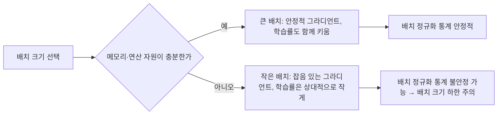

<Callout type="info">
  **이번 문서의 목표:** 이 파일을 다 읽으면 배치 정규화(Batch Normalization)가 내부 공변량 이동을 어떻게 완화하는지 수식으로 설명하고, Xavier·He 초기화의 차이와 데이터 증강·학습률·배치 크기 선택의 실무적 영향을 판단할 수 있다.
</Callout>

## 왜 층 사이의 분포가 문제가 되는가

> **쉽게 말하면:** 신경망은 층을 거칠 때마다 값의 분포가 조금씩 흔들리는데, 이 흔들림이 누적되면 학습이 느려지고 불안정해진다.

09편에서 L1/L2 정규화·드롭아웃(dropout)·조기 종료(early stopping)로 **과적합**(overfitting)을 억제하는 방법을 다뤘다. 이번 편에서는 정규화의 또 다른 축인 **배치 정규화**(Batch Normalization, 줄여서 BatchNorm)와, 학습을 안정적으로 시작·진행시키는 **초기화**(initialization)·**데이터 증강**(data augmentation)을 다룬다.

신경망을 깊게(층을 많이) 쌓으면 학습이 어려워지는 이유 중 하나로 **내부 공변량 이동**(Internal Covariate Shift)이 꼽힌다. 이는 학습이 진행되며 이전 층의 가중치(weight)가 계속 바뀌기 때문에, 다음 층에 들어오는 입력 값의 분포(값들이 어떻게 퍼져 있는가)가 계속 달라지는 현상이다. 각 층은 "이전 층에서 들어오는 값이 대략 이런 범위와 모양일 것"이라는 가정 아래 가중치를 학습하는데, 그 가정이 매 스텝 흔들리면 학습이 느려지고, 07편에서 다룬 그라디언트(gradient, 기울기 벡터) 소실·폭발 문제도 심해질 수 있다.

> **비유:** 계주에서 앞 주자가 매번 다른 위치, 다른 속도로 바통을 건넨다면 다음 주자는 매번 새로 자세를 잡아야 한다. 앞 주자가 항상 일정한 지점·속도로 바통을 건네주면 다음 주자는 훨씬 안정적으로 이어달릴 수 있다. 배치 정규화는 각 층이 받는 입력을 이렇게 "일정하게" 맞춰주는 역할을 한다.

## 배치 정규화의 계산 절차

> **쉽게 말하면:** 한 미니배치 안에서 값을 평균 0, 분산 1로 맞춘 뒤, 학습 가능한 파라미터로 다시 적당히 늘리고 옮긴다.

**배치 정규화**는 각 층의 활성화(activation, 06편에서 다룬 활성화 함수의 출력) 값을 미니배치(mini-batch, 08편에서 다룬 한 번에 학습에 쓰는 데이터 묶음) 단위로 정규화한다. 미니배치 안의 값들을 $x_1, x_2, \dots, x_m$이라 하자($m$은 미니배치 크기).

**1단계: 미니배치 평균을 구한다.**

$$
\mu_B = \frac{1}{m} \sum_{i=1}^{m} x_i
$$

- $\mu_B$ (뮤 비, 배치 평균): 이 미니배치에 속한 $m$개 값의 평균
- $m$: 미니배치 크기(데이터 개수)

**2단계: 미니배치 분산을 구한다.**

$$
\sigma_B^2 = \frac{1}{m} \sum_{i=1}^{m} (x_i - \mu_B)^2
$$

- $\sigma_B^2$ (시그마 제곱 비, 배치 분산): 값들이 평균에서 얼마나 퍼져 있는지를 나타내는 지표

**3단계: 정규화한다(평균 0, 분산 1로 표준화).**

$$
\hat{x}_i = \frac{x_i - \mu_B}{\sqrt{\sigma_B^2 + \epsilon}}
$$

- $\hat{x}_i$ (엑스 햇, 정규화된 값): 평균을 빼고 표준편차로 나눠, 평균 0·분산 1에 가깝게 맞춘 값
- $\epsilon$ (엡실론): 분산이 0에 가까울 때 0으로 나누는 사고를 막기 위한 아주 작은 상수(예: $10^{-5}$)

**4단계: 스케일과 이동을 학습 가능한 파라미터로 되돌려준다.**

$$
y_i = \gamma \hat{x}_i + \beta
$$

- $y_i$: 배치 정규화의 최종 출력. 다음 층으로 전달되는 값
- $\gamma$ (감마, 스케일 파라미터): 정규화된 값을 얼마나 늘릴지 학습으로 정하는 파라미터
- $\beta$ (베타, 이동 파라미터): 정규화된 값을 어디로 옮길지 학습으로 정하는 파라미터

3단계에서 끝내지 않고 4단계를 두는 이유가 중요하다. 만약 항상 평균 0·분산 1로 고정해버리면, 신경망이 표현할 수 있는 값의 범위가 지나치게 제한된다. 예를 들어 시그모이드(sigmoid) 활성화 함수 입장에서는 평균 0·분산 1 근처가 선형에 가까운 구간이라, 이 구간에만 값이 머물면 신경망의 비선형 표현력이 떨어질 수 있다. $\gamma$와 $\beta$를 가중치처럼 역전파(backpropagation)로 함께 학습시켜서, 필요하면 "표준화를 원래대로 되돌리는 것"까지도 신경망 스스로 선택할 수 있게 열어둔 것이다.

**작은 예시로 검산해 보자.** 어느 층의 한 노드에서 미니배치 4개의 활성화 값이 $2, 4, 4, 6$이라 하자($m=4$).

$$
\mu_B = \frac{2+4+4+6}{4} = 4
$$

$$
\sigma_B^2 = \frac{(2-4)^2+(4-4)^2+(4-4)^2+(6-4)^2}{4} = \frac{4+0+0+4}{4} = 2
$$

$\epsilon$을 무시하면($\epsilon \approx 0$), 첫 번째 값 $x_1=2$의 정규화 결과는 다음과 같다.

$$
\hat{x}_1 = \frac{2-4}{\sqrt{2}} \approx -1.41
$$

$\gamma = 1, \beta = 0$이라 가정하면 $y_1 \approx -1.41$이 된다. 원래 2였던 값이 배치 안에서 상대적으로 평균보다 작았기 때문에 음수로 변환된 것을 확인할 수 있다.

배치 정규화는 보통 완전연결층(fully connected layer)이나 합성곱층(convolutional layer, 11편에서 다룸)과 활성화 함수 사이에 삽입한다. 학습(training) 때는 미니배치의 $\mu_B, \sigma_B^2$를 그때그때 계산하지만, 추론(inference) 때는 미니배치가 없거나 하나씩 들어올 수 있으므로 학습 중 계산해 둔 이동 평균(moving average)된 전체 평균·분산을 대신 사용한다.

배치 정규화의 효과는 세 가지로 요약된다.

1. **학습 안정화·가속**: 내부 공변량 이동을 줄여 더 큰 학습률(learning rate)을 써도 학습이 발산하지 않게 해준다.
2. **그라디언트 흐름 개선**: 값의 분포가 일정 범위에 유지되므로 그라디언트 소실·폭발 문제가 완화된다.
3. **약한 정규화 효과**: 같은 데이터라도 미니배치 구성에 따라 $\mu_B, \sigma_B^2$가 조금씩 달라지므로, 마치 09편의 드롭아웃처럼 매 스텝 약간의 잡음(noise)이 섞여 과적합을 어느 정도 줄이는 부수 효과가 있다.

## 가중치 초기화: 왜 처음 값이 중요한가

> **쉽게 말하면:** 신경망의 초기 가중치를 어떻게 정하느냐에 따라 학습이 아예 시작조차 잘 안 될 수도 있다.

07편에서 순전파·역전파를 배울 때는 가중치가 이미 어떤 값을 갖고 있다고 가정했지만, 실제로는 학습을 시작하기 전에 가중치의 초깃값을 정해야 한다. 이 초깃값을 잘못 정하면 두 가지 문제가 생긴다.

- 모든 가중치를 **똑같은 값(특히 0)으로 초기화**하면, 같은 층의 모든 노드가 순전파에서 똑같은 출력을 내고 역전파에서도 똑같은 그라디언트를 받는다. 그러면 노드들이 영원히 서로 구별되지 않는 **대칭성**(symmetry) 문제가 생겨, 여러 개의 노드를 두는 의미가 사라진다.
- 가중치를 무작위로 초기화하더라도, 값의 범위(분산)를 잘못 정하면 층을 거칠수록 활성화 값이 0에 수렴하거나(그라디언트 소실) 무한히 커질(그라디언트 폭발) 수 있다.

이 문제를 해결하기 위해 층의 입력·출력 노드 수를 고려해서 초깃값의 분산을 정하는 방법들이 제안됐다.

**Xavier 초기화**(Xavier initialization, Glorot 초기화라고도 부른다)는 시그모이드·tanh처럼 원점 대칭인 활성화 함수에 적합하도록 설계됐다. 가중치를 평균 0, 다음 분산을 갖는 분포에서 뽑는다.

$$
\text{Var}(W) = \frac{2}{n_{in} + n_{out}}
$$

- $\text{Var}(W)$: 가중치 $W$를 뽑을 분포의 분산
- $n_{in}$: 이 층에 들어오는 입력 노드 수
- $n_{out}$: 이 층에서 나가는 출력 노드 수

**He 초기화**(He initialization)는 ReLU(Rectified Linear Unit, 06편에서 다룬 활성화 함수로 음수를 0으로 만든다)처럼 출력의 절반 가까이가 0이 되는 비대칭 활성화 함수에 맞춰 분산을 더 크게 잡는다.

$$
\text{Var}(W) = \frac{2}{n_{in}}
$$

ReLU는 입력의 약 절반을 0으로 눌러버리므로, Xavier와 같은 분산을 쓰면 층을 거칠수록 활성화 값의 분산이 계속 줄어드는(사실상 그라디언트 소실에 가까운) 경향이 있다. He 초기화는 분모에 $n_{out}$을 빼고 $n_{in}$만 남겨 분산을 키움으로써 이를 보정한다.

| 초기화 방법 | 분산 공식 | 적합한 활성화 함수 |
|-------------|-----------|---------------------|
| Xavier(Glorot) | $\frac{2}{n_{in}+n_{out}}$ | 시그모이드, tanh |
| He | $\frac{2}{n_{in}}$ | ReLU, Leaky ReLU |
| 균등·정규 분포(단순 무작위) | 임의 고정값(예: `\±0.01`) | 특별한 이론적 근거 없음, 얕은 신경망에서만 무난 |

> **자주 틀리는 점:** "He 초기화가 항상 Xavier보다 우월하다"고 오해하기 쉽지만, 이는 활성화 함수가 무엇이냐에 따라 달라지는 **적합성의 문제**다. 시그모이드·tanh를 쓰는 층에는 여전히 Xavier가, ReLU 계열 층에는 He가 이론적으로 더 맞는다.

## 데이터 증강: 데이터를 늘려서 과적합을 줄인다

> **쉽게 말하면:** 가진 데이터를 살짝 변형해서 "새로운" 훈련 샘플처럼 취급하면, 모델이 더 다양한 상황에 강해진다.

**데이터 증강**은 09편의 L1/L2·드롭아웃처럼 모델이나 손실 함수를 바꾸는 대신, **훈련 데이터 자체를 늘리는** 정규화 방식이다. 원본 데이터에 원래 정답 레이블(label)이 바뀌지 않는 범위에서 변형을 가해 새로운 샘플을 만든다.

이미지 데이터를 예로 들면 다음과 같은 변형이 흔히 쓰인다.

- **플립**(flip, 좌우 또는 상하 반전): 개 사진을 좌우로 뒤집어도 여전히 개다.
- **크롭**(crop, 일부분 잘라내기): 사진의 일부만 잘라내도 대상이 무엇인지는 바뀌지 않는다.
- **회전·이동**(rotation, translation): 약간 기울이거나 위치를 옮겨도 정답은 그대로다.
- **색상·밝기 변형**(color jitter): 조명 조건의 다양성을 흉내낸다.
- **노이즈 추가**(noise injection): 약간의 잡음을 섞어 모델이 사소한 픽셀 변화에 흔들리지 않게 한다.

데이터 증강이 과적합을 줄이는 원리는 09편에서 다룬 편향-분산(bias-variance) 트레이드오프로 설명할 수 있다. 모델이 암기할 수 있는 훈련 샘플의 "겉모습"이 매번 조금씩 달라지므로, 모델은 특정 픽셀 배치를 통째로 암기하는 대신 진짜 패턴(예: 귀의 모양, 털의 질감)에 집중하게 된다. 즉 **표현력은 그대로 유지하면서 실질적인 학습 데이터의 다양성을 늘려 분산을 줄이는** 방식이다.

주의할 점은 변형이 **레이블을 바꿔서는 안 된다**는 것이다. 예를 들어 손글씨 숫자 '6'과 '9'를 구분하는 문제에서 180도 회전은 레이블을 뒤바꿔버리므로 부적절한 증강이다. 이처럼 데이터 증강은 도메인(domain, 다루는 문제 영역)에 대한 지식 없이 기계적으로 적용하면 오히려 성능을 해칠 수 있다.

## 학습률과 배치 크기 선택

> **쉽게 말하면:** 학습률과 배치 크기는 서로 영향을 주고받는 하이퍼파라미터라, 하나만 따로 놓고 정할 수 없다.

08편에서 학습률 $\eta$이 최적화의 속도와 안정성을 결정한다고 배웠다. 여기에 **배치 크기**(batch size, 한 번의 갱신에 사용하는 데이터 개수)까지 함께 고려해야 한다.

- 배치 크기가 **크면** 한 번의 그라디언트 추정이 더 많은 데이터의 평균이므로 잡음이 적고 안정적이지만, 한 에폭(epoch)당 갱신 횟수가 줄어 학습이 느리게 느껴질 수 있고 큰 메모리가 필요하다.
- 배치 크기가 **작으면** 그라디언트 추정에 잡음이 많아 손실이 들쭉날쭉 움직이지만, 이 잡음이 오히려 얕은 지역 최솟값(local minimum)에서 빠져나오는 데 도움을 주기도 하고, 갱신 횟수가 많아 학습 초반 진행이 빠르게 느껴진다.

배치 정규화는 미니배치 통계($\mu_B, \sigma_B^2$)를 사용하므로 배치 크기가 지나치게 작으면(예: 1~2) 그 통계가 불안정해져 배치 정규화의 효과 자체가 떨어진다는 점도 함께 기억해야 한다. 배치 크기를 키우면 일반적으로 학습률도 함께 키워야 그라디언트 추정의 신뢰도 증가분을 학습 속도로 활용할 수 있다는 것이 실무에서 널리 쓰이는 경험칙이다.

## 핵심 정리

- 배치 정규화는 미니배치의 평균 $\mu_B$, 분산 $\sigma_B^2$로 활성화 값을 표준화한 뒤, 학습 가능한 $\gamma, \beta$로 스케일·이동을 되돌려 내부 공변량 이동을 완화한다.
- Xavier 초기화는 시그모이드·tanh에, He 초기화는 ReLU 계열에 이론적으로 더 맞으며, 분산 공식이 $n_{in}+n_{out}$이냐 $n_{in}$만이냐로 갈린다.
- 모든 가중치를 0이나 동일한 값으로 초기화하면 노드 간 대칭성 문제로 학습이 되지 않는다.
- 데이터 증강은 레이블을 바꾸지 않는 변형(플립·크롭·회전 등)으로 훈련 데이터의 다양성을 늘려 과적합을 줄이는 방식이다.
- 배치 크기와 학습률은 서로 영향을 주고받으며, 배치 크기가 너무 작으면 배치 정규화 통계 자체가 불안정해질 수 있다.

## 마무리 복습

<Quiz
  questionNumber={1}
  question="배치 정규화(Batch Normalization)의 계산 절차로 옳은 순서는?"
  options={['스케일·이동(γ, β) 적용 → 평균·분산 계산 → 표준화', '평균·분산 계산 → 표준화 → 스케일·이동(γ, β) 적용', '표준화 → 드롭아웃 적용 → 평균·분산 계산', '가중치 초기화 → 표준화 → 미니배치 구성']}
  correctAnswer={2}
  explanation="배치 정규화는 미니배치 평균과 분산을 먼저 구하고, 이를 이용해 표준화(평균 0, 분산 1)한 뒤, 학습 가능한 파라미터 γ와 β로 스케일과 이동을 되돌려준다."
  optionExplanations={['순서가 거꾸로다. 스케일·이동은 표준화 이후에 적용된다', '정답. 평균·분산 계산 → 표준화 → γ, β 적용 순서다', '드롭아웃은 배치 정규화의 계산 절차에 포함되지 않는 별개의 기법이다', '가중치 초기화는 학습 시작 전 별도 단계이며 배치 정규화 계산과 직접 관련이 없다']}
/>

<Quiz
  questionNumber={2}
  question="배치 정규화에서 정규화 이후 γ(감마), β(베타)를 다시 곱하고 더해주는 이유로 가장 적절한 것은?"
  options={['계산 속도를 높이기 위해 불필요한 연산을 생략하려고', '평균 0, 분산 1로 고정하면 신경망의 표현력이 지나치게 제한될 수 있어, 필요하면 원래 분포로 되돌릴 여지를 학습으로 열어두기 위해', '드롭아웃 마스크를 생성하기 위해', '가중치 초기화 값을 대체하기 위해']}
  correctAnswer={2}
  explanation="γ, β는 학습 가능한 파라미터로, 정규화가 표현력을 과도하게 제한하지 않도록 신경망이 스스로 적절한 스케일과 위치를 다시 찾을 수 있게 해준다."
  optionExplanations={['γ, β 적용은 오히려 추가 연산이며 속도 최적화 목적이 아니다', '정답. 표준화만 하면 표현력이 제한되므로 학습 가능한 스케일·이동을 되돌려준다', '드롭아웃 마스크는 베르누이 분포에서 생성되며 γ, β와 무관하다', '가중치 초기화는 학습 시작 전 단계로 γ, β와는 별개의 절차다']}
/>

<Quiz
  questionNumber={3}
  question="어느 층의 미니배치 활성화 값이 1, 3, 3, 5일 때, 배치 평균 μ_B와 분산 σ_B²는 각각 얼마인가?"
  options={['μ_B = 3, σ_B² = 2', 'μ_B = 3, σ_B² = 4', 'μ_B = 4, σ_B² = 2', 'μ_B = 2, σ_B² = 3']}
  correctAnswer={1}
  explanation="μ_B = (1+3+3+5)/4 = 3이고, σ_B² = ((1-3)²+(3-3)²+(3-3)²+(5-3)²)/4 = (4+0+0+4)/4 = 2이다."
  optionExplanations={['정답. 평균 3, 분산 2로 정확히 계산된다', '평균은 맞지만 분산 계산에서 편차 제곱의 합을 8이 아니라 16으로 잘못 나눈 경우 나올 수 있는 값이다', '평균 계산에서 합을 16으로 잘못 구한 경우(4+4+4+4처럼 오인)의 오답이다', '평균과 분산 위치를 서로 바꿔 계산한 경우의 오답이다']}
/>

<Quiz
  questionNumber={4}
  question="ReLU 활성화 함수를 사용하는 층에 He 초기화가 Xavier 초기화보다 더 적합하다고 여겨지는 이유는?"
  options={['He 초기화는 계산 비용이 더 적기 때문이다', 'ReLU는 입력의 약 절반을 0으로 만들어 활성화 분산이 줄어드는 경향이 있어, He 초기화가 이를 보정하도록 분산을 더 크게 잡기 때문이다', 'He 초기화는 배치 정규화를 사용하지 않아도 되게 해주기 때문이다', 'Xavier 초기화는 편향(bias) 항을 초기화할 수 없기 때문이다']}
  correctAnswer={2}
  explanation="ReLU는 음수 입력을 0으로 만들어 층을 거칠수록 활성화의 분산이 줄어드는 경향이 있다. He 초기화는 분산 공식에서 n_out을 빼고 n_in만 남겨 분산을 키움으로써 이를 보정한다."
  optionExplanations={['두 초기화 방법 모두 무작위 수를 뽑는 계산 비용은 거의 같다', '정답. ReLU의 비대칭적 특성(절반이 0)을 보정하기 위해 분산을 더 크게 설정한 것이 He 초기화다', '초기화 방법과 배치 정규화 사용 여부는 서로 독립적인 선택이다', '가중치 초기화 방법은 편향 항 초기화 가능 여부와 무관하다']}
/>

<Quiz
  questionNumber={5}
  question="데이터 증강(data augmentation)을 적용할 때 주의해야 할 점으로 가장 적절한 것은?"
  options={['모든 변형은 원본 데이터의 레이블을 함께 바꿔야 한다', '변형의 강도는 항상 최대로 적용해야 효과가 크다', '변형이 원래 레이블을 바꾸지 않는 범위 내에서 이루어져야 한다', '데이터 증강은 검증 데이터에도 동일하게 적용해 모델 성능을 부풀려야 한다']}
  correctAnswer={3}
  explanation="데이터 증강은 원본의 정답(레이블)이 바뀌지 않는 범위에서 변형을 가해야 한다. 예를 들어 숫자 6을 180도 회전시키면 9로 보이게 되어 레이블이 실질적으로 바뀌는 부적절한 증강이 된다."
  optionExplanations={['레이블을 유지하는 것이 데이터 증강의 핵심 전제다. 레이블이 바뀌면 안 된다', '변형 강도가 지나치면 오히려 원본과 무관한 데이터가 되어 학습을 방해할 수 있다', '정답. 레이블을 바꾸지 않는 범위 내의 변형만 유효한 증강이다', '검증·테스트 데이터에 증강을 적용하면 성능을 부풀려 보이게 하는 부정확한 평가가 된다']}
/>

<Quiz
  questionNumber={6}
  question="배치 크기(batch size)와 학습률·배치 정규화의 관계에 대한 설명으로 옳지 않은 것은?"
  options={['배치 크기가 크면 그라디언트 추정이 더 많은 데이터의 평균이라 상대적으로 안정적이다', '배치 크기가 작으면 그라디언트 추정에 잡음이 많아 손실 곡선이 들쭉날쭉해질 수 있다', '배치 크기를 키우면 일반적으로 학습률도 함께 키우는 것이 경험칙으로 알려져 있다', '배치 정규화는 배치 크기와 무관하게 항상 동일한 안정성을 보장한다']}
  correctAnswer={4}
  explanation="배치 정규화는 미니배치의 평균·분산 통계를 사용하므로, 배치 크기가 지나치게 작으면(예: 1~2) 통계가 불안정해져 정규화 효과 자체가 떨어질 수 있다."
  optionExplanations={['옳은 설명이다. 큰 배치는 평균 효과로 그라디언트가 더 안정적이다', '옳은 설명이다. 작은 배치는 잡음이 많은 그라디언트를 만든다', '옳은 설명이다. 배치 크기와 학습률을 함께 조정하는 것이 실무 경험칙이다', '옳지 않은 설명(정답). 배치 크기가 매우 작으면 배치 정규화 통계가 불안정해질 수 있다']}
/>

## 참고 자료

- [Deep Learning Book (Goodfellow, Bengio, Courville) — Optimization for Training Deep Models](https://www.deeplearningbook.org)
- [Stanford CS231n: Convolutional Neural Networks for Visual Recognition](https://cs231n.stanford.edu/)
