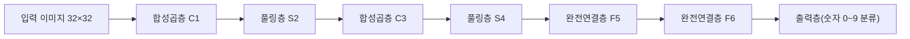
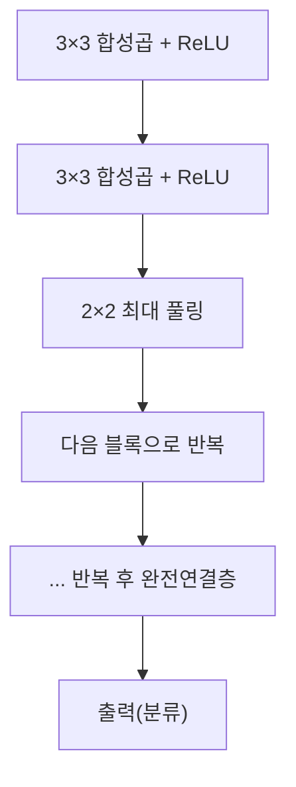
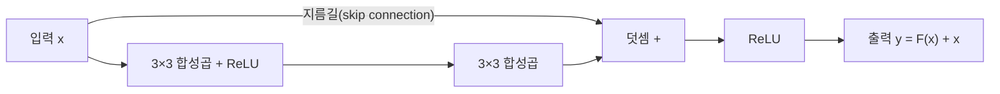

<Callout type="info">
  **이번 문서의 목표:** 이 파일을 다 읽으면 LeNet·AlexNet·VGG·ResNet이 등장한 순서와 각자의 핵심 아이디어를 설명하고, 신경망이 깊어질수록 생기는 문제와 ResNet의 잔차 연결(residual connection)이 그 문제를 어떻게 완화하는지 이해할 수 있다.
</Callout>

## 왜 대표 구조를 따로 공부해야 하는가

> **쉽게 말하면:** 합성곱·풀링이라는 부품을 어떻게 조립하느냐에 따라 성능이 크게 달라지며, 그 조립 방식의 역사를 알면 "왜 이렇게 설계했는지"가 보인다.

11편에서 합성곱(convolution)·패딩(padding)·스트라이드(stride)·풀링(pooling)이라는 CNN(Convolutional Neural Network, 합성곱 신경망)의 기본 부품을 배웠다. 이번 편에서는 이 부품들을 실제로 어떻게 쌓아 올렸는지를, 시대순으로 등장한 네 가지 대표 구조 — **LeNet**, **AlexNet**, **VGG**, **ResNet** — 를 통해 살펴본다.

이 구조들을 순서대로 공부하는 이유는 단순히 역사를 암기하기 위해서가 아니다. 각 구조는 이전 구조가 부딪힌 한계를 해결하려는 시도였고, 그 해결책 안에 이후 CNN 설계 전반에 계속 쓰이는 핵심 아이디어(활성화 함수 선택, 드롭아웃, 깊이의 효과, 잔차 연결)가 담겨 있다. 독학사 시험에서도 "이 구조의 핵심 특징은 무엇인가", "어떤 문제를 해결하기 위해 등장했는가"를 묻는 문제가 자주 나온다.

## LeNet: CNN의 원형

> **쉽게 말하면:** 손글씨 숫자를 인식하기 위해 합성곱과 풀링을 처음으로 성공적으로 결합한 신경망이다.

**LeNet**(정확히는 LeNet-5)은 1998년 얀 르쿤(Yann LeCun) 등이 손글씨 숫자 인식(우편번호 인식 등)을 위해 제안한 구조로, 오늘날 CNN 설계의 원형으로 꼽힌다. 구조는 다음과 같은 흐름을 따른다.

LeNet의 핵심 아이디어는 **합성곱층과 풀링층을 번갈아 쌓은 뒤, 마지막에 완전연결층으로 분류를 마무리**하는 패턴이다. 이 패턴은 이후 등장하는 거의 모든 CNN 구조의 기본 골격이 됐다. 다만 LeNet은 층 수가 적고(합성곱 2개, 완전연결 3개 정도) 활성화 함수로 06편에서 다룬 시그모이드(sigmoid)나 tanh를 사용했으며, 당시 계산 자원(하드웨어 성능)의 한계로 규모가 크지 않았다. 이후 이 구조가 대규모 이미지 데이터셋과 GPU(Graphics Processing Unit, 대량의 병렬 연산에 특화된 하드웨어) 연산으로 확장되기까지는 십수 년이 걸렸다.

## AlexNet: 딥러닝 붐의 시작점

> **쉽게 말하면:** LeNet의 아이디어를 훨씬 크고 깊게 확장하고, ReLU와 드롭아웃 같은 새로운 기법을 더해 대규모 이미지 인식 대회에서 압도적인 성능을 보였다.

**AlexNet**은 2012년 ImageNet(대규모 이미지 분류 데이터셋) 대회에서 기존 방법들을 큰 차이로 앞서며 우승해, 이후 딥러닝 붐을 촉발한 구조로 꼽힌다. AlexNet이 LeNet 대비 도입한 핵심 변화는 다음과 같다.

- **ReLU 활성화 함수 사용**: 06편에서 다룬 것처럼 ReLU는 시그모이드·tanh보다 그라디언트 소실 문제가 덜하고 계산도 단순해, 훨씬 깊은 신경망을 효율적으로 학습할 수 있게 해줬다.
- **드롭아웃 사용**: 09편에서 다룬 드롭아웃을 완전연결층에 적용해 대규모 신경망에서도 과적합(overfitting)을 억제했다.
- **GPU를 활용한 병렬 학습**: 당시로서는 매우 큰 규모(파라미터 6천만 개 수준)의 신경망을 GPU 두 대에 나눠 학습시켜, 규모의 한계를 실질적으로 돌파했다.
- **데이터 증강**: 10편에서 다룬 이미지 크롭·플립 등을 적용해 제한된 데이터로도 과적합을 줄였다.

AlexNet은 "LeNet의 구조적 아이디어(합성곱+풀링+완전연결)는 유지하되, 이를 훨씬 깊고 크게 만들고 그 과정에서 생기는 학습 문제(느린 수렴, 과적합)를 최신 기법으로 해결"한 사례로 이해하면 된다.

## VGG: 깊이의 힘, 그리고 작은 필터의 재발견

> **쉽게 말하면:** 크고 복잡한 필터 대신 3×3짜리 작은 필터만 아주 여러 번 겹쳐 써서, 더 깊으면서도 단순하고 일관된 구조를 만들었다.

**VGG**(2014년, VGGNet이라고도 부른다)는 "신경망을 더 깊게 쌓으면 성능이 좋아진다"는 가설을 극단적으로 밀어붙인 구조다. VGG의 핵심 설계 원칙은 **모든 합성곱층에 $3\times3$ 필터만 사용**하고, 이런 층을 여러 개 연속으로 쌓은 뒤 풀링을 적용하는 것을 반복하는 것이다.

여기서 중요한 통찰이 하나 있다. $3\times3$ 필터를 두 번 연속으로 적용한 것은, $5\times5$ 필터 한 번을 적용한 것과 같은 크기의 영역(**수용 영역**, receptive field, 출력의 한 칸이 입력 이미지의 어느 범위를 보고 있는지)을 커버한다. 마찬가지로 $3\times3$을 세 번 연속 적용하면 $7\times7$ 필터 한 번과 같은 수용 영역을 갖는다. 그런데 $3\times3$ 필터를 여러 번 쌓는 쪽이 더 유리한 이유가 두 가지 있다.

1. **파라미터 수가 더 적다.** 11편의 파라미터 수 공식 $(F\times F \times C_{in}+1)\times C_{out}$을 생각하면, 입출력 채널이 같은 경우 $5\times5$ 필터 1개의 파라미터는 $5\times5=25$(채널·편향 제외 비교 시)이지만, $3\times3$ 필터 2개를 쌓으면 $3\times3\times2=18$로 오히려 더 적다.
2. **비선형성이 더 많이 들어간다.** 합성곱층 하나마다 그 뒤에 활성화 함수(ReLU)가 붙으므로, $3\times3$을 여러 번 쌓으면 그만큼 비선형 변환이 여러 번 적용되어 더 복잡한 패턴을 표현할 수 있다.

VGG는 층수에 따라 VGG-16(합성곱+완전연결 총 16개 층), VGG-19 등으로 불리며, 구조가 단순하고 규칙적이어서 이해하거나 다른 문제에 재사용(전이학습)하기 쉽다는 장점이 있다. 다만 파라미터 수 자체는 여전히 매우 많아(특히 완전연결층에서) 메모리 사용량이 크다는 단점이 있다.

## ResNet: 깊이의 한계를 잔차 연결로 돌파하다

> **쉽게 말하면:** 신경망을 무작정 깊게 쌓으면 오히려 성능이 나빠지는 문제가 나타났는데, 층을 건너뛰는 지름길을 추가해서 이 문제를 해결했다.

VGG 이후 "더 깊게 쌓으면 항상 더 좋아지는가"라는 질문에 대한 답이 "아니다"로 밝혀졌다. 신경망을 아주 깊게(수십~수백 층) 쌓으면 07편에서 다룬 **그라디언트 소실**(vanishing gradient) 문제가 심해져서, 오히려 얕은 신경망보다 학습이 잘 안 되는 **성능 저하**(degradation) 현상이 나타났다. 이는 과적합 때문이 아니라(훈련 오차 자체가 더 깊은 신경망에서 더 높게 나타났다), 최적화 자체가 어려워지는 문제였다.

**ResNet**(Residual Network, 2015년)은 이 문제를 **잔차 연결**(residual connection, skip connection이라고도 한다)로 해결했다. 일반적인 층은 입력 $x$를 받아 원하는 목표 함수 $H(x)$를 직접 근사하도록 학습한다. ResNet은 대신 층이 **잔차**(residual, 목표와 입력의 차이) $F(x) = H(x) - x$만 학습하도록 하고, 최종 출력은 이 잔차에 입력을 다시 더해준다.

$$
y = F(x) + x
$$

- $x$: 이 블록(잔차 블록, residual block)의 입력
- $F(x)$: 합성곱층들이 학습하는 잔차 함수(입력과 목표 출력의 차이를 근사)
- $y$: 잔차 블록의 최종 출력

이 구조가 그라디언트 소실을 완화하는 이유는 역전파(backpropagation) 관점에서 설명할 수 있다. $y=F(x)+x$를 $x$에 대해 미분하면 $\frac{\partial y}{\partial x} = \frac{\partial F(x)}{\partial x} + 1$이 된다. 07편에서 배운 체인 룰(chain rule)로 그라디언트가 여러 층을 거슬러 갈 때, 이 "$+1$" 항 덕분에 $\frac{\partial F(x)}{\partial x}$ 부분이 아무리 작아지더라도(0에 가까워지더라도) 최소한 1만큼의 그라디언트는 지름길을 통해 그대로 앞 층까지 전달된다. 즉 스킵 연결이 그라디언트가 소실되지 않고 흐를 수 있는 "우회로"를 만들어 주는 것이다.

또 다른 직관은 "학습해야 할 목표가 더 쉬워진다"는 것이다. 만약 어떤 층이 사실 항등 함수(identity function, 입력을 그대로 출력하는 함수, 즉 $H(x)=x$)에 가까운 것이 최적이라면, 잔차 블록은 $F(x)=0$만 학습하면 되므로(가중치를 0에 가깝게 만들면 됨) 일반적인 층이 직접 $H(x)=x$를 근사하는 것보다 훨씬 쉽다.

> **비유:** 고층 건물에서 각 층마다 반드시 계단으로만 이동해야 한다면 위층으로 갈수록 피로가 누적되어 정보(에너지)가 소실된다. 중간중간 엘리베이터(스킵 연결)를 놓아두면, 아무리 높은 층이라도 지상의 신호가 곧바로 전달될 수 있다.

## 네 가지 구조 비교

| 구조 | 등장 연도 | 핵심 아이디어 | 대표 특징 |
|------|-----------|----------------|-----------|
| LeNet | 1998 | 합성곱+풀링+완전연결의 기본 골격 확립 | 손글씨 숫자 인식, 얕은 구조, 시그모이드/tanh 사용 |
| AlexNet | 2012 | 깊은 구조 + ReLU + 드롭아웃 + GPU 학습 | ImageNet 대회 우승, 딥러닝 붐 촉발 |
| VGG | 2014 | 3×3 필터만 반복 사용, 규칙적인 깊은 구조 | 단순하고 재사용하기 쉬운 구조, 파라미터 수는 여전히 많음 |
| ResNet | 2015 | 잔차 연결(skip connection)로 깊이의 한계 돌파 | 수십–수백 층까지 학습 가능, 성능 저하(degradation) 문제 해결 |

시험에서는 각 구조를 단독으로 묻기보다, "어떤 문제를 해결하기 위해 등장했는가"를 짝지어 묻는 경우가 많다. 예컨대 "AlexNet은 무엇을 해결했는가 → 얕은 구조·시그모이드의 느린 학습, GPU 부재로 인한 규모 한계", "ResNet은 무엇을 해결했는가 → 깊은 신경망의 성능 저하(그라디언트 소실에 기인)"처럼 원인과 해결책을 연결해 기억하는 것이 효과적이다.

## 핵심 정리

- LeNet은 합성곱+풀링+완전연결을 번갈아 쌓는 CNN의 기본 골격을 확립했다(1998년, 손글씨 숫자 인식).
- AlexNet은 ReLU·드롭아웃·GPU 병렬 학습·데이터 증강을 결합해 신경망을 훨씬 깊고 크게 만들어, 2012년 ImageNet 대회에서 우승하며 딥러닝 붐을 촉발했다.
- VGG는 $3\times3$ 필터만 반복 사용해 더 적은 파라미터로 더 큰 수용 영역과 더 많은 비선형성을 얻는 규칙적인 구조를 제시했다.
- 신경망을 무작정 깊게 쌓으면 그라디언트 소실로 인한 성능 저하(degradation) 문제가 나타나는데, ResNet은 $y=F(x)+x$ 형태의 잔차 연결로 그라디언트가 지름길을 통해 전달되게 해 이를 완화했다.
- ResNet의 잔차 연결은 미분했을 때 $+1$ 항이 남아, 아무리 깊은 층에서도 최소한의 그라디언트가 앞 층까지 전달되도록 보장한다.

## 마무리 복습

<Quiz
  questionNumber={1}
  question="LeNet에서 처음 확립되어 이후 CNN 구조 전반에서 계속 쓰인 기본 골격은 무엇인가?"
  options={['잔차 연결(skip connection)로 층을 건너뛰는 구조', '합성곱층과 풀링층을 번갈아 쌓은 뒤 완전연결층으로 마무리하는 구조', '3×3 필터만 반복해서 쌓는 구조', 'ReLU와 드롭아웃을 결합한 구조']}
  correctAnswer={2}
  explanation="LeNet은 합성곱층과 풀링층을 번갈아 쌓고 마지막에 완전연결층으로 분류를 마무리하는 패턴을 확립했으며, 이는 이후 CNN 설계의 기본 골격이 되었다."
  optionExplanations={['잔차 연결은 ResNet(2015년)에서 도입된 개념으로 LeNet과는 시기·아이디어가 다르다', '정답. 합성곱+풀링+완전연결의 반복 구조가 LeNet의 핵심 유산이다', '3×3 필터 반복 사용은 VGG의 핵심 설계 원칙이다', 'ReLU와 드롭아웃은 AlexNet(2012년)에서 본격적으로 도입되었다']}
/>

<Quiz
  questionNumber={2}
  question="AlexNet이 LeNet 대비 도입한 변화로 옳지 않은 것은?"
  options={['ReLU 활성화 함수를 사용해 그라디언트 소실 문제를 완화했다', '드롭아웃을 완전연결층에 적용해 과적합을 억제했다', 'GPU를 활용한 병렬 학습으로 훨씬 큰 규모의 신경망을 학습시켰다', '잔차 연결을 도입해 수백 층까지 깊이를 확장했다']}
  correctAnswer={4}
  explanation="잔차 연결은 2015년 ResNet에서 도입된 개념이다. AlexNet(2012년)은 ReLU·드롭아웃·GPU 병렬 학습·데이터 증강을 통해 성능을 끌어올린 구조다."
  optionExplanations={['옳은 설명이다. ReLU는 AlexNet에서 본격적으로 사용되어 학습 속도와 안정성을 높였다', '옳은 설명이다. 드롭아웃은 AlexNet의 완전연결층 과적합 억제에 사용되었다', '옳은 설명이다. GPU 두 대를 활용한 병렬 학습이 AlexNet의 규모를 가능하게 했다', '옳지 않은 설명(정답). 잔차 연결은 ResNet의 특징이며 AlexNet에는 없다']}
/>

<Quiz
  questionNumber={3}
  question="VGG가 3×3 필터를 여러 번 연속으로 쌓는 방식을 채택한 이유로 옳은 것은?"
  options={['3×3 필터 여러 개를 쌓으면 하나의 큰 필터보다 파라미터 수는 늘어나지만 학습이 더 안정적이기 때문이다', '3×3 필터를 여러 번 쌓으면 더 큰 필터 하나와 같은 수용 영역을 더 적은 파라미터와 더 많은 비선형성으로 얻을 수 있기 때문이다', '3×3 필터는 패딩 없이도 항상 입력과 같은 출력 크기를 만들어내기 때문이다', '3×3 필터는 풀링 없이 이미지 크기를 절반으로 줄여주기 때문이다']}
  correctAnswer={2}
  explanation="예를 들어 3×3 필터 두 번은 5×5 필터 한 번과 같은 수용 영역을 갖지만, 파라미터 수(3×3×2=18)가 5×5(25)보다 적고, 활성화 함수가 두 번 적용되어 비선형성도 더 많이 들어간다."
  optionExplanations={['파라미터 수는 오히려 줄어드는 것이 VGG의 장점 중 하나다', '정답. 더 적은 파라미터로 같은 수용 영역과 더 많은 비선형성을 얻는 것이 핵심 이유다', '출력 크기는 패딩 설정에 따라 달라지며 필터 크기만으로 결정되지 않는다', '스트라이드가 1인 합성곱 자체는 이미지 크기를 절반으로 줄이지 않는다. 크기 축소는 주로 풀링이나 스트라이드 2 이상에서 일어난다']}
/>

<Quiz
  questionNumber={4}
  question="ResNet의 잔차 연결(residual connection) y = F(x) + x가 그라디언트 소실 문제를 완화하는 원리로 옳은 것은?"
  options={['y를 x에 대해 미분하면 ∂F(x)/∂x + 1이 되어, F(x) 부분의 그라디언트가 작아져도 지름길을 통해 최소 1만큼의 그라디언트가 전달된다', 'F(x) 함수 자체가 그라디언트 소실을 원천적으로 발생시키지 않도록 설계되었기 때문이다', '잔차 연결은 역전파 계산을 생략하고 순전파만으로 학습을 완료하기 때문이다', '입력 x를 매 층마다 0으로 초기화해 그라디언트 폭발을 막기 때문이다']}
  correctAnswer={1}
  explanation="y=F(x)+x를 미분하면 ∂y/∂x = ∂F(x)/∂x + 1이 되므로, 아무리 깊은 층에서 F(x) 부분의 그라디언트가 0에 가까워져도 +1 항 덕분에 최소한의 그라디언트가 스킵 연결을 통해 앞 층까지 전달된다."
  optionExplanations={['정답. +1 항이 그라디언트가 소실되지 않고 흐르게 하는 핵심 원리다', 'F(x) 자체가 그라디언트 소실을 없애는 것이 아니라, x를 더해주는 지름길 구조가 핵심이다', '잔차 연결이 있어도 역전파는 여전히 필요하며, 생략되지 않는다', '가중치 초기화와 잔차 연결의 그라디언트 전달 원리는 서로 다른 개념이다']}
/>

<Quiz
  questionNumber={5}
  question="신경망을 매우 깊게(수십~수백 층) 쌓았을 때 나타난 성능 저하(degradation) 현상에 대한 설명으로 옳은 것은?"
  options={['검증 오차만 높아지고 훈련 오차는 낮게 유지되는 전형적인 과적합 현상이다', '훈련 오차 자체가 얕은 신경망보다 더 높게 나타나는, 최적화 자체가 어려워지는 문제다', '드롭아웃을 과도하게 적용해 발생하는 문제로 드롭아웃 비율을 낮추면 해결된다', '데이터 증강을 하지 않아서 발생하는 문제로 데이터를 늘리면 해결된다']}
  correctAnswer={2}
  explanation="성능 저하 현상은 훈련 오차 자체가 더 깊은 신경망에서 더 높게 나타나는 현상으로, 과적합이 아니라 그라디언트 소실 등으로 인한 최적화 자체의 어려움에서 비롯된다. ResNet은 이를 잔차 연결로 해결했다."
  optionExplanations={['과적합이라면 훈련 오차는 낮게 유지되어야 하는데, 성능 저하는 훈련 오차 자체가 높아지는 현상이라 과적합과는 다르다', '정답. 훈련 오차 자체가 높아지는 최적화 문제이며, 이 때문에 잔차 연결이라는 구조적 해법이 필요했다', '드롭아웃 비율과 깊은 신경망의 성능 저하 현상은 직접적인 인과 관계가 없다', '데이터 증강 부족이 아니라 신경망 깊이 자체로 인한 최적화 문제다']}
/>

<Quiz
  questionNumber={6}
  question="LeNet, AlexNet, VGG, ResNet을 등장 순서대로 나열한 것은?"
  options={['AlexNet → LeNet → ResNet → VGG', 'LeNet → AlexNet → VGG → ResNet', 'VGG → AlexNet → LeNet → ResNet', 'ResNet → VGG → AlexNet → LeNet']}
  correctAnswer={2}
  explanation="LeNet(1998) → AlexNet(2012) → VGG(2014) → ResNet(2015) 순서로 등장했다."
  optionExplanations={['LeNet이 가장 먼저(1998년) 등장했으므로 순서가 맞지 않는다', '정답. 1998년 LeNet, 2012년 AlexNet, 2014년 VGG, 2015년 ResNet 순이다', 'VGG(2014)가 AlexNet(2012)보다 먼저 나온 것으로 잘못 배열되어 있다', 'ResNet(2015)이 가장 나중에 등장했으므로 첫 순서에 놓이는 것은 옳지 않다']}
/>

## 참고 자료

- [Stanford CS231n: Convolutional Neural Networks for Visual Recognition](https://cs231n.stanford.edu/)
- [Deep Learning Book (Goodfellow, Bengio, Courville) — Convolutional Networks](https://www.deeplearningbook.org)
