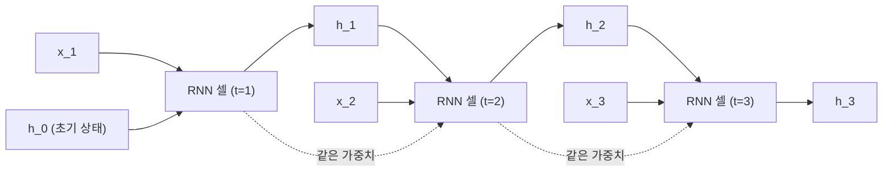
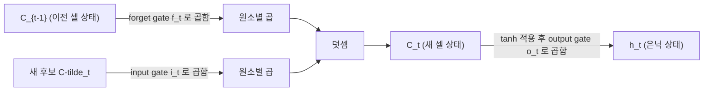

<Callout type="info">
  **이번 문서의 목표:** RNN의 은닉 상태 갱신식과 시간 펼치기(unfolding) 구조를 이해하고, 왜 긴 시퀀스에서 기울기 소실·폭발이 특히 심해지는지 설명하며, LSTM의 게이트 3종과 GRU의 간소화 지점을 구분해 설명할 수 있다.
</Callout>

## 왜 RNN이 필요한가

11–12편에서 다룬 합성곱 신경망(CNN, Convolutional Neural Network)은 이미지처럼 **고정된 크기의 입력**을 다루는 데 강하다. 하지만 문장, 음성, 주가 시계열처럼 **순서(order)가 의미를 만들고 길이가 가변적인 데이터**에는 CNN이나 05편의 다층 퍼셉트론(MLP, Multi-Layer Perceptron) 구조를 그대로 쓰기 어렵다. "나는 학교에 간다"와 "학교에 나는 간다"는 같은 단어 집합이지만 순서가 다르면 뉘앙스가 달라지고, 극단적으로 순서를 무시하면 아예 다른 문장("간다 학교에 나는")도 구분하지 못한다.

순환신경망(RNN, Recurrent Neural Network)은 이 문제를 "**같은 가중치를 시간 축을 따라 반복 적용**하면서, 이전 시점의 정보를 다음 시점으로 전달하는 상태(state)를 둔다"는 아이디어로 해결한다. 입력이 몇 개가 들어오든 같은 함수(같은 가중치 행렬)를 재사용하므로 가변 길이 시퀀스를 처리할 수 있다.

> **쉽게 말하면:** RNN은 문장을 한 단어씩 읽어 나가면서, 지금까지 읽은 내용을 "기억 메모"(은닉 상태)에 계속 업데이트해 가는 신경망이다.

## RNN의 은닉 상태 갱신식

시점(time step) $t$ 에서 RNN은 두 가지 입력을 받는다. 하나는 그 시점의 입력 벡터 $x_t$ (예: $t$번째 단어의 임베딩 벡터), 다른 하나는 이전 시점에서 넘어온 은닉 상태(hidden state) $h_{t-1}$ 이다. 이 둘을 합쳐 새로운 은닉 상태 $h_t$ 를 계산한다.

$$
h_t = \tanh(W_{xh} x_t + W_{hh} h_{t-1} + b_h)
$$

각 기호의 뜻은 다음과 같다.

- $x_t$: 시점 $t$의 입력 벡터. 예를 들어 단어 임베딩이면 차원이 $d$인 실수 벡터다.
- $h_{t-1}$: 바로 이전 시점 $t-1$까지의 정보를 압축해 담고 있는 은닉 상태 벡터. $t=0$일 때는 보통 영벡터(모든 원소가 0)로 초기화한다.
- $W_{xh}$: 입력 $x_t$를 은닉 공간으로 변환하는 가중치 행렬(input-to-hidden weight).
- $W_{hh}$: 이전 은닉 상태 $h_{t-1}$을 다음 은닉 상태로 전달할 때 곱하는 가중치 행렬(hidden-to-hidden weight). **이 행렬이 모든 시점에서 동일하게 재사용**된다는 점이 RNN의 핵심이다.
- $b_h$: 편향(bias) 벡터.
- $\tanh$: 하이퍼볼릭 탄젠트 활성화 함수. 06편에서 다룬 것처럼 출력을 $-1$에서 $1$ 사이로 눌러준다.

출력이 필요한 문제(예: 각 시점마다 클래스를 예측)라면 은닉 상태에서 출력을 한 번 더 뽑아낸다.

$$
y_t = W_{hy} h_t + b_y
$$

여기서 $W_{hy}$는 은닉 상태를 출력 공간으로 보내는 가중치, $b_y$는 출력층 편향이다. 분류 문제라면 이 $y_t$에 소프트맥스를 적용해 확률로 바꾼다.

### 시간 펼치기(unfolding)

RNN은 "루프가 있는 하나의 셀"로 그릴 수도 있고, 그 루프를 시간 축으로 풀어서 "같은 가중치를 공유하는 여러 층이 늘어선 신경망"으로 그릴 수도 있다. 후자를 시간 펼치기(unfolding in time)라 부르며, 역전파를 이해하려면 반드시 이 펼친 그림으로 생각해야 한다.

그림에서 `RNN 셀 (t=1)`, `(t=2)`, `(t=3)`은 서로 다른 박스처럼 보이지만, 내부의 $W_{xh}$, $W_{hh}$, $b_h$는 **전부 동일한 값**을 공유한다(점선으로 표시). 이 "가중치 공유(weight sharing)"가 RNN을 CNN의 필터 공유와 유사하게 만들어 주는 지점이며, 동시에 뒤에서 다룰 기울기 문제의 원인이기도 하다.

## 장기 의존성 문제와 기울기 소실·폭발

문장이 길어질수록 RNN은 "오래전에 읽은 정보"를 뒤쪽 시점까지 전달해야 하는 경우가 많다. 예를 들어 "그 나라는... (중략, 40단어)... 그래서 그곳 사람들은 그 언어를 쓴다"라는 문장에서 "그 언어"가 무엇인지 맞히려면 40단어 전에 나온 "나라" 정보를 은닉 상태가 계속 들고 있어야 한다. 이렇게 **멀리 떨어진 시점 사이의 의존 관계**를 장기 의존성(long-term dependency)이라 부른다.

> **쉽게 말하면:** RNN은 짧은 문장은 잘 기억하지만, 문장이 길어질수록 앞부분 정보를 까먹거나 반대로 신호가 폭발적으로 커져 학습이 불안정해진다.

07편에서 역전파는 체인 룰(연쇄 법칙)로 국소 기울기(gradient)를 곱해 나가는 과정이라고 배웠다. RNN을 시간에 대해 펼친 뒤 역전파를 적용하는 것을 시간 역전파(BPTT, Backpropagation Through Time)라 하는데, 여기서 시점 $t$의 손실이 훨씬 이전 시점 $k$의 은닉 상태에 미치는 영향은 그 사이에 있는 모든 시점의 국소 기울기를 곱한 값으로 근사된다.

$$
\frac{\partial h_t}{\partial h_k} = \prod_{i=k+1}^{t} \frac{\partial h_i}{\partial h_{i-1}}
$$

- $\dfrac{\partial h_t}{\partial h_k}$: 시점 $t$의 은닉 상태가 훨씬 이전인 시점 $k$의 은닉 상태에 얼마나 민감한지를 나타내는 기울기.
- $\prod$: 파이(pi), "모두 곱하라"는 기호(시그마 $\sum$가 "모두 더하라"라면 파이는 "모두 곱하라"다).
- $\dfrac{\partial h_i}{\partial h_{i-1}}$: 인접한 두 시점 사이의 국소 기울기. 여기에는 매번 같은 $W_{hh}$가 곱해진다.

이 곱셈이 문제다. 만약 $W_{hh}$의 고유값(eigenvalue, 행렬이 벡터를 얼마나 늘리거나 줄이는지를 나타내는 값) 크기가 1보다 계속 작으면, 여러 번 곱할수록 값이 지수적으로 0에 가까워진다 — 이것이 기울기 소실(vanishing gradient)이다. 반대로 고유값 크기가 1보다 크면 곱할수록 값이 지수적으로 커져 발산한다 — 기울기 폭발(exploding gradient)이다.

CNN이나 얕은 MLP도 층이 깊어지면 비슷한 문제를 겪지만, RNN에서 유독 심한 이유는 **같은 가중치 행렬 $W_{hh}$를 시퀀스 길이만큼 반복해서 곱하기 때문**이다. 층마다 서로 다른 가중치를 쓰는 일반 심층망과 달리, RNN은 문장이 100단어면 "동일한 행렬을 100번 곱한 것"과 사실상 같은 구조가 되어 소실·폭발이 훨씬 빠르고 극단적으로 나타난다.

- **기울기 폭발**은 비교적 다루기 쉽다. 기울기의 크기(norm)가 특정 임계값을 넘으면 잘라내는 기울기 클리핑(gradient clipping)으로 완화한다.
- **기울기 소실**은 훨씬 다루기 어렵다. 클리핑으로는 "이미 0에 가까워진" 신호를 되살릴 수 없기 때문이다. 이 문제를 구조적으로 해결하려는 시도가 바로 다음 절의 LSTM이다.

## LSTM: 게이트로 정보 흐름을 제어한다

장단기 기억망(LSTM, Long Short-Term Memory)은 은닉 상태 외에 **셀 상태(cell state)** $C_t$라는 별도의 "장기 기억 컨베이어 벨트"를 추가하고, 이 벨트에 무엇을 지우고 무엇을 더할지를 세 개의 게이트(gate)로 조절한다. 게이트는 0에서 1 사이 값을 내는 시그모이드 함수로 만들어지며, 0에 가까우면 "그 정보를 막는다", 1에 가까우면 "그대로 통과시킨다"는 뜻이다.

| 게이트 | 수식 | 역할 | 직관 |
|---|---|---|---|
| 망각 게이트(forget gate) $f_t$ | $f_t = \sigma(W_f [h_{t-1}, x_t] + b_f)$ | 이전 셀 상태 $C_{t-1}$ 중 얼마를 버릴지 결정 | "지금까지 기억 중 필요 없어진 부분을 지운다" |
| 입력 게이트(input gate) $i_t$ | $i_t = \sigma(W_i [h_{t-1}, x_t] + b_i)$ | 새 후보 정보 중 얼마를 셀 상태에 더할지 결정 | "새로 들어온 정보 중 기억할 가치가 있는 부분을 고른다" |
| 출력 게이트(output gate) $o_t$ | $o_t = \sigma(W_o [h_{t-1}, x_t] + b_o)$ | 셀 상태 중 얼마를 이번 시점의 은닉 상태로 내보낼지 결정 | "장기 기억 중 지금 당장 답에 쓸 부분만 꺼낸다" |

표의 $\sigma$는 시그마가 아니라 소문자 시그모이드 함수(sigma, $\sigma(z) = 1/(1+e^{-z})$)를 가리키며, $[h_{t-1}, x_t]$는 두 벡터를 이어 붙인(concatenate) 벡터를 뜻한다.

셀 상태를 실제로 갱신하는 식은 다음과 같다. 먼저 "새로 들어올 후보 정보" $\tilde{C}_t$ (틸드 C, C candidate)를 tanh로 계산한다.

$$
\tilde{C}_t = \tanh(W_C [h_{t-1}, x_t] + b_C)
$$

그다음 망각 게이트와 입력 게이트를 이용해 셀 상태를 갱신한다.

$$
C_t = f_t \odot C_{t-1} + i_t \odot \tilde{C}_t
$$

- $\odot$: 아다마르 곱(Hadamard product), 두 벡터의 같은 위치 원소끼리 곱하는 원소별 곱셈. 행렬 곱과 달리 벡터의 차원이 그대로 유지된다.
- $f_t \odot C_{t-1}$: 이전 기억 중 "망각 게이트가 열어둔 만큼만" 남긴다.
- $i_t \odot \tilde{C}_t$: 새 후보 정보 중 "입력 게이트가 허락한 만큼만" 더한다.

마지막으로 은닉 상태는 셀 상태를 tanh로 한 번 눌러준 뒤 출력 게이트로 걸러서 만든다.

$$
h_t = o_t \odot \tanh(C_t)
$$

### 셀 상태 흐름 그림

이 그림에서 핵심은 셀 상태 $C_{t-1}$에서 $C_t$로 가는 경로가 **덧셈 위주**라는 점이다. RNN의 은닉 상태 갱신식은 매 시점 $W_{hh}$를 곱하고 tanh를 씌우는 "곱셈·비선형 변환" 경로였지만, LSTM의 셀 상태 경로는 게이트 값을 곱하는 것을 빼면 거의 덧셈으로 흘러간다. 덧셈은 역전파 시 기울기를 그대로 전달하는 성질이 있어서(합의 미분은 그대로 분배되므로), 망각 게이트가 1에 가깝게 열려 있는 한 셀 상태를 통한 기울기가 지수적으로 줄어들지 않는다. 이것이 LSTM이 기울기 소실 문제를 크게 완화하는 구조적인 이유다.

## GRU: 게이트를 줄인 간소화 버전

게이트 순환 유닛(GRU, Gated Recurrent Unit)은 LSTM의 아이디어(게이트로 정보 흐름을 조절한다)를 유지하면서 구조를 더 가볍게 만든 변형이다. 가장 큰 차이는 다음과 같다.

- **셀 상태와 은닉 상태를 하나로 합친다.** LSTM은 $C_t$와 $h_t$를 따로 두지만, GRU는 은닉 상태 $h_t$ 하나만 사용한다.
- **게이트를 3개에서 2개로 줄인다.** 망각 게이트와 입력 게이트를 리셋 게이트(reset gate) $r_t$와 업데이트 게이트(update gate) $z_t$로 재구성하며, 별도의 출력 게이트가 없다.

$$
z_t = \sigma(W_z [h_{t-1}, x_t] + b_z)
$$

$$
r_t = \sigma(W_r [h_{t-1}, x_t] + b_r)
$$

업데이트 게이트 $z_t$는 "이전 은닉 상태를 얼마나 유지하고, 새 후보를 얼마나 받아들일지"를 한 번에 결정한다(LSTM의 망각 게이트와 입력 게이트 역할을 하나로 합친 셈이다). 리셋 게이트 $r_t$는 새 후보를 계산할 때 이전 은닉 상태를 얼마나 참고할지를 정한다.

$$
\tilde{h}_t = \tanh(W_h [r_t \odot h_{t-1}, x_t] + b_h)
$$

$$
h_t = (1 - z_t) \odot h_{t-1} + z_t \odot \tilde{h}_t
$$

마지막 식에서 $(1 - z_t)$와 $z_t$가 합이 1이 되도록 맞물려 있어, "옛 정보를 얼마나 남길지"와 "새 정보를 얼마나 받아들일지"가 하나의 게이트로 동시에 조절된다는 점이 LSTM의 망각·입력 게이트 두 개를 따로 학습하는 것과 대비된다.

| 비교 항목 | LSTM | GRU |
|---|---|---|
| 상태 개수 | 셀 상태 $C_t$ + 은닉 상태 $h_t$ (2개) | 은닉 상태 $h_t$만 (1개) |
| 게이트 개수 | 망각·입력·출력 (3개) | 리셋·업데이트 (2개) |
| 파라미터 수 | 상대적으로 많음 | 상대적으로 적음(계산·학습이 가볍다) |
| 표현력 | 게이트가 세분화되어 더 정교한 제어 가능 | 구조가 단순해 적은 데이터·자원에서 유리한 경우가 많음 |
| 성능 경향 | 과제에 따라 다름(둘 다 우열이 고정적이지 않음) | 과제에 따라 다름(둘 다 우열이 고정적이지 않음) |

시험에서는 "LSTM과 GRU 중 무엇이 항상 더 우수하다"는 식의 보기가 나오면 틀린 진술일 가능성이 높다는 점을 기억해 두자. 두 구조의 성능 우열은 데이터와 과제에 따라 달라진다는 것이 일반적인 결론이다.

## 자주 틀리는 점

- RNN의 가중치 $W_{hh}$가 "시점마다 다른 값"이라고 착각하는 경우가 많다. 실제로는 **모든 시점에서 동일한 행렬을 공유**하며, 이 공유 때문에 긴 시퀀스에서 곱셈이 누적되어 기울기 문제가 심해진다.
- LSTM이 "기울기 소실을 완전히 없앤다"고 오해하기 쉽다. 정확히는 셀 상태의 덧셈 경로 덕분에 **크게 완화**하는 것이지, 여전히 매우 긴 시퀀스에서는 소실이 발생할 수 있다.
- GRU가 "LSTM보다 항상 성능이 좋다" 또는 "항상 더 나쁘다"는 진술은 옳지 않다. GRU는 구조가 간단해 계산이 가볍다는 장점이 있을 뿐, 성능은 과제·데이터에 따라 달라진다.
- 망각 게이트 값이 1이라는 것은 "이전 기억을 모두 버린다"가 아니라 **이전 기억을 모두 통과시켜 그대로 남긴다**는 뜻이다. 0과 1의 의미를 반대로 외우는 실수가 흔하다.

## 핵심 정리

- RNN은 은닉 상태 $h_t = \tanh(W_{xh}x_t + W_{hh}h_{t-1} + b_h)$를 시점마다 갱신하며, 시간 축으로 펼치면 가중치를 공유하는 여러 층으로 볼 수 있다.
- 시간 역전파(BPTT)는 같은 가중치 $W_{hh}$를 시퀀스 길이만큼 반복 곱하므로, 일반 심층망보다 기울기 소실·폭발이 훨씬 빠르고 극단적으로 나타난다.
- LSTM은 셀 상태 $C_t$와 망각·입력·출력 3개 게이트를 도입해, 덧셈 위주의 경로로 장기 의존성 문제를 완화한다.
- GRU는 셀 상태를 은닉 상태에 통합하고 게이트를 리셋·업데이트 2개로 줄여 구조를 가볍게 만든 변형이다.

## 마무리 복습

<Quiz
  questionNumber={1}
  question="RNN의 은닉 상태 갱신식에서 시점이 바뀌어도 값이 변하지 않는 것은?"
  options={['입력 벡터 x_t', '은닉 상태 h_t', '가중치 행렬 W_hh', '출력 y_t']}
  correctAnswer={3}
  explanation="RNN은 모든 시점에서 동일한 가중치 행렬(W_xh, W_hh, 편향)을 공유해서 재사용한다. 입력, 은닉 상태, 출력은 시점마다 새로 계산되는 값이다."
  optionExplanations={['입력 벡터는 시점마다 새로운 단어나 값으로 바뀐다.', '은닉 상태는 매 시점 새로 계산되는 값이다.', '정답이다. 가중치 행렬은 모든 시점에서 동일하게 공유된다.', '출력 역시 시점마다 새로 계산된다.']}
/>

<Quiz
  questionNumber={2}
  question="RNN에서 기울기 소실·폭발이 일반적인 심층 신경망보다 특히 심하게 나타나는 근본적인 이유는?"
  options={['활성화 함수로 ReLU 대신 tanh를 쓰기 때문이다', '동일한 가중치 행렬을 시퀀스 길이만큼 반복해서 곱하기 때문이다', '입력 벡터의 차원이 항상 크기 때문이다', '손실 함수로 크로스엔트로피를 쓰기 때문이다']}
  correctAnswer={2}
  explanation="시간 역전파는 인접 시점 사이의 국소 기울기를 시퀀스 길이만큼 곱해 나가는데, 이때 매번 같은 W_hh가 곱해진다. 같은 행렬을 반복 곱하면 고유값 크기에 따라 지수적으로 소실되거나 폭발한다."
  optionExplanations={['활성화 함수 선택은 영향을 줄 수 있지만 근본 원인은 아니다.', '정답이다. 동일 가중치의 반복 곱셈이 지수적 소실·폭발을 만든다.', '입력 차원은 이 문제의 직접적인 원인이 아니다.', '손실 함수 선택은 이 현상과 직접 관련이 없다.']}
/>

<Quiz
  questionNumber={3}
  question="LSTM에서 망각 게이트(forget gate)의 값이 1에 가깝다는 것은 무엇을 의미하는가?"
  options={['이전 셀 상태를 거의 모두 버린다', '이전 셀 상태를 거의 그대로 통과시켜 유지한다', '새 후보 정보를 셀 상태에 반영하지 않는다', '출력 게이트를 완전히 닫는다']}
  correctAnswer={2}
  explanation="게이트는 시그모이드 함수로 만들어지며 0은 차단, 1은 통과를 의미한다. 망각 게이트가 1에 가까우면 이전 셀 상태 C_{t-1}을 거의 그대로 다음 셀 상태로 넘긴다."
  optionExplanations={['0에 가까울 때의 설명이다.', '정답이다. 1에 가까운 게이트 값은 정보를 그대로 통과시킨다.', '이는 입력 게이트가 0에 가까울 때의 설명이며 망각 게이트와는 별개다.', '출력 게이트는 별도의 게이트로 망각 게이트와 직접 관련이 없다.']}
/>

<Quiz
  questionNumber={4}
  question="LSTM의 셀 상태 경로가 기울기 소실을 완화하는 구조적인 이유로 가장 적절한 것은?"
  options={['셀 상태 갱신이 곱셈이 아닌 덧셈 위주로 이루어져 기울기가 그대로 전달되기 쉽다', '셀 상태에는 활성화 함수가 전혀 적용되지 않기 때문이다', '셀 상태의 차원이 은닉 상태보다 항상 크기 때문이다', '망각 게이트가 항상 0으로 고정되기 때문이다']}
  correctAnswer={1}
  explanation="C_t = f_t 곱하기 C_{t-1} 더하기 i_t 곱하기 C-tilde_t 식에서 핵심 경로는 덧셈이다. 합의 미분은 그대로 분배되므로 게이트가 충분히 열려 있으면 기울기가 크게 줄지 않고 먼 시점까지 전달된다."
  optionExplanations={['정답이다. 덧셈 경로 덕분에 기울기가 잘 보존된다.', '후보값 계산에는 tanh가 쓰이므로 활성화 함수가 전혀 없다는 설명은 틀렸다.', '차원 크기는 이 문제와 직접 관련이 없다.', '망각 게이트가 항상 0으로 고정된다는 것은 사실이 아니며, 오히려 그러면 기억이 전혀 유지되지 않는다.']}
/>

<Quiz
  questionNumber={5}
  question="GRU가 LSTM에 비해 구조를 간소화한 방식으로 옳은 것은?"
  options={['셀 상태와 은닉 상태를 하나로 합치고 게이트를 2개로 줄였다', '모든 게이트를 제거하고 단순한 선형 결합만 사용한다', '활성화 함수를 시그모이드에서 ReLU로 전부 교체했다', '시간 축 펼치기를 사용하지 않는다']}
  correctAnswer={1}
  explanation="GRU는 LSTM의 셀 상태와 은닉 상태를 하나의 은닉 상태로 통합하고, 망각·입력·출력 3개 게이트를 리셋·업데이트 2개 게이트로 줄인 간소화 구조다."
  optionExplanations={['정답이다. 상태를 하나로 합치고 게이트 수를 줄인 것이 GRU의 핵심 간소화 지점이다.', 'GRU도 리셋·업데이트 게이트를 사용하므로 게이트를 모두 제거한 것은 아니다.', 'GRU 역시 게이트 계산에는 시그모이드, 후보 계산에는 tanh를 사용한다.', 'GRU도 RNN 계열이므로 시간 축을 따라 펼쳐서 계산한다.']}
/>

<Quiz
  questionNumber={6}
  question="LSTM과 GRU의 성능을 비교하는 진술 중 옳지 않은 것은?"
  options={['GRU는 파라미터 수가 적어 계산 비용이 상대적으로 가벼운 경우가 많다', 'LSTM은 게이트가 더 세분화되어 있어 정교한 정보 제어가 가능하다', 'GRU는 항상 모든 과제에서 LSTM보다 성능이 우수하다', '두 구조 중 어느 쪽이 더 나은지는 데이터와 과제에 따라 달라진다']}
  correctAnswer={3}
  explanation="옳지 않은 것을 고르는 문제다. GRU가 항상 LSTM보다 우수하다는 일반화는 옳지 않다. 두 구조의 성능 우열은 데이터셋과 과제 특성에 따라 달라진다는 것이 일반적으로 받아들여지는 결론이다."
  optionExplanations={['옳은 진술이다. GRU는 상태와 게이트가 적어 계산이 가벼운 편이다.', '옳은 진술이다. LSTM의 3개 게이트는 더 세밀한 제어를 가능하게 한다.', '정답이다. 이 진술이 옳지 않다. 성능 우열이 고정되어 있지 않다는 것이 정확한 설명이다.', '옳은 진술이다. 실제로 우열은 과제마다 달라진다.']}
/>

<Quiz
  questionNumber={7}
  question="시간 역전파(BPTT)에서 시점 t의 은닉 상태가 훨씬 이전 시점 k의 은닉 상태에 대해 갖는 기울기는 어떤 형태로 근사되는가?"
  options={['인접 시점 사이 국소 기울기들의 합', '인접 시점 사이 국소 기울기들의 곱', '가장 최근 시점의 국소 기울기 하나', '전체 시퀀스 길이로 나눈 평균 기울기']}
  correctAnswer={2}
  explanation="체인 룰에 의해 t와 k 사이에 있는 모든 인접 시점 쌍의 국소 기울기를 곱한 값으로 근사된다. 이 곱셈이 반복되면서 지수적인 소실 또는 폭발이 일어난다."
  optionExplanations={['체인 룰은 곱셈으로 연결되며 합이 아니다.', '정답이다. 인접 시점 사이 국소 기울기의 곱으로 근사된다.', '중간의 모든 시점을 거쳐야 하므로 하나의 국소 기울기만으로는 설명되지 않는다.', '평균이 아니라 곱셈 형태의 누적이다.']}
/>

## 참고 자료

- Ian Goodfellow 외, Deep Learning — https://www.deeplearningbook.org
- Stanford CS224n: Natural Language Processing with Deep Learning — https://cs224n.stanford.edu
