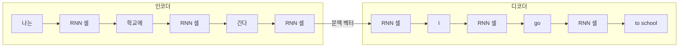

<Callout type="info">
  **이번 문서의 목표:** 원-핫 인코딩과 임베딩의 차이를 설명하고, Encoder–Decoder 기반 Seq2Seq 구조의 정보 병목 문제를 이해하며, Query·Key·Value로 어텐션 가중치를 실제로 계산할 수 있다.
</Callout>

## 왜 임베딩이 필요한가

컴퓨터는 "고양이", "강아지" 같은 단어를 그 자체로 이해하지 못한다. 신경망에 넣으려면 단어를 숫자 벡터로 바꿔야 한다. 가장 단순한 방법은 원-핫 인코딩(one-hot encoding)이다. 어휘 사전(vocabulary)에 단어가 $V$개 있다면, 각 단어를 길이 $V$짜리 벡터로 표현하되 그 단어에 해당하는 위치만 1, 나머지는 전부 0으로 채운다.

예를 들어 어휘 사전이 `[고양이, 강아지, 사과, 학교]` 4개뿐이라면, "강아지"는 다음처럼 표현된다.

$$
\text{강아지} = [0, 1, 0, 0]
$$

문제는 두 가지다. 첫째, 실제 어휘 사전은 보통 수만에서 수십만 단어이므로 벡터 하나가 그만큼 길어지고, 대부분이 0인 희소 벡터(sparse vector)라 메모리와 연산이 낭비된다. 둘째, 더 심각한 문제로 **모든 단어 쌍의 내적(inner product)이 0이 되어 단어 사이의 의미적 유사도를 전혀 표현하지 못한다.** "고양이"와 "강아지"는 둘 다 동물이라 의미가 가까운데도, 원-핫 벡터로는 "사과"나 "학교"와 다를 바 없이 완전히 독립적으로 취급된다.

> **쉽게 말하면:** 원-핫 인코딩은 단어에 번호표만 붙일 뿐, 단어끼리 얼마나 비슷한지는 전혀 담지 못한다.

임베딩(embedding)은 이 문제를 해결한다. 각 단어를 훨씬 짧은(보통 수십에서 수백 차원) **실수 벡터**로 대응시키되, 이 벡터를 신경망 학습 과정에서 함께 학습시킨다. 학습이 끝나면 의미가 비슷한 단어일수록 임베딩 공간에서 서로 가까운 위치에 놓이게 된다.

| 비교 항목 | 원-핫 인코딩 | 임베딩 |
|---|---|---|
| 벡터 차원 | 어휘 사전 크기 $V$ (수만 이상 가능) | 하이퍼파라미터로 지정(보통 수십–수백) |
| 값의 형태 | 0과 1로 구성된 희소 벡터 | 학습된 실수 값으로 구성된 밀집 벡터 |
| 단어 간 유사도 | 모든 쌍의 내적이 0(유사도 표현 불가) | 의미가 비슷한 단어끼리 벡터가 가까워짐 |
| 학습 여부 | 고정된 규칙(학습 대상 아님) | 학습 파라미터(다른 가중치처럼 역전파로 갱신) |

수학적으로 임베딩은 "원-핫 벡터에 임베딩 행렬(embedding matrix) $E$를 곱하는 것"으로 이해할 수 있다.

$$
e_{\text{강아지}} = E^\top \, \text{onehot}_{\text{강아지}}
$$

- $E$: 어휘 사전 크기 $V$ 행, 임베딩 차원 $d$ 열로 이루어진 행렬. 학습을 통해 값이 갱신된다.
- $\text{onehot}_{\text{강아지}}$: "강아지"에 해당하는 원-핫 벡터.
- $e_{\text{강아지}}$: 결과로 얻는 $d$차원 임베딩 벡터.

실제 구현에서는 행렬 곱셈 대신 $E$에서 해당 행을 바로 조회(lookup)하는 방식으로 계산하지만, 수학적 의미는 위 식과 같다. 이렇게 얻은 임베딩은 13편에서 다룬 RNN이나 LSTM의 입력 $x_t$로 그대로 사용된다.

## Seq2Seq: 시퀀스를 시퀀스로 바꾸는 구조

기계 번역("나는 학교에 간다" → "I go to school")처럼 **입력도 시퀀스, 출력도 시퀀스**이면서 두 시퀀스의 길이가 서로 다를 수 있는 문제를 시퀀스-투-시퀀스(Seq2Seq, Sequence-to-Sequence) 문제라 부른다. 13편의 RNN·LSTM은 "각 시점마다 하나씩 출력"하는 구조였지만, 번역에서는 원문을 다 읽은 뒤에야 번역을 시작해야 하는 경우가 많고 문장 길이도 다르다.

Seq2Seq는 이 문제를 인코더(encoder)와 디코더(decoder)라는 두 개의 RNN(또는 LSTM·GRU)으로 나눠 해결한다.

- **인코더**: 입력 시퀀스를 처음부터 끝까지 읽으며 은닉 상태를 갱신하고, 마지막 시점의 은닉 상태 하나를 "문장 전체의 의미를 압축한 벡터"로 사용한다. 이를 문맥 벡터(context vector)라 부른다.
- **디코더**: 문맥 벡터를 초기 은닉 상태로 받아, 한 단어씩 출력을 생성한다. 각 시점의 출력은 다음 시점의 입력으로 다시 들어간다(자기 회귀적 생성, autoregressive generation).

### 정보 병목 문제

Seq2Seq의 근본적인 약점은 "**아무리 긴 문장이라도 고정된 크기의 문맥 벡터 하나에 전부 압축해야 한다**"는 점이다. 이를 정보 병목(information bottleneck)이라 부른다. 문장이 5단어면 문제없지만, 50단어짜리 문장을 128차원 벡터 하나에 눌러 담으면 앞부분 정보가 뒤쪽 정보에 밀려 희석되기 쉽다. 실제로 Seq2Seq 모델은 문장이 길어질수록 번역 품질이 급격히 떨어지는 경향을 보였다.

## 어텐션: 필요할 때마다 원문을 다시 들여다본다

> **쉽게 말하면:** 어텐션(attention)은 디코더가 매 단어를 생성할 때마다 "원문에서 지금 가장 관련 있는 부분이 어디인지"를 다시 찾아보는 메커니즘이다.

문맥 벡터 하나에 모든 정보를 우겨넣는 대신, 어텐션은 인코더의 **모든 시점의 은닉 상태**($h_1, h_2, \dots, h_n$)를 그대로 보관해 두고, 디코더가 각 출력을 생성할 때마다 이 은닉 상태들 중 어디에 더 집중할지를 가중치로 계산한다.

이 계산을 표준화한 것이 Query(질의), Key(키), Value(값) 세 벡터를 이용한 방식이다. 15편의 Transformer에서 이 구조를 정식으로 다루므로, 여기서는 어텐션의 핵심 계산을 아주 작은 예시로 직접 검산해 본다.

- Query $q$: "지금 내가 찾고 싶은 정보가 무엇인지"를 나타내는 벡터. 디코더의 현재 은닉 상태에서 만든다.
- Key $k_i$: "이 위치($i$)가 어떤 정보를 담고 있는지"를 나타내는 벡터. 인코더의 각 시점 은닉 상태에서 만든다.
- Value $v_i$: "이 위치가 실제로 담고 있는 내용물" 벡터. 최종적으로 가중합에 쓰인다.

### 점수 함수: 내적으로 유사도를 잰다

Query와 각 Key의 내적(dot product)을 계산해 "지금 필요한 정보와 이 위치가 얼마나 관련 있는지"를 점수(score)로 만든다.

$$
\text{score}_i = q \cdot k_i
$$

내적이 크다는 것은 두 벡터의 방향이 비슷하다는 뜻이므로, 점수가 클수록 그 위치의 정보가 지금 Query와 관련이 높다고 해석한다.

### 작은 숫자로 직접 계산하기

3단어짜리 원문 "나는 학교에 간다"를 인코더가 읽어 만든 Key와 Value가 각각 다음과 같은 2차원 벡터라고 하자(실제로는 임베딩 차원이 훨씬 크지만, 계산을 손으로 검산하기 위해 2차원으로 단순화한다).

$$
k_1 = (1, 0), \quad k_2 = (0, 1), \quad k_3 = (1, 1)
$$

$$
v_1 = (2, 0), \quad v_2 = (0, 2), \quad v_3 = (1, 1)
$$

디코더가 "학교"라는 단어를 생성하려는 시점에서 만든 Query가 다음과 같다고 하자.

$$
q = (0, 1)
$$

먼저 세 개의 점수를 각각 내적으로 계산한다.

$$
\text{score}_1 = q \cdot k_1 = (0)(1) + (1)(0) = 0
$$

$$
\text{score}_2 = q \cdot k_2 = (0)(0) + (1)(1) = 1
$$

$$
\text{score}_3 = q \cdot k_3 = (0)(1) + (1)(1) = 1
$$

세 점수 $(0, 1, 1)$을 06편에서 다룬 소프트맥스(softmax) 함수에 넣어 합이 1인 가중치로 바꾼다. 소프트맥스는 $\text{softmax}(z_i) = e^{z_i} / \sum_j e^{z_j}$로 정의된다.

$$
e^0 = 1, \quad e^1 \approx 2.718, \quad e^1 \approx 2.718
$$

$$
\sum_j e^{z_j} = 1 + 2.718 + 2.718 = 6.436
$$

이제 각 가중치를 구한다.

$$
\alpha_1 = \frac{1}{6.436} \approx 0.155
$$

$$
\alpha_2 = \frac{2.718}{6.436} \approx 0.422
$$

$$
\alpha_3 = \frac{2.718}{6.436} \approx 0.422
$$

- $\alpha_i$ (알파): $i$번째 위치에 대한 어텐션 가중치. 모두 더하면 1이 된다($0.155 + 0.422 + 0.422 = 0.999 \approx 1$, 반올림 오차).

마지막으로 이 가중치를 Value 벡터에 곱해 더한 가중합(weighted sum)이 최종 어텐션 출력이다.

$$
\text{output} = \alpha_1 v_1 + \alpha_2 v_2 + \alpha_3 v_3
$$

$$
\text{output} = 0.155 \times (2, 0) + 0.422 \times (0, 2) + 0.422 \times (1, 1)
$$

$$
\text{output} = (0.310, 0) + (0, 0.844) + (0.422, 0.422) = (0.732, 1.266)
$$

### 결과 해석

원래 Query $q=(0,1)$는 $k_2=(0,1)$와 완전히 같은 방향이고 $k_3=(1,1)$와도 어느 정도 겹치지만, $k_1=(1,0)$과는 직각(내적 0)이라 전혀 관련이 없다. 계산 결과도 이를 그대로 반영한다. $k_1$에 대응하는 $\alpha_1 \approx 0.155$로 가장 작고, $k_2, k_3$에 대응하는 $\alpha_2, \alpha_3 \approx 0.422$로 훨씬 크다. 즉 디코더가 "학교"를 생성할 때 원문의 2, 3번째 위치("학교에", "간다")에 해당하는 정보에 더 집중해서 값을 가져왔다는 뜻이다. 이렇게 어텐션은 문맥 벡터 하나에 의존하지 않고, 매 출력 시점마다 원문 전체를 다시 훑어 관련 있는 부분에 가중치를 실어 준다.

## 자주 틀리는 점

- 임베딩을 "차원을 줄이는 압축 기법"으로만 이해하는 경우가 있다. 차원이 줄어드는 것은 결과일 뿐, 핵심은 **학습을 통해 의미적 유사도를 벡터 공간의 거리로 표현하게 된다**는 점이다.
- Seq2Seq의 문맥 벡터를 "인코더의 모든 은닉 상태를 평균 낸 것"으로 오해하기 쉽다. 기본 Seq2Seq는 평균이 아니라 **인코더의 마지막 시점 은닉 상태 하나**만을 문맥 벡터로 사용한다.
- 어텐션 가중치를 Query와 Value의 내적으로 계산한다고 착각하는 경우가 많다. 점수는 반드시 **Query와 Key**의 내적이며, Value는 점수 계산이 끝난 뒤 가중합에만 쓰인다.
- 소프트맥스를 적용하기 전 점수를 그대로 가중치로 쓰는 실수도 흔하다. 점수는 아무 실수 값이나 될 수 있으므로, 반드시 소프트맥스를 거쳐 합이 1인 확률 분포 형태로 바꾼 뒤 가중합을 계산해야 한다.

## 핵심 정리

- 원-핫 인코딩은 어휘 크기만큼 차원이 커지고 단어 간 유사도를 전혀 표현하지 못하지만, 임베딩은 학습된 밀집 벡터로 의미적 유사도를 거리로 표현한다.
- Seq2Seq는 인코더가 입력을 문맥 벡터 하나로 압축하고 디코더가 이를 초기 상태로 받아 출력을 생성하는 구조이며, 문장이 길어지면 정보 병목이 심해진다.
- 어텐션은 인코더의 모든 은닉 상태를 Key·Value로 남겨 두고, 디코더의 Query와 내적으로 점수를 낸 뒤 소프트맥스로 가중치를 만들어 Value를 가중합한다.
- 점수 함수는 $q \cdot k_i$, 최종 출력은 $\sum_i \alpha_i v_i$ 형태로, 15편의 Transformer에서 이 구조를 확장해 다룬다.

## 마무리 복습

<Quiz
  questionNumber={1}
  question="원-핫 인코딩과 비교했을 때 임베딩의 가장 핵심적인 장점은?"
  options={['벡터의 모든 원소가 항상 정수 값을 갖는다', '학습을 통해 의미가 비슷한 단어끼리 벡터 공간에서 가까워진다', '어휘 사전 크기와 무관하게 항상 벡터 차원이 1이 된다', '역전파 없이도 자동으로 최적의 값이 정해진다']}
  correctAnswer={2}
  explanation="원-핫 인코딩은 모든 단어 쌍의 내적이 0이라 유사도를 전혀 표현하지 못하지만, 임베딩은 학습 과정에서 의미가 비슷한 단어일수록 벡터가 가까워지도록 값이 조정된다."
  optionExplanations={['임베딩 값은 실수이며 정수로 제한되지 않는다.', '정답이다. 학습된 밀집 벡터가 의미적 유사도를 거리로 표현하는 것이 핵심 장점이다.', '임베딩 차원은 하이퍼파라미터로 지정하는 값이며 1로 고정되지 않는다.', '임베딩 행렬도 다른 가중치와 마찬가지로 역전파로 학습된다.']}
/>

<Quiz
  questionNumber={2}
  question="기본 Seq2Seq 구조에서 인코더가 디코더로 넘기는 문맥 벡터는 무엇으로 만들어지는가?"
  options={['인코더 모든 시점 은닉 상태의 평균', '인코더의 마지막 시점 은닉 상태', '디코더의 첫 번째 출력값', '입력 문장의 원-핫 벡터 전체']}
  correctAnswer={2}
  explanation="기본 Seq2Seq는 인코더가 입력을 끝까지 읽은 뒤 마지막 시점의 은닉 상태 하나를 문맥 벡터로 삼아 디코더의 초기 상태로 전달한다."
  optionExplanations={['평균이 아니라 마지막 시점의 은닉 상태 하나를 사용하는 것이 기본 구조다.', '정답이다. 인코더의 마지막 은닉 상태가 문맥 벡터가 된다.', '디코더의 출력은 문맥 벡터를 받은 이후에 생성되는 결과다.', '원-핫 벡터 전체를 그대로 넘기지 않고 인코더를 거쳐 압축된 은닉 상태를 넘긴다.']}
/>

<Quiz
  questionNumber={3}
  question="Seq2Seq에서 어텐션이 해결하고자 하는 핵심 문제는?"
  options={['디코더가 문장을 너무 짧게 생성하는 문제', '고정된 크기의 문맥 벡터 하나에 긴 문장의 정보를 압축해야 하는 정보 병목', '임베딩 차원이 지나치게 커지는 문제', '소프트맥스 계산이 너무 느려지는 문제']}
  correctAnswer={2}
  explanation="어텐션은 인코더의 모든 은닉 상태를 남겨 두고 디코더가 필요할 때마다 다시 참조하게 함으로써, 문맥 벡터 하나에 모든 정보를 압축해야 하는 정보 병목 문제를 완화한다."
  optionExplanations={['문장 길이 자체는 어텐션이 해결하는 문제가 아니다.', '정답이다. 정보 병목 문제를 완화하는 것이 어텐션 도입의 핵심 동기다.', '임베딩 차원 문제와 어텐션 도입은 직접적인 관련이 없다.', '소프트맥스 계산 속도는 어텐션 도입의 동기가 아니다.']}
/>

<Quiz
  questionNumber={4}
  question="어텐션의 점수(score)는 어떤 두 벡터의 연산으로 계산되는가?"
  options={['Query와 Value의 내적', 'Key와 Value의 내적', 'Query와 Key의 내적', 'Value와 Value의 내적']}
  correctAnswer={3}
  explanation="점수는 지금 찾고 싶은 정보를 나타내는 Query와 각 위치의 정보를 나타내는 Key 사이의 내적으로 계산한다. Value는 점수 계산 이후 가중합 단계에서만 사용된다."
  optionExplanations={['Value는 점수 계산이 아니라 가중합 단계에서 사용된다.', 'Key와 Value의 내적은 표준 어텐션 계산에 쓰이지 않는다.', '정답이다. 점수는 Query와 Key의 내적으로 계산한다.', 'Value끼리의 내적은 어텐션 계산 과정에 포함되지 않는다.']}
/>

<Quiz
  questionNumber={5}
  question="Query가 (0, 1), Key가 각각 (1, 0), (0, 1), (1, 1)일 때 세 점수를 내적으로 계산한 결과로 옳은 것은?"
  options={['0, 1, 1', '1, 0, 1', '0, 0, 1', '1, 1, 0']}
  correctAnswer={1}
  explanation="score_1 = 0×1 + 1×0 = 0, score_2 = 0×0 + 1×1 = 1, score_3 = 0×1 + 1×1 = 1이므로 세 점수는 0, 1, 1이다."
  optionExplanations={['정답이다. 계산 결과는 0, 1, 1이다.', 'score_1이 0이 아니라 1로 잘못 계산된 값이다.', 'score_2와 score_3의 값이 실제 계산과 다르다.', '세 값의 순서와 크기가 실제 내적 계산과 맞지 않는다.']}
/>

<Quiz
  questionNumber={6}
  question="어텐션 점수 0, 1, 1을 소프트맥스에 통과시킨 뒤 가중치의 대소 관계로 옳은 것은?"
  options={['첫 번째 가중치가 가장 크다', '세 가중치가 모두 동일하다', '두 번째와 세 번째 가중치가 첫 번째보다 크고 서로 같다', '두 번째 가중치만 유일하게 0이 된다']}
  correctAnswer={3}
  explanation="점수가 0, 1, 1이므로 e^0=1, e^1≈2.718, e^1≈2.718이 되어 두 번째와 세 번째 가중치가 첫 번째보다 크며 서로 같다(각각 약 0.422, 첫 번째는 약 0.155)."
  optionExplanations={['점수가 가장 작은 첫 번째 위치의 가중치가 오히려 가장 작다.', '점수가 서로 다르므로 소프트맥스 이후 가중치도 서로 다르다.', '정답이다. 점수가 같은 두 번째와 세 번째 위치의 가중치가 크고 서로 같다.', '어떤 가중치도 정확히 0이 되지는 않으며, e^0=1이므로 첫 번째도 양수 값을 갖는다.']}
/>

<Quiz
  questionNumber={7}
  question="가중치 (0.155, 0.422, 0.422)와 Value (2,0), (0,2), (1,1)로 어텐션 출력을 계산할 때 사용하는 연산은?"
  options={['가중치와 Value를 각각 내적한 뒤 그 값을 모두 곱한다', '가중치를 Value에 각각 곱한 뒤 모든 결과 벡터를 더한다', '가중치 중 가장 큰 값에 해당하는 Value 하나만 선택한다', '모든 Value 벡터의 단순 평균을 구한 뒤 가중치를 무시한다']}
  correctAnswer={2}
  explanation="어텐션 출력은 가중합(weighted sum)으로, 각 가중치를 해당 Value 벡터에 곱한 뒤 모두 더한 값이다. 예시에서는 (0.732, 1.266)이 된다."
  optionExplanations={['내적 후 곱하는 연산이 아니라 가중합을 구하는 것이 어텐션 출력의 정의다.', '정답이다. 가중치를 Value에 곱한 뒤 모두 더하는 가중합이 어텐션 출력이다.', '가장 큰 가중치 하나만 선택하는 것이 아니라 모든 위치의 정보를 가중치 비율대로 반영한다.', '가중치를 무시한 단순 평균은 어텐션의 핵심인 선택적 집중을 반영하지 못한다.']}
/>

## 참고 자료

- Stanford CS224n: Natural Language Processing with Deep Learning — https://cs224n.stanford.edu
- Ian Goodfellow 외, Deep Learning — https://www.deeplearningbook.org
