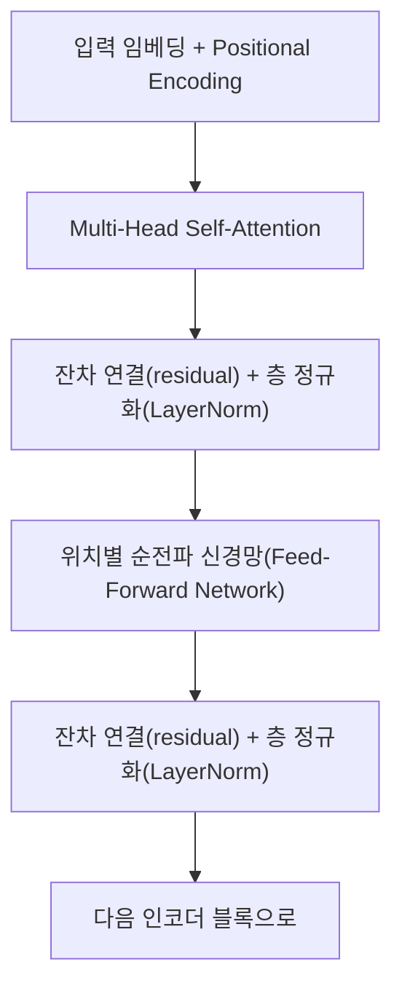
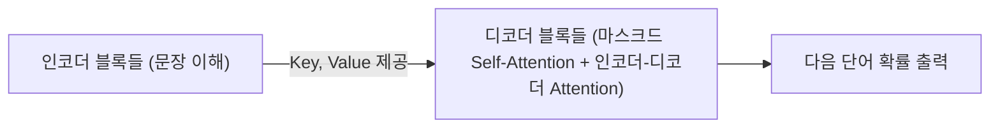

<Callout type="info">
  **이번 문서의 목표:** Self-Attention이 RNN 없이 시퀀스를 처리하는 원리를 설명하고, 스케일링을 포함한 어텐션 점수를 실제 숫자로 계산하며, Multi-Head Attention과 Positional Encoding이 왜 필요한지, Transformer 블록이 어떻게 조립되는지 설명할 수 있다.
</Callout>

## 왜 Transformer가 필요한가

13편에서 본 것처럼 RNN·LSTM·GRU는 시퀀스를 한 시점씩 순서대로 처리한다. 이 방식에는 두 가지 근본적인 한계가 있다.

- **병렬화가 어렵다.** $h_t$를 계산하려면 반드시 $h_{t-1}$이 먼저 계산되어 있어야 하므로, 문장이 길어질수록 계산을 순차적으로만 진행해야 해 학습 속도가 느리다.
- **여전히 장기 의존성이 완전히 해결되지 않는다.** LSTM이 기울기 소실을 완화하긴 하지만, 아주 멀리 떨어진 단어 사이의 관계를 직접 연결하는 것은 아니고 여러 시점을 거쳐 간접적으로 전달한다.

Transformer는 "**순환 구조를 아예 없애고, 모든 시점이 서로를 직접 어텐션으로 바라보게 하자**"는 아이디어로 두 문제를 동시에 해결한다. 14편에서 다룬 어텐션이 Seq2Seq의 보조 장치였다면, Transformer에서는 어텐션이 모델의 **유일한 핵심 연산**이 된다.

> **쉽게 말하면:** Transformer는 문장을 한 단어씩 순서대로 읽는 대신, 모든 단어를 한꺼번에 펼쳐 놓고 단어끼리 서로 얼마나 관련 있는지를 동시에 계산하는 구조다.

## Self-Attention: 자기 자신을 참조하는 어텐션

14편의 어텐션은 디코더(Query)가 인코더(Key, Value)를 바라보는 구조였다. Self-Attention(자기 어텐션)은 **Query, Key, Value를 모두 같은 시퀀스에서 만든다**는 점이 다르다. 즉 문장 하나를 놓고, 그 문장의 각 단어가 같은 문장의 다른 단어들과 얼마나 관련 있는지를 계산한다.

예를 들어 "그 동물은 길을 건너지 않았다. 왜냐하면 그것이 너무 피곤했기 때문이다"라는 문장에서 "그것"이 "동물"을 가리킨다는 관계를 파악하려면, "그것"이라는 단어가 문장 내 다른 모든 단어(동물, 길, 피곤 등)와의 관련도를 직접 비교해 봐야 한다. Self-Attention은 이런 비교를 문장 내 모든 단어 쌍에 대해 한 번에 수행한다.

각 단어의 임베딩 벡터(14편)에 서로 다른 가중치 행렬을 곱해 Query, Key, Value 세 벡터를 만든다.

$$
q_i = W_Q x_i, \quad k_i = W_K x_i, \quad v_i = W_V x_i
$$

- $x_i$: $i$번째 단어의 임베딩 벡터(입력).
- $W_Q, W_K, W_V$: 각각 Query, Key, Value를 만드는 학습 가능한 가중치 행렬. 세 행렬이 서로 다르기 때문에, 같은 입력 $x_i$에서도 서로 다른 역할의 벡터 세 개가 나온다.
- $q_i, k_i, v_i$: 결과로 얻는 Query, Key, Value 벡터.

## Scaled Dot-Product Attention: 스케일링이 붙은 이유

14편에서는 점수를 $q \cdot k_i$로 단순한 내적으로 계산했다. Transformer는 여기에 한 가지를 추가한다 — 내적 값을 Key 벡터의 차원 수의 제곱근으로 나누는 것이다. 이를 스케일드 닷-프로덕트 어텐션(Scaled Dot-Product Attention)이라 부른다.

$$
\text{score}_i = \frac{q \cdot k_i}{\sqrt{d_k}}
$$

- $d_k$: Key(그리고 Query) 벡터의 차원 수.
- $\sqrt{d_k}$: 차원 수의 제곱근으로, 스케일링(scaling) 상수 역할을 한다.

왜 나누는지 생각해 보자. $q$와 $k_i$의 각 원소가 평균 0, 분산 1인 값들로 이루어져 있다면, 내적 $q \cdot k_i$는 $d_k$개의 항을 더한 것이므로 분산이 대략 $d_k$에 비례해 커진다. 차원이 커질수록 내적 값 자체가 지나치게 커지거나 작아질 수 있는데, 이 값이 소프트맥스에 그대로 들어가면 값이 아주 큰 항 하나에 확률이 쏠려(가중치가 0 또는 1에 가깝게 극단화되어) 06편에서 다룬 시그모이드·소프트맥스의 기울기 소실 구간에 들어가기 쉽다. $\sqrt{d_k}$로 나누면 내적의 분산이 대략 1 수준으로 되돌아와 소프트맥스가 안정적인 구간에서 동작한다.

### 작은 숫자로 검산하기

14편과 같은 예시에 스케일링만 추가해 계산해 보자. $d_k = 2$이고, 앞서 구한 점수가 $q \cdot k_1 = 0$, $q \cdot k_2 = 1$, $q \cdot k_3 = 1$이었다.

$$
\sqrt{d_k} = \sqrt{2} \approx 1.414
$$

$$
\text{score}_1 = \frac{0}{1.414} = 0
$$

$$
\text{score}_2 = \frac{1}{1.414} \approx 0.707
$$

$$
\text{score}_3 = \frac{1}{1.414} \approx 0.707
$$

이 값들을 소프트맥스에 넣는다.

$$
e^0 = 1, \quad e^{0.707} \approx 2.028
$$

$$
\sum_j e^{z_j} = 1 + 2.028 + 2.028 = 5.056
$$

$$
\alpha_1 = \frac{1}{5.056} \approx 0.198, \quad \alpha_2 = \alpha_3 = \frac{2.028}{5.056} \approx 0.401
$$

스케일링 전(14편)의 가중치 $(0.155, 0.422, 0.422)$와 비교하면, 스케일링 후 가중치 $(0.198, 0.401, 0.401)$가 **1/3(약 0.333)에 더 가깝게** 완만해졌다. 즉 스케일링은 특정 위치로 가중치가 쏠리는 정도를 눌러주는 역할을 한다는 것을 숫자로 확인할 수 있다.

## Multi-Head Attention: 여러 시각으로 동시에 본다

Self-Attention을 한 번만 수행하면, $W_Q, W_K, W_V$ 한 세트가 "문장 안에서 무엇을 눈여겨볼지"를 하나의 기준으로만 결정하게 된다. 하지만 실제 언어에는 여러 종류의 관계가 동시에 존재한다. "그것이 동물을 가리킨다"는 지시 관계, "건너지 않았다"는 문법적 호응 관계, "피곤했기 때문에"라는 인과 관계는 서로 다른 종류의 단서를 필요로 한다.

멀티-헤드 어텐션(Multi-Head Attention)은 $W_Q, W_K, W_V$ 세트를 여러 개(예: 8개) 두고, 각 세트("헤드", head)가 독립적으로 Self-Attention을 계산한 뒤, 그 결과들을 이어 붙여(concatenate) 하나의 출력으로 합친다.

$$
\text{head}_j = \text{Attention}(Q W_Q^{(j)},\, K W_K^{(j)},\, V W_V^{(j)})
$$

$$
\text{MultiHead}(Q,K,V) = \text{Concat}(\text{head}_1, \dots, \text{head}_h) \, W_O
$$

- $h$: 헤드(head)의 개수. 헤드마다 서로 다른 $W_Q^{(j)}, W_K^{(j)}, W_V^{(j)}$를 학습한다.
- $\text{Concat}$: 여러 헤드의 출력 벡터를 이어 붙이는 연산.
- $W_O$: 이어 붙인 결과를 다시 원하는 차원으로 정리해 주는 출력 가중치 행렬.

각 헤드는 보통 전체 임베딩 차원을 헤드 수로 나눈 더 작은 차원에서 동작한다. 예를 들어 임베딩 차원이 512이고 헤드가 8개면, 헤드 하나는 64차원에서 Query·Key·Value를 계산한다. 헤드 수를 늘리면 "동시에 볼 수 있는 관계의 종류"가 늘어나지만, 헤드 하나당 차원이 줄어들어 표현력과 개수 사이에 균형을 맞춰야 한다.

## Positional Encoding: 순서 정보를 되살린다

Self-Attention은 모든 위치를 동시에, 대칭적으로 계산하기 때문에 그 자체로는 "몇 번째 단어인지"를 전혀 알지 못한다. 극단적으로 말하면, 문장의 단어 순서를 뒤죽박죽 섞어도 Self-Attention 연산 자체는 같은 방식으로 동작한다(입력 집합이 같으면 각 단어에 대한 어텐션 결과의 집합도 같고, 순서만 함께 뒤섞인다). 하지만 자연어에서 순서는 의미를 결정하는 핵심 정보다.

이를 보완하기 위해 Transformer는 각 위치마다 고유한 위치 인코딩(Positional Encoding) 벡터를 만들어 단어 임베딩에 더해 준다.

$$
PE_{(pos, 2i)} = \sin\left(\frac{pos}{10000^{2i/d}}\right)
$$

$$
PE_{(pos, 2i+1)} = \cos\left(\frac{pos}{10000^{2i/d}}\right)
$$

- $pos$: 문장 내 단어의 위치(0, 1, 2, ...).
- $i$: 임베딩 벡터 안에서의 차원 인덱스.
- $d$: 임베딩 전체 차원 수.
- $\sin, \cos$: 사인·코사인 함수. 짝수 번째 차원에는 사인을, 홀수 번째 차원에는 코사인을 사용해 위치마다 서로 다른 주기의 파형 값을 만든다.

핵심 아이디어는 "위치마다 서로 다른 주기의 사인·코사인 파형 값을 부여하면, 위치가 다르면 인코딩 벡터도 반드시 달라지고, 상대적인 위치 차이도 벡터의 관계로부터 유추할 수 있다"는 것이다. 이렇게 만든 위치 인코딩을 단어 임베딩에 더한 값이 Transformer의 실제 입력이 된다.

$$
\text{입력}_i = x_i + PE_i
$$

## Transformer 블록 구조 개요

Transformer는 인코더 블록을 여러 개, 디코더 블록을 여러 개 쌓아 만든다. 인코더 블록 하나의 내부는 대략 다음 순서로 구성된다.

- **Multi-Head Self-Attention**: 앞서 다룬 대로 문장 내 단어 간 관계를 여러 관점에서 계산한다.
- **잔차 연결(residual connection)**: 12편의 ResNet에서 다룬 것과 같은 아이디어로, 블록의 입력을 출력에 그대로 더해 준다. 층이 깊어져도 기울기가 잘 전달되도록 돕는다.
- **층 정규화(Layer Normalization)**: 10편의 배치 정규화와 목적은 비슷하지만, 배치 정규화가 "같은 특징(feature)을 배치 전체에서" 정규화하는 반면, 층 정규화는 "하나의 샘플 안에서 모든 특징을 함께" 정규화한다는 점이 다르다.
- **위치별 순전파 신경망(Feed-Forward Network)**: 각 위치(단어)마다 독립적으로 적용되는 작은 MLP로, 어텐션이 모은 정보를 한 번 더 비선형적으로 가공한다.

디코더 블록은 인코더 블록과 비슷하지만 두 가지가 추가된다. 하나는 "미래 단어를 미리 보지 못하게 가리는" 마스크드 Self-Attention(masked self-attention)이고, 다른 하나는 디코더의 Query가 인코더의 Key·Value를 바라보는 인코더-디코더 어텐션(encoder-decoder attention)으로, 14편의 Seq2Seq 어텐션과 같은 역할을 한다.

## 자주 틀리는 점

- Self-Attention을 "RNN의 은닉 상태 전달을 어텐션으로 흉내 낸 것"이라고 오해하기 쉽다. 정확히는 **순환 구조 자체를 제거**하고, 모든 위치가 서로를 동시에 참조하도록 바꾼 것이다.
- 스케일링 상수 $\sqrt{d_k}$를 "그냥 관습적으로 붙이는 상수"로 암기하는 경우가 많다. 실제로는 **내적 값의 분산이 차원 수에 비례해 커지는 것을 상쇄해 소프트맥스를 안정적인 구간에 두기 위한** 수학적 이유가 있다.
- 멀티-헤드 어텐션을 "같은 계산을 여러 번 반복해 정확도를 높이는 것"으로 오해하기 쉽다. 각 헤드는 **서로 다른 가중치**로 서로 다른 종류의 관계에 주목하도록 학습되며, 단순 반복이 아니다.
- Positional Encoding이 없어도 Self-Attention이 순서를 "어느 정도는" 알 것이라고 착각하는 경우가 있다. Self-Attention 연산 자체는 순서에 대한 정보를 전혀 담지 못하므로, 위치 인코딩을 더하지 않으면 순서가 다른 문장도 같은 결과를 낸다.
- 층 정규화와 배치 정규화를 같은 것으로 혼동하기 쉽다. 정규화 기준이 **배치 방향인지 특징(feature) 방향인지**가 다르다.

## 핵심 정리

- Transformer는 순환 구조 없이 Self-Attention만으로 시퀀스를 처리해, 병렬화와 장기 의존성 문제를 동시에 개선한다.
- Scaled Dot-Product Attention은 내적 점수를 $\sqrt{d_k}$로 나눠, 차원이 커질 때 소프트맥스가 극단적으로 쏠리는 것을 막는다.
- Multi-Head Attention은 서로 다른 $W_Q, W_K, W_V$를 가진 여러 헤드가 동시에 다른 종류의 관계를 포착하게 한다.
- Positional Encoding은 사인·코사인 파형으로 위치 정보를 만들어 임베딩에 더하며, 이를 통해서만 Self-Attention이 순서를 인식할 수 있다.
- 인코더 블록은 Multi-Head Self-Attention과 Feed-Forward Network를 잔차 연결·층 정규화로 감싼 구조이며, 디코더 블록은 여기에 마스킹과 인코더-디코더 어텐션이 추가된다.

## 마무리 복습

<Quiz
  questionNumber={1}
  question="RNN 계열 모델과 비교했을 때 Transformer의 Self-Attention이 갖는 구조적 장점으로 가장 적절한 것은?"
  options={['활성화 함수를 전혀 사용하지 않는다', '순차 계산 의존성이 없어 병렬화가 쉽고 먼 위치 간 관계를 직접 연결한다', '항상 더 적은 파라미터로 학습된다', '임베딩 없이 원-핫 벡터를 그대로 사용할 수 있다']}
  correctAnswer={2}
  explanation="RNN은 h_t 계산에 h_{t-1}이 필요해 순차 계산이 강제되지만, Self-Attention은 모든 위치를 동시에 계산할 수 있어 병렬화가 쉽고, 먼 위치 사이도 중간 시점을 거치지 않고 직접 어텐션으로 연결된다."
  optionExplanations={['Feed-Forward Network 등에서 활성화 함수를 사용한다.', '정답이다. 병렬화와 직접적인 장기 의존성 처리가 핵심 장점이다.', '파라미터 수가 항상 더 적다는 것은 사실이 아니다.', 'Transformer도 임베딩과 위치 인코딩을 입력으로 사용한다.']}
/>

<Quiz
  questionNumber={2}
  question="Scaled Dot-Product Attention에서 내적 점수를 sqrt(d_k)로 나누는 이유로 가장 적절한 것은?"
  options={['계산 속도를 물리적으로 더 빠르게 만들기 위해서다', '차원이 커질수록 커지는 내적의 분산을 상쇄해 소프트맥스를 안정적인 구간에 두기 위해서다', '음수 값을 모두 양수로 바꾸기 위해서다', 'Key 벡터의 차원을 실제로 줄이기 위해서다']}
  correctAnswer={2}
  explanation="Query와 Key의 각 원소 분산이 1 수준일 때 내적은 차원 수 d_k에 비례해 분산이 커진다. 이를 sqrt(d_k)로 나눠 상쇄하면 소프트맥스 입력 값이 극단적으로 커지는 것을 막아 가중치가 한쪽으로 쏠리는 현상을 완화한다."
  optionExplanations={['나눗셈 자체가 연산 속도를 물리적으로 높이지는 않는다.', '정답이다. 분산을 상쇄해 소프트맥스를 안정적인 구간에 두는 것이 목적이다.', '나누기 연산은 부호를 바꾸지 않으므로 음수를 양수로 바꾸지 못한다.', 'Key 벡터의 실제 차원 수는 그대로이며 점수 값만 조정된다.']}
/>

<Quiz
  questionNumber={3}
  question="점수 0, 1, 1을 스케일링 없이 소프트맥스에 넣은 가중치와, sqrt(2)로 나눈 뒤 소프트맥스에 넣은 가중치를 비교하면?"
  options={['스케일링 후 가중치가 더 균등한 분포(1/3에 더 가까움)로 완만해진다', '스케일링 후 가중치가 더 한쪽으로 쏠린다', '스케일링 여부와 관계없이 가중치는 완전히 동일하다', '스케일링 후 가중치의 합이 1보다 커진다']}
  correctAnswer={1}
  explanation="스케일링 전 가중치는 약 0.155, 0.422, 0.422였고, sqrt(2)로 나눈 뒤에는 약 0.198, 0.401, 0.401로 1/3에 더 가까워졌다. 스케일링은 점수 사이의 차이를 줄여 소프트맥스 결과를 더 완만하게 만든다."
  optionExplanations={['정답이다. 실제 계산에서 스케일링 후 가중치가 더 균등해졌다.', '스케일링은 오히려 쏠림을 완화하는 방향으로 작용한다.', '점수 값이 달라지므로 소프트맥스 결과도 달라진다.', '소프트맥스의 출력은 항상 합이 1이 되도록 정규화된다.']}
/>

<Quiz
  questionNumber={4}
  question="Multi-Head Attention에서 헤드를 여러 개 두는 목적으로 가장 적절한 것은?"
  options={['같은 가중치로 같은 계산을 반복해 오차를 줄이기 위해서다', '서로 다른 가중치 세트로 서로 다른 종류의 단어 간 관계를 동시에 포착하기 위해서다', '입력 시퀀스의 길이를 강제로 줄이기 위해서다', '학습 파라미터 수를 항상 최소화하기 위해서다']}
  correctAnswer={2}
  explanation="각 헤드는 서로 다른 W_Q, W_K, W_V를 학습하므로, 헤드마다 문장 내에서 서로 다른 종류의 관계(지시 관계, 문법적 호응, 인과 관계 등)에 주목할 수 있다."
  optionExplanations={['각 헤드는 서로 다른 가중치를 가지므로 동일한 계산의 반복이 아니다.', '정답이다. 서로 다른 관점에서 관계를 동시에 포착하는 것이 목적이다.', '헤드 수는 시퀀스 길이가 아니라 임베딩 차원의 분할과 관련이 있다.', '헤드를 늘리면 오히려 전체 파라미터 수가 늘어나는 경향이 있다.']}
/>

<Quiz
  questionNumber={5}
  question="Positional Encoding을 임베딩에 더하지 않고 Self-Attention만 적용하면 어떤 문제가 발생하는가?"
  options={['그레디언트가 항상 0이 되어 학습이 전혀 되지 않는다', '단어 순서를 바꿔도 어텐션 계산 결과가 사실상 동일해 순서 정보를 반영하지 못한다', '소프트맥스 출력의 합이 1을 넘게 된다', '임베딩 차원이 자동으로 2배로 늘어난다']}
  correctAnswer={2}
  explanation="Self-Attention 자체는 위치에 대한 정보를 담지 않으므로, 위치 인코딩 없이는 단어 순서가 달라져도 각 단어에 대한 어텐션 결과 집합이 동일해 순서를 구분하지 못한다."
  optionExplanations={['위치 인코딩이 없어도 다른 가중치를 통한 학습 자체는 가능하다.', '정답이다. 순서 정보를 반영하지 못하는 것이 핵심 문제다.', '소프트맥스는 정규화 함수이므로 항상 합이 1이 되도록 계산된다.', '임베딩 차원은 위치 인코딩 유무와 관계없이 미리 정해진 값이다.']}
/>

<Quiz
  questionNumber={6}
  question="층 정규화(Layer Normalization)와 배치 정규화(Batch Normalization)의 차이로 옳은 것은?"
  options={['층 정규화는 하나의 샘플 안에서 모든 특징을 정규화하고, 배치 정규화는 배치 전체에서 같은 특징을 정규화한다', '두 방법은 정규화 기준이 완전히 동일해 이름만 다르다', '배치 정규화는 학습 파라미터가 전혀 없다', '층 정규화는 이미지 데이터에만 적용할 수 있다']}
  correctAnswer={1}
  explanation="배치 정규화는 같은 특징(feature)을 배치에 속한 여러 샘플에 걸쳐 정규화하는 반면, 층 정규화는 하나의 샘플 내부에서 모든 특징에 걸쳐 정규화한다. 이 차이 때문에 배치 크기에 민감하지 않은 층 정규화가 시퀀스 모델에 더 자주 쓰인다."
  optionExplanations={['정답이다. 정규화 기준 축이 서로 다른 것이 핵심 차이다.', '기준 축이 다르므로 동일한 방법이 아니다.', '배치 정규화도 스케일과 이동을 담당하는 학습 파라미터를 갖는다.', '층 정규화는 이미지뿐 아니라 시퀀스 등 다양한 데이터에 적용된다.']}
/>

<Quiz
  questionNumber={7}
  question="Transformer 디코더 블록이 인코더 블록과 비교해 추가로 갖는 구성 요소는?"
  options={['위치별 순전파 신경망 하나만 추가로 갖는다', '마스크드 Self-Attention과 인코더-디코더 어텐션이 추가된다', '잔차 연결이 디코더에만 존재한다', '층 정규화가 디코더에서는 사용되지 않는다']}
  correctAnswer={2}
  explanation="디코더 블록은 인코더 블록의 구성 요소에 더해, 미래 단어를 가리는 마스크드 Self-Attention과 인코더의 Key, Value를 참조하는 인코더-디코더 어텐션을 추가로 갖는다."
  optionExplanations={['위치별 순전파 신경망은 인코더 블록에도 이미 존재한다.', '정답이다. 마스킹과 인코더-디코더 어텐션이 디코더의 추가 구성 요소다.', '잔차 연결은 인코더와 디코더 블록 모두에 사용된다.', '층 정규화 역시 인코더와 디코더 모두에서 사용된다.']}
/>

## 참고 자료

- Attention Is All You Need 관련 튜토리얼 (PyTorch 공식 Transformer 튜토리얼) — https://pytorch.org/tutorials/beginner/transformer_tutorial.html
- Stanford CS224n: Natural Language Processing with Deep Learning — https://cs224n.stanford.edu
