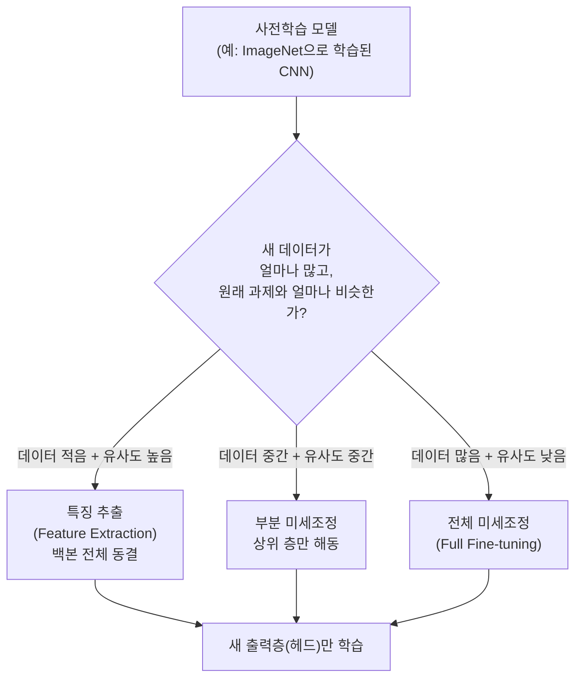

## 전이학습은 왜 필요한가

09~10편에서 다룬 CNN이나 13편에서 다룬 Transformer 같은 딥러닝 모델은 좋은 성능을 내려면 대개 **수백만~수십억 장(또는 문장)** 규모의 데이터가 필요하다. 이런 적은 데이터로 처음부터(from scratch) 신경망을 학습시키면 05편에서 다룬 과적합(overfitting)이 심하게 일어나기 쉽다.

이 문제를 해결하는 실용적인 방법이 **전이학습**(Transfer Learning)이다. 이렇게 이미 다른 대규모 데이터로 학습을 마친 모델을 **사전학습 모델**(pretrained model)이라 부른다.

### 왜 저수준 특징은 재사용할 수 있는가

CNN을 예로 들면, 09편에서 다룬 것처럼 앞쪽(입력에 가까운) 합성곱 층은 대체로 **선(edge)이나 질감(texture) 같은 일반적이고 저수준인 패턴**을 학습하는 경향이 있다. 반면 뒤쪽(출력에 가까운) 층으로 갈수록 "이 형태는 고양이 귀다"처럼 **특정 과제에 특화된 고수준 특징**을 학습한다.

## 특징 추출기 방식 대 미세조정 방식

전이학습을 실제로 적용하는 방법은 크게 두 갈래로 나뉜다.

- **특징 추출**(Feature Extraction): 사전학습된 층(**백본**, backbone이라 부른다)의 가중치를 그대로 **동결**(freeze, 역전파 시 가중치를 갱신하지 않도록 고정)하고, 맨 끝에 우리 문제에 맞는 새로운 출력층(헤드, head)만 새로 붙여 그 부분만 학습한다.
- **미세조정**(Fine-tuning): 동결했던 층 중 일부 또는 전부를 다시 **해동**(unfreeze, 가중치 갱신을 다시 허용)해, 사전학습된 가중치를 출발점으로 삼아 우리 데이터에 맞게 추가로 학습을 진행한다.

### 동결·해동 층 전략 비교표

| 전략 | 동결하는 층 | 학습(갱신)하는 층 | 학습률 설정 | 적합한 상황 |
|---|---|---|---|---|
| 완전 동결(특징 추출) | 백본 전체 | 새 출력층(헤드)만 | 헤드에 비교적 크게(예: 0.001 수준) | 목표 데이터가 매우 적고, 원래 과제와 유사도가 높을 때 |
| 부분 미세조정 | 하위(입력에 가까운) 층 | 상위(출력에 가까운) 일부 층 + 헤드 | 상위 층은 작게, 헤드는 상대적으로 크게 | 목표 데이터가 중간 정도이거나 유사도가 중간일 때 |
| 전체 미세조정(Full Fine-tuning) | 없음(전부 해동) | 백본 전체 + 헤드 | 백본은 매우 작게(예: 0.00001 수준), 헤드는 상대적으로 크게 | 목표 데이터가 충분히 많고, 원래 과제와 유사도가 낮을 때 |

### 왜 학습률을 층마다 다르게, 그것도 아주 작게 주는가

전체 미세조정에서 백본에 원래 모델을 처음 학습시킬 때와 같은 큰 학습률을 그대로 쓰면 어떻게 될까. 06편에서 다룬 경사하강법의 원리를 떠올려 보면, 학습률이 크면 가중치가 한 번에 크게 움직인다.

## CNN과 Transformer에서의 전이학습 사례

- **CNN 기반**: 09~10편에서 다룬 ImageNet 사전학습 VGG·ResNet 등을 이미지 분류·객체 탐지 등 새로운 이미지 과제에 재사용하는 것이 대표적이다. 새 데이터셋의 클래스 수에 맞춰 마지막 완전연결층(출력층)만 새로 갈아 끼우고, 데이터 양에 따라 앞서 표에서 정리한 세 전략 중 하나를 선택한다.
- **Transformer 기반**: 13편에서 다룬 Transformer 인코더 구조를 대규모 텍스트로 사전학습한 모델(예: BERT 계열)을 특정 문서 분류·질의응답 과제에 맞춰 미세조정하는 방식이 널리 쓰인다. 이 경우도 원리는 CNN과 같다. 문장을 이해하는 저수준 언어 표현(문법 구조 등)은 재사용하고, 과제에 특화된 판단(예: 감정이 긍정인지 부정인지)을 담당하는 출력 부분만 새로 학습시키거나 전체를 낮은 학습률로 다시 조정한다.

### 전이학습의 장점과 주의점

- **장점**: 적은 데이터로도 좋은 성능을 낼 수 있고, 처음부터 학습할 때보다 학습 시간과 연산 비용을 크게 줄인다. 05편에서 다룬 과적합 위험도 완화된다(사전학습된 표현이 이미 일반화가 잘 되어 있기 때문).
- **주의점**: 사전학습에 쓰인 데이터와 우리 문제의 데이터가 지나치게 다르면(예: 자연 사진으로 학습된 모델을 의료 영상에 그대로 적용) 재사용할 수 있는 유용한 특징이 적어 전이학습의 이득이 줄어든다. 이런 경우 부분 미세조정보다 전체 미세조정 쪽으로, 또는 아예 처음부터 학습하는 쪽으로 무게를 옮겨야 할 수 있다.

### 자주 틀리는 점

- "전이학습은 항상 모든 층을 동결한다"는 서술은 틀렸다. 동결 범위는 데이터 양과 과제 유사도에 따라 달라지며, 데이터가 충분히 많으면 전체를 해동해 미세조정하는 것이 오히려 더 좋은 성능을 낸다.
- "미세조정 시 학습률을 원래 학습 때와 똑같이 크게 준다"는 서술도 틀렸다. 파괴적 망각을 피하기 위해 백본에는 작은 학습률을 쓰는 것이 일반적이다.
- "저수준 특징은 과제에 특화되고, 고수준 특징이 일반적이다"처럼 저수준·고수준을 뒤바꾼 서술에 주의한다. 실제로는 **입력에 가까운(저수준) 층이 일반적**이고 **출력에 가까운(고수준) 층이 과제 특화적**이다.

## 핵심 정리

- 전이학습은 대규모 데이터로 사전학습된 모델의 특징을 재사용해, 데이터가 적은 새로운 문제에서도 좋은 성능을 내는 방법이다.
- 특징 추출은 백본을 완전 동결하고 새 헤드만 학습하며, 미세조정은 일부 또는 전체 층을 해동해 낮은 학습률로 추가 학습한다.
- 전략 선택은 목표 데이터의 양과 원래 과제와의 유사도에 따라 완전 동결(특징 추출) → 부분 미세조정 → 전체 미세조정 순으로 해동 범위를 넓혀 간다.
- 사전학습된 가중치가 큰 학습률로 급격히 갱신되면 파괴적 망각이 일어날 수 있어, 백본에는 작은 학습률, 새 헤드에는 상대적으로 큰 학습률을 쓰는 차등 학습률 전략을 흔히 쓴다.
- CNN(09~10편)과 Transformer(13편) 모두 저수준 특징을 재사용하고 과제 특화 부분만 새로 학습한다는 같은 원리를 공유한다.

## 마무리 복습

<Quiz
  questionNumber={1}
  question={"전이학습에서 '특징 추출(Feature Extraction)' 방식에 대한 설명으로 가장 옳은 것은?"}
  options={["백본 전체를 처음부터 다시 학습시킨다","사전학습된 백본을 동결하고 새로 붙인 출력층(헤드)만 학습한다","모든 층의 학습률을 동일하게 크게 설정한다","노이즈 벡터로 새로운 백본을 생성한다"]}
  correctAnswer={2}
  explanation={"특징 추출 방식은 사전학습된 백본의 가중치를 동결한 채로, 문제에 맞게 새로 붙인 출력층(헤드)만 학습시키는 전이학습 전략이다."}
/>

<Quiz
  questionNumber={2}
  question={"데이터가 아주 적고 원래 사전학습 과제와 유사도가 매우 높은 상황에서 가장 적합한 전이학습 전략은?"}
  options={["백본 전체를 처음부터 무작위 초기화 후 학습","완전 동결(특징 추출) 방식","백본을 포함한 전체를 큰 학습률로 재학습","판별자와 생성자를 함께 학습"]}
  correctAnswer={2}
  explanation={"데이터가 적고 유사도가 높을 때는 백본을 완전 동결하고 새 헤드만 학습하는 특징 추출 방식이 과적합 위험을 줄이면서도 사전학습 지식을 최대한 활용할 수 있다."}
/>

<Quiz
  questionNumber={3}
  question={"전체 미세조정(Full Fine-tuning)에서 백본의 학습률을 매우 작게 설정하는 주된 이유는?"}
  options={["연산 속도를 높이기 위해서","사전학습된 유용한 가중치가 갑자기 무너지는 파괴적 망각을 막기 위해서","모드 붕괴를 막기 위해서","배치 정규화 통계를 고정하기 위해서"]}
  correctAnswer={2}
  explanation={"사전학습된 가중치는 이미 유용한 패턴을 담고 있으므로, 큰 학습률로 급격히 갱신하면 그 패턴이 무너지는 파괴적 망각이 일어날 수 있다. 이를 막기 위해 백본에는 작은 학습률을 준다."}
/>

## 참고 자료

- [Deep Learning Book — Transfer Learning and Domain Adaptation](https://www.deeplearningbook.org/)
- [scikit-learn — 모델 재사용·파이프라인 관련 안내](https://scikit-learn.org/stable/)
