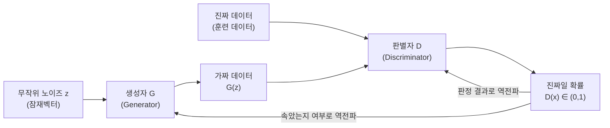

<Callout type="info">
  **이번 문서의 목표:** 생성자(Generator)와 판별자(Discriminator)가 서로 경쟁하며 학습하는 구조와 GAN의 minimax 목적함수를 숫자로 검산할 수 있고, 모드 붕괴(mode collapse)를 비롯한 GAN 훈련의 대표적 함정을 설명할 수 있다.
</Callout>

## 생성자와 판별자: 왜 두 신경망이 경쟁하는가

16편에서 다룬 오토인코더(AE)와 변분 오토인코더(VAE)는 입력을 압축했다가 복원하는 **재구성**(reconstruction) 방식으로 잠재공간(latent space)을 학습했다. 그런데 재구성 손실만으로 학습하면 결과물이 평균적이고 흐릿해지는 경향이 있다. "진짜와 구별되지 않는 새로운 데이터를 만들어내는 것" 자체가 목표라면, 원본과 픽셀 단위로 얼마나 비슷한지 재는 대신 **다른 방식으로 품질을 평가**할 방법이 필요하다. 이 문제의식에서 나온 것이 **생성적 적대 신경망**(GAN, Generative Adversarial Network)이다.

GAN의 핵심 아이디어는 신경망을 하나가 아니라 **두 개** 두고, 서로 반대되는 목표를 주는 것이다.

- **생성자**(Generator, G): 무작위 노이즈 $z$를 입력받아 가짜 데이터 $G(z)$를 만들어낸다. 목표는 판별자를 속이는 것이다.
- **판별자**(Discriminator, D): 데이터를 입력받아 그것이 진짜(real, 실제 훈련 데이터)인지 가짜(fake, 생성자가 만든 데이터)인지 0~1 사이의 확률로 판정한다. 목표는 진짜와 가짜를 정확히 구별하는 것이다.

> **쉽게 말하면:** GAN은 위조지폐범(생성자)과 감별사(판별자)가 서로 실력을 겨루면서, 위조지폐범은 점점 더 진짜 같은 지폐를 만들고 감별사는 점점 더 예리하게 가짜를 잡아내는 구조다.

이 비유를 조금 더 밀고 가 보자. 감별사가 아주 서투르면 위조지폐범은 대충 만들어도 통과되므로 실력이 늘지 않는다. 반대로 감별사가 완벽해서 모든 위조지폐를 100퍼센트 잡아낸다면, 위조지폐범 입장에서는 "어느 방향으로 고쳐야 조금이라도 나아지는지" 신호를 전혀 받지 못한다. GAN이 잘 학습되려면 두 네트워크의 실력이 **비슷한 속도로 함께 성장**해야 한다는 점이 뒤에서 다룰 훈련 불안정성의 근본 원인이다.

위 그림에서 판별자 D는 진짜 데이터와 가짜 데이터를 **모두** 입력받아 "이것이 진짜일 확률"을 출력한다. 이 출력이 얼마나 정확했는지에 따라 D가 학습되고, 동시에 "생성자가 판별자를 얼마나 잘 속였는지"에 따라 G도 학습된다. 두 학습이 번갈아 일어나는 것이 GAN 훈련의 큰 그림이다.

## GAN의 목적함수: minimax 게임

GAN의 학습 목표는 다음과 같은 하나의 값 함수(value function) $V(D, G)$로 표현된다.

$$
\min_G \max_D V(D, G) = \mathbb{E}_{x \sim p_{data}}[\log D(x)] + \mathbb{E}_{z \sim p_z}[\log(1 - D(G(z)))]
$$

- $D$: 판별자 함수(입력이 진짜일 확률을 출력)
- $G$: 생성자 함수(노이즈를 가짜 데이터로 변환)
- $x \sim p_{data}$: 실제 훈련 데이터 분포에서 뽑은 진짜 샘플 $x$
- $z \sim p_z$: 미리 정한 노이즈 분포(흔히 정규분포)에서 뽑은 잠재벡터 $z$
- $\mathbb{E}[\cdot]$ (기댓값, expectation): 여러 샘플에 대해 평균을 낸다는 뜻
- $\log D(x)$: 판별자가 진짜 데이터를 진짜로 맞힐수록 커지는 항
- $\log(1 - D(G(z)))$: 판별자가 가짜 데이터를 가짜로 정확히 잡아낼수록(즉 $D(G(z))$가 0에 가까울수록) 커지는 항

$\min_G \max_D$라는 표기 자체가 GAN의 성격을 그대로 보여준다. **판별자 D는 $V$를 최대화**하려 하고(진짜·가짜를 정확히 구분할수록 $V$가 커짐), **생성자 G는 같은 $V$를 최소화**하려 한다(판별자를 속여 $V$를 깎아내리려 함). 이렇게 한쪽이 최대화하려는 값을 다른 쪽이 최소화하려는 구조를 게임 이론에서 **minimax 게임**이라 부른다. 두 플레이어가 서로 반대 이해관계를 갖는 제로섬 게임과 같은 형태다.

### 판별자와 생성자의 손실을 나누어 보기

실제 구현에서는 $V(D,G)$ 하나를 동시에 계산하지 않고, 판별자 차례와 생성자 차례를 번갈아 가며 각자의 손실을 따로 최적화한다.

| 구분 | 최적화 목표 | 담당 손실(간략화) | 의미 |
|---|---|---|---|
| 판별자 D | $V(D,G)$ 최대화 | $-[\log D(x) + \log(1-D(G(z)))]$ 최소화 | 진짜는 1에, 가짜는 0에 가깝게 판정 |
| 생성자 G | $V(D,G)$ 최소화 | $\log(1-D(G(z)))$ 최소화(원 논문) 또는 $-\log D(G(z))$ 최대화(non-saturating 트릭) | 판별자가 가짜를 진짜(1)로 착각하게 만들기 |

D의 손실 부호를 뒤집어 "최소화" 문제로 통일해 표기한 이유는, 신경망 학습이 보통 경사하강법으로 손실을 **최소화**하는 형태로 구현되기 때문이다. 생성자 쪽에 두 가지 표현이 있는 것도 뒤에서 다룰 그라디언트 소실 문제와 관련이 있다.

### 작은 숫자로 검산하기

판별자가 진짜 이미지 하나에 $D(x) = 0.9$(90퍼센트 확률로 진짜라고 판정), 가짜 이미지 하나에 $D(G(z)) = 0.3$(30퍼센트 확률로 진짜라고 착각)을 출력했다고 하자. 이때 판별자 입장의 목적함수 값(자연로그 기준, $\ln$)은 다음과 같다.

$$
\log D(x) + \log(1 - D(G(z))) = \ln(0.9) + \ln(1 - 0.3)
$$

$$
= \ln(0.9) + \ln(0.7) \approx -0.105 + (-0.357) = -0.462
$$

판별자는 이 값을 **최대화**하려 하므로, 학습이 더 진행되어 $D(x)$가 1에 가까워지고 $D(G(z))$가 0에 가까워지면 두 로그 값 모두 0에 가까워져 전체 값이 커진다(음수 크기가 작아지는 방향으로 개선). 반대로 생성자는 $\log(1 - D(G(z))) = \ln(0.7) \approx -0.357$을 **최소화**하려 하는데, 이 값을 더 작게(더 음수로) 만들려면 $D(G(z))$가 0에 가까워져야 하지만 생성자가 원하는 방향은 그 반대(판별자를 속여 $D(G(z))$가 1에 가깝게)이므로, 실제로는 원 논문 형태 대신 $-\log D(G(z))$를 최대화하는 non-saturating 방식을 실무에서 흔히 쓴다. 다음 절에서 그 이유를 다룬다.

## 훈련이 불안정한 이유

### 그라디언트 소실: 판별자가 너무 강할 때

학습 초반에는 생성자가 만드는 가짜 데이터가 조잡하므로 판별자가 쉽게 구별해 $D(G(z))$가 0에 가까운 값을 낸다. 이때 원 논문의 생성자 손실 $\log(1 - D(G(z)))$는 $D(G(z)) \approx 0$ 근방에서 기울기(그라디언트)가 거의 평평해, 07편에서 다룬 **그라디언트 소실**과 비슷한 문제가 생긴다. 즉 생성자를 개선할 신호 자체가 매우 약해져 학습이 정체된다. 그래서 실무에서는 생성자의 손실을 $-\log D(G(z))$를 최대화(=이 값을 최소화하도록 부호를 바꾼 형태로 최적화)하는 **non-saturating 트릭**으로 바꾼다. 이 형태는 $D(G(z)) \approx 0$ 근방에서도 기울기가 크게 남아 있어 초반 학습 신호가 살아난다.

### 모드 붕괴: 다양성을 포기하고 하나만 반복

**모드 붕괴**(mode collapse)는 GAN 훈련에서 가장 자주 언급되는 실패 양상이다. 실제 데이터 분포에는 여러 종류(모드, mode)의 패턴이 섞여 있는데(예: 손글씨 숫자 데이터라면 0~9의 열 가지 모드), 생성자가 그중 **판별자를 속이기 가장 쉬운 한두 가지 패턴만** 계속 만들어내고 나머지는 전혀 만들지 않는 현상을 말한다.

> **쉽게 말하면:** 위조지폐범이 우연히 감별사를 잘 속이는 지폐 한 장을 발견하면, 굳이 다른 도안을 시도하지 않고 그 한 장만 계속 찍어내는 것과 같다.

모드 붕괴가 생기는 근본 이유는 생성자의 목표가 "판별자를 속이는 것"이지 "데이터 분포 전체를 다양하게 재현하는 것"이 아니기 때문이다. 판별자가 그 한 가지 패턴을 아직 가짜로 잡아내지 못하는 한, 생성자 입장에서는 다양성을 늘릴 유인이 전혀 없다. 이후 판별자가 그 패턴을 학습해 잡아내기 시작하면 생성자가 다른 한 가지 패턴으로 옮겨가고, 이 과정이 반복되며 두 네트워크가 한 자리를 맴도는 **진동**(oscillation) 현상도 함께 나타날 수 있다.

### 훈련 불안정성의 다른 원인들

- **균형 붕괴**: 판별자나 생성자 중 한쪽이 지나치게 빨리 강해지면 반대쪽이 학습 신호를 잃는다. 두 네트워크의 학습 속도(학습률, 구조 크기)를 비슷하게 맞추는 것이 실무에서 중요하다.
- **평가 지표의 부재**: 손실 함수 값이 낮아진다고 생성 품질이 좋아졌다고 보장할 수 없다. 판별자가 착각을 잘 하도록 생성자가 "속임수"만 늘어도 손실은 낮아질 수 있어, 실제로는 별도의 품질 지표(FID 등, 독학사 출제기준 밖의 세부 지표는 이름만 알아둔다)로 점검한다.

## 대표 변형 모델 개요: DCGAN

**DCGAN**(Deep Convolutional GAN)은 GAN의 생성자·판별자를 11편에서 다룬 합성곱(convolution) 레이어로 구성해 이미지 생성에 적합하게 만든 대표적인 변형이다. 완전연결층 위주였던 초기 GAN과 달리, DCGAN은 생성자에 전치 합성곱(transposed convolution, 작은 특징 맵을 점점 넓혀가는 연산)을 쌓고 배치 정규화(10편)를 적용해 학습을 안정시켰다. 독학사 출제기준에서는 DCGAN을 "CNN 구조를 GAN에 접목해 이미지 생성 품질과 훈련 안정성을 높인 대표 사례"라는 개념 수준으로 기억해 두면 충분하며, 내부 레이어 설계를 계산 문제로 다루지는 않는다.

### 자주 틀리는 점

- GAN을 "재구성 손실을 최소화하는 모델"이라고 서술하면 틀린 설명이다. GAN은 원본과 픽셀 단위로 비교하는 재구성 손실이 아니라 **판별자를 속이는지 여부**로 학습 신호를 얻는다는 점이 AE·VAE(16편)와의 결정적 차이다.
- "판별자와 생성자는 같은 손실을 같은 방향으로 최적화한다"는 서술도 틀렸다. 두 네트워크는 같은 값 함수 $V(D,G)$를 두고 한쪽은 최대화, 한쪽은 최소화하는 **적대적**(adversarial) 관계다.
- 모드 붕괴를 "판별자의 성능이 나빠지는 현상"으로 혼동하지 않도록 주의한다. 모드 붕괴는 **생성자의 다양성**이 무너지는 현상이다.

## 핵심 정리

- GAN은 생성자(가짜 데이터 생성)와 판별자(진짜·가짜 구별)가 경쟁하며 학습하는 구조로, 목적함수는 $\min_G \max_D V(D,G) = \mathbb{E}[\log D(x)] + \mathbb{E}[\log(1-D(G(z)))]$인 minimax 게임이다.
- 판별자는 진짜를 1, 가짜를 0으로 정확히 구분하도록 $V$를 최대화하고, 생성자는 판별자를 속이도록 같은 $V$를 최소화한다.
- 원 논문 형태의 생성자 손실은 학습 초반 그라디언트 소실 문제가 있어, 실무에서는 $-\log D(G(z))$를 최대화하는 non-saturating 트릭을 쓴다.
- 모드 붕괴는 생성자가 판별자를 속이기 쉬운 일부 패턴만 반복 생성하며 다양성을 잃는 현상이다.
- DCGAN은 합성곱·배치 정규화를 접목해 GAN의 이미지 생성 훈련을 안정시킨 대표 변형이다.

## 마무리 복습

<Quiz
  questionNumber={1}
  question="GAN에서 생성자(Generator)와 판별자(Discriminator)의 역할을 가장 옳게 짝지은 것은?"
  options={['생성자는 진짜·가짜를 구별하고 판별자는 노이즈로 데이터를 만든다', '생성자는 노이즈로 가짜 데이터를 만들고 판별자는 진짜·가짜를 구별한다', '생성자와 판별자 모두 노이즈로 데이터를 생성한다', '생성자와 판별자 모두 진짜·가짜를 구별하는 분류기다']}
  correctAnswer={2}
  explanation="생성자 G는 무작위 노이즈 z를 입력받아 가짜 데이터를 만들고, 판별자 D는 입력된 데이터가 진짜인지 가짜인지 확률로 판정한다."
  optionExplanations={['생성자와 판별자의 역할이 뒤바뀐 설명이다', '정답: 생성자는 데이터 생성, 판별자는 진짜·가짜 판별을 담당한다', '판별자는 데이터를 생성하지 않고 판정만 한다', '생성자는 분류기가 아니라 생성기다']}
/>

<Quiz
  questionNumber={2}
  question="GAN의 목적함수 min_G max_D V(D,G)에서 판별자 D의 학습 방향으로 가장 옳은 것은?"
  options={['V(D,G)를 최소화하도록 학습한다', 'V(D,G)를 최대화하도록 학습한다', 'V(D,G)와 무관하게 재구성 오차만 줄인다', '생성자와 동일한 방향으로 V(D,G)를 최소화한다']}
  correctAnswer={2}
  explanation="표기 min_G max_D에서 max_D는 판별자가 V(D,G)를 최대화하는 방향으로 학습됨을 뜻한다. 진짜를 진짜로, 가짜를 가짜로 정확히 판정할수록 이 값이 커진다."
  optionExplanations={['최소화는 생성자의 목표이지 판별자의 목표가 아니다', '정답: 판별자는 V(D,G)를 최대화하는 방향으로 학습된다', 'GAN은 재구성 오차가 아니라 판별 결과로 학습 신호를 얻는다', '생성자는 최소화, 판별자는 최대화로 서로 반대 방향이다']}
/>

<Quiz
  questionNumber={3}
  question="판별자가 진짜 데이터에 D(x)=0.8, 가짜 데이터에 D(G(z))=0.4를 출력했다. log D(x) + log(1-D(G(z)))의 값(자연로그 기준, 소수 셋째 자리에서 반올림)으로 가장 가까운 것은?"
  options={['약 -0.734', '약 -0.223', '약 -1.204', '약 0.223']}
  correctAnswer={1}
  explanation="log(0.8) + log(1-0.4) = ln(0.8) + ln(0.6) ≈ (-0.223) + (-0.511) = -0.734로 계산된다."
  optionExplanations={['정답: ln(0.8)+ln(0.6) ≈ -0.223 + (-0.511) = -0.734다', 'ln(0.8) 한 항만 계산한 값으로 보인다', '두 로그값을 곱하거나 잘못 합산한 결과로 보인다', '부호를 반대로 계산한 값이다']}
/>

<Quiz
  questionNumber={4}
  question="GAN 훈련에서 그라디언트 소실 문제를 완화하기 위해 실무에서 흔히 쓰는 방법은?"
  options={['판별자 손실을 완전히 제거한다', '생성자 손실을 log(1-D(G(z))) 최소화 대신 -log D(G(z)) 최대화로 바꾼다', '노이즈 z를 항상 0으로 고정한다', '판별자를 아예 학습시키지 않는다']}
  correctAnswer={2}
  explanation="학습 초반 D(G(z))가 0에 가까울 때 log(1-D(G(z)))는 기울기가 매우 작아 학습 신호가 약하다. 이를 완화하기 위해 -log D(G(z))를 최대화하는 non-saturating 형태로 바꾸어 초반에도 충분한 기울기를 확보한다."
  optionExplanations={['판별자 손실을 없애면 GAN 구조 자체가 성립하지 않는다', '정답: non-saturating 트릭으로 초반 그라디언트 소실을 완화한다', '노이즈를 고정하면 다양한 가짜 데이터를 생성할 수 없다', '판별자가 학습되지 않으면 생성자가 받을 신호 자체가 사라진다']}
/>

<Quiz
  questionNumber={5}
  question="모드 붕괴(mode collapse)에 대한 설명으로 가장 옳은 것은?"
  options={['판별자의 정확도가 0퍼센트로 떨어지는 현상이다', '생성자가 데이터 분포의 일부 패턴만 반복해서 만들어 다양성을 잃는 현상이다', '판별자와 생성자의 학습률이 자동으로 같아지는 현상이다', '학습이 끝난 뒤 잠재공간이 사라지는 현상이다']}
  correctAnswer={2}
  explanation="모드 붕괴는 생성자가 판별자를 속이기 쉬운 일부 패턴에만 몰려 다양한 데이터를 만들지 못하는 현상을 말한다."
  optionExplanations={['모드 붕괴는 판별자 정확도 자체를 정의하는 개념이 아니다', '정답: 생성자가 일부 패턴만 반복 생성하며 다양성을 잃는 현상이다', '학습률이 자동으로 맞춰지는 것과는 무관한 현상이다', '잠재공간이 사라지는 것이 아니라 생성 결과의 다양성이 사라지는 것이다']}
/>

<Quiz
  questionNumber={6}
  question="GAN과 오토인코더(AE)를 비교한 설명으로 옳지 않은 것은?"
  options={['AE는 입력을 압축했다 복원하는 재구성 손실로 학습한다', 'GAN은 판별자를 속였는지 여부로 생성자를 학습시킨다', 'GAN과 AE 모두 원본과 픽셀 단위로 비교하는 재구성 손실을 학습의 핵심으로 사용한다', 'GAN은 두 개의 신경망이 서로 경쟁하며 학습하는 구조다']}
  correctAnswer={3}
  explanation="옳지 않은 것을 고르는 문제다. AE는 재구성 손실로 학습하지만 GAN의 생성자는 재구성 손실이 아니라 판별자를 속였는지 여부로 학습 신호를 받는다. 따라서 3번 보기가 틀린 설명이다."
  optionExplanations={['옳은 설명이다(오답 후보 아님)', '옳은 설명이다. 판별자를 속이는 정도가 생성자 학습의 핵심 신호다', '정답: 틀린 설명이다. GAN의 생성자는 재구성 손실이 아니라 판별 결과로 학습한다', '옳은 설명이다. GAN은 생성자·판별자 두 네트워크가 경쟁하는 구조다']}
/>

## 참고 자료

- [Deep Learning Book — Generative Adversarial Networks](https://www.deeplearningbook.org/)
- [scikit-learn — 관련 비지도 학습·생성 모델 개념 안내](https://scikit-learn.org/stable/)
