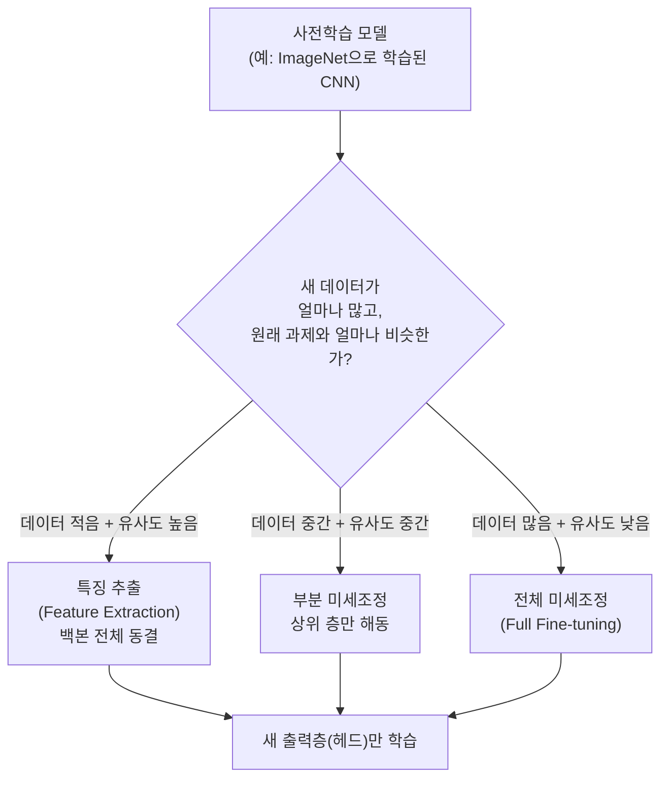

<Callout type="info">
  **이번 문서의 목표:** 사전학습(pretrained) 모델을 새로운 문제에 재사용하는 전이학습(Transfer Learning)의 원리를 이해하고, 특징 추출기(Feature Extractor) 방식과 전체 미세조정(Fine-tuning) 방식을 층 동결·학습률 기준으로 구분해 상황에 맞게 선택할 수 있다.
</Callout>

## 전이학습은 왜 필요한가

11~12편에서 다룬 CNN이나 15편에서 다룬 Transformer 같은 딥러닝 모델은 좋은 성능을 내려면 대개 **수백만~수십억 장(또는 문장)** 규모의 데이터가 필요하다. 그런데 실무에서 풀어야 할 문제는 대부분 데이터가 훨씬 적다. 예를 들어 특정 공장의 불량품 이미지를 분류하는 문제라면 수천 장을 모으기도 쉽지 않다. 이런 적은 데이터로 처음부터(from scratch) 신경망을 학습시키면 07편에서 다룬 과적합(overfitting)이 심하게 일어나기 쉽다.

이 문제를 해결하는 실용적인 방법이 **전이학습**(Transfer Learning)이다. 아이디어는 단순하다. "ImageNet처럼 아주 큰 데이터셋으로 이미 학습된 모델이 있다면, 그 모델이 배운 특징(edge, texture, 형태 등 저수준 패턴부터 사물의 부분적 구조까지)을 그대로 가져다 쓰고, 우리 문제에 맞게 마지막 부분만 살짝 고쳐 쓰자"는 것이다. 이렇게 이미 다른 대규모 데이터로 학습을 마친 모델을 **사전학습 모델**(pretrained model)이라 부른다.

> **쉽게 말하면:** 전이학습은 이미 여러 언어를 유창하게 하는 사람에게 새로운 언어 하나를 가르칠 때, 처음부터 언어 자체를 가르치는 대신 그 사람이 이미 아는 문법 감각과 학습 요령을 그대로 활용하는 것과 같다.

### 왜 저수준 특징은 재사용할 수 있는가

CNN을 예로 들면, 11편에서 다룬 것처럼 앞쪽(입력에 가까운) 합성곱 층은 대체로 **선(edge)이나 질감(texture) 같은 일반적이고 저수준인 패턴**을 학습하는 경향이 있다. 이런 저수준 패턴은 고양이 사진이든 자동차 사진이든 공장 불량품 사진이든 공통으로 나타나는 경우가 많다. 반면 뒤쪽(출력에 가까운) 층으로 갈수록 "이 형태는 고양이 귀다"처럼 **특정 과제에 특화된 고수준 특징**을 학습한다. 그래서 앞쪽 층은 다른 문제에도 재사용하기 좋고, 뒤쪽 층일수록 새로운 문제에 맞게 다시 학습해야 할 필요성이 커진다. 이 원리가 뒤에서 다룰 "어느 층을 얼릴지" 판단의 근거가 된다.

## 특징 추출기 방식 대 미세조정 방식

전이학습을 실제로 적용하는 방법은 크게 두 갈래로 나뉜다.

- **특징 추출**(Feature Extraction): 사전학습된 층(**백본**, backbone이라 부른다)의 가중치를 그대로 **동결**(freeze, 역전파 시 가중치를 갱신하지 않도록 고정)하고, 맨 끝에 우리 문제에 맞는 새로운 출력층(헤드, head)만 새로 붙여 그 부분만 학습한다.
- **미세조정**(Fine-tuning): 동결했던 층 중 일부 또는 전부를 다시 **해동**(unfreeze, 가중치 갱신을 다시 허용)해, 사전학습된 가중치를 출발점으로 삼아 우리 데이터에 맞게 추가로 학습을 진행한다.

### 동결·해동 층 전략 비교표

| 전략 | 동결하는 층 | 학습(갱신)하는 층 | 학습률 설정 | 적합한 상황 |
|---|---|---|---|---|
| 완전 동결(특징 추출) | 백본 전체 | 새 출력층(헤드)만 | 헤드에 비교적 크게(예: 0.001 수준) | 목표 데이터가 매우 적고, 원래 과제와 유사도가 높을 때 |
| 부분 미세조정 | 하위(입력에 가까운) 층 | 상위(출력에 가까운) 일부 층 + 헤드 | 상위 층은 작게, 헤드는 상대적으로 크게 | 목표 데이터가 중간 정도이거나 유사도가 중간일 때 |
| 전체 미세조정(Full Fine-tuning) | 없음(전부 해동) | 백본 전체 + 헤드 | 백본은 매우 작게(예: 0.00001 수준), 헤드는 상대적으로 크게 | 목표 데이터가 충분히 많고, 원래 과제와 유사도가 낮을 때 |

### 왜 학습률을 층마다 다르게, 그것도 아주 작게 주는가

전체 미세조정에서 백본에 원래 모델을 처음 학습시킬 때와 같은 큰 학습률을 그대로 쓰면 어떻게 될까. 08편에서 다룬 경사하강법의 원리를 떠올려 보면, 학습률이 크면 가중치가 한 번에 크게 움직인다. 사전학습된 가중치는 이미 대규모 데이터에서 유용한 패턴을 담고 있는 "잘 잡힌 출발점"인데, 여기에 큰 학습률로 갱신을 가하면 그 좋은 패턴이 몇 스텝 만에 무너져 버릴 수 있다. 이렇게 새로운 데이터를 학습하는 과정에서 이전에 배운 유용한 지식을 잃어버리는 현상을 **파괴적 망각**(catastrophic forgetting)이라 부른다. 그래서 실무에서는 백본에는 아주 작은 학습률을, 새로 붙인 헤드에는 상대적으로 큰 학습률을 주는 **차등 학습률**(differential learning rate) 전략을 흔히 쓴다.

> **쉽게 말하면:** 이미 능숙한 기술을 조금씩만 다듬어야지, 갑자기 크게 뜯어고치면 원래 잘하던 것까지 망가진다.

## CNN과 Transformer에서의 전이학습 사례

- **CNN 기반**: 11~12편에서 다룬 ImageNet 사전학습 VGG·ResNet 등을 이미지 분류·객체 탐지 등 새로운 이미지 과제에 재사용하는 것이 대표적이다. 새 데이터셋의 클래스 수에 맞춰 마지막 완전연결층(출력층)만 새로 갈아 끼우고, 데이터 양에 따라 앞서 표에서 정리한 세 전략 중 하나를 선택한다.
- **Transformer 기반**: 15편에서 다룬 Transformer 인코더 구조를 대규모 텍스트로 사전학습한 모델(예: BERT 계열)을 특정 문서 분류·질의응답 과제에 맞춰 미세조정하는 방식이 널리 쓰인다. 이 경우도 원리는 CNN과 같다. 문장을 이해하는 저수준 언어 표현(문법 구조 등)은 재사용하고, 과제에 특화된 판단(예: 감정이 긍정인지 부정인지)을 담당하는 출력 부분만 새로 학습시키거나 전체를 낮은 학습률로 다시 조정한다.

### 전이학습의 장점과 주의점

- **장점**: 적은 데이터로도 좋은 성능을 낼 수 있고, 처음부터 학습할 때보다 학습 시간과 연산 비용을 크게 줄인다. 07편에서 다룬 과적합 위험도 완화된다(사전학습된 표현이 이미 일반화가 잘 되어 있기 때문).
- **주의점**: 사전학습에 쓰인 데이터와 우리 문제의 데이터가 지나치게 다르면(예: 자연 사진으로 학습된 모델을 의료 영상에 그대로 적용) 재사용할 수 있는 유용한 특징이 적어 전이학습의 이득이 줄어든다. 이런 경우 부분 미세조정보다 전체 미세조정 쪽으로, 또는 아예 처음부터 학습하는 쪽으로 무게를 옮겨야 할 수 있다.

### 자주 틀리는 점

- "전이학습은 항상 모든 층을 동결한다"는 서술은 틀렸다. 동결 범위는 데이터 양과 과제 유사도에 따라 달라지며, 데이터가 충분히 많으면 전체를 해동해 미세조정하는 것이 오히려 더 좋은 성능을 낸다.
- "미세조정 시 학습률을 원래 학습 때와 똑같이 크게 준다"는 서술도 틀렸다. 파괴적 망각을 피하기 위해 백본에는 작은 학습률을 쓰는 것이 일반적이다.
- "저수준 특징은 과제에 특화되고, 고수준 특징이 일반적이다"처럼 저수준·고수준을 뒤바꾼 서술에 주의한다. 실제로는 **입력에 가까운(저수준) 층이 일반적**이고 **출력에 가까운(고수준) 층이 과제 특화적**이다.

## 핵심 정리

- 전이학습은 대규모 데이터로 사전학습된 모델의 특징을 재사용해, 데이터가 적은 새로운 문제에서도 좋은 성능을 내는 방법이다.
- 특징 추출은 백본을 완전 동결하고 새 헤드만 학습하며, 미세조정은 일부 또는 전체 층을 해동해 낮은 학습률로 추가 학습한다.
- 전략 선택은 목표 데이터의 양과 원래 과제와의 유사도에 따라 완전 동결(특징 추출) → 부분 미세조정 → 전체 미세조정 순으로 해동 범위를 넓혀 간다.
- 사전학습된 가중치가 큰 학습률로 급격히 갱신되면 파괴적 망각이 일어날 수 있어, 백본에는 작은 학습률, 새 헤드에는 상대적으로 큰 학습률을 쓰는 차등 학습률 전략을 흔히 쓴다.
- CNN(11~12편)과 Transformer(15편) 모두 저수준 특징을 재사용하고 과제 특화 부분만 새로 학습한다는 같은 원리를 공유한다.

## 마무리 복습

<Quiz
  questionNumber={1}
  question="전이학습에서 '특징 추출(Feature Extraction)' 방식에 대한 설명으로 가장 옳은 것은?"
  options={['백본 전체를 처음부터 다시 학습시킨다', '사전학습된 백본을 동결하고 새로 붙인 출력층(헤드)만 학습한다', '모든 층의 학습률을 동일하게 크게 설정한다', '노이즈 벡터로 새로운 백본을 생성한다']}
  correctAnswer={2}
  explanation="특징 추출 방식은 사전학습된 백본의 가중치를 동결한 채로, 문제에 맞게 새로 붙인 출력층(헤드)만 학습시키는 전이학습 전략이다."
  optionExplanations={['백본을 처음부터 다시 학습시키는 것은 전이학습의 이점을 살리지 못하는 방식이다', '정답: 백본을 동결하고 새 헤드만 학습하는 것이 특징 추출 방식이다', '학습률을 동일하게 크게 주면 파괴적 망각이 일어날 위험이 있다', '노이즈 벡터로 백본을 생성하는 것은 GAN(17편) 개념과 혼동한 설명이다']}
/>

<Quiz
  questionNumber={2}
  question="데이터가 아주 적고 원래 사전학습 과제와 유사도가 매우 높은 상황에서 가장 적합한 전이학습 전략은?"
  options={['백본 전체를 처음부터 무작위 초기화 후 학습', '완전 동결(특징 추출) 방식', '백본을 포함한 전체를 큰 학습률로 재학습', '판별자와 생성자를 함께 학습']}
  correctAnswer={2}
  explanation="데이터가 적고 유사도가 높을 때는 백본을 완전 동결하고 새 헤드만 학습하는 특징 추출 방식이 과적합 위험을 줄이면서도 사전학습 지식을 최대한 활용할 수 있다."
  optionExplanations={['데이터가 적은 상황에서 처음부터 학습시키면 과적합 위험이 크다', '정답: 데이터가 적고 유사도가 높으면 완전 동결(특징 추출)이 적합하다', '큰 학습률로 전체를 재학습하면 파괴적 망각이 일어날 위험이 크다', 'GAN의 생성자·판별자 구조는 전이학습 전략과 무관하다']}
/>

<Quiz
  questionNumber={3}
  question="전체 미세조정(Full Fine-tuning)에서 백본의 학습률을 매우 작게 설정하는 주된 이유는?"
  options={['연산 속도를 높이기 위해서', '사전학습된 유용한 가중치가 갑자기 무너지는 파괴적 망각을 막기 위해서', '모드 붕괴를 막기 위해서', '배치 정규화 통계를 고정하기 위해서']}
  correctAnswer={2}
  explanation="사전학습된 가중치는 이미 유용한 패턴을 담고 있으므로, 큰 학습률로 급격히 갱신하면 그 패턴이 무너지는 파괴적 망각이 일어날 수 있다. 이를 막기 위해 백본에는 작은 학습률을 준다."
  optionExplanations={['학습률 크기와 연산 속도는 직접적인 관련이 없다', '정답: 파괴적 망각을 막기 위해 백본에는 작은 학습률을 준다', '모드 붕괴는 GAN(17편)에서 다루는 별개의 현상이다', '배치 정규화 통계 고정은 학습률 설정과는 다른 별개의 문제다']}
/>

<Quiz
  questionNumber={4}
  question="CNN의 층별 특징에 대한 설명으로 옳지 않은 것은?"
  options={['입력에 가까운(하위) 층은 선·질감 같은 일반적 패턴을 학습하는 경향이 있다', '출력에 가까운(상위) 층은 과제에 특화된 고수준 패턴을 학습하는 경향이 있다', '하위 층이 과제 특화적이고 상위 층이 일반적이라 상위 층부터 동결하는 것이 원칙이다', '전이학습에서는 하위 층을 상대적으로 더 재사용하기 쉽다']}
  correctAnswer={3}
  explanation="옳지 않은 것을 고르는 문제다. 실제로는 하위 층이 일반적 패턴을, 상위 층이 과제 특화 패턴을 학습하는 경향이 있어 3번 보기는 이를 뒤바꾼 틀린 설명이다."
  optionExplanations={['옳은 설명이다(오답 후보 아님)', '옳은 설명이다. 상위 층일수록 과제 특화 패턴을 학습하는 경향이 있다', '정답: 틀린 설명이다. 실제로는 하위 층이 일반적이고 상위 층이 과제 특화적이다', '옳은 설명이다. 일반적 패턴을 담은 하위 층이 재사용하기 더 쉽다']}
/>

<Quiz
  questionNumber={5}
  question="목표 데이터가 충분히 많고 원래 사전학습 과제와 유사도가 낮은 경우, 가장 적합한 전략은?"
  options={['완전 동결(특징 추출)', '부분 미세조정', '전체 미세조정(Full Fine-tuning)', '사전학습 모델을 아예 사용하지 않고 무작위 노이즈만 사용']}
  correctAnswer={3}
  explanation="데이터가 충분히 많고 유사도가 낮으면 동결 범위를 최소화하고 백본 전체를 낮은 학습률로 재학습하는 전체 미세조정이 적합하다."
  optionExplanations={['완전 동결은 데이터가 적고 유사도가 높을 때 적합한 전략이다', '부분 미세조정은 데이터·유사도가 중간 정도일 때 적합하다', '정답: 데이터가 많고 유사도가 낮으면 전체 미세조정이 적합하다', '사전학습 모델을 활용하지 않으면 전이학습 자체가 성립하지 않는다']}
/>

## 참고 자료

- [Deep Learning Book — Transfer Learning and Domain Adaptation](https://www.deeplearningbook.org/)
- [scikit-learn — 모델 재사용·파이프라인 관련 안내](https://scikit-learn.org/stable/)
