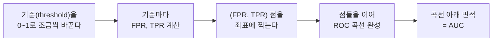

<Callout type="info">
  **이번 문서의 목표:** 혼동행렬(Confusion Matrix)에서 정확도·정밀도·재현율·F1 점수를 실제 숫자로 계산하고, ROC 곡선과 AUC의 의미를 설명하며, 회귀 문제의 MSE·RMSE·MAE·R² 지표를 숫자로 검산하고 언제 무엇을 봐야 하는지 판단할 수 있다.
</Callout>

## 정확도만으로는 왜 부족한가

06편에서 다룬 분류 모델을 학습시킨 뒤 성능을 확인할 때, 가장 먼저 떠오르는 지표는 **정확도**(accuracy, 전체 중 맞힌 비율)다. 그런데 정확도만 보면 위험한 경우가 있다. 예를 들어 희귀 질병 진단처럼 환자(양성)가 전체의 1퍼센트뿐인 데이터에서, 모델이 무조건 "정상(음성)"이라고만 답해도 정확도는 99퍼센트가 나온다. 이렇게 클래스 비율이 한쪽으로 치우친 데이터를 **불균형 데이터**(imbalanced data)라 하는데, 이 경우 정확도는 모델이 실제로 쓸모 있는지를 전혀 말해주지 않는다.

> **쉽게 말하면:** 정확도 하나만 보고 모델을 평가하는 것은, 100명 중 1명만 걸리는 병을 "전부 정상"이라고 찍기만 해도 99점을 받는 시험과 같다.

이 문제를 해결하려면 "맞춘 것"과 "틀린 것"을 더 잘게 쪼개서 봐야 한다. 그 출발점이 **혼동행렬**(confusion matrix)이다.

## 혼동행렬: TP·FP·TN·FN

혼동행렬은 모델의 예측과 실제 정답을 표로 교차 정리한 것이다. "양성(질병 있음, 이상 있음 등 관심 대상)"과 "음성(그 반대)"을 예측하는 이진 분류를 기준으로 하면 다음 네 칸으로 나뉜다.

| 구분 | 실제 양성 | 실제 음성 |
|---|---|---|
| 예측 양성 | TP(True Positive, 참 양성) | FP(False Positive, 거짓 양성) |
| 예측 음성 | FN(False Negative, 거짓 음성) | TN(True Negative, 참 음성) |

- **TP**(참 양성): 실제로 양성인데 양성으로 맞게 예측
- **FP**(거짓 양성): 실제로는 음성인데 양성으로 잘못 예측(흔히 "1종 오류"라고도 함)
- **FN**(거짓 음성): 실제로는 양성인데 음성으로 잘못 예측(흔히 "2종 오류"라고도 함)
- **TN**(참 음성): 실제로 음성인데 음성으로 맞게 예측

> **쉽게 말하면:** TP·TN은 "모델이 맞힌 것", FP·FN은 "모델이 틀린 것"이며, FP는 "아닌데 맞다고 우긴 경우", FN은 "맞는데 아니라고 놓친 경우"다.

### 작은 예시 데이터

암 검진 모델을 100명에게 적용한 결과가 다음과 같다고 하자.

| 구분 | 실제 양성(암 있음, 10명) | 실제 음성(암 없음, 90명) |
|---|---|---|
| 예측 양성 | TP = 8 | FP = 9 |
| 예측 음성 | FN = 2 | TN = 81 |

이 표를 그대로 읽으면, 실제 암 환자 10명 중 8명은 제대로 잡아냈지만(TP=8) 2명은 놓쳤다(FN=2). 또 실제로는 암이 없는 90명 중 81명은 정상으로 잘 판정했지만(TN=81) 9명은 암이 있다고 잘못 판정했다(FP=9).

## 정확도·정밀도·재현율·F1 계산

### 정확도

$$
\text{정확도} = \frac{TP + TN}{TP + FP + FN + TN}
$$

- 분자: 모델이 맞힌 전체 건수(TP+TN)
- 분모: 전체 표본 수

$$
\text{정확도} = \frac{8 + 81}{8 + 9 + 2 + 81} = \frac{89}{100} = 0.89
$$

정확도 89퍼센트는 얼핏 높아 보이지만, 앞서 지적했듯 실제 암 환자 10명 중 2명을 놓쳤다는 사실은 정확도 하나만으로는 드러나지 않는다.

### 정밀도

$$
\text{정밀도} = \frac{TP}{TP + FP}
$$

- **정밀도**(precision): 모델이 "양성"이라고 예측한 것 중 실제로 양성인 비율. "양성이라고 말했을 때 얼마나 믿을 수 있는가"를 나타낸다.

$$
\text{정밀도} = \frac{8}{8 + 9} = \frac{8}{17} \approx 0.471
$$

정밀도 약 47.1퍼센트는 "모델이 암이라고 판정한 17명 중 실제로 암인 사람은 8명뿐"이라는 뜻이다. 즉 이 모델이 양성이라고 말해도 절반 이상은 오진(FP)이라는 의미다.

### 재현율

$$
\text{재현율} = \frac{TP}{TP + FN}
$$

- **재현율**(recall, 민감도 sensitivity라고도 부른다): 실제 양성 중에서 모델이 양성으로 잡아낸 비율. "진짜 양성을 얼마나 놓치지 않고 찾아내는가"를 나타낸다.

$$
\text{재현율} = \frac{8}{8 + 2} = \frac{8}{10} = 0.8
$$

재현율 80퍼센트는 "실제 암 환자 10명 중 8명을 찾아냈다"는 뜻이다. 암 검진처럼 **놓치면 치명적인 상황**에서는 정밀도보다 재현율을 더 중요하게 볼 때가 많다.

### 정밀도와 재현율의 트레이드오프

정밀도와 재현율은 흔히 한쪽을 올리면 다른 쪽이 내려가는 **트레이드오프**(trade-off) 관계에 있다. 판정 기준(threshold, 몇 퍼센트 이상이면 양성으로 볼지 정하는 값)을 낮춰 양성으로 더 많이 판정하면, 실제 양성을 놓칠 확률(FN)은 줄어 재현율이 오르지만, 동시에 실제 음성을 양성으로 잘못 판정하는 경우(FP)도 늘어 정밀도는 떨어지는 경향이 있다. 반대로 기준을 높이면 정밀도는 오르지만 재현율은 내려간다.

### F1 점수

정밀도와 재현율 중 하나만 보면 판단을 그르칠 수 있어, 두 값을 함께 고려하는 지표가 **F1 점수**다. F1은 단순 평균이 아니라 **조화평균**(harmonic mean)으로 계산한다.

$$
F1 = 2 \times \frac{\text{정밀도} \times \text{재현율}}{\text{정밀도} + \text{재현율}}
$$

조화평균을 쓰는 이유는, 정밀도와 재현율 중 하나가 극단적으로 낮으면(예: 정밀도 0.01, 재현율 0.99) 산술평균은 0.5로 높게 나와 문제를 가리지만, 조화평균은 낮은 값 쪽에 훨씬 민감하게 반응해 실제 성능 불균형을 더 잘 드러내기 때문이다.

$$
F1 = 2 \times \frac{0.471 \times 0.8}{0.471 + 0.8} = 2 \times \frac{0.3768}{1.271} \approx 0.593
$$

F1 점수 약 0.593은 정밀도(0.471)와 재현율(0.8)이 균형을 이루지 못하고 있음을 종합적으로 보여준다.

## ROC 곡선과 AUC

정밀도·재현율은 판정 기준(threshold)을 하나 고정했을 때의 값이다. 그런데 기준을 바꿔가며 모델의 전반적인 판별 능력을 보고 싶다면 **ROC 곡선**(Receiver Operating Characteristic curve)을 쓴다. ROC 곡선은 판정 기준을 0에서 1까지 조금씩 바꿔가며, 그때마다의 다음 두 값을 각각 x축·y축에 찍어 이은 그래프다.

- x축: **거짓양성비율**(FPR, False Positive Rate) $= \dfrac{FP}{FP + TN}$ — 실제 음성 중 잘못 양성으로 판정한 비율
- y축: **참양성비율**(TPR, True Positive Rate, 재현율과 같은 식) $= \dfrac{TP}{TP + FN}$

이상적인 모델은 기준을 어떻게 바꿔도 FPR은 낮게 유지하면서 TPR은 높게 유지해, 곡선이 왼쪽 위 모서리에 바짝 붙는 모양이 된다. 완전히 무작위로 찍는 모델은 대각선(FPR=TPR)에 가까운 곡선을 그린다. 이 곡선 아래의 면적을 **AUC**(Area Under the Curve)라 부르며, 1에 가까울수록 좋은 모델, 0.5에 가까우면 무작위 추측과 다를 바 없는 모델을 뜻한다. AUC는 판정 기준 하나를 고정하지 않고 모델의 전반적인 분리 능력을 한 숫자로 요약해 준다는 장점이 있어, 여러 모델을 비교할 때 자주 쓰인다.

## 회귀 지표: MSE·RMSE·MAE·R²

분류가 아니라 연속된 숫자를 예측하는 **회귀**(regression) 문제에서는 혼동행렬 대신 예측값과 실제값의 차이(오차)를 직접 계산하는 지표를 쓴다. 집값 5건을 예로 들어 보자.

| 표본 | 실제값 $y$ | 예측값 $\hat{y}$ | 오차 $y-\hat{y}$ |
|---|---|---|---|
| 1 | 300 | 310 | -10 |
| 2 | 250 | 230 | 20 |
| 3 | 400 | 390 | 10 |
| 4 | 180 | 200 | -20 |
| 5 | 350 | 340 | 10 |

- $y$ (와이): 실제값
- $\hat{y}$ (와이 햇): 모델이 예측한 값

### MSE와 RMSE

$$
MSE = \frac{1}{n}\sum_{i=1}^{n}(y_i - \hat{y}_i)^2
$$

- $n$: 표본 개수
- $\sum$ (시그마, 모두 더하라는 기호): 각 표본의 오차 제곱을 전부 더함

$$
MSE = \frac{(-10)^2 + 20^2 + 10^2 + (-20)^2 + 10^2}{5} = \frac{100+400+100+400+100}{5} = \frac{1100}{5} = 220
$$

MSE는 오차를 제곱하기 때문에 원래 단위(이 예시에서는 만 원 등 금액 단위)의 제곱 단위가 되어 직관적으로 해석하기 어렵다는 단점이 있다. 그래서 MSE에 제곱근을 씌워 원래 단위로 되돌린 지표가 **RMSE**(Root Mean Squared Error)다.

$$
RMSE = \sqrt{MSE} = \sqrt{220} \approx 14.83
$$

RMSE 약 14.83은 "평균적으로 예측이 실제값에서 약 14.83만큼 벗어난다"는 뜻으로, MSE보다 직관적으로 읽힌다. 다만 MSE·RMSE 모두 오차를 제곱하기 때문에 **큰 오차(이상치)에 훨씬 민감**하다는 공통점이 있다.

### MAE

$$
MAE = \frac{1}{n}\sum_{i=1}^{n}|y_i - \hat{y}_i|
$$

- $|\cdot|$: 절댓값(부호를 없애고 크기만 남김)

$$
MAE = \frac{|-10|+|20|+|10|+|-20|+|10|}{5} = \frac{10+20+10+20+10}{5} = \frac{70}{5} = 14
$$

MAE는 오차를 제곱하지 않고 절댓값만 취하므로 이상치의 영향을 MSE·RMSE보다 덜 받는다. 이 예시에서는 RMSE(14.83)와 MAE(14)가 비슷하지만, 만약 한 표본의 오차가 유독 컸다면(예: -100) RMSE만 크게 뛰고 MAE는 상대적으로 덜 민감하게 반응했을 것이다.

### 결정계수 R²

$$
R^2 = 1 - \frac{\sum_{i=1}^{n}(y_i - \hat{y}_i)^2}{\sum_{i=1}^{n}(y_i - \bar{y})^2}
$$

- $\bar{y}$ (와이 바): 실제값들의 평균
- 분자: 모델의 예측 오차 제곱합(모델이 설명하지 못한 부분)
- 분모: 실제값이 평균에서 얼마나 흩어져 있는지의 제곱합(전체 변동)

$R^2$는 "모델이 데이터의 전체 변동 중 얼마만큼을 설명하는가"를 0~1 사이 비율(음수가 나올 수도 있다)로 나타낸다. $R^2 = 1$이면 예측이 실제값과 완벽히 일치한다는 뜻이고, $R^2 = 0$이면 그냥 평균값으로 찍는 것과 다를 바 없다는 뜻이며, 음수가 나오면 평균으로 찍는 것보다도 못한 모델이라는 뜻이다.

## 언제 무엇을 볼지 판단하기

| 상황 | 우선 볼 지표 | 이유 |
|---|---|---|
| 클래스가 균형 잡힌 일반 분류 | 정확도 | 클래스 비율이 비슷해 정확도가 왜곡되지 않음 |
| 클래스가 불균형(희귀질병, 이상탐지 등) | 정밀도·재현율·F1 | 정확도는 다수 클래스에 치우쳐 무의미해질 수 있음 |
| 양성을 놓치면 큰 손해(질병 진단, 보안 위협 탐지) | 재현율 우선 | 실제 양성을 놓치는 FN의 비용이 크기 때문 |
| 양성 오탐이 큰 손해(스팸 처리로 중요 메일 차단 등) | 정밀도 우선 | 실제 음성을 양성으로 잘못 판정하는 FP의 비용이 크기 때문 |
| 여러 모델·기준을 종합 비교 | ROC·AUC | 특정 기준(threshold)에 의존하지 않는 전반적 판별력 비교 |
| 회귀에서 이상치 영향을 강조하고 싶을 때 | MSE·RMSE | 큰 오차에 더 큰 벌점 |
| 회귀에서 이상치 영향을 줄이고 싶을 때 | MAE | 오차 크기에 비례해서만 반응 |
| 회귀 모델의 설명력을 요약하고 싶을 때 | R² | 전체 변동 대비 설명 비율을 한 숫자로 표현 |

### 자주 틀리는 점

- "정확도가 높으면 무조건 좋은 모델이다"는 불균형 데이터에서 특히 위험한 오해다. 항상 클래스 비율을 함께 확인해야 한다.
- 정밀도와 재현율의 분모를 혼동하는 경우가 많다. 정밀도의 분모는 "모델이 양성이라고 예측한 것 전체(TP+FP)"이고, 재현율의 분모는 "실제 양성 전체(TP+FN)"다.
- F1을 산술평균으로 계산하는 실수가 잦다. F1은 반드시 **조화평균** 공식을 써야 한다.
- AUC 0.5는 "성능이 나쁘다"가 아니라 정확히 "무작위 추측과 같다"는 뜻이며, AUC가 0.5보다 뚜렷이 낮다면(예: 0.2) 오히려 예측을 뒤집으면 성능이 좋아진다는 신호일 수 있다.

## 핵심 정리

- 혼동행렬은 TP·FP·FN·TN 네 칸으로 예측과 실제 정답을 교차 정리한 표이며, 모든 분류 평가지표의 출발점이다.
- 정확도 $=(TP+TN)/전체$는 직관적이지만 클래스 불균형 데이터에서는 왜곡되기 쉽다.
- 정밀도 $=TP/(TP+FP)$는 "양성 예측의 신뢰도", 재현율 $=TP/(TP+FN)$은 "실제 양성을 놓치지 않는 정도"를 뜻하며 서로 트레이드오프 관계다.
- F1 점수는 정밀도와 재현율의 조화평균으로, 두 지표의 균형을 하나의 숫자로 보여준다.
- ROC 곡선은 판정 기준을 바꿔가며 FPR·TPR을 그린 곡선이고, AUC는 그 아래 면적으로 모델의 전반적 판별력을 나타낸다(1에 가까울수록 좋음, 0.5는 무작위 수준).
- 회귀 지표는 MSE·RMSE(큰 오차에 민감)와 MAE(이상치에 덜 민감), R²(전체 변동 대비 설명 비율)로 나뉘며 상황에 맞게 선택한다.

## 마무리 복습

<Quiz
  questionNumber={1}
  question="혼동행렬에서 '실제로는 음성인데 모델이 양성으로 잘못 예측한 경우'를 가리키는 용어는?"
  options={['TP(True Positive)', 'FP(False Positive)', 'FN(False Negative)', 'TN(True Negative)']}
  correctAnswer={2}
  explanation="실제 음성을 양성으로 잘못 예측한 경우는 FP(False Positive, 거짓 양성)라고 부른다."
  optionExplanations={['TP는 실제 양성을 양성으로 맞게 예측한 경우다', '정답: 실제 음성을 양성으로 잘못 예측한 경우가 FP다', 'FN은 실제 양성을 음성으로 잘못 예측한 경우다', 'TN은 실제 음성을 음성으로 맞게 예측한 경우다']}
/>

<Quiz
  questionNumber={2}
  question="TP=8, FP=9, FN=2, TN=81일 때 정밀도(precision)를 소수 셋째 자리에서 반올림한 값은?"
  options={['0.800', '0.471', '0.890', '0.593']}
  correctAnswer={2}
  explanation="정밀도 = TP/(TP+FP) = 8/(8+9) = 8/17 ≈ 0.471이다."
  optionExplanations={['0.8은 재현율(TP/(TP+FN)=8/10) 값이다', '정답: 8/17 ≈ 0.471이 정밀도다', '0.89는 정확도((TP+TN)/전체=89/100) 값이다', '0.593은 F1 점수에 가까운 값이다']}
/>

<Quiz
  questionNumber={3}
  question="같은 데이터(TP=8, FP=9, FN=2, TN=81)에서 F1 점수를 정밀도 0.471, 재현율 0.8로 계산하면 소수 둘째 자리까지 가장 가까운 값은?"
  options={['0.47', '0.59', '0.64', '0.80']}
  correctAnswer={2}
  explanation="F1 = 2×(정밀도×재현율)/(정밀도+재현율) = 2×(0.471×0.8)/(0.471+0.8) = 2×0.3768/1.271 ≈ 0.593으로 0.59에 가장 가깝다."
  optionExplanations={['0.47은 정밀도 값 자체다', '정답: 조화평균 공식으로 계산하면 약 0.59가 나온다', '산술평균 (0.471+0.8)/2 ≈ 0.636을 잘못 사용한 값에 가깝다', '0.8은 재현율 값 자체다']}
/>

<Quiz
  questionNumber={4}
  question="ROC 곡선과 AUC에 대한 설명으로 옳지 않은 것은?"
  options={['ROC 곡선의 x축은 거짓양성비율(FPR), y축은 참양성비율(TPR)이다', 'AUC가 1에 가까울수록 모델의 판별 능력이 좋다는 뜻이다', 'AUC 0.5는 무작위로 찍는 모델과 판별력이 비슷하다는 뜻이다', 'ROC 곡선은 정밀도와 재현율을 각각 x축, y축으로 놓고 그린 곡선이다']}
  correctAnswer={4}
  explanation="옳지 않은 것을 고르는 문제다. ROC 곡선은 정밀도·재현율이 아니라 FPR과 TPR을 각각 x축·y축으로 그린 곡선이므로 4번 보기가 틀린 설명이다."
  optionExplanations={['옳은 설명이다(오답 후보 아님)', '옳은 설명이다. AUC가 1에 가까울수록 좋은 판별력을 뜻한다', '옳은 설명이다. AUC 0.5는 무작위 추측 수준이다', '정답: 틀린 설명이다. ROC 곡선의 축은 정밀도·재현율이 아니라 FPR·TPR이다']}
/>

<Quiz
  questionNumber={5}
  question="실제값 5개 중 오차가 각각 -10, 20, 10, -20, 10일 때 MAE(평균절대오차)는?"
  options={['14', '22', '70', '220']}
  correctAnswer={1}
  explanation="MAE = (|-10|+|20|+|10|+|-20|+|10|)/5 = (10+20+10+20+10)/5 = 70/5 = 14다."
  optionExplanations={['정답: 절댓값의 합 70을 표본 수 5로 나누면 14다', '오차 제곱합을 잘못 나눈 값으로 보인다', '절댓값의 합(분자) 70을 그대로 답으로 착각한 값이다', '오차 제곱합인 1100의 일부를 잘못 계산한 값으로 보인다']}
/>

<Quiz
  questionNumber={6}
  question="양성을 놓치는 것(FN)이 매우 치명적인 질병 진단 모델을 평가할 때, 가장 우선적으로 확인해야 할 지표는?"
  options={['정확도', '정밀도', '재현율', 'MAE']}
  correctAnswer={3}
  explanation="재현율은 실제 양성 중 모델이 놓치지 않고 찾아낸 비율(TP/(TP+FN))이다. FN의 비용이 매우 큰 상황에서는 재현율을 우선적으로 높여야 한다."
  optionExplanations={['불균형 데이터에서 정확도는 실제 위험을 감추기 쉽다', '정밀도는 FP를 줄이는 데 초점이 있어 FN이 치명적인 상황과는 우선순위가 다르다', '정답: FN이 치명적일 때는 재현율을 우선 확인해야 한다', 'MAE는 회귀 지표로 이진 분류 문제에는 적용되지 않는다']}
/>

<Quiz
  questionNumber={7}
  question="결정계수 R²에 대한 설명으로 가장 옳은 것은?"
  options={['항상 0과 1 사이의 값만 나온다', '값이 1에 가까울수록 모델이 데이터의 변동을 잘 설명한다는 뜻이다', 'R²는 오차를 절댓값으로만 계산한 지표다', 'R²가 0이면 예측이 실제값과 완벽히 일치한다는 뜻이다']}
  correctAnswer={2}
  explanation="R²는 모델이 데이터 전체 변동 중 얼마를 설명하는지를 나타내며, 1에 가까울수록 설명력이 높다는 뜻이다. 모델이 매우 나쁘면 음수가 나올 수도 있다."
  optionExplanations={['R²는 모델이 평균보다 나쁘면 음수가 될 수 있어 항상 0~1 사이는 아니다', '정답: R²가 1에 가까울수록 모델의 설명력이 높다', 'R²는 절댓값이 아니라 오차 제곱합의 비율로 계산된다', '완벽히 일치하면 R²는 0이 아니라 1이 된다']}
/>

## 참고 자료

- [scikit-learn — Model Evaluation: Classification and Regression Metrics](https://scikit-learn.org/stable/modules/model_evaluation.html)
- [Deep Learning Book — Performance Metrics](https://www.deeplearningbook.org/)
