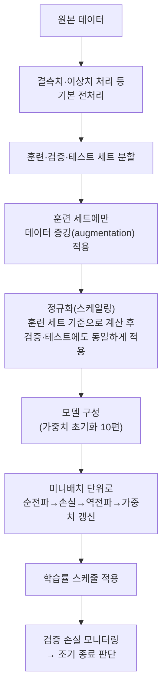

<Callout type="info">
  **이번 문서의 목표:** 학습률 스케줄, 미니배치 크기, 에폭 수 같은 학습 실무 요소가 훈련 결과에 미치는 영향을 설명하고, 전처리·증강·정규화가 실행되는 순서와 하이퍼파라미터 튜닝 방법을 정리해 독학사 응용·서술형 문제에 답할 수 있다.
</Callout>

## 학습률 스케줄: 학습률을 훈련 중에 바꾸는 이유

08편에서 다룬 경사하강법은 **학습률**(learning rate, $\eta$ 에타)이라는 하나의 값으로 매 스텝 가중치를 얼마나 움직일지 정한다. 그런데 학습률을 훈련 내내 고정된 하나의 값으로 두면 문제가 생긴다. 학습 초반에는 가중치가 정답과 멀리 떨어져 있어 큰 폭으로 움직여야 빨리 접근할 수 있지만, 학습 후반에는 이미 최적점 근처에 도달했으므로 큰 학습률을 계속 쓰면 최적점을 지나쳐 진동하거나 발산할 위험이 있다.

> **쉽게 말하면:** 목적지에 가까워질수록 보폭을 줄여야 정확히 멈춰 설 수 있는 것과 같다.

이 문제를 해결하기 위해 훈련이 진행됨에 따라 학습률을 점차 줄여가는 방법을 **학습률 스케줄**(learning rate schedule)이라 부른다. 대표적인 방식은 다음과 같다.

- **계단식 감소**(step decay): 정해진 에폭마다(예: 10에폭마다) 학습률을 일정 비율(예: 절반)로 뚝뚝 떨어뜨린다.
- **코사인 어닐링**(cosine annealing): 학습률을 코사인 함수 모양으로 부드럽게 감소시켜, 급격한 단절 없이 서서히 줄인다.
- **웜업**(warm-up): 훈련 아주 초반에는 오히려 학습률을 0에 가까운 작은 값에서 목표 학습률까지 서서히 **올렸다가**, 이후 본격적으로 감소시킨다. 초기 가중치가 무작위(10편의 초기화 참고)일 때 처음부터 큰 학습률을 쓰면 불안정해지기 쉬운 문제를 완화한다.

## 미니배치 크기의 영향

07~08편에서 다룬 것처럼, 딥러닝은 전체 데이터를 한 번에 쓰는 대신 일부씩 잘라 쓰는 **미니배치**(mini-batch) 단위로 경사를 계산한다. 미니배치 크기는 훈련 속도와 안정성에 다음과 같은 영향을 준다.

| 미니배치 크기 | 그라디언트 추정의 특성 | 훈련 속도(연산 효율) | 일반화 성능 경향 |
|---|---|---|---|
| 작은 배치(예: 8–32) | 그라디언트에 잡음(노이즈)이 많이 섞임 | 한 스텝은 빠르지만 스텝 수가 많이 필요 | 잡음이 일종의 정규화 효과를 주어 일반화에 유리한 경우가 많음 |
| 큰 배치(예: 512 이상) | 그라디언트 추정이 안정적이고 매끄러움 | GPU 병렬 연산 활용도가 높아 처리량은 크지만 최적점 근처에서 평탄한 곳에 갇히기 쉬움 | 훈련 손실은 잘 줄지만 검증 성능(일반화)이 상대적으로 떨어지는 경우가 보고됨 |

작은 배치가 주는 "잡음"은 09편에서 다룬 정규화(regularization)와 비슷한 효과를 낸다. 매 스텝 그라디언트가 조금씩 다르게 추정되므로, 모델이 훈련 데이터의 세부 잡음까지 딱 맞춰 외우는 것을 방해해 오히려 일반화에 도움이 되는 경우가 많다. 반대로 배치를 너무 크게 하면 그라디언트가 너무 매끈해져서 이런 효과가 줄어든다. 그래서 실무에서는 GPU 메모리가 허용하는 한도 안에서 32–256 사이의 배치 크기를 널리 사용한다.

## 에폭 수와 조기 종료

**에폭**(epoch)은 전체 훈련 데이터를 한 번 다 사용해 학습을 마친 단위를 말한다. 에폭 수를 너무 적게 주면 모델이 아직 데이터의 패턴을 충분히 배우지 못한 **과소적합**(underfitting) 상태로 끝나고, 너무 많이 주면 09편에서 다룬 **과적합**(overfitting)이 심해진다. 실무에서는 미리 정해진 에폭 수를 그대로 다 채우기보다, 09편에서 다룬 **조기 종료**(Early Stopping)를 함께 써서 검증 손실(validation loss)이 더 이상 좋아지지 않는 시점에 훈련을 멈춘다. 이렇게 하면 에폭 수라는 하이퍼파라미터를 정확히 미리 알지 못해도, 훈련 과정 자체가 적절한 시점을 찾아준다.

## 실무 파이프라인의 실행 순서

딥러닝 모델을 훈련시킬 때는 여러 요소(전처리, 증강, 정규화, 최적화, 학습률 스케줄, 조기 종료)를 특정한 순서로 조합해야 한다. 순서를 뒤바꾸면 데이터가 오염되거나 효과가 반감될 수 있다.

이 순서에서 특히 시험에 자주 나오는 함정이 두 가지 있다.

1. **분할 전에 전체 데이터로 정규화 통계를 계산하면 안 된다.** 평균·표준편차 같은 정규화 통계는 반드시 **훈련 세트만으로** 계산하고, 그 값을 검증·테스트 세트에도 그대로 적용해야 한다. 전체 데이터로 통계를 미리 계산해버리면 검증·테스트 세트의 정보가 훈련 과정에 새어 들어가는 **데이터 누수**(data leakage)가 발생해, 실제보다 성능이 부풀려 보이게 된다.
2. **데이터 증강은 훈련 세트에만 적용한다.** 검증·테스트 세트는 실제 배포 환경에서 마주칠 데이터를 흉내 낸 것이므로, 여기에 증강(회전·crop 등)을 적용하면 평가 자체가 왜곡된다.

> **쉽게 말하면:** 시험 문제(검증·테스트 데이터)를 미리 훔쳐보고 공부 방법(정규화 통계)을 정하면 안 되는 것과 같다.

## 하이퍼파라미터 튜닝과 실험 설계

학습률, 미니배치 크기, 정규화 강도(09편의 L1/L2 계수, Dropout 비율) 등 모델이 스스로 학습하지 않고 사람이 미리 정해야 하는 값을 **하이퍼파라미터**(hyperparameter)라 부른다. 하이퍼파라미터를 좋은 값으로 찾아가는 과정을 **하이퍼파라미터 튜닝**이라 하며, 대표적인 탐색 방법은 다음과 같다.

| 방법 | 방식 | 장점 | 단점 |
|---|---|---|---|
| 그리드 탐색(Grid Search) | 후보 값들을 격자 형태로 모든 조합 다 시도 | 빠짐없이 탐색 가능 | 하이퍼파라미터 수가 늘어나면 조합 수가 기하급수적으로 증가 |
| 무작위 탐색(Random Search) | 정해진 범위 내에서 무작위로 조합을 뽑아 시도 | 같은 시도 횟수 대비 넓은 범위를 효율적으로 탐색 | 운이 나쁘면 좋은 조합을 놓칠 수 있음 |
| 베이지안 최적화(Bayesian Optimization) | 이전 시도 결과를 바탕으로 다음에 시도할 조합을 확률적으로 추천 | 적은 시도 횟수로도 좋은 조합을 찾는 경향 | 구현이 상대적으로 복잡 |

하이퍼파라미터 튜닝의 성능 비교는 반드시 **검증 세트**(validation set) 기준으로 이뤄져야 한다. 테스트 세트를 튜닝 과정에서 들여다보고 하이퍼파라미터를 고르면, 테스트 세트가 사실상 훈련 과정의 일부가 되어버려 최종 성능 평가의 의미가 사라진다(이 역시 데이터 누수의 한 형태다).

### 독학사 스타일 응용 문제 접근법

독학사 3단계 딥러닝은 단순 암기형 문제 외에도 "다음 상황에서 어떤 조치를 우선할 것인가"를 묻는 응용·서술형 문제가 나올 수 있다. 04편에서 다룬 서술형 답안 구조(현상 파악 → 원인 진단 → 해결책 제시 → 근거 설명)를 이 과목의 실무 요소에 적용하면 다음과 같은 흐름으로 답안을 구성할 수 있다.

<Steps>

### 1단계: 현상 파악

훈련 손실과 검증 손실 그래프를 보고 어떤 패턴인지 짚는다(예: 훈련 손실은 계속 낮아지는데 검증 손실은 어느 시점부터 다시 올라간다).

### 2단계: 원인 진단

09편에서 다룬 과적합·과소적합 개념을 적용해 원인을 짚는다(위 예시라면 과적합 신호).

### 3단계: 해결책 제시

이 문서와 09~10편에서 다룬 도구 중 상황에 맞는 것을 고른다(조기 종료, 정규화 강화, 데이터 증강 추가, 학습률 재조정 등).

### 4단계: 근거 설명

왜 그 해결책이 해당 원인에 대응되는지 수식·원리로 뒷받침한다(예: Dropout이 왜 공동적응을 막아 과적합을 완화하는지, 09편 참고).

</Steps>

### 자주 틀리는 점

- "학습률은 훈련 내내 고정하는 것이 정석이다"는 틀린 서술이다. 학습률 스케줄(계단식·코사인·웜업)을 함께 쓰는 것이 일반적이다.
- "배치 크기를 키우면 항상 일반화 성능도 함께 좋아진다"는 틀린 서술이다. 큰 배치는 연산 효율은 높이지만 일반화 성능은 오히려 떨어질 수 있다는 경향이 보고되어 있다.
- "정규화 통계는 전체 데이터(훈련+검증+테스트)로 계산해야 더 정확하다"는 틀린 서술이다. 데이터 누수를 피하기 위해 반드시 **훈련 세트만으로** 계산해야 한다.
- "하이퍼파라미터 튜닝은 테스트 세트 성능을 보면서 진행해야 가장 정확하다"도 틀린 서술이다. 튜닝은 검증 세트로, 최종 평가만 테스트 세트로 단 한 번 확인하는 것이 원칙이다.

## 핵심 정리

- 학습률 스케줄(계단식 감소, 코사인 어닐링, 웜업)은 훈련 진행에 따라 학습률을 조절해 초반 안정성과 후반 정밀 수렴을 동시에 잡는다.
- 미니배치 크기는 그라디언트의 잡음 수준과 연산 효율, 일반화 성능 사이의 트레이드오프를 결정한다.
- 에폭 수는 조기 종료(09편)와 함께 조절해 과소적합·과적합 사이의 지점을 찾는다.
- 전처리·분할 → 훈련 세트에만 증강 → 훈련 세트 기준 정규화 → 모델 훈련 → 학습률 스케줄 → 검증 기반 조기 종료의 순서를 지켜야 데이터 누수를 막을 수 있다.
- 하이퍼파라미터 튜닝은 그리드·무작위·베이지안 탐색 중 상황에 맞게 고르되, 항상 검증 세트 기준으로 비교하고 테스트 세트는 최종 평가에만 단 한 번 사용한다.

## 마무리 복습

<Quiz
  questionNumber={1}
  question="학습률 스케줄에서 '웜업(warm-up)'에 대한 설명으로 가장 옳은 것은?"
  options={['훈련 내내 학습률을 하나의 값으로 고정한다', '훈련 초반에 학습률을 서서히 올렸다가 이후 감소시킨다', '검증 손실이 나빠지면 학습을 즉시 중단한다', '배치 크기를 훈련 중간에 두 배로 늘린다']}
  correctAnswer={2}
  explanation="웜업은 훈련 아주 초반에 학습률을 작은 값에서 목표 값까지 서서히 올려 초기 불안정성을 줄인 뒤, 이후 본격적으로 감소시키는 학습률 스케줄 기법이다."
  optionExplanations={['학습률을 고정하는 것은 웜업이 아니라 고정 학습률 방식이다', '정답: 웜업은 초반에 학습률을 서서히 올리는 단계를 포함한다', '검증 손실 기반 중단은 조기 종료(Early Stopping)에 대한 설명이다', '배치 크기 조정은 학습률 스케줄과는 별개의 요소다']}
/>

<Quiz
  questionNumber={2}
  question="미니배치 크기를 매우 작게 설정했을 때 나타나는 경향으로 가장 옳은 것은?"
  options={['그라디언트 추정이 완전히 결정론적이 되어 잡음이 사라진다', '그라디언트에 잡음이 많이 섞여 일종의 정규화 효과를 낼 수 있다', 'GPU 병렬 연산 효율이 항상 극대화된다', '데이터 증강이 자동으로 비활성화된다']}
  correctAnswer={2}
  explanation="작은 미니배치는 매 스텝 그라디언트 추정에 잡음이 많이 섞이는데, 이 잡음이 모델이 훈련 데이터에 지나치게 맞춰지는 것을 방해해 정규화와 비슷한 효과를 내는 경우가 많다."
  optionExplanations={['작은 배치일수록 오히려 그라디언트 추정의 잡음이 커진다', '정답: 작은 배치의 잡음은 정규화와 비슷한 효과를 줄 수 있다', '작은 배치는 병렬 연산 효율을 오히려 떨어뜨리는 경향이 있다', '배치 크기와 데이터 증강 적용 여부는 서로 독립적인 요소다']}
/>

<Quiz
  questionNumber={3}
  question="딥러닝 훈련 파이프라인에서 데이터 누수(data leakage)를 피하기 위한 올바른 순서로 가장 옳은 것은?"
  options={['전체 데이터로 정규화 통계를 계산한 뒤 훈련·검증·테스트로 분할한다', '훈련·검증·테스트로 먼저 분할한 뒤, 훈련 세트만으로 정규화 통계를 계산해 나머지에도 적용한다', '테스트 세트의 정규화 통계를 계산해 훈련 세트에 적용한다', '검증 세트에만 데이터 증강을 적용한다']}
  correctAnswer={2}
  explanation="데이터 누수를 막으려면 먼저 데이터를 훈련·검증·테스트로 분할한 뒤, 정규화에 필요한 통계(평균·표준편차 등)를 훈련 세트만으로 계산하고 그 값을 검증·테스트 세트에도 동일하게 적용해야 한다."
  optionExplanations={['분할 전 전체 데이터로 통계를 계산하면 검증·테스트 정보가 훈련 과정에 새어 들어간다', '정답: 분할 후 훈련 세트 기준으로 통계를 계산해야 데이터 누수를 막을 수 있다', '테스트 세트 통계를 훈련에 사용하는 것은 데이터 누수의 대표적인 예다', '데이터 증강은 검증 세트가 아니라 훈련 세트에만 적용해야 한다']}
/>

<Quiz
  questionNumber={4}
  question="하이퍼파라미터 튜닝 방법 중 '무작위 탐색(Random Search)'의 특징으로 가장 옳은 것은?"
  options={['모든 후보 조합을 빠짐없이 격자 형태로 시도한다', '정해진 범위 내에서 무작위로 조합을 뽑아 시도한다', '이전 시도 결과를 바탕으로 다음 조합을 확률적으로 추천한다', '검증 세트 없이 테스트 세트만으로 성능을 비교한다']}
  correctAnswer={2}
  explanation="무작위 탐색은 정해진 범위 안에서 하이퍼파라미터 조합을 무작위로 뽑아 시도하는 방법으로, 같은 시도 횟수 대비 넓은 범위를 효율적으로 탐색할 수 있다."
  optionExplanations={['모든 조합을 빠짐없이 시도하는 것은 그리드 탐색에 대한 설명이다', '정답: 무작위 탐색은 범위 내에서 무작위로 조합을 시도하는 방법이다', '이전 결과를 바탕으로 다음 조합을 추천하는 것은 베이지안 최적화에 대한 설명이다', '하이퍼파라미터 튜닝은 검증 세트를 기준으로 비교해야 한다']}
/>

<Quiz
  questionNumber={5}
  question="훈련 손실은 계속 낮아지는데 검증 손실이 어느 시점부터 다시 올라가는 그래프를 관찰했다. 가장 적절한 진단과 대응으로 옳은 것은?"
  options={['과소적합이므로 모델 구조를 더 단순하게 줄인다', '과적합이므로 조기 종료나 정규화 강화를 고려한다', '학습률이 너무 낮으므로 배치 크기를 줄인다', '데이터 누수이므로 정규화 통계를 전체 데이터로 다시 계산한다']}
  correctAnswer={2}
  explanation="훈련 손실은 계속 낮아지는데 검증 손실이 다시 올라가는 것은 전형적인 과적합 신호다. 09편에서 다룬 조기 종료나 L1/L2·Dropout 같은 정규화 강화로 대응하는 것이 적절하다."
  optionExplanations={['과소적합이라면 훈련 손실 자체가 충분히 낮아지지 않는 경향을 보인다', '정답: 훈련·검증 손실이 벌어지는 패턴은 과적합의 전형적인 신호다', '학습률과 배치 크기 조정이 이 증상의 직접적인 원인 진단은 아니다', '정규화 통계를 전체 데이터로 계산하는 것은 오히려 데이터 누수를 유발하는 잘못된 대응이다']}
/>

## 참고 자료

- [Deep Learning Book — Optimization for Training Deep Models](https://www.deeplearningbook.org/)
- [scikit-learn — Model Selection and Hyperparameter Tuning](https://scikit-learn.org/stable/modules/grid_search.html)
