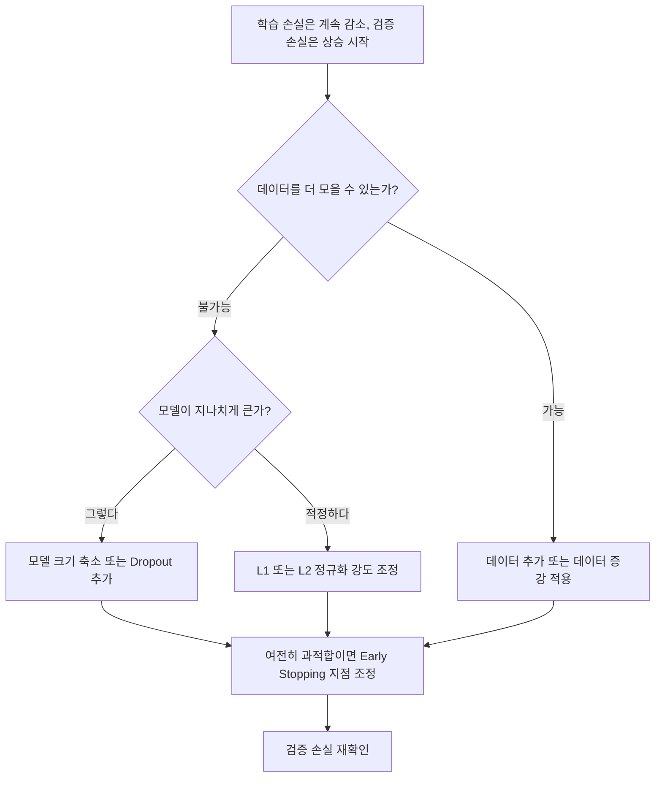

<Callout type="info">
  **이번 문서의 목표:** 05편부터 27편까지 다룬 내용을 한 장에 압축해, 시험 직전 2주 동안 전 범위를 빠르게 복습하고 자신의 취약 영역을 스스로 점검할 수 있다.
</Callout>

이 편은 새로운 개념을 설명하는 편이 아니다. 지금까지 배운 내용을 **다시 읽지 않고도 기억을 되살릴 수 있는 압축된 형태**로 정리하는 편이다. 각 항목 옆의 괄호 숫자는 자세한 설명이 있는 편이므로, 기억이 흐릿한 항목은 그 편으로 돌아가 다시 확인한다.

## 2주 학습 로드맵

<Steps>

### 1–3일차: 딥러닝의 기본 엔진

02·03편(용어·머신러닝과의 관계)을 훑고, 05–08편(퍼셉트론·MLP, 활성화·손실, 순전파·역전파, 최적화)을 집중 복습한다. 역전파 1스텝 계산을 손으로 최소 3번 이상 직접 해본다.

### 4–6일차: 정규화와 CNN

09–12편(정규화, 배치 정규화·증강, CNN 기초, CNN 구조)을 복습한다. 합성곱 출력 크기 공식과 파라미터 수 계산을 여러 숫자로 바꿔가며 연습한다.

### 7–9일차: 시퀀스와 Transformer

13–15편(RNN·LSTM·GRU, 임베딩·Seq2Seq, Transformer 개요)을 복습한다. LSTM 게이트의 역할과 셀프 어텐션의 계산 순서를 도식으로 그려본다.

### 10–11일차: 생성 모델과 전이학습·평가

16–20편(AE·VAE, GAN, 전이학습, 평가지표, 실무 요소)을 복습한다. 혼동행렬에서 정밀도·재현율·F1을 계산하는 연습을 반복한다.

### 12–14일차: 실전 감각 다지기

21–27편(유형 문제·기출·모의고사)을 실제 시험처럼 시간을 재며 풀고, 틀린 문항이 속한 편으로 돌아가 개념을 다시 확인한다. 이 28편의 체크리스트로 취약 영역을 표시하고 마지막 이틀은 취약 영역 위주로 복습한다.

</Steps>

## 영역별 핵심 정의 한 줄 압축

| 영역(관련 편) | 핵심 정의 한 줄 | 핵심 수식 | 시험에서 자주 걸리는 주의점 |
| --- | --- | --- | --- |
| 퍼셉트론·MLP(05) | 입력의 가중합에 활성화 함수를 적용하는 최소 단위를 층으로 쌓은 구조 | $z = \sum w_i x_i + b$ | 단일 퍼셉트론은 XOR 같은 비선형 분리 문제를 풀 수 없다 |
| 활성화 함수(06) | 가중합에 비선형성을 더해 신경망의 표현력을 만드는 함수 | $a = \sigma(z)$, $a = \max(0, z)$ | ReLU는 음수 입력에서 그라디언트가 0이 되는 죽은 뉴런 문제가 있다 |
| 손실 함수(06) | 예측과 정답의 차이를 하나의 숫자로 요약하는 함수 | $L = \frac{1}{2}(y-a)^2$, $L=-\ln(p_{정답})$ | 회귀는 MSE·MAE, 분류는 교차엔트로피가 기본 조합이다 |
| 순전파·역전파(07) | 입력을 출력까지 계산(순전파)한 뒤 손실의 그라디언트를 연쇄 법칙으로 역방향 전달(역전파)하는 절차 | $\partial L/\partial w = \partial L/\partial a \cdot \partial a/\partial z \cdot \partial z/\partial w$ | 활성화 함수의 국소 미분과 연쇄 법칙의 곱셈 순서를 혼동하지 않는다 |
| 최적화(08) | 그라디언트를 이용해 손실을 줄이는 방향으로 파라미터를 갱신하는 절차 | $w \leftarrow w - \eta \nabla L$ | Adam도 학습률을 사용자가 정해야 하며, 모멘텀 계수가 크면 오버슈팅 위험이 있다 |
| 정규화(09) | 학습 데이터에 지나치게 맞춰지는 과적합을 억제하는 기법들의 총칭 | L2: $L + \lambda \sum w^2$ | L1은 희소성(일부 가중치를 0으로), L2는 크기 축소(0에 가깝게)를 유도한다 |
| 배치 정규화·증강(10) | 층 입력을 정규화하거나 데이터를 인위적으로 다양화해 학습을 안정시키는 기법 | - | 배치 정규화는 학습 시 배치 통계, 추론 시 이동평균을 사용한다 |
| CNN 기초(11) | 필터가 입력을 훑으며 지역적 특징을 추출하는 합성곱 연산 중심의 구조 | 출력 크기: $\frac{N+2P-F}{S}+1$ | 파라미터 수 계산 시 편향을 빠뜨리기 쉽다: $(F \times F \times C_{in}+1)\times C_{out}$ |
| CNN 구조(12) | LeNet·AlexNet·VGG·ResNet 등 대표적인 CNN 설계 흐름 | - | ResNet의 핵심은 잔차(지름길) 연결로 그라디언트 소실을 완화하는 것이다 |
| RNN·LSTM·GRU(13) | 시퀀스를 시간 순서대로 처리하며 은닉 상태로 과거 정보를 전달하는 구조 | $C_t = f_t C_{t-1}+i_t\tilde{C}_t$ | 기본 RNN은 그라디언트 소실로 장기 의존성 학습이 어렵고, LSTM·GRU가 게이트로 이를 완화한다 |
| 임베딩·Seq2Seq(14) | 단어 등을 밀집 벡터로 표현하고, 인코더-디코더로 시퀀스를 변환하는 구조 | 파라미터 수: 어휘 크기 × 임베딩 차원 | 기본 Seq2Seq는 고정 크기 문맥 벡터 병목이 있고, Attention이 이를 완화한다 |
| Transformer(15) | 순환 구조 없이 셀프 어텐션으로 시퀀스를 병렬 처리하는 구조 | 스케일드 닷프로덕트: $\frac{QK^T}{\sqrt{d_k}}$ | 위치 정보가 없어 위치 인코딩이 별도로 필요하고, 계산량은 시퀀스 길이의 제곱에 비례한다 |
| AE·VAE(16) | 인코더-디코더로 데이터를 압축·복원하며, VAE는 잠재변수를 확률분포로 다룬다 | ELBO = 재구성 손실 + KL 발산 | VAE의 KL 발산 항은 잠재분포를 표준정규분포에 가깝게 정규화하는 역할이다 |
| GAN(17) | 생성자와 판별자가 경쟁하며 데이터 분포를 학습하는 구조 | - | 모드 붕괴는 생성 다양성이 떨어지는 현상이지 판별자가 완벽해지는 현상이 아니다 |
| 전이학습(18) | 사전학습된 모델의 표현을 새로운 문제에 재사용하는 접근 | - | 전체 미세조정은 사전학습 정보 보존을 위해 보통 더 작은 학습률을 쓴다 |
| 평가지표(19) | 분류·회귀 모델의 성능을 수치로 요약하는 지표들 | $F1=\frac{2PR}{P+R}$ | 정밀도의 분모는 예측 양성 전체, 재현율의 분모는 실제 양성 전체로 서로 다르다 |
| 학습 실무 요소(20) | 학습률 스케줄·미니배치·에폭 등 실제 훈련을 좌우하는 설정값들 | - | 배치가 작을수록 그라디언트 잡음이 늘어 정규화와 비슷한 효과를 줄 수 있다 |

## 판단 흐름: 검증 손실이 나빠지기 시작했을 때 대응 순서

시험에서 "과적합이 의심될 때 취할 조치의 순서"를 묻는 응용 문제가 자주 출제된다. 아래 흐름은 09–10편에서 다룬 정규화 기법들을 실무에서 시도하는 일반적인 순서를 정리한 것이다.

> **쉽게 말하면:** 데이터를 늘릴 수 있으면 데이터부터 늘리고, 그다음 모델 크기·Dropout·정규화 강도를 조절하고, 마지막으로 학습을 멈추는 시점을 조정하는 순서로 접근한다.

## 자주 출제되는 함정 보기 패턴

객관식 보기에서 반복적으로 나타나는 함정 문장 패턴을 미리 알아두면, 처음 보는 문제에서도 함정을 빠르게 알아챌 수 있다.

| 함정 패턴 | 실제로는 | 예시 |
| --- | --- | --- |
| "항상", "반드시", "전혀"처럼 예외 없는 단정 표현 | 딥러닝 개념 대부분은 일반적인 경향이지 절대적 법칙이 아닌 경우가 많음 | "Adam은 항상 SGD보다 좋은 성능을 낸다"(옳지 않음, 상황에 따라 다름) |
| 두 지표·개념의 분모·분자를 서로 바꿔치기 | 정밀도와 재현율처럼 이름이 비슷한 지표는 분모 기준이 다름 | 정밀도의 분모(예측 양성)를 재현율의 분모(실제 양성)로 착각 |
| 역할이 비슷한 두 구성 요소를 서로 바꿔치기 | 인코더/디코더, 생성자/판별자, 망각 게이트/입력 게이트 등은 방향이 정반대 | "인코더가 디코더의 출력을 압축한다"처럼 방향이 뒤바뀐 진술 |
| 원인과 결과를 뒤바꾸기 | 어떤 기법이 왜 그 효과를 내는지의 인과관계가 뒤집힘 | "그라디언트 소실 때문에 시퀀스가 길어진다"(실제로는 반대) |
| 최신·복잡한 기법일수록 하이퍼파라미터가 필요 없다는 착각 | Adam 등 적응적 기법도 학습률 등 기본 하이퍼파라미터는 여전히 필요 | "Adam은 학습률 설정이 필요 없다"(옳지 않음) |
| 계산 공식의 항 하나를 빠뜨리거나 순서를 바꾼 오답 보기 | 편향을 빠뜨린 파라미터 수, +1을 빠뜨린 출력 크기 등 | CNN 파라미터 수 계산에서 편향 항을 누락 |
| 두 손실 함수·활성화 함수의 출력 범위를 혼동 | 시그모이드(0–1)와 tanh(-1–1)의 범위가 다름 | "tanh의 출력 범위는 0에서 1이다"(옳지 않음) |
| 학습(training)과 추론(inference) 시의 동작을 혼동 | Dropout, 배치 정규화는 학습과 추론에서 서로 다르게 동작 | "추론 시에도 학습 때와 같은 비율로 뉴런을 무작위로 끈다"(옳지 않음) |

## 취약 영역 점검 체크리스트

아래 각 항목을 "설명 없이 바로 계산·설명할 수 있다(O)" 또는 "다시 봐야 한다(X)"로 스스로 표시해 본다. X가 많은 영역을 마지막 이틀 복습의 우선순위로 삼는다.

- 퍼셉트론의 한계와 MLP가 이를 해결하는 원리를 설명할 수 있다
- 활성화 함수 5종(계단·시그모이드·tanh·ReLU·Leaky ReLU)의 그래프와 장단점을 구분할 수 있다
- 하나의 뉴런에 대해 순전파와 역전파 1스텝을 숫자로 직접 계산할 수 있다
- SGD, 모멘텀, RMSprop, Adam의 갱신 공식을 구분하고 Adam의 바이어스 보정 과정을 계산할 수 있다
- L1과 L2 정규화, Dropout, Early Stopping, 배치 정규화의 목적과 학습·추론 시 동작 차이를 설명할 수 있다
- 합성곱 출력 크기와 파라미터 수를 임의의 숫자로 바로 계산할 수 있다
- LeNet·AlexNet·VGG·ResNet의 설계상 차이(필터 크기, 깊이, 잔차 연결)를 비교할 수 있다
- LSTM의 세 게이트와 셀 상태 갱신 공식을 계산할 수 있고, GRU와의 구조 차이를 설명할 수 있다
- Attention의 점수·가중합 계산과 Transformer의 셀프 어텐션·멀티헤드·위치 인코딩을 설명할 수 있다
- AE와 VAE의 차이(확률적 잠재변수, KL 발산), GAN의 생성자·판별자 구조를 설명할 수 있다
- 특징 추출기 방식과 전체 미세조정의 차이, 학습률 조정 이유를 설명할 수 있다
- 혼동행렬에서 정확도·정밀도·재현율·F1·ROC/AUC와 회귀 지표(MSE·RMSE·MAE·R제곱)를 숫자로 계산할 수 있다

## 핵심 정리

- 이 편은 새 개념이 아니라 05–20편의 압축 정리이며, 표의 괄호 편으로 돌아가 흐릿한 부분을 다시 확인하는 용도로 쓴다.
- 판단 흐름(과적합 대응 순서)처럼 "무엇을 먼저 시도하는가"를 묻는 응용 문제는 mermaid 흐름도로 순서를 기억해 둔다.
- 옳지 않은 것 고르기 유형은 "항상·반드시·전혀" 같은 단정 표현, 분모·분자 바꿔치기, 인과관계 뒤바뀜 패턴을 먼저 의심한다.
- 계산형 문제는 공식을 먼저 쓰고 대입하는 습관을 들이면, 시험 중 압박감 속에서도 실수를 줄일 수 있다.
- 체크리스트에서 X 표시가 많은 영역은 21–27편의 관련 유형 문제로 다시 연습한다.

## 마무리 복습

### 문제 1

<Quiz
  questionNumber={1}
  question="딥러닝과 전통적 머신러닝을 비교한 설명으로 옳지 않은 것은?"
  options={['딥러닝은 머신러닝의 하위 분야이며, 표현학습을 통해 특징을 자동으로 학습한다.', '딥러닝은 항상 적은 데이터로 전통적 머신러닝보다 더 좋은 성능을 낸다.', '딥러닝은 일반적으로 전통적 머신러닝보다 해석 가능성이 낮은 경향이 있다.', '전통적 머신러닝은 표 형태 데이터 등에서 여전히 널리 쓰인다.']}
  correctAnswer={2}
  explanation="딥러닝은 오히려 데이터가 적을 때 과적합 위험이 커지고, 전통적 머신러닝(트리 기반 모델 등)이 더 나은 성능을 내는 경우도 많습니다. 항상 더 좋은 성능을 낸다는 단정은 옳지 않습니다."
  optionExplanations={['딥러닝이 머신러닝의 하위 분야이며 표현학습을 한다는 옳은 설명입니다.', '데이터가 적을 때는 오히려 전통적 머신러닝이 유리할 수 있어, 항상 더 좋다는 단정이 틀린 지점이며 정답입니다.', '딥러닝의 해석 가능성이 낮다는 일반적으로 알려진 옳은 설명입니다.', '표 형태 데이터에서는 트리 기반 모델 등이 여전히 널리 쓰인다는 옳은 설명입니다.']}
/>

### 문제 2

가중치 $w=0.6$, 입력 $x=1$, 편향은 0이며 활성화 함수는 시그모이드이다. $\sigma(0.6) \approx 0.6457$이다.

<Quiz
  questionNumber={2}
  question="이 뉴런의 순전파 출력값은 얼마인가?"
  options={['0.6457', '0.6', '1.0', '0.3']}
  correctAnswer={1}
  explanation="가중합 z = w*x = 0.6*1 = 0.6이고, 시그모이드를 적용하면 sigma(0.6) ≈ 0.6457이 최종 출력입니다."
  optionExplanations={['가중합 계산과 시그모이드 적용을 정확히 마친 값이므로 정답입니다.', '활성화 함수를 적용하지 않은 가중합(z=0.6) 자체를 답으로 쓴 오답입니다.', '입력값을 그대로 출력으로 착각한 오답입니다.', '가중치의 절반(0.3)을 임의로 계산한 오답입니다.']}
/>

### 문제 3

<Quiz
  questionNumber={3}
  question="Adam 옵티마이저에 대한 설명으로 옳지 않은 것은?"
  options={['Adam은 그라디언트의 1차·2차 모멘트를 추정해 파라미터별로 적응적인 학습률을 적용한다.', 'Adam은 학습 초기 모멘트 추정치의 편향을 보정하는 절차를 포함한다.', 'Adam을 사용하면 학습률이라는 하이퍼파라미터를 전혀 설정하지 않아도 된다.', 'Adam은 모멘텀과 RMSprop의 아이디어를 결합한 방법으로 볼 수 있다.']}
  correctAnswer={3}
  explanation="Adam도 기본 학습률(예: 0.001)이라는 하이퍼파라미터를 반드시 설정해야 하므로, 학습률 설정이 전혀 필요 없다는 설명은 옳지 않습니다."
  optionExplanations={['1차·2차 모멘트 추정이라는 Adam의 실제 원리를 옳게 설명했습니다.', '바이어스 보정 절차를 포함한다는 옳은 설명입니다.', 'Adam도 기본 학습률을 설정해야 하므로 이 설명이 틀린 지점이며 정답입니다.', '모멘텀과 RMSprop의 결합이라는 Adam의 실제 성격을 옳게 설명했습니다.']}
/>

### 문제 4

입력 채널 3, 필터 크기 5x5, 출력 채널 20, 편향 포함인 합성곱층이 있다.

<Quiz
  questionNumber={4}
  question="이 합성곱층의 전체 파라미터 개수는?"
  options={['1520', '1500', '76', '20']}
  correctAnswer={1}
  explanation="필터 하나의 파라미터는 (5*5*3)+1 = 76개이고, 필터가 20개이므로 전체는 76*20 = 1520개입니다."
  optionExplanations={['필터당 파라미터 수에 필터 개수를 곱한 정확한 계산이므로 정답입니다.', '편향을 빠뜨리고 (5*5*3)*20 = 1500만 계산한 오답입니다.', '필터 하나의 파라미터 수(76)만 답으로 쓴 오답입니다.', '필터 개수(20)만 답으로 쓴 오답입니다.']}
/>

### 문제 5

<Quiz
  questionNumber={5}
  question="LSTM과 GRU를 비교한 설명으로 옳지 않은 것은?"
  options={['LSTM은 입력·망각·출력 세 게이트와 별도의 셀 상태를 가진다.', 'GRU는 업데이트·리셋 게이트를 가지며 셀 상태 없이 은닉 상태만 사용한다.', 'GRU는 게이트 개수가 적어 같은 은닉 상태 크기에서 LSTM보다 일반적으로 파라미터가 적다.', 'LSTM과 GRU는 둘 다 게이트가 전혀 없는 구조이다.']}
  correctAnswer={4}
  explanation="LSTM과 GRU는 둘 다 게이트 구조를 핵심으로 하는 순환 신경망입니다. 게이트가 전혀 없다는 설명은 두 구조의 정의 자체와 어긋나므로 옳지 않습니다."
  optionExplanations={['LSTM의 세 게이트와 셀 상태라는 옳은 설명입니다.', 'GRU의 게이트 구성과 셀 상태 생략이라는 옳은 설명입니다.', '게이트 개수 차이에 따른 파라미터 규모 차이를 옳게 설명했습니다.', 'LSTM과 GRU 모두 게이트를 핵심 구성 요소로 가지므로 이 설명이 틀린 지점이며 정답입니다.']}
/>

### 문제 6

<Quiz
  questionNumber={6}
  question="셀프 어텐션에서 점수를 sqrt(d_k)로 나누는(스케일링하는) 이유로 가장 적절한 것은?"
  options={['차원이 커질수록 내적 값이 커져 소프트맥스가 포화되고 그라디언트가 작아지는 것을 막기 위해서이다.', '계산 속도를 느리게 만들기 위해서이다.', '값(value) 벡터의 차원을 줄이기 위해서이다.', '점수를 항상 정수로 만들기 위해서이다.']}
  correctAnswer={1}
  explanation="내적 기반 점수는 차원이 커질수록 절댓값이 커지는 경향이 있어, 스케일링 없이는 소프트맥스가 한쪽으로 치우쳐 그라디언트가 작아지는 문제가 생깁니다. sqrt(d_k)로 나누어 이를 완화합니다."
  optionExplanations={['소프트맥스 포화 방지라는 실제 이유를 정확히 설명했으므로 정답입니다.', '스케일링은 학습 안정성을 위한 것이지 속도를 늦추기 위한 것이 아니라 틀렸습니다.', '스케일링은 점수의 크기를 조절할 뿐 값 벡터의 차원과는 무관해 틀렸습니다.', '나눗셈 후에도 점수는 실수값이 되므로 정수화와는 무관해 틀렸습니다.']}
/>

### 문제 7

<Quiz
  questionNumber={7}
  question="VAE의 KL 발산 항이 하는 역할로 가장 적절한 것은?"
  options={['인코더가 만드는 잠재변수 분포를 표준정규분포에 가깝게 규제해 잠재공간을 매끄럽게 만든다.', '디코더의 복원 품질을 픽셀 단위로 직접 향상시킨다.', '학습 속도를 항상 두 배로 빠르게 만든다.', '신경망의 층 수를 자동으로 줄인다.']}
  correctAnswer={1}
  explanation="KL 발산 항은 VAE의 목적함수(ELBO)에서 잠재변수 분포를 표준정규분포와 같은 다루기 쉬운 사전분포에 가깝게 규제하는 역할을 합니다."
  optionExplanations={['잠재분포 정규화라는 KL 발산의 실제 역할을 정확히 설명했으므로 정답입니다.', '복원 품질은 재구성 손실 항이 담당하므로 틀렸습니다.', 'KL 발산은 학습 속도를 결정하는 장치가 아니므로 틀렸습니다.', 'KL 발산은 잠재분포를 규제할 뿐 층 수와는 무관해 틀렸습니다.']}
/>

### 문제 8

<Quiz
  questionNumber={8}
  question="GAN의 모드 붕괴(mode collapse)에 대한 설명으로 가장 적절한 것은?"
  options={['생성자가 다양성을 잃고 판별자를 속이기 쉬운 비슷한 샘플만 반복 생성하는 현상이다.', '판별자의 정확도가 100퍼센트에 도달하는 이상적인 현상이다.', '학습 데이터셋 크기가 저절로 줄어드는 현상이다.', '생성자와 판별자의 학습 속도가 완전히 같아지는 현상이다.']}
  correctAnswer={1}
  explanation="모드 붕괴는 생성자가 데이터 분포의 다양성을 표현하지 못하고 일부 패턴에만 몰려 비슷한 샘플을 반복 생성하는 훈련 실패 현상입니다."
  optionExplanations={['생성 다양성 손실이라는 모드 붕괴의 실제 정의를 정확히 설명했으므로 정답입니다.', '모드 붕괴는 판별자가 완벽해지는 이상적 상황이 아니라 학습이 불안정해지는 문제 상황이라 틀렸습니다.', '모드 붕괴는 데이터셋 크기가 아니라 생성 샘플의 다양성 저하를 가리키므로 틀렸습니다.', '학습 속도가 같아지는 것과 모드 붕괴는 서로 다른 개념이라 틀렸습니다.']}
/>

### 문제 9

<Quiz
  questionNumber={9}
  question="전체 미세조정(full fine-tuning)과 특징 추출기 방식을 비교한 설명으로 옳지 않은 것은?"
  options={['전체 미세조정은 모든 층의 가중치를 새로운 데이터에 맞춰 갱신한다.', '특징 추출기 방식은 앞쪽 층을 고정하고 마지막 층만 재학습한다.', '전체 미세조정은 사전학습 정보 보존을 위해 일반적으로 더 큰 학습률을 사용해야 한다.', '데이터가 적고 사전학습 데이터와 비슷할 때는 특징 추출기 방식이 과적합을 줄이는 데 유리할 수 있다.']}
  correctAnswer={3}
  explanation="전체 미세조정은 사전학습된 정보가 급격히 손상되지 않도록 일반적으로 더 작은 학습률을 사용합니다. 더 큰 학습률을 써야 한다는 설명은 옳지 않습니다."
  optionExplanations={['전체 미세조정이 모든 층을 갱신한다는 옳은 설명입니다.', '특징 추출기 방식이 앞쪽 층을 고정한다는 옳은 설명입니다.', '전체 미세조정은 오히려 더 작은 학습률을 쓰는 것이 일반적이라 이 설명이 틀린 지점이며 정답입니다.', '데이터가 적을 때 특징 추출기 방식이 유리하다는 옳은 설명입니다.']}
/>

### 문제 10

이진 분류 모델의 혼동행렬에서 TP = 20, FP = 10, FN = 5, TN = 65이다.

<Quiz
  questionNumber={10}
  question="이 모델의 정밀도(precision)는 얼마인가?"
  options={['0.667', '0.80', '0.90', '0.20']}
  correctAnswer={1}
  explanation="정밀도는 TP/(TP+FP) = 20/(20+10) = 20/30 ≈ 0.667입니다."
  optionExplanations={['예측 양성 중 실제 양성 비율을 정확히 계산했으므로 정답입니다.', 'TP/(TP+FN) = 20/25 = 0.80으로 계산한 재현율 값을 정밀도로 착각한 오답입니다.', '정확도((20+65)/100=0.85와도 다른) 값을 임의로 계산한 오답입니다.', 'TP를 전체 100으로 나눈 값으로, 분모를 잘못 잡은 오답입니다.']}
/>

### 문제 11

<Quiz
  questionNumber={11}
  question="Dropout과 배치 정규화가 학습(training)과 추론(inference) 시 서로 다르게 동작한다는 설명으로 가장 적절한 것은?"
  options={['Dropout은 추론 시 뉴런을 무작위로 끄지 않고 스케일링만 적용하며, 배치 정규화는 추론 시 배치 통계 대신 누적된 이동평균을 사용한다.', 'Dropout과 배치 정규화는 학습과 추론에서 완전히 동일하게 동작한다.', '배치 정규화는 추론 시에는 아예 적용되지 않고 건너뛴다.', 'Dropout은 추론 시에도 학습 때와 동일한 비율로 뉴런을 무작위로 끈다.']}
  correctAnswer={1}
  explanation="Dropout은 추론 시 보통 모든 뉴런을 사용하되 학습 때의 유지 확률만큼 출력을 스케일링하고, 배치 정규화는 추론 시 미니배치 통계 대신 학습 중 누적한 이동평균(전체 데이터 추정값)을 사용합니다."
  optionExplanations={['두 기법의 학습·추론 시 동작 차이를 정확히 설명했으므로 정답입니다.', '두 기법 모두 학습과 추론에서 서로 다르게 동작하도록 설계되었으므로 틀렸습니다.', '배치 정규화는 추론 시에도 이동평균을 이용해 계속 적용되므로 틀렸습니다.', 'Dropout은 추론 시 무작위로 뉴런을 끄지 않는 것이 일반적이므로 틀렸습니다.']}
/>

### 문제 12

<Quiz
  questionNumber={12}
  question="객관식 시험에서 '항상', '반드시', '전혀'와 같은 단정적 표현이 포함된 보기를 만났을 때 취해야 할 접근으로 가장 적절한 것은?"
  options={['그 진술이 예외 없이 성립하는지 의심하고, 반례가 되는 상황이 있는지부터 떠올려 본다.', '단정적 표현이 있으면 무조건 그 보기를 정답으로 고른다.', '단정적 표현이 있으면 문제 자체를 풀지 않고 건너뛴다.', '단정적 표현은 항상 오답의 신호이므로 다른 보기를 보지 않고 바로 답을 정한다.']}
  correctAnswer={1}
  explanation="딥러닝의 많은 개념은 일반적인 경향이지 예외 없는 절대 법칙이 아닌 경우가 많습니다. '항상', '반드시' 같은 단정 표현이 보이면, 그 진술이 성립하지 않는 예외 상황이 있는지 먼저 떠올려 검증하는 것이 안전한 접근입니다."
  optionExplanations={['단정 표현의 반례를 먼저 검토하는 실제로 권장되는 접근이므로 정답입니다.', '단정적 표현이 항상 정답이라는 근거는 없으므로 틀렸습니다.', '문제를 건너뛰는 것은 풀이 전략이 아니라 회피이므로 틀렸습니다.', '단정적 표현이 항상 오답이라는 것도 절대적 규칙은 아니므로, 다른 보기를 보지 않고 단정하는 것은 위험해 틀렸습니다.']}
/>

## 참고 자료

- Ian Goodfellow 외, Deep Learning (Deep Learning Book) — https://www.deeplearningbook.org
- Stanford CS231n: Convolutional Neural Networks for Visual Recognition — https://cs231n.stanford.edu
- Stanford CS224n: Natural Language Processing with Deep Learning — https://web.stanford.edu/class/cs224n
- 국가평생교육진흥원 독학학위제 — https://bdes.nile.or.kr
