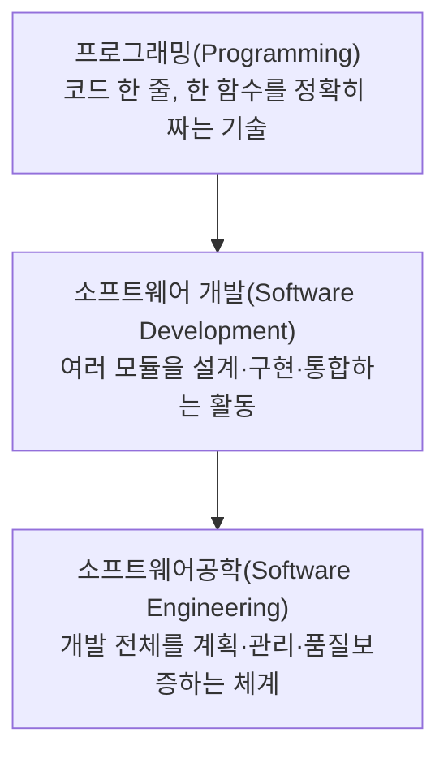

<Callout type="info">
  **이번 문서의 목표:** 소프트웨어공학이 무엇을 다루는 학문인지 정의하고, 독학사 3단계 시험이 그 정의의 어느 지점을 묻는지 구분하며, 이후 편들에서 반복해 등장할 "생명주기·산출물" 구조를 미리 그릴 수 있게 한다.
</Callout>

## 왜 "소프트웨어공학"이라는 이름이 붙었는가

1960년대 후반, 컴퓨터 하드웨어의 성능은 빠르게 좋아지는데 소프트웨어는 정해진 기간과 예산 안에 완성되지 못하고, 완성되어도 오류가 잦은 일이 반복됐다. 이 현상을 업계에서는 **소프트웨어 위기**(Software Crisis)라고 불렀다. 원인은 프로그램 하나를 짜는 일과, 수백 명이 몇 년에 걸쳐 만드는 대규모 시스템을 짜는 일이 근본적으로 다른 활동인데도, 후자를 여전히 개인의 코딩 감각에만 맡겼기 때문이었다.

이 문제를 풀기 위해 1968년 NATO 회의에서 "소프트웨어 개발에도 토목·기계 공학처럼 검증된 원리와 체계적인 절차를 적용하자"는 제안이 나왔고, 여기서 **소프트웨어공학**(Software Engineering, SE)이라는 용어가 처음 쓰였다. 이름 자체가 이미 정의를 담고 있다. "소프트웨어"에 "공학(Engineering, 과학적 원리를 실제 문제 해결에 체계적으로 적용하는 활동)"을 붙인 것이다.

> **쉽게 말하면:** 소프트웨어공학은 "코드를 잘 짜는 기술"이 아니라 "정해진 비용과 기간 안에, 요구사항을 만족하는 품질 좋은 소프트웨어를 체계적으로 만들고 유지하는 방법을 다루는 학문"이다.

### 정의를 구성하는 세 요소

IEEE(전기전자공학자협회, Institute of Electrical and Electronics Engineers — 컴퓨터·전자 분야의 국제 표준을 제정하는 대표 기관)의 표준 용어집(IEEE Std 610.12)은 소프트웨어공학을 대략 다음과 같이 정의한다.

> 소프트웨어의 개발·운영·유지보수에 체계적이고, 훈련되고, 정량화할 수 있는 접근을 적용하는 것 — 즉 소프트웨어에 공학을 적용하는 것.

이 정의를 쪼개면 시험에서 반복해 묻는 세 가지 축이 나온다.

| 축 | 의미 | 대비되는 것 |
|---|---|---|
| 체계적(Systematic) | 정해진 절차와 단계를 따른다 | 개인의 감(ad-hoc, 즉흥적 방식) |
| 훈련된(Disciplined) | 검토·표준·규약을 지킨다 | 자유방임적 코딩 |
| 정량화할 수 있는(Quantifiable) | 품질·진척을 숫자(메트릭)로 측정한다 | 감으로 판단 |

세 축 모두 "혼자 짜는 프로그램"이 아니라 "여러 사람이 오래 유지해야 하는 소프트웨어"를 전제로 한다. 그래서 소프트웨어공학의 대상은 코드 한 줄이 아니라 **개발부터 폐기까지의 전체 과정**이다.

## 프로그래밍과 소프트웨어공학의 경계

독학사 시험에서 자주 나오는 "옳지 않은 것 고르기" 유형은 이 경계를 흐려서 낸다. 예를 들어 "소프트웨어공학은 좋은 알고리즘을 짜는 기법이다"라는 진술은 **틀린 진술**이다. 알고리즘 설계는 자료구조·알고리즘 과목의 영역이고, 소프트웨어공학은 그 알고리즘이 담긴 소프트웨어를 어떤 절차로 요구분석하고, 설계하고, 테스트하고, 유지보수할지를 다룬다.

구분을 명확히 하기 위해 세 층위로 나눠 보자.

프로그래밍은 소프트웨어 개발에 포함되고, 소프트웨어 개발은 다시 소프트웨어공학이 제시하는 절차와 원칙 안에서 이루어진다. 즉 소프트웨어공학이 가장 큰 우산이고, 그 아래에 요구공학·설계·구현·테스트·유지보수·프로젝트관리 같은 하위 활동들이 들어간다.

## 독학사 3단계 시험이 묻는 범위 해석하기

독학사 3단계 소프트웨어공학은 국가평생교육진흥원의 출제기준(평가영역)을 따른다. 출제기준은 매 회차 공고에서 세부 문구가 조정될 수 있으므로, "정확한 문항 수·배점"은 **공고 확인이 필요**하다는 점을 전제로 두되, 큰 틀에서 이 시험이 다루는 영역은 국제적으로 통용되는 소프트웨어공학 지식체계인 **SWEBOK**(Software Engineering Body of Knowledge, 소프트웨어공학 지식체계 안내서)의 분류와 대체로 겹친다.

SWEBOK은 IEEE 컴퓨터 소사이어티가 정리한 문서로, 소프트웨어공학을 다음과 같은 지식 영역(Knowledge Area, KA)으로 나눈다.

| 지식 영역 | 이 시리즈에서 다루는 편 |
|---|---|
| 요구공학(Requirements Engineering) | 06–07편 |
| 소프트웨어 설계(Software Design) | 08–11편 |
| 소프트웨어 구현(Software Construction) | 12편 |
| 소프트웨어 테스팅(Software Testing) | 13–15편 |
| 소프트웨어 유지보수(Software Maintenance) | 16편 |
| 형상관리(Software Configuration Management) | 17편 |
| 품질(Software Quality) | 18편 |
| 프로젝트 관리(Software Engineering Management) | 19–20편 |

이 지식 영역 분류는 이후 05편부터 본론을 읽을 때 "지금 다루는 주제가 SWEBOK의 어느 영역에 속하는가"를 스스로 확인하는 지도 역할을 한다. 처음부터 이 표를 외울 필요는 없다 — 읽다가 헷갈릴 때 돌아와 확인하면 된다.

## 소프트웨어의 특성이 만드는 공학적 어려움

왜 소프트웨어를 "공학적으로" 다뤄야만 하는지 이해하려면, 소프트웨어가 하드웨어와 다른 세 가지 특성을 알아야 한다.

**첫째, 소프트웨어는 마모되지 않는다.** 하드웨어는 사용할수록 부품이 닳아 고장률이 올라가지만(마모 고장), 소프트웨어는 물리적으로 닳지 않는다. 대신 시간이 지나며 주변 환경(운영체제, 하드웨어, 법 규정, 사용자 요구)이 바뀌는데 소프트웨어가 그 변화를 따라가지 못해 결함이 드러나는 방식으로 "노후화"된다. 그래서 소프트웨어의 고장률 곡선은 하드웨어의 욕조 모양(초기 고장 → 안정기 → 마모 고장) 대신, 변경이 있을 때마다 고장률이 다시 튀는 톱니 모양에 가깝다.

**둘째, 소프트웨어는 대부분 주문 제작되고 복제 비용이 0에 가깝다.** 하드웨어는 표준 부품을 조립해 재사용률이 높지만, 소프트웨어는 프로젝트마다 다시 만드는 비중이 커서 재사용(Reuse)이 상대적으로 어렵다(21편에서 더 다룬다). 반면 한번 만든 소프트웨어를 복사해 배포하는 비용은 거의 들지 않는다.

**셋째, 소프트웨어는 눈에 보이지 않는다.** 다리나 건물은 진행 상황을 눈으로 확인할 수 있지만, 소프트웨어는 완성되기 전까지 진척도를 가늠하기 어렵다. 이 "비가시성(invisibility)"이 프로젝트 관리(19~20편)를 특히 어렵게 만드는 근본 원인이다.

> **비유로 이해하기:** 건물을 지을 때는 골조가 올라가는 것을 보고 진행률을 짐작할 수 있지만, 소프트웨어는 "코드를 80퍼센트 짰다"는 말이 "기능이 80퍼센트 된다"는 뜻이 아닐 수 있다. 마지막 20퍼센트에 가장 까다로운 예외 처리와 통합이 몰려 있는 경우가 흔하기 때문이다.

## 생명주기와 산출물이라는 두 축

이후 모든 편은 사실 하나의 질문으로 정리된다 — "**소프트웨어가 태어나서 사라질 때까지 어떤 단계를 거치고, 각 단계에서 무엇을(어떤 문서·코드·결과물을) 남기는가**"이다. 이 질문의 답을 이루는 두 개념을 미리 정의해 둔다.

**소프트웨어 생명주기**(Software Life Cycle)는 소프트웨어가 처음 기획되어 개발되고, 사용되다가, 결국 폐기되기까지 거치는 전체 기간과 그 안의 단계들을 말한다. 생명주기를 어떤 순서·반복 구조로 배열할지에 대한 틀을 **프로세스 모델**(Process Model)이라고 부르는데, 이는 02편에서 본격적으로 다룬다.

**산출물**(Artifact, 또는 Deliverable)은 각 단계가 끝날 때 만들어져 다음 단계로 넘어가는 결과물이다. 예를 들어 요구분석 단계의 산출물은 요구사항 명세서(SRS)이고, 설계 단계의 산출물은 설계 문서와 다이어그램이다. 산출물은 단순한 "부산물"이 아니라, 다음 단계 작업자가 이전 단계의 결정을 이해하고 검증하기 위한 **공식 근거**다.

생명주기 단계 이름과 산출물의 짝을 정확히 외우는 것은 시험에서 매우 자주 나오는 유형이다. 예를 들어 "요구분석 단계의 대표 산출물은?"이라는 문제에서 "소스코드"를 고르면 틀린다 — 소스코드는 구현 단계의 산출물이다. 이런 짝짓기 감각은 02편에서 단계별로 더 세밀하게 다진다.

### 왜 산출물을 문서로 남기는가

"코드가 곧 문서 아닌가"라는 의문이 들 수 있다. 코드는 "어떻게(How)" 동작하는지는 보여주지만 "왜(Why)" 그렇게 설계했는지는 설명하지 못한다. 예를 들어 코드만 보고는 "왜 이 모듈을 분리했는지", "왜 이 자료구조를 선택했는지"를 알기 어렵다. 산출물 문서는 이런 의사결정의 근거를 남겨, 이후 유지보수 담당자나 심사자가 그 결정을 검증하고 재사용할 수 있게 한다. 대규모 프로젝트일수록, 그리고 개발자가 자주 바뀌는 팀일수록 이 문서화의 가치가 커진다.

## 자주 틀리는 점

- **소프트웨어공학 = 프로그래밍 잘하는 법**이라고 오해하기 쉽다. 소프트웨어공학은 프로그래밍을 포함하는 더 큰 활동(계획·분석·설계·검증·관리)을 다룬다.
- 소프트웨어의 "노후화"를 하드웨어처럼 물리적 마모로 설명하는 보기가 나오면 틀린 진술이다. 소프트웨어는 마모가 아니라 주변 환경 변화에 대한 적응 실패로 결함이 드러난다.
- 산출물을 단계와 반대로 짝짓는 함정(예: "설계 단계의 산출물은 소스코드다")에 주의한다.
- SWEBOK은 "국제 표준 시험 규정"이 아니라 지식체계를 정리한 안내서(Guide)다. 법적 강제력이 있는 규격이 아니라는 점에 유의한다.

## 핵심 정리

- 소프트웨어공학은 소프트웨어의 개발·운영·유지보수에 체계적·훈련된·정량화 가능한 접근을 적용하는 학문이며, 프로그래밍보다 넓은 개념이다.
- 소프트웨어 위기가 소프트웨어공학이라는 용어와 학문이 등장한 배경이다.
- 소프트웨어는 마모되지 않고, 복제 비용이 낮으며, 눈에 보이지 않는다는 특성 때문에 별도의 공학적 관리가 필요하다.
- 독학사 3단계는 SWEBOK 계열의 지식 영역(요구공학·설계·구현·테스트·유지보수·형상관리·품질·관리)을 기준으로 출제 범위를 가늠할 수 있으며, 정확한 문항 수·배점은 회차 공고 확인이 필요하다.
- 생명주기(단계의 흐름)와 산출물(단계별 결과물)의 짝짓기는 이후 모든 편의 기본 틀이 된다.

## 마무리 복습

<Quiz
  questionNumber={1}
  question="소프트웨어공학의 정의로 가장 적절한 것은?"
  options={['좋은 알고리즘을 설계하는 기법', '소프트웨어의 개발과 운영, 유지보수에 체계적이고 정량화 가능한 접근을 적용하는 것', '특정 프로그래밍 언어의 문법을 정확히 사용하는 기술', '하드웨어 성능을 최대로 끌어내는 코드 최적화 기법']}
  correctAnswer={2}
  explanation="IEEE 표준 용어집은 소프트웨어공학을 소프트웨어의 개발, 운영, 유지보수에 체계적이고 훈련되고 정량화할 수 있는 접근을 적용하는 것으로 정의한다."
  optionExplanations={['알고리즘 설계는 자료구조·알고리즘 과목의 영역이며 소프트웨어공학의 정의 자체는 아니다', '정답이다', '문법 사용은 프로그래밍의 영역이지 소프트웨어공학 전체를 정의하지 않는다', '성능 최적화는 구현 단계의 세부 활동일 뿐 정의가 아니다']}
/>

<Quiz
  questionNumber={2}
  question="소프트웨어공학이라는 용어가 처음 제안된 계기로 옳은 것은?"
  options={['1968년 NATO 회의에서 소프트웨어 위기를 해결하기 위해 제안되었다', 'IBM이 상업적 마케팅 용어로 처음 만들었다', '자료구조 교과서에서 처음 정의되었다', '최근 애자일 방법론과 함께 새로 등장한 용어다']}
  correctAnswer={1}
  explanation="소프트웨어공학은 소프트웨어 위기를 배경으로 1968년 NATO 회의에서 처음 제안된 용어다."
  optionExplanations={['정답이다', 'NATO 회의가 계기였으며 특정 기업의 마케팅 용어가 아니다', '자료구조 교과서와는 무관한 별개 학문 분야에서 등장했다', '애자일보다 훨씬 이전인 1968년에 이미 제안된 용어다']}
/>

<Quiz
  questionNumber={3}
  question="소프트웨어가 하드웨어와 구별되는 특성으로 옳지 않은 것은?"
  options={['물리적으로 마모되지 않는다', '복제(배포) 비용이 상대적으로 매우 낮다', '진행 상황을 눈으로 확인하기 어려운 비가시성을 가진다', '사용 시간이 늘어날수록 물리적 부품처럼 고장률이 꾸준히 증가한다']}
  correctAnswer={4}
  explanation="소프트웨어는 물리적 부품이 없으므로 사용 시간에 따라 마모되어 고장률이 오르지 않는다. 대신 환경 변화에 적응하지 못해 결함이 드러난다."
  optionExplanations={['옳은 설명이므로 정답이 아니다', '옳은 설명이므로 정답이 아니다', '옳은 설명이므로 정답이 아니다', '소프트웨어는 물리적 마모 개념이 없어 옳지 않은 설명이며 이것이 정답이다']}
/>

<Quiz
  questionNumber={4}
  question="다음 중 소프트웨어공학이 다루는 지식 영역(SWEBOK 기준)에 해당하지 않는 것은?"
  options={['요구공학', '소프트웨어 설계', 'CPU 명령어 파이프라인 구조 설계', '소프트웨어 유지보수']}
  correctAnswer={3}
  explanation="CPU 명령어 파이프라인 구조는 컴퓨터구조 과목의 영역이며 SWEBOK의 소프트웨어공학 지식 영역에 포함되지 않는다."
  optionExplanations={['SWEBOK의 지식 영역에 해당하므로 정답이 아니다', 'SWEBOK의 지식 영역에 해당하므로 정답이 아니다', '하드웨어 구조 설계로 소프트웨어공학의 지식 영역이 아니며 이것이 정답이다', 'SWEBOK의 지식 영역에 해당하므로 정답이 아니다']}
/>

<Quiz
  questionNumber={5}
  question="요구분석 단계의 대표적인 산출물로 가장 적절한 것은?"
  options={['소스코드', '요구사항 명세서(SRS)', '테스트 결과 보고서', '배포용 설치 파일']}
  correctAnswer={2}
  explanation="요구분석 단계의 대표 산출물은 요구사항 명세서(Software Requirements Specification, SRS)이며, 이후 설계 단계의 입력으로 사용된다."
  optionExplanations={['소스코드는 구현 단계의 산출물이다', '정답이다', '테스트 결과 보고서는 테스트 단계의 산출물이다', '설치 파일은 구현 이후 배포 단계와 관련된다']}
/>

<Quiz
  questionNumber={6}
  question="독학사 3단계 소프트웨어공학의 출제 범위를 가늠하는 방법에 대한 설명으로 옳은 것은?"
  options={['SWEBOK 계열의 지식 영역 분류를 참고하되 정확한 문항 수와 배점은 회차 공고를 확인해야 한다', '매 회차 문항 수와 배점이 법으로 고정되어 있어 공고를 확인할 필요가 없다', 'SWEBOK은 국가평생교육진흥원이 만든 시험 공식 규격이다', '출제 범위는 특정 상용 CASE 툴의 사용법에 한정된다']}
  correctAnswer={1}
  explanation="정확한 문항 수·배점·세부 공고 사항은 회차마다 다를 수 있어 확인이 필요하며, 큰 틀의 범위는 SWEBOK과 같은 국제적으로 통용되는 지식체계 분류를 참고할 수 있다."
  optionExplanations={['정답이다', '문항 수·배점은 공고마다 달라질 수 있으므로 옳지 않다', 'SWEBOK은 IEEE 컴퓨터 소사이어티가 정리한 지식체계 안내서이지 국가평생교육진흥원의 공식 규격이 아니다', '출제 범위는 개념·원리 중심이며 특정 상용 툴 실습에 한정되지 않는다']}
/>

## 참고 자료

- [국가평생교육진흥원 독학학위제 시험안내](https://bdes.nile.or.kr/nile/exam/nExam2_1.do)
- [국가평생교육진흥원 독학학위제 제도 활용](https://bdes.nile.or.kr/nile/about/nAbout3_1.do)
