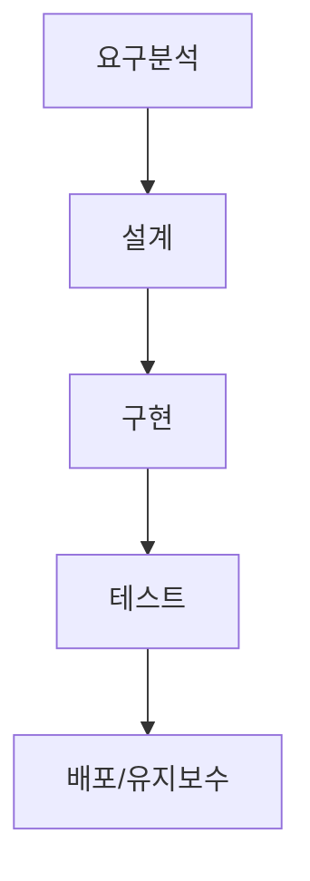
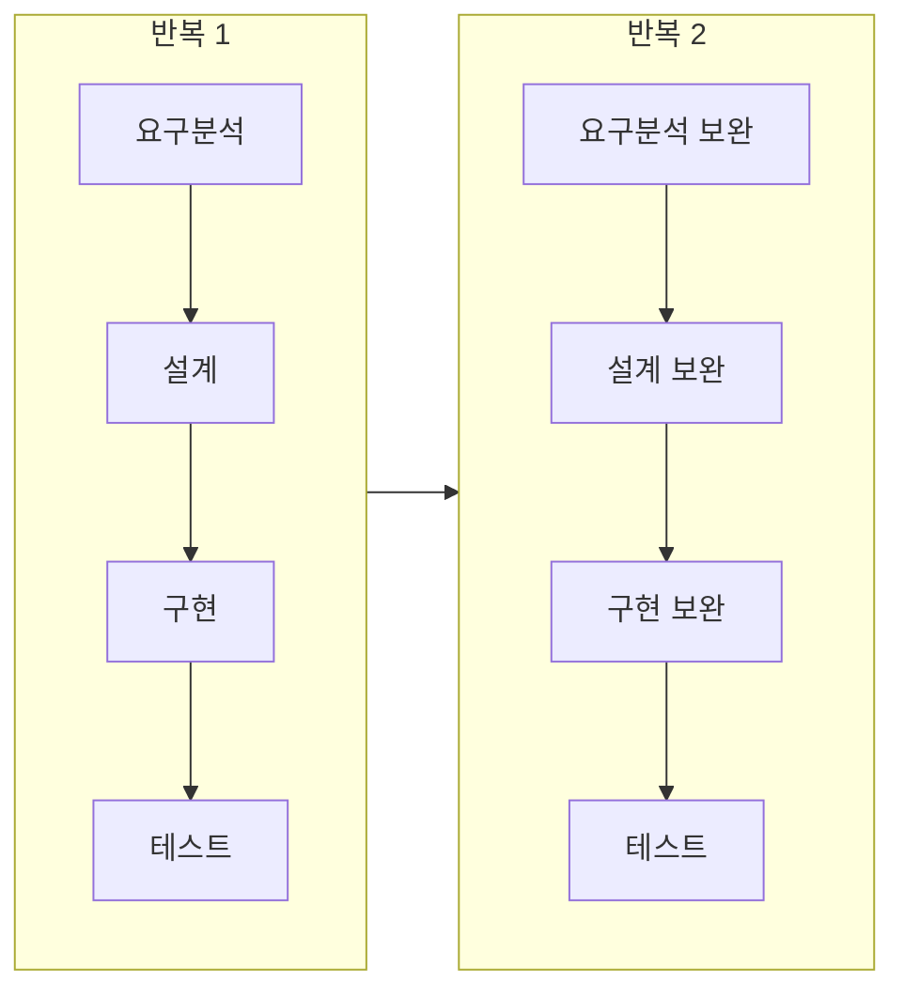
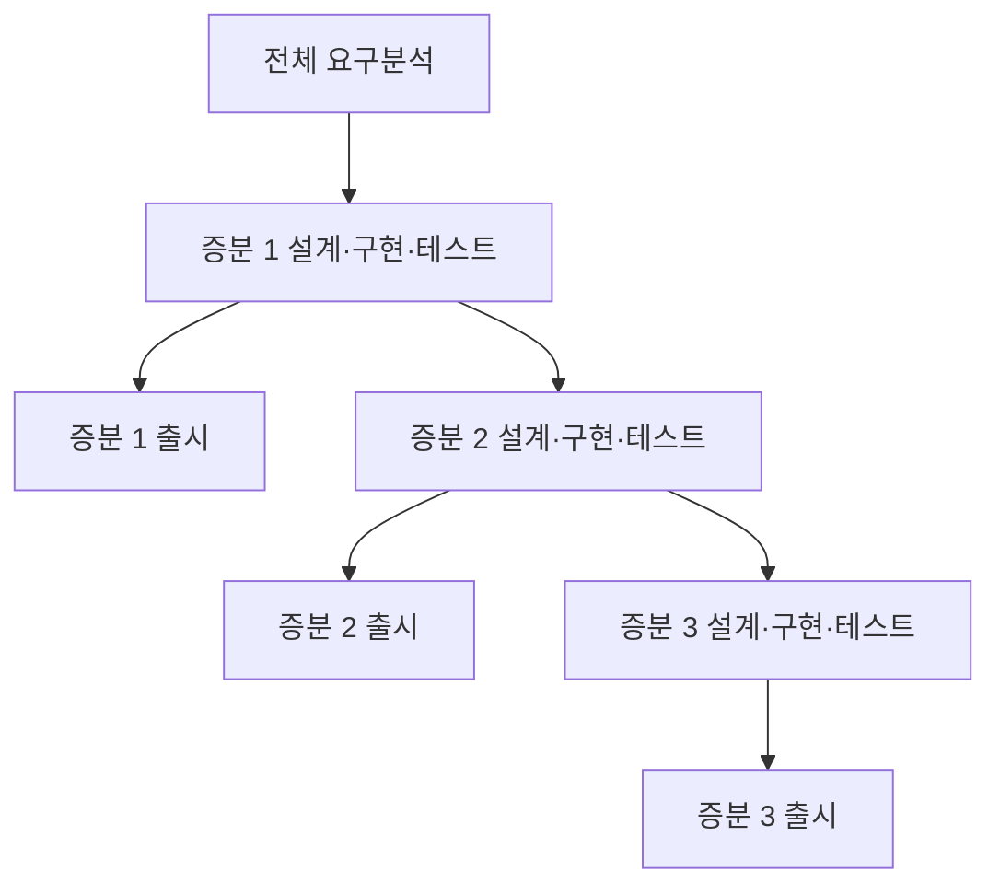
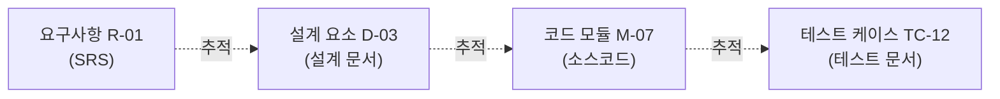

<Callout type="info">
  **이번 문서의 목표:** 소프트웨어 개발 생명주기의 표준 단계 이름과 각 단계의 목적을 정확히 구분하고, 그 단계들이 폭포수형·반복형·점증형으로 배열될 때 흐름이 어떻게 달라지는지 읽을 수 있게 한다.
</Callout>

## 생명주기 단계는 왜 "이름"부터 정확해야 하는가

01편에서 소프트웨어공학은 생명주기(단계의 흐름)와 산출물(단계별 결과물)이라는 두 축으로 정리된다고 했다. 이번 편은 그 첫 번째 축, 즉 **단계 자체의 이름과 목적**을 정확히 세우는 데 집중한다.

독학사 시험에서는 "다음 중 설계 단계에서 수행하는 활동은?"처럼 단계 이름과 활동을 짝짓는 문제가 자주 나온다. 이런 문제를 풀려면 단계 이름을 그냥 순서대로 외우는 것이 아니라, "각 단계가 **무엇을 입력받아 무엇으로 바꾸는가**"를 이해해야 오답을 걸러낼 수 있다.

> **쉽게 말하면:** 생명주기 단계는 공장의 조립 라인과 비슷하다. 각 라인(단계)은 앞 라인에서 넘어온 것(입력)을 받아 정해진 작업만 하고, 다음 라인이 쓸 수 있는 형태(산출물)로 넘긴다.

## 표준 생명주기 단계 정리

소프트웨어공학에서 공통으로 인정하는 생명주기 단계는 대체로 다음 여섯 가지로 정리된다. 실제 프로세스 모델(폭포수·나선형 등)마다 이름이 조금씩 다르게 불리기도 하지만, 핵심 활동은 이 여섯 단계 중 하나에 대응한다.

| 단계 | 핵심 질문 | 입력 | 산출물 |
|---|---|---|---|
| 요구분석(Requirements Analysis) | 무엇을 만들 것인가 | 고객·이해관계자의 요구 | 요구사항 명세서(SRS) |
| 설계(Design) | 어떻게 구조를 짤 것인가 | SRS | 설계 문서, 다이어그램 |
| 구현(Implementation, Coding) | 어떻게 코드로 옮길 것인가 | 설계 문서 | 소스코드 |
| 테스트(Testing) | 제대로 만들었는가 | 소스코드 | 테스트 결과 보고서, 결함 목록 |
| 배포(Deployment) | 사용자에게 어떻게 전달할 것인가 | 검증된 소프트웨어 | 설치본, 배포 문서 |
| 유지보수(Maintenance) | 운영 중 어떻게 개선·수정할 것인가 | 운영 중 발생한 요청·결함 | 변경 이력, 패치 |

이 표에서 시험이 노리는 함정은 두 가지다. 첫째는 산출물을 옆 단계 것으로 바꿔치기하는 함정("요구분석의 산출물은 소스코드다" 같은 오답), 둘째는 활동을 옆 단계로 옮기는 함정("설계 단계에서 코드를 작성한다" 같은 오답)이다. 각 단계의 "핵심 질문"을 기준으로 삼으면 이런 함정에 흔들리지 않는다 — 예를 들어 "어떻게 코드로 옮길 것인가"라는 질문에 답하는 활동은 구현 단계이지 설계 단계가 아니다.

### 검증(Verification)과 확인(Validation)을 미리 구분해 두기

테스트 단계를 이해하려면 두 용어를 먼저 구분해야 한다. 이 구분은 03편에서 더 자세히 다루지만, 생명주기를 읽는 데 바로 필요하므로 여기서 짧게 짚는다.

- **검증(Verification)**: "제품을 올바르게 만들고 있는가(Are we building the product right)?" — 각 단계의 산출물이 이전 단계의 명세를 제대로 따랐는지 확인하는 것.
- **확인(Validation)**: "올바른 제품을 만들고 있는가(Are we building the right product)?" — 완성된(또는 부분 완성된) 소프트웨어가 실제 사용자의 요구를 충족하는지 확인하는 것.

> **비유로 이해하기:** 설계도대로 집을 정확히 지었는지 확인하는 것이 검증이고, 그렇게 지은 집이 애초에 의뢰인이 살고 싶어 했던 집이 맞는지 확인하는 것이 확인이다. 설계도를 완벽히 따랐어도(검증 통과) 의뢰인이 원한 집이 아닐 수 있다(확인 실패).

## 생명주기를 배열하는 방식 — 프로세스 모델

생명주기의 여섯 단계 자체는 어떤 프로젝트에서든 크게 다르지 않다. 프로젝트마다 달라지는 것은 이 단계들을 **어떤 순서와 반복 구조로 배열하는가**이며, 이 배열 방식을 프로세스 모델이라고 부른다(05편에서 각 모델의 장단점을 깊이 비교한다). 이번 편에서는 세 가지 대표 흐름의 "읽는 법"만 먼저 잡는다.

### 폭포수형 흐름

폭포수(Waterfall)형은 이름 그대로 물이 위에서 아래로만 흐르듯, 한 단계가 완전히 끝나야 다음 단계로 넘어간다. 이전 단계로 되돌아가는 것을 전제하지 않는다(현실에서는 제한적으로 되돌아가지만, 모델 자체는 순차 진행을 기본 가정으로 삼는다). 이 흐름을 읽을 때 핵심은 "각 단계의 산출물이 완성되어야 다음 화살표가 그려진다"는 점이다.

### 반복형 흐름

반복(Iterative)형은 여섯 단계를 한 번에 끝까지 가는 대신, 작은 묶음(반복, Iteration)으로 여러 번 반복한다. 각 반복이 끝날 때마다 이전 반복에서 얻은 피드백을 다음 반복의 요구분석에 다시 반영한다. 화살표를 읽을 때 "한 방향으로만 흐르는 폭포수"와 달리 "묶음이 여러 번 되풀이되며 앞 단계로 정보가 되먹임(피드백)된다"는 점을 주목해야 한다.

### 점증형 흐름

점증(Incremental)형은 전체 요구사항을 먼저 크게 파악한 뒤, 기능을 여러 조각(증분, Increment)으로 나눠 하나씩 완성해 출시한다. 반복형과 혼동하기 쉬운데, 차이는 **무엇이 반복되는가**에 있다. 반복형은 같은 기능 범위를 여러 번 다듬어 완성도를 높이는 데 초점이 있고, 점증형은 기능 범위 자체를 조각내 순서대로 늘려가는 데 초점이 있다. 실제로는 두 방식을 섞어 쓰는 경우가 많지만(반복적·점증적 개발), 시험에서는 개념 정의 차이를 명확히 구분해서 묻는다.

| 구분 | 반복형(Iterative) | 점증형(Incremental) |
|---|---|---|
| 초점 | 같은 범위를 여러 번 다듬어 완성도를 높임 | 기능 범위를 조각내 순서대로 늘림 |
| 매 주기 결과 | 이전보다 더 정교해진 전체 버전 | 이전 버전에 새 기능이 추가된 버전 |
| 비유 | 그림을 스케치 → 색칠 → 세부 묘사 순으로 다듬는 것 | 건물을 1층부터 완공해 순서대로 늘려 짓는 것 |

## 단계 간 산출물이 "연결"된다는 것의 의미

생명주기를 그림으로만 외우면 "산출물 연결"이라는 표현이 추상적으로 느껴질 수 있다. 이를 구체적인 흐름으로 풀어보면, 앞 단계의 산출물은 다음 단계의 **입력이자 검증 기준**이 된다는 뜻이다.

예를 들어 설계 단계는 요구분석 단계가 남긴 SRS를 입력으로 받아 설계 문서를 만든다. 이때 설계자는 SRS에 적힌 요구사항 하나하나가 설계 문서의 어느 구성 요소에서 다뤄지는지 대응시켜야 하는데, 이 대응 관계를 **추적성**(Traceability)이라고 부른다. 추적성이 끊기면(즉 SRS의 어떤 요구사항이 설계 문서 어디에도 반영되지 않으면) 그 요구사항은 구현되지 않은 채 넘어갈 위험이 커진다.

이 추적 사슬이 한 단계라도 끊기면, 나중에 결함이 발견됐을 때 "이 결함이 어느 요구사항과 관련 있는지" 역추적하기 어려워진다. 산출물을 문서로 남기고 다음 단계의 입력으로 명시적으로 넘기는 이유가 여기에 있다 — 코드만으로는 이 추적 관계를 유지하기 어렵기 때문이다.

## 자주 틀리는 점

- **"검증"과 "확인"을 반대로 외우는 실수**가 흔하다. "올바르게 만들었는가"는 검증(Verification), "올바른 것을 만들었는가"는 확인(Validation)이다. 영단어의 V로 시작하는 점은 같지만 뜻이 다르므로 문장으로 구분해서 외운다.
- 반복형과 점증형을 뒤바꿔 이해하는 경우가 많다. "범위를 나눈다"는 점증형, "같은 범위를 다듬는다"는 반복형이다.
- 폭포수형이 "절대 앞 단계로 돌아가지 않는다"고 단정적으로 암기하면, "폭포수 모델도 현실에서는 제한적 피드백을 허용한다"는 보기에서 혼란을 겪을 수 있다. 모델의 **기본 가정**은 순차 진행이지만, 완전히 되돌아갈 수 없다는 절대적 규칙은 아니라는 점에 유의한다(자세한 장단점은 05편에서 다룬다).
- 산출물 표를 외울 때 "배포"와 "유지보수"를 하나로 뭉뚱그리기 쉬운데, 배포는 완성된 소프트웨어를 사용자 환경에 전달하는 활동이고 유지보수는 그 이후 운영 중 발생하는 변경 활동이다.

## 핵심 정리

- 생명주기의 표준 단계는 요구분석 → 설계 → 구현 → 테스트 → 배포 → 유지보수이며, 각 단계는 고유한 핵심 질문과 산출물을 가진다.
- 검증(Verification)은 "올바르게 만들었는가", 확인(Validation)은 "올바른 것을 만들었는가"를 묻는다.
- 폭포수형은 순차 진행, 반복형은 같은 범위를 여러 번 다듬는 것, 점증형은 기능 범위를 조각내 순서대로 늘리는 것이다.
- 단계 간 산출물은 추적성을 통해 서로 연결되며, 추적 사슬이 끊기면 요구사항 누락이나 결함 역추적 실패로 이어진다.

## 마무리 복습

<Quiz
  questionNumber={1}
  question="다음 중 설계 단계의 대표 산출물로 가장 적절한 것은?"
  options={['요구사항 명세서(SRS)', '설계 문서 및 다이어그램', '테스트 결과 보고서', '설치용 배포 파일']}
  correctAnswer={2}
  explanation="설계 단계는 SRS를 입력으로 받아 설계 문서와 다이어그램을 산출물로 만든다."
  optionExplanations={['SRS는 요구분석 단계의 산출물이며 설계 단계의 입력이다', '정답이다', '테스트 결과 보고서는 테스트 단계의 산출물이다', '배포 파일은 배포 단계와 관련된다']}
/>

<Quiz
  questionNumber={2}
  question="검증(Verification)과 확인(Validation)에 대한 설명으로 옳은 것은?"
  options={['검증은 올바른 제품을 만들고 있는가를, 확인은 올바르게 만들고 있는가를 묻는다', '검증은 올바르게 만들고 있는가를, 확인은 올바른 제품을 만들고 있는가를 묻는다', '검증과 확인은 완전히 같은 개념으로 시험에서 구분하지 않는다', '검증은 유지보수 단계에서만, 확인은 요구분석 단계에서만 수행한다']}
  correctAnswer={2}
  explanation="검증은 산출물이 이전 단계의 명세를 올바르게 따랐는지, 확인은 완성된 소프트웨어가 실제 사용자 요구를 충족하는지를 묻는다."
  optionExplanations={['검증과 확인의 정의가 서로 바뀌었다', '정답이다', '두 개념은 명확히 구분되는 서로 다른 활동이다', '두 활동 모두 여러 단계에서 함께 수행될 수 있으며 특정 단계에만 한정되지 않는다']}
/>

<Quiz
  questionNumber={3}
  question="반복형(Iterative) 개발과 점증형(Incremental) 개발의 차이에 대한 설명으로 옳은 것은?"
  options={['반복형은 기능 범위를 조각내 늘려가고, 점증형은 같은 범위를 여러 번 다듬는다', '반복형은 같은 범위를 여러 번 다듬어 완성도를 높이고, 점증형은 기능 범위를 조각내 순서대로 늘린다', '두 방식은 완전히 동일한 개념이며 이름만 다르다', '반복형과 점증형 모두 폭포수 모델의 다른 이름일 뿐이다']}
  correctAnswer={2}
  explanation="반복형은 같은 기능 범위를 여러 주기에 걸쳐 다듬어 완성도를 높이는 데 초점이 있고, 점증형은 기능 범위 자체를 조각내 순서대로 늘려가는 데 초점이 있다."
  optionExplanations={['반복형과 점증형의 정의가 서로 바뀌었다', '정답이다', '두 개념은 초점이 명확히 다르다', '반복형·점증형은 폭포수 모델과 구분되는 별개의 흐름이다']}
/>

<Quiz
  questionNumber={4}
  question="요구사항 R-01이 설계 문서, 코드, 테스트 케이스로 이어지는 대응 관계가 끊겼을 때 가장 크게 우려되는 문제는?"
  options={['소스코드의 실행 속도가 느려진다', '해당 요구사항이 구현되지 않거나 결함 발생 시 역추적이 어려워진다', '설계 문서의 글꼴이 통일되지 않는다', '테스트 단계의 소요 시간이 줄어든다']}
  correctAnswer={2}
  explanation="추적성이 끊기면 요구사항이 실제로 구현되었는지 확인하기 어렵고, 결함이 발견되었을 때 어느 요구사항과 관련 있는지 역추적하기 어려워진다."
  optionExplanations={['추적성 단절은 실행 속도와 직접 관련이 없다', '정답이다', '문서 서식은 추적성 문제와 무관하다', '추적성 단절이 테스트 소요 시간을 줄여준다는 근거는 없으며 오히려 문제를 늘린다']}
/>

<Quiz
  questionNumber={5}
  question="폭포수형 프로세스 모델의 기본 흐름에 대한 설명으로 옳지 않은 것은?"
  options={['한 단계가 완전히 끝나야 다음 단계로 넘어가는 것을 기본 가정으로 한다', '단계의 순서는 요구분석부터 유지보수까지 순차적으로 진행된다', '작은 반복 주기로 기능을 나누어 여러 번 배포하는 것을 기본 구조로 삼는다', '각 단계의 산출물이 완성되어야 다음 화살표로 넘어가는 흐름으로 읽는다']}
  correctAnswer={3}
  explanation="여러 번 나누어 배포하는 구조는 반복형·점증형 모델의 특징이며, 폭포수형은 순차적으로 한 번에 끝까지 진행하는 것을 기본 가정으로 한다."
  optionExplanations={['옳은 설명이므로 정답이 아니다', '옳은 설명이므로 정답이 아니다', '폭포수형이 아니라 반복형·점증형의 특징이며 이것이 정답이다', '옳은 설명이므로 정답이 아니다']}
/>

<Quiz
  questionNumber={6}
  question="생명주기 단계 중 '운영 중 발생한 요청과 결함'을 입력으로 받아 '변경 이력과 패치'를 산출물로 만드는 단계는?"
  options={['요구분석', '구현', '테스트', '유지보수']}
  correctAnswer={4}
  explanation="유지보수 단계는 운영 중 발생한 요청·결함을 입력으로 받아 변경 이력과 패치를 산출물로 만든다."
  optionExplanations={['요구분석은 고객·이해관계자의 요구를 입력으로 받는다', '구현은 설계 문서를 입력으로 받는다', '테스트는 소스코드를 입력으로 받는다', '정답이다']}
/>

## 참고 자료

- [국가평생교육진흥원 독학학위제 시험안내](https://bdes.nile.or.kr/nile/exam/nExam2_1.do)
- [국가평생교육진흥원 독학학위제 제도 활용](https://bdes.nile.or.kr/nile/about/nAbout3_1.do)
