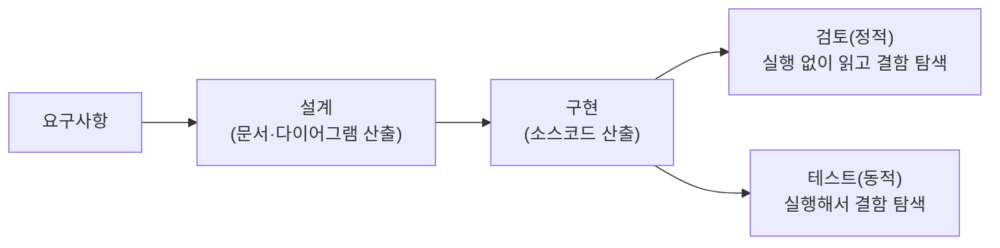
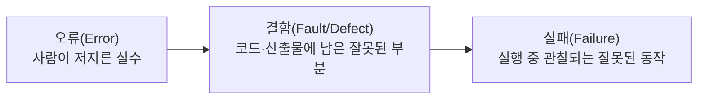
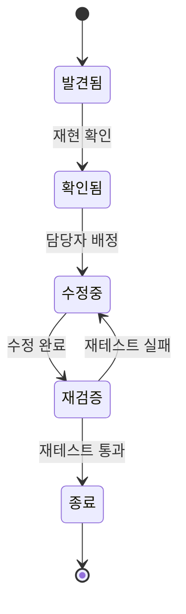

<Callout type="info">
  **이번 문서의 목표:** 소프트웨어공학 전 편에서 반복 등장하는 핵심 용어들을 뜻이 겹쳐 보이는 것끼리 묶어 비교하고, 시험이 즐겨 쓰는 "짝지어진 설명 중 틀린 것 고르기" 유형에 대비한다.
</Callout>

## 왜 용어 지도가 따로 필요한가

소프트웨어공학은 일상어와 비슷하게 생긴 전문 용어가 많다. "요구사항"과 "요구", "결함"과 "오류"와 "실패", "검증"과 "확인"처럼 한국어로 옮기면 뜻이 겹쳐 보이는 단어들이 실제로는 서로 다른 대상을 가리킨다. 독학사 시험은 이 미세한 차이를 정확히 아는지를 즐겨 묻는다 — "설명이 맞게 짝지어진 것"이나 "옳지 않은 것" 유형이 대표적이다.

이번 편은 새로운 개념을 배우는 편이 아니라, 앞으로 반복해서 쓸 용어들을 미리 정확한 경계로 나눠 두는 **지도**(map)다. 각 용어 쌍은 나중에 본론 편(06편 이후)에서 다시 등장할 때 "3편에서 정리한 그 구분"이라고 되짚을 수 있게 간단히 표시해 둔다.

## 1. 요구사항 계열 — 요구·요구사항·명세

| 용어 | 뜻 | 형태 |
|---|---|---|
| 요구(Need) | 이해관계자가 막연히 느끼는 문제의식이나 바람 | 구두 표현, 비공식적 |
| 요구사항(Requirement) | 요구를 소프트웨어가 갖춰야 할 조건으로 구체화한 것 | 문장 단위 진술 |
| 명세(Specification) | 요구사항들을 체계적으로 정리해 문서화한 것(SRS) | 공식 문서 |

세 용어는 구체화의 단계가 다르다. "고객이 앱이 빨랐으면 좋겠다고 말했다"는 요구다. 이를 "검색 결과는 2초 이내에 표시되어야 한다"로 다듬으면 요구사항이 된다. 이런 요구사항들을 모아 우선순위·제약조건과 함께 문서로 정리한 것이 명세(SRS, Software Requirements Specification)다.

> **쉽게 말하면:** 요구는 "느낌", 요구사항은 "문장으로 만든 조건", 명세는 "그 조건들을 모은 공식 문서"다.

이 구분이 왜 중요한지는 06~07편(요구공학)에서 도출·분석·명세·검증의 각 단계와 직접 연결된다. 지금은 "구체화 정도의 차이"라는 축만 잡아두면 된다.

## 2. 검증·확인 계열 — 다시 정확히 굳히기

02편에서 짧게 다룬 검증(Verification)과 확인(Validation)을 이번에는 예시로 완전히 굳힌다.

- **검증(Verification)**: "제품을 올바르게(정해진 명세대로) 만들고 있는가?" — 이전 단계의 산출물과 대조한다.
- **확인(Validation)**: "올바른(실제 필요한) 제품을 만들고 있는가?" — 실제 사용 맥락·사용자 요구와 대조한다.

| 상황 | 검증 관점 판정 | 확인 관점 판정 |
|---|---|---|
| 설계서에 명시된 로그인 화면을 설계서 그대로 구현했다 | 통과(설계서를 정확히 따름) | 별개 문제(사용자가 원한 로그인 방식인지는 별도 확인 필요) |
| 로그인 화면이 설계서와 다르게 구현되었지만 사용자가 더 편리하다고 느낀다 | 실패(설계서를 따르지 않음) | 통과(실제 필요를 만족시킴) |

두 상황 모두 "검증 통과 = 확인 통과"가 아님을 보여준다. 검증은 문서 간 일치를, 확인은 실제 필요와의 일치를 본다는 점을 이 표로 확실히 구분해 둔다.

## 3. 설계·구현·검토 — 활동의 성격 차이

세 용어 모두 "무언가를 만드는 과정"에 속하지만, 다루는 대상과 산출물의 성격이 다르다.

- **설계(Design)**: 요구사항을 만족하는 구조(모듈 구성, 인터페이스, 알고리즘 개요)를 결정하는 활동. 산출물은 아직 실행되지 않는 문서·다이어그램이다.
- **구현(Implementation)**: 설계를 실제로 실행 가능한 코드로 옮기는 활동. 산출물은 실행 가능한 소스코드다.
- **검토(Review)**: 산출물(설계 문서든 코드든)을 실행하지 않고 사람이 읽으며 결함을 찾는 활동. 코드 리뷰, 설계 검토 등이 해당한다.

검토가 헷갈리기 쉬운 지점은 "테스트와 뭐가 다른가"이다. 테스트는 프로그램을 **실행**해서 실제 동작을 관찰하는 **동적(dynamic)** 활동이고, 검토는 프로그램을 실행하지 않고 **읽기만** 하는 **정적(static)** 활동이다. 이 구분은 13편(테스팅의 기초)에서 정적 검증 기법과 동적 검증 기법을 나눌 때 그대로 이어진다.

> **비유로 이해하기:** 검토는 다리 설계도를 전문가들이 모여 앉아 눈으로 검토하며 오류를 찾는 것이고, 테스트는 실제로 축소 모형에 하중을 가해 무너지는지 확인하는 것이다. 둘 다 결함을 찾는 목적은 같지만 방법(읽기 vs 실행)이 다르다.

## 4. 결함·오류·실패 — 시험에서 가장 자주 헷갈리는 삼총사

이 세 용어는 하나의 인과 사슬로 이해하면 절대 헷갈리지 않는다.

- **오류(Error, Mistake)**: 개발자가 요구사항을 잘못 이해하거나 코드를 잘못 작성하는 **사람의 실수** 자체를 가리킨다. 예: 개발자가 "이상이면"을 코드에서 `>=` 대신 `>`로 잘못 옮겨 적었다.
- **결함(Fault, Defect, 흔히 "버그"라고도 부름)**: 그 실수가 산출물(코드나 문서)에 남긴 **잘못된 상태**다. 예: 코드에 `>`로 잘못 적힌 그 줄 자체.
- **실패(Failure)**: 그 결함을 포함한 프로그램을 실행했을 때, 명세와 다르게 동작하는 것이 **관찰되는 사건**이다. 예: 경계값(정확히 그 값)을 입력했을 때 프로그램이 잘못된 결과를 출력하는 순간.

세 단어의 관계에서 중요한 것은 **결함이 있다고 항상 실패가 관찰되는 것은 아니다**라는 점이다. 결함이 있는 코드 경로를 아직 아무도 실행하지 않았다면 실패는 겉으로 드러나지 않는다. 그래서 "결함 없음"과 "실패 없음"은 다른 말이다 — 실패가 없다고 결함이 없다는 뜻은 아니며, 단지 그 결함을 드러낼 조건이 아직 발생하지 않았을 뿐일 수 있다.

| 용어 | 발생 위치 | 발견 방법 |
|---|---|---|
| 오류 | 사람의 사고 과정(머릿속) | 본인 회고, 코드 리뷰 중 추정 |
| 결함 | 산출물(코드·문서) | 코드 리뷰, 정적 분석 |
| 실패 | 실행 중인 시스템의 동작 | 테스트 실행, 실사용 중 관측 |

이 구분은 13~15편(테스팅)과 16편(유지보수, 결함 생명주기)에서 결함 추적·분류의 기본 단위로 계속 쓰인다.

## 5. 결함 생명주기를 살짝 미리 보기

결함은 발견되고 나서도 곧바로 사라지지 않는다. 보고되고, 확인되고, 수정되고, 재검증되는 상태 전이를 거친다. 이 전체 흐름은 16편에서 자세히 다루지만, 용어 지도 차원에서 상태 이름만 먼저 익혀 둔다.

"발견됨"과 "확인됨"을 같은 상태로 착각하기 쉬운데, 발견은 누군가 문제를 보고한 시점이고 확인은 그 문제가 실제로 재현 가능한 결함임을 담당자가 검증한 시점이다. 재현되지 않는 보고는 "확인됨" 상태로 넘어가지 못하고 반려될 수 있다.

## 자주 틀리는 점

- **요구 vs 요구사항 vs 명세**를 같은 말로 뭉뚱그리면, "SRS는 이해관계자의 구두 요구를 그대로 옮긴 문서다"처럼 틀린 진술을 골라내지 못한다. SRS는 구체화·정리를 거친 공식 문서다.
- **검증과 확인**을 반대로 외우는 실수가 가장 흔하다. "Verification = 명세와 일치하는가", "Validation = 실제 필요와 일치하는가"로 영단어 자체에 의미를 걸어 외운다.
- **검토와 테스트**를 같은 활동으로 혼동하면 안 된다. 검토는 정적(실행 없음), 테스트는 동적(실행함) 활동이다.
- **결함이 없으면 실패도 없다**고 단정하는 것은 틀린 추론이다. 결함이 있어도 그 경로를 실행하지 않으면 실패가 관찰되지 않을 뿐이다. 역으로 "실패가 관찰되지 않았으니 결함이 없다"도 틀린 진술이다.
- 오류·결함·실패를 발생 위치 기준(사람의 머릿속 / 산출물 / 실행 중 시스템)으로 구분하지 않고 "다 비슷한 버그 관련 용어"로 뭉치면 문제를 틀린다.

## 핵심 정리

- 요구는 막연한 바람, 요구사항은 구체화된 조건 문장, 명세는 요구사항들을 정리한 공식 문서(SRS)다.
- 검증(Verification)은 "제품을 올바르게 만들었는가"를, 확인(Validation)은 "올바른 제품을 만들었는가"를 묻는다.
- 설계는 구조 결정, 구현은 코드 작성, 검토는 실행 없이 읽어서 결함을 찾는 정적 활동이다.
- 오류는 사람의 실수, 결함은 산출물에 남은 잘못된 상태, 실패는 실행 중 관찰되는 잘못된 동작이며, 이 셋은 인과 사슬로 이어진다.
- 결함은 발견 → 확인 → 수정 → 재검증 → 종료의 상태를 거치며, 발견과 확인은 서로 다른 시점이다.

## 마무리 복습

<Quiz
  questionNumber={1}
  question="요구(Need), 요구사항(Requirement), 명세(Specification)의 관계에 대한 설명으로 옳은 것은?"
  options={['셋은 완전히 동일한 개념이며 시험에서 구분하지 않는다', '요구는 막연한 바람이고, 요구사항은 이를 구체화한 조건이며, 명세는 요구사항을 정리한 공식 문서다', '명세가 가장 먼저 만들어지고 이를 바탕으로 요구사항과 요구가 파생된다', '요구사항은 코드 작성이 끝난 뒤에만 정의할 수 있다']}
  correctAnswer={2}
  explanation="요구는 이해관계자의 막연한 바람, 요구사항은 이를 구체화한 조건 문장, 명세는 요구사항들을 체계적으로 정리한 공식 문서(SRS)로 구체화 단계가 다르다."
  optionExplanations={['세 용어는 구체화 정도가 다른 별개 개념이다', '정답이다', '순서가 반대로 서술되어 있다. 요구가 먼저이고 명세가 가장 나중이다', '요구사항은 구현 이전인 요구분석 단계에서 정의된다']}
/>

<Quiz
  questionNumber={2}
  question="검증(Verification)과 확인(Validation)의 차이를 가장 정확히 설명한 것은?"
  options={['검증은 실제 사용자의 필요와 일치하는지, 확인은 명세와 일치하는지를 본다', '검증은 명세와 일치하는지, 확인은 실제 사용자의 필요와 일치하는지를 본다', '검증과 확인은 모두 코드를 실행해야만 수행할 수 있는 활동이다', '검증은 유지보수 단계에서만 수행되는 활동이다']}
  correctAnswer={2}
  explanation="검증은 산출물이 이전 단계의 명세를 올바르게 따랐는지를, 확인은 실제 사용자의 필요를 만족시키는지를 본다."
  optionExplanations={['검증과 확인의 설명이 서로 바뀌었다', '정답이다', '검증은 문서 검토와 같은 정적 방법으로도 수행할 수 있어 반드시 실행이 필요한 것은 아니다', '검증은 여러 단계에서 반복적으로 수행될 수 있다']}
/>

<Quiz
  questionNumber={3}
  question="검토(Review)와 테스트(Testing)의 근본적인 차이는 무엇인가?"
  options={['검토는 코드를 실행하는 동적 활동이고, 테스트는 실행하지 않는 정적 활동이다', '검토는 실행하지 않고 읽어서 결함을 찾는 정적 활동이고, 테스트는 실행해서 결함을 찾는 동적 활동이다', '검토와 테스트는 완전히 같은 활동을 부르는 다른 이름일 뿐이다', '검토는 유지보수 단계에서만, 테스트는 구현 단계에서만 수행된다']}
  correctAnswer={2}
  explanation="검토는 산출물을 실행하지 않고 사람이 읽으며 결함을 찾는 정적 활동이고, 테스트는 프로그램을 실행해 동작을 관찰하는 동적 활동이다."
  optionExplanations={['정적·동적의 정의가 서로 바뀌었다', '정답이다', '두 활동은 방법(읽기 vs 실행)이 명확히 다른 별개 활동이다', '두 활동 모두 여러 단계에서 반복적으로 수행될 수 있다']}
/>

<Quiz
  questionNumber={4}
  question="오류(Error), 결함(Fault), 실패(Failure)에 대한 설명으로 옳지 않은 것은?"
  options={['오류는 개발자가 저지른 사람의 실수 자체를 가리킨다', '결함은 오류로 인해 산출물에 남은 잘못된 상태를 가리킨다', '실패는 결함을 포함한 프로그램을 실행했을 때 관찰되는 잘못된 동작이다', '결함이 존재하면 그 즉시 반드시 실패가 관찰된다']}
  correctAnswer={4}
  explanation="결함이 있어도 그 코드 경로가 실행되지 않으면 실패가 겉으로 드러나지 않을 수 있으므로, 결함 존재가 곧바로 실패 관찰을 보장하지 않는다."
  optionExplanations={['옳은 설명이므로 정답이 아니다', '옳은 설명이므로 정답이 아니다', '옳은 설명이므로 정답이 아니다', '결함이 실행되지 않으면 실패가 관찰되지 않을 수 있으므로 옳지 않은 설명이며 이것이 정답이다']}
/>

<Quiz
  questionNumber={5}
  question="결함 생명주기에서 '발견됨' 상태와 '확인됨' 상태의 차이로 옳은 것은?"
  options={['두 상태는 완전히 같은 시점을 가리키는 동의어다', '발견됨은 담당자가 수정을 완료한 시점이고, 확인됨은 사용자가 보고한 시점이다', '발견됨은 누군가 문제를 보고한 시점이고, 확인됨은 담당자가 재현을 검증한 시점이다', '확인됨 상태는 결함 생명주기에 존재하지 않는다']}
  correctAnswer={3}
  explanation="발견됨은 문제가 보고된 시점이고, 확인됨은 그 문제가 실제로 재현 가능한 결함임을 담당자가 검증한 시점이다."
  optionExplanations={['두 상태는 서로 다른 시점을 가리킨다', '설명이 서로 바뀌었다', '정답이다', '확인됨은 결함 생명주기의 핵심 상태 중 하나다']}
/>

<Quiz
  questionNumber={6}
  question="다음 설명 중 옳지 않은 것은?"
  options={['설계의 산출물은 실행되지 않는 문서·다이어그램이다', '구현의 산출물은 실행 가능한 소스코드다', '검토는 프로그램을 실제로 실행해 동작을 관찰하는 활동이다', '테스트는 프로그램을 실행해 동작을 관찰하는 동적 활동이다']}
  correctAnswer={3}
  explanation="검토는 프로그램을 실행하지 않고 산출물을 읽으며 결함을 찾는 정적 활동이므로 '실제로 실행해 동작을 관찰한다'는 설명은 옳지 않다."
  optionExplanations={['옳은 설명이므로 정답이 아니다', '옳은 설명이므로 정답이 아니다', '검토는 정적 활동으로 실행하지 않으므로 옳지 않은 설명이며 이것이 정답이다', '옳은 설명이므로 정답이 아니다']}
/>

## 참고 자료

- [국가평생교육진흥원 독학학위제 시험안내](https://bdes.nile.or.kr/nile/exam/nExam2_1.do)
- [국가평생교육진흥원 독학학위제 제도 활용](https://bdes.nile.or.kr/nile/about/nAbout3_1.do)
