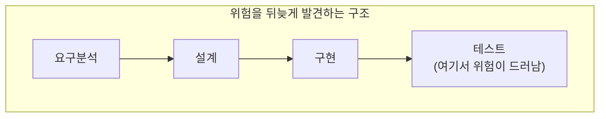
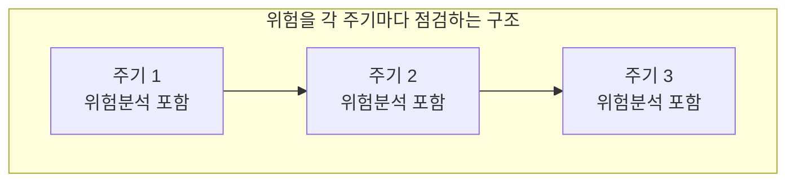
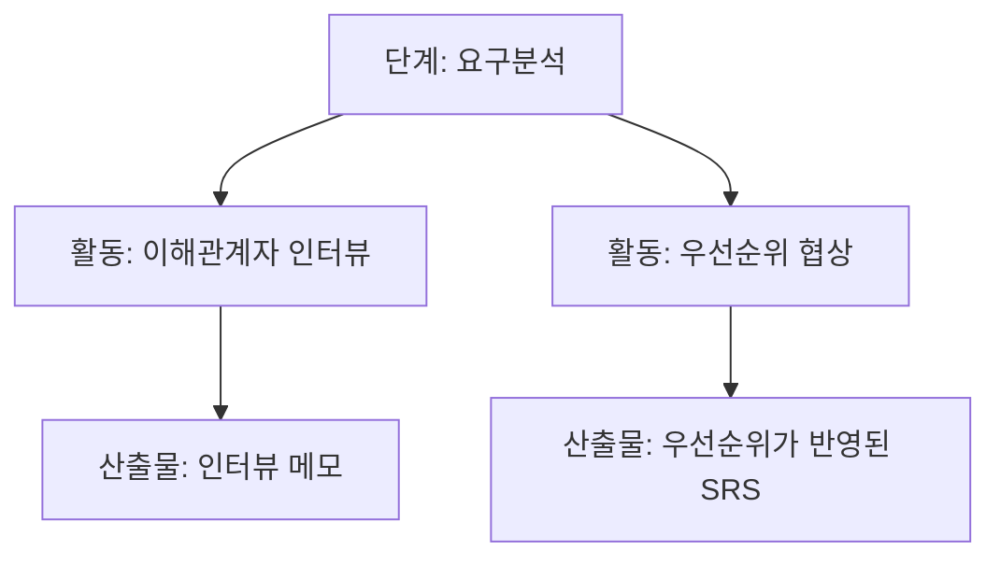

<Callout type="info">
  **이번 문서의 목표:** 05편에서 다룰 구체적인 프로세스 모델(폭포수·원형·증분·나선형)의 세부 내용을 배우기 전에, "어떤 기준으로 프로세스 모델을 비교해야 하는지"와 "시험이 비교표를 어떤 방식으로 함정에 활용하는지"를 먼저 익힌다.
</Callout>

## 왜 모델을 배우기 전에 "읽는 법"부터 잡아야 하는가

02편에서 폭포수형·반복형·점증형이라는 세 가지 흐름의 모양을 이미 봤다. 05편부터는 이 흐름들이 실제로 어떤 이름의 프로세스 모델(폭포수 모델, 원형 모델, 나선형 모델 등)로 구체화되는지, 그리고 각 모델이 언제 적합하고 언제 부적합한지를 깊게 다룬다.

문제는 프로세스 모델을 다루는 시험 문항 대부분이 "모델 A의 특징은?"이라는 단순 암기형이 아니라, "**모델 A와 B를 비교했을 때 옳은 것은?**" 또는 "**모델 C에 적합하지 않은 상황은?**"처럼 비교·적용형으로 나온다는 점이다. 이런 문제를 풀려면 각 모델을 낱개로 외우는 것이 아니라, 애초에 **같은 기준의 저울**에 올려 비교하는 습관이 필요하다. 이번 편은 그 저울, 즉 비교 기준 자체를 세운다.

> **쉽게 말하면:** 05편에서 프로세스 모델의 "내용"을 배운다면, 04편은 그 내용을 담을 "틀(비교 기준)"을 먼저 만드는 편이다.

## 프로세스 모델을 비교하는 다섯 가지 기준

프로세스 모델을 비교할 때 시험이 실제로 활용하는 기준은 대체로 다음 다섯 가지로 정리된다. 05편 이후 어떤 모델이 나오든 이 다섯 기준으로 정보를 정리하면 비교 문제에 흔들리지 않는다.

| 기준 | 묻는 질문 |
|---|---|
| 요구사항의 명확성 | 개발 시작 시점에 요구사항이 얼마나 확정되어 있어야 하는가 |
| 되돌아가기(피드백) 가능 여부 | 이전 단계로 되돌아가 수정하는 것을 얼마나 허용하는가 |
| 위험 관리 방식 | 프로젝트 위험(요구 변경, 기술적 불확실성)을 언제·어떻게 다루는가 |
| 중간 산출물 가시성 | 개발 도중 사용자·관리자가 진행 상황을 확인할 수 있는가 |
| 적합한 프로젝트 규모·유형 | 소규모/대규모, 요구가 안정적/불안정적인 프로젝트 중 어디에 맞는가 |

이 다섯 기준을 미리 알아두면, 05편에서 "폭포수 모델은 요구사항의 명확성이 낮은 프로젝트에 적합하다"처럼 기준과 반대로 서술된 오답을 쉽게 걸러낼 수 있다(실제로 폭포수 모델은 요구사항이 처음부터 명확히 확정된 프로젝트에 적합하다).

### 기준을 적용하는 예시 — 아직 배우지 않은 모델이라도 구조는 미리 읽을 수 있다

예를 들어 "위험 관리 방식"이라는 기준 하나만 놓고 생각해 보자. 어떤 모델은 위험을 프로젝트 마지막에 가서야 (테스트 단계에서) 발견하는 구조이고, 어떤 모델은 각 주기마다 위험을 분석하는 활동을 명시적으로 포함하는 구조다. 이 차이를 그림으로 미리 대조하면 다음과 같다.

두 구조 중 어느 쪽이 "요구가 자주 바뀌고 기술적 불확실성이 큰 프로젝트"에 더 안전한지는, 이름을 몰라도 구조만 보면 짐작할 수 있다 — 위험을 자주 점검하는 구조(M2)가 더 안전하다. 05편에서 이 M2 구조에 해당하는 모델의 정식 이름과 세부 활동을 배우게 된다. 지금 중요한 것은 "이름을 몰라도 그림의 구조만으로 장단점을 추론하는 습관"이다.

## 단계·활동·산출물을 헷갈리지 않고 구분하기

프로세스 모델을 읽을 때 자주 섞이는 세 층위가 있다. 이 셋을 구분하지 못하면 비교표를 읽어도 무엇을 비교하는지조차 헷갈린다.

- **단계(Phase)**: 생명주기를 크게 나눈 마디. 예: 요구분석 단계, 설계 단계.
- **활동(Activity)**: 한 단계 안에서 실제로 수행하는 작업. 예: 요구분석 단계 안의 "이해관계자 인터뷰", "우선순위 협상" 같은 개별 작업.
- **산출물(Artifact)**: 활동의 결과로 남는 것. 예: 인터뷰 결과를 정리한 메모, 최종적으로 만들어진 SRS.

이 구분이 왜 필요한가 하면, 프로세스 모델마다 **같은 단계 안에서도 활동의 구성이 달라지기 때문**이다. 예를 들어 위험 관리를 중시하는 모델은 요구분석 단계 안에 "위험 분석" 활동을 명시적으로 포함하지만, 그렇지 않은 모델은 요구분석 단계에 위험 분석 활동이 따로 없다. 즉 "단계 이름이 같다고 활동까지 같은 것은 아니다"라는 원칙을 기억해 두면, 05편에서 모델별 세부 활동 차이를 비교할 때 헷갈리지 않는다.

## 장단점 비교표를 읽는 법 — "무엇을 희생하는가"로 읽기

프로세스 모델의 장단점은 절대적인 "좋다/나쁘다"가 아니라 **어떤 상황에서 무엇을 얻고 무엇을 희생하는가**의 문제다. 시험이 "모델 A의 단점은?"이라고 물을 때, 그 단점은 대부분 그 모델의 장점과 동전의 양면 관계에 있다. 이 관계를 미리 알아두면 단점을 몰라도 장점에서 역으로 추론할 수 있다.

| 얻는 것(장점) | 대신 희생하는 것(단점) |
|---|---|
| 단계가 순차적이라 관리·문서화가 단순함 | 요구 변경에 유연하게 대응하기 어려움 |
| 이른 시점에 실물(프로토타입)을 보고 요구를 확정할 수 있음 | 프로토타입 자체를 만드는 데 추가 자원이 듦 |
| 위험을 자주 점검해 큰 실패를 예방함 | 위험 분석 활동에 드는 비용과 전문성이 필요함 |
| 기능을 조각내 일찍 일부를 출시할 수 있음 | 초기에 전체 아키텍처를 잘못 잡으면 후반에 수정 비용이 커짐 |

이 표를 05편에서 배울 각 모델에 대입해 보는 습관을 들이면, "장점은 맞는데 단점을 반대로 서술한" 함정형 오답을 정확히 골라낼 수 있다. 예를 들어 "순차적 진행 덕분에 관리가 단순하면서 동시에 요구 변경에도 유연하다"는 진술이 나오면, 위 표의 첫 줄과 모순되므로 틀린 진술임을 바로 알 수 있다 — 순차적 진행의 장점(관리 단순함)은 요구 변경 유연성이라는 대가를 치르고 얻은 것이기 때문이다.

## 비교표 문제에서 자주 쓰이는 함정 패턴 세 가지

1. **장점과 단점을 뒤바꾸는 함정**: "이 모델은 요구 변경에 유연하면서도 관리가 매우 단순하다"처럼, 서로 상충하는 두 장점을 동시에 준다고 서술하는 패턴. 위 표처럼 "얻는 것과 희생하는 것"의 짝을 알면 걸러낼 수 있다.
2. **적합 상황을 반대로 서술하는 함정**: "요구가 자주 바뀌는 프로젝트에 폭포수 모델이 가장 적합하다"처럼, 모델의 성격과 반대되는 상황에 적합하다고 서술하는 패턴.
3. **다른 모델의 특징을 섞어 넣는 함정**: "이 모델은 프로토타입을 반복해서 만들면서 동시에 나선형으로 위험 분석을 수행한다"처럼, 서로 다른 모델의 정의를 한 문장에 섞어 마치 하나의 모델 특징처럼 서술하는 패턴. 05편에서 각 모델의 정의를 정확히 익혀 두면 이런 혼합형 함정에 흔들리지 않는다.

## 자주 틀리는 점

- 프로세스 모델을 이름과 그림만으로 외우고 "왜 그런 구조를 갖는지"를 생략하면, 조금만 다르게 서술된 비교 문제에서 틀린다. 항상 다섯 가지 비교 기준(요구 명확성, 피드백 가능 여부, 위험 관리, 가시성, 적합 규모) 중 어디에 해당하는 서술인지 확인하는 습관을 들인다.
- "단계"와 "활동"을 같은 층위로 취급하면 "이 모델은 요구분석 단계가 없다"처럼 극단적인 오답에 낚이기 쉽다. 실제로는 단계 자체는 대부분 모델에 공통으로 존재하고, 그 안의 활동 구성과 반복 여부가 달라지는 것이다.
- 장점만 보고 단점을 추론하지 않은 채 암기하면, 장단점이 반대로 서술된 문제에서 걸러내지 못한다. "이 장점은 무엇을 희생해서 얻은 것인가"를 항상 함께 생각한다.

## 핵심 정리

- 프로세스 모델은 요구사항 명확성, 피드백 가능 여부, 위험 관리 방식, 중간 산출물 가시성, 적합 프로젝트 규모라는 다섯 기준으로 비교할 수 있다.
- 단계(Phase), 활동(Activity), 산출물(Artifact)은 서로 다른 층위이며, 단계 이름이 같아도 모델마다 그 안의 활동 구성은 달라질 수 있다.
- 모델의 장점과 단점은 대부분 동전의 양면 관계이며, "무엇을 얻기 위해 무엇을 희생했는가"로 읽으면 장단점이 뒤바뀐 함정 문항을 걸러낼 수 있다.
- 시험은 장단점 뒤바꾸기, 적합 상황 반대로 서술하기, 다른 모델 특징 섞기라는 세 가지 함정 패턴을 즐겨 쓴다.

## 마무리 복습

<Quiz
  questionNumber={1}
  question="프로세스 모델을 비교하는 기준으로 적절하지 않은 것은?"
  options={['개발 시작 시점의 요구사항 명확성 정도', '이전 단계로 되돌아가는 피드백 허용 정도', '개발팀이 사용하는 특정 프로그래밍 언어의 문법', '중간 산출물에 대한 가시성 확보 정도']}
  correctAnswer={3}
  explanation="프로세스 모델 비교는 요구 명확성, 피드백 가능 여부, 위험 관리, 가시성, 적합 규모 등 개발 절차의 구조적 특성을 기준으로 하며, 특정 프로그래밍 언어 문법은 비교 기준이 아니다."
  optionExplanations={['적절한 비교 기준이므로 정답이 아니다', '적절한 비교 기준이므로 정답이 아니다', '프로세스 모델은 절차의 구조를 다루며 특정 언어 문법과는 무관하므로 이것이 정답이다', '적절한 비교 기준이므로 정답이 아니다']}
/>

<Quiz
  questionNumber={2}
  question="단계(Phase), 활동(Activity), 산출물(Artifact)의 관계에 대한 설명으로 옳은 것은?"
  options={['세 층위는 모두 같은 크기의 개념이며 서로 바꿔 써도 무방하다', '단계 안에 여러 활동이 있고, 각 활동의 결과로 산출물이 남는다', '산출물은 활동보다 상위 개념이며 여러 활동을 포함한다', '활동은 단계가 모두 끝난 뒤에만 정의할 수 있는 개념이다']}
  correctAnswer={2}
  explanation="단계는 생명주기를 크게 나눈 마디이고, 그 안에 여러 활동이 있으며, 각 활동의 결과로 산출물이 만들어진다."
  optionExplanations={['세 층위는 서로 다른 크기의 개념으로 구분해야 한다', '정답이다', '산출물은 활동의 결과물이며 활동보다 하위 개념이다', '활동은 단계 진행 중에 수행되는 작업이다']}
/>

<Quiz
  questionNumber={3}
  question="'단계 이름이 같으면 모델과 무관하게 그 안의 활동 구성도 항상 동일하다'는 진술에 대한 평가로 옳은 것은?"
  options={['옳다. 단계 이름이 같으면 활동 구성도 반드시 같다', '옳지 않다. 같은 단계 이름이라도 모델에 따라 포함하는 활동 구성이 달라질 수 있다', '옳다. 활동은 산출물과 완전히 같은 개념이므로 항상 동일하다', '이 진술은 프로세스 모델 비교와 무관한 내용이다']}
  correctAnswer={2}
  explanation="단계 이름이 같더라도, 예를 들어 위험 분석 활동을 명시적으로 포함하는 모델과 그렇지 않은 모델처럼 활동 구성은 모델마다 달라질 수 있다."
  optionExplanations={['활동 구성은 모델에 따라 달라질 수 있으므로 옳지 않다', '정답이다', '활동과 산출물은 서로 다른 개념이다', '이 진술은 프로세스 모델을 비교할 때 핵심적으로 다뤄야 하는 내용이다']}
/>

<Quiz
  questionNumber={4}
  question="'순차적 진행 덕분에 관리와 문서화가 단순하면서, 동시에 요구 변경에도 매우 유연하게 대응한다'는 진술에 대한 평가로 가장 적절한 것은?"
  options={['옳다. 두 장점은 함께 성립하는 것이 일반적이다', '옳지 않다. 관리 단순함은 순차적 진행의 장점이지만, 그 대가로 요구 변경 유연성은 낮아지는 경향이 있다', '옳다. 모든 프로세스 모델은 예외 없이 두 장점을 동시에 지닌다', '이 진술은 장단점 비교와 무관한 서술이다']}
  correctAnswer={2}
  explanation="순차적 진행의 장점(관리 단순함)은 대개 요구 변경 유연성을 희생하는 대가로 얻어지므로, 두 장점을 동시에 얻는다는 서술은 장단점이 뒤바뀐 함정이다."
  optionExplanations={['두 장점은 대개 상충 관계에 있다', '정답이다', '모델마다 장단점의 조합은 다르게 나타난다', '이 진술은 장단점을 뒤바꾼 대표적 함정 패턴이다']}
/>

<Quiz
  questionNumber={5}
  question="시험에서 프로세스 모델 비교 문항이 자주 활용하는 함정 패턴으로 보기 어려운 것은?"
  options={['서로 상충하는 두 장점을 동시에 가진다고 서술하는 패턴', '모델의 성격과 반대되는 상황에 적합하다고 서술하는 패턴', '서로 다른 모델의 정의를 한 문장에 섞어 서술하는 패턴', '모델의 이름과 등장 연도를 정확히 일치시켜 서술하는 패턴']}
  correctAnswer={4}
  explanation="이름과 등장 연도를 정확히 일치시키는 서술은 오히려 옳은 진술에 해당하며, 함정 패턴이 아니다. 함정은 장단점 뒤바꾸기, 적합 상황 반대 서술, 모델 특징 섞기다."
  optionExplanations={['대표적인 함정 패턴이므로 정답이 아니다', '대표적인 함정 패턴이므로 정답이 아니다', '대표적인 함정 패턴이므로 정답이 아니다', '정확한 서술은 함정이 아니므로 이것이 정답이다']}
/>

<Quiz
  questionNumber={6}
  question="위험을 각 개발 주기마다 명시적으로 점검하는 구조와, 테스트 단계에 가서야 위험이 드러나는 구조를 비교했을 때 옳은 설명은?"
  options={['두 구조는 요구 변경이 잦은 프로젝트에서 동일한 안전성을 제공한다', '위험을 각 주기마다 점검하는 구조가 기술적 불확실성이 큰 프로젝트에서 더 안전한 경향이 있다', '테스트 단계에서만 위험이 드러나는 구조가 항상 더 안전하다', '위험 점검 활동은 프로세스 모델의 구조와 관련이 없다']}
  correctAnswer={2}
  explanation="위험을 각 주기마다 점검하는 구조는 문제를 일찍 발견해 대응할 수 있어, 기술적 불확실성이 크거나 요구가 자주 바뀌는 프로젝트에서 더 안전한 경향이 있다."
  optionExplanations={['두 구조의 위험 대응 시점이 다르므로 안전성도 다르게 나타난다', '정답이다', '뒤늦게 위험이 드러나는 구조는 대응이 늦어질 위험이 크다', '위험 점검 활동의 배치는 프로세스 모델의 핵심 설계 요소다']}
/>

## 참고 자료

- [국가평생교육진흥원 독학학위제 시험안내](https://bdes.nile.or.kr/nile/exam/nExam2_1.do)
- [국가평생교육진흥원 독학학위제 제도 활용](https://bdes.nile.or.kr/nile/about/nAbout3_1.do)
