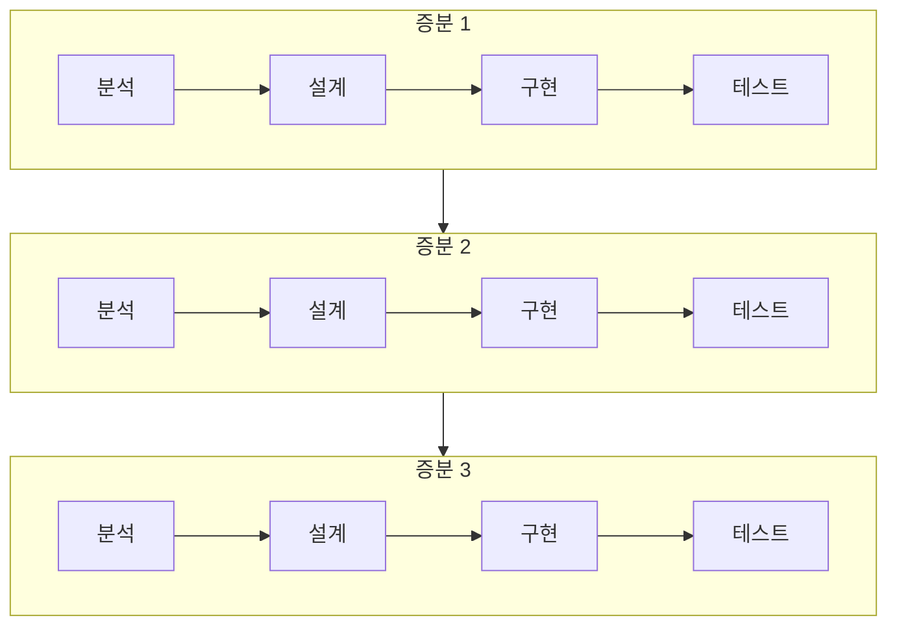
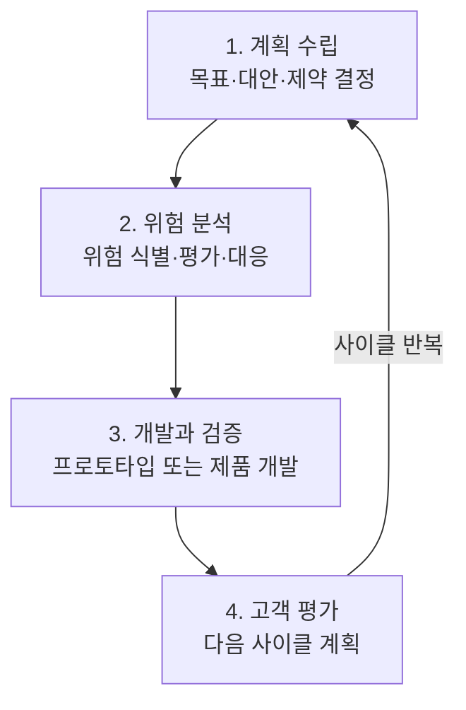

<Callout type="info">
  **이번 문서의 목표:** 이 파일을 다 읽으면 소프트웨어공학이 "왜" 필요한 학문인지 소프트웨어 위기(software crisis)라는 배경으로 설명할 수 있고, 폭포수·프로토타입·증분형·나선형 네 가지 생명주기 모델을 각각 언제 쓰고 언제 쓰지 말아야 하는지 근거를 들어 구분할 수 있으며, "모델 A와 모델 B의 차이는?" 유형의 문항에서 함정 보기를 걸러낼 수 있다.
</Callout>

## 왜 "소프트웨어공학"이라는 학문이 따로 필요한가

1960~70년대에 컴퓨터 하드웨어의 성능은 빠르게 좋아졌지만, 그 위에서 돌아가는 소프트웨어는 정반대의 문제를 겪었습니다. 프로젝트가 예정된 기간과 예산을 크게 넘기고, 완성된 뒤에도 오류가 끊이지 않고, 심지어 요구했던 기능조차 제대로 구현되지 않은 채 인도되는 일이 반복됐습니다. 이 현상을 통틀어 **소프트웨어 위기**(software crisis)라고 부릅니다. 소프트웨어공학(software engineering)은 이 위기에 대한 대응으로 등장한 학문입니다. "코드를 짜는 개인의 감각"에 맡겨 두던 작업을, 건축이나 토목처럼 **체계적이고 재현 가능한 공학적 절차**로 다루자는 것이 핵심 발상입니다.

> **쉽게 말하면:** 소프트웨어공학은 "집을 지을 때 설계도 없이 벽돌부터 쌓지 말고, 먼저 설계하고 순서를 지켜서 짓자"는 원칙을 소프트웨어에 적용한 학문입니다.

**소프트웨어공학**(software engineering)이라는 용어는 1968년 NATO 소프트웨어공학 회의(NATO Software Engineering Conference)에서 처음 공식적으로 쓰였다고 알려져 있습니다. IEEE(전기전자기술자협회, Institute of Electrical and Electronics Engineers)는 소프트웨어공학을 "소프트웨어의 개발·운영·유지보수에 체계적이고 훈련되고 정량화할 수 있는 접근 방식을 적용하는 것, 즉 공학을 소프트웨어에 적용하는 것"이라고 정의합니다. 이 정의에서 시험이 자주 짚는 세 단어는 **체계적**(systematic), **정량화 가능**(quantifiable), 그리고 **공학의 적용**입니다. "느낌과 경험만으로 개발한다"는 보기가 나오면 소프트웨어공학의 정의와 반대되는 설명이라고 판단하면 됩니다.

## 1. 소프트웨어공학의 목표 — 생산성과 품질의 동시 확보

소프트웨어공학이 추구하는 목표는 크게 두 축으로 나뉩니다.

- **생산성**(productivity): 정해진 기간과 인력으로 더 많은, 더 나은 기능을 만들어내는 능력. 반복 가능한 프로세스, 재사용 가능한 부품(컴포넌트), 자동화 도구가 생산성을 끌어올립니다.
- **품질**(quality): 만들어진 소프트웨어가 요구된 기능을 정확히 수행하고, 신뢰할 수 있고, 유지보수하기 쉬운 정도. 18편에서 다루는 ISO/IEC 25010 품질 특성이 이 축을 세분화합니다.

이 둘은 종종 긴장 관계에 놓입니다. 빨리 만들려고 검토와 테스트를 생략하면 품질이 떨어지고, 반대로 품질을 지나치게 강조해 모든 단계를 겹겹이 검증하면 일정과 비용이 늘어납니다. 소프트웨어공학의 실천적 목표는 이 둘을 **동시에** 만족시킬 수 있는 프로세스와 기법을 찾는 것입니다. 그래서 "소프트웨어공학은 품질을 희생해서라도 속도만 높이는 학문이다"라는 보기는 틀린 설명입니다.

**자주 틀리는 점**: 소프트웨어공학을 "프로그래밍 언어를 잘 다루는 기술"로 오해하는 경우가 있습니다. 특정 언어의 문법 숙련도는 소프트웨어공학의 대상이 아닙니다. 소프트웨어공학이 다루는 것은 요구사항부터 유지보수까지 이어지는 **전체 개발 과정을 어떻게 관리하고 통제할 것인가**입니다. 이 과목에서 코드 실습보다 프로세스·설계·품질·관리 개념이 훨씬 큰 비중을 차지하는 이유도 여기에 있습니다.

## 2. 소프트웨어 생명주기 모델을 보는 공통 기준

02편·04편에서 생명주기 단계 용어와 비교표를 읽는 법을 다뤘습니다. 이 편에서는 그 틀 위에 실제 모델 네 가지를 올려 봅니다. 어떤 모델이든 다음 세 가지 질문에 답할 수 있어야 시험에서 흔들리지 않습니다.

1. **단계를 어떤 순서로, 몇 번 거치는가?** (한 번만 순차적으로 vs 여러 번 반복)
2. **요구사항이 처음부터 확정되어 있다고 가정하는가?** (확정 가정 vs 점진적으로 구체화)
3. **위험(risk)을 어떻게 다루는가?** (거의 다루지 않음 vs 위험 분석을 프로세스에 내장)

이 세 질문을 기준으로 폭포수·프로토타입·증분형·나선형 모델을 순서대로 봅니다.

## 3. 폭포수 모델 — 가장 오래된 순차적 모델

**폭포수 모델**(waterfall model)은 요구분석 → 설계 → 구현 → 테스트 → 유지보수의 단계를 **순서대로, 한 번씩만** 거치는 모델입니다. 폭포에서 물이 위에서 아래로만 흐르고 거슬러 올라가지 않는 모습에 빗대어 이름 붙었습니다. 1970년 윈스턴 로이스(Winston Royce)의 논문에서 소개된 순차적 개발 방식이 이후 폭포수 모델로 정착했습니다.

**장점**: 각 단계가 명확히 구분되어 있어 산출물(요구사항 명세서, 설계서, 코드, 테스트 결과서)을 단계별로 검토하고 관리하기 쉽습니다. 프로젝트 진행 상황을 일정·문서 기준으로 파악하기 쉬워 관리가 단순하고, 요구사항이 처음부터 안정적인 프로젝트에는 적합합니다.

**단점**: 한 단계가 끝나야 다음 단계로 넘어가는 구조이기 때문에, 앞 단계로 되돌아가는 비용이 매우 큽니다. 특히 테스트 단계에서야 요구분석 단계의 실수가 발견되면, 이미 지나온 설계·구현 단계를 전부 다시 해야 합니다. 또한 실제로 동작하는 소프트웨어를 개발 후반부(테스트 단계)에 가서야 볼 수 있어서, 사용자가 "생각했던 것과 다르다"고 느끼는 시점이 너무 늦습니다. 요구사항이 프로젝트 도중 자주 바뀌는 경우에는 적합하지 않습니다.

> **쉽게 말하면:** 폭포수 모델은 "설계도를 완전히 확정한 뒤에야 첫 삽을 뜨는 건축 방식"입니다. 중간에 설계를 바꾸려면 이미 지은 부분을 허물어야 합니다.

## 4. 프로토타입 모델 — 미리 만들어보고 요구를 확정

**프로토타입 모델**(prototyping model)은 사용자의 요구사항이 처음부터 명확하지 않을 때, 핵심 기능만 빠르게 구현한 **시제품**(prototype)을 먼저 만들어 사용자에게 보여주고 피드백을 받아 요구사항을 구체화하는 모델입니다. 프로토타입은 실제 제품에 그대로 쓰일 수도 있고(진화형 프로토타입, evolutionary prototype), 요구사항을 확인하는 용도로만 쓰이고 버려질 수도 있습니다(폐기형 프로토타입, throwaway prototype).

**장점**: 사용자가 눈으로 직접 확인하면서 요구사항을 다듬을 수 있어, "말로는 설명하기 어려운 요구사항"을 초기에 구체화할 수 있습니다. 요구사항 오류를 개발 초반에 발견할 수 있어 폭포수 모델의 가장 큰 약점을 보완합니다.

**단점**: 프로토타입을 빨리 만드는 데만 집중하다 보면 설계 품질이나 예외 처리, 성능 같은 비기능 요구사항을 소홀히 다루기 쉽습니다. 또한 사용자가 프로토타입을 보고 "이미 거의 다 완성됐다"고 오해해 실제 개발 일정에 대한 기대치가 왜곡될 위험이 있습니다.

**자주 틀리는 점**: "프로토타입은 항상 버려진다"는 설명은 틀렸습니다. 진화형 프로토타입은 다듬어져 최종 제품의 일부가 되기도 합니다. 프로토타입의 운명(재사용 여부)은 모델의 종류(진화형·폐기형)에 따라 다릅니다.

## 5. 증분형 모델 — 기능을 나눠서 순차적으로 완성

**증분형 모델**(incremental model)은 전체 시스템을 한 번에 만들지 않고, 기능을 여러 개의 **증분**(increment, 점점 늘어나는 단위)으로 나눈 뒤, 각 증분마다 요구분석부터 테스트까지의 미니 폭포수를 거쳐 순차적으로 완성해 나가는 모델입니다. 첫 번째 증분이 끝나면 그 기능은 실제로 동작하는 상태로 사용자에게 인도되고, 두 번째 증분이 그 위에 새 기능을 더합니다.

**장점**: 핵심 기능부터 먼저 완성해 인도하므로, 전체 개발이 끝나기 전에도 사용자가 실제로 쓸 수 있는 부분 시스템을 빨리 얻을 수 있습니다. 한 증분에서 문제가 생겨도 그 범위가 전체 시스템이 아니라 해당 증분으로 한정되어 위험이 분산됩니다.

**단점**: 전체 시스템의 구조를 처음부터 잘 설계해 두지 않으면, 나중 증분을 추가할 때 앞선 증분의 설계를 뜯어고쳐야 하는 상황이 생길 수 있습니다. 즉 증분 간의 **아키텍처 일관성**을 유지하는 설계 역량이 요구됩니다.

**자주 틀리는 점**: 증분형 모델과 아래에서 다룰 나선형 모델을 "완전히 같은 개념"으로 혼동하는 보기가 자주 나옵니다. 둘 다 "여러 번 반복한다"는 점은 같지만, 증분형은 **기능 단위로 쪼개어 순차적으로 완성**해 가는 데 초점이 있고, 나선형은 아래에서 보듯 **위험 분석을 반복 사이클에 명시적으로 내장**하는 데 초점이 있습니다.

## 6. 나선형 모델 — 위험 분석을 프로세스에 내장

**나선형 모델**(spiral model)은 배리 보엠(Barry Boehm)이 1988년에 제안한 모델로, 폭포수 모델의 체계성과 프로토타입 모델의 위험 감소 효과를 결합하되, **위험 분석**(risk analysis)을 프로세스의 정식 단계로 못박은 것이 특징입니다. 나선을 따라 원의 중심에서 바깥으로 돌면서, 매 사이클마다 네 가지 활동을 반복합니다.

(위 그림은 실제 나선형 도형 대신 한 사이클의 네 활동과 반복 흐름을 순서대로 표현한 것입니다. 실제 나선형 모델은 이 네 활동을 중심에서 바깥으로 나선을 그리며 반복하는 모양으로 그려집니다.)

**장점**: 매 사이클마다 위험을 명시적으로 분석하고 대응하므로, 대규모·고위험 프로젝트에서 실패 확률을 줄일 수 있습니다. 프로토타입과 정형화된 개발을 상황에 맞게 섞어 쓸 수 있는 유연성도 있습니다.

**단점**: 위험 분석에는 전문성이 필요합니다. 위험을 제대로 식별·평가할 인력이 없으면 나선형 모델의 장점을 살릴 수 없습니다. 또한 사이클을 여러 번 반복하는 구조상 관리가 복잡하고, 소규모 프로젝트에는 비용 대비 효과가 떨어질 수 있습니다.

**자주 틀리는 점**: "나선형 모델은 위험 분석 없이 반복만 한다"는 설명은 나선형 모델의 정의를 정면으로 부정하는 오답입니다. 나선형 모델의 핵심 식별자는 언제나 "위험 분석을 매 사이클에 명시적으로 포함한다"는 점입니다.

## 7. 네 모델 정면 비교표

| 구분 | 폭포수 | 프로토타입 | 증분형 | 나선형 |
|------|--------|------------|--------|--------|
| 반복 여부 | 반복 없음(순차 1회) | 요구 확정까지 반복 | 증분 단위로 반복 | 사이클 단위로 반복 |
| 요구사항 확정 시점 | 개발 시작 전에 확정 가정 | 프로토타입을 거치며 점진 확정 | 전체 골격은 초기에, 세부는 증분마다 | 사이클마다 점진 구체화 |
| 위험 관리 | 명시적 절차 없음 | 요구 불확실성만 낮춤 | 증분 단위로 위험 분산 | 매 사이클 위험 분석을 정식 단계로 포함 |
| 초기 산출물 확인 시점 | 테스트 단계(후반부) | 프로토타입 단계(초반부) | 첫 증분 완료 시점 | 사이클 종료마다 |
| 적합한 프로젝트 | 요구사항이 안정적이고 익숙한 소규모 프로젝트 | 요구사항이 불명확한 사용자 인터페이스 중심 프로젝트 | 기능을 단계적으로 인도해야 하는 프로젝트 | 대규모·고위험·고비용 프로젝트 |

**자주 틀리는 점**: "옳지 않은 것 고르기" 유형에서는 이 표의 각 행을 서로 바꿔치기한 보기가 자주 나옵니다. 예를 들어 "폭포수 모델은 위험 분석을 정식 단계로 포함한다"처럼 나선형 모델의 특징을 폭포수 모델에 붙이는 식입니다. 모델 이름과 그 모델만의 **식별 특징 하나**를 짝지어 외워 두면 이런 함정을 피할 수 있습니다. 폭포수는 "순차·비반복", 프로토타입은 "시제품으로 요구 확정", 증분형은 "기능 단위 순차 완성", 나선형은 "위험 분석 내장"입니다.

## 핵심 정리

- 소프트웨어공학은 소프트웨어 위기에 대한 대응으로 등장했으며, 체계적·정량화 가능한 방식으로 생산성과 품질을 동시에 확보하는 것을 목표로 한다.
- 폭포수 모델은 순차적·비반복적이며 요구사항이 안정적일 때 적합하지만, 초기 오류 발견이 늦고 되돌아가는 비용이 크다.
- 프로토타입 모델은 시제품으로 요구사항을 구체화하며, 진화형과 폐기형으로 나뉜다.
- 증분형 모델은 기능을 증분 단위로 나눠 순차적으로 완성하고, 나선형 모델은 매 사이클에 위험 분석을 정식 단계로 포함한다.
- 네 모델을 비교할 때는 반복 여부, 요구 확정 시점, 위험 관리 방식, 초기 산출물 확인 시점을 기준으로 구분한다.

## 마무리 복습

<Quiz
  questionNumber={1}
  question="IEEE가 정의하는 소프트웨어공학의 특징으로 가장 적절한 것은?"
  options={['개발자 개인의 직관과 경험에만 의존하는 접근', '체계적이고 훈련되고 정량화할 수 있는 방식으로 소프트웨어를 개발·운영·유지보수하는 것', '특정 프로그래밍 언어의 문법을 숙련되게 다루는 기술', '테스트 단계를 생략해 개발 속도만 높이는 방법론']}
  correctAnswer={2}
  explanation="IEEE는 소프트웨어공학을 체계적이고 훈련되고 정량화할 수 있는 접근 방식을 소프트웨어의 개발·운영·유지보수에 적용하는 것으로 정의한다."
  optionExplanations={['개인의 직관에만 의존하는 방식은 소프트웨어 위기의 원인으로 지적된 접근이며 소프트웨어공학의 정의와 반대된다.', '정답. 체계적·정량화 가능한 접근이 IEEE 정의의 핵심이다.', '특정 언어 문법 숙련도는 소프트웨어공학이 다루는 대상이 아니다.', '테스트 생략은 품질을 희생하는 것으로 소프트웨어공학의 목표에 반한다.']}
/>

<Quiz
  questionNumber={2}
  question="폭포수 모델의 단점으로 가장 적절한 것은?"
  options={['매 사이클마다 위험 분석을 반복해 관리가 복잡하다.', '요구분석 단계의 오류가 테스트 단계에 이르러서야 발견되면 앞 단계로 되돌아가는 비용이 크다.', '사용자가 프로토타입을 보고 개발이 거의 끝났다고 오해한다.', '증분마다 아키텍처 일관성을 유지하기 어렵다.']}
  correctAnswer={2}
  explanation="폭포수 모델은 순차적으로 한 번씩만 단계를 거치므로, 후반부 테스트 단계에서 초반 요구분석의 오류가 발견되면 이미 지나온 단계를 다시 거쳐야 하는 큰 비용이 발생한다."
  optionExplanations={['위험 분석 반복은 나선형 모델의 특징이다.', '정답. 되돌아가는 비용이 큰 것이 폭포수 모델의 대표적 단점이다.', '프로토타입에 대한 오해는 프로토타입 모델의 단점이다.', '증분 간 아키텍처 일관성 문제는 증분형 모델의 단점이다.']}
/>

<Quiz
  questionNumber={3}
  question="프로토타입 모델에 대한 설명으로 옳지 않은 것은?"
  options={['프로토타입은 요구사항이 불명확할 때 요구를 구체화하는 데 활용된다.', '진화형 프로토타입은 다듬어져 최종 제품의 일부가 될 수 있다.', '모든 프로토타입은 예외 없이 사용 후 반드시 폐기된다.', '폐기형 프로토타입은 요구 확인 용도로만 쓰이고 본 개발에는 재사용되지 않는다.']}
  correctAnswer={3}
  explanation="프로토타입에는 최종 제품의 일부로 발전하는 진화형과, 요구 확인 후 버려지는 폐기형이 있으므로 모든 프로토타입이 반드시 폐기된다는 설명은 옳지 않다."
  optionExplanations={['옳은 설명이다. 프로토타입의 핵심 목적이 요구 구체화다.', '옳은 설명이다. 진화형 프로토타입은 실제 제품에 반영될 수 있다.', '옳지 않은 설명이므로 정답이다. 진화형 프로토타입은 폐기되지 않는다.', '옳은 설명이다. 폐기형 프로토타입의 정의와 일치한다.']}
/>

<Quiz
  questionNumber={4}
  question="증분형 모델(incremental model)의 특징으로 가장 적절한 것은?"
  options={['전체 시스템을 하나의 사이클로만 완성하고 위험 분석을 정식 단계로 포함한다.', '기능을 여러 증분으로 나누고, 각 증분마다 분석부터 테스트까지 거쳐 순차적으로 완성한다.', '요구사항이 확정되기 전까지 시제품만 반복해서 만든다.', '모든 기능을 동시에 병렬로 개발해 한 번에 인도한다.']}
  correctAnswer={2}
  explanation="증분형 모델은 기능을 증분 단위로 나누고 각 증분마다 미니 폭포수(분석-설계-구현-테스트)를 거쳐 순차적으로 완성해 나간다."
  optionExplanations={['위험 분석을 정식 단계로 포함하는 것은 나선형 모델의 특징이다.', '정답. 증분 단위 순차 완성이 증분형 모델의 핵심 식별 특징이다.', '시제품 반복은 프로토타입 모델의 특징이다.', '증분형은 기능을 나눠 순차적으로 인도하며 한 번에 전부 인도하지 않는다.']}
/>

<Quiz
  questionNumber={5}
  question="나선형 모델(spiral model)에 대한 설명으로 옳지 않은 것은?"
  options={['배리 보엠이 제안한 모델로 대규모·고위험 프로젝트에 적합하다.', '매 사이클마다 위험 분석 활동을 정식 단계로 포함한다.', '위험 분석 없이 계획 수립과 개발만 반복하는 모델이다.', '프로토타입 활용과 정형화된 개발을 상황에 맞게 섞어 쓸 수 있다.']}
  correctAnswer={3}
  explanation="나선형 모델의 핵심 식별 특징은 매 사이클에 위험 분석을 정식 단계로 포함한다는 점이므로, 위험 분석이 없다는 설명은 옳지 않다."
  optionExplanations={['옳은 설명이다. 보엠이 제안했고 고위험 프로젝트에 적합하다.', '옳은 설명이다. 위험 분석이 나선형 모델의 정식 단계다.', '옳지 않은 설명이므로 정답이다. 위험 분석이 나선형 모델의 핵심이다.', '옳은 설명이다. 나선형 모델은 여러 접근을 유연하게 결합할 수 있다.']}
/>

<Quiz
  questionNumber={6}
  question="생명주기 모델 비교에 대한 설명으로 가장 적절한 것은?"
  options={['폭포수 모델은 초기 산출물을 테스트 단계에 가서야 확인할 수 있다.', '증분형 모델과 나선형 모델은 완전히 동일한 개념으로 시험에서 구분할 필요가 없다.', '프로토타입 모델은 요구사항이 이미 완전히 확정된 프로젝트에서만 쓰인다.', '나선형 모델은 소규모 프로젝트에 가장 비용 효율적인 모델이다.']}
  correctAnswer={1}
  explanation="폭포수 모델은 요구분석-설계-구현-테스트를 순차적으로 거치므로, 실제로 동작하는 산출물을 개발 후반부인 테스트 단계에 이르러서야 확인할 수 있다는 것이 대표적 단점이다."
  optionExplanations={['정답. 초기 산출물 확인이 늦은 것이 폭포수 모델의 대표적 특징이다.', '증분형은 기능 단위 순차 완성에, 나선형은 위험 분석 내장에 초점이 있어 서로 구분되는 모델이다.', '프로토타입 모델은 오히려 요구사항이 불명확할 때 이를 구체화하기 위해 쓰인다.', '나선형 모델은 위험 분석 절차의 비용 때문에 소규모 프로젝트보다는 대규모·고위험 프로젝트에 적합하다.']}
/>

## 참고 자료

- [ACM/IEEE SWEBOK v4 안내](https://www.computer.org/education/bodies-of-knowledge/software-engineering)
- [SWEBOK topics 상세](https://www.computer.org/education/bodies-of-knowledge/software-engineering/topics)
