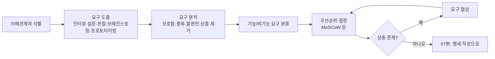

<Callout type="info">
  **이번 문서의 목표:** 이 파일을 다 읽으면 요구공학이 왜 소프트웨어공학에서 가장 먼저 다뤄지는 활동인지 설명할 수 있고, 인터뷰·설문·관찰·브레인스토밍·프로토타이핑 같은 요구 도출 기법을 상황에 맞게 구분할 수 있으며, 우선순위가 충돌하는 이해관계자들 사이에서 요구사항을 협상하는 절차를 말할 수 있다.
</Callout>

## 왜 요구사항을 별도의 학문 영역으로 다루는가

프로젝트가 실패하는 가장 큰 원인 중 하나는 코딩 실력 부족이 아니라, **애초에 무엇을 만들어야 하는지를 잘못 파악한 것**입니다. 고객이 원하는 것과 개발팀이 이해한 것 사이에 틈이 생기면, 아무리 코드를 정교하게 짜도 그 결과물은 "요구했던 것과 다른 소프트웨어"가 됩니다. 이 틈을 줄이기 위해 요구사항을 체계적으로 다루는 활동을 **요구공학**(requirements engineering)이라고 부르며, 05편에서 본 모든 생명주기 모델은 예외 없이 요구사항을 다루는 단계에서 출발합니다.

> **쉽게 말하면:** 요구공학은 "손님이 정확히 원하는 요리가 무엇인지 주문받는 절차"입니다. 주문을 잘못 받으면 주방 솜씨가 아무리 좋아도 손님은 만족하지 못합니다.

요구공학은 크게 두 편으로 나눠 다룹니다. 이번 06편은 도출(elicitation) → 분석(analysis) → 협상(negotiation)까지, 다음 07편은 도출된 요구를 문서로 **명세**(specification)하고 **검증·확인**(validation, verification)하며 변경을 관리하는 부분을 다룹니다. 03편에서 이미 짚었듯, 요구사항과 명세는 서로 다른 개념입니다. 요구사항은 "사용자가 원하는 것 자체"이고 명세는 "그 요구사항을 문서로 정리한 산출물"입니다. 이 구분을 헷갈리면 06편과 07편의 경계가 흐려지니 항상 기억해 두어야 합니다.

## 1. 이해관계자 — 요구의 출처를 파악한다

요구사항을 도출하려면 먼저 "누구에게 물어봐야 하는가"를 정해야 합니다. 소프트웨어의 개발과 사용에 이해관계를 가진 사람이나 조직을 **이해관계자**(stakeholder)라고 부릅니다. 이해관계자는 한 종류가 아닙니다.

| 이해관계자 유형 | 설명 | 예시 |
|------------------|------|------|
| 최종 사용자(end user) | 완성된 시스템을 실제로 조작하는 사람 | 콜센터 상담원, 매장 계산원 |
| 고객(customer) | 시스템 개발을 의뢰하고 비용을 지불하는 주체 | 발주 기업의 경영진 |
| 도메인 전문가(domain expert) | 업무 지식은 있지만 시스템을 직접 조작하지 않을 수 있는 사람 | 회계사, 법무 담당자 |
| 개발팀 내부 이해관계자 | 시스템을 만들고 유지보수하는 사람 | 설계자, 개발자, 테스터 |
| 규제 기관 | 법적·제도적 제약을 부과하는 외부 주체 | 금융감독기관, 개인정보보호위원회 |

**자주 틀리는 점**: "고객과 최종 사용자는 항상 같은 사람이다"라는 전제는 틀렸습니다. 예를 들어 회사가 콜센터 시스템 개발을 의뢰하면, 비용을 지불하고 요구사항의 큰 방향을 결정하는 고객은 경영진이지만, 실제로 화면을 조작하며 매일 쓰는 최종 사용자는 상담원입니다. 이 둘의 요구사항이 다를 수 있다는 점(경영진은 보고서 기능을, 상담원은 빠른 응대 화면을 원하는 식)이 바로 아래에서 다룰 협상이 필요한 이유입니다.

## 2. 요구 도출 기법 — 어떻게 물어볼 것인가

**요구 도출**(requirements elicitation)은 이해관계자로부터 요구사항을 실제로 끌어내는 활동입니다. "이끌어낸다"는 표현이 중요한데, 사용자는 자신이 원하는 것을 처음부터 명확한 문장으로 말해주지 않는 경우가 많기 때문입니다. 사용자는 흔히 지금 하는 일의 방식(현행 업무)만 알고 있을 뿐, 그 업무가 소프트웨어로 어떻게 바뀔 수 있는지는 모릅니다. 그래서 도출은 단순히 받아 적는 일이 아니라, 잠재된 요구를 표면으로 끌어내는 능동적인 활동입니다.

- **인터뷰**(interview): 이해관계자와 1대1 또는 소규모로 직접 대화하며 요구를 파악하는 방법. 구조화(정해진 질문지)와 비구조화(자유로운 대화) 방식이 있습니다. 깊이 있는 정보를 얻을 수 있지만 시간이 많이 들고, 인터뷰 대상자의 표현력에 결과가 좌우됩니다.
- **설문(questionnaire)**: 다수의 이해관계자에게 동일한 질문지를 배포해 응답을 수집하는 방법. 넓은 범위의 의견을 빠르게 모을 수 있지만, 정형화된 질문 밖의 새로운 요구를 발견하기 어렵습니다.
- **관찰(observation)**: 사용자가 실제 업무를 수행하는 모습을 직접 지켜보는 방법. 사용자 스스로도 인지하지 못한 채 습관적으로 하는 행동(암묵적 요구)을 발견하는 데 유리합니다.
- **브레인스토밍(brainstorming)**: 여러 이해관계자를 모아 자유롭게 아이디어를 쏟아내게 한 뒤 정리하는 방법. 새로운 아이디어를 폭넓게 얻을 수 있지만, 우선순위가 낮은 의견까지 섞여 나와 뒤이은 분석 부담이 커집니다.
- **프로토타이핑(prototyping)**: 05편에서 본 프로토타입 모델과 같은 원리로, 시제품을 보여주고 반응을 통해 요구를 구체화하는 방법. 특히 사용자 인터페이스처럼 말로 설명하기 어려운 요구에 효과적입니다.
- **유스케이스 작성(use case)**: 사용자가 시스템과 상호작용하는 시나리오를 이야기 형태로 적어보며 필요한 기능을 도출하는 방법. 10편에서 유스케이스 다이어그램으로 다시 다룹니다.

> **쉽게 말하면:** 인터뷰는 "직접 물어보기", 설문은 "여러 사람에게 동시에 물어보기", 관찰은 "말없이 지켜보며 알아내기", 브레인스토밍은 "다 같이 모여 쏟아내기"입니다. 어느 하나만으로는 부족해서, 실제 프로젝트에서는 이 기법들을 섞어 씁니다.

**자주 틀리는 점**: "관찰은 사용자가 스스로 말하지 못하는 요구까지 발견할 수 있어 다른 기법보다 항상 우월하다"는 설명은 과도한 일반화입니다. 관찰은 시간과 인력 소모가 크고, 관찰 대상이 지켜보고 있다는 사실을 의식해 평소와 다르게 행동할 위험(호손 효과와 유사한 현상)도 있습니다. 시험에서는 "어느 기법이 절대적으로 우월하다"가 아니라 "각 기법이 어떤 상황에 적합한가"를 묻는 방식이 많습니다.

## 3. 요구 분석 — 도출된 요구를 정리하고 다듬는다

**요구 분석**(requirements analysis)은 도출 단계에서 모은 원재료(사용자의 말, 관찰 기록, 설문 응답)를 걸러내고 구조화하는 활동입니다. 도출된 요구사항은 보통 다음과 같은 문제를 안고 있습니다.

- **모호함**: "빠르게 처리되어야 한다"처럼 기준이 없는 표현
- **중복**: 서로 다른 이해관계자가 같은 내용을 다른 말로 표현
- **불완전함**: 예외 상황(오류, 동시 접속, 권한 없음)에 대한 언급 누락
- **상충(conflict)**: 한 이해관계자의 요구가 다른 이해관계자의 요구와 정면으로 부딪힘

요구 분석은 이 문제들을 찾아내 다음 단계로 넘길 수 있는 상태로 다듬는 작업입니다. 이 과정에서 요구사항을 **기능 요구사항**(functional requirement, 시스템이 수행해야 하는 기능 자체)과 **비기능 요구사항**(non-functional requirement, 성능·보안·사용성처럼 기능이 갖춰야 할 품질 속성)으로 분류하는 것도 분석 단계의 핵심 작업입니다.

| 구분 | 기능 요구사항 | 비기능 요구사항 |
|------|----------------|-------------------|
| 정의 | 시스템이 "무엇을 하는가" | 시스템이 "얼마나 잘 하는가" |
| 예시 | 회원가입 기능, 결제 처리 기능 | 3초 이내 응답, 99.9퍼센트 가용성, 개인정보 암호화 |
| 검증 방법 | 기능이 있는지 없는지 확인 | 정량적 지표(초, 퍼센트)로 측정 |
| 문서 반영 위치 | 07편의 SRS 기능 명세 항목 | 07편의 SRS 품질 속성 항목 |

**자주 틀리는 점**: "응답 속도가 빨라야 한다"는 요구를 기능 요구사항으로 분류하는 실수가 잦습니다. 속도·안정성·보안처럼 "얼마나 잘"에 해당하는 표현은 비기능 요구사항입니다. 반대로 "로그인 기능이 있어야 한다"처럼 "무엇을 한다"에 해당하는 표현은 기능 요구사항입니다.

## 4. 우선순위 결정 — 모든 요구를 동시에 만족시킬 수는 없다

프로젝트의 예산과 기간은 유한하기 때문에, 도출·분석된 모든 요구사항을 한꺼번에 반영할 수 없는 경우가 대부분입니다. 그래서 어떤 요구사항을 먼저 구현할지 순서를 매기는 **우선순위 결정**(prioritization)이 필요합니다. 시험에 자주 등장하는 대표적인 기준은 다음과 같습니다.

- **비즈니스 가치(business value)**: 이 요구사항이 구현되었을 때 조직이나 사용자가 얻는 이득의 크기
- **구현 비용과 위험(cost and risk)**: 이 요구사항을 구현하는 데 드는 노력과 기술적 불확실성
- **의존 관계(dependency)**: 다른 요구사항의 구현을 전제로 하는지 여부(선행 요구사항이 없으면 후속 요구사항을 구현할 수 없음)
- **긴급성(urgency)**: 법적 규제 대응처럼 정해진 시점까지 반드시 반영해야 하는지 여부

이 기준들을 종합해 흔히 쓰이는 방법이 **MoSCoW 기법**입니다. 요구사항을 다음 네 그룹으로 나눕니다.

| 분류 | 뜻 | 설명 |
|------|-----|------|
| Must have | 반드시 있어야 함 | 없으면 시스템이 목적을 달성하지 못하는 필수 요구 |
| Should have | 있어야 하지만 필수는 아님 | 중요하지만 없어도 시스템이 동작은 하는 요구 |
| Could have | 있으면 좋음 | 여유가 있을 때 반영하는 부가 요구 |
| Won't have(this time) | 이번에는 반영하지 않음 | 이번 범위에서 명시적으로 제외한 요구 |

> **쉽게 말하면:** MoSCoW는 이사 갈 때 가져갈 짐을 "꼭 가져갈 것", "가능하면 가져갈 것", "여유 있으면 가져갈 것", "이번엔 두고 갈 것"으로 나누는 것과 같습니다. 트럭(예산·일정)의 크기는 정해져 있으니, 모든 짐을 다 실을 수는 없습니다.

## 5. 요구 협상 — 상충하는 요구를 조정한다

이해관계자마다 우선순위가 다르면 **요구 협상**(requirements negotiation)을 거쳐야 합니다. 협상은 단순히 한쪽 의견을 채택하고 다른 쪽을 버리는 것이 아니라, 상충하는 요구 사이에서 프로젝트 전체의 목표에 가장 부합하는 절충안을 찾는 과정입니다. 일반적인 협상 절차는 다음과 같습니다.

<Steps>
1. **상충 식별**: 요구사항 목록에서 서로 양립할 수 없는 항목을 찾아낸다.
2. **이해관계자별 근거 파악**: 각 요구사항이 왜 그 이해관계자에게 중요한지 배경을 확인한다.
3. **대안 도출**: 상충하는 두 요구를 모두 어느 정도 만족시킬 수 있는 절충안이 있는지 탐색한다.
4. **우선순위 기준 적용**: 위 4절의 비즈니스 가치·비용·의존 관계·긴급성 기준으로 대안을 평가한다.
5. **합의와 기록**: 최종 결정을 모든 이해관계자가 확인할 수 있도록 문서로 남긴다(07편의 요구사항 관리로 이어짐).
</Steps>

**자주 틀리는 점**: "협상은 힘이 센 이해관계자(예산을 쥔 고객)의 의견을 그대로 관철시키는 절차다"라는 설명은 협상의 본질과 다릅니다. 협상의 목표는 특정 이해관계자의 힘이 아니라 **프로젝트 전체 목표에 대한 기여도**를 기준으로 절충안을 찾는 것입니다. 물론 현실에서 예산 권한이 협상력에 영향을 주긴 하지만, 시험에서 "협상의 정의"를 묻는 문항의 정답은 언제나 상충 해소와 절충안 도출입니다.

## 6. 도출 → 분석 → 협상의 흐름 한눈에 보기

이 흐름에서 우선순위 결정과 협상은 한 번으로 끝나지 않고 서로를 오가며 반복될 수 있다는 점이 시험에서 종종 강조됩니다. 상충이 발견되면 협상을 거쳐 우선순위를 다시 조정하고, 조정된 우선순위를 바탕으로 다시 상충 여부를 점검하는 순환 구조입니다.

## 핵심 정리

- 요구공학은 도출·분석·협상(06편)과 명세·검증·관리(07편)로 나뉘며, 요구사항(원하는 것 자체)과 명세(문서화된 산출물)는 다른 개념이다.
- 이해관계자는 최종 사용자, 고객, 도메인 전문가, 개발팀, 규제 기관 등으로 다양하며 서로 요구가 다를 수 있다.
- 요구 도출 기법에는 인터뷰, 설문, 관찰, 브레인스토밍, 프로토타이핑, 유스케이스 작성이 있으며 각각 적합한 상황이 다르다.
- 요구 분석은 모호함·중복·불완전·상충을 제거하고, 요구를 기능 요구사항과 비기능 요구사항으로 분류한다.
- 우선순위는 비즈니스 가치·비용과 위험·의존 관계·긴급성을 기준으로 결정하며 MoSCoW 기법이 대표적이다. 상충하는 요구는 협상을 통해 절충안을 찾는다.

## 마무리 복습

<Quiz
  questionNumber={1}
  question="요구사항과 명세에 대한 설명으로 가장 적절한 것은?"
  options={['요구사항과 명세는 완전히 같은 의미로 서로 바꿔 써도 무방하다.', '요구사항은 사용자가 원하는 것 자체이고, 명세는 그것을 문서로 정리한 산출물이다.', '명세는 도출 단계에서, 요구사항은 검증 단계에서 다뤄진다.', '요구사항은 개발팀만 알고 있으면 되고 이해관계자에게 공개할 필요가 없다.']}
  correctAnswer={2}
  explanation="요구사항은 이해관계자가 원하는 내용 자체를 가리키고, 명세는 그 요구사항을 문서로 체계화한 산출물을 가리키므로 두 용어는 구분된다."
  optionExplanations={['두 용어는 원본과 문서화된 산출물이라는 서로 다른 대상을 가리킨다.', '정답. 요구사항은 원하는 것 자체, 명세는 문서화된 산출물이다.', '도출과 명세는 각각 06편과 07편에서 다루는 서로 다른 단계이며 설명이 뒤바뀌었다.', '요구사항은 이해관계자와의 협상·검증을 위해 공유되어야 한다.']}
/>

<Quiz
  questionNumber={2}
  question="요구 도출 기법에 대한 설명으로 옳지 않은 것은?"
  options={['인터뷰는 이해관계자와 직접 대화하며 깊이 있는 정보를 얻을 수 있다.', '관찰은 사용자가 스스로 인지하지 못하는 암묵적 요구를 발견하는 데 유리하다.', '설문은 소수의 이해관계자에게서만 깊이 있는 정보를 얻는 데 특화된 기법이다.', '프로토타이핑은 말로 설명하기 어려운 사용자 인터페이스 요구를 구체화하는 데 효과적이다.']}
  correctAnswer={3}
  explanation="설문은 다수의 이해관계자에게 동일한 질문지를 배포해 넓은 범위의 의견을 빠르게 모으는 기법이며, 소수로부터 깊이 있는 정보를 얻는 데 특화된 기법은 인터뷰다."
  optionExplanations={['옳은 설명이다. 인터뷰는 직접 대화로 깊이 있는 정보를 얻는다.', '옳은 설명이다. 관찰의 대표적 장점이다.', '옳지 않은 설명이므로 정답이다. 설문은 다수를 대상으로 넓게 정보를 모으는 기법이다.', '옳은 설명이다. 프로토타이핑의 대표적 장점이다.']}
/>

<Quiz
  questionNumber={3}
  question="다음 중 비기능 요구사항으로 분류하는 것이 가장 적절한 것은?"
  options={['회원이 상품을 장바구니에 담을 수 있어야 한다.', '관리자가 주문 내역을 조회할 수 있어야 한다.', '검색 결과는 평균 2초 이내에 응답해야 한다.', '사용자가 비밀번호를 재설정할 수 있어야 한다.']}
  correctAnswer={3}
  explanation="검색 결과가 2초 이내에 응답해야 한다는 요구는 성능이라는 품질 속성을 정량적으로 규정한 것이므로 비기능 요구사항에 해당한다."
  optionExplanations={['장바구니 담기 기능은 시스템이 무엇을 하는지를 규정한 기능 요구사항이다.', '주문 내역 조회 기능도 무엇을 하는지를 규정한 기능 요구사항이다.', '정답. 응답 시간이라는 성능 지표는 비기능 요구사항이다.', '비밀번호 재설정 기능도 기능 요구사항이다.']}
/>

<Quiz
  questionNumber={4}
  question="MoSCoW 우선순위 기법에서 'Must have'에 대한 설명으로 가장 적절한 것은?"
  options={['있으면 좋지만 없어도 시스템이 목적을 달성하는 데 지장이 없는 요구', '이번 프로젝트 범위에서 명시적으로 제외하기로 합의한 요구', '없으면 시스템이 목적을 달성할 수 없는 반드시 있어야 하는 요구', '여유 자원이 있을 때만 반영하는 부가적인 요구']}
  correctAnswer={3}
  explanation="Must have는 없으면 시스템이 목적을 달성할 수 없는 필수 요구사항을 가리킨다."
  optionExplanations={['이 설명은 Should have에 해당한다.', '이 설명은 Won not have에 해당한다.', '정답. Must have는 반드시 있어야 하는 필수 요구다.', '이 설명은 Could have에 해당한다.']}
/>

<Quiz
  questionNumber={5}
  question="요구 협상(requirements negotiation)에 대한 설명으로 옳지 않은 것은?"
  options={['상충하는 요구사항 사이에서 프로젝트 목표에 부합하는 절충안을 찾는 과정이다.', '협상의 목표는 예산 권한이 가장 큰 이해관계자의 의견을 무조건 그대로 채택하는 것이다.', '상충을 식별한 뒤 각 이해관계자의 근거를 파악하고 대안을 도출하는 절차를 거친다.', '최종 합의 내용은 이해관계자가 확인할 수 있도록 문서로 남겨야 한다.']}
  correctAnswer={2}
  explanation="협상의 목표는 특정 이해관계자의 권한이 아니라 프로젝트 전체 목표에 대한 기여도를 기준으로 절충안을 찾는 것이므로, 예산 권한자의 의견을 무조건 채택한다는 설명은 옳지 않다."
  optionExplanations={['옳은 설명이다. 협상의 정의와 일치한다.', '옳지 않은 설명이므로 정답이다. 협상은 힘이 아니라 프로젝트 목표 기여도를 기준으로 한다.', '옳은 설명이다. 협상의 일반적 절차와 일치한다.', '옳은 설명이다. 합의 내용의 문서화는 07편의 요구사항 관리로 이어진다.']}
/>

<Quiz
  questionNumber={6}
  question="이해관계자(stakeholder)에 대한 설명으로 가장 적절한 것은?"
  options={['고객과 최종 사용자는 항상 동일한 사람을 가리킨다.', '도메인 전문가는 업무 지식은 있지만 시스템을 직접 조작하지 않을 수도 있다.', '개발팀 내부 인력은 이해관계자에 포함되지 않는다.', '규제 기관은 요구사항 도출 과정에서 고려할 필요가 없는 대상이다.']}
  correctAnswer={2}
  explanation="도메인 전문가는 업무 지식을 제공하는 이해관계자이지만 시스템을 직접 조작하는 최종 사용자와는 다를 수 있다."
  optionExplanations={['비용을 지불하는 고객과 실제로 시스템을 쓰는 최종 사용자는 다른 사람일 수 있다.', '정답. 도메인 전문가는 지식 제공자로서 시스템을 직접 조작하지 않을 수 있다.', '설계자·개발자·테스터 등 개발팀 내부 인력도 이해관계자에 포함된다.', '법적·제도적 제약을 부과하는 규제 기관도 이해관계자로서 요구사항에 영향을 준다.']}
/>

## 참고 자료

- [SWEBOK topics 상세](https://www.computer.org/education/bodies-of-knowledge/software-engineering/topics)
- [SWEBOK v3 기반 요약 자료](https://sfia-online.org/en/tools-and-resources/bodies-of-knowledge/swebok-software-engineering-body-of-knowledge/swebok-sfia8-the-guide-to-the-software-engineering-body-of-knowledge)
