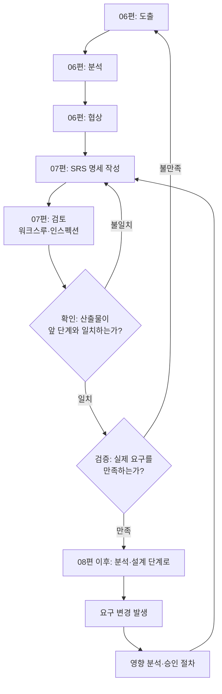

<Callout type="info">
  **이번 문서의 목표:** 이 파일을 다 읽으면 SRS(소프트웨어 요구사항 명세서)가 갖춰야 할 좋은 명세의 품질 기준을 나열할 수 있고, "검증(validation)"과 "확인(verification)"이라는, 시험에서 가장 자주 헷갈려 하는 두 용어를 정확한 질문 형태로 구분할 수 있으며, 개발 도중 요구사항이 바뀌었을 때 이를 통제하는 변경 관리 절차를 설명할 수 있다.
</Callout>

## 왜 요구사항을 문서로 다시 정리해야 하는가

06편에서 도출·분석·협상을 거쳐 확정된 요구사항이라도, 그것이 여러 사람의 머릿속이나 회의록 여기저기에 흩어져 있다면 설계·구현·테스트 단계에서 그대로 참조할 수 없습니다. 개발팀의 여러 사람이 같은 요구사항을 서로 다르게 이해하는 사고를 막으려면, 요구사항을 **하나의 공식 문서**로 정리해 모든 이해관계자가 같은 기준을 보게 해야 합니다. 이 문서가 **SRS**(Software Requirements Specification, 소프트웨어 요구사항 명세서)입니다.

> **쉽게 말하면:** SRS는 "계약서"입니다. 구두로 합의한 내용이 아무리 명확해 보여도, 나중에 "그런 말 한 적 없다"는 다툼을 막으려면 문서로 남겨야 합니다.

## 1. SRS의 구성과 역할

SRS는 06편에서 정리한 기능 요구사항과 비기능 요구사항을 체계적으로 담습니다. 일반적으로 다음과 같은 내용을 포함합니다.

| SRS 구성 항목 | 담는 내용 |
|-----------------|-----------|
| 서론 | 시스템의 목적, 범위, 용어 정의 |
| 전체 설명 | 시스템이 놓일 환경, 사용자 특성, 제약 조건, 가정 |
| 기능 요구사항 | 시스템이 수행해야 할 개별 기능의 목록과 상세 설명 |
| 비기능 요구사항 | 성능, 보안, 신뢰성, 사용성 등 품질 속성 기준 |
| 외부 인터페이스 요구사항 | 사용자, 하드웨어, 소프트웨어, 통신 인터페이스에 대한 규정 |
| 검증 기준 | 각 요구사항이 만족되었는지 판단할 수 있는 기준 |

SRS는 06편의 요구공학 활동(도출·분석·협상)의 결과물이자, 08편 이후에서 다루는 구조적 분석·객체지향 분석·설계 활동의 **입력**이 됩니다. 즉 SRS는 요구공학과 설계 사이를 잇는 다리 역할을 합니다.

## 2. 좋은 명세의 품질 기준

아무 문서나 SRS로 인정받는 것은 아닙니다. IEEE의 소프트웨어 요구사항 명세 표준(예: IEEE 830 계열)에서 제시하는 **좋은 명세의 품질 특성**은 독학사 시험에서 정의를 정확히 구분하라는 형태로 자주 출제됩니다.

- **정확함(correct)**: 명세된 요구사항이 실제로 이해관계자가 원하는 바와 일치해야 합니다.
- **명확함(unambiguous)**: 하나의 요구사항이 오직 하나의 방식으로만 해석되어야 합니다. 여러 사람이 같은 문장을 읽고 서로 다르게 이해한다면 명확하지 않은 것입니다.
- **완전함(complete)**: 시스템이 수행해야 할 모든 기능과, 발생 가능한 예외·오류 상황에 대한 응답까지 빠짐없이 담아야 합니다.
- **일관성(consistent)**: 명세 안의 서로 다른 요구사항끼리 모순되지 않아야 합니다. 한 항목은 "로그인 실패 시 즉시 계정을 잠근다"고 하면서 다른 항목은 "로그인 실패 3회까지는 계정을 잠그지 않는다"고 하면 일관성이 깨진 것입니다.
- **순위가 매겨짐(ranked)**: 요구사항마다 중요도나 안정성(향후 바뀔 가능성)이 표시되어 있어야 합니다. 06편의 우선순위 결정 결과가 여기에 반영됩니다.
- **검증 가능함(verifiable)**: 그 요구사항이 만족되었는지 아닌지를 사람이나 도구가 객관적으로 판단할 수 있는 방법이 있어야 합니다. "사용하기 편해야 한다"는 검증 가능한 표현이 아니지만, "신규 사용자가 별도 안내 없이 5분 이내에 첫 주문을 완료할 수 있어야 한다"는 검증 가능합니다.
- **수정 가능함(modifiable)**: 구조가 체계적으로 정리되어 있어, 일부 요구사항이 바뀌어도 문서 전체를 다시 쓰지 않고 해당 부분만 고칠 수 있어야 합니다.
- **추적 가능함(traceable)**: 각 요구사항이 어디서 비롯되었고(출처), 설계·코드·테스트의 어느 부분과 연결되는지 추적할 수 있어야 합니다.

**자주 틀리는 점**: "완전함"과 "일관성"을 혼동하는 보기가 자주 나옵니다. 완전함은 "빠진 내용이 없는가"를 묻고, 일관성은 "적힌 내용끼리 서로 모순되지 않는가"를 묻습니다. 빠짐없이 다 적었지만 서로 모순되는 내용을 적었다면 완전하지만 일관되지 않은 명세이고, 모순은 없지만 예외 상황을 빠뜨렸다면 일관되지만 불완전한 명세입니다. 이 둘은 독립적인 기준입니다.

> **쉽게 말하면:** 검증 가능함은 "판사가 판결을 내릴 수 있는 조항인가"입니다. "성실히 이행한다"는 조항으로는 재판할 수 없지만, "매월 1일까지 대금을 지급한다"는 조항으로는 재판할 수 있습니다.

## 3. 검토 — 문서가 완성되기 전에 걸러낸다

SRS를 작성한 뒤에는 **검토**(review)를 거칩니다. 검토는 문서를 실행하지 않고 사람이 직접 읽으면서 오류·모호함·누락을 찾아내는 활동입니다. 대표적인 검토 방식은 다음과 같습니다.

- **워크스루(walkthrough)**: 작성자가 동료들에게 문서 내용을 설명하며 함께 훑어보는, 비교적 비형식적인 검토
- **인스펙션(inspection)**: 정해진 역할(진행자, 기록자, 검토자 등)과 정해진 절차를 따르는 공식적인 검토. 발견된 결함을 정량적으로 기록해 이후 품질 지표로 활용합니다(18편의 메트릭과 연결).

검토는 이후 편(13~15편)에서 다루는 **테스트**와 구분해야 합니다. 테스트는 소프트웨어를 실제로 **실행**해 결과를 확인하는 활동이지만, 검토는 문서나 코드를 실행하지 않고 사람이 **읽으면서** 결함을 찾는 활동입니다. 이 구분을 **정적 검토**(static, 실행하지 않음)와 **동적 테스트**(dynamic, 실행함)라는 말로도 표현합니다.

## 4. 검증과 확인 — 시험에서 가장 자주 헷갈리는 한 쌍

**확인**(verification)과 **검증**(validation)은 한글로도, 영어 발음으로도 헷갈리기 쉬운 개념입니다. 독학사 시험은 이 둘을 구분하는 문항을 즐겨 냅니다. 두 개념을 구분하는 가장 확실한 방법은 **각각이 어떤 질문에 답하는지**를 정확히 외우는 것입니다.

| 구분 | 확인(verification) | 검증(validation) |
|------|----------------------|----------------------|
| 핵심 질문 | "제품을 올바르게 만들고 있는가?"(Are we building the product right?) | "올바른 제품을 만들고 있는가?"(Are we building the right product?) |
| 기준으로 삼는 것 | 이전 단계의 산출물(명세서, 설계서) | 실제 사용자의 요구와 필요 |
| 활동 시점 | 각 단계가 끝날 때마다 그 산출물이 앞 단계 산출물과 일치하는지 확인 | 최종 산출물(또는 프로토타입)이 사용자 요구를 실제로 만족하는지 확인 |
| 예시 | 설계서가 SRS의 모든 기능 요구사항을 빠짐없이 반영했는지 점검 | 완성된 화면을 사용자에게 보여주고 실제 업무에 쓸 수 있는지 확인 |

> **쉽게 말하면:** 확인은 "설계도대로 정확히 지었는가"를 보는 것이고, 검증은 "애초에 손님이 원했던 집을 지었는가"를 보는 것입니다. 설계도대로 완벽하게 지었어도(확인 통과), 그 설계도 자체가 손님의 요구와 달랐다면 검증에는 실패한 것입니다.

**자주 틀리는 점**: "검증과 확인은 같은 활동을 가리키는 동의어다"라는 설명은 틀렸습니다. 확인은 **단계 간 일치**를 보고, 검증은 **최종 결과와 실제 요구의 일치**를 봅니다. 또한 "확인이 통과되면 검증도 자동으로 통과된다"는 설명도 틀렸습니다. 앞의 설계도 예시처럼, 각 단계 산출물끼리는 완벽히 일치해도(확인 통과) 애초의 요구 파악 자체가 잘못됐다면 최종 결과는 사용자 요구와 다를 수 있습니다(검증 실패).

## 5. 요구사항 변경 관리 — 확정 이후에도 바뀐다

SRS가 승인되었다고 해서 요구사항이 프로젝트 끝까지 고정되는 것은 아닙니다. 시장 환경, 법 규제, 사용자의 재발견된 필요에 따라 요구사항은 개발 도중에도 바뀔 수 있습니다. 이를 무질서하게 받아들이면 05편에서 본 폭포수 모델의 약점(뒤로 돌아가는 비용)이 그대로 드러나고, 프로젝트 범위가 통제 없이 계속 늘어나는 **범위 크리프**(scope creep) 현상이 벌어집니다. 이를 막기 위한 절차가 **요구사항 변경 관리**(requirements change management)입니다.

<Steps>
1. **변경 요청 접수**: 이해관계자가 변경을 요청하면 정해진 양식으로 접수한다.
2. **영향 분석(impact analysis)**: 이 변경이 다른 요구사항, 설계, 일정, 비용에 어떤 영향을 주는지 분석한다.
3. **변경 통제 위원회 심의**: 17편에서 다루는 형상관리의 변경 통제 절차와 연결되어, 변경을 승인할지 여부를 공식적으로 결정한다.
4. **SRS 갱신과 재배포**: 승인된 변경을 SRS에 반영하고 모든 이해관계자에게 다시 배포한다.
5. **추적성 갱신**: 위 2절의 추적 가능성 기준에 따라 변경된 요구사항과 연결된 설계·코드·테스트 항목을 함께 갱신한다.
</Steps>

**자주 틀리는 점**: "요구사항은 한 번 확정되면 절대 바뀌어서는 안 된다"는 태도는 소프트웨어공학이 지향하는 방향이 아닙니다. 소프트웨어공학은 변경을 막는 것이 아니라, 변경을 **통제된 절차**를 거쳐 받아들이는 것을 목표로 합니다. 통제 없이 받아들이는 것(무분별한 범위 크리프)과, 절차를 거쳐 받아들이는 것(변경 관리)을 구분해야 합니다.

## 6. 06편부터 이어지는 요구공학 전체 흐름

이 그림에서 확인(F)이 실패하면 명세 작성으로 돌아가고, 검증(G)이 실패하면 요구 도출 자체로 돌아간다는 점이 두 개념의 차이를 다시 보여줍니다. 확인 실패는 "문서화를 잘못한 것"이고, 검증 실패는 "애초에 요구 파악 자체가 잘못된 것"이기 때문입니다.

## 핵심 정리

- SRS는 요구공학 활동의 결과물이자 분석·설계 단계의 입력이며, 정확함·명확함·완전함·일관성·순위·검증 가능함·수정 가능함·추적 가능함을 품질 기준으로 갖춰야 한다.
- 검토(워크스루, 인스펙션)는 문서를 실행하지 않고 읽으며 결함을 찾는 정적 활동으로, 실행 기반의 테스트와 구분된다.
- 확인(verification)은 "제품을 올바르게 만들고 있는가"를, 검증(validation)은 "올바른 제품을 만들고 있는가"를 묻는다. 확인 통과가 검증 통과를 보장하지 않는다.
- 요구사항 변경은 변경 요청, 영향 분석, 승인 심의, SRS 갱신, 추적성 갱신의 절차를 거쳐 통제된 방식으로 반영해야 하며, 통제 없이 범위가 늘어나는 현상을 범위 크리프라고 한다.

## 마무리 복습

<Quiz
  questionNumber={1}
  question="SRS(소프트웨어 요구사항 명세서)의 역할에 대한 설명으로 가장 적절한 것은?"
  options={['SRS는 프로젝트 종료 후에만 작성하는 보고용 문서다.', 'SRS는 요구공학 활동의 결과물이며 이후 분석·설계 단계의 입력이 된다.', 'SRS에는 기능 요구사항만 담고 비기능 요구사항은 별도로 관리한다.', 'SRS는 개발팀 내부에서만 열람하고 고객에게는 공개하지 않는다.']}
  correctAnswer={2}
  explanation="SRS는 도출·분석·협상을 거쳐 확정된 요구사항을 정리한 문서로, 이후 분석·설계 단계에서 입력 자료로 활용된다."
  optionExplanations={['SRS는 개발 초기, 분석·설계 이전에 작성되는 문서다.', '정답. SRS는 요구공학의 결과물이자 후속 단계의 입력이다.', 'SRS는 기능 요구사항과 비기능 요구사항을 함께 담는 문서다.', 'SRS는 고객을 포함한 이해관계자가 함께 확인해야 하는 공식 문서다.']}
/>

<Quiz
  questionNumber={2}
  question="좋은 요구사항 명세의 품질 기준 중 '검증 가능함(verifiable)'에 대한 설명으로 가장 적절한 것은?"
  options={['요구사항이 서로 모순되지 않아야 한다는 기준이다.', '요구사항이 만족되었는지를 사람이나 도구가 객관적으로 판단할 수 있어야 한다는 기준이다.', '요구사항에 순위나 중요도가 표시되어 있어야 한다는 기준이다.', '요구사항이 시스템의 모든 기능과 예외 상황을 빠짐없이 담아야 한다는 기준이다.']}
  correctAnswer={2}
  explanation="검증 가능함은 특정 요구사항이 실제로 만족되었는지 객관적으로 판단할 수 있는 방법이 있어야 한다는 품질 기준이다."
  optionExplanations={['이 설명은 일관성(consistent)에 대한 것이다.', '정답. 검증 가능함의 정의와 일치한다.', '이 설명은 순위가 매겨짐(ranked)에 대한 것이다.', '이 설명은 완전함(complete)에 대한 것이다.']}
/>

<Quiz
  questionNumber={3}
  question="확인(verification)과 검증(validation)에 대한 설명으로 옳지 않은 것은?"
  options={['확인은 제품을 올바르게 만들고 있는가를 묻는다.', '검증은 올바른 제품을 만들고 있는가를 묻는다.', '확인이 통과되면 검증도 반드시 통과된다.', '확인은 이전 단계 산출물과의 일치를, 검증은 실제 사용자 요구와의 일치를 기준으로 삼는다.']}
  correctAnswer={3}
  explanation="설계서가 명세서와 완벽히 일치해도(확인 통과) 애초의 요구 파악 자체가 잘못되었다면 최종 결과는 사용자 요구와 다를 수 있으므로, 확인 통과가 검증 통과를 보장한다는 설명은 옳지 않다."
  optionExplanations={['옳은 설명이다. 확인의 핵심 질문이다.', '옳은 설명이다. 검증의 핵심 질문이다.', '옳지 않은 설명이므로 정답이다. 확인 통과가 검증 통과를 보장하지 않는다.', '옳은 설명이다. 두 활동이 기준으로 삼는 대상의 차이다.']}
/>

<Quiz
  questionNumber={4}
  question="워크스루(walkthrough)와 인스펙션(inspection)에 대한 설명으로 가장 적절한 것은?"
  options={['두 방식 모두 소프트웨어를 실행해 결과를 확인하는 동적 테스트 기법이다.', '워크스루는 정해진 역할과 절차를 따르는 공식적인 검토이고, 인스펙션은 비형식적인 검토다.', '인스펙션은 정해진 역할과 절차를 따르는 공식적인 검토로 결함을 정량적으로 기록한다.', '워크스루와 인스펙션은 모두 요구사항 변경 관리 절차에서만 쓰이는 용어다.']}
  correctAnswer={3}
  explanation="인스펙션은 진행자, 기록자, 검토자 등 정해진 역할과 절차를 따르는 공식적인 검토 방식으로, 발견한 결함을 정량적으로 기록한다."
  optionExplanations={['워크스루와 인스펙션은 문서를 실행하지 않고 읽으며 결함을 찾는 정적 검토 기법이다.', '워크스루와 인스펙션의 형식성 정도 설명이 서로 뒤바뀌었다.', '정답. 인스펙션은 공식적 절차를 따르는 검토 방식이다.', '두 용어는 SRS 검토를 포함해 다양한 산출물 검토에 쓰이는 일반적인 용어다.']}
/>

<Quiz
  questionNumber={5}
  question="요구사항 변경 관리에 대한 설명으로 옳지 않은 것은?"
  options={['변경 요청이 접수되면 다른 요구사항과 일정·비용에 미치는 영향을 분석해야 한다.', '통제 없이 요구사항 범위가 계속 늘어나는 현상을 범위 크리프라고 한다.', '요구사항은 한 번 SRS로 확정되면 프로젝트가 끝날 때까지 절대 변경해서는 안 된다.', '승인된 변경은 SRS에 반영한 뒤 관련된 설계·코드·테스트 항목의 추적성도 갱신해야 한다.']}
  correctAnswer={3}
  explanation="소프트웨어공학은 요구사항 변경을 무조건 금지하는 것이 아니라, 영향 분석과 승인 절차를 거쳐 통제된 방식으로 받아들이는 것을 목표로 한다."
  optionExplanations={['옳은 설명이다. 영향 분석은 변경 관리 절차의 핵심 단계다.', '옳은 설명이다. 범위 크리프의 정의와 일치한다.', '옳지 않은 설명이므로 정답이다. 변경은 통제된 절차를 거쳐 받아들여야 하며 무조건 금지 대상이 아니다.', '옳은 설명이다. 추적성 갱신은 변경 관리의 마지막 단계다.']}
/>

<Quiz
  questionNumber={6}
  question="SRS 명세의 품질 기준 중 '완전함(complete)'과 '일관성(consistent)'의 관계에 대한 설명으로 가장 적절한 것은?"
  options={['완전함과 일관성은 항상 함께 만족되거나 함께 위반되는 하나의 기준이다.', '빠짐없이 작성했지만 항목끼리 서로 모순되는 명세는 완전하지만 일관되지 않을 수 있다.', '완전함은 문서의 형식을, 일관성은 문서의 분량을 평가하는 기준이다.', '일관성은 검증(validation) 활동에서만 사용되는 용어이며 명세 품질 기준과 무관하다.']}
  correctAnswer={2}
  explanation="완전함은 빠진 내용이 없는지를, 일관성은 적힌 내용끼리 모순이 없는지를 독립적으로 평가하는 기준이므로, 빠짐없이 작성했더라도 항목 간에 모순이 있으면 완전하지만 일관되지 않은 명세가 될 수 있다."
  optionExplanations={['두 기준은 서로 독립적으로 평가되는 별개의 품질 기준이다.', '정답. 완전함과 일관성은 독립적인 기준이라 이런 조합이 가능하다.', '완전함과 일관성 모두 명세 내용의 충분성과 모순 여부를 다루는 기준이지 형식이나 분량을 다루지 않는다.', '일관성은 SRS 자체의 품질 기준이며 검증 활동에 국한되지 않는다.']}
/>

## 참고 자료

- [SWEBOK topics 상세](https://www.computer.org/education/bodies-of-knowledge/software-engineering/topics)
- [SFIA v9 and SWEBOK v4 매핑 자료](https://sfia-online.org/en/tools-and-resources/bodies-of-knowledge/swebok-software-engineering-body-of-knowledge/swebok4-sfia9-the-guide-to-the-software-engineering-body-of-knowledge)
