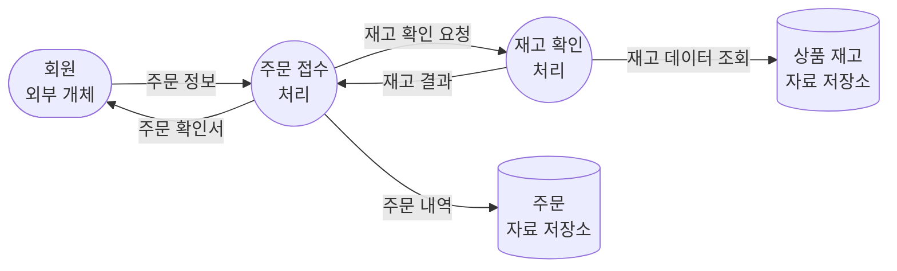
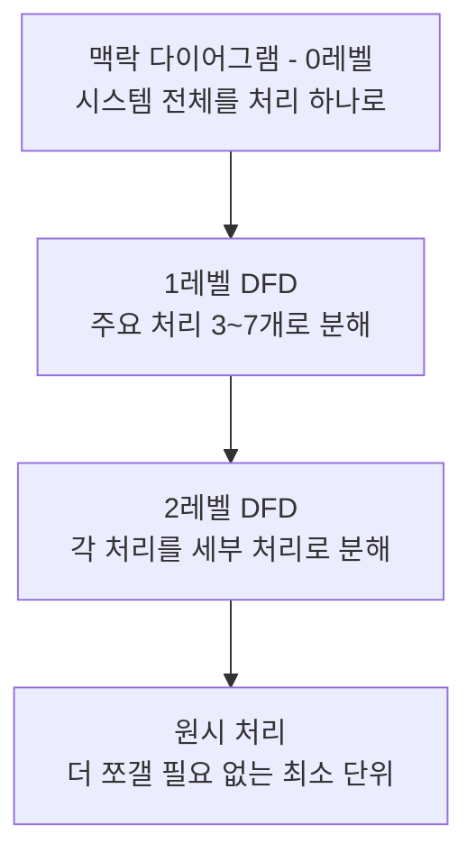

<Callout type="info">
  **이번 문서의 목표:** 이 파일을 다 읽으면 구조적 분석이 시스템을 "기능과 자료의 흐름" 관점에서 모델링하는 접근임을 설명할 수 있고, DFD(자료흐름도)를 레벨별로 그리고 읽을 수 있으며, 자료사전이 DFD의 각 기호를 어떻게 구체화하는지, 그리고 DFD와 ERD가 서로 다른 것을 모델링한다는 점을 구분할 수 있다.
</Callout>

## 왜 요구사항을 "그림"으로도 표현해야 하는가

07편에서 완성한 SRS는 문장으로 된 명세입니다. 그런데 문장만으로는 "데이터가 시스템 안에서 어떤 순서로, 어느 처리 과정을 거쳐 흘러가는지"를 한눈에 파악하기 어렵습니다. 특히 여러 처리 단계와 저장소를 거치는 복잡한 업무일수록, 글로 나열된 요구사항을 읽는 사람마다 머릿속에 그리는 그림이 달라질 위험이 커집니다. 이 문제를 해결하기 위해 1970년대에 등장한 접근이 **구조적 분석**(structured analysis)입니다. 시스템을 **기능**(무엇을 하는가)과 **자료 흐름**(데이터가 어떻게 이동하는가)을 중심으로 그림과 표로 모델링해, 모든 이해관계자가 같은 그림을 보고 이야기할 수 있게 합니다.

> **쉽게 말하면:** 구조적 분석은 "물류 창고의 컨베이어 벨트 배치도를 그리는 것"과 같습니다. 상자(데이터)가 어느 기계(처리)를 거쳐 어느 창고(저장소)로 가는지 그림으로 보면, 글로 설명하는 것보다 훨씬 빠르게 전체 흐름을 이해할 수 있습니다.

09편에서 다루는 객체지향 분석과 이 편의 구조적 분석은 같은 목표(요구사항을 분석해 설계로 넘길 모델을 만드는 것)를 서로 다른 관점으로 접근합니다. 구조적 분석은 "기능이 무엇을 처리하는가"에서 출발하고, 객체지향 분석은 "어떤 객체들이 어떤 책임을 나눠 갖는가"에서 출발합니다. 이 차이는 09편에서 자세히 비교합니다.

## 1. DFD — 자료가 흐르는 지도

**DFD**(Data Flow Diagram, 자료흐름도)는 구조적 분석의 핵심 도구로, 시스템 안에서 데이터가 어떤 처리를 거쳐 어디로 흘러가는지를 그림으로 표현합니다. DFD는 정해진 네 가지 기호만으로 구성됩니다.

| 기호 | 이름 | 뜻 |
|------|------|-----|
| 원(circle) 또는 둥근 사각형 | 처리(process) | 입력받은 자료를 가공해 출력하는 기능 단위 |
| 화살표(arrow) | 자료 흐름(data flow) | 처리·저장소·외부 개체 사이를 이동하는 데이터 |
| 평행선 또는 열린 사각형 | 자료 저장소(data store) | 데이터가 잠시 또는 계속 보관되는 곳(파일, 데이터베이스 테이블) |
| 사각형(square) | 외부 개체(external entity) | 시스템 경계 밖에서 데이터를 주고받는 사람이나 조직, 다른 시스템 |



**자주 틀리는 점**: DFD의 화살표는 데이터의 이동만 표현하며, "제어 흐름"(어떤 순서로 실행되는가, 조건 분기)을 표현하지 않습니다. "이 처리가 먼저 실행되고 저 처리가 나중에 실행된다"는 순서 정보는 DFD로 알 수 없습니다. DFD가 알려주는 것은 오직 "이 데이터는 이 처리를 거쳐 저 저장소로 간다"는 흐름뿐입니다. 이 점을 "DFD는 프로그램의 실행 순서도(흐름도, flowchart)와 같다"고 착각하면 안 됩니다. 둘은 표현 대상이 다른 별개의 도구입니다.

## 2. DFD의 레벨 — 점점 자세히 쪼개기

시스템 전체를 하나의 DFD에 다 담으면 기호가 너무 많아져 오히려 알아보기 어렵습니다. 그래서 DFD는 **하향식으로 단계를 나눠**(leveling) 그립니다.

- **맥락 다이어그램(context diagram, 0레벨)**: 전체 시스템을 처리 기호 단 하나로 표현하고, 그 시스템과 데이터를 주고받는 외부 개체만 함께 보여줍니다. 시스템의 경계(무엇이 시스템 안이고 무엇이 밖인지)를 확정하는 것이 목적입니다.
- **1레벨 DFD**: 맥락 다이어그램의 시스템 하나를 몇 개의 주요 처리로 나눠 보여줍니다. 위 1절 그림처럼 "주문 접수", "재고 확인" 같은 굵직한 처리 단위가 등장합니다.
- **2레벨 이하 DFD**: 1레벨의 각 처리를 다시 더 세부적인 처리로 쪼갭니다. 필요한 만큼 계속 세분화할 수 있으며, 더 이상 쪼갤 필요가 없을 만큼 구체적인 처리를 **원시 처리**(primitive process)라고 부릅니다.



**자주 틀리는 점**: 레벨이 내려갈수록(더 세분화될수록) 상위 레벨에서 그 처리로 드나들던 자료 흐름의 **총합은 변하지 않아야** 합니다. 이를 **균형 유지**(balancing)라고 합니다. 예를 들어 1레벨의 "주문 접수" 처리에 들어오는 화살표가 "주문 정보" 하나였다면, 이 처리를 2레벨로 쪼갰을 때도 바깥에서 그 처리 그룹으로 들어오는 자료 흐름의 총합은 "주문 정보" 하나와 일치해야 합니다. 세분화 과정에서 상위 레벨에 없던 외부 자료 흐름이 갑자기 추가되면 균형이 깨진 것이며, 이는 시험에서 "DFD 작성 원칙 위반"을 고르라는 문항의 단골 소재입니다.

## 3. 자료사전 — 그림에 채우는 정확한 뜻

DFD는 "무엇이 어디로 흐르는지"는 보여주지만, 그 데이터가 정확히 어떤 항목들로 구성되어 있는지는 그림만으로 알 수 없습니다. "주문 정보"라는 화살표 하나가 실제로 회원 번호, 상품 목록, 배송지, 결제 수단 중 무엇을 포함하는지는 별도로 정의해야 합니다. 이 역할을 하는 것이 **자료사전**(data dictionary)입니다. 자료사전은 DFD에 등장하는 모든 자료 흐름, 자료 저장소, 처리의 이름을 표준화된 표기법으로 정의한 목록입니다.

| 자료사전 표기 기호 | 의미 |
|----------------------|------|
| `=` | 구성됨(is composed of) |
| `+` | 그리고(and) |
| `[ \| ]` | 또는(하나만 선택) |
| `{ }` | 반복(iteration) |
| `( )` | 선택적(optional, 있어도 되고 없어도 됨) |

예를 들어 "주문 정보"라는 자료 흐름은 자료사전에 다음과 같이 정의할 수 있습니다.

```text
주문 정보 = 회원번호 + 주문일자 + {상품코드 + 수량} + 배송지 + (요청사항)
```

이 정의는 주문 정보가 회원번호와 주문일자, 하나 이상 반복될 수 있는 상품코드·수량 쌍, 배송지를 반드시 포함하고, 요청사항은 있어도 되고 없어도 된다는 뜻입니다.

> **쉽게 말하면:** DFD가 "택배 상자가 어느 트럭을 거쳐 어느 창고로 가는지 그린 지도"라면, 자료사전은 "그 상자 안에 정확히 무엇이 몇 개 들어있는지 적은 송장"입니다. 지도만 봐서는 상자 속을 알 수 없고, 송장만 봐서는 이동 경로를 알 수 없습니다. 둘은 함께 있어야 완전한 정보가 됩니다.

**자주 틀리는 점**: "자료사전은 DFD 없이도 단독으로 시스템의 자료 흐름을 표현할 수 있는 도구다"라는 설명은 틀렸습니다. 자료사전은 DFD에 이미 등장한 이름들을 정의하는 **보조 도구**이지, 흐름 자체를 표현하는 도구가 아닙니다. 흐름은 DFD가, 내용은 자료사전이 맡는다는 역할 분담을 기억해야 합니다.

## 4. DFD와 ERD — 서로 다른 것을 모델링한다

**ERD**(Entity-Relationship Diagram, 개체-관계도)는 데이터베이스 과목에서 주로 다루는 도구지만, 구조적 분석에서도 자료 저장소의 구조를 설계할 때 함께 쓰입니다. DFD와 ERD는 이름이 비슷해 보이지만 모델링하는 대상이 전혀 다릅니다.

| 구분 | DFD | ERD |
|------|-----|-----|
| 모델링 대상 | 데이터의 흐름과 그 흐름을 만드는 처리(동적 관점) | 데이터 사이의 구조적 관계(정적 관점) |
| 핵심 질문 | "데이터가 어떤 처리를 거쳐 어디로 이동하는가?" | "이 데이터와 저 데이터는 어떤 관계로 연결되는가?" |
| 구성 요소 | 처리, 자료 흐름, 자료 저장소, 외부 개체 | 개체(entity), 속성(attribute), 관계(relationship) |
| 결과물의 활용 | 기능 분해와 자료 흐름 이해, 프로세스 설계의 토대 | 데이터베이스 테이블 설계의 토대 |

**자주 틀리는 점**: "DFD의 자료 저장소 기호가 곧 ERD의 개체와 완전히 같은 것이다"라는 설명은 지나친 단순화입니다. DFD의 자료 저장소는 "데이터가 어딘가에 저장된다"는 사실만 나타낼 뿐, 그 저장소 내부의 구조(어떤 속성들이 있고 다른 저장소와 어떤 관계를 맺는지)까지는 보여주지 않습니다. 그 내부 구조를 상세히 규정하는 것이 ERD의 역할입니다. 즉 DFD의 자료 저장소 하나가 ERD에서는 여러 개의 개체와 관계로 확장되어 표현될 수 있습니다.

## 5. 구조적 분석의 목적과 한계

구조적 분석은 시스템을 **기능 단위로 하향식 분해**(top-down decomposition)하면서 자료 흐름을 명확히 하는 데 강점이 있습니다. 특히 처리 로직이 명확하고 데이터 흐름이 비교적 단순한 사무 자동화, 정보 처리 시스템에 적합합니다.

그러나 다음과 같은 한계도 있습니다.

- **데이터와 처리의 분리**: DFD는 처리(기능)와 데이터(자료 흐름·저장소)를 별개의 기호로 다루기 때문에, 데이터와 그 데이터를 다루는 로직을 하나로 묶어 재사용하기 어렵습니다. 이는 09편에서 다루는 객체지향 접근이 캡슐화로 해결하려는 지점입니다.
- **요구사항 변경에 대한 유연성 부족**: 기능 중심으로 하향 분해된 구조는, 요구사항이 바뀌어 기능 자체의 경계가 달라지면 여러 레벨의 DFD를 동시에 다시 그려야 하는 부담이 있습니다.
- **대규모 객체지향 시스템 표현의 한계**: 상속·다형성처럼 09~10편에서 다루는 객체지향 개념은 DFD의 네 가지 기호만으로는 표현하기 어렵습니다.

**자주 틀리는 점**: "구조적 분석은 오래된 기법이라 현재는 전혀 쓰이지 않는다"는 극단적인 설명은 옳지 않습니다. 구조적 분석은 특히 데이터 흐름이 중심인 시스템(예: 급여 처리, 재고 관리처럼 절차적 로직이 뚜렷한 업무)을 분석할 때 지금도 유효하게 쓰이는 접근입니다. 시험에서 "완전히 대체되었다", "전혀 쓸모없다"처럼 단정하는 보기는 오답일 가능성이 높습니다.

## 핵심 정리

- 구조적 분석은 시스템을 기능과 자료 흐름 중심으로 모델링하는 접근이며, DFD가 그 핵심 도구다.
- DFD는 처리, 자료 흐름, 자료 저장소, 외부 개체 네 가지 기호로 구성되며 제어 흐름(실행 순서)은 표현하지 않는다.
- DFD는 맥락 다이어그램(0레벨)부터 시작해 하향식으로 세분화하며, 레벨이 바뀌어도 자료 흐름의 총합이 같아야 한다는 균형 유지 원칙을 지켜야 한다.
- 자료사전은 DFD에 등장하는 자료의 정확한 구성을 정의하는 보조 도구이며, 단독으로 흐름을 표현하지는 않는다.
- DFD는 자료의 흐름(동적 관점)을, ERD는 자료 사이의 관계(정적 관점)를 모델링하며 서로 다른 목적을 갖는다.
- 구조적 분석은 데이터와 처리가 분리되어 재사용이 어렵다는 한계가 있으며, 이는 09편의 객체지향 접근과 대비된다.

## 마무리 복습

<Quiz
  questionNumber={1}
  question="DFD(자료흐름도)의 기본 구성 요소가 아닌 것은?"
  options={['처리(process)', '자료 흐름(data flow)', '자료 저장소(data store)', '클래스(class)']}
  correctAnswer={4}
  explanation="DFD는 처리, 자료 흐름, 자료 저장소, 외부 개체의 네 가지 기호로만 구성되며, 클래스는 09~10편의 객체지향 분석·UML에서 다루는 개념이다."
  optionExplanations={['처리는 DFD의 기본 구성 요소다.', '자료 흐름은 DFD의 기본 구성 요소다.', '자료 저장소는 DFD의 기본 구성 요소다.', '정답. 클래스는 객체지향 분석의 구성 요소이며 DFD의 구성 요소가 아니다.']}
/>

<Quiz
  questionNumber={2}
  question="DFD에 대한 설명으로 옳지 않은 것은?"
  options={['DFD의 화살표는 데이터가 이동하는 흐름을 나타낸다.', 'DFD는 처리가 실행되는 순서와 조건 분기를 표현하는 도구다.', '외부 개체는 시스템 경계 밖에서 데이터를 주고받는 사람이나 조직을 나타낸다.', '자료 저장소는 데이터가 잠시 또는 계속 보관되는 곳을 나타낸다.']}
  correctAnswer={2}
  explanation="DFD는 데이터의 흐름만을 표현하며, 처리의 실행 순서나 조건 분기 같은 제어 흐름은 DFD로 표현하지 않는다."
  optionExplanations={['옳은 설명이다. 화살표는 자료 흐름을 나타낸다.', '옳지 않은 설명이므로 정답이다. DFD는 제어 흐름을 표현하지 않는다.', '옳은 설명이다. 외부 개체의 정의와 일치한다.', '옳은 설명이다. 자료 저장소의 정의와 일치한다.']}
/>

<Quiz
  questionNumber={3}
  question="DFD의 레벨링(leveling)과 균형 유지(balancing)에 대한 설명으로 가장 적절한 것은?"
  options={['맥락 다이어그램은 시스템 내부의 모든 세부 처리를 한 번에 보여준다.', '하위 레벨로 세분화할 때 상위 레벨에 없던 외부 자료 흐름이 새로 추가되어도 무방하다.', '레벨이 세분화되어도 해당 처리 그룹으로 드나드는 자료 흐름의 총합은 상위 레벨과 같아야 한다.', '더 이상 쪼갤 필요가 없는 최소 단위의 처리는 존재하지 않는다.']}
  correctAnswer={3}
  explanation="레벨을 세분화하는 과정에서도 그 처리 그룹으로 드나드는 자료 흐름의 총합은 상위 레벨과 일치해야 하며, 이를 균형 유지 원칙이라고 한다."
  optionExplanations={['맥락 다이어그램은 시스템 전체를 처리 하나로 표현하는 0레벨 다이어그램이다.', '외부 자료 흐름이 상위 레벨과 다르게 추가되면 균형 유지 원칙에 위배된다.', '정답. 균형 유지 원칙에 대한 정확한 설명이다.', '더 이상 쪼갤 필요가 없는 최소 단위를 원시 처리라고 부른다.']}
/>

<Quiz
  questionNumber={4}
  question="자료사전(data dictionary)에 대한 설명으로 옳지 않은 것은?"
  options={['DFD에 등장하는 자료 흐름과 저장소의 구성 항목을 표준 표기법으로 정의한다.', '자료사전은 DFD 없이도 단독으로 시스템의 자료 흐름 경로를 완전히 표현할 수 있다.', '반복되는 항목은 중괄호로, 선택적 항목은 소괄호로 표기하는 방식이 일반적이다.', 'DFD의 화살표 이름이 실제로 어떤 데이터 항목들로 구성되는지 구체화하는 역할을 한다.']}
  correctAnswer={2}
  explanation="자료사전은 DFD에 이미 등장한 이름들의 구성 내용을 정의하는 보조 도구이며, 흐름 경로 자체를 표현하는 도구는 DFD이므로 단독으로 흐름을 완전히 표현한다는 설명은 옳지 않다."
  optionExplanations={['옳은 설명이다. 자료사전의 기본 역할이다.', '옳지 않은 설명이므로 정답이다. 자료사전은 DFD의 보조 도구일 뿐 흐름 자체를 표현하지 않는다.', '옳은 설명이다. 자료사전 표기법과 일치한다.', '옳은 설명이다. 자료사전의 목적과 일치한다.']}
/>

<Quiz
  questionNumber={5}
  question="DFD와 ERD의 차이에 대한 설명으로 가장 적절한 것은?"
  options={['DFD는 데이터 사이의 정적인 관계를, ERD는 데이터의 동적인 흐름을 모델링한다.', 'DFD는 데이터의 흐름과 처리를, ERD는 데이터 사이의 구조적 관계를 모델링한다.', 'DFD와 ERD는 동일한 기호 체계를 사용하는 같은 도구다.', 'DFD의 자료 저장소 기호는 ERD 없이도 내부 속성과 관계를 완전히 표현한다.']}
  correctAnswer={2}
  explanation="DFD는 데이터의 흐름과 그 흐름을 만드는 처리를 동적 관점에서, ERD는 데이터 사이의 구조적 관계를 정적 관점에서 모델링한다."
  optionExplanations={['DFD와 ERD가 모델링하는 관점 설명이 서로 뒤바뀌었다.', '정답. DFD는 동적 흐름, ERD는 정적 관계를 모델링한다.', '두 도구는 서로 다른 기호 체계와 목적을 가진 별개의 모델링 도구다.', 'DFD의 자료 저장소는 저장 사실만 나타낼 뿐 내부 속성과 관계는 ERD로 별도 규정해야 한다.']}
/>

<Quiz
  questionNumber={6}
  question="구조적 분석의 목적과 한계에 대한 설명으로 옳지 않은 것은?"
  options={['구조적 분석은 시스템을 기능 단위로 하향식 분해하며 자료 흐름을 명확히 하는 데 강점이 있다.', '구조적 분석은 데이터와 그 데이터를 다루는 처리 로직을 분리해 다루므로 재사용에 한계가 있을 수 있다.', '구조적 분석은 현재 시점에서 완전히 대체되어 어떤 상황에서도 전혀 사용되지 않는다.', '데이터 흐름이 중심인 절차적 업무를 분석할 때는 구조적 분석이 여전히 유효하게 쓰인다.']}
  correctAnswer={3}
  explanation="구조적 분석은 데이터 흐름이 뚜렷한 절차적 업무 분석에 지금도 유효하게 쓰이는 접근이므로, 완전히 대체되어 전혀 사용되지 않는다는 설명은 옳지 않다."
  optionExplanations={['옳은 설명이다. 구조적 분석의 대표적 강점이다.', '옳은 설명이다. 데이터와 처리 분리는 구조적 분석의 한계로 지적된다.', '옳지 않은 설명이므로 정답이다. 구조적 분석은 지금도 특정 상황에서 유효하게 쓰인다.', '옳은 설명이다. 절차적 로직이 뚜렷한 업무에는 구조적 분석이 적합하다.']}
/>

## 참고 자료

- [SWEBOK topics 상세](https://www.computer.org/education/bodies-of-knowledge/software-engineering/topics)
- [SWEBOK PDF 요약본](https://cursa.ihmc.us/rid=1K3W9B5S9-YC444R-2K9Y/SWEBOK.pdf)
