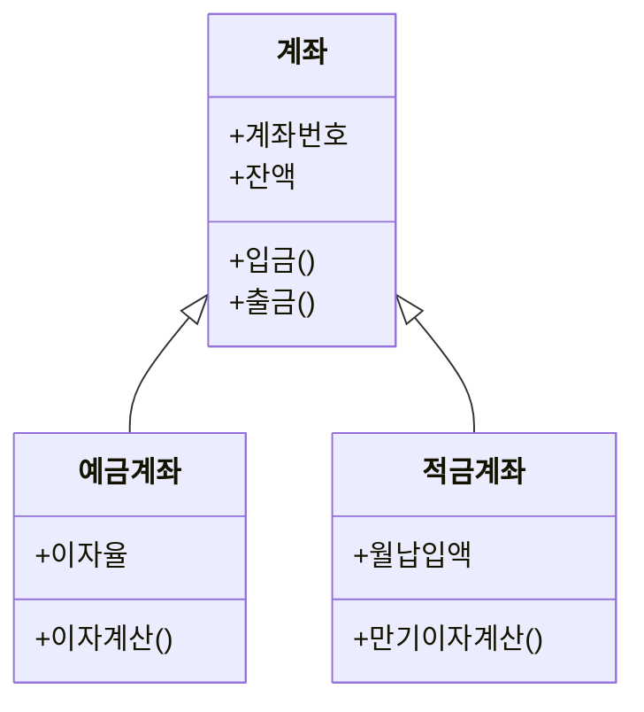

<Callout type="info">
  **이번 문서의 목표:** 이 파일을 다 읽으면 클래스와 객체가 왜 다른 개념인지 정면으로 설명할 수 있고, 캡슐화·상속·다형성이 각각 무엇을 감추고 무엇을 재사용하고 무엇을 유연하게 만드는지 구분할 수 있으며, 객체지향 설계에서 "책임을 어떻게 나누는가"라는 질문에 원리 수준으로 답할 수 있다.
</Callout>

## 왜 "객체" 중심으로 다시 분석하는가

08편에서 다룬 구조적 분석(structured analysis)은 시스템을 "무엇을 할 것인가"라는 **기능**(function) 중심으로 쪼갭니다. 자료흐름도(DFD)는 데이터가 어떤 처리(process)를 거쳐 어떻게 흘러가는지를 그립니다. 그런데 기능 중심 분석에는 약점이 있습니다. 은행 시스템에서 "계좌"라는 대상은 입금·출금·이체·이자계산이라는 여러 기능에 걸쳐 반복해서 등장하는데, 기능 중심으로 나누면 계좌에 관한 데이터와 그 데이터를 다루는 로직이 여러 기능(프로세스) 조각에 흩어지기 쉽습니다. 요구사항이 바뀌어 "계좌" 개념 자체가 조금 달라지면, 그 계좌를 참조하는 모든 기능 조각을 일일이 찾아 고쳐야 합니다.

**객체지향**(object-oriented, OO) 패러다임은 시각을 뒤집습니다. "무엇을 하는가"가 아니라 "무엇이 존재하는가"부터 묻습니다. 계좌, 고객, 거래 같은 현실 세계의 대상(객체)을 먼저 식별하고, 그 대상이 가진 데이터와 그 데이터를 다루는 절차를 하나의 단위로 묶습니다. 그러면 "계좌" 개념이 바뀌어도 그 변경은 계좌 객체 하나에만 영향을 미치도록 가둘 수 있습니다.

> **쉽게 말하면:** 구조적 분석이 "이 공장에서 어떤 작업(공정)이 일어나는가"를 그리는 것이라면, 객체지향 분석은 "이 공장에 어떤 부품(사물)이 있고, 각 부품이 스스로 무엇을 할 수 있는가"부터 정리하는 것입니다.

## 1. 클래스와 객체 — 설계도와 실체

**클래스**(class)는 어떤 종류의 대상이 어떤 데이터(속성)와 어떤 동작(메서드)을 가지는지 정의한 **설계도**입니다. 클래스 자체는 메모리에 실체를 가지지 않는 틀입니다.

**객체**(object)는 그 클래스의 정의에 따라 실제로 메모리에 만들어진 구체적인 **실체**(instance, 인스턴스)입니다. "계좌"라는 클래스에서 "홍길동의 계좌"와 "김철수의 계좌"라는 두 개의 서로 다른 객체가 만들어질 수 있습니다.

| 구분 | 클래스(class) | 객체(object) |
|------|----------------|----------------|
| 성격 | 속성·메서드를 정의하는 설계도 | 클래스로부터 만들어진 실체 |
| 메모리 | 실행 전에는 메모리를 차지하지 않는 정의 | 생성되는 순간 메모리를 차지 |
| 개수 | 하나의 정의 | 같은 클래스에서 여러 개 생성 가능 |
| 예시 | 계좌(Account) | 홍길동의 계좌, 김철수의 계좌 |

객체가 가지는 데이터를 **속성**(attribute, 필드)이라 하고, 객체가 수행할 수 있는 동작을 **메서드**(method, 연산)라고 합니다. 계좌 객체라면 잔액(balance)이 속성이고, 입금(deposit)·출금(withdraw)이 메서드입니다.

**자주 틀리는 점**: "클래스와 객체는 같은 말을 상황에 따라 다르게 부르는 것뿐이다"는 오답입니다. 클래스는 하나의 정의이고, 객체는 그 정의로부터 만들어진, 서로 독립된 상태(예: 서로 다른 잔액)를 가지는 실체입니다.

## 2. 객체지향의 세 가지 핵심 성질

독학사 시험에서 "다음 중 객체지향의 특징이 아닌 것은?" 유형으로 가장 많이 등장하는 세 가지 성질을 정면으로 구분합니다.

### 2-1. 캡슐화 — 감추고 묶는다

**캡슐화**(encapsulation)는 객체의 속성(데이터)과 그 속성을 다루는 메서드를 하나로 묶고, 객체 외부에서는 내부 데이터에 직접 접근하지 못하게 감추는 성질입니다. 외부에서는 오직 그 객체가 공개한 메서드를 통해서만 데이터에 접근할 수 있습니다. 이렇게 내부 구현을 감추는 것을 **정보 은닉**(information hiding)이라고 부르며, 캡슐화는 정보 은닉을 실현하는 구체적인 방법입니다.

계좌 객체의 잔액(balance)을 외부에서 직접 마이너스(-) 값으로 바꿔버릴 수 있다면, 계좌는 순식간에 비정상적인 상태가 될 수 있습니다. 캡슐화된 계좌 객체는 잔액을 외부에 직접 노출하지 않고, 오직 입금·출금이라는 메서드를 통해서만 잔액을 바꾸게 하여, 그 메서드 안에서 "잔액이 0 밑으로 내려갈 수 없다" 같은 규칙을 강제할 수 있습니다.

> **쉽게 말하면:** 캡슐화는 "약 상자에 뚜껑을 덮어 두고, 정해진 배출구로만 약이 나오게 하는 것"입니다. 상자 옆면을 뜯어 아무 약이나 손으로 집어 가지 못하게 막아, 항상 정해진 절차(메서드)를 거치게 합니다.

### 2-2. 상속 — 이미 있는 것을 물려받는다

**상속**(inheritance)은 이미 정의된 클래스(부모 클래스, 상위 클래스)의 속성과 메서드를 다른 클래스(자식 클래스, 하위 클래스)가 그대로 물려받아 재사용하는 성질입니다. "예금계좌"와 "적금계좌"가 모두 "계좌 번호", "잔액", "입금" 메서드를 공통으로 가진다면, 이 공통 부분을 "계좌"라는 부모 클래스에 한 번만 정의하고, 예금계좌·적금계좌는 계좌를 상속받아 각자 필요한 부분(이자 계산 방식 등)만 추가로 정의합니다.

상속은 코드(또는 설계)의 중복을 줄이는 대표적인 재사용 수단입니다. 다만 상속을 과도하게 여러 단계로 깊게 쌓으면(부모의 부모의 부모…), 어느 조상 클래스를 고쳤을 때 그 영향이 예상하지 못한 먼 자식 클래스까지 퍼지는 부작용이 생길 수 있습니다.

**자주 틀리는 점**: "상속은 부모 클래스가 자식 클래스의 기능을 물려받는 것이다"는 방향이 뒤바뀐 오답입니다. 물려받는 쪽은 언제나 자식(하위) 클래스이고, 물려주는 쪽이 부모(상위) 클래스입니다.

### 2-3. 다형성 — 같은 이름, 다른 동작

**다형성**(polymorphism, "많을 다" + "모양 형" — 하나의 이름이 여러 형태의 동작으로 나타난다는 뜻)은 같은 이름의 메서드 호출이 객체의 실제 종류에 따라 서로 다르게 동작하는 성질입니다. 예금계좌와 적금계좌가 모두 "이자계산()"이라는 같은 이름의 메서드를 가지고 있지만, 예금계좌는 단리 방식으로, 적금계좌는 복리 방식으로 서로 다르게 계산하도록 각자 **재정의**(override, 오버라이드)할 수 있습니다. 호출하는 쪽은 "이자계산()을 불러라"라고만 지시하면, 그 객체가 실제로 예금계좌인지 적금계좌인지에 따라 알맞은 계산이 자동으로 실행됩니다.

> **쉽게 말하면:** 다형성은 "리모컨의 재생 버튼"과 같습니다. 같은 재생 버튼이라도 DVD 플레이어에 누르면 영화가 나오고, 음악 플레이어에 누르면 노래가 나옵니다. 버튼(메서드 이름)은 같지만 실제로 무엇이 재생될지는 어떤 기기(객체)인지에 따라 달라집니다.

다형성은 08편에서 배운 "여러 기능 조각을 흩어 놓고 각각을 조건문(if계좌종류가예금이면…, 적금이면…)으로 분기하는 방식"과 정반대의 접근입니다. 조건문으로 종류를 분기하는 대신, 각 객체가 스스로 자신에게 맞는 동작을 알고 있게 만들어, 새로운 종류(예: 자유적금계좌)가 추가되어도 기존 호출 코드는 건드리지 않고 새 클래스 하나만 추가하면 되게 합니다.

| 성질 | 핵심 질문 | 감추거나 재사용하거나 유연하게 만드는 대상 |
|------|-----------|----------------------------------------------|
| 캡슐화 | 내부를 어떻게 감출 것인가 | 데이터와 구현 세부사항을 감춘다 |
| 상속 | 공통점을 어떻게 재사용할 것인가 | 부모의 속성·메서드를 자식이 재사용한다 |
| 다형성 | 같은 요청을 어떻게 다르게 처리할 것인가 | 같은 메서드 이름이 객체 종류에 따라 다르게 동작한다 |

**자주 틀리는 점**: "다형성은 여러 개의 서로 다른 이름을 가진 메서드를 한 클래스에 두는 것이다"는 오답입니다. 다형성의 핵심은 **같은 이름**의 메서드가 객체의 실제 종류에 따라 **다르게** 동작하는 것이지, 이름 자체가 여러 개인 것이 아닙니다.

## 3. 추상화와 클래스 계층 — 공통점을 뽑아 올린다

**추상화**(abstraction)는 여러 대상의 공통적인 특징만 뽑아내고, 각 대상만의 세부적인 차이는 잠시 밀어 두는 사고방식입니다. 예금계좌와 적금계좌를 보면서 "둘 다 계좌 번호와 잔액을 가지고, 입금이 가능하다"는 공통점만 먼저 뽑아 "계좌"라는 상위 개념을 만드는 과정이 추상화입니다. 상속 관계의 클래스 계층(부모-자식 구조)은 이 추상화의 결과물입니다.

추상화 수준이 높을수록(계좌처럼 여러 하위 클래스를 아우르는 넓은 개념일수록) 그 클래스는 구체적인 동작을 다 정의하지 못하고 일부를 자식 클래스에 미뤄야 할 수 있습니다. 이렇게 일부 메서드의 구체적인 구현은 정의하지 않고, "이런 이름과 형태의 메서드가 반드시 있어야 한다"는 규칙만 정해 두는 클래스를 **추상 클래스**(abstract class)라고 합니다. "계좌"를 추상 클래스로 두면, "계좌" 자체로는 객체를 만들 수 없게 하고(계좌라는 개념만으로는 이자 계산 방식을 알 수 없으므로), 반드시 예금계좌나 적금계좌처럼 구체적인 자식 클래스를 통해서만 객체를 만들도록 강제할 수 있습니다.

> **쉽게 말하면:** 추상 클래스는 "동물"이라는 개념과 같습니다. "동물을 한 마리 만들어라"는 말은 성립하지 않고, 반드시 "강아지를 만들어라", "고양이를 만들어라"처럼 구체적인 종류를 지정해야 합니다. 대신 "동물은 반드시 울음소리를 낼 수 있어야 한다"는 규칙만 동물 클래스에 정해 둡니다.

## 4. 책임 분배 — 누구에게 무엇을 맡길 것인가

객체지향 설계의 핵심 질문은 "이 시스템을 몇 개의 객체로 나눌 것인가"에 그치지 않고, "각 객체에게 어떤 **책임**(responsibility)을 맡길 것인가"까지 이어집니다. 책임이란 그 객체가 스스로 알고 있어야 할 정보(지식 책임)와 스스로 수행해야 할 행동(행동 책임)을 말합니다.

책임 분배가 잘못되면 흔히 두 가지 문제가 생깁니다.

1. **하나님 객체**(God object) 문제: 한 객체가 너무 많은 책임을 떠맡아, 시스템의 거의 모든 로직이 그 객체 하나에 몰리는 현상입니다. 이렇게 되면 그 객체를 수정할 때마다 시스템 전체에 영향을 줄 위험이 커집니다.
2. **책임 누락·중복** 문제: 어떤 정보를 어느 객체가 책임져야 하는지 불명확해, 여러 객체가 같은 정보를 중복해서 관리하거나, 반대로 아무도 책임지지 않아 정보가 어긋나는 현상입니다.

좋은 책임 분배의 대표 기준으로 **정보 전문가**(Information Expert) 원칙을 듭니다. 어떤 정보를 계산하거나 판단하는 책임은, 그 정보를 실제로 가지고 있는 객체에게 맡기라는 원칙입니다. "계좌 잔액이 출금 가능한지 판단하는 책임"은 잔액이라는 정보를 가진 계좌 객체 자신에게 맡기는 것이 자연스럽습니다. 만약 이 판단 로직을 계좌 정보를 모르는 다른 객체(예: 화면을 그리는 객체)에 맡기면, 그 객체는 판단을 위해 계좌의 내부 정보를 억지로 끌어와야 하고, 이는 앞서 배운 캡슐화 원칙과도 부딪힙니다.

> **쉽게 말하면:** 책임 분배는 "회사에서 누구에게 어떤 업무를 맡길지 정하는 것"과 같습니다. 회계 정보를 가장 잘 아는 사람(계좌 객체)에게 회계 판단(잔액 확인)을 맡겨야지, 정보를 갖고 있지 않은 다른 부서(화면 담당 객체)에게 그 판단을 떠넘기면 업무가 꼬입니다.

## 5. 객체지향 분석·설계와 구조적 분석의 관계

08편의 구조적 분석과 이번 편의 객체지향 분석은 서로 완전히 무관한 대체재가 아니라, **같은 요구사항을 바라보는 서로 다른 관점**입니다. 구조적 분석은 "무엇을 처리할 것인가(기능)"를 중심에 두고, 객체지향 분석은 "무엇이 존재하고 그것이 무엇을 할 수 있는가(대상과 책임)"를 중심에 둡니다. 독학사 시험에서는 두 접근을 대립시켜 "구조적 방법론은 자료와 기능을 분리해서 다루지만, 객체지향 방법론은 자료와 기능(메서드)을 하나의 객체로 통합해서 다룬다"는 차이를 정확히 짚는 문제가 자주 나옵니다.

객체지향 분석에서 식별한 클래스와 그 관계, 책임을 실제로 그림으로 표현하는 표준 표기법이 바로 **UML**(Unified Modeling Language, 통합 모델링 언어)입니다. 이번 편에서는 클래스와 상속 관계를 미리 클래스 다이어그램(class diagram) 형태로 살짝 보여 드렸는데, UML에 속하는 다이어그램의 전체 종류와 각 다이어그램이 어떤 상황에서 쓰이는지는 10편에서 본격적으로 다룹니다.

## 핵심 정리

- 클래스는 속성·메서드를 정의하는 설계도이고, 객체는 그 클래스로부터 만들어진 실체(인스턴스)다. 하나의 클래스에서 여러 객체가 생성될 수 있다.
- 캡슐화는 데이터와 메서드를 묶고 내부를 감추는 성질, 상속은 부모 클래스의 속성·메서드를 자식 클래스가 물려받아 재사용하는 성질, 다형성은 같은 이름의 메서드가 객체 종류에 따라 다르게 동작하는 성질이다.
- 추상화는 여러 대상의 공통점만 뽑아내는 사고방식이며, 추상 클래스는 구체적인 구현 일부를 자식 클래스에 미뤄 두고 그 자체로는 객체를 만들 수 없는 클래스다.
- 좋은 객체지향 설계는 각 객체에게 알맞은 책임을 나누어 맡긴다. 정보 전문가 원칙은 어떤 정보를 판단하는 책임을 그 정보를 실제로 가진 객체에게 맡기라고 말한다.
- 구조적 분석은 기능(무엇을 처리하는가) 중심, 객체지향 분석은 대상과 책임(무엇이 존재하고 무엇을 할 수 있는가) 중심이라는 관점 차이가 시험에서 자주 대비된다.

## 마무리 복습

<Quiz
  questionNumber={1}
  question="클래스와 객체의 관계에 대한 설명으로 가장 적절한 것은?"
  options={['클래스와 객체는 완전히 같은 개념을 부르는 다른 이름이다.', '객체는 설계도이고, 클래스는 그 설계도로 만들어진 실체다.', '클래스는 속성과 메서드를 정의하는 설계도이며, 하나의 클래스에서 여러 객체가 생성될 수 있다.', '하나의 클래스에서는 오직 하나의 객체만 생성할 수 있다.']}
  correctAnswer={3}
  explanation="클래스는 속성과 메서드를 정의하는 설계도이고, 객체는 그 클래스로부터 만들어진 구체적인 실체이며, 같은 클래스에서 여러 개의 서로 독립된 객체가 생성될 수 있다."
  optionExplanations={['클래스는 정의이고 객체는 그 정의로부터 만들어진 실체이므로 서로 다른 개념이다.', '설계도와 실체의 방향이 뒤바뀌었다. 클래스가 설계도이고 객체가 실체다.', '정답. 클래스는 설계도이며 여러 객체를 생성할 수 있다.', '같은 클래스에서 홍길동의 계좌, 김철수의 계좌처럼 여러 객체를 생성할 수 있다.']}
/>

<Quiz
  questionNumber={2}
  question="객체지향의 캡슐화(encapsulation)에 대한 설명으로 가장 적절한 것은?"
  options={['부모 클래스의 속성과 메서드를 자식 클래스가 물려받는 성질이다.', '같은 이름의 메서드가 객체 종류에 따라 다르게 동작하는 성질이다.', '데이터와 그 데이터를 다루는 메서드를 하나로 묶고 내부 구현을 외부에서 감추는 성질이다.', '여러 대상의 공통적인 특징만 뽑아내는 사고방식이다.']}
  correctAnswer={3}
  explanation="캡슐화는 객체의 속성과 메서드를 하나로 묶고, 외부에서는 공개된 메서드를 통해서만 내부 데이터에 접근하게 하여 내부 구현을 감추는 성질이다."
  optionExplanations={['이는 상속에 대한 설명이다.', '이는 다형성에 대한 설명이다.', '정답. 캡슐화는 데이터와 메서드를 묶고 내부를 감춘다.', '이는 추상화에 대한 설명이다.']}
/>

<Quiz
  questionNumber={3}
  question="다형성(polymorphism)에 대한 설명으로 옳지 않은 것은?"
  options={['같은 이름의 메서드가 객체의 실제 종류에 따라 다르게 동작할 수 있다.', '예금계좌와 적금계좌가 각자 다른 방식으로 이자계산() 메서드를 재정의하는 것이 다형성의 예다.', '다형성의 핵심은 한 클래스 안에 서로 다른 이름의 메서드를 여러 개 두는 것이다.', '호출하는 쪽은 객체의 실제 종류를 몰라도 같은 메서드 이름으로 호출할 수 있다.']}
  correctAnswer={3}
  explanation="다형성의 핵심은 같은 이름의 메서드가 객체 종류에 따라 다르게 동작하는 것이지, 서로 다른 이름의 메서드를 여러 개 두는 것이 아니다."
  optionExplanations={['옳은 설명이다. 다형성은 실제 종류에 따라 동작이 달라지는 성질이다.', '옳은 설명이다. 오버라이드를 통한 다형성의 대표 예시다.', '옳지 않은 설명이므로 정답이다. 다형성은 같은 이름의 메서드가 다르게 동작하는 것이지 이름이 여러 개인 것이 아니다.', '옳은 설명이다. 호출자는 실제 종류를 몰라도 같은 이름으로 호출하면 된다.']}
/>

<Quiz
  questionNumber={4}
  question="추상 클래스(abstract class)에 대한 설명으로 가장 적절한 것은?"
  options={['추상 클래스는 반드시 자식 클래스 없이 그 자체로 객체를 만들어 사용한다.', '추상 클래스는 일부 메서드의 구체적인 구현을 자식 클래스에 미루고, 공통되는 상위 개념을 표현한다.', '추상 클래스는 상속 관계와 아무 관련이 없는 독립된 개념이다.', '추상 클래스는 캡슐화를 적용할 수 없는 클래스를 의미한다.']}
  correctAnswer={2}
  explanation="추상 클래스는 여러 대상의 공통점을 뽑아낸 상위 개념으로, 일부 메서드의 구체적인 구현은 자식 클래스가 채우도록 미루어 두며 그 자체로는 객체를 만들지 않는다."
  optionExplanations={['추상 클래스는 그 자체로는 객체를 만들지 않고 구체적인 자식 클래스를 통해 객체를 만든다.', '정답. 추상 클래스는 공통 개념을 표현하며 일부 구현을 자식에게 미룬다.', '추상 클래스는 상속 계층의 상위에 위치하는 개념으로 상속과 밀접하게 관련된다.', '추상 클래스도 캡슐화를 적용할 수 있으며, 둘은 서로 별개의 성질이다.']}
/>

<Quiz
  questionNumber={5}
  question="객체지향 설계에서 정보 전문가(Information Expert) 원칙에 따라 책임을 배분한 사례로 가장 적절한 것은?"
  options={['계좌 잔액이 출금 가능한지 판단하는 책임을 화면을 그리는 객체에게 맡긴다.', '계좌 잔액이 출금 가능한지 판단하는 책임을 잔액 정보를 가진 계좌 객체 자신에게 맡긴다.', '시스템의 모든 판단 로직을 하나의 객체에 몰아서 맡긴다.', '어떤 정보를 어느 객체가 책임질지 정하지 않고 여러 객체가 임의로 중복 관리한다.']}
  correctAnswer={2}
  explanation="정보 전문가 원칙은 어떤 정보를 판단하는 책임을 그 정보를 실제로 가지고 있는 객체에게 맡기라고 말하며, 계좌 잔액 판단은 잔액 정보를 가진 계좌 객체에게 맡기는 것이 자연스럽다."
  optionExplanations={['정보를 갖지 않은 객체에 판단을 맡기면 캡슐화 원칙과 부딪히고 정보 전문가 원칙에도 어긋난다.', '정답. 잔액 정보를 가진 계좌 객체에게 판단 책임을 맡기는 것이 정보 전문가 원칙에 부합한다.', '이는 하나님 객체 문제로, 책임 분배가 잘못된 대표적인 사례다.', '이는 책임 누락·중복 문제로, 정보 전문가 원칙과는 반대되는 사례다.']}
/>

<Quiz
  questionNumber={6}
  question="구조적 분석과 객체지향 분석의 관점 차이에 대한 설명으로 가장 적절한 것은?"
  options={['구조적 분석은 대상과 책임을 중심으로, 객체지향 분석은 기능을 중심으로 시스템을 나눈다.', '구조적 분석은 자료와 기능을 분리해서 다루지만, 객체지향 분석은 자료와 기능(메서드)을 하나의 객체로 통합해서 다룬다.', '두 방법론은 완전히 동일한 절차와 산출물을 사용한다.', '객체지향 분석은 자료흐름도(DFD)만을 사용해 시스템을 표현한다.']}
  correctAnswer={2}
  explanation="구조적 분석은 처리(기능) 중심으로 데이터와 로직을 분리해서 다루는 반면, 객체지향 분석은 데이터(속성)와 그 데이터를 다루는 메서드를 하나의 객체 단위로 통합해서 다룬다."
  optionExplanations={['관점이 뒤바뀌었다. 구조적 분석이 기능 중심, 객체지향 분석이 대상과 책임 중심이다.', '정답. 자료와 기능의 분리 여부가 두 방법론의 핵심 차이다.', '두 방법론은 산출물과 절차, 관점이 서로 다르다.', 'DFD는 구조적 분석의 대표 도구이며, 객체지향 분석은 클래스 다이어그램 등 UML을 사용한다.']}
/>

## 참고 자료

- [ACM/IEEE SWEBOK v4 안내](https://www.computer.org/education/bodies-of-knowledge/software-engineering)
- [SWEBOK topics 상세](https://www.computer.org/education/bodies-of-knowledge/software-engineering/topics)
