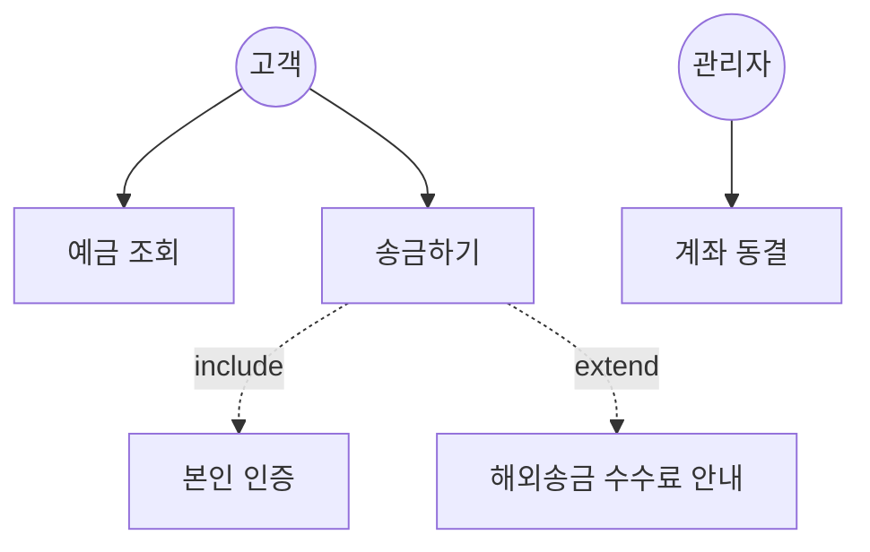
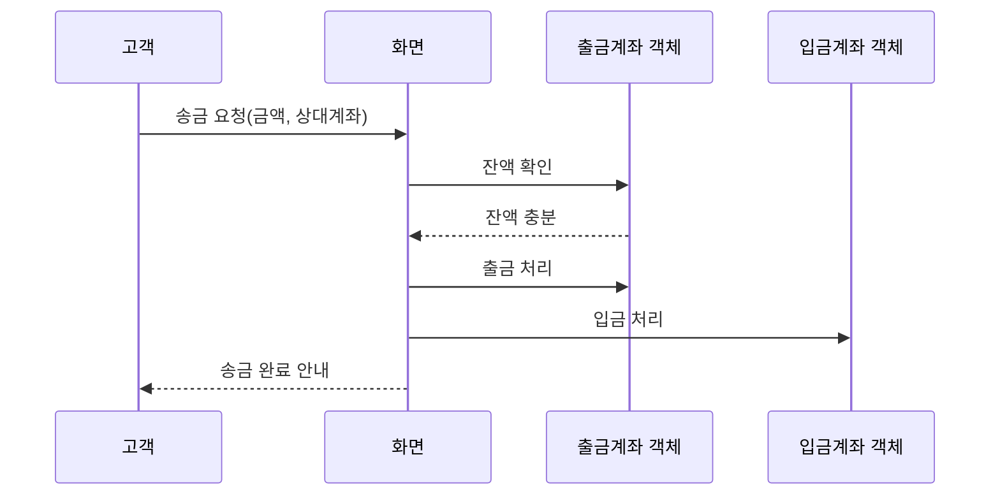
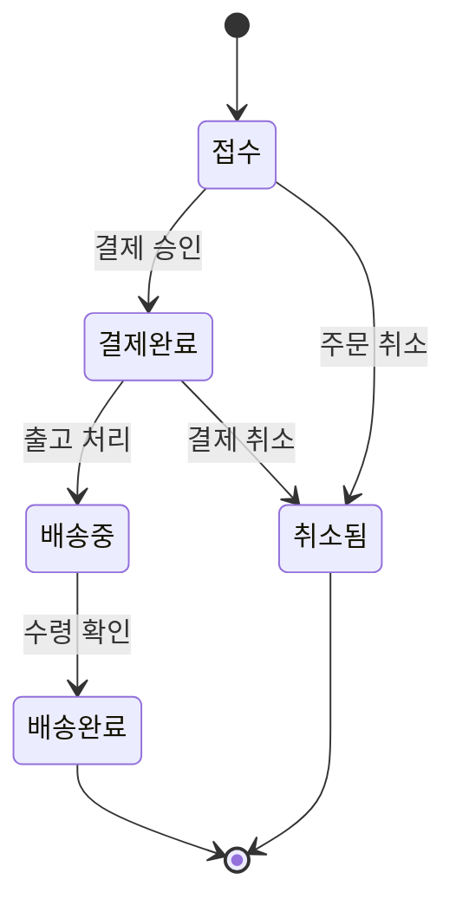
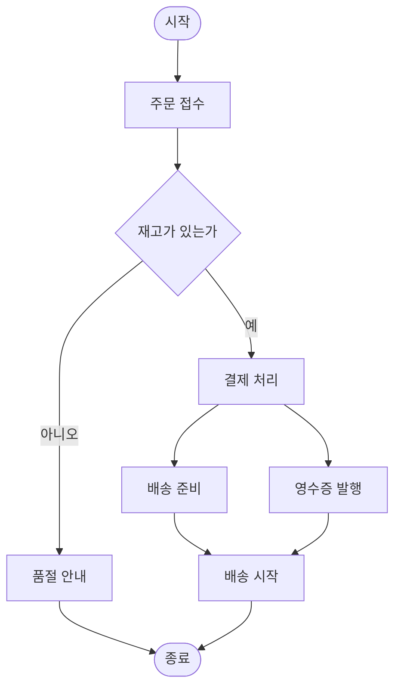

## 왜 그림마다 역할이 다른가

09편에서 클래스, 상속, 다형성 같은 객체지향 개념을 배웠지만, 이 개념들을 말로만 설명하면 팀원마다 서로 다르게 이해하기 쉽습니다. 그래서 소프트웨어공학에서는 설계 내용을 **표준화된 그림 언어**로 남기는 방법을 씁니다.

UML이라는 이름을 풀어보면 "Unified(통합된)" + "Modeling(모델링, 실제 시스템을 단순화한 그림이나 표로 표현하는 것)" + "Language(언어)"입니다. 즉 UML은 여러 회사·개발자마다 제각각이던 표기법을 하나로 통일해, 어느 회사의 설계 문서를 보더라도 같은 기호가 같은 의미를 가지게 만든 **약속된 표기 체계**입니다.

UML은 하나의 그림이 아니라 **여러 종류의 다이어그램의 모음**입니다. 각 다이어그램은 시스템의 서로 다른 측면(구조인지 동작인지, 정적인지 동적인지)을 보여주도록 역할이 나뉘어 있습니다.

## 1. 구조 다이어그램과 행위 다이어그램 — 큰 분류부터

UML 다이어그램은 크게 두 갈래로 나뉩니다.

- **구조 다이어그램**(structure diagram): 시스템을 이루는 요소들이 정적으로 어떻게 이루어져 있는지("무엇이 있고, 서로 어떻게 연결되어 있는가")를 보여줍니다. 클래스 다이어그램이 대표적입니다.
- **행위 다이어그램**(behavior diagram): 시스템이 시간에 따라 어떻게 동작하는지("무슨 일이 일어나고, 어떤 순서로 진행되는가")를 보여줍니다. 유스케이스·시퀀스·상태·활동 다이어그램이 여기에 속합니다.

| 다이어그램 | 분류 | 한 문장 역할 |
|------------|------|----------------|
| 유스케이스 다이어그램 | 행위 | 시스템이 외부(사용자)에게 무엇을 해 주는지 큰 그림으로 보여준다 |
| 클래스 다이어그램 | 구조 | 클래스들이 어떤 속성·메서드를 가지고 서로 어떤 관계로 얽혀 있는지 보여준다 |
| 시퀀스 다이어그램 | 행위 | 객체들이 시간 순서에 따라 어떤 메시지를 주고받는지 보여준다 |
| 상태 다이어그램 | 행위 | 하나의 객체가 생애 동안 어떤 상태를 거치는지 보여준다 |
| 활동 다이어그램 | 행위 | 업무나 로직이 어떤 흐름(조건 분기·병렬)으로 진행되는지 보여준다 |

**자주 틀리는 점**: "UML은 클래스 다이어그램 하나만을 가리키는 말이다"는 오답입니다. UML은 여러 다이어그램의 모음이며, 클래스 다이어그램은 그중 구조를 표현하는 대표적인 하나일 뿐입니다.

## 2. 유스케이스 다이어그램 — 시스템이 누구에게 무엇을 해 주는가

**유스케이스 다이어그램**(use case diagram)은 요구공학(06~07편)에서 도출한 요구사항 중 "시스템이 외부 이용자에게 어떤 기능을 제공하는가"를 사용자 관점에서 큰 그림으로 정리하는 다이어그램입니다. 시스템 개발 초기, 요구사항을 처음 정리하는 단계에서 가장 먼저 그리는 다이어그램입니다.

핵심 구성 요소는 세 가지입니다.

- **액터**(actor): 시스템과 상호작용하는 외부 존재. 사람일 수도 있고(고객, 관리자), 다른 시스템일 수도 있습니다(외부 결제 시스템).
- **유스케이스**(use case): 액터가 시스템을 통해 이루고자 하는 하나의 목표 단위 기능. "예금 조회", "송금하기"처럼 동사형으로 표현합니다.
- **관계**: 액터와 유스케이스를 잇는 실선, 유스케이스 사이의 포함(include, 항상 필요한 하위 기능을 뽑아냄)과 확장(extend, 특정 조건에서만 추가되는 선택적 기능) 관계.

```mermaid
graph TD
  고객((고객)) --> UC1[예금 조회]
  고객 --> UC2[송금하기]
  UC2 -.include.-> UC3[본인 인증]
  UC2 -.extend.-> UC4[해외송금 수수료 안내]
  관리자((관리자)) --> UC5[계좌 동결]
```

**자주 틀리는 점**: 포함(include)과 확장(extend)의 방향을 헷갈리는 문제가 자주 나옵니다. 포함 관계는 기본 유스케이스를 실행할 때 **반드시** 거치는 하위 유스케이스를 뽑아낸 것이고(송금하기는 항상 본인 인증을 거침), 확장 관계는 **특정 조건에서만 선택적으로** 덧붙는 유스케이스입니다(해외송금일 때만 수수료 안내가 추가됨).

## 3. 클래스 다이어그램 — 정적 구조를 보여준다

**클래스 다이어그램**(class diagram)은 09편에서 다룬 클래스, 속성, 메서드, 상속 관계를 표준 표기법으로 그린 다이어그램입니다. 시스템에 어떤 클래스들이 있고, 각 클래스가 무엇을 가지고 있으며, 클래스끼리 어떤 관계(상속, 연관, 집합, 합성)로 연결되는지를 **한 시점의 정적인 구조**로 보여줍니다.

09편의 예시를 다시 보면, "계좌"가 부모 클래스이고 "예금계좌"·"적금계좌"가 자식 클래스인 상속 관계를 클래스 다이어그램의 속이 빈 삼각형 화살표로 표현했습니다. 이 외에도 클래스 다이어그램에는 클래스 사이의 다양한 관계가 있습니다.

| 관계 | 뜻 | 예시 |
|------|-----|------|
| 상속(generalization) | "이것은 저것의 한 종류다"라는 관계 | 예금계좌는 계좌의 한 종류다 |
| 연관(association) | 두 클래스가 서로 알고 참조한다 | 고객은 계좌를 가진다 |
| 집합(aggregation) | 전체-부분 관계이지만 부분이 독립적으로 존재 가능 | 은행 지점은 여러 계좌를 관리하지만, 계좌는 지점 없이도 개념적으로 존재 가능 |
| 합성(composition) | 전체-부분 관계이며 전체가 사라지면 부분도 함께 사라짐 | 주문이 삭제되면 그 주문의 주문항목도 함께 사라짐 |

**자주 틀리는 점**: 집합과 합성을 같은 것으로 착각하는 문제가 자주 나옵니다. 두 관계 모두 "전체와 부분"을 표현하지만, 집합은 부분이 전체와 독립적으로 살아남을 수 있는 느슨한 관계이고, 합성은 전체가 없어지면 부분도 함께 없어지는 강한 관계입니다.

## 4. 시퀀스 다이어그램 — 객체들이 주고받는 메시지의 시간 순서

**시퀀스 다이어그램**(sequence diagram)은 특정 기능이 실행되는 동안 여러 객체가 **어떤 순서로 메시지(메서드 호출)를 주고받는지**를 시간 축을 따라 보여주는 다이어그램입니다. 유스케이스 다이어그램이 "무엇을 할 수 있는가"라는 큰 그림이었다면, 시퀀스 다이어그램은 그 유스케이스 하나가 **내부적으로 어떻게 진행되는지** 구체적인 상호작용을 보여줍니다.

"송금하기" 유스케이스를 예로 들면, 고객이 송금을 요청하면 화면 객체가 계좌 객체에게 잔액을 확인하라고 요청하고, 계좌 객체가 충분하면 출금 처리를 한 뒤 상대 계좌 객체에 입금 요청을 보내는 순서를 다음과 같이 그릴 수 있습니다.

```mermaid
sequenceDiagram
  participant 고객
  participant 화면
  participant 출금계좌 as 출금계좌 객체
  participant 입금계좌 as 입금계좌 객체

  고객->>화면: 송금 요청(금액, 상대계좌)
  화면->>출금계좌: 잔액 확인
  출금계좌-->>화면: 잔액 충분
  화면->>출금계좌: 출금 처리
  화면->>입금계좌: 입금 처리
  화면-->>고객: 송금 완료 안내
```

세로선(생명선, lifeline)은 각 객체가 존재하는 시간을, 가로 화살표는 객체 사이의 메시지 호출을 나타냅니다. 화살표의 위에서 아래로 흐르는 순서가 곧 실제 실행 순서입니다.

**자주 틀리는 점**: "시퀀스 다이어그램은 클래스 사이의 정적인 관계를 보여준다"는 오답입니다. 정적인 관계는 클래스 다이어그램의 역할이고, 시퀀스 다이어그램은 특정 상황에서 객체들이 **시간 순서에 따라 동적으로** 주고받는 메시지를 보여줍니다.

## 5. 상태 다이어그램 — 하나의 객체가 겪는 생애

**상태 다이어그램**(state diagram, state machine diagram)은 하나의 객체가 생성부터 소멸까지 어떤 **상태**(state)를 거치며, 어떤 **사건**(event)이 그 상태 전이를 일으키는지 보여주는 다이어그램입니다. 초점이 "여러 객체 사이의 상호작용"이 아니라 "한 객체 안에서 일어나는 상태 변화"에 맞춰져 있다는 점이 시퀀스 다이어그램과의 결정적 차이입니다.

"주문" 객체를 예로 들면, 주문은 접수 → 결제완료 → 배송중 → 배송완료라는 상태를 순서대로 거치고, 중간에 취소라는 사건이 발생하면 취소됨 상태로 빠질 수 있습니다.

```mermaid
stateDiagram-v2
  [*] --> 접수
  접수 --> 결제완료 : 결제 승인
  결제완료 --> 배송중 : 출고 처리
  배송중 --> 배송완료 : 수령 확인
  접수 --> 취소됨 : 주문 취소
  결제완료 --> 취소됨 : 결제 취소
  배송완료 --> [*]
  취소됨 --> [*]
```

**자주 틀리는 점**: "상태 다이어그램은 시스템 전체가 아니라 하나의 대상(객체나 유스케이스)에 초점을 맞춘다"는 사실을 놓치면, "여러 시스템 구성 요소 사이의 흐름을 보여준다"는 식으로 활동 다이어그램과 혼동하게 됩니다. 상태 다이어그램은 어디까지나 **하나의 대상이 시간에 따라 어떤 상태를 오가는가**에 집중합니다.

## 6. 활동 다이어그램 — 업무 흐름과 분기·병렬을 보여준다

**활동 다이어그램**(activity diagram)은 하나의 업무 절차나 알고리즘이 어떤 순서로 진행되는지, 그 과정에 조건 분기나 병렬 처리가 어떻게 끼어드는지를 순서도(flowchart)와 비슷한 형태로 보여주는 다이어그램입니다. 상태 다이어그램이 "한 객체의 상태 변화"에 초점을 두었다면, 활동 다이어그램은 "여러 단계로 이루어진 업무나 로직의 진행 흐름" 자체에 초점을 둡니다.

"주문 처리" 업무를 활동 다이어그램으로 그리면 다음과 같이, 재고 확인이라는 조건 분기와 결제·배송준비가 동시에 진행될 수 있는 병렬 처리(동시 진행)까지 표현할 수 있습니다.

```mermaid
flowchart TD
  Start([시작]) --> A[주문 접수]
  A --> B{재고가 있는가}
  B -->|예| C[결제 처리]
  B -->|아니오| D[품절 안내]
  C --> E[배송 준비]
  C --> F[영수증 발행]
  E --> G[배송 시작]
  F --> G
  D --> End([종료])
  G --> End
```

**자주 틀리는 점**: "활동 다이어그램과 상태 다이어그램은 같은 목적으로 쓰이므로 아무거나 골라 써도 된다"는 오답입니다. 상태 다이어그램은 하나의 객체가 겪는 상태에, 활동 다이어그램은 여러 단계로 이루어진 업무·알고리즘의 흐름(조건 분기, 병렬 처리 포함)에 초점을 맞춘다는 점에서 용도가 다릅니다.

## 7. 다섯 다이어그램을 하나의 개발 흐름으로 이어보기

지금까지 다룬 다섯 다이어그램은 실제 개발 과정에서 서로 이어집니다. 그리고 특정 객체의 생애가 복잡하다면 상태 다이어그램으로, 여러 단계·조건 분기가 있는 업무 절차라면 활동 다이어그램으로 별도로 상세화합니다.

| 질문 | 사용할 다이어그램 |
|------|----------------------|
| 시스템이 사용자에게 무엇을 해 주는가 | 유스케이스 다이어그램 |
| 클래스들이 어떤 속성·관계를 가지는가 | 클래스 다이어그램 |
| 이 기능이 진행되는 동안 객체들이 어떤 순서로 메시지를 주고받는가 | 시퀀스 다이어그램 |
| 이 객체는 생애 동안 어떤 상태를 거치는가 | 상태 다이어그램 |
| 이 업무는 어떤 순서·조건 분기·병렬로 진행되는가 | 활동 다이어그램 |

이렇게 정리한 UML 다이어그램들은 11편에서 다룰 설계 원리(모듈화, 응집도·결합도, 아키텍처)를 실제로 적용해 다듬어지는 밑그림이 됩니다. 클래스 다이어그램에 그려진 클래스들을 어떤 기준으로 나누고 묶을 것인가가 11편의 주제입니다.

## 핵심 정리

- UML은 여러 종류의 다이어그램을 통합한 표준 표기 체계이며, 크게 정적 구조를 그리는 구조 다이어그램과 동적 동작을 그리는 행위 다이어그램으로 나뉜다.
- 유스케이스 다이어그램은 시스템이 외부 액터에게 무엇을 해 주는지 큰 그림으로, 클래스 다이어그램은 클래스의 속성·메서드·관계(상속·연관·집합·합성)를 정적으로 보여준다.
- 시퀀스 다이어그램은 객체들이 시간 순서에 따라 주고받는 메시지를 보여주고, 상태 다이어그램은 하나의 객체가 겪는 상태 전이를, 활동 다이어그램은 조건 분기·병렬을 포함한 업무·로직의 흐름을 보여준다.
- 집합은 부분이 전체와 독립적으로 존재 가능한 느슨한 전체-부분 관계이고, 합성은 전체가 사라지면 부분도 함께 사라지는 강한 전체-부분 관계다.
- 다섯 다이어그램은 유스케이스로 시작해 시퀀스·클래스로 구체화되고, 필요에 따라 상태·활동 다이어그램으로 상세화되는 하나의 이어진 설계 흐름을 이룬다.

## 마무리 복습

<Quiz
  questionNumber={1}
  question={"UML 다이어그램에 대한 설명으로 가장 적절한 것은?"}
  options={["UML은 클래스 다이어그램 하나만을 가리키는 표기법이다.","UML은 시스템의 여러 측면을 표현하는 다양한 다이어그램을 통합한 표준 표기 체계다.","UML 다이어그램은 모두 시스템의 동적인 동작만을 표현한다.","UML은 구조적 분석 방법론에서만 사용하는 표기법이다."]}
  correctAnswer={2}
  explanation={"UML은 유스케이스, 클래스, 시퀀스, 상태, 활동 다이어그램 등 여러 종류의 다이어그램을 통합한 표준 표기 체계이며, 구조와 행위를 모두 표현할 수 있다."}
/>

<Quiz
  questionNumber={2}
  question={"유스케이스 다이어그램의 포함(include)과 확장(extend) 관계에 대한 설명으로 가장 적절한 것은?"}
  options={["포함 관계는 기본 유스케이스 실행 시 항상 거치는 하위 유스케이스를 나타내고, 확장 관계는 특정 조건에서만 선택적으로 덧붙는 유스케이스를 나타낸다.","포함 관계는 특정 조건에서만 선택적으로 일어나고, 확장 관계는 항상 일어난다.","포함과 확장은 완전히 같은 의미이며 구분할 필요가 없다.","포함과 확장 관계는 액터와 유스케이스 사이에서만 사용된다."]}
  correctAnswer={1}
  explanation={"포함 관계는 기본 유스케이스를 실행할 때 반드시 거치는 하위 유스케이스를 뽑아낸 것이고, 확장 관계는 특정 조건에서만 선택적으로 추가되는 유스케이스를 나타낸다."}
/>

<Quiz
  questionNumber={3}
  question={"클래스 다이어그램에서 집합(aggregation)과 합성(composition)의 차이에 대한 설명으로 가장 적절한 것은?"}
  options={["집합과 합성은 완전히 같은 관계를 표현한다.","집합은 부분이 전체와 독립적으로 존재할 수 있지만, 합성은 전체가 사라지면 부분도 함께 사라진다.","집합은 전체가 사라지면 부분도 함께 사라지지만, 합성은 부분이 독립적으로 존재할 수 있다.","집합과 합성 모두 상속 관계를 표현하는 다른 이름이다."]}
  correctAnswer={2}
  explanation={"집합은 전체-부분 관계이지만 부분이 전체와 독립적으로 존재할 수 있는 느슨한 관계이고, 합성은 전체가 사라지면 부분도 함께 사라지는 강한 전체-부분 관계다."}
/>

## 참고 자료

- [ACM/IEEE SWEBOK v4 안내](https://www.computer.org/education/bodies-of-knowledge/software-engineering)
- [SWEBOK topics 상세](https://www.computer.org/education/bodies-of-knowledge/software-engineering/topics)
