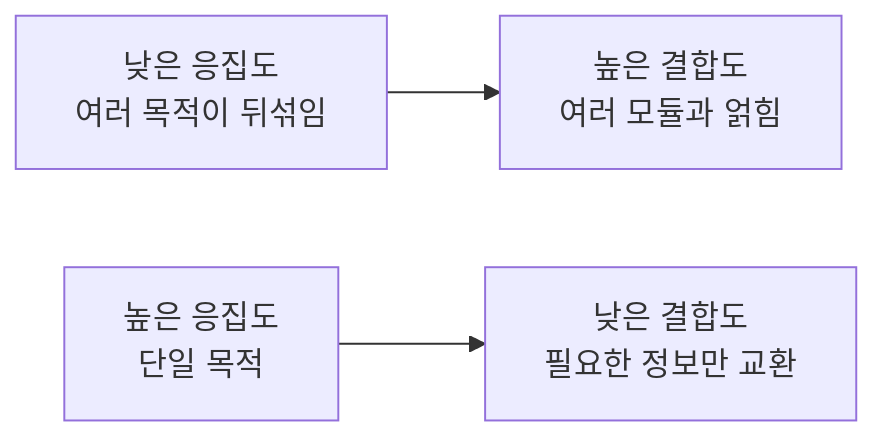
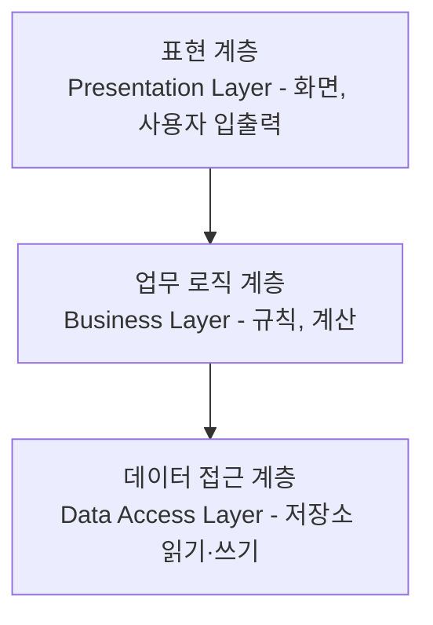

<Callout type="info">
  **이번 문서의 목표:** 이 파일을 다 읽으면 왜 모듈로 나누어 설계하는지 설명할 수 있고, 결합도와 응집도를 각각 7단계로 나누어 구체적인 예제를 보고 어느 단계에 해당하는지 스스로 판정할 수 있으며, 계층 구조와 아키텍처가 개별 모듈 설계와 어떻게 다른 상위 관점인지 구분할 수 있다.
</Callout>

## 왜 "잘 나누는 기준"이 따로 필요한가

09~10편에서 클래스를 식별하고 UML로 구조를 그렸다면, 이제 남는 질문은 "이 클래스들을 어떤 크기로, 어떤 기준으로 나누어야 좋은 설계인가"입니다. 같은 기능을 만들더라도 클래스를 지나치게 잘게 쪼개면 클래스 사이를 오가는 호출이 많아져 관리가 복잡해지고, 반대로 너무 크게 뭉뚱그리면 하나를 고칠 때 관련 없는 부분까지 건드리게 됩니다. 소프트웨어공학은 이 "나누는 기준"을 감(느낌)이 아니라 **측정 가능한 원리**로 제시합니다. 그 핵심이 모듈화, 결합도, 응집도입니다.

> **쉽게 말하면:** 서랍을 정리할 때 "양말은 양말 칸에, 속옷은 속옷 칸에" 나누는 기준이 응집도이고, "양말 칸을 열 때 속옷 칸까지 같이 끌려 나오지 않게" 서랍을 독립적으로 만드는 기준이 결합도입니다.

## 1. 모듈과 모듈화 — 나누어 정복한다

**모듈**(module)은 시스템을 구성하는 독립적인 단위로, 객체지향에서는 클래스나 클래스의 묶음(패키지)이, 절차형 설계에서는 함수나 서브루틴이 모듈에 해당합니다. **모듈화**(modularity)는 시스템을 여러 모듈로 나누어 설계하는 원리 자체를 말합니다.

모듈화의 목적은 크게 세 가지입니다.

1. **이해 용이성**: 시스템 전체를 한 번에 이해하는 대신, 작은 모듈 단위로 나누어 하나씩 이해할 수 있게 합니다.
2. **변경 용이성**: 요구사항이 바뀌었을 때 그 변경이 관련된 모듈에만 국한되게 하여, 수정 범위를 좁힙니다.
3. **재사용성**: 독립적으로 잘 정의된 모듈은 다른 시스템에서도 그대로 가져다 쓸 수 있습니다.

다만 모듈을 무작정 잘게 나눈다고 좋은 것은 아닙니다. 모듈 수가 늘어날수록 모듈 하나하나의 복잡도는 낮아지지만, 모듈 사이를 연결하고 조율하는 비용(인터페이스 비용)은 늘어납니다. 이 두 비용의 합이 최소가 되는 지점을 찾는 것이 모듈화 설계의 핵심 과제이며, 이 지점을 찾는 데 쓰이는 두 가지 측정 기준이 바로 결합도와 응집도입니다.

## 2. 결합도 — 모듈 사이가 얼마나 얽혀 있는가

**결합도**(coupling)는 서로 다른 모듈이 얼마나 강하게 의존하고 있는지를 나타내는 정도입니다. 결합도가 높을수록 한 모듈을 수정했을 때 다른 모듈에 영향을 줄 위험이 커지므로, **결합도는 낮을수록 좋은 설계**입니다. 독학사 시험에서는 아래 7단계를 강한 것부터 약한 것 순서로 배열하고, "다음 코드나 상황은 몇 단계 결합에 해당하는가"를 실제 예제로 판정하게 하는 문제가 자주 나옵니다.

| 단계(강함→약함) | 이름 | 뜻 | 판정 예제 |
|-------------------|------|-----|------------|
| 1 | 내용 결합(content coupling) | 한 모듈이 다른 모듈의 내부 데이터나 코드를 직접 참조·수정한다 | 모듈 A가 모듈 B 내부의 지역 변수 주소를 직접 참조해 값을 바꾼다 |
| 2 | 공통 결합(common coupling) | 여러 모듈이 하나의 전역 변수(공유 데이터 영역)를 공동으로 읽고 쓴다 | 모듈 A와 모듈 B가 모두 전역 변수 `잔액`을 직접 읽고 수정한다 |
| 3 | 외부 결합(external coupling) | 여러 모듈이 외부에서 정의된 공통 데이터 형식이나 통신 프로토콜을 공유한다 | 모듈 A와 모듈 B가 같은 외부 파일 형식이나 통신 규약을 함께 참조한다 |
| 4 | 제어 결합(control coupling) | 한 모듈이 다른 모듈에게 무엇을 할지 지시하는 제어 신호(플래그, 코드값)를 넘긴다 | 모듈 A가 모듈 B에게 `모드=1이면 저장, 모드=2면 삭제`처럼 동작 방식을 지정하는 값을 넘긴다 |
| 5 | 스탬프 결합(stamp coupling) | 필요한 값 몇 개만 넘기면 되는데, 구조체나 객체 전체를 통째로 넘긴다 | 이름만 필요한데 회원 전체 정보를 담은 구조체를 통째로 전달한다 |
| 6 | 자료 결합(data coupling) | 꼭 필요한 데이터 값만 매개변수로 주고받는다 | 모듈 A가 모듈 B에게 계산에 필요한 숫자 두 개만 매개변수로 넘긴다 |
| 7 | 무결합(no coupling) | 두 모듈이 서로 전혀 관련이 없다 | 모듈 A와 모듈 B가 서로 호출하거나 데이터를 주고받지 않는다 |

**판정 연습**: "회원가입 모듈이 이메일 발송 모듈을 호출하면서, 회원 객체 전체를 넘기지만 이메일 발송 모듈은 그중 이메일 주소 하나만 사용한다"는 상황은 몇 단계일까요? 필요한 값(이메일 주소)만 넘기지 않고 객체 전체를 통째로 넘겼으므로 **5단계 스탬프 결합**입니다. 만약 이메일 주소만 매개변수로 넘겼다면 **6단계 자료 결합**으로 개선된 것입니다.

**자주 틀리는 점**: "결합도는 높을수록 좋은 설계다"는 정반대의 오답입니다. 결합도는 낮을수록, 즉 표에서 아래쪽(자료 결합, 무결합)에 가까울수록 모듈 간 독립성이 높아 좋은 설계로 평가됩니다. 또한 "공통 결합이 내용 결합보다 더 나쁘다"는 표의 순서를 뒤바꾼 오답이며, 실제로는 내용 결합이 가장 나쁜(강한) 결합입니다.

> **쉽게 말하면:** 결합도는 "두 집 사이의 담장 높이와 문의 개수"입니다. 담장이 없어 서로의 방을 훤히 들여다보고 물건을 마음대로 가져가는 사이(내용 결합)는 최악이고, 담장이 있고 정해진 창구로 필요한 물건만 주고받는 사이(자료 결합)가 이상적입니다.

## 3. 응집도 — 모듈 안이 얼마나 하나의 목적으로 뭉쳐 있는가

**응집도**(cohesion)는 한 모듈 안의 구성 요소들이 얼마나 밀접하게 하나의 목적을 위해 뭉쳐 있는지를 나타내는 정도입니다. 응집도가 높을수록 그 모듈은 하나의 명확한 책임만 수행한다는 뜻이므로, **응집도는 높을수록 좋은 설계**입니다. 결합도와 반대로, 표에서 아래로 갈수록(높은 단계일수록) 좋습니다.

| 단계(약함→강함) | 이름 | 뜻 | 판정 예제 |
|-------------------|------|-----|------------|
| 1 | 우연적 응집(coincidental cohesion) | 서로 관련 없는 기능들이 우연히 한 모듈에 모여 있다 | "로그 기록"과 "세금 계산"과 "화면 색상 설정"이 한 모듈 안에 아무 연관 없이 섞여 있다 |
| 2 | 논리적 응집(logical cohesion) | 비슷한 종류로 분류만 될 뿐 실제 처리 내용은 다른 기능들을 모아 두고, 호출할 때 넘기는 코드값으로 그중 하나를 고른다 | "입력 처리"라는 모듈 하나에 키보드 입력, 마우스 입력, 파일 입력 처리를 모두 넣고 코드값으로 분기한다 |
| 3 | 시간적 응집(temporal cohesion) | 실행되는 시점이 같다는 이유만으로 묶여 있다 | 프로그램 "시작 시"에 실행되는 초기화 관련 기능들을 한데 묶는다(화면 초기화, 로그 파일 열기, 설정값 읽기) |
| 4 | 절차적 응집(procedural cohesion) | 특정 절차(순서)에 따라 실행되어야 한다는 이유로 묶여 있다 | "회원가입" 모듈 안에 입력값 검증 → 중복 확인 → 저장이 순서대로 실행되지만 서로 다른 데이터를 다룬다 |
| 5 | 교환적 응집(communicational cohesion) | 같은 입력 데이터를 사용하거나 같은 출력 데이터를 만든다는 이유로 묶여 있다 | 같은 고객 데이터를 입력받아 주소를 갱신하는 기능과 등급을 갱신하는 기능이 한 모듈에 있다 |
| 6 | 순차적 응집(sequential cohesion) | 한 기능의 출력이 다음 기능의 입력으로 바로 이어진다 | 파일에서 읽은 원시 데이터를 정제하는 기능의 출력이, 곧바로 통계를 계산하는 기능의 입력이 된다 |
| 7 | 기능적 응집(functional cohesion) | 모듈 안의 모든 요소가 하나의 단일하고 명확한 기능을 수행하기 위해 존재한다 | "두 정수의 최대공약수를 계산한다"는 단 하나의 목적만을 위한 모듈 |

**판정 연습**: "환율을 조회하는 기능과 조회한 환율로 원화 금액을 계산하는 기능이 한 모듈에 있는데, 환율 조회의 출력값이 그대로 금액 계산의 입력값으로 쓰인다"는 상황은 몇 단계일까요? 한 기능의 출력이 다음 기능의 입력으로 바로 이어지므로 **6단계 순차적 응집**입니다. 만약 이 모듈이 "환율로 원화를 계산한다"는 단 하나의 목적만 가지도록 더 다듬어졌다면 **7단계 기능적 응집**에 가까워집니다.

**자주 틀리는 점**: "시간적 응집이 절차적 응집보다 더 강한 응집이다"는 표의 순서를 뒤바꾼 오답입니다. 시간적 응집(3단계)은 절차적 응집(4단계)보다 약한 응집입니다. 또한 "응집도는 낮을수록 좋다"는 결합도와 응집도의 방향을 헷갈린 대표적인 오답이며, 응집도는 결합도와 반대로 **높을수록** 좋습니다.

> **쉽게 말하면:** 응집도는 "한 부서 안에 모인 사람들이 실제로 같은 업무를 하는가"입니다. 우연히 자리만 같이 배정된 사람들(우연적 응집)보다, "고객 문의에 답한다"는 단 하나의 목적으로만 모인 팀(기능적 응집)이 훨씬 다루기 쉽고 효율적입니다.

## 4. 결합도와 응집도의 관계 — 좋은 설계의 두 축

결합도와 응집도는 서로 독립된 두 개의 잣대이지만, 실제로는 함께 움직이는 경향이 있습니다. 한 모듈이 여러 목적을 뒤섞어 담고 있으면(응집도 낮음), 그 모듈은 다른 여러 모듈과 얽혀 데이터를 주고받아야 할 가능성이 커집니다(결합도 높음). 반대로 모듈이 단 하나의 명확한 목적만 가지면(응집도 높음), 그 모듈이 다른 모듈과 주고받는 정보도 꼭 필요한 최소한으로 좁혀지는 경향이 있습니다(결합도 낮음).

그래서 좋은 설계의 목표는 한 문장으로 정리됩니다. **"결합도는 낮게, 응집도는 높게"**(low coupling, high cohesion). 독학사 시험에서 이 두 원리를 짝지어 묻는 문제가 특히 많으므로, 결합도 표는 강함(나쁨)에서 약함(좋음) 순으로, 응집도 표는 약함(나쁨)에서 강함(좋음) 순으로 **방향이 서로 반대**라는 점을 정확히 기억해야 합니다.

## 5. 계층 구조 — 모듈을 수직으로 쌓는다

**계층 구조**(layered architecture, 계층형 아키텍처)는 시스템을 여러 층(layer)으로 나누고, 각 층이 자신의 바로 아래 층에게만 서비스를 요청하도록 제한하는 설계 방식입니다. 대표적으로 다음과 같은 3계층 구조가 널리 쓰입니다.

- **표현 계층**(presentation layer): 사용자가 직접 보고 조작하는 화면과 입출력을 담당합니다.
- **업무 로직 계층**(business layer): 실제 업무 규칙과 계산(예: 이자 계산, 할인율 적용)을 담당합니다.
- **데이터 접근 계층**(data access layer): 데이터베이스나 파일 같은 저장소에 실제로 접근해 읽고 쓰는 역할을 담당합니다.

계층 구조의 장점은 각 계층이 자신의 바로 아래 계층의 세부 구현을 몰라도 되게 만드는 것입니다. 표현 계층은 데이터가 실제로 어떤 데이터베이스에, 어떤 테이블 구조로 저장되는지 알 필요 없이 업무 로직 계층에게만 요청하면 됩니다. 이는 앞서 배운 "결합도를 낮추는" 원리를 아키텍처 수준으로 확장한 것입니다. 만약 데이터베이스 종류가 바뀌어도, 그 변경은 데이터 접근 계층 안에서만 처리되고 표현 계층은 영향을 받지 않습니다.

**자주 틀리는 점**: "계층 구조에서는 상위 계층이 하위 계층을 건너뛰고 더 아래 계층에 직접 접근해도 상관없다"는 오답입니다. 계층 구조의 원칙은 각 계층이 **바로 아래 계층에만** 요청하는 것이며, 계층을 건너뛰는 접근은 계층 구조의 장점(계층 간 독립성)을 무너뜨립니다.

## 6. 소프트웨어 아키텍처 — 개별 모듈보다 한 단계 위의 관점

**소프트웨어 아키텍처**(software architecture)는 개별 모듈 하나하나의 내부 설계보다 한 단계 위에서, 시스템을 이루는 큰 구성 요소들이 무엇이고 그 구성 요소들이 서로 어떻게 관계 맺는지를 정하는 **전체 구조에 대한 결정**을 말합니다. 계층 구조는 소프트웨어 아키텍처의 한 가지 형태(패턴)입니다.

아키텍처 수준의 결정은 이후 세부 설계·구현 단계 전반에 큰 영향을 미치기 때문에, 소프트웨어공학에서는 아키텍처를 개발 초기에 신중히 정해야 한다고 강조합니다. 예를 들어 "이 시스템을 하나의 큰 프로그램으로 만들 것인가, 여러 개의 독립적인 서비스로 나눌 것인가" 같은 결정은 나중에 뒤집기가 매우 어렵습니다. 이러한 아키텍처 수준의 대표적인 판단 기준으로 **품질 속성**(quality attribute, 성능·보안·확장성·유지보수성처럼 시스템이 갖추어야 할 비기능적 성질)을 듭니다. 07편에서 다룬 요구사항 명세의 비기능 요구사항이 바로 이 품질 속성과 직결되며, 아키텍처는 이런 비기능 요구사항을 만족시키기 위한 구조적 해법입니다.

> **쉽게 말하면:** 모듈 설계가 "건물 각 방을 어떻게 배치할 것인가"라면, 아키텍처는 "이 건물을 저층 상가, 중층 사무실, 고층 주거로 나눌 것인가, 아니면 단독 용도 건물로 지을 것인가"를 정하는 것과 같은, 훨씬 상위의 구조적 결정입니다.

## 핵심 정리

- 모듈화는 시스템을 독립적인 단위로 나누어 이해·변경·재사용을 쉽게 하는 원리이며, 지나치게 잘게 나누면 인터페이스 비용이 커진다.
- 결합도는 내용 결합(1단계, 가장 나쁨)부터 무결합(7단계, 가장 좋음)까지 7단계로 나뉘며 낮을수록 좋은 설계다.
- 응집도는 우연적 응집(1단계, 가장 나쁨)부터 기능적 응집(7단계, 가장 좋음)까지 7단계로 나뉘며 높을수록 좋은 설계다.
- 결합도 표는 나쁨에서 좋음 순, 응집도 표는 나쁨에서 좋음 순으로 정렬 방향이 다르므로 헷갈리지 않아야 하며, 좋은 설계의 목표는 "결합도는 낮게, 응집도는 높게"다.
- 계층 구조는 시스템을 표현·업무 로직·데이터 접근 계층으로 나누어 각 계층이 바로 아래 계층에만 의존하게 하며, 소프트웨어 아키텍처는 개별 모듈보다 상위에서 시스템 전체 구조와 품질 속성을 결정하는 관점이다.

## 마무리 복습

<Quiz
  questionNumber={1}
  question="다음 중 결합도(coupling)에 대한 설명으로 가장 적절한 것은?"
  options={['결합도는 한 모듈 내부 구성 요소들이 하나의 목적으로 뭉쳐 있는 정도를 뜻한다.', '결합도는 모듈 사이가 서로 얼마나 강하게 의존하고 있는지를 나타내며, 낮을수록 좋은 설계다.', '결합도는 높을수록 모듈 간 독립성이 커져 좋은 설계로 평가된다.', '결합도와 응집도는 같은 개념을 다르게 부르는 것뿐이다.']}
  correctAnswer={2}
  explanation="결합도는 모듈 사이의 의존 정도를 나타내며, 결합도가 낮을수록 한 모듈의 수정이 다른 모듈에 미치는 영향이 줄어들어 좋은 설계로 평가된다."
  optionExplanations={['이는 응집도에 대한 설명이다.', '정답. 결합도는 낮을수록 좋은 설계다.', '결합도는 낮을수록 좋으며, 높을수록 모듈 간 독립성이 떨어진다.', '결합도는 모듈 사이의 관계, 응집도는 모듈 내부의 관계를 다루는 서로 다른 개념이다.']}
/>

<Quiz
  questionNumber={2}
  question="모듈 A가 모듈 B의 내부 지역 변수 주소를 직접 참조해 그 값을 임의로 수정한다면, 이는 결합도 7단계 중 어디에 해당하는가?"
  options={['자료 결합', '스탬프 결합', '내용 결합', '무결합']}
  correctAnswer={3}
  explanation="한 모듈이 다른 모듈의 내부 데이터나 코드를 직접 참조·수정하는 것은 결합도 7단계 중 가장 강한(나쁜) 단계인 내용 결합에 해당한다."
  optionExplanations={['자료 결합은 꼭 필요한 데이터 값만 매개변수로 주고받는, 결합도가 낮은 단계다.', '스탬프 결합은 필요한 값보다 큰 구조체·객체 전체를 넘기는 단계로, 내부 참조와는 다르다.', '정답. 내부 데이터·코드를 직접 참조·수정하는 것은 가장 강한 내용 결합이다.', '무결합은 두 모듈이 서로 전혀 관련이 없는 상태를 뜻한다.']}
/>

<Quiz
  questionNumber={3}
  question="다음 중 응집도(cohesion)의 단계를 약한 것에서 강한 것 순으로 옳게 배열한 것은?"
  options={['기능적 응집 - 순차적 응집 - 우연적 응집', '우연적 응집 - 절차적 응집 - 기능적 응집', '기능적 응집 - 우연적 응집 - 절차적 응집', '절차적 응집 - 기능적 응집 - 우연적 응집']}
  correctAnswer={2}
  explanation="응집도는 우연적 응집(1단계)에서 논리적·시간적·절차적·교환적·순차적 응집을 거쳐 기능적 응집(7단계)으로 갈수록 강해진다."
  optionExplanations={['가장 강한 기능적 응집을 맨 앞에 두어 순서가 뒤바뀌었다.', '정답. 우연적 응집이 가장 약하고 기능적 응집이 가장 강하다.', '기능적 응집을 맨 앞에 두어 순서가 뒤바뀌었다.', '가장 강한 기능적 응집을 중간에, 가장 약한 우연적 응집을 마지막에 두어 순서가 뒤바뀌었다.']}
/>

<Quiz
  questionNumber={4}
  question="환율 조회 기능의 출력값이 그대로 원화 금액 계산 기능의 입력값으로 바로 이어지는 모듈은 응집도 7단계 중 어디에 해당하는가?"
  options={['시간적 응집', '순차적 응집', '우연적 응집', '논리적 응집']}
  correctAnswer={2}
  explanation="한 기능의 출력이 다음 기능의 입력으로 바로 이어지는 경우는 순차적 응집(6단계)에 해당한다."
  optionExplanations={['시간적 응집은 실행 시점이 같다는 이유만으로 묶인 경우다.', '정답. 출력이 다음 기능의 입력으로 이어지는 것은 순차적 응집이다.', '우연적 응집은 서로 관련 없는 기능들이 우연히 한 모듈에 모인 경우다.', '논리적 응집은 비슷한 종류로만 분류되고 코드값으로 기능을 선택하는 경우다.']}
/>

<Quiz
  questionNumber={5}
  question="좋은 소프트웨어 설계의 목표에 대한 설명으로 가장 적절한 것은?"
  options={['결합도와 응집도 모두 낮게 유지하는 것이 목표다.', '결합도와 응집도 모두 높게 유지하는 것이 목표다.', '결합도는 낮게, 응집도는 높게 유지하는 것이 목표다.', '결합도는 높게, 응집도는 낮게 유지하는 것이 목표다.']}
  correctAnswer={3}
  explanation="좋은 설계는 모듈 사이의 의존(결합도)은 낮추고, 모듈 내부의 목적 응집(응집도)은 높이는 것을 목표로 한다."
  optionExplanations={['응집도는 낮게가 아니라 높게 유지해야 좋은 설계다.', '결합도는 높게가 아니라 낮게 유지해야 좋은 설계다.', '정답. 결합도는 낮게, 응집도는 높게가 좋은 설계의 목표다.', '결합도와 응집도의 방향이 완전히 뒤바뀐 설명이다.']}
/>

<Quiz
  questionNumber={6}
  question="계층 구조(layered architecture)에 대한 설명으로 옳지 않은 것은?"
  options={['표현 계층, 업무 로직 계층, 데이터 접근 계층으로 나누는 3계층 구조가 대표적이다.', '각 계층은 원칙적으로 바로 아래 계층에게만 서비스를 요청한다.', '상위 계층은 자신의 편의를 위해 계층을 건너뛰고 더 아래 계층에 직접 접근하는 것이 권장된다.', '데이터베이스 종류가 바뀌어도 그 변경은 데이터 접근 계층 안에서 주로 처리되도록 설계한다.']}
  correctAnswer={3}
  explanation="계층 구조의 원칙은 각 계층이 바로 아래 계층에만 요청하는 것이며, 계층을 건너뛰는 접근은 계층 간 독립성을 무너뜨리므로 권장되지 않는다."
  optionExplanations={['옳은 설명이다. 3계층 구조는 대표적인 계층형 아키텍처다.', '옳은 설명이다. 계층 구조의 핵심 원칙이다.', '옳지 않은 설명이므로 정답이다. 계층을 건너뛰는 접근은 계층 구조의 장점을 무너뜨린다.', '옳은 설명이다. 계층 구조 덕분에 변경 영향 범위가 좁혀진다.']}
/>

<Quiz
  questionNumber={7}
  question="소프트웨어 아키텍처에 대한 설명으로 가장 적절한 것은?"
  options={['소프트웨어 아키텍처는 개별 모듈 내부의 세부 구현 코드를 의미한다.', '소프트웨어 아키텍처는 시스템의 큰 구성 요소와 그 관계를 정하는 전체 구조 수준의 결정을 의미한다.', '소프트웨어 아키텍처는 결합도·응집도와 전혀 관련이 없는 별개의 개념이다.', '소프트웨어 아키텍처는 개발 후반부에 자유롭게 바꿀 수 있는 결정이다.']}
  correctAnswer={2}
  explanation="소프트웨어 아키텍처는 개별 모듈보다 상위에서 시스템을 이루는 큰 구성 요소와 그 관계, 품질 속성 충족 방안을 정하는 전체 구조 수준의 결정이다."
  optionExplanations={['개별 모듈의 세부 구현 코드는 아키텍처보다 하위의 설계·구현 단계에 해당한다.', '정답. 아키텍처는 전체 구조 수준의 결정이다.', '계층 구조 등 아키텍처 패턴은 결합도를 낮추는 원리를 상위 구조에 확장한 것이다.', '아키텍처 결정은 이후 단계에 큰 영향을 미쳐 후반부에 뒤집기 매우 어렵다.']}
/>

## 참고 자료

- [ACM/IEEE SWEBOK v4 안내](https://www.computer.org/education/bodies-of-knowledge/software-engineering)
- [SWEBOK topics 상세](https://www.computer.org/education/bodies-of-knowledge/software-engineering/topics)
