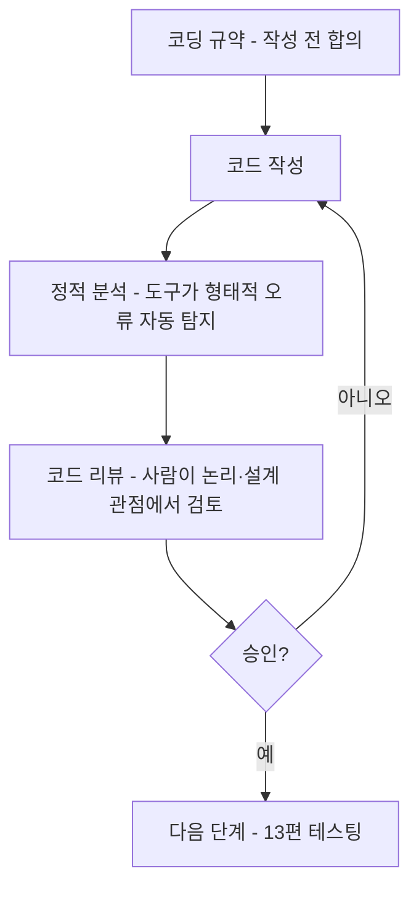

<Callout type="info">
  **이번 문서의 목표:** 이 파일을 다 읽으면 구현(코딩) 단계가 설계 단계와 어떻게 이어지는지 설명할 수 있고, 코딩 규약이 왜 필요한지, 코드 리뷰의 종류와 정적 분석의 원리를 구분할 수 있으며, 구현 단계에서 품질을 확보하는 방법들이 서로 어떤 시점에 어떤 방식으로 작동하는지 비교할 수 있다.
</Callout>

## 왜 구현 단계에도 별도의 품질 확보 절차가 필요한가

11편까지는 요구사항을 분석하고(06~08편) 클래스와 다이어그램으로 설계를 다듬는(09~11편) 과정을 다뤘습니다. 이제 그 설계를 실제로 동작하는 프로그램 코드로 옮기는 단계가 옵니다. 이 단계를 **구현**(construction, 코딩)이라고 부릅니다. 그런데 아무리 설계가 훌륭해도, 그 설계를 코드로 옮기는 과정에서 사람마다 서로 다른 방식으로 코드를 작성하면 새로운 문제가 생깁니다. 여러 사람이 나눠 작성한 코드가 제각각 다른 스타일과 관례를 따르면, 나중에 코드를 읽고 유지보수하는 사람이 매번 새로운 방식을 처음부터 이해해야 하고, 실수를 발견하기도 어려워집니다.

> **쉽게 말하면:** 설계가 "집을 어떻게 배치할지 그린 도면"이라면, 구현은 "그 도면을 보고 실제로 벽돌을 쌓는 작업"입니다. 도면이 아무리 정확해도, 벽돌을 쌓는 사람마다 시멘트 배합 비율이나 벽돌 간격을 제멋대로 정하면 벽이 부실해질 수 있습니다. 코딩 규약·코드 리뷰·정적 분석은 이 "쌓는 방식"을 일관되고 안전하게 만드는 절차들입니다.

## 1. 구현 단계에서 지켜야 할 두 가지 층위

구현 단계에서 코드의 품질을 확보하는 방법은 크게 두 층위로 나눌 수 있습니다.

- **작성 시점에 미리 정해 두는 규칙**: 코드를 어떤 형식으로, 어떤 이름 규칙으로 쓸지 미리 약속해 두는 **코딩 규약**입니다.
- **작성한 뒤에 확인하는 절차**: 이미 작성된 코드를 사람이 눈으로 검토하는 **코드 리뷰**와, 도구가 자동으로 분석하는 **정적 분석**입니다.

| 구분 | 시점 | 방식 | 목적 |
|------|------|------|------|
| 코딩 규약 | 코드 작성 이전에 정해 둠 | 규칙 문서로 미리 합의 | 스타일·명명의 일관성 확보 |
| 코드 리뷰 | 코드 작성 직후, 실행 전 | 사람이 눈으로 읽고 의견을 나눔 | 논리 오류, 설계 위반, 가독성 문제 발견 |
| 정적 분석 | 코드 작성 직후, 실행 전 | 도구가 코드를 실행하지 않고 자동으로 검사 | 잠재적 결함, 규약 위반, 보안 취약점을 기계적으로 탐지 |

## 2. 코딩 규약 — 미리 합의해 두는 스타일과 명명 규칙

**코딩 규약**(coding convention, coding standard)은 변수·함수의 이름을 짓는 방식, 들여쓰기와 괄호 위치, 주석을 다는 방식 등 코드를 작성하는 형식을 팀 전체가 미리 합의해 통일한 규칙입니다.

코딩 규약이 존재하는 이유는 단순히 "보기 좋게 하기 위해서"가 아닙니다. 여러 사람이 함께 개발하는 프로젝트에서, 코드를 작성한 사람과 그 코드를 나중에 읽고 수정하는 사람이 다른 경우가 대부분입니다(11편에서 다룬 아키텍처가 잘 되어 있어도, 그 안의 코드 자체가 제각각이면 유지보수 비용이 커집니다). 코딩 규약을 지키면 코드를 처음 보는 사람도 "이 이름 형식이면 상수구나", "이 들여쓰기면 이 블록 안에 속한 코드구나"를 빠르게 파악할 수 있습니다.

대표적인 코딩 규약의 예시는 다음과 같습니다.

| 규약 항목 | 규칙 예시 |
|------------|-------------|
| 명명 규칙 | 변수·함수 이름은 그 역할이 드러나게 짓는다(예: 임시로 쓰는 값이라도 `x1`, `temp` 대신 `합계금액`처럼 의미를 담는다) |
| 들여쓰기·중괄호 | 같은 블록 수준은 같은 칸 수만큼 들여쓰고, 여는 중괄호의 위치를 팀 전체가 통일한다 |
| 주석 규칙 | 함수의 목적·매개변수·반환값을 정해진 형식으로 주석에 남긴다 |
| 매직 넘버 금지 | 코드 안에 의미를 알 수 없는 숫자(예: 할인율 계산에 `0.87`을 그대로 씀)를 직접 쓰지 않고, 이름 붙은 상수(`정상가할인율`)로 정의해 사용한다 |

**자주 틀리는 점**: "코딩 규약은 개인의 코딩 스타일을 존중하기 위한 권고 사항일 뿐, 지키지 않아도 무방하다"는 오답입니다. 코딩 규약은 팀 전체의 유지보수성과 가독성을 위해 지켜야 하는 공동의 약속이며, 어기면 이후 코드 리뷰 단계에서 지적 대상이 됩니다.

> **쉽게 말하면:** 코딩 규약은 "한 회사 안에서 쓰는 공문서 서식"과 같습니다. 서식이 통일되어 있으면 누가 작성한 문서든 어디에 어떤 내용이 있는지 빠르게 찾을 수 있지만, 사람마다 제멋대로 서식을 바꾸면 매번 처음부터 문서를 훑어야 합니다.

## 3. 코드 리뷰 — 사람이 눈으로 검토한다

**코드 리뷰**(code review)는 작성된 코드를 작성자 본인이 아닌 다른 개발자(또는 여러 명)가 함께 읽고, 오류나 개선점을 찾아내는 절차입니다. 코드 리뷰는 코딩 규약처럼 형식적인 부분뿐 아니라, **코드가 정말 의도한 대로 동작하는가**, **설계 원리(11편의 결합도·응집도)를 위반하지는 않았는가**, **더 간단한 방법은 없는가**처럼 사람의 판단이 필요한 부분까지 다룹니다.

코드 리뷰는 진행 방식에 따라 몇 가지로 나뉩니다.

- **동료 검토**(peer review, 페어 리뷰): 동료 개발자 한두 명이 코드를 비공식적으로 검토합니다. 가장 가볍고 빠르게 진행할 수 있는 방식입니다.
- **워크스루**(walkthrough): 작성자가 자신의 코드(또는 설계 산출물)를 팀원들에게 직접 설명하며 함께 짚어 나가는 검토 방식입니다. 작성자가 주도한다는 점이 특징입니다.
- **인스펙션**(inspection): 정해진 역할(진행자, 기록자, 검토자 등)과 정해진 절차에 따라 공식적으로 진행하는 가장 엄격한 검토 방식입니다. 결함을 발견하는 데 목적을 두며, 발견된 결함은 정해진 양식으로 기록되고 추적됩니다.

| 방식 | 형식성 | 주도자 | 특징 |
|------|---------|--------|------|
| 동료 검토 | 낮음(비공식) | 검토자(동료) | 빠르고 가벼움 |
| 워크스루 | 중간 | 작성자 | 작성자가 직접 설명하며 진행 |
| 인스펙션 | 높음(공식) | 정해진 역할 분담 | 절차와 기록이 엄격, 결함 발견에 특화 |

**자주 틀리는 점**: "워크스루와 인스펙션은 같은 절차를 부르는 서로 다른 이름일 뿐이다"는 오답입니다. 워크스루는 작성자가 주도해 코드를 설명하는 비교적 가벼운 방식이고, 인스펙션은 정해진 역할과 절차에 따라 공식적으로 진행하며 결함을 기록·추적하는 더 엄격한 방식입니다.

> **쉽게 말하면:** 동료 검토는 "친구에게 내가 쓴 글을 슬쩍 봐달라고 부탁하는 것", 워크스루는 "내가 쓴 글을 직접 낭독하며 사람들과 함께 짚어보는 것", 인스펙션은 "정식 편집자가 정해진 체크리스트에 따라 원고를 검수하고 문제점을 서류로 남기는 것"에 비유할 수 있습니다.

## 4. 정적 분석 — 도구가 실행 없이 코드를 검사한다

**정적 분석**(static analysis)은 프로그램을 실제로 실행하지 않은 상태에서, 코드 자체의 구조와 형태만 분석해 잠재적인 문제를 찾아내는 방법입니다. "정적(static)"이라는 이름은 프로그램이 "움직이지 않는(실행되지 않는) 상태"에서 분석한다는 뜻이며, 이는 프로그램을 실제로 실행시켜 결과를 관찰하는 "동적(dynamic)" 방식(13~15편에서 다룰 테스팅)과 대비됩니다.

정적 분석 도구는 코드를 한 줄씩 기계적으로 훑으면서 다음과 같은 문제를 자동으로 찾아냅니다.

- 코딩 규약 위반(명명 규칙, 들여쓰기 등)
- 선언은 했지만 한 번도 사용하지 않는 변수
- 초기화하지 않고 사용하는 변수
- 항상 참이거나 항상 거짓인 조건문처럼 도달할 수 없는 코드
- 알려진 보안 취약점 패턴(예: 사용자 입력을 검증 없이 그대로 사용하는 코드)

정적 분석의 장점은 프로그램을 실행할 필요가 없으므로 개발 초기, 심지어 코드를 작성하는 도중에도 즉시 문제를 알려줄 수 있다는 점입니다. 반면 한계도 있습니다. 정적 분석은 코드의 형태만 보고 판단하기 때문에, "이 계산 결과가 업무 요구사항에 맞는 올바른 값인가" 같은 **의미적으로 옳은지**는 판단하지 못합니다. 이런 의미적인 오류는 사람이 하는 코드 리뷰나, 실제로 실행해 결과를 확인하는 테스팅에서 발견해야 합니다.

**자주 틀리는 점**: "정적 분석은 프로그램을 실행하며 실제 출력값을 확인하는 방법이다"는 오답입니다. 프로그램을 실행해 결과를 확인하는 것은 동적 분석(테스팅)의 방식이며, 정적 분석은 실행하지 않고 코드의 구조만 분석합니다.

> **쉽게 말하면:** 정적 분석은 "요리를 하기 전에 재료 목록과 조리 순서만 보고 이상한 점(빠진 재료, 순서가 꼬인 단계)을 찾아내는 것"입니다. 실제로 요리를 해서 맛을 보지 않아도 종이 위의 레시피만 보고도 발견할 수 있는 문제들이 있습니다.

## 5. 세 가지 방법이 함께 작동하는 흐름

코딩 규약, 코드 리뷰, 정적 분석은 서로 경쟁하는 방법이 아니라, 구현 단계의 품질을 여러 겹으로 확보하는 **서로 보완하는 절차**입니다.

코딩 규약은 애초에 문제가 생길 여지를 줄이는 **예방** 역할을, 정적 분석은 사람이 놓치기 쉬운 형태적 문제를 빠르고 꾸준하게 잡아내는 **자동화된 1차 점검** 역할을, 코드 리뷰는 도구가 판단할 수 없는 논리적·설계적 타당성을 확인하는 **사람의 최종 점검** 역할을 맡습니다. 이렇게 확인된 코드는 13편부터 다루는 **테스팅**(실제로 프로그램을 실행해 결과를 확인하는 동적 검증) 단계로 넘어갑니다.

**자주 틀리는 점**: "정적 분석 도구를 사용하면 코드 리뷰는 생략해도 된다"는 오답입니다. 정적 분석은 형태적·기계적으로 발견 가능한 문제에 한정되며, 업무 요구사항과의 정합성이나 설계 원리 위반처럼 판단이 필요한 문제는 여전히 사람의 코드 리뷰가 필요합니다.

## 핵심 정리

- 구현(코딩) 단계는 설계를 실제 코드로 옮기는 단계이며, 코딩 규약·코드 리뷰·정적 분석이라는 세 가지 방법으로 품질을 확보한다.
- 코딩 규약은 코드 작성 이전에 명명·형식·주석 규칙을 미리 합의해 일관성을 확보하는 예방적 규칙이다.
- 코드 리뷰는 사람이 코드를 읽고 검토하는 방법으로, 비공식적인 동료 검토, 작성자가 주도하는 워크스루, 정해진 절차와 역할로 진행되는 공식적인 인스펙션으로 나뉜다.
- 정적 분석은 프로그램을 실행하지 않고 코드의 구조만 분석해 규약 위반·미사용 변수·도달 불가능한 코드 등을 자동으로 탐지하지만, 업무 요구사항과의 의미적 정합성은 판단하지 못한다.
- 세 방법은 예방(코딩 규약) → 자동화된 1차 점검(정적 분석) → 사람의 최종 점검(코드 리뷰) 순으로 서로 보완하며 작동하고, 이후 13편의 테스팅(동적 검증)으로 이어진다.

## 마무리 복습

<Quiz
  questionNumber={1}
  question="코딩 규약(coding convention)에 대한 설명으로 가장 적절한 것은?"
  options={['코딩 규약은 개인의 취향에 따라 자유롭게 무시해도 되는 권고 사항이다.', '코딩 규약은 명명 규칙, 들여쓰기, 주석 형식 등을 팀 전체가 미리 합의해 통일한 규칙이다.', '코딩 규약은 프로그램을 실행해 결과를 확인하는 절차를 의미한다.', '코딩 규약은 코드 작성이 끝난 뒤에만 적용할 수 있는 절차다.']}
  correctAnswer={2}
  explanation="코딩 규약은 변수·함수 명명 방식, 들여쓰기, 주석 형식 등을 코드 작성 이전에 팀 전체가 미리 합의해 통일한 규칙이다."
  optionExplanations={['코딩 규약은 팀 전체의 유지보수성을 위해 지켜야 하는 공동의 약속이다.', '정답. 코딩 규약은 작성 이전에 합의하는 형식 규칙이다.', '프로그램을 실행해 결과를 확인하는 것은 테스팅(동적 검증)의 역할이다.', '코딩 규약은 코드 작성 이전에 미리 정해 두는 규칙이다.']}
/>

<Quiz
  questionNumber={2}
  question="코드 리뷰 방식 중, 정해진 역할과 절차에 따라 공식적으로 진행되며 발견된 결함을 정해진 양식으로 기록·추적하는 방식은?"
  options={['동료 검토(peer review)', '워크스루(walkthrough)', '인스펙션(inspection)', '정적 분석(static analysis)']}
  correctAnswer={3}
  explanation="인스펙션은 진행자, 기록자, 검토자 등 정해진 역할과 절차에 따라 공식적으로 진행되며, 발견된 결함을 정해진 양식으로 기록하고 추적하는 가장 엄격한 코드 리뷰 방식이다."
  optionExplanations={['동료 검토는 비공식적으로 가볍게 진행되는 방식이다.', '워크스루는 작성자가 직접 설명하며 진행하는 방식으로 인스펙션보다 형식성이 낮다.', '정답. 인스펙션은 정해진 절차와 기록을 갖춘 공식적인 검토 방식이다.', '정적 분석은 사람이 아닌 도구가 코드를 실행 없이 분석하는 방법이다.']}
/>

<Quiz
  questionNumber={3}
  question="워크스루(walkthrough)와 인스펙션(inspection)의 차이에 대한 설명으로 가장 적절한 것은?"
  options={['워크스루와 인스펙션은 완전히 같은 절차를 다르게 부르는 이름이다.', '워크스루는 작성자가 주도해 코드를 설명하는 비교적 가벼운 방식이고, 인스펙션은 정해진 역할과 절차에 따라 공식적으로 진행되는 방식이다.', '워크스루가 인스펙션보다 더 엄격하고 공식적인 절차다.', '인스펙션은 도구가 자동으로 수행하는 검토 방식이다.']}
  correctAnswer={2}
  explanation="워크스루는 작성자가 주도해 코드를 직접 설명하며 진행하는 비교적 가벼운 방식이고, 인스펙션은 정해진 역할 분담과 절차에 따라 공식적으로 진행되며 결함을 기록·추적하는 더 엄격한 방식이다."
  optionExplanations={['두 방식은 형식성과 진행 주체가 다른 별개의 절차다.', '정답. 워크스루는 가벼운 방식, 인스펙션은 공식적인 방식이다.', '엄격성의 방향이 뒤바뀌었다. 인스펙션이 워크스루보다 더 엄격하다.', '인스펙션은 사람이 정해진 역할에 따라 수행하는 절차이며, 도구가 자동 수행하는 것은 정적 분석이다.']}
/>

<Quiz
  questionNumber={4}
  question="정적 분석(static analysis)에 대한 설명으로 옳지 않은 것은?"
  options={['프로그램을 실제로 실행하지 않고 코드의 구조만 분석해 문제를 찾는다.', '선언은 했지만 사용하지 않는 변수나 도달할 수 없는 코드를 자동으로 탐지할 수 있다.', '정적 분석은 프로그램을 실행하며 실제 출력값을 확인하는 방법이다.', '정적 분석은 업무 요구사항과의 의미적 정합성까지는 판단하지 못한다.']}
  correctAnswer={3}
  explanation="정적 분석은 프로그램을 실행하지 않고 코드 구조만 분석하는 방법이며, 프로그램을 실행해 실제 출력값을 확인하는 것은 동적 분석(테스팅)의 방식이다."
  optionExplanations={['옳은 설명이다. 정적 분석의 핵심 정의다.', '옳은 설명이다. 미사용 변수, 도달 불가능한 코드 탐지는 정적 분석의 대표 기능이다.', '옳지 않은 설명이므로 정답이다. 실행하며 확인하는 것은 동적 분석(테스팅)이다.', '옳은 설명이다. 의미적 정합성 판단은 사람의 코드 리뷰나 테스팅이 담당한다.']}
/>

<Quiz
  questionNumber={5}
  question="구현 단계에서 코딩 규약, 코드 리뷰, 정적 분석이 서로 어떤 관계인지에 대한 설명으로 가장 적절한 것은?"
  options={['세 방법은 서로 대체 가능하므로 그중 하나만 선택해 적용하면 된다.', '정적 분석 도구를 사용하면 사람이 하는 코드 리뷰는 생략해도 무방하다.', '코딩 규약은 예방, 정적 분석은 자동화된 1차 점검, 코드 리뷰는 사람의 최종 점검 역할을 맡아 서로 보완한다.', '코드 리뷰가 끝난 뒤에는 코딩 규약을 적용할 필요가 없다.']}
  correctAnswer={3}
  explanation="코딩 규약은 문제 발생을 예방하고, 정적 분석은 도구로 형태적 문제를 빠르게 자동 탐지하며, 코드 리뷰는 도구가 판단할 수 없는 논리적·설계적 타당성을 사람이 최종 점검하는 방식으로 세 방법이 서로 보완한다."
  optionExplanations={['세 방법은 대체 관계가 아니라 서로 다른 관점에서 품질을 확보하는 보완 관계다.', '정적 분석은 형태적 문제에 한정되며 의미적 타당성 판단에는 사람의 코드 리뷰가 여전히 필요하다.', '정답. 세 방법은 예방, 자동 점검, 사람의 최종 점검으로 역할이 나뉘어 보완한다.', '코딩 규약은 작성 전부터 계속 적용되는 공동의 약속이며 특정 단계 이후 불필요해지는 것이 아니다.']}
/>

<Quiz
  questionNumber={6}
  question="다음 중 코딩 규약의 예시로 가장 적절한 것은?"
  options={['코드 안에 의미를 알 수 없는 숫자를 직접 쓰지 않고 이름 붙은 상수로 정의해 사용한다.', '프로그램을 실제로 실행해 계산 결과가 요구사항과 맞는지 확인한다.', '정해진 역할 분담에 따라 공식적인 절차로 결함을 기록하고 추적한다.', '도구를 이용해 미사용 변수와 도달 불가능한 코드를 자동으로 탐지한다.']}
  correctAnswer={1}
  explanation="매직 넘버를 피하고 의미가 드러나는 이름 붙은 상수를 사용하는 것은 코딩 규약이 정하는 대표적인 명명·형식 규칙이다."
  optionExplanations={['정답. 매직 넘버 금지는 코딩 규약의 대표적인 항목이다.', '이는 테스팅(동적 검증)에 해당하는 활동이다.', '이는 인스펙션(코드 리뷰의 한 형태)에 대한 설명이다.', '이는 정적 분석 도구의 기능에 대한 설명이다.']}
/>

## 참고 자료

- [ACM/IEEE SWEBOK v4 안내](https://www.computer.org/education/bodies-of-knowledge/software-engineering)
- [SWEBOK topics 상세](https://www.computer.org/education/bodies-of-knowledge/software-engineering/topics)
