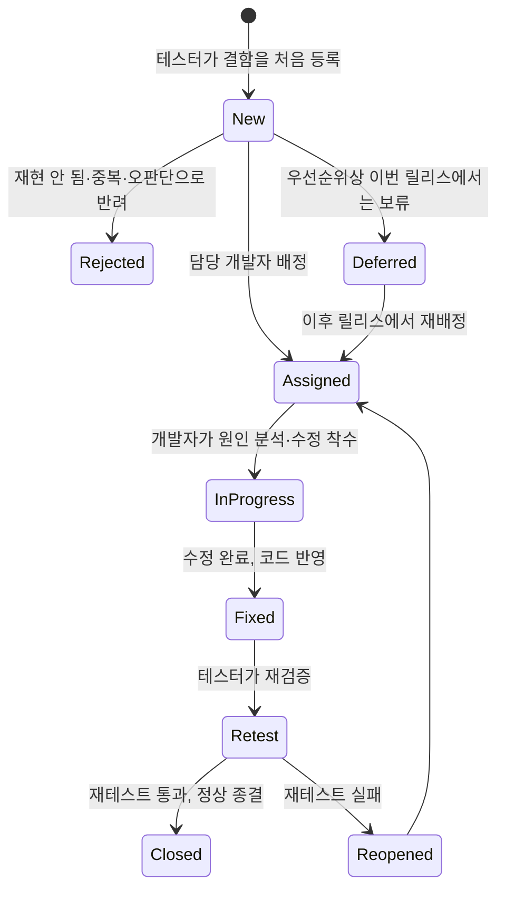
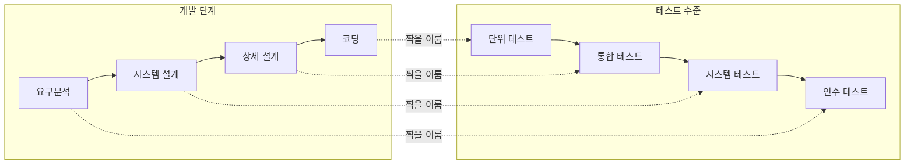

<Callout type="info">
  **이번 문서의 목표:** 이 파일을 다 읽으면 테스트가 무엇을 목적으로 하는 활동인지, 검증(verification)과 확인(validation)이 어떻게 다른지, 결함(defect)이 발견부터 종료까지 어떤 상태를 거치는지, 그리고 단위·통합·시스템·인수라는 테스트 수준이 왜 나뉘어 있는지를 설명할 수 있다.
</Callout>

## 왜 테스트를 별도의 지식 영역으로 배우는가

05편에서 소프트웨어공학의 목표를 "정해진 자원 안에서 품질 좋은 소프트웨어를 만드는 것"이라고 정리했습니다. 그런데 아무리 설계를 잘하고 코드를 잘 짜도, 사람이 만드는 이상 실수는 반드시 섞여 들어갑니다. 12편에서 본 코드 리뷰와 정적 분석이 코드를 "읽어서" 문제를 찾는 활동이었다면, 테스트(testing)는 프로그램을 실제로 "실행해서" 문제를 찾는 활동입니다. 이 편부터 18편(품질보증과 메트릭)까지는 "만든 것이 제대로 만들어졌는가"를 확인하는 소프트웨어공학의 검증 영역을 다룹니다.

> **쉽게 말하면:** 설계·구현이 요리를 만드는 과정이라면, 테스트는 그 요리를 실제로 먹어 보며 간이 맞는지 확인하는 과정입니다.

## 1. 테스트의 목적 — 결함을 찾는 것이지, 없음을 증명하는 것이 아니다

테스트의 목적은 "프로그램이 잘못 동작하는 경우를 찾아내는 것"입니다. 얼핏 당연해 보이지만, 여기에는 중요한 함정이 있습니다. **테스트는 결함이 있다는 것은 보여줄 수 있어도, 결함이 전혀 없다는 것은 증명하지 못합니다.** 아무리 많은 테스트 케이스를 통과해도, 아직 시도해 보지 않은 입력값에서 문제가 생길 가능성은 항상 남아 있기 때문입니다.

이 원리는 왜 결함을 일찍 찾아야 하는지와 직결됩니다. 결함이 발견되는 단계가 늦어질수록 그 결함을 고치는 비용은 크게 늘어납니다. 요구사항 단계에서 잘못 이해한 내용을 그 자리에서 바로잡으면 문서 몇 줄만 고치면 되지만, 같은 실수가 운영 단계까지 흘러가면 이미 배포된 코드를 수정하고, 재테스트하고, 재배포하는 데 훨씬 큰 비용이 듭니다.

| 결함이 발견된 단계 | 수정 비용(상대값, 요구단계=1 기준) |
|---|---|
| 요구분석 | 1배 |
| 설계 | 3–6배 |
| 구현(코딩) | 10배 안팎 |
| 테스트 | 20–40배 |
| 운영(배포 이후) | 100배 이상 |

이 표의 정확한 배수는 프로젝트마다 다르지만, "늦게 발견할수록 기하급수적으로 비싸진다"는 경향 자체는 시험에서 자주 묻는 핵심 원리입니다. 그래서 소프트웨어공학은 코딩이 끝난 뒤 한 번에 몰아서 테스트하기보다, 요구공학 단계의 검토(06~07편)부터 시작해 각 단계마다 결함을 조기에 잡아내는 흐름을 강조합니다.

> **쉽게 말하면:** 오타는 원고를 쓰는 중에 고치면 펜으로 한 줄 긋고 끝이지만, 책이 인쇄되어 서점에 깔린 뒤에 발견하면 책을 전부 회수해서 다시 찍어야 하는 것과 같습니다.

## 2. 오류·결함·실패 — 테스트 관점에서 다시 보기

03편의 용어 지도에서 오류(error)·결함(fault, defect)·실패(failure)를 구분한 적이 있습니다. 테스트를 이해하려면 이 세 단어를 테스트 활동과 바로 연결할 수 있어야 합니다.

- **오류**(error): 사람이 저지르는 실수 자체입니다. 예를 들어 개발자가 "할인율은 10퍼센트"라는 요구사항을 "10"이 아니라 "0.1"이 아닌 "1"로 잘못 코딩한 순간의 착각이 오류입니다.
- **결함**(defect, fault): 그 오류가 코드나 문서에 남긴 흔적입니다. 위 예시라면 소스 코드 안에 잘못 적힌 그 한 줄이 결함입니다. 결함은 프로그램이 실행되지 않아도 코드 리뷰나 정적 분석(12편)으로도 찾을 수 있습니다.
- **실패**(failure): 그 결함이 있는 코드가 실제로 실행되어, 사용자가 기대한 것과 다른 결과가 겉으로 드러난 상태입니다. 위 예시라면 "할인 금액이 10배로 계산되어 화면에 표시되는 것"이 실패입니다.

테스트는 바로 이 **실패를 관찰해서 그 뒤에 숨은 결함을 찾아내는 활동**입니다. 테스트 케이스를 실행했는데 기대 결과와 실제 결과가 다르면(실패 관찰), 그 원인이 되는 코드 위치(결함)를 추적하고, 그 결함을 만든 최초의 잘못된 판단(오류)까지 거슬러 올라가 재발을 막는 것이 이상적인 흐름입니다.

## 3. 검증(Verification)과 확인(Validation)의 차이

독학사 시험에서 "검증"과 "확인"을 헷갈리게 짝지어 놓고 옳고 그름을 묻는 문제가 자주 나옵니다. 두 단어는 한국어로는 뜻이 비슷해 보이지만, 소프트웨어공학에서는 **비교 대상이 다른 완전히 별개의 활동**입니다.

> **쉽게 말하면:** 검증은 "설계도대로 지었는가"를 확인하는 것이고, 확인은 "애초에 짓고 싶었던 그 집이 맞는가"를 확인하는 것입니다.

| 구분 | 검증(Verification) | 확인(Validation) |
|---|---|---|
| 핵심 질문 | 제품을 올바르게(right) 만들었는가 | 올바른(right) 제품을 만들었는가 |
| 비교 대상 | 산출물과 그 산출물의 명세(설계서, 요구사항 명세서) | 완성된 제품과 실제 사용자의 필요 |
| 주로 쓰는 방법 | 검토(review), 인스펙션, 워크스루, 정적 분석 — 실행 없이 문서·코드를 살펴봄 | 실행 기반 테스트, 사용자 인수 테스트 |
| 예시 질문 | "이 코드가 설계 문서에서 정한 인터페이스대로 구현되었는가" | "이 프로그램이 사용자가 실제로 원했던 업무를 처리해 주는가" |

검증은 각 단계의 산출물이 그 이전 단계의 산출물(주로 명세)과 일치하는지를 확인하므로, 코드를 실행하지 않고도 수행할 수 있는 정적(static) 활동이 많습니다. 반면 확인은 완성된 제품(또는 그 일부)을 실제로 동작시켜 사용자의 진짜 필요와 맞는지 보는 동적(dynamic) 활동이 중심입니다. 그래서 "요구사항 명세서를 검토하는 것"은 검증에 가깝고, "완성된 화면을 사용자에게 보여주고 인수 테스트를 받는 것"은 확인에 가깝습니다.

실무에서는 이 둘을 합쳐 **V&V**(Verification and Validation)라고 부르며, 좋은 소프트웨어공학 프로세스는 이 두 활동을 생명주기 전 단계에 걸쳐 함께 수행하도록 설계합니다. 검증만 잘해서 명세대로 정확히 만들었다 해도, 그 명세 자체가 사용자의 필요와 어긋나 있었다면 확인에서 실패합니다. 반대로 확인만 신경 쓰고 검증을 소홀히 하면, 우연히 사용자 마음에는 들지만 설계 원칙이 무너진 유지보수 불가능한 제품이 나올 위험이 있습니다.

## 4. 결함 생명주기 — 발견부터 종료까지

테스트에서 결함을 찾았다고 그 자리에서 바로 사라지는 것이 아닙니다. 결함은 발견된 뒤 정해진 상태를 거쳐 처리됩니다. 이 흐름을 **결함 생명주기**(defect life cycle) 또는 버그 생명주기라고 부릅니다.

각 상태의 의미를 짚어 보면 다음과 같습니다.

- **New**(신규): 테스터가 실패를 관찰하고 결함 보고서를 처음 등록한 상태입니다.
- **Assigned**(배정): 프로젝트 책임자나 리드가 이 결함을 누가 고칠지 담당자를 정한 상태입니다.
- **In Progress**(처리 중): 담당 개발자가 원인을 분석하고 코드를 고치고 있는 상태입니다.
- **Fixed**(수정 완료): 개발자가 코드 수정을 마치고 형상관리 저장소(17편)에 반영한 상태입니다.
- **Retest**(재검증): 테스터가 수정된 코드를 다시 실행해 그 결함이 실제로 사라졌는지 확인하는 상태입니다.
- **Closed**(종결): 재검증까지 통과해 이 결함 처리가 완전히 끝난 상태입니다.
- **Reopened**(재오픈): 재검증에서 여전히 문제가 재현되면, 다시 처리 담당자에게 돌아갑니다.
- **Rejected**(반려): 결함이 아니라 테스터의 오해였거나, 이미 등록된 결함과 중복이었을 때 붙는 상태입니다.
- **Deferred**(보류): 결함은 맞지만 이번 릴리스에서는 우선순위가 낮아 다음 릴리스로 미루기로 한 상태입니다.

이 생명주기는 15편에서 다룰 결함 보고서 항목(심각도, 우선순위, 상태 필드)과 바로 연결됩니다. 결함 상태는 단순한 행정 절차가 아니라, "지금 이 프로젝트에 남아 있는 결함이 몇 개이고 그중 몇 개가 아직 처리 중인가"를 관리하는 근거 데이터가 됩니다.

## 5. 테스트 수준 개요 — 왜 한 번에 다 테스트하지 않는가

프로그램을 완성한 뒤 통째로 한 번에 실행해 보면 될 것 같지만, 실제로는 작은 단위부터 점점 큰 단위로 단계를 나누어 테스트합니다. 이렇게 나누는 이유는 문제가 생겼을 때 원인을 좁혀 찾기 위해서입니다. 만약 전체 시스템을 한 번에 테스트하다 오류가 나면, 그 원인이 특정 함수의 버그인지, 두 모듈 사이의 인터페이스 문제인지, 아니면 데이터베이스 연결 설정 문제인지 구분하기가 매우 어렵습니다. 반대로 작은 단위(함수 하나)부터 검증해 두면, 이후 단계에서 문제가 생겨도 "이미 검증된 부분은 문제가 아니다"라는 전제 위에서 원인을 좁혀 갈 수 있습니다.

이 단계 구분은 소프트웨어 개발 단계와 짝을 이루도록 설계되어 있는데, 이를 시각화한 것이 **V-모델**입니다. 04편에서 프로세스 모델을 비교할 때 V-모델의 기본 형태를 다뤘다면, 여기서는 그 오른쪽 절반, 즉 테스트 수준이 왼쪽의 어느 개발 단계와 짝을 이루는지에 집중합니다.

네 가지 테스트 수준을 간단히 소개하면 다음과 같습니다(자세한 절차와 기법은 14편에서 다룹니다).

- **단위 테스트**(unit test): 함수나 클래스 하나처럼 가장 작은 단위를 개별적으로 검증합니다. 상세 설계에서 정한 각 모듈의 내부 로직이 맞는지 확인하는 단계입니다.
- **통합 테스트**(integration test): 단위 테스트를 통과한 모듈들을 하나씩 결합하며, 모듈 사이의 인터페이스(호출 방식, 데이터 전달)가 설계대로 맞물리는지 확인합니다.
- **시스템 테스트**(system test): 모든 모듈이 결합된 완성품을 대상으로, 기능 요구사항뿐 아니라 성능·보안 같은 비기능 요구사항까지 포함해 시스템 설계 전체를 검증합니다.
- **인수 테스트**(acceptance test): 사용자나 고객의 관점에서, 애초에 요구분석 단계에서 합의했던 그 요구사항이 실제로 충족되었는지 확인합니다. 이 단계는 검증보다 확인(validation)의 성격이 강합니다.

즉 코딩과 가장 가까운 단위 테스트부터, 요구분석과 가장 가까운 인수 테스트까지 순서대로 진행하면서, 앞 단계에서 확인한 것을 전제로 다음 단계의 범위를 넓혀 가는 구조입니다.

## 핵심 정리

- 테스트의 목적은 결함을 찾는 것이며, 결함이 없다는 것을 증명하는 활동이 아니다. 결함은 늦게 발견될수록 수정 비용이 기하급수적으로 커진다.
- 오류(사람의 실수) → 결함(코드·문서에 남은 흔적) → 실패(실행 중 겉으로 드러난 잘못된 결과)의 흐름에서, 테스트는 실패를 관찰해 결함을 찾아내는 활동이다.
- 검증은 "제품을 올바르게 만들었는가"(명세와 비교, 정적 활동 중심), 확인은 "올바른 제품을 만들었는가"(사용자 필요와 비교, 실행 기반 활동 중심)를 묻는다.
- 결함은 신규-배정-처리중-수정완료-재검증-종결(또는 재오픈·반려·보류)이라는 생명주기를 거쳐 관리된다.
- 테스트 수준은 단위-통합-시스템-인수 순으로 커지며, 각각 코딩-상세설계-시스템설계-요구분석과 짝을 이루는 V-모델 구조를 가진다.

## 마무리 복습

<Quiz
  questionNumber={1}
  question="테스트의 목적에 대한 설명으로 가장 적절한 것은?"
  options={['테스트는 프로그램에 결함이 전혀 없음을 수학적으로 증명하는 활동이다.', '테스트는 프로그램에 결함이 존재함을 드러낼 수 있지만, 결함이 없음을 증명하지는 못한다.', '테스트를 충분히 수행하면 남은 결함이 0개임을 보장할 수 있다.', '테스트는 코딩이 모두 끝난 뒤 단 한 번만 수행하면 충분하다.']}
  correctAnswer={2}
  explanation="테스트는 결함의 존재를 드러내는 활동이지, 아직 발견되지 않은 결함까지 포함해 결함이 전혀 없음을 증명하는 활동은 아니다."
  optionExplanations={['테스트로 결함 없음을 증명하는 것은 불가능하다.', '정답. 테스트는 결함이 있음을 보여줄 수는 있어도 없음을 증명하지는 못한다.', '아무리 많은 테스트를 통과해도 결함이 0개라는 보장은 되지 않는다.', '테스트는 요구분석·설계 단계의 검토부터 단계마다 조기에 수행하는 것이 바람직하다.']}
/>

<Quiz
  questionNumber={2}
  question="오류(error), 결함(defect), 실패(failure)의 관계를 순서대로 바르게 나열한 것은?"
  options={['결함이 발생하면 오류가 생기고, 그 오류가 실행되면 실패로 드러난다.', '실패가 원인이 되어 오류가 생기고, 그 오류가 코드에 남아 결함이 된다.', '사람의 실수인 오류가 코드에 결함을 남기고, 그 결함이 실행되면 실패로 드러난다.', '오류, 결함, 실패는 모두 같은 현상을 부르는 동의어다.']}
  correctAnswer={3}
  explanation="사람의 실수(오류)가 코드나 문서에 흔적(결함)을 남기고, 그 결함이 있는 코드가 실행되어 겉으로 드러나는 잘못된 결과가 실패다."
  optionExplanations={['결함이 오류를 만드는 것이 아니라, 오류가 결함을 만든다.', '실패가 오류의 원인이라는 설명은 인과관계가 반대다.', '정답. 오류 → 결함 → 실패 순서가 맞다.', '세 용어는 서로 다른 단계를 가리키는 별개의 개념이다.']}
/>

<Quiz
  questionNumber={3}
  question="검증(Verification)과 확인(Validation)의 구분으로 옳지 않은 것은?"
  options={['검증은 "제품을 올바르게 만들었는가"를, 확인은 "올바른 제품을 만들었는가"를 묻는다.', '검증은 주로 명세서와 산출물을 비교하는 정적 활동이 중심이다.', '확인은 완성된 제품을 실행해 사용자의 실제 필요와 맞는지 확인하는 활동이다.', '인수 테스트는 검증의 성격이 확인보다 훨씬 강한 활동이다.']}
  correctAnswer={4}
  explanation="인수 테스트는 사용자가 실제로 원하는 요구가 충족되었는지를 확인하는 활동이므로 검증보다 확인의 성격이 강하다."
  optionExplanations={['옳은 설명이다. 검증과 확인의 핵심 질문이 다르다.', '옳은 설명이다. 검증은 검토·인스펙션 같은 정적 활동이 중심이다.', '옳은 설명이다. 확인은 실행 기반의 동적 활동이다.', '옳지 않은 설명이므로 정답이다. 인수 테스트는 확인의 성격이 검증보다 강하다.']}
/>

<Quiz
  questionNumber={4}
  question="결함 생명주기에서, 테스터가 재검증(Retest)을 수행했는데 문제가 여전히 재현되었을 때 이동하는 상태는?"
  options={['Closed(종결)', 'Rejected(반려)', 'Reopened(재오픈)', 'Deferred(보류)']}
  correctAnswer={3}
  explanation="재검증에서 결함이 여전히 재현되면 다시 개발자에게 배정되어야 하므로 Reopened 상태로 이동한다."
  optionExplanations={['재검증에서 통과했을 때 이동하는 상태다.', '반려는 결함이 애초에 재현되지 않거나 오판단이었을 때 붙는 상태다.', '정답. 재검증 실패 시 Reopened로 이동해 다시 처리 담당자에게 배정된다.', '보류는 결함은 맞지만 이번 릴리스에서는 우선순위상 미루기로 했을 때의 상태다.']}
/>

<Quiz
  questionNumber={5}
  question="V-모델에서 짝을 이루는 개발 단계와 테스트 수준의 연결로 옳지 않은 것은?"
  options={['코딩 — 단위 테스트', '상세 설계 — 통합 테스트', '요구분석 — 시스템 테스트', '시스템 설계 — 시스템 테스트']}
  correctAnswer={3}
  explanation="요구분석은 인수 테스트와 짝을 이루며, 시스템 테스트와 짝을 이루는 단계는 시스템 설계다."
  optionExplanations={['옳은 연결이다. 코딩 단계는 단위 테스트와 짝을 이룬다.', '옳은 연결이다. 상세 설계는 통합 테스트와 짝을 이룬다.', '옳지 않은 연결이므로 정답이다. 요구분석은 인수 테스트와 짝을 이룬다.', '옳은 연결이다. 시스템 설계는 시스템 테스트와 짝을 이룬다.']}
/>

<Quiz
  questionNumber={6}
  question="테스트 수준을 작은 단위에서 큰 단위 순으로 나눠 진행하는 이유로 가장 적절한 것은?"
  options={['테스트 인력을 절약하기 위해서', '문제가 발생했을 때 원인을 좁혀서 찾기 쉽게 하기 위해서', '요구사항 명세서 작성을 생략할 수 있기 때문에', '코드 리뷰 없이도 결함을 완전히 없앨 수 있기 때문에']}
  correctAnswer={2}
  explanation="작은 단위부터 검증해 두면 이후 더 큰 단위에서 문제가 생겨도 이미 검증된 부분을 원인에서 제외할 수 있어, 원인을 좁혀 찾기 쉬워진다."
  optionExplanations={['인력 절약이 주된 이유는 아니다.', '정답. 단계별 검증은 문제 원인을 좁혀 찾기 위한 전략이다.', '테스트 수준 구분과 요구사항 명세 작성 여부는 별개다.', '테스트는 결함을 완전히 없앤다는 것을 보장하지 않는다.']}
/>

## 참고 자료

- [ACM/IEEE SWEBOK v4 안내](https://www.computer.org/education/bodies-of-knowledge/software-engineering)
- [SWEBOK topics 상세](https://www.computer.org/education/bodies-of-knowledge/software-engineering/topics)
