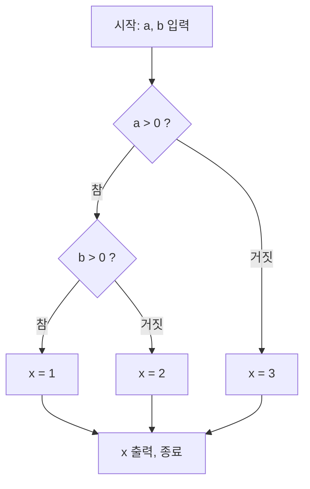

<Callout type="info">
  **이번 문서의 목표:** 이 파일을 다 읽으면 단위·통합·시스템·인수 테스트를 각각 누가 어떤 방식으로 수행하는지 설명할 수 있고, 블랙박스와 화이트박스 기법의 차이를 알며, 동등분할·경계값분석으로 테스트 케이스를 직접 설계하고, 제어흐름도에서 순환복잡도(cyclomatic complexity)를 계산해 기본경로를 도출할 수 있다.
</Callout>

## 13편 개요를 구체적인 절차로 확장한다

13편에서 테스트 수준이 단위-통합-시스템-인수 순으로 커진다는 큰 그림과, 테스트에는 어떤 관점으로 접근하느냐에 따라 여러 기법이 있다는 것을 예고했습니다. 이 편에서는 각 테스트 수준을 누가, 무엇을 대상으로, 어떤 절차로 수행하는지 구체화하고, 테스트 케이스를 실제로 어떻게 설계하는지를 블랙박스·화이트박스 두 갈래로 나누어 다룹니다.

## 1. 네 가지 테스트 수준의 구체적인 절차

### 단위 테스트(Unit Test)

단위 테스트는 함수·메서드·클래스처럼 더 이상 쪼갤 수 없는 가장 작은 단위를 대상으로 합니다. 보통 그 코드를 작성한 개발자 본인이 수행하며, 아직 다른 모듈이 완성되지 않은 상태에서도 테스트할 수 있도록 다음 두 가지 대역(stub, 스텁 부품)을 사용합니다.

- **드라이버**(driver): 테스트 대상 모듈을 호출하는 역할을 대신하는 임시 코드입니다. 테스트 대상 모듈이 아직 완성되지 않은 상위 모듈에서 호출되어야 하는 경우, 그 상위 모듈 대신 테스트용 입력을 주고 결과를 받아 확인합니다.
- **스텁**(stub): 테스트 대상 모듈이 호출하는 하위 모듈을 대신하는 임시 코드입니다. 아직 완성되지 않은 하위 모듈 대신 정해진 값만 돌려주는 가짜 부품 역할을 합니다.

> **쉽게 말하면:** 드라이버는 "아직 없는 위층에서 걸려 오는 전화를 대신 걸어 주는 역할", 스텁은 "아직 없는 아래층 대신 미리 정해 둔 답장만 보내 주는 역할"입니다.

### 통합 테스트(Integration Test)

통합 테스트는 단위 테스트를 통과한 모듈들을 하나씩 결합하며 모듈 사이의 인터페이스가 설계대로 맞물리는지 확인합니다. 어떤 순서로 모듈을 결합하느냐에 따라 다음과 같이 나뉩니다.

| 통합 방식 | 결합 순서 | 특징 |
|---|---|---|
| 빅뱅(big-bang) 통합 | 모든 모듈을 한꺼번에 결합 | 절차는 단순하지만 오류 발생 시 원인 위치를 찾기 어려움 |
| 하향식(top-down) 통합 | 상위 모듈부터 아래로 결합 | 하위 모듈은 스텁으로 대체, 전체 구조를 일찍 검증 가능 |
| 상향식(bottom-up) 통합 | 하위 모듈부터 위로 결합 | 상위 모듈은 드라이버로 대체, 핵심 하위 로직을 일찍 검증 가능 |
| 샌드위치(sandwich, 혼합식) 통합 | 상위는 하향식, 하위는 상향식으로 동시에 진행해 중간에서 만남 | 두 방식의 장점을 함께 취하지만 스텁·드라이버를 모두 준비해야 함 |

### 시스템 테스트(System Test)

시스템 테스트는 모든 모듈이 결합된 완성품 전체를 대상으로 합니다. 기능이 요구사항대로 동작하는지뿐 아니라, 성능(응답 속도), 보안, 사용성, 신뢰성 같은 비기능 요구사항까지 포함해 검증합니다. 이 단계부터는 대체로 개발팀과 독립된 별도의 테스트 조직이 수행해, 개발자 본인이 놓치기 쉬운 편향(자기 코드는 문제없을 것이라는 심리)을 줄입니다.

### 인수 테스트(Acceptance Test)

인수 테스트는 실제 사용자나 고객이 참여해, 애초에 요구분석(06~07편) 단계에서 합의한 요구사항이 충족되었는지 확인하는 단계입니다. 이 단계는 크게 두 가지로 나뉩니다.

- **알파 테스트**(alpha test): 개발 조직 내부의 통제된 환경에서, 실제 사용자(또는 사용자를 대표하는 인력)를 참여시켜 진행하는 테스트입니다.
- **베타 테스트**(beta test): 실제 운영 환경과 유사한 곳에서, 통제를 최소화한 채 다수의 일반 사용자에게 배포해 진행하는 테스트입니다.

## 2. 블랙박스 테스트와 화이트박스 테스트

테스트 케이스를 설계할 때 "무엇을 보고 케이스를 만드는가"에 따라 두 갈래로 나뉩니다.

| 구분 | 블랙박스 테스트(black-box test) | 화이트박스 테스트(white-box test) |
|---|---|---|
| 보는 것 | 입력과 출력의 관계(명세서 기준), 내부 코드는 보지 않음 | 내부 코드의 논리 구조(제어 흐름) |
| 주로 쓰는 수준 | 시스템 테스트, 인수 테스트 | 단위 테스트, 통합 테스트 |
| 대표 기법 | 동등분할, 경계값분석 | 문장·분기·조건 커버리지, 기본경로검사 |
| 강점 | 사용자 관점의 기능 결함을 잘 찾음 | 코드 안에 숨은 논리 오류·도달하지 않는 코드를 잘 찾음 |
| 한계 | 코드 내부에 중복되거나 죽은 경로가 있어도 알기 어려움 | 코드가 아예 명세와 다른 기능을 구현했다면 발견하기 어려움 |

> **쉽게 말하면:** 블랙박스는 상자를 열어 보지 않고 "이 버튼을 누르면 이 결과가 나와야 한다"만 확인하는 것이고, 화이트박스는 상자 뚜껑을 열어 회로가 설계도대로 이어져 있는지 하나하나 짚어 보는 것입니다.

## 3. 동등분할 — 대표값 하나로 한 무리를 검증한다

**동등분할**(equivalence partitioning)은 입력값의 범위를 "같은 결과가 나올 것으로 기대되는 무리(class, 클래스)"로 나눈 뒤, 각 무리에서 대표값 하나만 뽑아 테스트하는 기법입니다. 모든 입력값을 다 시도하는 것은 현실적으로 불가능하므로, "같은 무리 안의 값들은 비슷하게 처리될 것"이라는 전제 아래 대표값으로 무리 전체를 대신 검증합니다.

예시로 회원 가입 화면에서 "나이는 18세 이상 65세 이하만 입력 가능"이라는 명세가 있다고 합시다. 이 조건을 기준으로 입력값 전체를 다음 세 무리로 나눌 수 있습니다.

| 클래스 | 범위 | 대표값 | 기대 결과 |
|---|---|---|---|
| 무효 클래스 1 | 18 미만(`< 18`) | 10 | 가입 거부(오류 메시지) |
| 유효 클래스 | 18 이상 65 이하 | 40 | 가입 허용 |
| 무효 클래스 2 | 65 초과(`> 65`) | 80 | 가입 거부(오류 메시지) |

세 무리 각각에서 대표값 하나씩, 총 3개의 테스트 케이스만으로 "나이 유효성 검사"라는 기능 전체를 합리적으로 검증했다고 볼 수 있습니다. 만약 18세부터 65세까지 48개의 값을 모두 테스트한다면 시간 낭비가 크지만, 동등분할을 적용하면 훨씬 적은 케이스로도 비슷한 신뢰도를 얻을 수 있습니다.

## 4. 경계값분석 — 결함은 경계에서 가장 잘 숨는다

동등분할이 "무리의 한가운데 값"을 대표로 뽑는 방식이라면, **경계값분석**(boundary value analysis)은 오히려 "무리와 무리가 맞닿는 경계 근처의 값"을 집중적으로 테스트하는 기법입니다. 실무에서 결함은 `>=`와 `>`를 헷갈리거나, 반복문의 종료 조건을 하나 잘못 세는 것처럼 경계 부근에서 가장 자주 발생하기 때문입니다.

같은 "18세 이상 65세 이하" 조건에 경계값분석을 적용하면, 경계값인 18과 65를 기준으로 그 바로 앞뒤 값을 테스트 케이스로 뽑습니다.

| 테스트 케이스 | 입력값 | 기대 결과 | 확인하려는 것 |
|---|---|---|---|
| 하한 경계 미만 | 17 | 가입 거부 | 18 미만을 정확히 걸러내는가 |
| 하한 경계 | 18 | 가입 허용 | `18 이상`이라는 조건이 18을 포함하는가 |
| 하한 경계 바로 위 | 19 | 가입 허용 | 하한을 넘긴 값이 정상 처리되는가 |
| 상한 경계 바로 아래 | 64 | 가입 허용 | 상한을 넘기 직전 값이 정상 처리되는가 |
| 상한 경계 | 65 | 가입 허용 | `65 이하`라는 조건이 65를 포함하는가 |
| 상한 경계 초과 | 66 | 가입 거부 | 65 초과를 정확히 걸러내는가 |

동등분할과 경계값분석은 서로 배타적인 기법이 아니라 함께 쓰는 것이 일반적입니다. 동등분할로 큰 무리를 나누고, 그 무리의 경계에는 경계값분석을 추가로 적용해 테스트 케이스의 밀도를 높이는 방식입니다.

## 5. 기본경로검사와 순환복잡도 — 코드 안의 모든 독립된 길을 센다

화이트박스 기법 중 가장 체계적인 것이 **기본경로검사**(basis path testing)입니다. 이 기법은 프로그램의 논리 구조를 그래프로 그린 뒤, 그 그래프 안에 존재하는 "서로 독립된 실행 경로"의 개수를 계산하고, 그 개수만큼의 테스트 케이스를 만들어 모든 독립 경로를 최소 한 번씩 실행해 보는 방법입니다. 이때 독립 경로의 개수를 계산하는 척도가 **순환복잡도**(cyclomatic complexity, 맥케이브 복잡도)입니다.

### 5-1. 제어흐름도 그리기

다음과 같은 간단한 의사코드(pseudocode)를 예로 듭니다.

```text
1: 입력값 a, b를 받는다
2: 만약 a > 0 이면
3:   만약 b > 0 이면
4:     x = 1로 설정
   아니면
5:     x = 2로 설정
6: 아니면
7:   x = 3으로 설정
8: x를 출력하고 종료
```

이 코드의 논리 구조를 **제어흐름도**(control flow graph)라는 그래프로 그리면 다음과 같습니다. 그래프의 마디(node, 노드)는 코드의 각 처리 블록을, 화살표(edge, 간선)는 흐름이 이어지는 방향을 나타냅니다.



### 5-2. 순환복잡도 계산 — 두 가지 방법으로 검산

순환복잡도 V(G)는 다음 두 공식 중 어느 쪽으로 계산해도 같은 값이 나와야 합니다. 두 방법으로 각각 계산해 서로 검산하는 것이 시험 문제 풀이에서 중요한 습관입니다.

**방법 1. 간선과 노드로 계산**

$$
V(G) = E - N + 2
$$

- $E$: 제어흐름도의 간선(edge, 화살표) 개수
- $N$: 제어흐름도의 노드(node, 마디) 개수
- $2$: 그래프가 하나로 연결된 경우에 더하는 상수항

위 제어흐름도에서 노드는 N1부터 N7까지 7개이고, 간선은 N1→N2, N2→N3, N2→N6, N3→N4, N3→N5, N4→N7, N5→N7, N6→N7로 총 8개입니다.

$$
V(G) = 8 - 7 + 2 = 3
$$

**방법 2. 판단 노드(분기점) 개수로 계산**

$$
V(G) = P + 1
$$

- $P$: 판단 노드(decision node, 조건 분기가 일어나는 노드)의 개수

위 예시에는 `a > 0` 판단(N2)과 `b > 0` 판단(N3), 이렇게 판단 노드가 2개 있습니다.

$$
V(G) = 2 + 1 = 3
$$

두 방법 모두 순환복잡도 3이 나왔으므로 계산이 서로 검산되었습니다.

### 5-3. 독립 경로 도출과 테스트 케이스 설계

순환복잡도 값은 곧 "이 코드 안에 존재하는 서로 독립된 실행 경로의 최소 개수"를 뜻합니다. 즉 순환복잡도가 3이라면, 아래처럼 서로 다른 판단 결과 조합을 지나는 경로 3개를 각각 실행하는 테스트 케이스를 최소 3개 만들어야 합니다.

| 경로 번호 | 지나는 노드 | 조건 | 테스트 입력 예시 | 기대 출력 |
|---|---|---|---|---|
| 경로 1 | N1-N2-N3-N4-N7 | a > 0 이고 b > 0 | a=5, b=3 | x = 1 |
| 경로 2 | N1-N2-N3-N5-N7 | a > 0 이고 b ≤ 0 | a=5, b=-1 | x = 2 |
| 경로 3 | N1-N2-N6-N7 | a ≤ 0 | a=-2, b=0 | x = 3 |

이렇게 순환복잡도만큼의 테스트 케이스를 만들어 모든 독립 경로를 최소 한 번씩 실행하면, 코드 안의 모든 판단 분기를 빠짐없이 지나가게 됩니다. 순환복잡도는 이 최소 테스트 케이스 개수를 알려줄 뿐 아니라, 그 자체로 코드의 복잡함을 나타내는 지표로도 쓰입니다. 일반적으로 순환복잡도가 10을 넘어가는 모듈은 이해하고 유지보수하기 어려운 코드로 간주해 리팩터링(16편)의 대상으로 검토합니다.

> **쉽게 말하면:** 순환복잡도는 지도 위에서 출발지부터 도착지까지 갈 수 있는 서로 다른 길의 개수를 세는 것과 같습니다. 길이 3개라면 그 3개 길을 모두 한 번씩은 걸어 봐야 지도 전체를 검증했다고 할 수 있습니다.

## 6. 커버리지 기준으로 본 화이트박스 기법의 강도

기본경로검사 외에도 화이트박스 기법은 "코드의 어디까지를 실행해 보았는가"를 기준으로 강도가 다른 여러 종류로 나뉩니다. 이 커버리지 개념은 15편에서 테스트 종료 기준으로 다시 등장합니다.

| 커버리지 종류 | 검증 대상 | 강도 |
|---|---|---|
| 문장 커버리지(statement coverage) | 모든 실행문이 최소 한 번은 실행되었는가 | 가장 약함 |
| 분기 커버리지(branch/decision coverage) | 모든 조건문의 참·거짓 분기가 각각 한 번은 실행되었는가 | 문장 커버리지보다 강함 |
| 조건 커버리지(condition coverage) | 조건식 안의 각 개별 조건(`and`, `or`로 묶인 항목)이 참·거짓을 각각 가져 보았는가 | 분기 커버리지보다 세밀함 |
| 경로 커버리지(path coverage, 기본경로검사가 지향하는 수준) | 코드 안의 모든 독립된 실행 경로가 실행되었는가 | 가장 강함(현실적으로 완전 달성은 어려움) |

문장 커버리지 100퍼센트를 달성해도 분기 커버리지는 낮을 수 있습니다. 예를 들어 `if` 문의 조건이 항상 참으로만 테스트되었다면, `if` 블록 안의 문장은 모두 실행되어 문장 커버리지는 채워지지만, 조건이 거짓이 되는 경우는 한 번도 실행되지 않아 분기 커버리지는 채워지지 않습니다. 이처럼 커버리지 종류 사이에는 강도의 위계가 있다는 점이 시험에서 자주 다뤄지는 포인트입니다.

## 핵심 정리

- 단위 테스트는 드라이버(상위 모듈 대역)와 스텁(하위 모듈 대역)을 이용해 가장 작은 단위를 검증하고, 통합 테스트는 빅뱅·하향식·상향식·샌드위치 방식으로 모듈을 결합하며 인터페이스를 검증한다.
- 시스템 테스트는 비기능 요구사항까지 포함한 완성품 전체를, 인수 테스트는 알파·베타 테스트로 사용자 관점의 요구 충족 여부를 검증한다.
- 블랙박스 테스트는 입력·출력 관계만 보고, 화이트박스 테스트는 내부 논리 구조를 본다.
- 동등분할은 무리마다 대표값 하나로, 경계값분석은 경계 근처 값을 집중적으로 테스트해 결함이 몰리는 경계 지점을 잡아낸다.
- 순환복잡도는 $V(G) = E - N + 2$ 또는 $V(G) = P + 1$로 계산하며, 그 값만큼의 독립 경로를 도출해 기본경로검사의 테스트 케이스 개수로 삼는다.
- 커버리지는 문장 < 분기 < 조건 < 경로 순으로 강도가 세지며, 낮은 커버리지를 채웠다고 높은 커버리지까지 채워졌다고 볼 수 없다.

## 마무리 복습

<Quiz
  questionNumber={1}
  question="단위 테스트에서 테스트 대상 모듈이 호출하는 아직 완성되지 않은 하위 모듈을 대신하는 임시 코드는?"
  options={['드라이버(driver)', '스텁(stub)', '커버리지(coverage)', '베타 테스트(beta test)']}
  correctAnswer={2}
  explanation="스텁은 테스트 대상 모듈이 호출하는 하위 모듈을 대신해 정해진 값만 돌려주는 대역 코드다."
  optionExplanations={['드라이버는 테스트 대상 모듈을 호출하는 상위 모듈을 대신하는 코드다.', '정답. 스텁은 하위 모듈을 대신하는 대역 코드다.', '커버리지는 테스트가 코드를 얼마나 실행했는지 나타내는 지표로 대역 코드와 무관하다.', '베타 테스트는 인수 테스트의 한 종류로 대역 코드와 무관하다.']}
/>

<Quiz
  questionNumber={2}
  question="통합 테스트 방식 중, 상위 모듈은 하향식으로 하위 모듈은 상향식으로 동시에 진행해 중간에서 만나는 방식은?"
  options={['빅뱅(big-bang) 통합', '하향식(top-down) 통합', '상향식(bottom-up) 통합', '샌드위치(sandwich) 통합']}
  correctAnswer={4}
  explanation="샌드위치 통합은 상위는 하향식으로, 하위는 상향식으로 동시에 진행해 중간에서 결합이 만나는 혼합 방식이다."
  optionExplanations={['빅뱅 통합은 모든 모듈을 한꺼번에 결합하는 방식이다.', '하향식 통합은 상위 모듈부터 아래로만 진행한다.', '상향식 통합은 하위 모듈부터 위로만 진행한다.', '정답. 샌드위치 통합이 상위·하위를 동시에 진행하는 혼합 방식이다.']}
/>

<Quiz
  questionNumber={3}
  question="블랙박스 테스트와 화이트박스 테스트의 구분으로 옳지 않은 것은?"
  options={['블랙박스 테스트는 내부 코드를 보지 않고 입력과 출력의 관계로 테스트 케이스를 설계한다.', '화이트박스 테스트는 코드의 제어 흐름 구조를 보고 테스트 케이스를 설계한다.', '동등분할과 경계값분석은 화이트박스 기법에 속한다.', '기본경로검사는 화이트박스 기법에 속한다.']}
  correctAnswer={3}
  explanation="동등분할과 경계값분석은 내부 코드를 보지 않고 명세서의 입출력 관계만으로 케이스를 설계하는 블랙박스 기법이다."
  optionExplanations={['옳은 설명이다. 블랙박스는 입출력 관계만 본다.', '옳은 설명이다. 화이트박스는 내부 제어 흐름을 본다.', '옳지 않은 설명이므로 정답이다. 동등분할과 경계값분석은 블랙박스 기법이다.', '옳은 설명이다. 기본경로검사는 화이트박스 기법이다.']}
/>

<Quiz
  questionNumber={4}
  question="주문 수량은 1개 이상 99개 이하만 입력 가능하다는 명세에 경계값분석을 적용할 때, 테스트 케이스로 적절하지 않은 입력값은?"
  options={['0', '1', '50', '99']}
  correctAnswer={3}
  explanation="경계값분석은 경계(1과 99) 근처의 값을 집중적으로 테스트하는 기법이므로, 무리의 한가운데 값인 50은 경계값분석이 아니라 동등분할에서 대표값으로 뽑는 값에 가깝다."
  optionExplanations={['하한 경계(1) 바로 아래 값으로 경계값분석에 적절한 케이스다.', '하한 경계값 자체로 경계값분석에 적절한 케이스다.', '정답. 50은 경계에서 먼 한가운데 값으로, 경계값분석보다 동등분할의 대표값에 가깝다.', '상한 경계값 자체로 경계값분석에 적절한 케이스다.']}
/>

<Quiz
  questionNumber={5}
  question="어떤 코드의 제어흐름도에서 노드가 6개, 간선이 7개일 때, 순환복잡도 V(G)는?"
  options={['1', '2', '3', '4']}
  correctAnswer={3}
  explanation="V(G) = E - N + 2 공식에 대입하면 V(G) = 7 - 6 + 2 = 3이다."
  optionExplanations={['공식에 정확히 대입하지 않은 값이다.', '공식에 정확히 대입하지 않은 값이다.', '정답. 7 - 6 + 2 = 3이다.', '공식에 정확히 대입하지 않은 값이다.']}
/>

<Quiz
  questionNumber={6}
  question="커버리지 강도를 약한 것에서 강한 것 순으로 바르게 나열한 것은?"
  options={['분기 커버리지 < 문장 커버리지 < 조건 커버리지 < 경로 커버리지', '문장 커버리지 < 분기 커버리지 < 조건 커버리지 < 경로 커버리지', '경로 커버리지 < 조건 커버리지 < 분기 커버리지 < 문장 커버리지', '조건 커버리지 < 문장 커버리지 < 경로 커버리지 < 분기 커버리지']}
  correctAnswer={2}
  explanation="커버리지는 문장 커버리지가 가장 약하고, 분기 커버리지, 조건 커버리지를 거쳐 경로 커버리지가 가장 강한 순서로 위계를 이룬다."
  optionExplanations={['문장과 분기의 순서가 뒤바뀌었다.', '정답. 문장 < 분기 < 조건 < 경로 순서가 맞다.', '순서가 완전히 반대다.', '순서가 뒤섞여 있다.']}
/>

<Quiz
  questionNumber={7}
  question="기본경로검사(basis path testing)에서 순환복잡도가 4로 계산되었다면, 이후 절차로 가장 적절한 것은?"
  options={['테스트 케이스를 딱 1개만 설계해 전체 코드를 실행해 본다.', '서로 독립된 실행 경로 4개를 도출하고, 그 경로들을 각각 실행하는 테스트 케이스를 최소 4개 설계한다.', '순환복잡도가 4이므로 이 코드는 절대 리팩터링할 필요가 없다고 판단한다.', '순환복잡도는 통합 테스트에서만 쓰이므로 단위 테스트 단계에서는 무시한다.']}
  correctAnswer={2}
  explanation="순환복잡도 값은 코드 안에 존재하는 독립 경로의 최소 개수를 뜻하므로, 그 개수만큼의 경로를 도출해 각각을 실행하는 테스트 케이스를 설계해야 한다."
  optionExplanations={['순환복잡도가 4라는 것은 독립 경로가 4개라는 뜻이므로 케이스 1개로는 부족하다.', '정답. 순환복잡도 값만큼 독립 경로를 도출해 테스트 케이스를 설계한다.', '순환복잡도가 높을수록 오히려 리팩터링 검토 대상이 된다.', '기본경로검사는 주로 단위 테스트 단계에서 쓰이는 화이트박스 기법이다.']}
/>

## 참고 자료

- [ACM/IEEE SWEBOK v4 안내](https://www.computer.org/education/bodies-of-knowledge/software-engineering)
- [SWEBOK topics 상세](https://www.computer.org/education/bodies-of-knowledge/software-engineering/topics)
