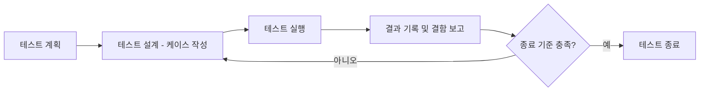

<Callout type="info">
  **이번 문서의 목표:** 이 파일을 다 읽으면 테스트 프로세스가 계획-설계-실행-보고-종료의 어떤 흐름으로 진행되는지, 테스트 계획서와 테스트 케이스에 어떤 항목이 들어가는지, 결함 보고서에서 심각도와 우선순위가 왜 다른 개념인지, 그리고 커버리지를 이용해 테스트를 언제 끝내도 되는지를 판단할 수 있다.
</Callout>

## 13~14편에서 다룬 기법을 프로젝트 관리 관점으로 옮긴다

13편에서 테스트의 목적과 수준을, 14편에서 구체적인 테스트 기법(동등분할, 경계값분석, 기본경로검사)을 배웠습니다. 하지만 실제 프로젝트에서는 "이 기법을 어떻게 적용할지", "몇 개의 케이스를 언제까지 실행할지", "찾은 결함을 어떻게 기록하고 추적할지", "언제 테스트를 끝내도 되는지"를 관리하는 별도의 활동이 필요합니다. 이 편은 테스트를 하나의 관리 대상 프로세스로 바라보는 관점을 다룹니다.

> **쉽게 말하면:** 13~14편이 "어떻게 검사할 것인가"의 방법론이었다면, 이 편은 "검사 일정과 기록, 그리고 언제 멈출지"를 정하는 관리 활동입니다.

## 1. 테스트 프로세스 전체 흐름

테스트는 개발이 다 끝난 뒤 갑자기 시작되는 활동이 아니라, 다음과 같은 순서를 가진 하나의 프로세스로 진행됩니다.

주목할 점은 "테스트 실행 → 결함 보고 → 종료 기준 미충족 → 다시 테스트 설계"로 돌아가는 순환 구조입니다. 결함이 수정되면 그 부분을 다시 테스트해야 하고, 새로 발견된 결함 유형에 맞춰 케이스를 추가로 설계해야 할 수도 있기 때문에, 테스트는 한 방향으로만 흐르지 않고 종료 기준을 만족할 때까지 이 순환을 반복합니다.

## 2. 테스트 계획서(Test Plan)의 구성 요소

**테스트 계획서**(test plan)는 테스트를 시작하기 전에 "무엇을, 누가, 언제, 어떻게, 어디까지" 할 것인지를 미리 정리한 문서입니다. 계획 없이 테스트를 시작하면 어떤 기능은 여러 번 중복해서 테스트하고 어떤 기능은 아예 빠뜨리는 일이 생기기 쉽습니다.

| 구성 요소 | 담는 내용 |
|---|---|
| 테스트 범위(scope) | 이번에 테스트할 기능·모듈과, 반대로 이번에는 테스트하지 않을 항목 |
| 테스트 목적 | 무엇을 확인하려는 테스트인지(예: 신규 기능 검증, 회귀 테스트) |
| 테스트 전략·기법 | 블랙박스·화이트박스 중 무엇을 어느 수준에 적용할지 |
| 자원(resource) | 투입 인력, 필요한 테스트 환경·도구 |
| 일정 | 각 테스트 수준을 언제 시작해 언제 끝낼지 |
| 진입 기준(entry criteria) | 테스트를 시작해도 되는 조건(예: 단위 테스트를 모두 통과한 빌드가 준비됨) |
| 종료 기준(exit criteria) | 테스트를 끝내도 되는 조건(예: 계획된 케이스 100퍼센트 실행, 커버리지 목표 달성) |
| 리스크와 대응 | 테스트 진행에 방해가 될 수 있는 위험 요소와 그 대응 방안 |

진입 기준과 종료 기준을 헷갈리는 문제가 자주 출제됩니다. 진입 기준은 "이 테스트 단계를 시작해도 되는가"를 판단하는 조건이고, 종료 기준은 "이 테스트 단계를 끝내도 되는가"를 판단하는 조건이라는 점을 짝지어 기억해야 합니다.

## 3. 테스트 케이스(Test Case)의 구성 요소

**테스트 케이스**(test case)는 테스트 계획을 실제로 실행 가능한 단위로 구체화한 것입니다. 14편에서 동등분할·경계값분석으로 뽑아낸 입력값 하나하나가 바로 테스트 케이스의 재료가 됩니다. 잘 작성된 테스트 케이스는 다음 항목을 갖춥니다.

| 항목 | 설명 |
|---|---|
| 케이스 ID | 다른 케이스와 구분하는 고유 번호 |
| 사전 조건(precondition) | 이 케이스를 실행하기 전에 갖춰져 있어야 하는 상태(예: 로그인이 되어 있어야 함) |
| 입력값 | 실제로 입력할 값 |
| 실행 절차 | 어떤 순서로 조작할지 단계별 절차 |
| 기대 결과(expected result) | 명세에 따라 나와야 하는 정상 결과 |
| 실제 결과(actual result) | 실행 후 실제로 관찰된 결과(테스트 실행 시점에 채워짐) |
| 상태(pass/fail) | 기대 결과와 실제 결과의 일치 여부 |

예를 들어 14편에서 다룬 "나이 18세 이상 65세 이하 가입 조건"의 경계값 테스트를 실제 테스트 케이스 표로 옮기면 다음과 같습니다.

| 케이스 ID | 사전 조건 | 입력값 | 기대 결과 | 실제 결과 | 상태 |
|---|---|---|---|---|---|
| TC-001 | 회원가입 화면 진입 | 나이 17 | 가입 거부 메시지 표시 | 가입 거부 메시지 표시 | pass |
| TC-002 | 회원가입 화면 진입 | 나이 18 | 가입 허용, 다음 화면 이동 | 가입 허용, 다음 화면 이동 | pass |
| TC-003 | 회원가입 화면 진입 | 나이 66 | 가입 거부 메시지 표시 | 가입 허용, 다음 화면 이동 | fail |

TC-003처럼 기대 결과와 실제 결과가 다르면 이 케이스는 실패(fail) 상태가 되고, 이 실패가 결함 보고서로 이어집니다.

## 4. 결함 보고서 — 심각도와 우선순위는 다른 개념이다

테스트 케이스가 실패하면 그 내용을 **결함 보고서**(defect report, bug report)로 기록해 13편의 결함 생명주기에 태웁니다. 결함 보고서에는 결함 ID, 요약, 재현 절차, 발생 환경, 상태 같은 항목이 담기는데, 그중 **심각도**(severity)와 **우선순위**(priority)를 혼동하는 문제가 시험에 자주 나옵니다.

> **쉽게 말하면:** 심각도는 "이 결함이 시스템에 얼마나 큰 피해를 주는가"를 재는 기술적 잣대이고, 우선순위는 "이 결함을 얼마나 빨리 고쳐야 하는가"를 재는 업무적 잣대입니다.

| 구분 | 심각도(severity) | 우선순위(priority) |
|---|---|---|
| 의미 | 결함이 시스템 기능·데이터에 미치는 기술적 피해 정도 | 결함을 수정하는 순서를 정하는 업무적 긴급도 |
| 정하는 주체 | 주로 테스터·QA가 기술적 영향을 보고 판단 | 주로 프로젝트 관리자·기획자가 비즈니스 영향을 보고 판단 |
| 값이 항상 비례하는가 | 아니오 — 심각도와 우선순위는 독립적으로 정해질 수 있음 | 아니오 |

두 값이 항상 같이 움직이지 않는다는 것을 보여주는 대표적인 예시가 다음과 같습니다.

- **심각도 높음, 우선순위 낮음**: 관리자만 접근하는 내부 통계 화면이 특정 조건에서 완전히 멈춰 버리는 결함. 시스템에 주는 기술적 피해(심각도)는 크지만, 극소수 관리자만 겪고 대체 화면이 있다면 당장 다음 배포를 미루면서까지 고칠 만큼 급하지(우선순위) 않을 수 있습니다.
- **심각도 낮음, 우선순위 높음**: 회사 로고 옆에 있는 오타 하나. 시스템 동작에는 전혀 영향이 없어 기술적 피해(심각도)는 매우 낮지만, 첫 화면에 노출되어 회사 이미지에 영향을 주므로 다음 배포 전에 급히(우선순위 높게) 고쳐야 할 수 있습니다.

이처럼 심각도와 우선순위는 서로 다른 두 축이라는 점, 그리고 어느 한쪽이 높다고 다른 한쪽도 자동으로 높아지는 것은 아니라는 점이 이 항목의 핵심 출제 포인트입니다.

## 5. 커버리지를 이용한 테스트 종료 기준

"테스트를 얼마나 해야 충분한가"라는 질문에 완벽한 정답은 없지만, 실무에서는 14편에서 다룬 커버리지 지표를 활용해 객관적인 종료 기준을 세웁니다. 대표적인 종료 기준은 다음과 같이 여러 조건을 함께 사용합니다.

- 계획된 테스트 케이스를 100퍼센트 실행했는가
- 목표한 커버리지(예: 분기 커버리지 90퍼센트 이상)를 달성했는가
- 심각도가 높은 결함이 남아 있지 않은가(예: 치명적 결함 0건)
- 결함 발견 추세가 눈에 띄게 줄어들었는가(새로운 테스트를 돌려도 새 결함이 거의 나오지 않는 상태)

숫자로 예를 들어 보면, 어떤 프로젝트에서 총 테스트 케이스가 200개이고 이 중 190개를 실행해 180개가 통과, 10개가 실패했다고 합시다.

$$
\text{케이스 실행률} = \frac{190}{200} \times 100 = 95\%
$$

$$
\text{케이스 통과율} = \frac{180}{190} \times 100 \approx 94.7\%
$$

- 케이스 실행률은 전체 계획 대비 얼마나 실행했는지를, 케이스 통과율은 실행한 것 중 얼마나 통과했는지를 나타냅니다.

만약 이 프로젝트의 종료 기준이 "케이스 실행률 100퍼센트, 통과율 98퍼센트 이상, 치명적 결함 0건"이었다면, 위 수치(실행률 95퍼센트, 통과율 약 94.7퍼센트)는 아직 종료 기준에 미달한 상태이므로 테스트를 계속 진행해야 한다고 판단합니다. 이처럼 종료 기준은 감이 아니라 미리 합의된 숫자 목표와 실제 측정값을 비교해 판단하는 것이 원칙입니다.

## 핵심 정리

- 테스트는 계획-설계-실행-보고-종료의 순환 구조로 진행되며, 결함이 수정되면 다시 설계·실행 단계로 되돌아간다.
- 테스트 계획서는 범위·목적·전략·자원·일정과 함께 진입 기준(시작 조건)과 종료 기준(종료 조건)을 담는다.
- 테스트 케이스는 사전 조건, 입력값, 실행 절차, 기대 결과, 실제 결과, 상태(pass/fail)로 구성된다.
- 심각도는 결함이 시스템에 주는 기술적 피해를, 우선순위는 결함을 수정하는 업무적 긴급도를 나타내며, 둘은 서로 독립적으로 정해질 수 있다.
- 테스트 종료는 케이스 실행률·통과율, 커버리지 달성도, 남은 결함의 심각도, 결함 발견 추세 같은 지표를 종합해 미리 합의된 기준과 비교해 판단한다.

## 마무리 복습

<Quiz
  questionNumber={1}
  question="테스트 계획서에서 진입 기준(entry criteria)이 의미하는 것은?"
  options={['테스트를 종료해도 되는 조건', '테스트를 시작해도 되는 조건', '결함을 반려 처리하는 조건', '테스트 케이스를 삭제해도 되는 조건']}
  correctAnswer={2}
  explanation="진입 기준은 해당 테스트 단계를 시작해도 되는 조건을 뜻하며, 종료해도 되는 조건은 종료 기준(exit criteria)이라고 부른다."
  optionExplanations={['이는 종료 기준에 대한 설명이다.', '정답. 진입 기준은 테스트를 시작해도 되는 조건이다.', '결함 반려 여부는 진입 기준과 무관하다.', '테스트 케이스 삭제는 진입 기준과 무관하다.']}
/>

<Quiz
  questionNumber={2}
  question="테스트 케이스의 구성 요소로 보기 어려운 것은?"
  options={['사전 조건(precondition)', '기대 결과(expected result)', '프로젝트 전체 예산 총액', '실행 절차']}
  correctAnswer={3}
  explanation="프로젝트 전체 예산 총액은 프로젝트 관리(19~20편) 영역의 정보이며, 개별 테스트 케이스의 구성 요소가 아니다."
  optionExplanations={['사전 조건은 테스트 케이스를 실행하기 전 갖춰야 할 상태로 구성 요소에 해당한다.', '기대 결과는 테스트 케이스의 핵심 구성 요소다.', '정답. 예산 총액은 테스트 케이스가 아니라 프로젝트 관리 문서에 담기는 정보다.', '실행 절차는 테스트 케이스의 핵심 구성 요소다.']}
/>

<Quiz
  questionNumber={3}
  question="결함의 심각도(severity)와 우선순위(priority)에 대한 설명으로 옳은 것은?"
  options={['심각도는 결함을 고치는 업무적 긴급도를, 우선순위는 시스템에 주는 기술적 피해를 뜻한다.', '심각도가 높으면 우선순위도 반드시 높게 책정되어야 한다.', '심각도는 시스템에 주는 기술적 피해 정도를, 우선순위는 수정 순서를 정하는 업무적 긴급도를 뜻하며 두 값은 독립적으로 정해질 수 있다.', '심각도와 우선순위는 완전히 같은 개념을 부르는 서로 다른 이름일 뿐이다.']}
  correctAnswer={3}
  explanation="심각도는 기술적 피해 정도, 우선순위는 업무적 긴급도를 나타내는 서로 다른 축이며, 한쪽이 높다고 다른 한쪽도 자동으로 높아지는 것은 아니다."
  optionExplanations={['심각도와 우선순위의 정의가 서로 뒤바뀐 설명이다.', '내부 통계 화면 사례처럼 심각도가 높아도 우선순위는 낮을 수 있다.', '정답. 두 개념은 서로 다른 축이며 독립적으로 정해질 수 있다.', '두 개념은 판단 기준과 판단 주체가 다른 별개의 개념이다.']}
/>

<Quiz
  questionNumber={4}
  question="회사 로고 옆 오타처럼 기능에는 영향이 없지만 이미지 때문에 빨리 고쳐야 하는 결함을 가장 정확히 표현한 것은?"
  options={['심각도 높음, 우선순위 높음', '심각도 높음, 우선순위 낮음', '심각도 낮음, 우선순위 높음', '심각도 낮음, 우선순위 낮음']}
  correctAnswer={3}
  explanation="오타는 시스템 기능에 기술적 피해를 주지 않으므로 심각도는 낮지만, 노출 빈도와 이미지 영향 때문에 빨리 고쳐야 하므로 우선순위는 높다."
  optionExplanations={['오타는 기능에 영향을 주지 않으므로 심각도가 높다고 보기 어렵다.', '우선순위까지 낮다고 보기는 어렵다.', '정답. 심각도는 낮지만 업무적 긴급도(우선순위)는 높은 전형적인 예다.', '노출 빈도와 이미지 영향을 고려하면 우선순위는 낮다고 보기 어렵다.']}
/>

<Quiz
  questionNumber={5}
  question="총 테스트 케이스 150개 중 140개를 실행해 133개가 통과했을 때, 케이스 통과율에 가장 가까운 값은?"
  options={['약 88.7%', '약 93.3%', '약 95.0%', '약 100%']}
  correctAnswer={3}
  explanation="케이스 통과율은 실행한 케이스 중 통과한 비율이므로 133/140 × 100을 계산하면 약 95.0퍼센트다."
  optionExplanations={['133/150을 계산한 값으로, 실행률이 아닌 전체 대비 통과 비율이라 통과율 정의와 다르다.', '140/150(실행률)에 가까운 값으로 통과율 계산과 다르다.', '정답. 133 ÷ 140 × 100 ≈ 95.0%다.', '전부 통과했다고 가정한 값으로 실제 계산과 다르다.']}
/>

<Quiz
  questionNumber={6}
  question="테스트 종료 기준으로 사용하기에 가장 적절하지 않은 것은?"
  options={['목표한 커버리지 달성 여부', '계획된 테스트 케이스의 실행률', '남아 있는 치명적 결함의 개수', '테스트를 담당한 인원의 개인적인 만족감']}
  correctAnswer={4}
  explanation="테스트 종료 기준은 커버리지, 실행률, 남은 결함 개수처럼 미리 합의된 객관적 지표로 판단해야 하며, 개인적인 만족감 같은 주관적 느낌은 기준이 될 수 없다."
  optionExplanations={['커버리지 달성 여부는 대표적인 종료 기준이다.', '케이스 실행률은 대표적인 종료 기준이다.', '남은 치명적 결함 개수는 대표적인 종료 기준이다.', '정답. 주관적 만족감은 객관적 종료 기준으로 부적절하다.']}
/>

## 참고 자료

- [SFIA v9 and SWEBOK v4 매핑 자료](https://sfia-online.org/en/tools-and-resources/bodies-of-knowledge/swebok-software-engineering-body-of-knowledge/swebok4-sfia9-the-guide-to-the-software-engineering-body-of-knowledge)
- [SWEBOK topics 상세](https://www.computer.org/education/bodies-of-knowledge/software-engineering/topics)
