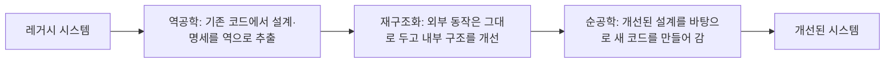

<Callout type="info">
  **이번 문서의 목표:** 이 파일을 다 읽으면 소프트웨어 유지보수의 네 가지 유형을 서로 구분해 설명할 수 있고, 레거시 시스템이 왜 문제가 되는지, 재공학이 역공학·재구조화·순공학을 통해 어떤 순서로 진행되는지, 그리고 리팩터링이 재공학과 어떻게 다른지를 설명할 수 있다.
</Callout>

## 12~15편의 산출물이 배포된 이후를 다룬다

12편의 구현, 13~15편의 테스트를 거쳐 소프트웨어가 완성되어 사용자에게 배포되었다고 해서 소프트웨어공학 활동이 끝나는 것은 아닙니다. 오히려 소프트웨어 생명주기 전체를 놓고 보면, 배포 이후 운영되는 기간 동안 투입되는 노력과 비용이 개발 단계보다 훨씬 큰 비중을 차지하는 경우가 많습니다. 이 편은 배포 이후 소프트웨어를 계속 살아 있게 관리하는 활동인 유지보수(maintenance)와, 오래된 시스템을 다루는 재공학(reengineering)을 다룹니다.

> **쉽게 말하면:** 지금까지가 집을 새로 짓는 과정이었다면, 이 편은 다 지은 집에 사람이 살면서 생기는 수리·보수, 그리고 낡은 집을 헐지 않고 고쳐 쓰는 방법을 다루는 시간입니다.

## 1. 유지보수란 무엇이고 왜 비중이 큰가

**유지보수**(maintenance)는 소프트웨어를 배포한 뒤, 발견된 결함을 고치거나 환경 변화에 맞추거나 기능을 개선하기 위해 수행하는 모든 변경 활동을 말합니다. 개발이 끝나면 손댈 일이 별로 없을 것 같지만, 실제로는 다음과 같은 이유로 유지보수 활동이 소프트웨어 생명주기 전체 비용의 절반을 훌쩍 넘기는 경우가 흔합니다.

- 테스트로 걸러내지 못한 결함이 운영 중에 뒤늦게 발견됩니다.
- 운영체제·데이터베이스·법규 같은 주변 환경이 계속 바뀌면서 그에 맞춰 소프트웨어도 바뀌어야 합니다.
- 사용자들이 실제로 써 보면서 처음에는 생각하지 못했던 새로운 요구가 계속 생겨납니다.
- 소프트웨어는 물리적으로 닳지 않지만, 주변 환경이 계속 바뀌기 때문에 가만히 두어도 시간이 지나면 상대적으로 낡아 갑니다.

## 2. 유지보수의 네 가지 유형

유지보수는 "무엇을 계기로 변경하는가"에 따라 다음 네 가지로 나뉩니다. 이 네 유형의 이름과 정의를 정확히 짝짓는 문제가 독학사 시험에서 자주 나옵니다.

| 유형 | 계기 | 예시 |
|---|---|---|
| 교정적 유지보수(corrective maintenance) | 운영 중 발견된 결함(버그)을 수정 | 특정 조건에서 계산 결과가 틀리게 나오는 버그를 고침 |
| 적응적 유지보수(adaptive maintenance) | 외부 환경 변화에 맞춰 수정 | 운영체제 새 버전이 나와 그에 맞게 코드를 수정, 세법 개정에 맞춰 세금 계산 로직 수정 |
| 완전화 유지보수(perfective maintenance) | 기존 기능을 개선하거나 새 기능을 추가 | 사용자 요청으로 검색 속도를 개선하거나 새로운 보고서 기능을 추가 |
| 예방적 유지보수(preventive maintenance) | 아직 문제를 일으키지 않았지만 나중에 문제를 일으킬 가능성이 있는 부분을 미리 개선 | 앞으로 유지보수하기 어려워질 것으로 예상되는 코드 구조를 미리 정리 |

이 중 **완전화 유지보수와 예방적 유지보수를 혼동**하는 경우가 많습니다. 두 유형 모두 "지금 당장 결함이 있어서 고치는 것이 아니다"라는 공통점이 있지만, 초점이 다릅니다.

> **쉽게 말하면:** 완전화 유지보수는 "지금보다 더 좋게 만드는 것"(성능 개선, 기능 추가)에 초점을 두고, 예방적 유지보수는 "나중에 고생하지 않으려고 미리 정리해 두는 것"(구조 개선, 문서 보강)에 초점을 둡니다.

예를 들어 검색 기능의 응답 속도를 3초에서 1초로 줄이는 작업은 사용자가 체감하는 성능을 더 좋게 만드는 것이므로 완전화 유지보수이고, 앞으로 다른 개발자가 이 코드를 이해하기 쉽도록 복잡하게 얽힌 함수를 미리 정리해 두는 작업은 아직 드러난 문제가 없어도 미래의 위험을 줄이는 것이므로 예방적 유지보수에 가깝습니다. 실제 통계적으로도 완전화 유지보수(기능 개선·요청 반영)가 네 유형 중 가장 큰 비중을 차지하는 경우가 많다는 점도 함께 알아 둘 필요가 있습니다.

## 3. 레거시 시스템 — 오래된 시스템이 다루기 어려운 이유

**레거시 시스템**(legacy system)은 오래전에 개발되어 계속 운영되고 있지만, 최신 기술이나 설계 원칙을 따르지 않고 문서화도 부실한 시스템을 말합니다. 레거시 시스템은 다음과 같은 이유로 유지보수를 어렵게 만듭니다.

- 처음 개발한 사람이 이미 퇴사하거나 이동해, 코드의 의도를 아는 사람이 남아 있지 않습니다.
- 설계 문서나 요구사항 문서가 남아 있지 않거나 실제 코드와 맞지 않습니다.
- 오랜 시간 동안 임시방편으로 덧붙여진 수정이 쌓여 구조가 복잡해져 있습니다.
- 이런 상태에서 조금이라도 코드를 건드리면 예상치 못한 곳에서 부작용이 발생할 위험이 큽니다.

이렇게 겉으로 드러나지는 않지만 시스템 안에 누적되어 있는, 나중에 반드시 갚아야 할 유지보수 부담을 **기술 부채**(technical debt)라고 부릅니다. 당장 급한 일정을 맞추려고 원칙에 어긋나는 방식으로 코드를 작성하면, 그 편법은 마치 빚처럼 쌓여 나중에 더 큰 비용(이자)으로 돌아온다는 비유에서 나온 용어입니다.

## 4. 재공학 — 버리지 않고 고쳐 쓰는 전략

기술 부채가 쌓인 레거시 시스템을 다루는 방법에는 크게 두 가지가 있습니다. 하나는 아예 처음부터 새로 개발하는 것이고, 다른 하나는 기존 시스템을 분석해 필요한 부분만 개선하는 **재공학**(reengineering)입니다. 새로 개발하는 쪽은 비용과 위험이 매우 크기 때문에, 실무에서는 재공학을 먼저 검토하는 경우가 많습니다. 재공학은 보통 다음 세 단계를 거칩니다.

- **역공학**(reverse engineering): 소스 코드만 남아 있고 설계 문서가 없는 상태에서, 코드를 거꾸로 분석해 그 안에 숨어 있는 설계나 명세를 추출하는 활동입니다. "코드를 보고 설계도를 다시 그리는 것"에 해당합니다.
- **재구조화**(restructuring): 외부에서 보이는 동작(입력에 대한 출력)은 그대로 유지하면서, 내부 코드나 구조만 더 이해하기 쉽고 관리하기 쉬운 형태로 바꾸는 활동입니다.
- **순공학**(forward engineering): 일반적인 개발 순서, 즉 설계에서 코드로 나아가는 정방향의 개발 활동입니다. 재공학의 마지막 단계에서는 역공학·재구조화로 얻은 개선된 설계를 바탕으로 실제 코드를 다시 만들어 갑니다.

즉 재공학은 "레거시 코드 → (역공학으로) 숨은 설계 파악 → (재구조화로) 구조 개선 → (순공학으로) 개선된 코드 산출"이라는 순서로, 기존 자산을 최대한 재활용하면서 시스템을 개선하는 전략입니다.

## 5. 리팩터링 — 재공학과 어떻게 다른가

**리팩터링**(refactoring)은 프로그램의 겉으로 드러나는 동작(기능)은 전혀 바꾸지 않으면서, 코드 내부의 구조를 더 읽기 쉽고 이해하기 쉬운 형태로 개선하는 작업입니다. 14편에서 순환복잡도가 지나치게 높은 모듈을 리팩터링 대상으로 검토한다고 언급한 것도 바로 이 활동을 가리킵니다. 예를 들어 길고 복잡한 함수 하나를 의미 단위로 쪼개 여러 개의 짧은 함수로 나누거나, 중복된 코드를 하나의 함수로 모으는 작업이 리팩터링에 해당합니다.

리팩터링과 재구조화는 "외부 동작을 바꾸지 않고 내부 구조만 개선한다"는 점에서 매우 비슷한 개념입니다. 다만 다루는 범위와 방식에서 차이가 있습니다.

| 구분 | 리팩터링(refactoring) | 재공학(reengineering) |
|---|---|---|
| 범위 | 주로 코드 수준의 작은 단위(함수, 클래스) | 시스템 전체 또는 대규모 모듈 단위 |
| 진행 방식 | 작은 단계로 자주, 지속적으로 수행 | 역공학-재구조화-순공학이라는 정해진 절차를 거쳐 한 프로젝트처럼 수행 |
| 목적 | 코드 가독성·유지보수성을 꾸준히 관리 | 레거시 시스템 전체를 계획적으로 현대화 |
| 대상 문서 | 별도의 설계 문서 추출 없이 코드 자체를 바로 개선 | 역공학으로 설계·명세를 먼저 추출한 뒤 개선 |

즉 리팩터링은 일상적으로 반복되는 작은 개선 습관에 가깝고, 재공학은 레거시 시스템 전체를 대상으로 한 차례 크게 진행하는 계획된 프로젝트에 가깝습니다. 리팩터링을 꾸준히 실천하면 기술 부채가 쌓이는 속도를 늦출 수 있고, 이미 기술 부채가 많이 쌓인 시스템에는 좀 더 큰 규모의 재공학이 필요합니다.

## 6. 유지보수성과 품질의 연결

유지보수를 얼마나 쉽게 할 수 있는가를 나타내는 품질 특성을 **유지보수성**(maintainability)이라고 부릅니다. 18편에서 다룰 ISO/IEC 25010 품질 모델에서도 유지보수성은 별도의 품질 특성으로 분류되어, 모듈성·재사용성·분석용이성·수정용이성·시험용이성 같은 하위 특성으로 다시 나뉩니다. 이 편에서 다룬 리팩터링과 재공학은 결국 이 유지보수성이라는 품질 특성을 높이기 위한 구체적인 실천 방법이라고 볼 수 있습니다.

## 핵심 정리

- 유지보수는 배포 이후 소프트웨어 생명주기 전체 비용에서 큰 비중을 차지하는 활동으로, 교정적·적응적·완전화·예방적 네 유형으로 나뉜다.
- 교정적 유지보수는 결함 수정, 적응적 유지보수는 환경 변화 대응, 완전화 유지보수는 기능 개선, 예방적 유지보수는 미래 문제를 줄이기 위한 사전 개선이다.
- 레거시 시스템은 문서 부재와 누적된 임시방편 수정 때문에 다루기 어려우며, 이렇게 쌓인 유지보수 부담을 기술 부채라고 부른다.
- 재공학은 역공학(설계 역추출) → 재구조화(내부 구조 개선) → 순공학(개선된 코드 산출) 순서로 진행되며, 기존 자산을 재활용하면서 시스템을 개선하는 전략이다.
- 리팩터링은 외부 동작을 바꾸지 않고 내부 구조만 개선한다는 점에서 재구조화와 비슷하지만, 코드 수준의 작은 단위에서 지속적으로 수행된다는 점에서 시스템 전체를 대상으로 하는 재공학과 구분된다.

## 마무리 복습

<Quiz
  questionNumber={1}
  question="운영 중 발견된 결함을 수정하는 유지보수 유형은?"
  options={['교정적 유지보수', '적응적 유지보수', '완전화 유지보수', '예방적 유지보수']}
  correctAnswer={1}
  explanation="교정적 유지보수는 운영 중 발견된 결함(버그)을 수정하는 활동을 가리킨다."
  optionExplanations={['정답. 교정적 유지보수가 결함 수정을 뜻한다.', '적응적 유지보수는 외부 환경 변화에 맞춰 수정하는 활동이다.', '완전화 유지보수는 기능 개선이나 추가를 뜻한다.', '예방적 유지보수는 미래 문제를 줄이기 위한 사전 개선을 뜻한다.']}
/>

<Quiz
  questionNumber={2}
  question="세법 개정에 맞춰 세금 계산 로직을 수정하는 작업에 해당하는 유지보수 유형은?"
  options={['교정적 유지보수', '적응적 유지보수', '완전화 유지보수', '예방적 유지보수']}
  correctAnswer={2}
  explanation="세법 개정처럼 외부 환경 변화에 맞춰 소프트웨어를 수정하는 것은 적응적 유지보수에 해당한다."
  optionExplanations={['세법 개정 자체는 결함이 아니므로 교정적 유지보수가 아니다.', '정답. 외부 환경 변화에 대응하는 것은 적응적 유지보수다.', '기존 기능의 성능이나 사용성을 개선하는 것이 아니므로 완전화 유지보수와는 다르다.', '이미 발생한 외부 변화에 대응하는 것이므로 사전 예방과는 다르다.']}
/>

<Quiz
  questionNumber={3}
  question="완전화 유지보수(perfective maintenance)와 예방적 유지보수(preventive maintenance)의 구분으로 옳은 것은?"
  options={['완전화 유지보수는 결함 수정에, 예방적 유지보수는 환경 변화 대응에 초점을 둔다.', '완전화 유지보수는 기능·성능 개선에, 예방적 유지보수는 미래의 유지보수 부담을 줄이기 위한 사전 정리에 초점을 둔다.', '완전화 유지보수와 예방적 유지보수는 완전히 같은 활동을 부르는 다른 이름이다.', '예방적 유지보수는 반드시 완전화 유지보수보다 먼저 수행해야 한다.']}
  correctAnswer={2}
  explanation="완전화 유지보수는 지금보다 더 좋게 만드는 기능·성능 개선에, 예방적 유지보수는 나중에 생길 문제를 미리 줄이는 구조 개선에 초점을 둔다."
  optionExplanations={['이는 교정적 유지보수와 적응적 유지보수에 대한 설명이다.', '정답. 완전화는 개선, 예방은 사전 정리에 초점을 둔다.', '두 유형은 초점이 다른 별개의 활동이다.', '두 유형 사이에 정해진 선후 관계는 없다.']}
/>

<Quiz
  questionNumber={4}
  question="레거시 시스템에 유지보수를 어렵게 만드는 요인으로 옳지 않은 것은?"
  options={['설계 문서가 남아 있지 않거나 실제 코드와 맞지 않는다.', '오랜 시간 쌓인 임시방편 수정으로 구조가 복잡해져 있다.', '최초 개발자가 이미 퇴사하거나 이동해 코드의 의도를 아는 사람이 드물다.', '최신 기술로 설계 문서와 코드를 처음부터 함께 새로 작성했다.']}
  correctAnswer={4}
  explanation="레거시 시스템은 문서 부재와 누적된 임시방편 수정이 특징이며, 최신 기술로 설계 문서와 코드를 함께 새로 작성한 시스템은 레거시 시스템의 정의와 반대된다."
  optionExplanations={['옳은 설명이다. 문서 부재는 레거시 시스템의 대표적 문제다.', '옳은 설명이다. 누적된 임시방편 수정은 레거시 시스템의 특징이다.', '옳은 설명이다. 개발 의도를 아는 사람이 없는 것도 대표적 문제다.', '정답. 이는 레거시 시스템이 아니라 잘 관리된 신규 시스템의 특징이다.']}
/>

<Quiz
  questionNumber={5}
  question="재공학(reengineering)의 절차를 순서대로 바르게 나열한 것은?"
  options={['순공학 → 재구조화 → 역공학', '역공학 → 재구조화 → 순공학', '재구조화 → 역공학 → 순공학', '역공학 → 순공학 → 재구조화']}
  correctAnswer={2}
  explanation="재공학은 코드에서 설계를 역으로 추출하는 역공학, 구조를 개선하는 재구조화, 개선된 설계로 코드를 다시 만드는 순공학 순서로 진행된다."
  optionExplanations={['순서가 완전히 반대다.', '정답. 역공학 → 재구조화 → 순공학 순서가 맞다.', '역공학이 재구조화보다 먼저 이루어져야 한다.', '재구조화 단계가 빠져 순서가 틀렸다.']}
/>

<Quiz
  questionNumber={6}
  question="리팩터링(refactoring)에 대한 설명으로 가장 적절한 것은?"
  options={['프로그램의 외부 동작(기능)을 새롭게 바꾸면서 성능을 높이는 작업이다.', '프로그램의 외부 동작은 그대로 유지하면서 내부 코드 구조를 이해하기 쉽게 개선하는 작업이다.', '레거시 시스템 전체를 역공학-재구조화-순공학 절차로 현대화하는 대규모 프로젝트를 가리키는 다른 이름이다.', '테스트 없이 코드를 마음대로 바꿔도 되는 작업을 뜻한다.']}
  correctAnswer={2}
  explanation="리팩터링은 외부에서 관찰되는 동작은 바꾸지 않은 채, 코드 내부 구조만 더 읽기 쉽고 관리하기 쉬운 형태로 개선하는 작업이다."
  optionExplanations={['리팩터링은 외부 동작을 바꾸지 않는 것이 핵심 전제다.', '정답. 외부 동작 유지, 내부 구조 개선이 리팩터링의 정의다.', '재공학은 시스템 전체를 대상으로 한 계획된 절차이며, 리팩터링은 코드 수준의 작은 단위에서 지속적으로 이뤄진다.', '리팩터링 이후에도 기존 동작이 유지되는지 테스트로 확인하는 것이 원칙이다.']}
/>

## 참고 자료

- [SWEBOK v3 기반 요약 자료](https://sfia-online.org/en/tools-and-resources/bodies-of-knowledge/swebok-software-engineering-body-of-knowledge/swebok-sfia8-the-guide-to-the-software-engineering-body-of-knowledge)
- [SWEBOK PDF 요약본](https://cursa.ihmc.us/rid=1K3W9B5S9-YC444R-2K9Y/SWEBOK.pdf)
