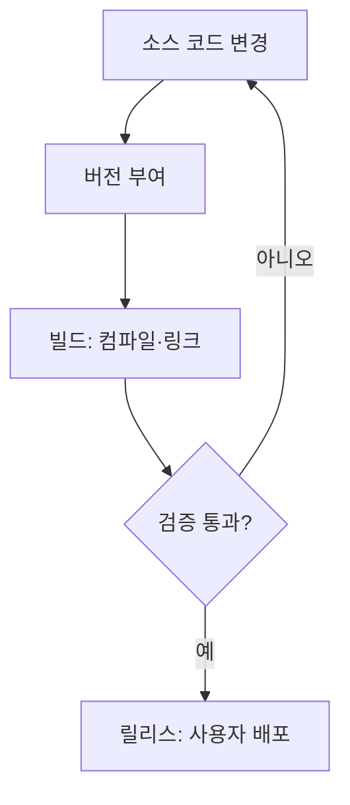

<Callout type="info">
  **이번 문서의 목표:** 이 파일을 다 읽으면 형상항목과 베이스라인이 왜 구분되어야 하는지, 변경 요청이 승인되기까지 어떤 절차를 거치는지, 버전·빌드·릴리스가 각각 무엇을 가리키는지를 설명하고 관련 문항을 풀 수 있게 됩니다.

</Callout>

## 왜 형상관리가 필요한가

12편에서 구현 단계의 품질 확보(코딩 표준·코드 리뷰·정적 분석)를, 16편에서 유지보수와 재공학을 다뤘습니다. 이 두 활동에는 공통된 전제가 하나 있습니다. **지금 우리가 보고 있는 소스 코드·문서·산출물이 정확히 어떤 버전인지, 언제 무엇이 왜 바뀌었는지 추적할 수 있어야 한다**는 것입니다.

여러 개발자가 동시에 같은 파일을 고치거나, 배포한 뒤에야 결함이 발견되어 "어느 버전에서 문제가 생겼는지" 찾아야 하는 상황을 떠올려 보십시오. 산출물이 통제되지 않으면 어제 잘 되던 기능이 오늘 안 되는데 원인을 아무도 설명하지 못하는 일이 생깁니다. **형상관리(SCM, Software Configuration Management)** 는 이런 혼란을 막기 위해 소프트웨어를 구성하는 모든 산출물의 **정체성(무엇인지)·이력(어떻게 바뀌었는지)·상태(지금 어느 버전인지)** 를 체계적으로 관리하는 활동입니다.

> **쉽게 말하면:** 형상관리는 "지금 우리가 만든 것이 정확히 무엇이고, 어떻게 이 모습이 됐는지"를 항상 답할 수 있게 만드는 관리 체계입니다.

## 1. 형상항목 — 무엇을 관리 대상으로 삼는가

**형상항목(CI, Configuration Item)** 은 형상관리의 대상으로 지정되어 개별적으로 식별·통제되는 산출물 단위입니다. 소스 코드 파일 하나만이 아니라 소프트웨어 개발 과정에서 만들어지는 모든 산출물이 후보가 됩니다.

| 형상항목 유형 | 예시 |
|---------------|------|
| 요구사항 산출물 | SRS(소프트웨어 요구사항 명세서, 07편), 요구사항 추적표 |
| 설계 산출물 | 설계서, UML 다이어그램(10편), 아키텍처 문서 |
| 구현 산출물 | 소스 코드, 빌드 스크립트, 설정 파일 |
| 테스트 산출물 | 테스트 계획서, 테스트 케이스, 테스트 결과 보고서(15편) |
| 지원 산출물 | 사용자 매뉴얼, 설치 가이드, 프로젝트 계획서(19편) |

형상항목으로 지정된 산출물에는 **고유 식별자**(파일명, 버전 번호, 문서 번호 등)를 부여해 어느 것이 어느 버전인지 항상 구분할 수 있게 합니다. 모든 산출물을 형상항목으로 관리하는 것은 아닙니다 — 관리 비용과 통제 효과를 저울질해, **변경되면 다른 산출물에 영향을 주거나 계약·품질 기준과 직결되는 산출물**을 선별해 형상항목으로 지정합니다.

<Callout type="warning">
  **자주 틀리는 점:** 형상항목은 "소스 코드"만을 의미하지 않습니다. 요구사항 명세서·설계서·테스트 케이스·매뉴얼까지 소프트웨어 개발 생명주기 전반의 산출물이 형상항목의 대상이 될 수 있다는 점을 놓치면 "형상관리 = 버전 관리 도구 사용"으로 좁게 오해하게 됩니다.
</Callout>

## 2. 베이스라인 — 합의된 시점의 기준선

형상항목은 개발 과정에서 계속 바뀝니다. 그런데 바뀌는 도중의 아무 시점이나 "기준"으로 삼으면, 나중에 "그때 승인받은 버전이 어느 것이었는지"를 두고 다시 다툼이 생깁니다. 이를 막기 위한 개념이 **베이스라인(Baseline)** 입니다.

**베이스라인**은 정식 검토·승인 절차를 거쳐 공식적으로 확정된 형상항목(또는 형상항목의 묶음)의 한 시점 스냅숏입니다. 베이스라인이 설정된 이후에는 그 산출물을 함부로 바꿀 수 없고, 바꾸려면 반드시 공식적인 **변경 통제 절차**(3절)를 거쳐야 합니다.

일반적으로 소프트웨어 생명주기에서는 다음과 같은 베이스라인을 둡니다.

| 베이스라인 종류 | 확정 시점 | 확정되는 산출물 |
|-----------------|-----------|------------------|
| 기능 베이스라인 | 요구사항 검토·승인 직후 | SRS(요구사항 명세서) |
| 할당 베이스라인 | 설계 검토·승인 직후 | 설계서, 아키텍처 문서 |
| 제품 베이스라인 | 테스트 완료·인수 직전 | 소스 코드, 실행 파일, 매뉴얼 전체 |

> **비유:** 베이스라인은 등산 중 세우는 "여기까지는 확정된 루트"라는 표지판과 같습니다. 표지판을 세우기 전까지는 길을 자유롭게 탐색하지만, 표지판을 세운 뒤 그 구간을 다시 바꾸려면 왜 바꿔야 하는지 대장(승인권자)에게 보고하고 허락을 받아야 합니다.

<Callout type="warning">
  **자주 틀리는 점:** 베이스라인은 "완성본"이 아니라 **그 시점에 검토·승인된 기준선**입니다. 베이스라인 이후에도 변경은 일어날 수 있습니다. 다만 그 변경이 **통제된 절차**(합의 없이 임의로 고칠 수 없는 절차)를 거친다는 점이 핵심입니다.
</Callout>

## 3. 변경 통제 — 베이스라인을 바꾸는 공식 절차

베이스라인이 확정된 형상항목을 바꾸려면 아무나 임의로 고칠 수 없고, **변경 통제(Change Control)** 라는 공식 절차를 거쳐야 합니다. 이 절차의 핵심 기구가 **형상통제위원회(CCB, Configuration Control Board)** 입니다. CCB는 변경 요청을 검토해 승인·반려·보류를 결정하는 권한을 가진 조직(또는 역할을 맡은 사람들의 모임)입니다.

<Steps>

1. **변경 요청(CR, Change Request) 제출** — 변경이 필요한 이유, 영향받는 형상항목을 명시해 요청서를 작성한다
2. **영향 분석(Impact Analysis)** — 이 변경이 다른 형상항목·일정·비용·품질에 어떤 영향을 주는지 분석한다
3. **CCB 심의** — 형상통제위원회가 영향 분석 결과를 바탕으로 승인·반려·보류를 결정한다
4. **변경 구현** — 승인된 변경만 실제로 반영하고, 관련된 다른 형상항목도 함께 갱신한다
5. **검증 및 새 베이스라인 확정** — 변경이 올바르게 반영됐는지 검증하고, 새로운 베이스라인으로 갱신한다

</Steps>

이 절차가 있어야 "누군가 조용히 코드를 고쳤는데 아무도 몰랐다"거나 "요구사항 하나를 바꿨는데 설계·테스트 문서는 옛날 버전 그대로다"라는 상황을 막을 수 있습니다. 특히 영향 분석 단계는 **비용이 가장 저렴한 시점에 문제를 발견**한다는 점에서 중요합니다 — 변경이 다른 산출물에 미치는 파급 효과를 미리 확인하지 않고 구현부터 하면, 나중에 여러 산출물을 다시 뜯어고쳐야 하는 더 큰 비용이 발생합니다.

<Callout type="warning">
  **자주 틀리는 점:** "변경 요청은 곧 변경 승인"이 아닙니다. CCB는 반려·보류할 수도 있으며, 승인되지 않은 변경은 반영되어서는 안 됩니다. 시험에서는 CCB의 심의를 거치지 않은 임의 수정이 왜 문제가 되는지를 묻는 문항이 자주 나옵니다.
</Callout>

## 4. 버전·빌드·릴리스 관리 — 세 용어의 층위 구분

형상관리를 다루는 문항에서 자주 헷갈리는 세 용어가 **버전·빌드·릴리스**입니다. 세 용어는 "얼마나 많은 변경을 묶어서, 누구에게 전달하느냐"의 층위가 다릅니다.

| 용어 | 정의 | 대상 | 빈도 |
|------|------|------|------|
| 버전(Version) | 형상항목이 바뀔 때마다 부여되는 식별 번호 | 개별 형상항목(파일, 모듈 단위) 또는 전체 제품 | 변경이 있을 때마다 |
| 빌드(Build) | 소스 코드를 컴파일·링크해 실행 가능한 상태로 만든 결과물 | 실행 파일, 배포 패키지 | 통상 하루 여러 번, 또는 정해진 주기 |
| 릴리스(Release) | 검증을 거쳐 실제 사용자(내부·외부)에게 배포하기로 확정한 빌드 | 정식 배포 대상 | 계획된 일정에 따라(주·월·분기 단위 등) |

버전 번호는 보통 **주(major).부(minor).수정(patch)** 형식(예: 2.3.1)으로 관리하는 관례가 널리 쓰입니다. 주 버전은 호환되지 않는 큰 변경, 부 버전은 호환되는 기능 추가, 수정 버전은 결함 수정을 의미하는 식으로 규칙을 정해 팀 안에서 공유합니다. 이 규칙 자체를 외우기보다, **"버전은 식별, 빌드는 산출, 릴리스는 배포 확정"이라는 층위 차이**를 구분하는 것이 시험형 문항에서 더 중요합니다.

<Callout type="warning">
  **자주 틀리는 점:** "빌드했다"와 "릴리스했다"를 같은 의미로 쓰면 안 됩니다. 빌드는 하루에도 여러 번 만들어지는 중간 산출물일 수 있지만, 릴리스는 검증을 마치고 배포하기로 확정한 결과물만을 가리킵니다. 모든 빌드가 릴리스되는 것은 아닙니다.
</Callout>

## 핵심 정리

- **형상항목(CI)** 은 요구사항·설계·구현·테스트·지원 산출물 전반에서 개별 식별·통제 대상으로 지정된 단위이며, 소스 코드만을 뜻하지 않는다.
- **베이스라인**은 검토·승인을 거쳐 확정된 특정 시점의 기준선이며, 이후 변경은 반드시 공식 절차를 거쳐야 한다. 기능·할당·제품 베이스라인으로 생명주기 단계마다 확정된다.
- **변경 통제**는 변경 요청 → 영향 분석 → CCB(형상통제위원회) 심의 → 구현 → 검증·새 베이스라인 확정의 절차를 따르며, 승인되지 않은 변경은 반영되지 않는다.
- **버전**은 변경 식별 번호, **빌드**는 컴파일·링크된 실행 가능 산출물, **릴리스**는 검증을 마치고 배포하기로 확정한 빌드로, 세 용어는 서로 다른 층위를 가리킨다.

## 마무리 복습

<Quiz
  questionNumber={1}
  question="형상항목(CI)에 대한 설명으로 옳지 않은 것은?"
  options={['소스 코드뿐 아니라 요구사항 명세서, 설계서, 테스트 케이스도 형상항목이 될 수 있다', '형상항목에는 고유 식별자를 부여해 버전을 구분한다', '형상항목은 개발 과정의 모든 산출물을 예외 없이 반드시 지정해야 한다', '형상항목 지정은 관리 비용과 통제 효과를 고려해 선별적으로 이뤄진다']}
  correctAnswer={3}
  explanation="형상항목은 관리 비용과 통제 효과를 저울질해, 변경되면 다른 산출물이나 품질·계약 기준에 영향을 주는 산출물을 선별해 지정한다. 모든 산출물을 예외 없이 지정하는 것이 아니다."
  optionExplanations={['옳은 설명이다. 형상항목은 산출물 전반을 포괄한다', '옳은 설명이다. 고유 식별자로 버전을 구분한다', '정답 — 형상항목은 선별적으로 지정하며 모든 산출물을 예외 없이 지정하지 않는다', '옳은 설명이다. 관리 비용과 통제 효과를 고려해 선별한다']}
/>

<Quiz
  questionNumber={2}
  question="베이스라인(Baseline)에 대한 설명으로 가장 적절한 것은?"
  options={['개발이 완전히 끝난 뒤의 최종 완성본만을 가리킨다', '검토·승인 절차를 거쳐 확정된 특정 시점의 기준선으로, 이후 변경은 통제 절차를 따른다', '개발자가 임의로 정하는 임시 저장 시점이다', '베이스라인이 확정되면 이후 어떤 변경도 허용되지 않는다']}
  correctAnswer={2}
  explanation="베이스라인은 공식 검토·승인을 거쳐 확정된 기준선이며, 확정 이후의 변경은 자유롭게가 아니라 변경 통제 절차를 거쳐야 한다는 점이 핵심이다."
  optionExplanations={['최종 완성본만을 뜻하지 않는다. 기능·할당·제품 베이스라인처럼 생명주기 중간에도 설정된다', '정답 — 승인된 기준선이며 이후 변경은 통제된 절차를 거친다', '임의 저장이 아니라 공식 검토·승인을 거친 시점이다', '변경이 금지되는 것이 아니라 통제된 절차를 거쳐 허용된다']}
/>

<Quiz
  questionNumber={3}
  question="소프트웨어 생명주기에서 확정되는 베이스라인과 그 시점을 짝지은 것으로 옳은 것은?"
  options={['기능 베이스라인 — 테스트 완료 직후', '할당 베이스라인 — 요구사항 검토 직후', '제품 베이스라인 — 테스트 완료·인수 직전', '기능 베이스라인 — 설계 검토 직후']}
  correctAnswer={3}
  explanation="제품 베이스라인은 소스 코드와 실행 파일, 매뉴얼 전체를 대상으로 테스트 완료 및 인수 직전에 확정된다. 기능 베이스라인은 요구사항 검토 직후, 할당 베이스라인은 설계 검토 직후에 확정된다."
  optionExplanations={['기능 베이스라인은 요구사항 검토 직후에 확정된다', '할당 베이스라인이 설계 검토 직후에 확정되는 것이며, 요구사항 검토 직후는 기능 베이스라인이다', '정답 — 제품 베이스라인은 테스트 완료·인수 직전에 소스 코드와 실행 파일 전체를 대상으로 확정된다', '기능 베이스라인은 요구사항 검토 직후에 확정되며 설계 검토와는 무관하다']}
/>

<Quiz
  questionNumber={4}
  question="형상통제위원회(CCB)의 역할에 대한 설명으로 옳지 않은 것은?"
  options={['변경 요청을 심의해 승인·반려·보류를 결정한다', '영향 분석 결과를 바탕으로 변경 여부를 판단한다', '제출된 모든 변경 요청은 CCB의 심의 없이 즉시 반영되어야 한다', '변경 통제 절차에서 공식적인 의사결정 기구 역할을 한다']}
  correctAnswer={3}
  explanation="CCB의 심의를 거치지 않은 변경은 임의 수정으로, 변경 통제 절차를 무력화한다. 모든 변경 요청은 CCB의 심의를 거쳐 승인된 것만 반영되어야 한다."
  optionExplanations={['CCB의 옳은 역할이다', 'CCB의 옳은 역할이다', '정답 — CCB의 심의를 거치지 않고 즉시 반영하는 것은 변경 통제 절차의 취지에 어긋난다', 'CCB의 옳은 역할이다']}
/>

<Quiz
  questionNumber={5}
  question="변경 통제 절차에서 '영향 분석(Impact Analysis)'을 구현 이전에 수행하는 이유로 가장 적절한 것은?"
  options={['영향 분석은 법적으로 반드시 문서화해야 하는 요식 행위이기 때문이다', '변경이 다른 산출물·일정·비용에 미치는 영향을 미리 확인해 더 큰 수정 비용을 예방하기 위해서다', '영향 분석 없이는 CCB 회의 일정을 잡을 수 없기 때문이다', '영향 분석은 릴리스 이후에만 의미가 있는 활동이기 때문이다']}
  correctAnswer={2}
  explanation="영향 분석을 구현 전에 수행하면 변경이 다른 형상항목·일정·비용·품질에 미치는 파급 효과를 미리 파악할 수 있어, 구현 이후 여러 산출물을 다시 고쳐야 하는 더 큰 비용을 예방할 수 있다."
  optionExplanations={['단순 요식 행위가 아니라 실질적인 비용 예방 목적을 갖는다', '정답 — 파급 효과를 미리 확인해 더 큰 수정 비용을 예방하는 것이 목적이다', 'CCB 회의 일정 자체와는 직접 관련이 없다', '릴리스 이후가 아니라 구현 이전에 수행해야 효과가 있다']}
/>

<Quiz
  questionNumber={6}
  question="버전, 빌드, 릴리스의 관계를 설명한 것으로 옳지 않은 것은?"
  options={['버전은 형상항목의 변경을 식별하는 번호다', '빌드는 소스 코드를 컴파일·링크해 실행 가능한 상태로 만든 산출물이다', '릴리스는 검증을 거쳐 배포하기로 확정한 빌드다', '모든 빌드는 곧 릴리스와 동일한 의미로 취급된다']}
  correctAnswer={4}
  explanation="빌드는 개발 중 하루에도 여러 번 만들어질 수 있는 중간 산출물이며, 그중 검증을 마치고 배포하기로 확정한 것만 릴리스라고 부른다. 모든 빌드가 릴리스와 같은 것은 아니다."
  optionExplanations={['옳은 설명이다', '옳은 설명이다', '옳은 설명이다', '정답 — 빌드와 릴리스는 층위가 다르며, 검증·배포 확정을 거쳐야 릴리스가 된다']}
/>

## 참고 자료

- [SWEBOK topics 상세 - IEEE Computer Society](https://www.computer.org/education/bodies-of-knowledge/software-engineering/topics)
- [SWEBOK v4 and SFIA v9 가이드](https://sfia-online.org/en/tools-and-resources/bodies-of-knowledge/swebok-software-engineering-body-of-knowledge/swebok4-sfia9-the-guide-to-the-software-engineering-body-of-knowledge)
