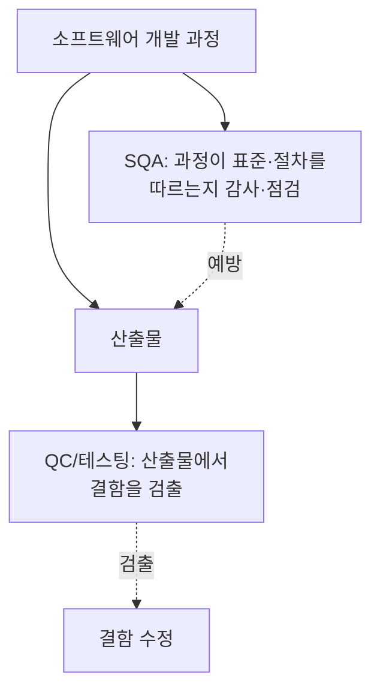
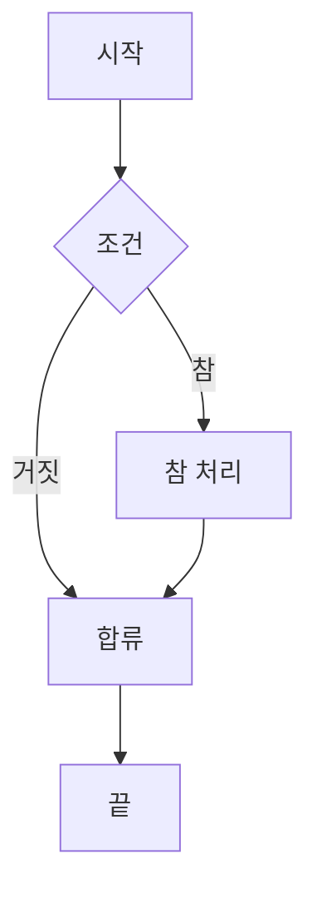

<Callout type="info">
  **이번 문서의 목표:** 이 파일을 다 읽으면 SQA가 왜 테스팅과 다른지, ISO/IEC 25010의 품질 특성이 서로 어떻게 구분되는지, 결함 밀도·순환 복잡도·커버리지를 실제 숫자로 계산하고 해석할 수 있게 됩니다.
</Callout>

## 왜 품질을 별도로 관리하는가

13~15편에서 테스팅을 다뤘습니다. 테스팅은 "이미 만들어진 산출물에서 결함을 찾아내는" 활동입니다. 그런데 결함을 찾는 것만으로는 부족합니다. 애초에 **결함이 적게 생기도록 개발 과정 자체를 관리**하고, 지금 산출물의 품질이 "얼마나 좋은지"를 **숫자로 측정**해 개선 여부를 판단할 수 있어야 합니다. 이 두 가지를 담당하는 것이 각각 **SQA(품질보증)** 와 **메트릭(품질 측정 지표)** 입니다.

> **쉽게 말하면:** 이번 편은 "결함을 찾는 것"이 아니라 "결함이 덜 생기게 과정을 관리하고, 좋아졌는지 숫자로 확인하는 것"을 다룹니다.

## 1. SQA — 품질보증과 품질통제의 구분

**SQA**(Software Quality Assurance, 소프트웨어 품질보증)는 소프트웨어 개발 **과정(프로세스)** 이 정해진 표준·절차를 따르고 있는지를 계획적·체계적으로 확인하는 활동입니다. 반면 테스팅으로 대표되는 **QC**(Quality Control, 품질통제)는 완성된 **산출물(제품)** 자체를 검사해 결함을 찾는 활동입니다.

| 구분 | SQA(품질보증) | QC(품질통제) |
|------|----------------|---------------|
| 대상 | 개발 과정(프로세스) | 산출물(제품) |
| 목적 | 결함이 애초에 덜 생기도록 과정을 관리 | 이미 만들어진 산출물에서 결함을 찾아냄 |
| 활동 예시 | 프로세스 감사, 표준 준수 점검, 코딩 규약 검사 | 단위·통합·시스템 테스트, 코드 리뷰의 결함 발견 부분 |
| 시점 | 개발 전 기간에 걸쳐 예방 중심 | 산출물이 나온 뒤 검출 중심 |

<Callout type="warning">
  **자주 틀리는 점:** "SQA = 테스팅"으로 오해하기 쉽습니다. SQA는 테스팅보다 넓은 개념으로, 테스팅은 QC(품질통제) 활동의 일부이고 SQA는 **프로세스 감사·표준 수립·교육 등 예방 중심 활동 전반**을 포괄합니다. "SQA는 예방, QC는 검출"로 구분해야 합니다.
</Callout>

## 2. ISO/IEC 25010 품질 특성 — 무엇을 좋은 소프트웨어라 하는가

"품질이 좋다"는 말은 막연합니다. **ISO/IEC 25010**은 소프트웨어 제품의 품질을 여러 **품질 특성(Quality Characteristics)** 으로 세분화해 정의한 국제 표준입니다. 특성별로 명확히 구분해 두면, "이 시스템은 기능은 맞는데 성능이 느리다"처럼 품질을 요소별로 진단할 수 있습니다.

| 품질 특성 | 의미 | 예시 |
|-----------|------|------|
| 기능 적합성(Functional Suitability) | 명시된 요구를 충족하는 기능을 제공하는 정도 | 요구사항에 정의된 계산 결과가 정확한가 |
| 성능 효율성(Performance Efficiency) | 자원 사용량 대비 성능 수준 | 응답 시간, 처리량, 자원 사용률 |
| 호환성(Compatibility) | 다른 시스템·환경과 정보를 교환하며 공존하는 정도 | 다른 소프트웨어와 데이터 형식을 주고받을 수 있는가 |
| 사용성(Usability) | 사용자가 목표를 효과적·효율적·만족스럽게 달성하는 정도 | 화면 조작이 직관적인가, 학습이 쉬운가 |
| 신뢰성(Reliability) | 지정된 조건에서 정해진 기간 동안 기능을 유지하는 정도 | 장애 없이 지속 운영되는 시간(가용성) |
| 보안성(Security) | 정보와 데이터를 권한에 따라 보호하는 정도 | 인가되지 않은 접근을 차단하는가 |
| 유지보수성(Maintainability) | 변경이 얼마나 효과적·효율적으로 이뤄질 수 있는가 | 결함 수정·기능 추가가 쉬운 구조인가 |
| 이식성(Portability) | 다른 환경으로 옮겨 사용할 수 있는 정도 | 다른 운영체제·하드웨어에서도 동작하는가 |

<Callout type="warning">
  **자주 틀리는 점:** 호환성과 이식성을 혼동하기 쉽습니다. **호환성**은 "다른 시스템과 함께 정보를 주고받으며 공존"하는 능력이고, **이식성**은 "다른 환경으로 옮겨졌을 때도 동작"하는 능력입니다. 전자는 동시에 공존, 후자는 장소를 옮기는 것에 초점이 있습니다.
</Callout>

품질 특성 각각은 다시 여러 **부특성(sub-characteristic)** 으로 나뉩니다. 예를 들어 유지보수성은 모듈성·재사용성·분석용이성·수정용이성·시험용이성으로, 신뢰성은 성숙성·가용성·결함허용성·회복성으로 세분됩니다. 시험에서는 부특성 명칭을 전부 암기하기보다, **각 상위 특성이 무엇을 묻는 질문인지**(기능이 맞는가, 빠른가, 다른 것과 잘 섞이는가, 쓰기 편한가, 안 죽는가, 안전한가, 고치기 쉬운가, 옮기기 쉬운가)를 구분하는 것이 우선입니다.

## 3. 품질 측정 — 특성을 숫자로 옮기기

품질 특성은 정성적인 정의만으로는 관리할 수 없습니다. 실제 개선 여부를 판단하려면 **측정 지표(metric)** 로 숫자화해야 합니다. 다음은 대표적인 품질·결함 지표입니다.

### 결함 밀도(Defect Density)

결함 밀도는 산출물의 크기 대비 발견된 결함 수의 비율로, 서로 다른 크기의 모듈·프로젝트 간 품질을 비교할 수 있게 해 줍니다.

$$
\text{결함 밀도} = \frac{\text{발견된 결함 수}}{\text{코드 크기(KLOC 또는 기능점수)}}
$$

- 결함 수: 테스트·리뷰에서 발견된 결함의 총 개수
- KLOC(Kilo Lines Of Code): 코드 1,000줄 단위 크기

**예시**: 어떤 모듈이 5 KLOC(5,000줄) 규모이고 테스트에서 결함 20개가 발견됐다면,

$$
\text{결함 밀도} = \frac{20}{5} = 4 \ (\text{건/KLOC})
$$

KLOC 1,000줄당 결함 4건이라는 뜻입니다. 이 값을 과거 프로젝트나 다른 모듈과 비교해 "이 모듈이 상대적으로 결함이 많은지 적은지"를 판단합니다.

<Callout type="warning">
  **자주 틀리는 점:** 결함 밀도가 낮다고 무조건 품질이 좋다고 단정할 수 없습니다. 테스트를 충분히 하지 않아 결함을 아직 발견하지 못했을 뿐인 경우와 구분해야 합니다. 결함 밀도는 반드시 **테스트 커버리지·테스트 강도와 함께** 해석해야 합니다.
</Callout>

### 순환 복잡도(Cyclomatic Complexity)

순환 복잡도는 코드 안에 있는 **독립적인 실행 경로의 수**를 세어 코드의 논리적 복잡성을 측정하는 지표입니다. 제어 흐름 그래프(노드: 처리 블록, 에지: 흐름)를 이용해 계산합니다.

$$
V(G) = E - N + 2
$$

- $V(G)$: 순환 복잡도(Cyclomatic Complexity)
- $E$: 제어 흐름 그래프의 에지(간선) 수
- $N$: 제어 흐름 그래프의 노드(정점) 수

**예시**: 조건문이 하나(`if`) 있는 간단한 함수의 제어 흐름 그래프를 그리면 노드 4개(시작 → 조건 → 참 분기 → 합류/끝), 에지 4개가 됩니다.

이 그래프는 노드 5개($S, C, T, M, E$), 에지 5개($S\to C$, $C\to T$, $C\to M$, $T\to M$, $M\to E$)입니다.

$$
V(G) = 5 - 5 + 2 = 2
$$

순환 복잡도 2는 "독립적인 실행 경로가 2개"라는 뜻이며, 이는 곧 이 코드를 완전히 테스트하려면 **최소 2개의 테스트 케이스**가 필요하다는 것을 의미합니다(조건이 참인 경로 1개, 거짓인 경로 1개). 순환 복잡도가 높을수록 테스트해야 할 경로가 많아지고 코드를 이해·유지보수하기도 어려워지므로, 일반적으로 **하나의 함수·모듈은 순환 복잡도를 일정 기준값(흔히 10) 이하로 유지**하도록 권고합니다.

<Callout type="warning">
  **자주 틀리는 점:** 순환 복잡도는 코드 줄 수(LOC)와 다른 지표입니다. 코드가 짧아도 조건 분기가 많으면 순환 복잡도는 높을 수 있습니다. "복잡도는 분기 구조의 문제이지 길이의 문제가 아니다"라는 점을 구분해야 합니다.
</Callout>

### 커버리지(Coverage)

커버리지는 테스트가 코드의 얼마만큼을 실행해 봤는지 나타내는 비율입니다(15편에서 테스트 종료 기준의 하나로 다뤘습니다). 대표적으로 **구문 커버리지**(전체 구문 중 실행된 구문의 비율)와 **분기 커버리지**(전체 분기 중 실행된 분기의 비율)가 있습니다.

$$
\text{구문 커버리지} = \frac{\text{실행된 구문 수}}{\text{전체 구문 수}} \times 100\%
$$

**예시**: 전체 구문이 50개인 모듈에서 테스트 실행 후 40개 구문이 실행됐다면,

$$
\text{구문 커버리지} = \frac{40}{50} \times 100\% = 80\%
$$

구문 커버리지 80퍼센트(80%)는 "코드의 80퍼센트가 최소 한 번은 실행됐다"는 뜻이며, 나머지 20퍼센트는 어떤 테스트로도 실행되지 않은 부분이 남아 있다는 의미입니다. 다만 구문 커버리지가 100퍼센트라 해도 **모든 조건 조합**을 테스트한 것은 아니므로(예: `if` 문의 참/거짓 경로 중 하나만 실행돼도 그 구문 자체는 커버된 것으로 잡힘), 분기 커버리지·조건 커버리지 같은 더 엄격한 기준과 함께 판단해야 합니다.

## 4. 지표를 관리에 연결하기

결함 밀도·순환 복잡도·커버리지 같은 지표는 그 자체로 끝나지 않고, 다음과 같이 관리 활동에 연결됩니다.

<Steps>

1. **측정** — 모듈·릴리스 단위로 지표를 수집한다
2. **기준값과 비교** — 과거 데이터, 조직 표준, 업계 평균과 비교한다
3. **원인 분석** — 기준을 벗어난 모듈은 왜 그런지 분석한다(복잡도가 높아 결함이 몰리는가, 리뷰가 부족했는가)
4. **개선 조치** — 리팩터링, 추가 테스트, 코드 리뷰 강화 등으로 대응한다
5. **재측정** — 조치 후 지표가 개선됐는지 다시 측정해 SQA·PDCA 순환에 반영한다

</Steps>

<Callout type="warning">
  **자주 틀리는 점:** 지표는 "관리를 위한 수단"이지 "지표 자체를 좋게 만드는 것"이 목표가 되면 안 됩니다. 예컨대 커버리지 수치만 높이려고 의미 없는 테스트 케이스를 추가하면, 정작 결함을 잘 찾아내는 실질적 품질은 개선되지 않습니다. 이를 시험에서는 "지표의 오용" 문제로 다루기도 합니다.
</Callout>

## 핵심 정리

- **SQA(품질보증)** 는 개발 과정을 예방적으로 관리하는 활동이고, **QC(품질통제, 테스팅 포함)** 는 산출물에서 결함을 검출하는 활동이다. SQA가 QC보다 넓은 개념이다.
- **ISO/IEC 25010**은 소프트웨어 품질을 기능 적합성·성능 효율성·호환성·사용성·신뢰성·보안성·유지보수성·이식성의 8개 특성으로 구분한다.
- **결함 밀도**는 결함 수를 코드 크기(KLOC)로 나눈 값으로, 커버리지·테스트 강도와 함께 해석해야 한다.
- **순환 복잡도** $V(G) = E - N + 2$는 독립 실행 경로 수를 나타내며, 필요한 최소 테스트 케이스 수와 직결된다.
- **커버리지**는 테스트가 실행한 코드 비율이며, 구문 커버리지 100퍼센트가 모든 조건 조합을 검증했다는 뜻은 아니다.

## 마무리 복습

<Quiz
  questionNumber={1}
  question="SQA(품질보증)와 QC(품질통제)의 차이를 설명한 것으로 옳지 않은 것은?"
  options={['SQA는 개발 과정 전반을 예방적으로 관리하는 활동이다', 'QC는 이미 만들어진 산출물에서 결함을 검출하는 활동이다', 'SQA와 QC는 완전히 동일한 활동을 가리키는 용어다', '테스팅은 QC(품질통제) 활동의 대표적인 예에 해당한다']}
  correctAnswer={3}
  explanation="SQA는 과정(프로세스)을 예방적으로 관리하는 넓은 개념이고 QC는 산출물을 검사해 결함을 검출하는 활동이다. 두 용어는 대상과 목적이 다른 별개의 개념이다."
  optionExplanations={['옳은 설명이다', '옳은 설명이다', '정답 — SQA와 QC는 대상(과정 대 산출물)과 목적(예방 대 검출)이 다른 별개의 개념이다', '옳은 설명이다']}
/>

<Quiz
  questionNumber={2}
  question="ISO/IEC 25010의 품질 특성 중 '다른 시스템과 정보를 교환하며 공존하는 능력'에 해당하는 것은?"
  options={['이식성(Portability)', '호환성(Compatibility)', '유지보수성(Maintainability)', '신뢰성(Reliability)']}
  correctAnswer={2}
  explanation="호환성은 다른 시스템·환경과 정보를 교환하며 공존하는 정도를 의미한다. 이식성은 다른 환경으로 옮겨졌을 때 동작하는 능력으로 호환성과 구분된다."
  optionExplanations={['이식성은 다른 환경으로 옮겨 사용하는 능력이며, 공존이 아니라 이전에 초점이 있다', '정답 — 호환성은 다른 시스템과 정보를 교환하며 공존하는 정도를 의미한다', '유지보수성은 변경의 효과성·효율성을 의미하며 공존과는 무관하다', '신뢰성은 정해진 기간 동안 기능을 유지하는 정도를 의미한다']}
/>

<Quiz
  questionNumber={3}
  question="어떤 모듈이 8 KLOC 규모이고 테스트에서 결함 24개가 발견됐다. 이 모듈의 결함 밀도(건/KLOC)는?"
  options={['1건/KLOC', '2건/KLOC', '3건/KLOC', '4건/KLOC']}
  correctAnswer={3}
  explanation="결함 밀도는 발견된 결함 수를 코드 크기(KLOC)로 나눈 값이다. 24를 8로 나누면 3이므로 결함 밀도는 3건/KLOC이다."
  optionExplanations={['24를 8로 나누면 3이 되어야 하므로 1은 계산이 틀렸다', '24를 8로 나누면 3이 되어야 하므로 2는 계산이 틀렸다', '정답 — 결함 밀도 = 24 / 8 = 3건/KLOC', '24를 8로 나누면 3이 되어야 하므로 4는 계산이 틀렸다']}
/>

<Quiz
  questionNumber={4}
  question="어떤 제어 흐름 그래프의 노드 수가 6개, 에지 수가 7개일 때 순환 복잡도 V(G)는?"
  options={['1', '2', '3', '4']}
  correctAnswer={3}
  explanation="순환 복잡도 공식은 V(G) = E - N + 2이다. 에지 7, 노드 6을 대입하면 7 - 6 + 2 = 3이다."
  optionExplanations={['7 - 6 + 2 = 3이 되어야 하므로 1은 계산이 틀렸다', '7 - 6 + 2 = 3이 되어야 하므로 2는 계산이 틀렸다', '정답 — V(G) = 7 - 6 + 2 = 3', '7 - 6 + 2 = 3이 되어야 하므로 4는 계산이 틀렸다']}
/>

<Quiz
  questionNumber={5}
  question="순환 복잡도(Cyclomatic Complexity)에 대한 설명으로 옳지 않은 것은?"
  options={['독립적인 실행 경로의 수를 나타낸다', '값이 높을수록 완전한 테스트에 필요한 최소 테스트 케이스 수도 많아지는 경향이 있다', '코드 줄 수(LOC)가 적으면 순환 복잡도도 항상 낮다', '제어 흐름 그래프의 에지 수와 노드 수로 계산한다']}
  correctAnswer={3}
  explanation="순환 복잡도는 분기 구조의 복잡성을 나타내는 지표로, 코드 줄 수와는 별개다. 코드가 짧아도 조건 분기가 많으면 순환 복잡도는 높을 수 있다."
  optionExplanations={['옳은 설명이다', '옳은 설명이다. 경로 수가 많을수록 필요한 테스트 케이스도 늘어난다', '정답 — 코드 줄 수가 적어도 분기가 많으면 순환 복잡도는 높을 수 있으므로 항상 낮다는 설명은 옳지 않다', '옳은 설명이다']}
/>

<Quiz
  questionNumber={6}
  question="전체 구문이 200개인 모듈에서 테스트 실행 후 170개 구문이 실행됐다면 구문 커버리지는?"
  options={['75%', '80%', '85%', '90%']}
  correctAnswer={3}
  explanation="구문 커버리지는 실행된 구문 수를 전체 구문 수로 나눈 뒤 100을 곱한 값이다. 170을 200으로 나누면 0.85이므로 85퍼센트다."
  optionExplanations={['170 / 200 = 0.85이므로 75%는 계산이 틀렸다', '170 / 200 = 0.85이므로 80%는 계산이 틀렸다', '정답 — 170 / 200 × 100% = 85%', '170 / 200 = 0.85이므로 90%는 계산이 틀렸다']}
/>

<Quiz
  questionNumber={7}
  question="구문 커버리지가 100퍼센트인 테스트에 대한 설명으로 가장 적절한 것은?"
  options={['모든 조건의 참/거짓 조합까지 모두 테스트했다는 뜻이다', '코드의 모든 구문이 최소 한 번은 실행됐다는 뜻이지만 모든 조건 조합까지 검증했다는 의미는 아니다', '결함이 하나도 없다는 것을 보장한다', '순환 복잡도가 1이라는 것을 의미한다']}
  correctAnswer={2}
  explanation="구문 커버리지 100퍼센트는 모든 구문이 최소 한 번 실행됐다는 의미일 뿐, 조건문의 모든 참/거짓 조합을 검증했다는 뜻은 아니다. 이는 분기·조건 커버리지 같은 더 엄격한 기준으로 별도로 확인해야 한다."
  optionExplanations={['모든 조건 조합까지 검증했다는 의미는 아니며, 이는 분기·조건 커버리지가 담당하는 영역이다', '정답 — 구문이 최소 한 번 실행됐다는 뜻일 뿐 모든 조건 조합의 검증을 보장하지는 않는다', '커버리지는 실행 여부를 나타낼 뿐 결함이 없음을 보장하지 않는다', '커버리지와 순환 복잡도는 서로 다른 지표이며 직접적인 수치 관계가 없다']}
/>

## 참고 자료

- [SWEBOK topics 상세 - IEEE Computer Society](https://www.computer.org/education/bodies-of-knowledge/software-engineering/topics)
- [SWEBOK v3 기반 요약 자료](https://sfia-online.org/en/tools-and-resources/bodies-of-knowledge/swebok-software-engineering-body-of-knowledge/swebok-sfia8-the-guide-to-the-software-engineering-body-of-knowledge)
