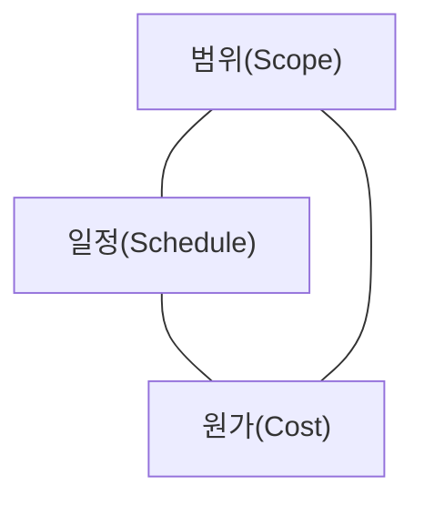
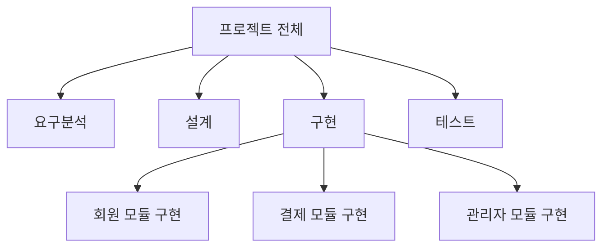

<Callout type="info">
  **이번 문서의 목표:** 이 파일을 다 읽으면 소프트웨어 프로젝트 계획이 어떤 요소로 구성되는지, WBS로 범위를 어떻게 쪼개는지, 진척률을 EVM(획득가치) 지표로 어떻게 계산·해석하는지를 설명하고 관련 문항을 풀 수 있게 됩니다.
</Callout>

## 왜 프로젝트 관리를 별도로 배우는가

지금까지의 편들은 "소프트웨어를 어떻게 만들 것인가"(요구공학·설계·구현·테스트)를 다뤘습니다. 그런데 아무리 기술적으로 잘 만들어도, **정해진 기간과 예산 안에** 끝내지 못하면 프로젝트는 실패합니다. 05편에서 다룬 프로세스 모델이 "어떤 순서로 개발할지"의 틀이라면, **프로젝트 관리**는 그 틀 안에서 **범위·일정·원가·인력을 계획하고 통제하는 활동**입니다.

> **쉽게 말하면:** 프로젝트 관리는 "무엇을, 언제까지, 얼마의 비용으로 끝낼지 계획하고, 계획대로 되고 있는지 계속 확인하는" 활동입니다.

## 1. 프로젝트 계획 — 무엇을 계획하는가

소프트웨어 프로젝트 계획은 보통 다음 요소들을 포함합니다.

| 계획 요소 | 다루는 질문 |
|-----------|-------------|
| 범위(Scope) | 무엇을 만들 것인가, 무엇은 만들지 않을 것인가 |
| 일정(Schedule) | 각 작업을 언제 시작해서 언제 끝낼 것인가 |
| 원가(Cost) | 얼마의 예산이 필요한가 |
| 인력(Staffing) | 누가, 몇 명이 투입되는가 |
| 위험(Risk) | 무엇이 잘못될 수 있는가(20편에서 자세히) |
| 품질(Quality) | 어떤 기준으로 품질을 확인할 것인가(18편 연결) |

이 중 범위·일정·원가는 서로 강하게 얽혀 있어 흔히 **철의 삼각형(Iron Triangle)** 으로 부릅니다. 범위를 늘리면 일정이나 원가 중 하나(또는 둘 다)를 늘려야 하고, 일정을 단축하려면 원가를 늘리거나 범위를 줄여야 합니다. 셋 중 하나만 고정하고 나머지 둘을 자유롭게 조정할 수는 없습니다.

<Callout type="warning">
  **자주 틀리는 점:** "범위·일정·원가를 모두 고정한 채 품질까지 마음대로 높일 수 있다"는 것은 착각입니다. 셋 중 하나가 바뀌면 다른 것에 영향이 갈 수밖에 없다는 상호 제약 관계를 이해해야, 프로젝트 관리 관련 문항에서 "무리한 계획"을 가려낼 수 있습니다.
</Callout>

## 2. WBS(작업분해구조) — 범위를 관리 가능한 단위로 쪼개기

**WBS**(Work Breakdown Structure, 작업분해구조)는 프로젝트의 전체 범위를 계층적으로 쪼개, 관리·추정·배정이 가능한 작은 작업 단위(**작업 패키지**, Work Package)로 나눈 구조입니다. 범위를 산출물 중심으로 나눠 내려가다가, 더 이상 쪼갤 필요가 없을 만큼 작아지면(하나의 담당자에게 배정하고 일정·원가를 추정할 수 있는 수준) 분해를 멈춥니다.

WBS를 만드는 목적은 세 가지입니다. 첫째, 범위를 빠짐없이 나눠 **누락을 방지**합니다. 둘째, 작업 패키지 단위로 **일정·원가를 추정**할 수 있게 합니다. 셋째, 작업 패키지마다 **담당자를 배정**해 책임 소재를 명확히 합니다.

<Callout type="warning">
  **자주 틀리는 점:** WBS는 "일이 진행되는 순서"(일정)를 나타내는 구조가 아니라 "범위를 무엇으로 구성할지"를 나타내는 구조입니다. 작업 간 선후 관계는 WBS가 아니라 다음 절의 일정 기법(간트 차트·네트워크 다이어그램)에서 다룹니다.
</Callout>

## 3. 일정 관리 — WBS 작업을 시간 축에 배치

WBS로 쪼갠 작업 패키지들은 서로 선후 관계를 가집니다(설계가 끝나야 구현을 시작할 수 있다 등). 이 선후 관계를 시간 축에 배치해 전체 일정을 관리하는 기법은 20편에서 PERT·CPM·간트 차트로 자세히 다룹니다. 이번 편에서는 일정 관리의 결과물이 프로젝트 계획에서 어떤 역할을 하는지만 짚습니다 — 일정은 각 작업 패키지의 **시작일·종료일·소요기간**을 정해, 프로젝트 전체의 **완료 예정일**을 도출하는 근거가 됩니다.

## 4. 원가 관리와 진척 관리 — 계획 대비 실적을 숫자로 추적하기

프로젝트가 시작된 뒤에는 "계획대로 되고 있는지"를 주기적으로 확인해야 합니다. 이때 널리 쓰이는 기법이 **EVM**(Earned Value Management, 획득가치관리)입니다. EVM은 진척 상황을 "일정이 지연됐는지"와 "예산을 초과했는지"를 **같은 화폐 단위**로 환산해 동시에 파악할 수 있게 해 줍니다.

### EVM의 세 기준값

| 기준값 | 영문 | 의미 |
|--------|------|------|
| 계획가치 | PV(Planned Value) | 특정 시점까지 계획상 완료했어야 할 작업의 예산 가치 |
| 획득가치 | EV(Earned Value) | 특정 시점까지 실제로 완료한 작업의 예산 가치 |
| 실제원가 | AC(Actual Cost) | 특정 시점까지 실제로 지출한 비용 |

**예시**: 어떤 작업 패키지의 총 예산이 1,000만 원이고 10주 동안 균등하게 진행될 계획입니다. 5주 차 시점에 계획상으로는 절반이 끝나 있어야 합니다.

$$
PV = 1{,}000 \times \frac{5}{10} = 500 \ (\text{만 원})
$$

그런데 실제로는 작업의 40퍼센트만 완료됐고, 그동안 실제로 지출한 비용은 600만 원이었습니다.

$$
EV = 1{,}000 \times 0.4 = 400 \ (\text{만 원})
$$

$$
AC = 600 \ (\text{만 원})
$$

### 일정·원가 차이와 지수

이 세 값을 비교하면 프로젝트가 일정과 예산 중 어디서 얼마나 벗어났는지 알 수 있습니다.

$$
SV = EV - PV = 400 - 500 = -100 \ (\text{만 원})
$$

- $SV$(Schedule Variance, 일정 차이): 음수이면 계획보다 진행이 뒤처짐

$$
CV = EV - AC = 400 - 600 = -200 \ (\text{만 원})
$$

- $CV$(Cost Variance, 원가 차이): 음수이면 계획보다 비용을 더 씀(예산 초과)

$$
SPI = \frac{EV}{PV} = \frac{400}{500} = 0.8
$$

- $SPI$(Schedule Performance Index, 일정성과지수): 1보다 작으면 일정 지연

$$
CPI = \frac{EV}{AC} = \frac{400}{600} \approx 0.67
$$

- $CPI$(Cost Performance Index, 원가성과지수): 1보다 작으면 예산 초과(비효율)

이 사례는 $SV$도 음수, $CV$도 음수, $SPI \cdot CPI$도 모두 1 미만이므로 **일정도 늦고 예산도 초과하는 이중으로 나쁜 상황**임을 숫자로 확인할 수 있습니다. 만약 두 값을 따로 관리했다면 "40퍼센트 완료"라는 진척률만 보고 예산이 얼마나 비효율적으로 쓰이고 있는지 놓칠 수 있었을 것입니다.

<Callout type="warning">
  **자주 틀리는 점:** $CV$와 $SV$의 부호 방향을 헷갈리기 쉽습니다. 두 지표 모두 **EV(획득가치)를 기준으로 빼는 값**($EV - PV$, $EV - AC$)이며, **음수는 나쁜 방향**(지연, 초과)이라는 규칙을 기억해야 합니다. AC가 EV보다 크면(더 많이 썼는데 그만큼 못 끝냈으면) $CV$는 음수가 됩니다.
</Callout>

> **비유:** EVM은 마라톤 중간 지점에서 "지금까지 뛴 거리(EV)가 계획한 거리(PV)보다 짧은가"(일정 지연), "지금까지 쓴 체력(AC)에 비해 뛴 거리(EV)가 짧은가"(비효율)를 동시에 확인하는 것과 같습니다. 완주 여부만 보면 늦게 알아채지만, 중간 지점마다 이 두 값을 비교하면 문제를 미리 알아챌 수 있습니다.

## 5. 진척 관리를 계획 갱신으로 연결하기

EVM으로 계산한 $SPI$, $CPI$가 계속 1 미만으로 나온다면, 단순히 "더 열심히 하자"는 결론에 머물지 않고 계획 자체를 재검토해야 합니다.

<Steps>

1. **원인 분석** — 왜 지연·초과가 발생했는지(요구사항 변경, 인력 이탈, 추정 오류 등) 확인한다
2. **범위·일정·원가 재조정** — 철의 삼각형 관계를 고려해 어느 것을 조정할지 결정한다(범위 축소, 일정 연장, 인력 추가 등)
3. **이해관계자 합의** — 조정안을 발주자·경영진 등과 합의한다(06편의 요구 협상과 유사한 절차)
4. **계획 갱신 및 재측정** — 갱신된 계획을 기준으로 다음 주기의 EVM을 다시 측정한다

</Steps>

<Callout type="warning">
  **자주 틀리는 점:** $CPI$가 1 미만이라고 해서 "인력을 더 투입하면 무조건 해결된다"고 단정하면 안 됩니다. 인력을 늘리면 신규 인력의 교육·의사소통 비용이 추가로 발생해 오히려 단기적으로 더 늦어질 수 있다는 점(브룩스의 법칙과 유사한 통찰)은 20편의 추정·일정 기법에서 더 다룹니다.
</Callout>

## 핵심 정리

- 프로젝트 계획은 범위·일정·원가·인력·위험·품질을 포함하며, **범위·일정·원가는 철의 삼각형**으로 서로 상호 제약한다.
- **WBS**(작업분해구조)는 프로젝트 범위를 계층적으로 쪼개 관리 가능한 작업 패키지로 나눈 구조이며, 선후 관계(일정)가 아니라 범위 구성을 나타낸다.
- **EVM**(획득가치관리)은 PV(계획가치)·EV(획득가치)·AC(실제원가) 세 값으로 일정 차이($SV = EV-PV$)와 원가 차이($CV = EV-AC$), 일정성과지수($SPI = EV/PV$)와 원가성과지수($CPI = EV/AC$)를 계산해 진척을 화폐 단위로 통합 관리한다.
- 지표가 1 미만·음수로 나오면 원인을 분석하고 범위·일정·원가를 재조정한 뒤 이해관계자와 합의해 계획을 갱신해야 한다.

## 마무리 복습

<Quiz
  questionNumber={1}
  question="프로젝트 관리에서 말하는 '철의 삼각형(Iron Triangle)'을 구성하는 세 요소로 옳은 것은?"
  options={['범위, 일정, 원가', '요구사항, 설계, 구현', '인력, 위험, 품질', '계획, 실행, 통제']}
  correctAnswer={1}
  explanation="철의 삼각형은 범위(Scope), 일정(Schedule), 원가(Cost)가 서로 상호 제약 관계에 있음을 나타낸다. 하나를 바꾸면 다른 하나 또는 둘 다 영향을 받는다."
  optionExplanations={['정답 — 범위, 일정, 원가가 철의 삼각형을 구성한다', '요구사항, 설계, 구현은 개발 단계를 나타내는 것으로 철의 삼각형과는 다른 개념이다', '인력, 위험, 품질은 프로젝트 계획의 요소이지만 철의 삼각형을 구성하지 않는다', '계획, 실행, 통제는 관리 활동의 절차이지 철의 삼각형의 구성 요소가 아니다']}
/>

<Quiz
  questionNumber={2}
  question="WBS(작업분해구조)에 대한 설명으로 옳지 않은 것은?"
  options={['프로젝트 전체 범위를 계층적으로 쪼개 작업 패키지 단위로 나눈다', '작업 패키지 단위로 일정·원가를 추정하고 담당자를 배정할 수 있게 한다', 'WBS는 작업 간의 시간적 선후 관계(일정)를 표현하는 구조다', '범위를 빠짐없이 나눠 누락을 방지하는 목적이 있다']}
  correctAnswer={3}
  explanation="WBS는 범위를 무엇으로 구성할지 나타내는 구조이며, 작업 간 선후 관계(일정)는 간트 차트나 네트워크 다이어그램 같은 별도의 일정 기법으로 표현한다."
  optionExplanations={['옳은 설명이다', '옳은 설명이다', '정답 — WBS는 범위 구성을 나타내며 시간적 선후 관계는 일정 기법이 별도로 담당한다', '옳은 설명이다']}
/>

<Quiz
  questionNumber={3}
  question="총 예산 2,000만 원, 8주 계획인 작업 패키지가 4주 차 시점에 도달했다. 계획가치(PV)는?"
  options={['500만 원', '750만 원', '1,000만 원', '1,500만 원']}
  correctAnswer={3}
  explanation="PV는 총 예산에 경과 계획 비율을 곱한 값이다. 2,000만 원의 4/8(절반)이므로 1,000만 원이다."
  optionExplanations={['2,000 × 4/8 = 1,000만 원이 되어야 하므로 500만 원은 계산이 틀렸다', '2,000 × 4/8 = 1,000만 원이 되어야 하므로 750만 원은 계산이 틀렸다', '정답 — PV = 2,000 × (4/8) = 1,000만 원', '2,000 × 4/8 = 1,000만 원이 되어야 하므로 1,500만 원은 계산이 틀렸다']}
/>

<Quiz
  questionNumber={4}
  question="총 예산 2,000만 원인 작업 패키지에서 4주 차 시점에 실제로는 작업의 30퍼센트가 완료됐고, 그동안 실제 지출은 700만 원이었다. 원가 차이(CV)는?"
  options={['-100만 원', '-200만 원', '-300만 원', '-400만 원']}
  correctAnswer={2}
  explanation="EV는 총 예산에 실제 완료 비율을 곱한 값으로 2,000 × 0.3 = 600만 원이다. CV = EV - AC = 600 - 700 = -100만 원이다."
  optionExplanations={['정답 — EV(600만 원) - AC(700만 원) = -100만 원', 'CV 계산에서 EV(600만 원)을 정확히 산출하지 못하면 나올 수 있는 오답이다', 'EV를 잘못 계산했을 때(예: 30%를 다른 기준에 적용) 나올 수 있는 오답이다', 'AC나 EV 계산에서 오차가 누적됐을 때 나올 수 있는 오답이다']}
/>

<Quiz
  questionNumber={5}
  question="위 4번 문제와 같은 조건에서 일정성과지수(SPI)를 계산하면 약 얼마인가? (PV = 1,000만 원, EV = 600만 원)"
  options={['0.6', '0.7', '0.83', '1.2']}
  correctAnswer={1}
  explanation="SPI = EV / PV = 600 / 1,000 = 0.6이다. 1보다 작으므로 계획보다 진행이 뒤처져 있음을 의미한다."
  optionExplanations={['정답 — SPI = 600 / 1,000 = 0.6', '계산 과정에서 오차가 있을 때 나올 수 있는 근사값으로 정확한 값이 아니다', 'EV와 AC를 혼동해 계산했을 때 나올 수 있는 값(600/700 근사)으로 SPI 공식과 다르다', 'PV와 EV의 위치를 반대로 계산했을 때 나올 수 있는 값으로 SPI 공식과 다르다']}
/>

<Quiz
  questionNumber={6}
  question="EVM 지표 해석으로 옳지 않은 것은?"
  options={['SPI가 1보다 작으면 계획보다 일정이 지연되고 있다는 뜻이다', 'CPI가 1보다 작으면 투입한 비용 대비 완료한 작업의 가치가 낮아 비효율적이라는 뜻이다', 'CV가 양수이면 예산보다 비용을 더 많이 쓰고 있다는 뜻이다', 'SV가 음수이면 계획보다 진행이 뒤처져 있다는 뜻이다']}
  correctAnswer={3}
  explanation="CV = EV - AC이므로 CV가 양수라는 것은 EV가 AC보다 크다는 뜻, 즉 지출한 비용보다 더 많은 가치를 완료했다는 뜻으로 오히려 예산 대비 효율적인 상황이다. 비용을 더 많이 쓰는 것은 CV가 음수일 때다."
  optionExplanations={['옳은 설명이다', '옳은 설명이다', '정답 — CV 양수는 EV가 AC보다 커서 효율적인 상황을 의미하며, 비용 초과는 CV가 음수일 때다', '옳은 설명이다']}
/>

<Quiz
  questionNumber={7}
  question="EVM 지표가 지속적으로 SPI, CPI 모두 1 미만으로 나타날 때 취해야 할 조치로 가장 적절한 것은?"
  options={['지표를 무시하고 원래 계획대로 진행한다', '원인을 분석한 뒤 철의 삼각형 관계를 고려해 범위·일정·원가를 재조정하고 이해관계자와 합의한다', '무조건 인력을 두 배로 늘려 즉시 해결한다', '진척률만 다시 계산하고 원가 지표는 무시한다']}
  correctAnswer={2}
  explanation="지표가 계속 나쁘게 나오면 원인을 분석하고, 범위·일정·원가의 상호 제약 관계를 고려해 계획을 재조정한 뒤 이해관계자와 합의해 계획을 갱신해야 한다. 인력을 무작정 늘리는 것은 오히려 역효과를 부를 수 있다."
  optionExplanations={['지표가 문제를 알려주는데 무시하면 문제가 누적된다', '정답 — 원인 분석과 철의 삼각형을 고려한 재조정, 이해관계자 합의가 적절한 절차다', '인력 투입 증가는 교육·의사소통 비용으로 오히려 단기적으로 역효과를 낼 수 있다', '일정과 원가 지표는 함께 봐야 하며 한쪽을 무시하면 안 된다']}
/>

## 참고 자료

- [SWEBOK topics 상세 - IEEE Computer Society](https://www.computer.org/education/bodies-of-knowledge/software-engineering/topics)
- [SWEBOK v4 and SFIA v9 가이드](https://sfia-online.org/en/tools-and-resources/bodies-of-knowledge/swebok-software-engineering-body-of-knowledge/swebok4-sfia9-the-guide-to-the-software-engineering-body-of-knowledge)
