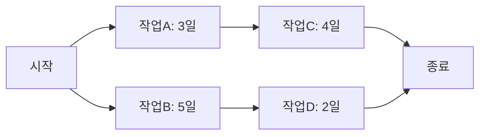

<Callout type="info">
  **이번 문서의 목표:** 이 파일을 다 읽으면 위험을 식별해 노출도로 우선순위를 매기는 방법, LOC와 COCOMO로 개발 노력을 추정하는 계산, PERT로 기대 소요시간과 임계경로를 구하는 절차를 설명하고 관련 문항을 풀 수 있게 됩니다.
</Callout>

## 왜 위험·추정·일정을 한데 묶어 다루는가

19편에서 프로젝트 계획의 범위·일정·원가·EVM 진척 관리를 다뤘습니다. 그런데 애초에 일정과 원가를 계획하려면 **"얼마나 걸릴지, 얼마나 들지"를 먼저 추정**해야 하고, 그 추정과 계획은 **무엇이 잘못될 수 있는지(위험)** 를 함께 고려해야 현실성을 갖습니다. 이번 편은 계획을 세우기 **이전 단계**에 필요한 세 가지 — 위험 관리, 노력·원가 추정, 일정 기법 — 를 다룹니다.

> **쉽게 말하면:** 이번 편은 "무엇이 잘못될 수 있는지 미리 대비하고, 얼마나 걸릴지 숫자로 추정하고, 그 추정을 실제 일정표로 만드는" 방법을 다룹니다.

## 1. 위험 관리 — 식별, 분석, 대응

**위험(Risk)** 은 아직 일어나지 않았지만 일어나면 프로젝트 목표(범위·일정·원가·품질)에 부정적 영향을 줄 수 있는 불확실한 사건입니다. 위험 관리는 이런 사건을 미리 찾아내 대비하는 활동으로, 세 단계로 진행됩니다.

<Steps>

1. **위험 식별(Risk Identification)** — 발생 가능한 위험 요소를 목록화한다(핵심 인력 이탈, 요구사항 잦은 변경, 신기술 미숙련, 일정 촉박 등)
2. **위험 분석(Risk Analysis)** — 각 위험의 **발생 확률**과 **발생 시 영향(손실 크기)** 을 추정해 우선순위를 매긴다
3. **위험 대응(Risk Response)** — 우선순위가 높은 위험부터 대응 전략을 세운다

</Steps>

### 위험 노출도로 우선순위 매기기

위험이 여러 개일 때 "어느 것부터 대응해야 하는가"를 정하는 대표적인 지표가 **위험 노출도(Risk Exposure)** 입니다.

$$
RE = P \times C
$$

- $RE$(Risk Exposure, 위험 노출도)
- $P$(Probability, 발생 확률, 0~1 사이 값)
- $C$(Consequence/Cost, 발생 시 손실 비용)

**예시**: 위험 A는 발생 확률 40퍼센트(0.4), 발생 시 손실 5,000만 원으로 예상됩니다. 위험 B는 발생 확률 10퍼센트(0.1)로 낮지만 발생하면 손실이 3억 원(30,000만 원)에 이릅니다.

$$
RE_A = 0.4 \times 5{,}000 = 2{,}000 \ (\text{만 원})
$$

$$
RE_B = 0.1 \times 30{,}000 = 3{,}000 \ (\text{만 원})
$$

발생 확률만 보면 위험 A가 더 위협적으로 보이지만, 노출도로 계산하면 **위험 B의 노출도(3,000만 원)가 위험 A(2,000만 원)보다 커서 더 우선적으로 대응**해야 함을 알 수 있습니다.

<Callout type="warning">
  **자주 틀리는 점:** "발생 확률이 높은 위험이 항상 우선순위 1위"라고 단정하면 안 됩니다. 확률이 낮아도 손실이 매우 크면 노출도가 더 클 수 있으므로, 반드시 **확률과 영향을 곱한 값**으로 비교해야 합니다.
</Callout>

### 위험 대응 전략

| 전략 | 의미 | 예시 |
|------|------|------|
| 회피(Avoidance) | 위험의 원인 자체를 제거한다 | 검증되지 않은 신기술 대신 검증된 기술을 채택 |
| 완화(Mitigation) | 발생 확률이나 영향을 줄인다 | 핵심 인력에 대한 백업 인력 교육 |
| 전가(Transference) | 위험의 부담을 제3자에게 넘긴다 | 특정 모듈 개발을 외주·보험으로 이전 |
| 수용(Acceptance) | 위험을 받아들이고 발생 시 대응 계획만 준비한다 | 영향이 작은 위험에 대해 예비비만 확보 |

## 2. 노력 추정 — LOC와 COCOMO

일정과 원가를 계획하려면 먼저 **개발에 필요한 노력(Effort)** 을 추정해야 합니다. 대표적인 방법이 **COCOMO**(COnstructive COst MOdel)입니다. COCOMO는 예상 코드 크기(KLOC, Kilo Lines Of Code)를 바탕으로 필요한 개발 노력(인월, Person-Month)을 추정하는 경험적 모델입니다.

기본형(Basic COCOMO)의 공식은 다음과 같습니다.

$$
E = a \times (KLOC)^b
$$

- $E$(Effort, 노력): 필요한 개발 노력, 단위는 인월(PM, Person-Month, 한 사람이 한 달 동안 일하는 노력의 단위)
- $KLOC$: 예상 코드 크기(1,000줄 단위)
- $a$, $b$: 프로젝트 유형(조직형·반분리형·내장형)에 따라 정해지는 경험적 상수

**예시**: 조직형(organic) 프로젝트의 계수를 $a=2.4$, $b=1.05$라 하고, 예상 코드 크기가 20 KLOC라면,

$$
E = 2.4 \times (20)^{1.05}
$$

$20^{1.05}$는 $20^1 = 20$에 지수가 조금 커진 값이므로 약 23.4 정도가 되고,

$$
E \approx 2.4 \times 23.4 \approx 56.2 \ (\text{인월})
$$

즉 이 프로젝트에는 약 56.2인월의 노력이 필요하다는 뜻입니다. 이는 "한 사람이 56.2개월 동안 일해야 한다"는 뜻이 아니라, **여러 사람이 나눠서 일할 수 있는 총 작업량**을 인월 단위로 표현한 것입니다. 예를 들어 5명이 투입되면 대략 $56.2 \div 5 \approx 11.2$개월 정도로 일정을 잡아볼 수 있습니다(실제로는 인력을 늘린다고 기간이 비례해서 줄지 않는다는 점을 이어서 다룹니다).

<Callout type="warning">
  **자주 틀리는 점:** 인월(Person-Month)은 "인원 수 × 개월 수"로 단순 곱셈이 성립하는 것처럼 보이지만, 실제 프로젝트에서는 인원을 늘린다고 기간이 정비례해서 줄지 않습니다. 신규 인력은 기존 인력의 교육·의사소통에 시간을 쓰게 하므로, 일정이 이미 늦어진 프로젝트에 인력을 추가하면 오히려 더 늦어질 수 있습니다(브룩스의 법칙, Brooks's Law). "이미 늦은 프로젝트에 사람을 더 투입하면 더 늦어진다"는 이 통찰은 시험에서 자주 인용됩니다.
</Callout>

### 기능점수(Function Point)와의 비교

LOC(코드 줄 수) 기반 추정은 코드가 작성되기 전에는 정확히 예측하기 어렵고, 프로그래밍 언어에 따라 같은 기능도 줄 수가 크게 달라진다는 한계가 있습니다. **기능점수(FP, Function Point)** 는 이런 한계를 보완하기 위해, 코드 줄 수 대신 **사용자에게 제공되는 기능의 개수와 복잡도**(입력, 출력, 조회, 내부 논리 파일, 외부 인터페이스 파일)를 기준으로 규모를 측정합니다. 기능점수는 특정 언어에 의존하지 않아 서로 다른 언어로 만든 프로젝트끼리도 규모를 비교할 수 있다는 장점이 있습니다.

| 구분 | LOC 기반 | 기능점수(FP) 기반 |
|------|----------|---------------------|
| 측정 시점 | 코드가 어느 정도 작성된 후에 정확해짐 | 요구사항·설계 단계에서도 측정 가능 |
| 언어 의존성 | 언어마다 같은 기능도 줄 수가 다름 | 언어에 의존하지 않음 |
| 측정 대상 | 소스 코드 줄 수 | 사용자 관점의 기능 개수·복잡도 |

<Callout type="warning">
  **자주 틀리는 점:** "기능점수가 LOC보다 항상 정확하다"고 단정하지 않습니다. 기능점수는 언어 독립성이라는 장점이 있지만, 산정 기준을 숙련되게 적용해야 신뢰도가 높아지는 등 나름의 어려움이 있습니다. 시험에서는 "각 방식의 장단점을 구분"하는 문제로 나옵니다.
</Callout>

## 3. 일정 기법 — 간트 차트와 PERT/CPM

노력을 추정했다면, 이를 실제 작업 순서와 기간으로 배치해야 합니다. 대표적인 두 기법이 **간트 차트**와 **PERT/CPM**입니다.

### 간트 차트(Gantt Chart)

간트 차트는 각 작업의 시작일·종료일을 가로 막대로 표현해 **일정을 한눈에 시각화**하는 도구입니다.

| 작업 | 1주 | 2주 | 3주 | 4주 | 5주 |
|------|-----|-----|-----|-----|-----|
| 요구분석 | ■■■ | | | | |
| 설계 | | ■■■ | ■ | | |
| 구현 | | | ■■ | ■■■ | |
| 테스트 | | | | ■ | ■■■ |

간트 차트는 직관적이지만, 작업 간 **의존 관계**(어느 작업이 끝나야 다음 작업을 시작할 수 있는지)나 **어느 작업이 지연되면 전체 일정이 늦어지는지**는 한눈에 파악하기 어렵습니다. 이를 보완하는 기법이 PERT/CPM입니다.

### PERT/CPM — 임계경로 구하기

**PERT**(Program Evaluation and Review Technique)와 **CPM**(Critical Path Method)은 작업들을 네트워크(노드-에지 그래프)로 표현해, 작업 간 의존 관계와 **임계경로(Critical Path)** — 전체 프로젝트 기간을 결정짓는, 여유시간이 없는 작업들의 연쇄 — 를 구하는 기법입니다.

PERT는 각 작업의 소요시간을 하나의 확정값이 아니라 **낙관치·최빈치·비관치** 세 값으로 추정해 **기대시간**을 계산합니다.

$$
T_e = \frac{O + 4M + P}{6}
$$

- $T_e$(Expected Time, 기대시간)
- $O$(Optimistic, 낙관치): 모든 것이 순조로울 때 걸리는 최단 시간
- $M$(Most likely, 최빈치): 가장 그럴듯한 소요시간
- $P$(Pessimistic, 비관치): 문제가 생겼을 때 걸리는 최장 시간

**예시**: 어떤 작업의 낙관치가 4일, 최빈치가 6일, 비관치가 14일이라면,

$$
T_e = \frac{4 + 4 \times 6 + 14}{6} = \frac{4 + 24 + 14}{6} = \frac{42}{6} = 7 \ (\text{일})
$$

이 작업의 기대 소요시간은 7일입니다. 최빈치(6일)보다 기대시간이 다소 긴 이유는 비관치(14일)가 최빈치보다 훨씬 크게 벌어져 있어(분포가 오른쪽으로 치우쳐) 평균을 끌어올렸기 때문입니다.

### 임계경로 구하기

각 작업의 기대시간을 구한 뒤, 작업들을 선후 관계에 따라 네트워크로 연결하면 **여러 경로** 중 가장 긴 경로(합산 소요시간이 가장 큰 경로)가 나옵니다. 이 경로가 **임계경로**이며, 임계경로 위의 작업이 하루라도 지연되면 전체 프로젝트도 그만큼 지연됩니다. 반대로 임계경로에 속하지 않는 작업은 어느 정도 여유시간(Slack, Float)이 있어, 그 범위 안에서는 지연돼도 전체 일정에 영향을 주지 않습니다.

위 예시에서 경로는 두 갈래입니다. 경로 1( S → A → C → E )은 $3+4=7$일, 경로 2( S → B → D → E )는 $5+2=7$일로 **두 경로의 합산이 같다면 둘 다 임계경로**가 될 수 있습니다. 만약 경로 2의 작업B가 6일로 늘어난다면 경로 2는 $6+2=8$일이 되어, 이때는 경로 2가 임계경로가 되고 전체 프로젝트 기간도 8일로 늘어납니다.

<Callout type="warning">
  **자주 틀리는 점:** 임계경로는 "가장 짧은 경로"가 아니라 **가장 긴 경로**입니다. 여러 경로 중 가장 오래 걸리는 경로가 전체 프로젝트의 최소 완료 기간을 결정하기 때문입니다. "짧은 경로부터 신경 쓰면 된다"는 착각이 시험에서 오답으로 자주 나옵니다.
</Callout>

## 핵심 정리

- **위험 관리**는 식별 → 분석 → 대응의 절차를 따르며, 우선순위는 **위험 노출도** $RE = P \times C$(확률 × 손실)로 판단한다. 대응 전략은 회피·완화·전가·수용으로 나뉜다.
- **COCOMO**는 $E = a \times (KLOC)^b$로 코드 크기 기반 개발 노력(인월)을 추정한다. 인력을 늘린다고 기간이 비례해 줄지 않으며, 이미 늦은 프로젝트에 인력을 추가하면 더 늦어질 수 있다(브룩스의 법칙).
- **기능점수(FP)** 는 언어에 의존하지 않고 요구·설계 단계부터 규모를 측정할 수 있어 LOC 기반 추정의 한계를 보완한다.
- **간트 차트**는 일정을 시각화하지만 의존 관계 파악에 한계가 있고, **PERT/CPM**은 기대시간 $T_e = (O+4M+P)/6$과 **임계경로**(가장 긴 경로)로 전체 일정을 결정짓는 작업을 찾아낸다.

## 마무리 복습

<Quiz
  questionNumber={1}
  question="위험 A는 발생 확률 20%, 손실 8,000만 원이고 위험 B는 발생 확률 50%, 손실 2,000만 원이다. 위험 노출도(RE)를 기준으로 더 우선 대응해야 할 위험은?"
  options={['위험 A, 노출도 1,600만 원으로 위험 B(1,000만 원)보다 크다', '위험 B, 발생 확률이 더 높으므로 무조건 우선한다', '위험 A와 위험 B의 노출도는 동일하다', '노출도는 손실 크기만으로 판단하므로 위험 A가 우선이다']}
  correctAnswer={1}
  explanation="위험 노출도는 확률과 손실의 곱이다. 위험 A는 0.2 × 8,000 = 1,600만 원, 위험 B는 0.5 × 2,000 = 1,000만 원으로 위험 A의 노출도가 더 크다."
  optionExplanations={['정답 — RE_A = 0.2×8,000 = 1,600만 원, RE_B = 0.5×2,000 = 1,000만 원으로 위험 A가 더 크다', '확률만으로 우선순위를 정하면 안 되며 노출도(확률×손실)로 비교해야 한다', '두 노출도는 1,600만 원과 1,000만 원으로 서로 다르다', '노출도는 확률과 손실을 모두 곱한 값으로 손실 크기만으로 판단하지 않는다']}
/>

<Quiz
  questionNumber={2}
  question="위험 대응 전략 중 '검증되지 않은 신기술 대신 이미 검증된 기술을 채택해 위험의 원인 자체를 없애는 것'에 해당하는 전략은?"
  options={['완화(Mitigation)', '회피(Avoidance)', '전가(Transference)', '수용(Acceptance)']}
  correctAnswer={2}
  explanation="회피는 위험의 원인 자체를 제거하는 전략이다. 검증되지 않은 기술 대신 검증된 기술을 쓰는 것은 위험의 발생 원인 자체를 없애는 것이므로 회피에 해당한다."
  optionExplanations={['완화는 발생 확률이나 영향을 줄이는 것으로, 원인 자체를 제거하는 것과는 다르다', '정답 — 원인 자체를 제거하는 것은 회피 전략이다', '전가는 위험 부담을 제3자에게 넘기는 것이다', '수용은 위험을 받아들이고 대응 계획만 준비하는 것이다']}
/>

<Quiz
  questionNumber={3}
  question="COCOMO 기본형 공식 E = a × (KLOC)^b에서 각 기호에 대한 설명으로 옳지 않은 것은?"
  options={['E는 인월(Person-Month) 단위로 표현되는 노력이다', 'KLOC는 예상 코드 크기를 1,000줄 단위로 나타낸 값이다', 'a, b는 프로젝트 유형에 따라 정해지는 경험적 상수다', 'E는 반드시 한 사람이 그 개월 수만큼 혼자 일해야 함을 의미한다']}
  correctAnswer={4}
  explanation="인월은 여러 사람이 나눠서 수행할 수 있는 총 작업량을 나타내는 단위이지, 한 사람이 반드시 그 기간 동안 혼자 일해야 한다는 의미가 아니다."
  optionExplanations={['옳은 설명이다', '옳은 설명이다', '옳은 설명이다', '정답 — 인월은 총 작업량 단위이며 한 사람이 혼자 수행해야 한다는 의미가 아니다']}
/>

<Quiz
  questionNumber={4}
  question="브룩스의 법칙(Brooks's Law)이 시사하는 바로 가장 적절한 것은?"
  options={['인력을 늘리면 프로젝트 기간은 항상 인원 수에 정비례해 줄어든다', '이미 일정이 늦어진 프로젝트에 인력을 추가하면 교육·의사소통 비용 때문에 오히려 더 늦어질 수 있다', '인력 추가는 항상 프로젝트 품질을 높인다', '인력 규모는 프로젝트 일정과 무관하다']}
  correctAnswer={2}
  explanation="브룩스의 법칙은 이미 지연된 프로젝트에 인력을 추가하면 신규 인력의 교육과 기존 인력과의 의사소통 비용이 늘어나 단기적으로 오히려 일정이 더 늦어질 수 있다는 통찰이다."
  optionExplanations={['인원 수와 기간이 정비례하지 않는다는 것이 브룩스의 법칙의 핵심이다', '정답 — 교육·의사소통 비용 때문에 오히려 더 늦어질 수 있다는 것이 브룩스의 법칙의 핵심이다', '인력 추가가 품질을 항상 높인다는 것은 브룩스의 법칙과 무관한 설명이다', '인력 규모는 일정에 영향을 주므로 무관하다는 설명은 옳지 않다']}
/>

<Quiz
  questionNumber={5}
  question="기능점수(Function Point) 기반 추정 방식의 장점으로 가장 적절한 것은?"
  options={['프로그래밍 언어에 의존하지 않고 요구사항·설계 단계에서도 규모를 측정할 수 있다', '코드가 완성된 이후에만 측정할 수 있어 정확도가 항상 더 높다', 'LOC보다 계산 절차가 항상 더 단순하다', '특정 프로그래밍 언어에서만 사용할 수 있다']}
  correctAnswer={1}
  explanation="기능점수는 사용자 관점의 기능 개수와 복잡도를 기준으로 측정하므로 언어에 의존하지 않고, 코드가 작성되기 전인 요구사항·설계 단계에서도 측정할 수 있다는 장점이 있다."
  optionExplanations={['정답 — 언어 독립적이며 요구·설계 단계에서도 측정 가능하다는 것이 기능점수의 핵심 장점이다', '기능점수는 오히려 코드 작성 이전 단계에서도 측정할 수 있다는 점이 장점이다', '기능점수 산정에는 나름의 숙련된 기준 적용이 필요하며 항상 더 단순하다고 할 수 없다', '기능점수는 특정 언어에 의존하지 않는 것이 장점이다']}
/>

<Quiz
  questionNumber={6}
  question="어떤 작업의 낙관치가 2일, 최빈치가 5일, 비관치가 8일일 때 PERT 기대시간(Te)은?"
  options={['4일', '5일', '6일', '7일']}
  correctAnswer={2}
  explanation="Te = (O + 4M + P) / 6 = (2 + 4×5 + 8) / 6 = (2 + 20 + 8) / 6 = 30 / 6 = 5일이다."
  optionExplanations={['(2+20+8)/6 = 5이므로 4일은 계산이 틀렸다', '정답 — (2+20+8)/6 = 30/6 = 5일', '(2+20+8)/6 = 5이므로 6일은 계산이 틀렸다', '(2+20+8)/6 = 5이므로 7일은 계산이 틀렸다']}
/>

<Quiz
  questionNumber={7}
  question="PERT/CPM에서 임계경로(Critical Path)에 대한 설명으로 옳지 않은 것은?"
  options={['네트워크에서 소요시간의 합이 가장 긴 경로를 의미한다', '임계경로 위의 작업이 지연되면 전체 프로젝트 기간도 그만큼 지연된다', '임계경로는 여러 경로 중 소요시간의 합이 가장 짧은 경로를 의미한다', '임계경로에 속하지 않는 작업은 일정한 여유시간(Slack)을 가질 수 있다']}
  correctAnswer={3}
  explanation="임계경로는 가장 긴 경로이며, 이 경로의 총 소요시간이 프로젝트 전체의 최소 완료 기간을 결정한다. 가장 짧은 경로가 임계경로라는 설명은 옳지 않다."
  optionExplanations={['옳은 설명이다', '옳은 설명이다', '정답 — 임계경로는 가장 짧은 경로가 아니라 가장 긴 경로다', '옳은 설명이다']}
/>

<Quiz
  questionNumber={8}
  question="간트 차트(Gantt Chart)와 PERT/CPM을 비교한 설명으로 가장 적절한 것은?"
  options={['간트 차트는 작업 간 의존 관계와 임계경로를 명확히 보여주는 데 특화되어 있다', 'PERT/CPM은 일정을 가로 막대로 시각화하는 데 특화되어 있다', '간트 차트는 일정을 직관적으로 시각화하지만 의존 관계·임계경로 파악에는 한계가 있다', '두 기법은 완전히 동일한 정보를 제공하므로 병행할 필요가 없다']}
  correctAnswer={3}
  explanation="간트 차트는 각 작업의 시작·종료일을 막대로 보여줘 일정을 한눈에 파악하기 좋지만, 작업 간 의존 관계나 임계경로를 파악하는 데는 한계가 있어 PERT/CPM으로 보완한다."
  optionExplanations={['의존 관계와 임계경로를 명확히 보여주는 것은 PERT/CPM이며 간트 차트의 한계로 지적되는 부분이다', '가로 막대로 시각화하는 것은 간트 차트의 특징이다', '정답 — 간트 차트는 직관적 시각화에 강점이 있지만 의존 관계·임계경로 파악에는 한계가 있다', '두 기법은 서로 다른 정보를 보완적으로 제공하므로 병행해서 쓰는 경우가 많다']}
/>

## 참고 자료

- [SWEBOK topics 상세 - IEEE Computer Society](https://www.computer.org/education/bodies-of-knowledge/software-engineering/topics)
- [SWEBOK PDF 요약본](https://cursa.ihmc.us/rid=1K3W9B5S9-YC444R-2K9Y/SWEBOK.pdf)
