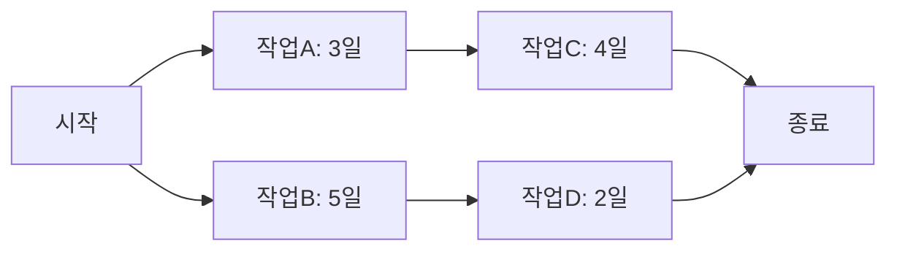

## 왜 위험·추정·일정을 한데 묶어 다루는가

19편에서 프로젝트 계획의 범위·일정·원가·EVM 진척 관리를 다뤘습니다. 그런데 애초에 일정과 원가를 계획하려면 **"얼마나 걸릴지, 얼마나 들지"를 먼저 추정**해야 하고, 그 추정과 계획은 **무엇이 잘못될 수 있는지(위험)** 를 함께 고려해야 현실성을 갖습니다.

## 1. 위험 관리 — 식별, 분석, 대응

**위험(Risk)** 은 아직 일어나지 않았지만 일어나면 프로젝트 목표(범위·일정·원가·품질)에 부정적 영향을 줄 수 있는 불확실한 사건입니다. 위험 관리는 이런 사건을 미리 찾아내 대비하는 활동으로, 세 단계로 진행됩니다.

### 위험 노출도로 우선순위 매기기

위험이 여러 개일 때 "어느 것부터 대응해야 하는가"를 정하는 대표적인 지표가 **위험 노출도(Risk Exposure)** 입니다.

$$
RE = P \times C
$$

- $RE$(Risk Exposure, 위험 노출도)
- $P$(Probability, 발생 확률, 0~1 사이 값)
- $C$(Consequence/Cost, 발생 시 손실 비용)

**예시**: 위험 A는 발생 확률 40퍼센트(0.4), 발생 시 손실 5,000만 원으로 예상됩니다. 위험 B는 발생 확률 10퍼센트(0.1)로 낮지만 발생하면 손실이 3억 원(30,000만 원)에 이릅니다.

$$
RE_A = 0.4 \times 5{,}000 = 2{,}000 \ (\text{만 원})
$$

$$
RE_B = 0.1 \times 30{,}000 = 3{,}000 \ (\text{만 원})
$$

발생 확률만 보면 위험 A가 더 위협적으로 보이지만, 노출도로 계산하면 **위험 B의 노출도(3,000만 원)가 위험 A(2,000만 원)보다 커서 더 우선적으로 대응**해야 함을 알 수 있습니다.

<Callout type="warning">
  **자주 틀리는 점:** "발생 확률이 높은 위험이 항상 우선순위 1위"라고 단정하면 안 됩니다. 확률이 낮아도 손실이 매우 크면 노출도가 더 클 수 있으므로, 반드시 **확률과 영향을 곱한 값**으로 비교해야 합니다.
</Callout>

### 위험 대응 전략

| 전략 | 의미 | 예시 |
|------|------|------|
| 회피(Avoidance) | 위험의 원인 자체를 제거한다 | 검증되지 않은 신기술 대신 검증된 기술을 채택 |
| 완화(Mitigation) | 발생 확률이나 영향을 줄인다 | 핵심 인력에 대한 백업 인력 교육 |
| 전가(Transference) | 위험의 부담을 제3자에게 넘긴다 | 특정 모듈 개발을 외주·보험으로 이전 |
| 수용(Acceptance) | 위험을 받아들이고 발생 시 대응 계획만 준비한다 | 영향이 작은 위험에 대해 예비비만 확보 |

## 2. 노력 추정 — LOC와 COCOMO

일정과 원가를 계획하려면 먼저 **개발에 필요한 노력(Effort)** 을 추정해야 합니다. 대표적인 방법이 **COCOMO**(COnstructive COst MOdel)입니다.

기본형(Basic COCOMO)의 공식은 다음과 같습니다.

$$
E = a \times (KLOC)^b
$$

- $E$(Effort, 노력): 필요한 개발 노력, 단위는 인월(PM, Person-Month, 한 사람이 한 달 동안 일하는 노력의 단위)
- $KLOC$: 예상 코드 크기(1,000줄 단위)
- $a$, $b$: 프로젝트 유형(조직형·반분리형·내장형)에 따라 정해지는 경험적 상수

**예시**: 조직형(organic) 프로젝트의 계수를 $a=2.4$, $b=1.05$라 하고, 예상 코드 크기가 20 KLOC라면,

$$
E = 2.4 \times (20)^{1.05}
$$

$20^{1.05}$는 $20^1 = 20$에 지수가 조금 커진 값이므로 약 23.4 정도가 되고,

$$
E \approx 2.4 \times 23.4 \approx 56.2 \ (\text{인월})
$$

즉 이 프로젝트에는 약 56.2인월의 노력이 필요하다는 뜻입니다. 예를 들어 5명이 투입되면 대략 $56.2 \div 5 \approx 11.2$개월 정도로 일정을 잡아볼 수 있습니다(실제로는 인력을 늘린다고 기간이 비례해서 줄지 않는다는 점을 이어서 다룹니다).

<Callout type="warning">
  **자주 틀리는 점:** 인월(Person-Month)은 "인원 수 × 개월 수"로 단순 곱셈이 성립하는 것처럼 보이지만, 실제 프로젝트에서는 인원을 늘린다고 기간이 정비례해서 줄지 않습니다. 신규 인력은 기존 인력의 교육·의사소통에 시간을 쓰게 하므로, 일정이 이미 늦어진 프로젝트에 인력을 추가하면 오히려 더 늦어질 수 있습니다(브룩스의 법칙, Brooks's Law). "이미 늦은 프로젝트에 사람을 더 투입하면 더 늦어진다"는 이 통찰은 시험에서 자주 인용됩니다.
</Callout>

### 기능점수(Function Point)와의 비교

LOC(코드 줄 수) 기반 추정은 코드가 작성되기 전에는 정확히 예측하기 어렵고, 프로그래밍 언어에 따라 같은 기능도 줄 수가 크게 달라진다는 한계가 있습니다. **기능점수(FP, Function Point)** 는 이런 한계를 보완하기 위해, 코드 줄 수 대신 **사용자에게 제공되는 기능의 개수와 복잡도**(입력, 출력, 조회, 내부 논리 파일, 외부 인터페이스 파일)를 기준으로 규모를 측정합니다.

| 구분 | LOC 기반 | 기능점수(FP) 기반 |
|------|----------|---------------------|
| 측정 시점 | 코드가 어느 정도 작성된 후에 정확해짐 | 요구사항·설계 단계에서도 측정 가능 |
| 언어 의존성 | 언어마다 같은 기능도 줄 수가 다름 | 언어에 의존하지 않음 |
| 측정 대상 | 소스 코드 줄 수 | 사용자 관점의 기능 개수·복잡도 |

<Callout type="warning">
  **자주 틀리는 점:** "기능점수가 LOC보다 항상 정확하다"고 단정하지 않습니다. 기능점수는 언어 독립성이라는 장점이 있지만, 산정 기준을 숙련되게 적용해야 신뢰도가 높아지는 등 나름의 어려움이 있습니다. 시험에서는 "각 방식의 장단점을 구분"하는 문제로 나옵니다.
</Callout>

## 3. 일정 기법 — 간트 차트와 PERT/CPM

노력을 추정했다면, 이를 실제 작업 순서와 기간으로 배치해야 합니다. 대표적인 두 기법이 **간트 차트**와 **PERT/CPM**입니다.

### 간트 차트(Gantt Chart)

간트 차트는 각 작업의 시작일·종료일을 가로 막대로 표현해 **일정을 한눈에 시각화**하는 도구입니다.

| 작업 | 1주 | 2주 | 3주 | 4주 | 5주 |
|------|-----|-----|-----|-----|-----|
| 요구분석 | ■■■ | | | | |
| 설계 | | ■■■ | ■ | | |
| 구현 | | | ■■ | ■■■ | |
| 테스트 | | | | ■ | ■■■ |

간트 차트는 직관적이지만, 작업 간 **의존 관계**(어느 작업이 끝나야 다음 작업을 시작할 수 있는지)나 **어느 작업이 지연되면 전체 일정이 늦어지는지**는 한눈에 파악하기 어렵습니다. 이를 보완하는 기법이 PERT/CPM입니다.

### PERT/CPM — 임계경로 구하기

**PERT**(Program Evaluation and Review Technique)와 **CPM**(Critical Path Method)은 작업들을 네트워크(노드-에지 그래프)로 표현해, 작업 간 의존 관계와 **임계경로(Critical Path)** — 전체 프로젝트 기간을 결정짓는, 여유시간이 없는 작업들의 연쇄 — 를 구하는 기법입니다.

PERT는 각 작업의 소요시간을 하나의 확정값이 아니라 **낙관치·최빈치·비관치** 세 값으로 추정해 **기대시간**을 계산합니다.

$$
T_e = \frac{O + 4M + P}{6}
$$

- $T_e$(Expected Time, 기대시간)
- $O$(Optimistic, 낙관치): 모든 것이 순조로울 때 걸리는 최단 시간
- $M$(Most likely, 최빈치): 가장 그럴듯한 소요시간
- $P$(Pessimistic, 비관치): 문제가 생겼을 때 걸리는 최장 시간

**예시**: 어떤 작업의 낙관치가 4일, 최빈치가 6일, 비관치가 14일이라면,

$$
T_e = \frac{4 + 4 \times 6 + 14}{6} = \frac{4 + 24 + 14}{6} = \frac{42}{6} = 7 \ (\text{일})
$$

이 작업의 기대 소요시간은 7일입니다. 최빈치(6일)보다 기대시간이 다소 긴 이유는 비관치(14일)가 최빈치보다 훨씬 크게 벌어져 있어(분포가 오른쪽으로 치우쳐) 평균을 끌어올렸기 때문입니다.

### 임계경로 구하기

각 작업의 기대시간을 구한 뒤, 작업들을 선후 관계에 따라 네트워크로 연결하면 **여러 경로** 중 가장 긴 경로(합산 소요시간이 가장 큰 경로)가 나옵니다. 이 경로가 **임계경로**이며, 임계경로 위의 작업이 하루라도 지연되면 전체 프로젝트도 그만큼 지연됩니다.

```mermaid
graph LR
  S["시작"] --> A["작업A: 3일"]
  S --> B["작업B: 5일"]
  A --> C["작업C: 4일"]
  B --> D["작업D: 2일"]
  C --> E["종료"]
  D --> E
```

위 예시에서 경로는 두 갈래입니다. 경로 1( S → A → C → E )은 $3+4=7$일, 경로 2( S → B → D → E )는 $5+2=7$일로 **두 경로의 합산이 같다면 둘 다 임계경로**가 될 수 있습니다.

<Callout type="warning">
  **자주 틀리는 점:** 임계경로는 "가장 짧은 경로"가 아니라 **가장 긴 경로**입니다. 여러 경로 중 가장 오래 걸리는 경로가 전체 프로젝트의 최소 완료 기간을 결정하기 때문입니다. "짧은 경로부터 신경 쓰면 된다"는 착각이 시험에서 오답으로 자주 나옵니다.
</Callout>

## 핵심 정리

- **위험 관리**는 식별 → 분석 → 대응의 절차를 따르며, 우선순위는 **위험 노출도** $RE = P \times C$(확률 × 손실)로 판단한다. 대응 전략은 회피·완화·전가·수용으로 나뉜다.
- **COCOMO**는 $E = a \times (KLOC)^b$로 코드 크기 기반 개발 노력(인월)을 추정한다. 인력을 늘린다고 기간이 비례해 줄지 않으며, 이미 늦은 프로젝트에 인력을 추가하면 더 늦어질 수 있다(브룩스의 법칙).
- **기능점수(FP)** 는 언어에 의존하지 않고 요구·설계 단계부터 규모를 측정할 수 있어 LOC 기반 추정의 한계를 보완한다.
- **간트 차트**는 일정을 시각화하지만 의존 관계 파악에 한계가 있고, **PERT/CPM**은 기대시간 $T_e = (O+4M+P)/6$과 **임계경로**(가장 긴 경로)로 전체 일정을 결정짓는 작업을 찾아낸다.

## 마무리 복습

<Quiz
  questionNumber={1}
  question={"위험 A는 발생 확률 20%, 손실 8,000만 원이고 위험 B는 발생 확률 50%, 손실 2,000만 원이다. 위험 노출도(RE)를 기준으로 더 우선 대응해야 할 위험은?"}
  options={["위험 A, 노출도 1,600만 원으로 위험 B(1,000만 원)보다 크다","위험 B, 발생 확률이 더 높으므로 무조건 우선한다","위험 A와 위험 B의 노출도는 동일하다","노출도는 손실 크기만으로 판단하므로 위험 A가 우선이다"]}
  correctAnswer={1}
  explanation={"위험 노출도는 확률과 손실의 곱이다."}
/>

<Quiz
  questionNumber={2}
  question={"위험 대응 전략 중 '검증되지 않은 신기술 대신 이미 검증된 기술을 채택해 위험의 원인 자체를 없애는 것'에 해당하는 전략은?"}
  options={["완화(Mitigation)","회피(Avoidance)","전가(Transference)","수용(Acceptance)"]}
  correctAnswer={2}
  explanation={"회피는 위험의 원인 자체를 제거하는 전략이다. 검증되지 않은 기술 대신 검증된 기술을 쓰는 것은 위험의 발생 원인 자체를 없애는 것이므로 회피에 해당한다."}
/>

<Quiz
  questionNumber={3}
  question={"COCOMO 기본형 공식 E = a × (KLOC)^b에서 각 기호에 대한 설명으로 옳지 않은 것은?"}
  options={["E는 인월(Person-Month) 단위로 표현되는 노력이다","KLOC는 예상 코드 크기를 1,000줄 단위로 나타낸 값이다","a, b는 프로젝트 유형에 따라 정해지는 경험적 상수다","E는 반드시 한 사람이 그 개월 수만큼 혼자 일해야 함을 의미한다"]}
  correctAnswer={4}
  explanation={"인월은 여러 사람이 나눠서 수행할 수 있는 총 작업량을 나타내는 단위이지, 한 사람이 반드시 그 기간 동안 혼자 일해야 한다는 의미가 아니다."}
/>

## 참고 자료

- [SWEBOK topics 상세 - IEEE Computer Society](https://www.computer.org/education/bodies-of-knowledge/software-engineering/topics)
- [SWEBOK PDF 요약본](https://cursa.ihmc.us/rid=1K3W9B5S9-YC444R-2K9Y/SWEBOK.pdf)
