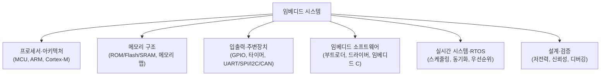

<Callout type="info">
  **이번 문서의 목표:** 이 문서를 다 읽으면 임베디드 시스템이 일반 컴퓨터와 어떻게 다른 문제를 푸는 분야인지 설명하고, 앞으로 반복해서 나올 실시간(real-time)·자원 제약이라는 용어의 뜻을 정확히 말할 수 있으며, MCU와 MPU가 왜 다른 물건인지 감을 잡을 수 있다.
</Callout>

## 왜 "임베디드"라는 이름부터 짚어야 하는가

**임베디드**(embedded)는 영어로 "무언가에 파묻혀 있다, 내장되어 있다"라는 뜻의 단어다. **임베디드 시스템**(embedded system)이란 세탁기, 전자레인지, 자동차 엔진 제어 장치, 스마트워치처럼 **특정 기능을 수행하기 위해 더 큰 기계나 제품 안에 내장된 컴퓨터 시스템**을 말한다. 우리가 흔히 "컴퓨터"라고 부르는 데스크톱이나 노트북은 사용자가 그 자체를 목적으로 산다. 반면 세탁기를 사는 사람은 "빨래를 하고 싶어서" 사는 것이지 "그 안의 컴퓨터를 쓰고 싶어서" 사는 것이 아니다. 이 차이가 임베디드 시스템을 이해하는 첫 출발점이다.

> **쉽게 말하면:** 임베디드 시스템은 스스로가 목적이 아니라, 더 큰 제품의 특정 기능을 위해 숨어서 일하는 컴퓨터다.

이 관점은 왜 중요할까? 범용 컴퓨터(general-purpose computer)를 설계할 때는 "어떤 프로그램이든 잘 돌아가게 하자"가 목표다. 반면 임베디드 시스템은 처음부터 **정해진 몇 가지 일만 하면 된다**는 전제를 깔고 설계된다. 이 전제 하나가 임베디드시스템이라는 과목 전체의 설계 철학을 결정한다 — 자원을 아끼고, 정해진 시간 안에 정확히 반응하고, 오래도록 안정적으로 동작하는 것이 범용 컴퓨터보다 훨씬 중요해진다.

## 임베디드 시스템이 다루는 범위 감각 잡기

이 과목이 21편에 걸쳐 다루는 내용을 미리 지도처럼 펼쳐 보면 다음과 같은 큰 덩어리로 나뉜다.

각 덩어리는 서로 독립적이지 않다. 프로세서(B)를 알아야 그 프로세서가 주변장치(D)와 어떻게 신호를 주고받는지 이해할 수 있고, 메모리 구조(C)를 알아야 프로그램이 실제로 어디에 저장되고 실행되는지(E) 이해할 수 있으며, 이 모든 것 위에서 "정해진 시간 안에 여러 일을 어떻게 처리할 것인가"라는 질문에 답하는 것이 실시간 시스템·RTOS(F)다. 이 지도는 앞으로 03편부터 본론을 읽어 나갈 때, 지금 읽는 편이 전체 그림의 어느 조각인지 헷갈리지 않게 돕는 역할을 한다.

## 자원 제약 — 임베디드 시스템의 첫 번째 열쇳말

**자원 제약**(resource constraint)이란 사용할 수 있는 하드웨어 자원(메모리 용량, 처리 속도, 전력, 비용)이 넉넉하지 않다는 뜻이다. 데스크톱 컴퓨터는 메모리가 부족하면 램을 더 꽂으면 되고, 전기가 부족하면 콘센트에 계속 꽂아 두면 된다. 하지만 심박수를 재는 손목시계나 배터리로 몇 년을 버텨야 하는 가스 검침기는 사정이 다르다.

임베디드 시스템에서 대표적으로 부딪히는 네 가지 제약을 정리하면 다음과 같다.

| 제약 | 뜻 | 임베디드에서 왜 중요한가 |
|------|----|--------------------------|
| 메모리 제약 | 사용 가능한 RAM·저장 공간이 수 킬로바이트(KB)–수 메가바이트(MB) 수준으로 작음 | 운영체제·프로그램을 통째로 최적화해야 하고, 낭비되는 바이트 하나도 아까움 |
| 전력 제약 | 배터리 용량이 한정되거나 전력 공급 자체가 제한됨 | 배터리 수명이 제품 경쟁력을 좌우하므로 저전력 설계가 필수 |
| 비용 제약 | 대량 생산되는 제품일수록 부품 하나의 단가 절감이 전체 수익에 큰 영향을 줌 | 필요 이상으로 비싸고 강력한 프로세서를 쓰지 않음 |
| 크기 제약 | 완제품 안에 들어가야 하므로 물리적 공간이 제한됨 | 회로 기판·부품 크기를 최소화해야 함 |

> **쉽게 말하면:** 자원 제약이란 "돈도, 메모리도, 배터리도, 자리도 넉넉하지 않은 조건에서 컴퓨터를 만들어야 한다"는 뜻이다.

이 네 제약은 서로 트레이드오프(trade-off, 하나를 얻으려면 다른 하나를 포기해야 하는 관계) 관계에 있다. 예를 들어 처리 속도를 높이려고 더 강력한 프로세서를 쓰면 전력 소모와 비용이 함께 늘어난다. 이 트레이드오프를 저울질하는 것이 임베디드 시스템 설계의 핵심 작업이며, 17편(HW/SW 분할과 저전력 설계)에서 구체적인 기법으로 다시 다룬다.

## 실시간성 — 임베디드 시스템의 두 번째 열쇳말

**실시간**(real-time)이라는 말은 일상에서 "지금 당장, 즉시"라는 뜻으로 흔히 쓰이지만, 임베디드 시스템에서는 훨씬 엄밀한 의미를 갖는다. **실시간 시스템**(real-time system)이란 "결과가 논리적으로 맞는 것뿐 아니라, **정해진 시간 안에** 결과가 나와야 정답으로 인정되는 시스템"을 말한다.

이 차이를 자동차 에어백을 예로 들어 보자. 충돌 감지 센서가 신호를 보낸 뒤 에어백이 0.1초 만에 펼쳐진다면 생명을 구하지만, 계산 자체는 정확했더라도 1초 뒤에 펼쳐진다면 이미 늦어 아무 소용이 없다. 즉 "느리게라도 정답을 내놓으면 그럭저럭 괜찮다"는 일반 프로그램의 사고방식이 실시간 시스템에서는 통하지 않는다. **정답의 정확성**과 **정답이 나오는 시각**이 둘 다 만족되어야만 비로소 옳은 결과로 인정된다.

> **쉽게 말하면:** 실시간 시스템에서는 "맞았지만 늦은 답"은 틀린 답과 같은 취급을 받는다.

이 개념은 13편(실시간 시스템의 기본 개념)에서 hard real-time(마감을 반드시 지켜야 하는 경우)과 soft real-time(가끔 마감을 넘겨도 치명적이지 않은 경우)으로 나뉘어 더 깊이 다뤄지고, 14편(RTOS 스케줄링과 우선순위)에서는 이 마감을 지키기 위해 여러 작업의 순서를 어떻게 정할지를 계산으로 다룬다. 지금 단계에서는 "임베디드 시스템은 결과의 정확성뿐 아니라 시간 안에 끝내는 것 자체가 정답의 일부"라는 감각만 확실히 잡아 두면 충분하다.

## MCU와 MPU — 이름은 비슷해도 다른 물건이라는 예고

임베디드 시스템의 두뇌 역할을 하는 칩을 부르는 이름으로 **MCU**와 **MPU**라는 두 약어가 자주 나온다. 이름이 한 글자만 다르고 비슷해 보이지만 실제로는 성격이 다른 물건이다.

- **MCU**(Micro Controller Unit, 마이크로컨트롤러): CPU 코어에 메모리(ROM/Flash, RAM)와 여러 주변장치(GPIO, 타이머, 통신 모듈)를 **한 칩 안에 전부 통합**해 놓은 칩이다. 세탁기·전자레인지·리모컨처럼 정해진 몇 가지 기능만 반복 수행하는 제품에 주로 쓰인다.
- **MPU**(Micro Processor Unit, 마이크로프로세서): CPU 코어 자체에 집중한 칩으로, 메모리나 주변장치는 대부분 외부에 별도로 연결해야 한다. 스마트폰이나 셋톱박스처럼 운영체제(리눅스, 안드로이드 등)를 올려 다양한 프로그램을 돌려야 하는 제품에 주로 쓰인다.

> **쉽게 말하면:** MCU는 "필요한 부품을 한 몸에 다 갖춘 만능 손목시계"에 가깝고, MPU는 "두뇌만 뛰어나고 팔다리는 따로 붙여야 하는 강력한 엔진"에 가깝다.

이 구분은 04편(MPU와 MCU, ARM 아키텍처, Cortex-M 개관)에서 RISC/CISC 개념, ARM 아키텍처 층위와 함께 정면으로 다시 다룬다. 지금은 "MCU는 다 갖춘 통합형, MPU는 코어 중심의 확장형"이라는 대비만 기억해 두면, 04편에서 훨씬 수월하게 이해할 수 있다.

## 이 과목을 읽어 나가는 순서 감각

이 과목은 01~02편(선행) → 03~18편(본론) → 19~21편(기출·유형)의 3단 구조를 갖는다. 02편에서는 앞으로 계속 마주칠 ARM·Cortex-M 공식 문서의 표기법과 레지스터 읽는 법을 먼저 익히고, 03편부터 본격적으로 임베디드 시스템의 개념·제약을 깊게 파고든다. 지금 이 문서에서 "왠지 낯선데 이 정도만 알아도 되나" 싶은 용어(실시간, 자원 제약, MCU, MPU)들은 뒤에서 반복해서 다시 나오고 그때마다 더 깊이 설명되므로, 지금은 완벽히 외우려 하지 말고 전체 그림 속에서 "이런 용어가 있었지" 정도로 눈에 익혀 두는 것으로 충분하다.

## 자주 틀리는 점

- **"임베디드 = 작은 컴퓨터"로만 이해하는 실수**: 크기보다 중요한 것은 "특정 목적을 위해 더 큰 시스템에 내장되어, 정해진 기능만 수행한다"는 목적의 제한성이다. 크기가 크더라도 특정 기능 전용이면 임베디드 시스템으로 분류될 수 있다.
- **실시간을 "빠르다"는 뜻으로 오해하는 실수**: 실시간 시스템의 핵심은 속도 자체가 아니라 "정해진 마감 시각을 지키는가"이다. 아무리 빨라도 마감 계산 없이 설계된 시스템은 실시간 시스템이 아니다.
- **MCU와 MPU를 그냥 "다 CPU 종류"로 뭉뚱그리는 실수**: MCU는 메모리·주변장치까지 통합한 칩이고 MPU는 코어 중심의 칩이라는 통합 범위의 차이가 핵심이며, 이 차이가 04편에서 응용 분야 선택 기준으로 이어진다.

## 핵심 정리

- 임베디드 시스템은 그 자체가 목적이 아니라 더 큰 제품 안에 내장되어 특정 기능만 수행하는 컴퓨터 시스템이다.
- 자원 제약(메모리·전력·비용·크기)은 임베디드 시스템 설계 전체를 관통하는 트레이드오프 관계에 있다.
- 실시간성은 "정답의 정확성"뿐 아니라 "정해진 시간 안에 정답이 나오는가"까지 만족해야 하는 성질이다.
- MCU는 CPU·메모리·주변장치를 한 칩에 통합한 칩, MPU는 CPU 코어 중심의 칩으로, 응용 목적이 다르다.
- 이 과목은 01~02편(선행) → 03~18편(본론) → 19~21편(기출·유형) 순서로 전개되며, 지금 나온 용어들은 뒤에서 계속 반복·심화된다.

## 마무리 복습

<Quiz
  questionNumber={1}
  question="임베디드 시스템의 정의로 가장 적절한 것은?"
  options={['범용 목적으로 다양한 프로그램을 실행하기 위해 만들어진 독립형 컴퓨터', '더 큰 제품이나 시스템 안에 내장되어 특정 기능을 수행하는 컴퓨터 시스템', '반드시 배터리로만 동작하는 소형 전자 기기', '운영체제 없이는 절대 동작할 수 없는 컴퓨터']}
  correctAnswer={2}
  explanation="임베디드 시스템은 그 자체가 사용 목적이 아니라 더 큰 제품에 내장되어 정해진 특정 기능을 수행하는 컴퓨터 시스템을 말한다."
  optionExplanations={['범용 목적으로 다양한 프로그램을 실행하는 것은 데스크톱·서버 같은 범용 컴퓨터의 정의에 가깝다.', '정답. 더 큰 시스템에 내장되어 특정 기능을 수행한다는 점이 임베디드 시스템의 핵심 정의다.', '배터리 동작 여부는 임베디드 시스템의 정의 요건이 아니며, 전원 공급형 임베디드 시스템도 많다.', '임베디드 시스템 중에는 운영체제 없이 동작하는 것도 있고 RTOS를 올려 동작하는 것도 있어, 운영체제 유무가 정의 요건은 아니다.']}
/>

<Quiz
  questionNumber={2}
  question="임베디드 시스템의 자원 제약에 해당하지 않는 것은?"
  options={['메모리 용량 제약', '전력 소모 제약', '비용 제약', '프로그래밍 언어의 문법 복잡도']}
  correctAnswer={4}
  explanation="자원 제약은 메모리·전력·비용·크기처럼 하드웨어적으로 사용 가능한 자원이 한정되어 있다는 뜻이며, 프로그래밍 언어의 문법 복잡도는 이에 해당하지 않는다."
  optionExplanations={['메모리 용량 제약은 임베디드 시스템의 대표적인 자원 제약이다.', '전력 소모 제약은 배터리 수명과 직결되는 대표적인 자원 제약이다.', '비용 제약은 대량 생산 제품에서 특히 중요한 자원 제약이다.', '정답. 문법 복잡도는 소프트웨어 설계상의 특성이지 하드웨어 자원 제약이 아니다.']}
/>

<Quiz
  questionNumber={3}
  question="실시간 시스템에 대한 설명으로 옳은 것은?"
  options={['처리 속도가 매우 빠른 시스템을 통칭하는 말이다', '결과의 정확성뿐 아니라 정해진 시간 안에 결과가 나오는지도 정답 여부를 결정한다', '항상 마감 시각 없이 최대한 빨리 처리하면 되는 시스템이다', '실시간 시스템은 반드시 임베디드 시스템이어야 한다']}
  correctAnswer={2}
  explanation="실시간 시스템은 결과가 논리적으로 맞을 뿐 아니라 정해진 시간(마감) 안에 나와야 정답으로 인정되는 시스템이다."
  optionExplanations={['속도가 빠른 것과 실시간성은 다른 개념으로, 아무리 빨라도 마감 계산 없이 설계되면 실시간 시스템이 아니다.', '정답. 정확성과 시간 제약을 모두 만족해야 정답으로 인정된다는 것이 실시간 시스템의 핵심이다.', '실시간 시스템은 오히려 명확한 마감 시각이 있고, 그 마감을 지키는 것이 핵심이다.', '실시간 시스템은 임베디드 시스템 밖에서도(예: 금융 거래 시스템) 존재할 수 있으므로, 반드시 임베디드여야 하는 것은 아니다.']}
/>

<Quiz
  questionNumber={4}
  question="MCU에 대한 설명으로 옳은 것은?"
  options={['CPU 코어만 포함하고 메모리와 주변장치는 항상 외부에 연결한다', 'CPU 코어, 메모리, 주변장치를 한 칩 안에 통합한 칩이다', '반드시 리눅스 같은 범용 운영체제를 탑재해야 동작한다', '스마트폰의 애플리케이션 프로세서로만 쓰인다']}
  correctAnswer={2}
  explanation="MCU(Micro Controller Unit)는 CPU 코어에 메모리(ROM/Flash, RAM)와 GPIO·타이머 같은 주변장치까지 한 칩에 통합한 칩으로, 세탁기·리모컨처럼 정해진 기능을 수행하는 제품에 주로 쓰인다."
  optionExplanations={['CPU 코어만 포함하고 메모리·주변장치를 외부에 연결하는 쪽은 MPU에 가까운 설명이다.', '정답. MCU는 CPU·메모리·주변장치를 한 칩에 통합한 것이 핵심 특징이다.', 'MCU는 대부분 운영체제 없이 또는 가벼운 RTOS만으로도 동작하며, 범용 운영체제 탑재가 필수는 아니다.', '스마트폰 애플리케이션 프로세서처럼 운영체제를 올려 다양한 프로그램을 돌리는 용도는 MPU에 가깝다.']}
/>

<Quiz
  questionNumber={5}
  question="MPU에 대한 설명으로 옳은 것은?"
  options={['메모리와 주변장치까지 한 칩에 모두 통합한 칩이다', 'CPU 코어 중심의 칩으로, 메모리나 주변장치는 대부분 외부에 별도로 연결한다', '전력 소모가 거의 없어 배터리 없이 반영구적으로 동작한다', '항상 MCU보다 가격이 저렴하다']}
  correctAnswer={2}
  explanation="MPU(Micro Processor Unit)는 CPU 코어 자체에 집중한 칩으로, 메모리·주변장치는 별도로 외부에 연결해야 하며, 운영체제를 올려 다양한 프로그램을 실행하는 제품에 주로 쓰인다."
  optionExplanations={['메모리·주변장치까지 한 칩에 통합하는 것은 MCU의 특징이다.', '정답. MPU는 코어 중심의 칩으로 메모리·주변장치를 외부에 연결해야 한다.', 'MPU는 오히려 성능이 높은 만큼 전력 소모도 큰 편으로, 저전력 목적에는 MCU가 더 적합하다.', 'MPU는 일반적으로 MCU보다 성능이 높은 대신 가격도 더 비싼 경우가 많다.']}
/>

<Quiz
  questionNumber={6}
  question="이 과목의 전체 구성 순서로 옳은 것은?"
  options={['본론 → 선행 → 기출 순으로 배치되어 있다', '선행(01~02편) → 본론(03~18편) → 기출·유형(19~21편) 순으로 배치되어 있다', '기출 문제만으로 전체 과목이 구성되어 있다', '선행과 본론이 번갈아 반복되는 구조다']}
  correctAnswer={2}
  explanation="이 과목은 임베디드 시스템의 범위 감각과 문서 읽는 법을 먼저 잡는 선행 편(01~02), 개념을 본격적으로 다루는 본론 편(03~18), 유형 문제와 기출로 마무리하는 편(19~21) 순서로 구성되어 있다."
  optionExplanations={['본론이 먼저 나오는 순서가 아니라 선행 편이 먼저 나오는 구조다.', '정답. 선행 → 본론 → 기출·유형의 3단 구조가 이 과목의 전체 순서다.', '기출 문제뿐 아니라 선행·본론 편이 먼저 개념을 충분히 설명한다.', '선행과 본론은 번갈아 반복되지 않고, 선행이 끝난 뒤 본론이 이어지는 순차 구조다.']}
/>

## 참고 자료

- [국가평생교육진흥원 독학학위제 - 시험안내(전공분야/과목)](https://bdes.nile.or.kr/nile/exam/nExam2_1.do) — 독학사 3과정 컴퓨터공학 전공 과목에 임베디드시스템이 포함됨을 확인할 수 있는 공식 시험안내 페이지.
- [국가평생교육진흥원 독학학위제 - 응시자격](https://bdes.nile.or.kr/nile/exam/nExam3_1.do) — 1~3과정 응시자격과 과정 체계를 설명하는 공식 안내로, 이 과목이 속한 3과정(전공심화)의 위치를 확인할 수 있다.
