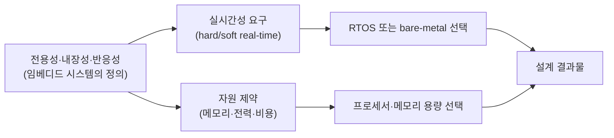

<Callout type="info">
  **이번 문서의 목표:** 이 문서를 다 읽으면 임베디드 시스템을 범용 컴퓨터·GPOS(General-Purpose Operating System, 범용 운영체제) 기반 시스템과 정확히 구분해 설명하고, hard real-time과 soft real-time의 차이를 구체적인 사례로 판단하며, 전력·메모리·비용 제약이 실제 설계 선택에 어떻게 반영되는지 설명할 수 있다.
</Callout>

## 임베디드 시스템의 정의를 시험 수준으로 다시 잡기

01편에서 임베디드 시스템을 "더 큰 제품 안에 내장되어 특정 기능을 수행하는 컴퓨터 시스템"이라고 정의했다. 이 정의를 독학사 시험이 요구하는 수준까지 더 정밀하게 다듬으면 다음 세 가지 조건으로 나눌 수 있다.

1. **전용성**(dedication): 범용 컴퓨터처럼 임의의 프로그램을 설치해 다양한 목적으로 쓰지 않고, 설계 시점에 정해진 한정된 기능만 수행한다.
2. **내장성**(embeddedness): 더 큰 시스템(자동차, 가전제품, 산업 장비)의 일부로 존재하며, 사용자는 그 안에 컴퓨터가 있다는 사실을 의식하지 못하는 경우가 많다.
3. **반응성**(reactivity): 외부 환경(센서 입력, 사용자 조작, 통신 신호)에 실시간으로 반응해 동작을 결정하는 경우가 많다.

> **쉽게 말하면:** 임베디드 시스템은 "정해진 일만, 더 큰 물건 속에 숨어서, 외부 상황에 맞춰 즉각 반응하며" 일하는 컴퓨터다.

이 세 조건을 범용 컴퓨터와 비교하면 다음과 같다.

| 구분 | 범용 컴퓨터(PC·서버) | 임베디드 시스템 |
|------|----------------------|-------------------|
| 목적 | 사용자가 임의의 프로그램을 설치해 다양한 작업 수행 | 설계 시점에 정해진 특정 기능만 수행 |
| 운영체제 | 범용 운영체제(Windows, Linux 등) 탑재가 일반적 | 운영체제 없이(bare-metal, 베어메탈) 동작하거나 RTOS를 탑재 |
| 자원 | 상대적으로 풍부(수 GB 이상 메모리, 강력한 CPU) | 제한적(수 KB–수십 MB 메모리가 흔함) |
| 개발 방식 | 개발 장비와 실행 장비가 동일 | 개발 장비(PC)와 실행 장비(타깃 보드)가 다른 크로스 개발이 일반적 |
| 성공 기준 | 기능이 올바르게 동작하는가 | 기능이 올바르게 "정해진 시간 안에" 동작하는가 |

여기서 **bare-metal**(베어메탈)이라는 표현이 새로 등장하는데, 이는 운영체제 없이 하드웨어 위에서 프로그램이 직접 실행되는 방식을 뜻한다. 아무 운영체제도 깔지 않은 "맨 쇠붙이(bare metal)" 위에서 바로 동작한다는 비유에서 나온 용어다. 임베디드 시스템 중 아주 단순한 것(리모컨, 전자레인지 타이머)은 운영체제 없이 bare-metal로 동작하는 경우가 많고, 여러 작업을 동시에 관리해야 하는 복잡한 시스템은 RTOS(Real-Time Operating System, 실시간 운영체제)를 얹는다. RTOS의 구체적인 동작 원리는 13~16편에서 깊게 다룬다.

## 크로스 개발 — 임베디드만의 독특한 개발 방식

**크로스 개발**(cross development)이란 프로그램을 작성·컴파일하는 컴퓨터(호스트, host)와 그 프로그램이 실제로 실행되는 컴퓨터(타깃, target)가 서로 다른 개발 방식을 말한다. 일반 PC 프로그램을 만들 때는 내가 코드를 짜는 컴퓨터에서 바로 실행해 확인할 수 있지만, MCU에 들어갈 펌웨어(firmware, 하드웨어에 내장되는 소프트웨어)는 개발자의 PC에서 실행할 수 없다. PC와 MCU는 CPU 아키텍처 자체가 다르기 때문이다.

> **쉽게 말하면:** 크로스 개발은 "요리는 서울 주방(호스트 PC)에서 하고, 완성된 요리는 부산 식당(타깃 보드)으로 보내 그곳에서 먹는" 방식이다.

이 때문에 임베디드 개발에는 **크로스 컴파일러**(cross compiler, 호스트에서 실행되지만 타깃 아키텍처용 실행 파일을 만들어내는 컴파일러)가 필요하다. 이 도구들을 묶어 **툴체인**(toolchain, 컴파일러·링커·디버거 등 개발에 필요한 도구 모음)이라고 부르며, 구체적인 툴체인 구성과 부트로더·링커의 역할은 11편(임베디드 소프트웨어 구조와 부트 과정)에서 이어서 다룬다.

## 실시간성 다시 파고들기 — hard real-time과 soft real-time

01편에서 실시간 시스템은 "정답의 정확성뿐 아니라 정해진 시간 안에 결과가 나와야 한다"고 배웠다. 이제 이 마감(deadline)을 지키지 못했을 때의 **결과의 심각성**에 따라 실시간 시스템을 두 가지로 나눠 본다.

- **hard real-time**(경성 실시간): 마감을 단 한 번이라도 놓치면 시스템 전체가 실패로 간주되는 경우다. 예를 들어 자동차 에어백 제어, 항공기 자세 제어 시스템은 마감을 놓치는 순간 인명 피해로 이어질 수 있으므로 절대 허용되지 않는다.
- **soft real-time**(연성 실시간): 마감을 가끔 놓쳐도 시스템 전체가 치명적으로 실패하지는 않고, 결과물의 품질이 다소 떨어지는 정도로 끝나는 경우다. 예를 들어 동영상 스트리밍에서 프레임 하나가 아주 살짝 늦게 그려지면 화면이 살짝 끊기는 정도로 넘어갈 수 있다.

> **쉽게 말하면:** hard real-time은 "한 번이라도 늦으면 끝장"이고, soft real-time은 "가끔 늦어도 봐줄 만한" 실시간성이다.

| 구분 | hard real-time | soft real-time |
|------|-----------------|-----------------|
| 마감을 놓쳤을 때 | 시스템 실패, 치명적 결과(인명·재산 피해 가능) | 품질 저하 정도로 그침, 시스템은 계속 동작 |
| 예시 | 자동차 에어백, 원자로 제어, 의료기기 심박 조율기 | 동영상 스트리밍, 온라인 게임, 음성 통화 |
| 설계 목표 | 최악의 경우(worst-case)에도 마감을 반드시 보장 | 평균적으로 마감을 잘 지키면 충분 |

이 구분은 13편에서 태스크·데드라인·응답 시간·지터(jitter, 반응 시간이 매번 조금씩 들쭉날쭉한 정도) 개념과 함께 더 깊이 다뤄지고, 14편의 RMS(Rate Monotonic Scheduling)·EDF(Earliest Deadline First) 스케줄링 가능성 계산에서 "이 태스크 집합이 마감을 반드시 지킬 수 있는가"를 수식으로 검증하는 데까지 이어진다.

## 자원 제약을 구체적인 수치 감각으로 — 메모리 제약

01편에서 배운 메모리 제약을 조금 더 구체적으로 들여다보자. 데스크톱 PC의 메모리는 보통 8기가바이트(GB) 이상이지만, 저가형 MCU의 메모리는 다음과 같이 훨씬 작다.

| 단위 | 크기 | 저가형 MCU에서 흔한 예 |
|------|------|--------------------------|
| B (바이트) | 8비트 | - |
| KB (킬로바이트) | 1,024 B | RAM 수 KB–수십 KB |
| MB (메가바이트) | 1,024 KB | Flash(프로그램 저장 공간) 수십 KB–수 MB |
| GB (기가바이트) | 1,024 MB | 일반 PC 메모리 수준(임베디드 저가형에는 해당 없음) |

> **쉽게 말하면:** 데스크톱이 방 여러 개짜리 아파트라면, 저가형 MCU는 원룸 한 칸 수준의 메모리로 모든 일을 처리해야 한다.

이 좁은 공간에 운영체제(또는 RTOS)와 애플리케이션 코드, 그리고 실행 중 필요한 데이터(변수, 스택)까지 모두 담아야 한다. 그래서 임베디드 소프트웨어는 처음부터 "메모리를 아끼는 코드"를 짜는 습관이 중요하며, 이는 12편(디바이스 드라이버와 임베디드 C)에서 volatile 키워드, 비트 조작 같은 구체적인 기법으로 이어진다.

## 자원 제약을 구체적인 수치 감각으로 — 전력 제약

전력 제약은 배터리로 동작하는 제품에서 특히 중요하다. 배터리 용량은 보통 **mAh**(밀리암페어시, milliampere-hour)라는 단위로 표기하는데, 이는 "1시간 동안 그 전류를 흘려보낼 수 있는 양"을 뜻한다.

> **쉽게 말하면:** 1,000mAh 배터리는 "1시간 동안 1,000mA(1A)를 공급할 수 있는 양"이거나, 같은 논리로 "10시간 동안 100mA를 공급할 수 있는 양"이다.

예를 들어 배터리 용량이 1,000mAh이고 시스템이 평균 2mA를 소비한다면, 이론상 배터리 수명은 다음과 같이 계산할 수 있다.

$$
\text{수명(시간)} = \frac{1000 \text{mAh}}{2 \text{mA}} = 500 \text{시간}
$$

- $1000$: 배터리 용량(단위 mAh)
- $2$: 평균 소비 전류(단위 mA)
- $500$: 계산된 배터리 수명(단위 시간)

이 계산 하나만 봐도, 시스템의 평균 소비 전류를 절반으로 줄이면 배터리 수명이 두 배로 늘어난다는 것을 알 수 있다. 이 때문에 임베디드 시스템은 평소에는 CPU를 저전력 대기 상태(sleep mode)로 두었다가 꼭 필요한 순간에만 깨어나 동작하는 저전력 설계를 적극적으로 활용한다. 구체적인 저전력 기법(클록 게이팅, 전압 스케일링, 저전력 모드 종류)은 17편(HW/SW 분할과 저전력 설계)에서 다룬다.

## 자원 제약을 구체적인 수치 감각으로 — 비용 제약

비용 제약은 특히 **대량 생산**되는 제품에서 그 영향력이 커진다. 부품 하나의 단가가 단 100원만 낮아져도, 연간 100만 대를 생산하는 제품이라면 전체 원가는 1억 원이 절감된다. 이 때문에 임베디드 시스템 설계자는 "이 기능을 구현하는 데 정말 이만큼 강력한(=비싼) 프로세서가 필요한가"를 항상 저울질한다.

> **쉽게 말하면:** 개발자 한 명이 쓸 프로그램이라면 성능이 남더라도 큰 문제가 아니지만, 100만 대가 팔릴 제품이라면 부품 하나의 몇 백 원 차이가 전체 사업의 수익성을 좌우한다.

이 비용 제약은 04편에서 MCU와 MPU 중 어떤 것을 선택할지, 어떤 Cortex-M 계열(M0, M3, M4 등)을 선택할지 판단하는 실질적인 기준으로 다시 등장한다. 저사양 제품에는 저렴하고 단순한 Cortex-M0 계열을, 신호 처리가 필요한 제품에는 다소 비싸더라도 연산 능력이 뛰어난 Cortex-M4 계열을 선택하는 식이다.

## 이 개념들이 서로 얽히는 방식

지금까지 다룬 개념들은 독립적으로 존재하지 않고 서로 영향을 주고받는다. 이 관계를 정리하면 다음과 같다.

즉 "이 제품이 무엇을 위한 임베디드 시스템인가"(A)가 정해지면, 그로부터 "얼마나 엄격한 실시간성이 필요한가"(B)와 "얼마나 자원을 아껴야 하는가"(D)가 함께 결정되고, 이 두 축이 만나 최종적으로 어떤 프로세서·소프트웨어 구조를 쓸 것인가(F)가 정해진다. 이 흐름은 04편부터 이어지는 프로세서·메모리·RTOS 편들을 읽을 때 "지금 배우는 이 선택이 왜 필요한가"를 이해하는 배경이 된다.

## 자주 틀리는 점

- **임베디드 시스템은 항상 운영체제가 없다고 오해하는 실수**: 단순한 시스템은 bare-metal로 동작하지만, 복잡한 임베디드 시스템은 RTOS를 탑재하는 경우도 많다. "운영체제 없음"이 임베디드 시스템의 필수 조건은 아니다.
- **hard real-time을 soft real-time보다 무조건 "더 빠른" 시스템으로 오해하는 실수**: 속도의 차이가 아니라 "마감을 놓쳤을 때의 결과가 얼마나 치명적인가"의 차이다. hard real-time 시스템이 오히려 여유 있게 설계된 느린 시스템일 수도 있다.
- **비용 제약을 "무조건 저렴한 부품을 쓴다"로 단순화하는 실수**: 실제로는 필요한 성능·기능 대비 가장 효율적인 부품을 선택하는 것이며, 지나치게 저렴한 부품을 써서 기능을 만족하지 못하면 오히려 재설계 비용이 커진다.

## 핵심 정리

- 임베디드 시스템은 전용성·내장성·반응성이라는 세 조건으로 범용 컴퓨터와 구분되며, bare-metal 또는 RTOS 위에서 동작한다.
- 크로스 개발은 호스트(개발 PC)와 타깃(실행 보드)이 다른 임베디드 특유의 개발 방식으로, 크로스 컴파일러와 툴체인이 필요하다.
- hard real-time은 마감을 놓치면 치명적 실패로 이어지는 시스템, soft real-time은 마감을 가끔 놓쳐도 품질 저하 정도로 그치는 시스템이다.
- 메모리·전력·비용 제약은 각각 구체적인 단위(KB/MB, mAh, 단가)로 계산할 수 있으며, 서로 트레이드오프 관계에 있다.
- 임베디드 시스템의 정의(전용성·내장성·반응성)로부터 실시간성 요구와 자원 제약이 함께 도출되고, 이 두 축이 프로세서·소프트웨어 구조 선택을 결정한다.

## 마무리 복습

<Quiz
  questionNumber={1}
  question="임베디드 시스템을 범용 컴퓨터와 구분 짓는 조건으로 옳지 않은 것은?"
  options={['전용성 — 설계 시점에 정해진 한정된 기능만 수행한다', '내장성 — 더 큰 시스템의 일부로 존재한다', '반응성 — 외부 환경에 실시간으로 반응해 동작을 결정한다', '고성능성 — 반드시 범용 컴퓨터보다 높은 연산 성능을 가져야 한다']}
  correctAnswer={4}
  explanation="임베디드 시스템을 구분 짓는 조건은 전용성, 내장성, 반응성이며, 연산 성능이 범용 컴퓨터보다 높아야 한다는 것은 조건에 포함되지 않는다. 오히려 임베디드 시스템은 대체로 자원 제약 때문에 성능이 낮은 경우가 많다."
  optionExplanations={['전용성은 임베디드 시스템의 정의 조건 중 하나다.', '내장성은 임베디드 시스템의 정의 조건 중 하나다.', '반응성은 임베디드 시스템의 정의 조건 중 하나다.', '정답. 고성능성은 정의 조건이 아니며, 오히려 자원 제약으로 인해 성능이 제한되는 경우가 많다.']}
/>

<Quiz
  questionNumber={2}
  question="크로스 개발(cross development)에 대한 설명으로 옳은 것은?"
  options={['프로그램을 개발하는 컴퓨터와 실행하는 컴퓨터가 동일한 개발 방식이다', '프로그램을 개발하는 호스트와 실제로 실행되는 타깃이 서로 다른 개발 방식이다', 'RTOS 없이 개발하는 방식만을 가리키는 용어다', '두 개 이상의 프로그래밍 언어를 함께 사용하는 개발 방식이다']}
  correctAnswer={2}
  explanation="크로스 개발은 프로그램을 작성·컴파일하는 호스트(개발 PC)와 그 프로그램이 실제로 실행되는 타깃(MCU 보드)이 서로 다른 개발 방식으로, 임베디드 개발에서 일반적으로 쓰인다."
  optionExplanations={['호스트와 타깃이 동일한 것은 일반적인 PC 프로그램 개발 방식이지 크로스 개발이 아니다.', '정답. 호스트와 타깃이 다르다는 것이 크로스 개발의 핵심 정의다.', 'RTOS 사용 여부와 크로스 개발은 직접적인 관련이 없는 별개의 개념이다.', '언어의 개수와는 무관하며, 크로스 개발은 호스트와 타깃 컴퓨터가 다르다는 개발 환경의 특성을 가리킨다.']}
/>

<Quiz
  questionNumber={3}
  question="hard real-time 시스템에 대한 설명으로 옳은 것은?"
  options={['마감을 가끔 놓쳐도 품질이 조금 떨어지는 정도로 넘어갈 수 있는 시스템이다', '마감을 단 한 번이라도 놓치면 시스템 전체가 실패로 간주되는 시스템이다', '실시간성이 전혀 요구되지 않는 시스템이다', '항상 soft real-time 시스템보다 처리 속도가 빠른 시스템이다']}
  correctAnswer={2}
  explanation="hard real-time 시스템은 마감을 단 한 번이라도 놓치면 시스템 전체가 실패로 간주될 만큼 치명적인 결과로 이어지는 실시간 시스템이다."
  optionExplanations={['마감을 가끔 놓쳐도 품질 저하 정도로 그치는 것은 soft real-time 시스템에 대한 설명이다.', '정답. 마감을 반드시 지켜야 하고 놓치면 치명적 실패로 이어지는 것이 hard real-time의 핵심이다.', 'hard real-time도 명확한 실시간성(마감 준수)이 요구되는 시스템이다.', 'hard와 soft의 구분은 처리 속도가 아니라 마감을 놓쳤을 때의 결과의 심각성에 따른 구분이다.']}
/>

<Quiz
  questionNumber={4}
  question="배터리 용량 2,000mAh, 평균 소비 전류 4mA인 시스템의 이론적인 배터리 수명은?"
  options={['200시간', '400시간', '500시간', '2,000시간']}
  correctAnswer={2}
  explanation="배터리 수명은 배터리 용량을 평균 소비 전류로 나눠 계산한다. 2,000mAh를 4mA로 나누면 500시간이 나온다."
  optionExplanations={['200시간은 배터리 용량을 10mA로 나눈 값에 해당해, 조건의 전류값과 맞지 않는다.', '정답. 2,000mAh ÷ 4mA = 500시간이 올바른 계산 결과다.', '2,000을 4로 나누면 500이 되므로, 이 계산은 나눗셈 결과가 잘못되었다.', '2,000시간은 소비 전류를 1mA로 잘못 나눈 경우에 해당하는 값이다.']}
/>

<Quiz
  questionNumber={5}
  question="임베디드 시스템에서 비용 제약이 중요한 이유로 가장 적절한 것은?"
  options={['임베디드 시스템은 항상 무료로 배포되기 때문이다', '대량 생산되는 제품일수록 부품 하나의 단가 절감이 전체 원가에 큰 영향을 주기 때문이다', '비용 제약은 소프트웨어 개발 비용과는 전혀 무관하기 때문이다', '비용이 낮을수록 실시간성이 항상 향상되기 때문이다']}
  correctAnswer={2}
  explanation="임베디드 시스템은 대량 생산되는 경우가 많아, 부품 하나의 단가가 조금만 낮아져도 전체 생산 원가에서 큰 절감 효과를 내기 때문에 비용 제약이 특히 중요하게 다뤄진다."
  optionExplanations={['임베디드 시스템 제품 자체는 판매되어 수익을 창출하는 경우가 대부분이며, 항상 무료로 배포되는 것은 아니다.', '정답. 대량 생산 규모에서 단가 절감의 영향이 커지는 것이 비용 제약이 중요한 핵심 이유다.', '소프트웨어 개발·유지보수 비용도 전체 비용에 포함되므로 무관하다고 볼 수 없다.', '비용을 낮추는 것과 실시간성 향상은 직접적인 인과관계가 없으며, 오히려 저비용 설계가 실시간성 확보를 어렵게 만들 수도 있다.']}
/>

<Quiz
  questionNumber={6}
  question="bare-metal 방식에 대한 설명으로 옳은 것은?"
  options={['운영체제 없이 하드웨어 위에서 프로그램이 직접 실행되는 방식이다', 'RTOS를 여러 개 동시에 탑재하는 방식이다', '반드시 클라우드 서버와 연결되어야만 동작하는 방식이다', '크로스 컴파일러 없이도 실행 파일을 만들 수 있는 방식이다']}
  correctAnswer={1}
  explanation="bare-metal은 운영체제 없이 하드웨어 위에서 프로그램이 직접 실행되는 방식으로, 리모컨이나 단순 타이머처럼 정해진 몇 가지 기능만 수행하는 단순한 임베디드 시스템에서 흔히 쓰인다."
  optionExplanations={['정답. 운영체제 없이 하드웨어 위에서 직접 실행되는 것이 bare-metal의 핵심 정의다.', 'RTOS를 여러 개 탑재하는 것은 bare-metal과 반대되는 개념으로, bare-metal은 운영체제 자체가 없는 방식이다.', 'bare-metal 여부와 클라우드 연결 여부는 서로 관련이 없는 별개의 특성이다.', '크로스 컴파일러는 bare-metal 여부와 무관하게 타깃 아키텍처가 다르면 필요한 도구다.']}
/>

<Quiz
  questionNumber={7}
  question="soft real-time 시스템의 예시로 가장 적절한 것은?"
  options={['자동차 에어백 제어 시스템', '원자로 긴급 정지 시스템', '동영상 스트리밍 재생 시스템', '의료기기 심박 조율기']}
  correctAnswer={3}
  explanation="동영상 스트리밍은 프레임이 아주 살짝 늦게 그려져도 화면이 조금 끊기는 정도로 넘어갈 수 있어, 마감을 가끔 놓쳐도 치명적이지 않은 soft real-time의 대표적인 예시다."
  optionExplanations={['자동차 에어백은 마감을 놓치면 인명 피해로 이어질 수 있는 hard real-time 시스템의 예시다.', '원자로 긴급 정지 시스템은 마감을 놓치면 치명적 사고로 이어질 수 있는 hard real-time 시스템의 예시다.', '정답. 동영상 스트리밍은 마감을 가끔 놓쳐도 품질 저하 정도로 그치는 soft real-time 시스템의 대표적인 예시다.', '심박 조율기는 마감을 놓치면 생명에 직결될 수 있는 hard real-time 시스템의 예시다.']}
/>

## 참고 자료

- [국가평생교육진흥원 독학학위제 - 시험안내(전공분야/과목)](https://bdes.nile.or.kr/nile/exam/nExam2_1.do) — 독학사 3과정 컴퓨터공학 전공 과목에 임베디드시스템이 포함됨을 확인하는 공식 시험안내 페이지.
- [Arm Cortex-M resources](https://developer.arm.com/community/arm-community-blogs/b/architectures-and-processors-blog/posts/cortex-m-resources) — 임베디드 시스템에서 널리 쓰이는 Cortex-M 계열의 공식 문서 진입점으로, 크로스 개발·툴체인 관련 자료로 이어진다.
