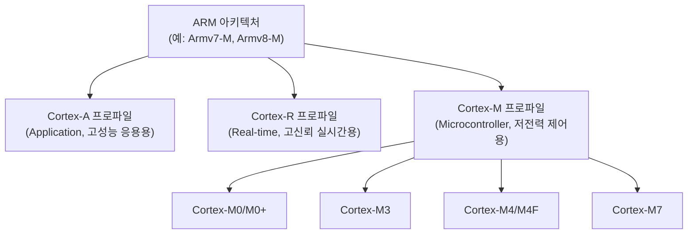
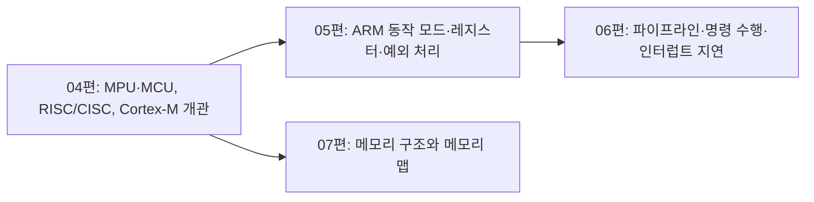

<Callout type="info">
  **이번 문서의 목표:** 이 문서를 다 읽으면 MCU와 MPU를 응용 사례 기준으로 구분하고, RISC와 CISC의 설계 철학 차이를 명령어 수 비교로 설명하며, ARM 아키텍처의 층위(아키텍처-프로파일-코어)와 Cortex-M 계열의 특징을 표로 정리해 설명할 수 있다.
</Callout>

## MCU와 MPU, 다시 한 번 깊게 — 왜 구분이 필요한가

01편에서 MCU(Micro Controller Unit)와 MPU(Micro Processor Unit)를 "통합형과 코어 중심형"으로 예고했다. 03편에서 배운 자원 제약(메모리·전력·비용)의 관점에서 다시 보면, 이 둘의 차이는 단순한 이름 차이가 아니라 **자원 제약에 대응하는 서로 다른 설계 전략**이라는 것을 알 수 있다.

> **쉽게 말하면:** MCU는 "적당한 성능으로 저렴하고 단순하게" 전략을, MPU는 "높은 성능을 위해 복잡해지는 것을 감수하는" 전략을 택한 칩이다.

| 구분 | MCU | MPU |
|------|-----|-----|
| 통합 범위 | CPU 코어 + 메모리(ROM/Flash, RAM) + 주변장치(GPIO, 타이머 등)를 한 칩에 통합 | CPU 코어 중심, 메모리·주변장치는 대부분 외부 칩으로 연결 |
| 대표 운영 방식 | bare-metal 또는 경량 RTOS | 리눅스·안드로이드 같은 범용 운영체제(GPOS) |
| 대표 응용 | 세탁기, 리모컨, 자동차 센서 모듈, 웨어러블 일부 기능 | 스마트폰, 셋톱박스, 네트워크 라우터, 산업용 게이트웨이 |
| 부팅 시간 | 매우 짧음(전원을 켜면 거의 즉시 동작) | 운영체제 부팅 과정이 있어 상대적으로 김 |
| 개발 복잡도 | 상대적으로 단순(운영체제 이식 부담이 적음) | 운영체제 이식·드라이버 개발 등 상대적으로 복잡 |

이 표에서 특히 눈여겨볼 점은 **부팅 시간**이다. 전자레인지의 버튼을 눌렀는데 "운영체제 부팅 중입니다"라는 화면이 뜬다면 아무도 그 제품을 사지 않을 것이다. MCU 기반 제품은 전원이 들어오는 즉시 정해진 동작을 시작해야 하므로, 무거운 범용 운영체제를 올리지 않는 쪽을 택하는 경우가 많다. 반대로 스마트폰처럼 사용자가 매번 다른 앱을 실행해야 하는 제품은 그 유연성을 위해 부팅 시간이 다소 걸리더라도 MPU와 GPOS 조합을 택한다. 이 과목은 시험 범위상 MCU 쪽에 집중하며, 05편부터 다루는 레지스터·예외 처리·주변장치는 모두 MCU 환경을 전제로 한다.

## RISC와 CISC — 명령어 집합 설계 철학의 두 갈래

ARM 아키텍처를 이해하려면 먼저 **RISC**와 **CISC**라는 두 가지 명령어 집합 설계 철학을 구분해야 한다.

- **CISC**(Complex Instruction Set Computer, 복잡 명령어 집합 컴퓨터): 하나의 명령어가 여러 단계의 동작을 한 번에 처리하도록 설계된 방식이다. 명령어 종류가 많고 각 명령어가 복잡한 대신, 프로그램을 짧게 작성할 수 있다.
- **RISC**(Reduced Instruction Set Computer, 축소 명령어 집합 컴퓨터): 하나의 명령어가 아주 단순한 동작 하나만 수행하도록 설계된 방식이다. 명령어 종류는 적고 단순하지만, 복잡한 작업을 하려면 이 단순한 명령어를 여러 번 조합해야 한다.

> **쉽게 말하면:** CISC는 "한 문장에 여러 지시를 담은 복잡한 레시피"이고, RISC는 "한 문장에 지시 하나만 담되 그 문장을 여러 번 반복해서 같은 결과를 내는 단순한 레시피"다.

이 차이를 "메모리의 특정 위치에서 값을 읽어와 다른 값과 더한다"는 작업으로 비교해 보면 다음과 같다.

```text
[CISC 스타일 — 한 명령어가 메모리 접근과 덧셈을 동시에 처리]
ADD  R0, [주소]          ; 메모리 [주소]의 값을 읽어와 R0에 바로 더한다

[RISC 스타일 — 메모리 접근과 연산을 명령어로 분리]
LOAD R1, [주소]          ; 먼저 메모리 [주소]의 값을 R1로 읽어온다
ADD  R0, R0, R1          ; 그 다음 R0와 R1을 더해 R0에 저장한다
```

CISC 스타일은 명령어 한 줄로 끝나지만 그 한 줄이 내부적으로 여러 단계를 처리해야 하므로 회로가 복잡해지고, 명령어마다 실행에 걸리는 시간이 들쭉날쭉해진다. RISC 스타일은 명령어가 두 줄로 늘어나지만, 각 명령어가 "메모리 접근" 또는 "연산" 중 하나만 담당하므로 회로가 단순해지고, 명령어마다 실행 시간이 비교적 일정해 06편에서 다룰 파이프라인(pipeline, 명령어를 여러 단계로 겹쳐 처리해 처리량을 늘리는 기법) 설계에 유리해진다.

| 구분 | CISC | RISC |
|------|------|------|
| 명령어 종류 | 많고 복잡함 | 적고 단순함 |
| 명령어당 실행 시간 | 명령어마다 차이가 큼 | 대체로 일정함 |
| 메모리 접근 방식 | 연산 명령어 안에서 메모리 접근을 함께 처리 가능 | 메모리 접근 전용 명령어(load/store)로 분리 |
| 회로 복잡도 | 높음 | 낮음(전력·비용 절감에 유리) |
| 대표 사례 | x86(인텔·AMD 계열 PC용 프로세서) | ARM, RISC-V |

ARM은 RISC 철학을 따르는 아키텍처다. 회로가 단순해 전력 소모와 제조 비용이 낮다는 점은 03편에서 배운 임베디드 시스템의 전력·비용 제약과 정확히 맞아떨어지며, 이것이 ARM이 임베디드·모바일 분야에서 널리 쓰이는 핵심 이유 중 하나다.

## ARM 아키텍처의 층위 — 아키텍처, 프로파일, 코어

"ARM"이라는 이름 아래에는 여러 층위의 개념이 겹쳐 있어, 이를 구분하지 못하면 문서를 읽을 때 혼란스러워진다. 아래 관계도로 정리한다.



- **아키텍처**(architecture, 예: Armv7-M): 명령어 집합과 프로그래머 모델(레지스터 구성, 동작 모드)을 정의하는 가장 큰 층위의 규격이다. 02편에서 배운 Programmer's Model이 이 층위에 해당한다.
- **프로파일**(profile): 같은 아키텍처 규격 안에서 응용 목적에 따라 나뉘는 갈래다. **Cortex-A**(Application, 애플리케이션)는 스마트폰·태블릿처럼 범용 운영체제를 올리는 고성능 응용에, **Cortex-R**(Real-time, 실시간)은 자동차 제어 장치처럼 높은 신뢰성의 실시간 처리에, **Cortex-M**(Microcontroller, 마이크로컨트롤러)은 저전력·저비용의 임베디드 제어에 최적화되어 있다.
- **코어**(core): 같은 프로파일 안에서도 성능·기능 수준에 따라 나뉘는 구체적인 제품군이다. Cortex-M0, M3, M4처럼 실제로 칩에 탑재되는 이름이 여기에 해당한다.

> **쉽게 말하면:** 아키텍처는 "설계 규격", 프로파일은 "용도별 갈래(응용용·실시간용·제어용)", 코어는 "실제로 팔리는 구체적인 제품 모델"이다.

이 과목의 목차에서 계속 "Cortex-M"이라는 이름이 나오는 이유는, 독학사 3단계 임베디드시스템이 저전력·저비용 MCU 환경을 전제로 하기 때문이다. 즉 위 관계도에서 우리는 앞으로 B3(Cortex-M 프로파일) 아래의 세부 코어들을 집중적으로 다루게 된다.

## Cortex-M 계열 비교 — 어떤 코어를 언제 쓰는가

Cortex-M 프로파일 안에서도 여러 코어가 성능·기능 수준별로 나뉘어 있다. 대표적인 네 가지를 비교하면 다음과 같다.

| 코어 | 상대적 성능 | 특징 | 대표 응용 |
|------|--------------|------|-----------|
| Cortex-M0/M0+ | 가장 낮음 | 명령어 집합이 가장 단순하고, 전력 소모와 비용이 가장 낮음 | 단순 센서, 저가형 리모컨, 배터리 수명이 최우선인 웨어러블 일부 |
| Cortex-M3 | 중간 | M0보다 명령어 집합이 확장되고 성능이 높음, 나눗셈 연산 지원 | 일반적인 산업용 제어기, 중간 복잡도의 통신 모듈 |
| Cortex-M4/M4F | 중간–높음 | M3에 더해 DSP(Digital Signal Processing, 디지털 신호 처리) 명령어 지원, M4F는 부동소수점 연산 하드웨어(FPU) 내장 | 모터 제어, 오디오 처리, 센서 신호 처리가 필요한 시스템 |
| Cortex-M7 | 가장 높음 | 파이프라인 단계가 더 많고 캐시를 지원해 고성능 연산에 유리 | 고성능 산업 제어, 복잡한 신호 처리, 그래픽 일부 |

> **쉽게 말하면:** M0는 "가볍고 저렴한 경차", M3는 "무난한 준중형차", M4는 "신호 처리에 강한 스포츠카", M7은 "고성능 세단"에 비유할 수 있다.

이 선택은 03편에서 배운 비용·전력 제약과 정확히 연결된다. 예를 들어 단순히 버튼 입력을 받아 LED를 켜는 정도의 저가형 리모컨에 Cortex-M7을 쓴다면 불필요하게 비싸고 전력도 많이 소모하는 과잉 설계가 된다. 반대로 실시간으로 모터 회전 속도를 계산해 제어해야 하는 시스템에 Cortex-M0를 쓴다면 연산 능력이 부족해 마감을 지키지 못할 수 있다. 즉 "이 제품에 필요한 최소한의 성능이 무엇인가"를 먼저 따진 뒤 그에 맞는 코어를 고르는 것이 실제 설계 과정이다.

## 이 편의 개념이 다음 편으로 이어지는 흐름

이번 편에서 다룬 MCU/MPU 구분, RISC/CISC 철학, ARM 아키텍처 층위는 앞으로 나올 본론의 뼈대가 된다.



05편에서는 지금 이름만 언급한 Cortex-M의 동작 모드와 레지스터 집합을 구체적으로 파고들고, 06편에서는 RISC 설계가 왜 파이프라인에 유리한지를 실제 명령 수행 흐름으로 검증하며, 07편에서는 MCU가 메모리를 어떻게 배치하는지(메모리 맵)를 다룬다.

## 자주 틀리는 점

- **RISC가 CISC보다 "무조건 더 좋다"고 오해하는 실수**: RISC와 CISC는 우열의 문제가 아니라 설계 철학의 차이다. 프로그램 코드 길이는 RISC가 더 길어질 수 있지만, 회로가 단순해 전력·비용·파이프라인 설계에 유리하다는 트레이드오프 관계다.
- **Cortex-A, Cortex-R, Cortex-M을 성능 순서로만 줄 세우는 실수**: 세 프로파일은 성능 순위가 아니라 **목적**(응용 처리용, 고신뢰 실시간용, 저전력 제어용)이 다른 갈래다. Cortex-R이 Cortex-A보다 반드시 성능이 낮은 것은 아니며, 신뢰성·실시간성에 특화되어 있다는 차이가 핵심이다.
- **아키텍처와 코어를 같은 개념으로 혼동하는 실수**: 아키텍처(예: Armv7-M)는 명령어 집합 규격이고, 코어(예: Cortex-M4)는 그 규격을 구현한 구체적인 제품이다. 여러 코어가 같은 아키텍처를 공유할 수 있다.

## 핵심 정리

- MCU는 CPU·메모리·주변장치를 한 칩에 통합해 bare-metal 또는 경량 RTOS로 즉시 부팅되는 반면, MPU는 코어 중심이며 GPOS를 올려 유연성을 확보한다.
- CISC는 복잡한 명령어로 프로그램을 짧게, RISC는 단순한 명령어를 여러 번 조합해 회로를 단순하게 만드는 설계 철학이며, ARM은 RISC 철학을 따른다.
- ARM은 아키텍처(명령어 집합 규격) → 프로파일(Cortex-A/R/M, 목적별 갈래) → 코어(구체적 제품)의 3층 구조로 이해할 수 있다.
- Cortex-M 계열은 M0/M0+(저전력·저비용) → M3(중간 성능) → M4/M4F(DSP·부동소수점) → M7(고성능) 순으로 성능·기능이 확장되며, 제품 요구사항에 맞춰 선택한다.
- 이번 편의 구분(MCU/MPU, RISC/CISC, 아키텍처 층위)은 05~07편의 레지스터·파이프라인·메모리 맵 논의의 전제가 된다.

## 마무리 복습

<Quiz
  questionNumber={1}
  question="MCU와 MPU의 차이에 대한 설명으로 옳은 것은?"
  options={['MCU는 CPU 코어만 포함하고 MPU는 메모리·주변장치까지 통합한다', 'MCU는 CPU·메모리·주변장치를 한 칩에 통합하고, MPU는 코어 중심이며 메모리·주변장치를 대부분 외부에 연결한다', 'MCU와 MPU는 이름만 다를 뿐 완전히 같은 구조를 가진 칩이다', 'MPU는 항상 MCU보다 부팅 시간이 짧다']}
  correctAnswer={2}
  explanation="MCU는 CPU 코어에 메모리와 주변장치까지 한 칩에 통합한 칩이고, MPU는 코어 중심의 칩으로 메모리·주변장치를 대부분 외부에 연결해야 한다."
  optionExplanations={['MCU와 MPU의 통합 범위 설명이 서로 뒤바뀌었다.', '정답. 통합 범위(MCU는 전부 통합, MPU는 코어 중심)의 차이를 정확히 설명한다.', 'MCU와 MPU는 통합 범위, 운영 방식, 응용 분야가 서로 다른 별개의 설계 전략을 가진 칩이다.', 'MPU는 범용 운영체제 부팅 과정이 있어 상대적으로 부팅 시간이 길고, MCU가 즉시 동작하는 경우가 많다.']}
/>

<Quiz
  questionNumber={2}
  question="RISC(Reduced Instruction Set Computer)의 특징으로 옳은 것은?"
  options={['하나의 명령어가 여러 단계의 복잡한 동작을 한 번에 처리한다', '명령어 종류가 적고 단순해 회로가 단순해지고 파이프라인 설계에 유리하다', '메모리 접근과 연산을 항상 하나의 명령어로 합쳐 처리한다', 'x86이 대표적인 RISC 아키텍처다']}
  correctAnswer={2}
  explanation="RISC는 명령어 종류를 적고 단순하게 유지해 회로 복잡도를 낮추고, 명령어당 실행 시간을 일정하게 만들어 파이프라인 설계에 유리하게 하는 설계 철학이다."
  optionExplanations={['하나의 명령어가 여러 단계를 한 번에 처리하는 것은 CISC의 특징이다.', '정답. 명령어를 단순화해 회로 단순화와 파이프라인 설계 유리함을 얻는 것이 RISC의 핵심이다.', 'RISC는 오히려 메모리 접근(load/store)과 연산을 별도 명령어로 분리하는 것이 특징이다.', 'x86은 CISC 계열의 대표적인 아키텍처이며, ARM과 RISC-V가 RISC 계열의 대표적인 아키텍처다.']}
/>

<Quiz
  questionNumber={3}
  question="ARM 아키텍처, 프로파일, 코어의 관계에 대한 설명으로 옳은 것은?"
  options={['코어가 가장 큰 층위이고 그 아래에 프로파일과 아키텍처가 속한다', '아키텍처(명령어 집합 규격)가 가장 큰 층위이고, 그 아래에 목적별 프로파일, 그 아래에 구체적인 코어 제품이 있다', '아키텍처와 코어는 완전히 같은 개념이며 이름만 다르다', 'Cortex-A, Cortex-R, Cortex-M은 같은 프로파일 안의 서로 다른 코어 이름이다']}
  correctAnswer={2}
  explanation="ARM은 아키텍처(명령어 집합 규격)가 가장 큰 층위이고, 그 아래에 응용 목적별 프로파일(Cortex-A/R/M)이 있으며, 각 프로파일 아래에 Cortex-M0, M3, M4 같은 구체적인 코어 제품이 있는 3층 구조다."
  optionExplanations={['층위의 순서가 뒤바뀐 설명으로, 실제로는 아키텍처가 가장 큰 층위다.', '정답. 아키텍처 → 프로파일 → 코어 순서의 3층 구조를 정확히 설명한다.', '아키텍처는 명령어 집합 규격이고 코어는 그 규격을 구현한 구체적 제품으로, 서로 다른 층위의 개념이다.', 'Cortex-A, Cortex-R, Cortex-M은 프로파일 이름이며, 그 아래에 Cortex-M0, M3, M4 같은 코어 제품이 있다.']}
/>

<Quiz
  questionNumber={4}
  question="Cortex-M 프로파일의 특징으로 옳은 것은?"
  options={['스마트폰·태블릿의 고성능 애플리케이션 처리에 최적화되어 있다', '자동차 제어처럼 높은 신뢰성의 실시간 처리에 최적화되어 있다', '저전력·저비용의 임베디드 제어에 최적화되어 있다', '반드시 리눅스 같은 범용 운영체제와 함께 사용해야 한다']}
  correctAnswer={3}
  explanation="Cortex-M(Microcontroller) 프로파일은 저전력·저비용의 임베디드 제어에 최적화된 프로파일로, 이 과목이 다루는 MCU 환경의 핵심 대상이다."
  optionExplanations={['고성능 애플리케이션 처리에 최적화된 것은 Cortex-A 프로파일이다.', '높은 신뢰성의 실시간 처리에 최적화된 것은 Cortex-R 프로파일이다.', '정답. 저전력·저비용의 임베디드 제어에 최적화된 것이 Cortex-M의 핵심 특징이다.', 'Cortex-M은 오히려 bare-metal 또는 경량 RTOS와 함께 쓰이는 경우가 많고, 범용 운영체제 사용이 필수는 아니다.']}
/>

<Quiz
  questionNumber={5}
  question="Cortex-M4F에 대한 설명으로 옳은 것은?"
  options={['Cortex-M0보다 명령어 집합이 더 단순하다', 'DSP 명령어와 부동소수점 연산 하드웨어(FPU)를 지원해 신호 처리에 유리하다', 'Cortex-A 프로파일에 속하는 코어다', '전력 소모가 Cortex-M0보다 항상 적다']}
  correctAnswer={2}
  explanation="Cortex-M4F는 Cortex-M3보다 확장된 명령어 집합에 더해 DSP 명령어와 부동소수점 연산 하드웨어(FPU)를 내장해, 모터 제어나 오디오·센서 신호 처리처럼 연산이 많은 응용에 유리하다."
  optionExplanations={['Cortex-M4F는 Cortex-M0보다 명령어 집합이 더 확장되고 복잡한 코어다.', '정답. DSP 명령어와 FPU 지원이 Cortex-M4F의 핵심 특징이다.', 'Cortex-M4F는 Cortex-M 프로파일에 속하는 코어이며 Cortex-A 프로파일이 아니다.', '연산 능력이 높아진 만큼 일반적으로 Cortex-M0보다 전력 소모가 더 크다.']}
/>

<Quiz
  questionNumber={6}
  question="어떤 임베디드 제품이 실시간으로 모터 회전 속도를 계산해 정밀하게 제어해야 한다면, 이 요구사항에 비추어 가장 적절한 코어 선택 근거는?"
  options={['비용을 최소화하기 위해 무조건 가장 저렴한 Cortex-M0를 선택해야 한다', '연산량과 신호 처리 요구를 고려해 DSP·FPU를 지원하는 Cortex-M4 계열을 고려하는 것이 합리적이다', '코어 선택은 성능과 무관하므로 아무 코어나 선택해도 결과가 동일하다', '반드시 Cortex-A 프로파일의 코어를 선택해야 한다']}
  correctAnswer={2}
  explanation="모터 제어처럼 실시간 신호 처리 연산이 필요한 경우, 단순 제어용인 Cortex-M0로는 연산 능력이 부족할 수 있어 DSP 명령어와 FPU를 지원하는 Cortex-M4 계열을 고려하는 것이 03편의 자원 제약 저울질 원칙에 부합한다."
  optionExplanations={['무조건 가장 저렴한 코어를 선택하면 연산 능력 부족으로 실시간 마감을 지키지 못할 위험이 있다.', '정답. 요구되는 연산 능력에 맞춰 DSP·FPU를 지원하는 코어를 선택하는 것이 합리적인 저울질이다.', '코어의 연산 능력·기능 차이는 실제 처리 가능한 작업의 범위와 성능에 직접 영향을 준다.', 'Cortex-A는 범용 운영체제 기반의 고성능 응용에 적합한 프로파일로, 저전력 실시간 제어 목적에는 Cortex-M 계열이 더 적합하다.']}
/>

## 참고 자료

- [Arm Cortex-M product page](https://www.arm.com/products/silicon-ip-cpu/cortex-m/cortex-m0) — Cortex-M 계열의 제품군과 핵심 문서, MCU용 프로세서로서의 포지션을 확인하는 공식 페이지.
- [ARM MCU Resources - Documentation](https://community.arm.com/arm-community-blogs/b/architectures-and-processors-blog/posts/arm-mcu-resources---documentation) — Cortex-M0/M3/M4 문서, 명령어 타이밍, 아키텍처 참조 매뉴얼로 이어지는 공식 자료 모음.
