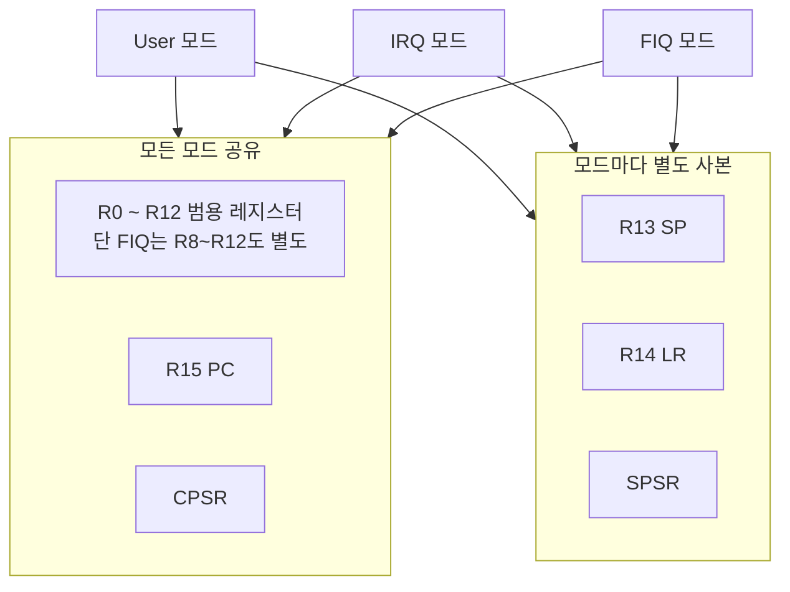
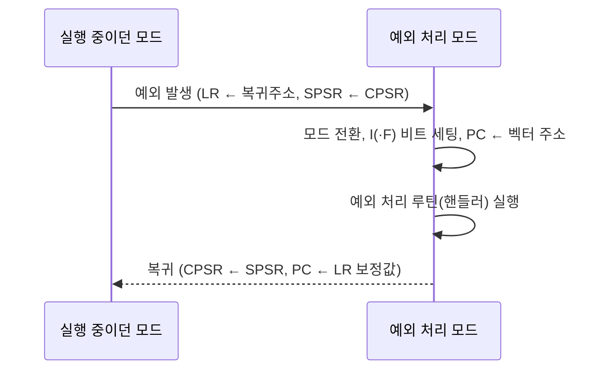

<Callout type="info">
  **이번 문서의 목표:** 이 파일을 다 읽으면 ARM 프로세서의 동작 모드가 왜 여러 개로 나뉘는지, 모드마다 레지스터가 어떻게 달라지는지, 예외(exception)가 발생했을 때 CPU 내부에서 정확히 무슨 일이 일어나는지를 순서대로 설명할 수 있고, Cortex-M 계열이 이 모델을 어떻게 단순화했는지 구분할 수 있다.
</Callout>

## 왜 프로세서에 여러 개의 동작 모드가 필요한가

04편에서 ARM 아키텍처가 RISC(Reduced Instruction Set Computer, 축소 명령어 집합 컴퓨터) 철학을 따르고, Cortex-M 계열이 마이크로컨트롤러(MCU)용으로 이 아키텍처를 다듬은 결과물이라는 것을 배웠다. 그런데 임베디드 시스템은 일반 프로그램만 실행하는 것이 아니다. 전원이 켜지자마자 실행해야 하는 초기화 코드, 잘못된 명령어를 만났을 때 처리할 코드, 외부 장치가 "지금 나 좀 봐 달라"고 보내는 인터럽트(interrupt) 요청에 응답할 코드처럼 **성격이 전혀 다른 여러 종류의 실행 흐름**이 한 CPU 안에서 섞여 돌아가야 한다.

만약 이 모든 흐름이 레지스터를 뒤섞어 쓴다면, 인터럽트가 끼어드는 순간 원래 프로그램이 쓰던 값이 덮어써질 위험이 크다. 그래서 ARM은 실행 흐름의 성격에 따라 CPU를 여러 **동작 모드**(operating mode)로 나누고, 모드마다 일부 레지스터를 독립적으로 갖게 만들었다. 이번 편은 이 모드 구조와 레지스터 집합, 그리고 모드 전환이 실제로 일어나는 계기인 예외(exception) 처리 과정을 다룬다.

## 클래식 ARM의 7가지 동작 모드

> **쉽게 말하면:** ARM 코어는 "지금 무슨 일을 하고 있는가"에 따라 7개의 서로 다른 모드 중 하나로 동작하며, 모드마다 접근 가능한 레지스터와 권한이 다르다.

전통적인 ARM 아키텍처(ARMv4~ARMv6 기반의 ARM7TDMI, ARM9 등, 참고자료 12)는 다음 7가지 동작 모드를 정의한다.

| 모드 | 이름 | 진입 계기 | 권한 |
|---|---|---|---|
| User | 사용자 모드 | 일반 응용 프로그램 실행 | 비특권(unprivileged) |
| FIQ | 고속 인터럽트 모드 | Fast Interrupt Request 발생 | 특권(privileged) |
| IRQ | 일반 인터럽트 모드 | Interrupt Request 발생 | 특권 |
| Supervisor(SVC) | 감독자 모드 | 리셋, SWI(소프트웨어 인터럽트) 명령 실행 | 특권 |
| Abort | 어보트 모드 | 잘못된 메모리 접근(프리페치·데이터 어보트) | 특권 |
| Undefined | 정의되지 않은 모드 | 해독할 수 없는 명령어 실행 시도 | 특권 |
| System | 시스템 모드 | 운영체제가 User와 같은 레지스터로 특권 작업을 할 때 | 특권 |

**User 모드만 비특권**이고 나머지 6개는 모두 특권(privileged) 모드다. 특권 모드에서만 CPSR(다음 절에서 설명)의 제어 비트를 직접 바꾸거나 메모리 보호 설정을 변경할 수 있다. 이 구분은 운영체제가 없는 단순한 펌웨어에서도 그대로 유효한 하드웨어 규칙이다.

<Callout type="warning">
  시험 함정: **System 모드는 User 모드와 똑같은 레지스터 집합을 공유하지만 특권 모드다.** "System 모드는 특별한 레지스터를 따로 갖는다"고 착각하기 쉬운데, System 모드의 존재 이유는 오히려 반대다 — 운영체제 커널이 User 모드와 동일한 레지스터로 작업하면서도 특권이 필요한 동작(예: 다른 프로세스의 레지스터 저장)을 하기 위해 만들어졌다.
</Callout>

## 레지스터 집합: 공유되는 것과 모드마다 따로 있는 것(뱅킹)

> **쉽게 말하면:** R0부터 R12까지는 대부분 모드가 같이 쓰지만, 스택 포인터(R13)와 링크 레지스터(R14), 상태 레지스터 일부는 모드마다 자기만의 사본을 따로 갖는다. 이걸 레지스터 뱅킹이라 부른다.

ARM은 32비트 레지스터 R0~R15와 상태 레지스터 CPSR을 기본으로 제공한다.

- **R0~R12**: 범용 레지스터(general-purpose register). 대부분의 모드가 동일한 물리적 레지스터를 공유한다(단, FIQ 모드는 R8~R12까지도 별도로 뱅킹되어 있어 고속 인터럽트 처리 시 저장·복원 부담을 줄인다).
- **R13(SP, Stack Pointer)**: 스택 포인터. **User/System을 제외한 모든 예외 모드가 자신만의 SP 사본을 갖는다.** 그래서 인터럽트 모드로 들어가도 원래 쓰던 스택을 건드리지 않고 그 모드 전용 스택에 값을 저장할 수 있다.
- **R14(LR, Link Register)**: 링크 레지스터. 함수 호출 시 복귀 주소를 담거나, 예외 발생 시 "예외가 일어난 시점으로 돌아가기 위한 주소"를 자동으로 담는다. 이 레지스터도 예외 모드마다 별도로 뱅킹된다.
- **R15(PC, Program Counter)**: 프로그램 카운터. 모든 모드가 공유하는 단 하나의 PC다.
- **CPSR(Current Program Status Register)**: 현재 프로세서 상태 레지스터. 조건 플래그(N, Z, C, V), 인터럽트 비활성화 비트(I, F), 현재 동작 모드 비트 등을 담는다. 모든 모드가 공유한다.
- **SPSR(Saved Program Status Register)**: 저장된 프로그램 상태 레지스터. **User/System을 제외한 각 예외 모드가 자신만의 SPSR을 하나씩 갖는다.** 예외가 발생하는 순간 CPSR의 내용을 그 모드의 SPSR에 복사해 두고, 예외 처리가 끝나면 SPSR을 다시 CPSR로 되돌려 원래 상태를 복원한다.

이렇게 일부 레지스터가 모드별로 물리적으로 다른 저장 공간을 갖는 구조를 **레지스터 뱅킹**(register banking)이라 한다. 뱅킹 덕분에 예외가 발생해도 매번 여러 레지스터를 스택에 저장하고 복원하는 오버헤드 없이, SP·LR·SPSR 세 개만 자동으로 전환되어 빠르게 대응할 수 있다.



## CPSR의 구조: 모드를 결정하는 비트들

CPSR의 하위 5비트(M[4:0])가 현재 동작 모드를 나타내고, 그 위로 다음과 같은 제어·상태 비트가 있다.

| 비트 위치 | 이름 | 의미 |
|---|---|---|
| N, Z, C, V (31–28) | 조건 코드 플래그 | 직전 연산 결과의 음수·0·캐리·오버플로 여부 |
| I (7) | IRQ 비활성화 | 1이면 IRQ를 무시(마스킹)한다 |
| F (6) | FIQ 비활성화 | 1이면 FIQ를 무시한다 |
| T (5) | Thumb 상태 | 1이면 16비트 Thumb 명령어 집합으로 동작 |
| M[4:0] (4–0) | 모드 비트 | 현재 동작 모드를 5비트 값으로 지정 |

I 비트와 F 비트는 임베디드 소프트웨어에서 **크리티컬 섹션**(critical section, 다른 실행 흐름이 끼어들면 안 되는 구간)을 보호할 때 자주 조작한다. 예를 들어 공유 변수를 여러 단계에 걸쳐 수정하는 동안 인터럽트가 끼어들어 값을 중간에 바꿔버리면 데이터가 깨질 수 있으므로, 그 구간 동안만 I 비트를 세워 IRQ를 잠시 막아 둔다.

```c
/* 크리티컬 섹션을 인터럽트 비활성화로 보호하는 전형적인 패턴 */
unsigned int cpsr_backup = disable_irq();  /* I 비트를 세우고 이전 CPSR 값을 저장 */
shared_counter++;                          /* 인터럽트가 끼어들면 안 되는 구간 */
restore_irq(cpsr_backup);                  /* 이전 CPSR로 복원해 인터럽트를 다시 허용 */
```

<Callout type="warning">
  시험 함정: **F 비트를 세우면 FIQ만 막히고 IRQ는 여전히 들어올 수 있다.** 반대로 I 비트만 세우면 IRQ는 막히지만 FIQ는 그대로 들어온다. "인터럽트를 끈다"는 표현이 두 비트를 항상 같이 가리키는 것은 아니라는 점에 유의한다.
</Callout>

## 예외의 종류와 벡터 테이블

> **쉽게 말하면:** 예외란 "정상적인 명령어 순서를 벗어나 CPU가 반드시 대응해야 하는 사건"이고, 벡터 테이블은 각 예외가 발생했을 때 "여기로 점프하라"고 정해 둔 주소 목록이다.

**예외**(exception)는 리셋, 인터럽트, 잘못된 명령어 실행, 잘못된 메모리 접근처럼 CPU가 정상적인 명령어 흐름을 멈추고 반드시 대응해야 하는 모든 사건을 통칭한다. 클래식 ARM은 다음 7종류의 예외를 정의하며, 각 예외는 메모리의 정해진 위치(**벡터 테이블**, vector table)에 있는 명령어로 CPU를 강제 점프시킨다.

| 예외 | 벡터 주소(오프셋) | 진입 모드 | 발생 원인 |
|---|---|---|---|
| Reset | 0x00 | Supervisor | 전원 인가·리셋 |
| Undefined Instruction | 0x04 | Undefined | 해독 불가능한 명령어 실행 |
| Software Interrupt(SWI) | 0x08 | Supervisor | `SWI` 명령어로 시스템 호출 요청 |
| Prefetch Abort | 0x0C | Abort | 명령어 인출 단계에서 메모리 접근 실패 |
| Data Abort | 0x10 | Abort | 데이터 읽기·쓰기 단계에서 메모리 접근 실패 |
| (예약) | 0x14 | - | 사용하지 않음 |
| IRQ | 0x18 | IRQ | 일반 인터럽트 요청 |
| FIQ | 0x1C | FIQ | 고속 인터럽트 요청 |

벡터 테이블은 보통 메모리 주소 `0x00000000`부터 시작하며, 각 항목은 실제로는 "해당 처리 루틴으로 건너뛰는 점프 명령어" 한 줄씩을 담고 있다. 즉 CPU는 예외가 발생하면 정해진 오프셋 주소로 곧장 이동하고, 그 자리에 적힌 점프 명령을 실행해 실제 처리 루틴(핸들러)으로 다시 이동한다.

<Callout type="warning">
  시험 함정: **FIQ의 벡터 주소가 테이블의 맨 끝(0x1C)에 있다는 것은 오히려 장점이다.** FIQ 핸들러 코드는 벡터 테이블 바로 다음 주소부터 이어서 배치할 수 있어, 다른 예외처럼 별도의 점프 명령을 한 번 더 거칠 필요 없이 곧바로 실행을 시작할 수 있기 때문이다. 이는 FIQ가 "고속" 인터럽트로 설계된 이유 중 하나다.
</Callout>

## 예외 진입 시퀀스: CPU 내부에서 일어나는 일

> **쉽게 말하면:** 예외가 발생하면 CPU는 "지금 상태를 저장하고 → 모드를 바꾸고 → 인터럽트를 잠그고 → 벡터 주소로 점프한다"는 네 가지 일을 하드웨어적으로 자동 수행한다.

예외가 발생한 순간, ARM 코어는 소프트웨어의 개입 없이 다음 절차를 하드웨어적으로 자동 실행한다.

<Steps>

### 1단계: 복귀 주소를 LR에 저장한다

새로 진입하는 모드의 R14(LR)에 "예외 처리가 끝난 뒤 돌아갈 주소"를 저장한다. 이 값은 예외 종류에 따라 현재 PC에 고정된 오프셋을 더한 값이며, 이 오프셋은 06편에서 파이프라인 구조와 함께 자세히 계산한다.

### 2단계: CPSR을 SPSR에 저장한다

새로 진입하는 모드의 SPSR에 현재 CPSR 값을 그대로 복사해 둔다. 이렇게 해 두면 예외 처리가 끝난 뒤 원래 실행 흐름이 어떤 모드·플래그 상태였는지 정확히 복원할 수 있다.

### 3단계: CPSR의 모드 비트를 바꾸고 인터럽트를 마스킹한다

CPSR의 M[4:0] 비트를 해당 예외에 대응하는 모드 값으로 바꾸고, I 비트를 세워 추가 IRQ를 막는다(FIQ 예외라면 F 비트도 함께 세운다). 이 순간부터 CPU는 해당 예외 모드에서 동작하며, 뱅킹된 SP·LR을 그 모드 전용 값으로 자동 사용하게 된다.

### 4단계: PC를 벡터 주소로 로드한다

PC에 해당 예외의 벡터 주소를 넣어, 다음 인출 사이클부터 벡터 테이블에 적힌 처리 루틴으로 실행이 이어지게 만든다.

</Steps>

## 예외 복귀 시퀀스: 원래 자리로 돌아가기

예외 처리 루틴(핸들러)이 할 일을 마치면, 다음 두 동작으로 원래 실행 흐름에 복귀한다.

1. **SPSR을 CPSR로 복사**: 저장해 두었던 SPSR 값을 CPSR에 되돌려, 모드·플래그·인터럽트 마스크 상태를 예외 발생 이전으로 정확히 복원한다.
2. **LR의 값(보정된)을 PC로 복사**: 저장해 둔 복귀 주소를 PC에 넣어 실행을 이어간다. 이 두 동작은 흔히 `SUBS PC, LR, #보정값`처럼 하나의 명령어로 동시에 처리되는데, PC에 결과를 쓰는 데이터 처리 명령어가 S 접미사(플래그 갱신)를 가지면 특수하게 "SPSR을 CPSR로 복사하라"는 의미로 재해석되기 때문이다.



## Cortex-M의 단순화된 예외 모델

> **쉽게 말하면:** Cortex-M은 7가지 모드 대신 딱 두 가지 모드(Thread, Handler)만 두고, 레지스터 뱅킹 대신 예외 발생 시 자동으로 스택에 레지스터를 저장하는 방식을 쓴다.

04편에서 다룬 것처럼 Cortex-M은 MCU 환경에 맞춰 클래식 ARM의 복잡한 7모드 구조를 크게 단순화했다.

| 구분 | 클래식 ARM(ARM7TDMI 등) | Cortex-M |
|---|---|---|
| 동작 모드 수 | 7개(User, FIQ, IRQ, SVC, Abort, Undefined, System) | 2개(Thread, Handler) |
| 권한 수준 | 모드 자체가 권한을 겸함 | Privileged/Unprivileged 별도 축으로 분리 |
| 예외 시 레지스터 보존 | 뱅킹된 SP·LR·SPSR을 하드웨어가 자동 전환 | 예외 발생 시 R0–R3, R12, LR, PC, xPSR을 스택에 자동 push |
| 예외 벡터 | 고정 오프셋 7개(점프 명령을 담은 테이블) | 예외 번호별 실제 핸들러 주소를 담은 테이블(최대 수백 개, NVIC가 관리) |
| 우선순위 | FIQ/IRQ 2단계 | NVIC(Nested Vectored Interrupt Controller)가 다단계 우선순위 지원 |

Cortex-M은 **Thread 모드**(일반 프로그램 실행)와 **Handler 모드**(예외 처리 중) 두 가지만 있으며, 각 모드는 다시 Privileged(특권)와 Unprivileged(비특권)로 나뉠 수 있다. 예외가 발생하면 클래식 ARM처럼 모드별로 레지스터를 뱅킹하는 대신, 하드웨어가 **자동 스택 프레임 저장**(automatic stacking)이라는 방식으로 R0~R3, R12, LR, PC, xPSR(CPSR에 해당) 8개 레지스터를 현재 스택에 통째로 밀어 넣고 예외 핸들러로 진입한다. 이 방식은 예외 처리 코드를 C 함수로 자연스럽게 작성할 수 있게 해 주는데, 이 부분은 08편에서 NVIC와 벡터 테이블을 다룰 때, 12편에서 ISR(Interrupt Service Routine) 작성 원리를 다룰 때 더 깊게 연결한다.

### 자주 틀리는 점

- User 모드가 유일한 비특권 모드라는 사실과, System 모드는 "특권이면서 User와 같은 레지스터를 쓴다"는 사실을 뒤바꿔 외우는 경우가 많다.
- SPSR을 "예외가 처리된 이후의 상태를 저장하는 레지스터"로 착각하기 쉬운데, 정확히는 **예외 발생 직전의 CPSR을 저장**하는 레지스터다.
- Cortex-M을 다루면서 "IRQ 모드", "FIQ 모드"라는 클래식 ARM 용어를 그대로 쓰는 오류가 흔하다. Cortex-M에는 Thread/Handler 두 모드만 있고, FIQ 자체가 없다.

## 핵심 정리

- 클래식 ARM은 User, FIQ, IRQ, Supervisor, Abort, Undefined, System 7개 동작 모드를 두며, User만 비특권이다.
- R0~R12·PC·CPSR은 대부분 모드가 공유하지만, SP·LR·SPSR은 예외 모드마다 별도로 뱅킹되어 빠른 전환을 지원한다.
- 예외 발생 시 하드웨어는 (LR에 복귀 주소 저장) → (CPSR을 SPSR에 저장) → (모드 전환·인터럽트 마스킹) → (PC를 벡터 주소로 로드) 순서로 자동 처리한다.
- 벡터 테이블은 Reset(0x00)부터 FIQ(0x1C)까지 7개 고정 오프셋에 처리 루틴으로의 점프 명령을 담는다.
- Cortex-M은 이 모델을 Thread/Handler 2모드로 단순화하고, 레지스터 뱅킹 대신 예외 시 자동 스택 저장 방식을 쓰며, NVIC가 다단계 우선순위를 관리한다.

## 마무리 복습

<Quiz
  questionNumber={1}
  question="클래식 ARM의 7가지 동작 모드 중 유일하게 비특권 모드인 것은?"
  options={['System 모드', 'User 모드', 'Supervisor 모드', 'Abort 모드']}
  correctAnswer={2}
  explanation="ARM의 7개 동작 모드 중 User 모드만 비특권(unprivileged) 모드이며, 나머지 6개(FIQ, IRQ, Supervisor, Abort, Undefined, System)는 모두 특권 모드다."
  optionExplanations={['System 모드는 User와 같은 레지스터를 쓰지만 특권 모드다', '정답이다. User 모드만 비특권 모드로 동작한다', 'Supervisor 모드는 리셋과 SWI 처리에 쓰이는 특권 모드다', 'Abort 모드는 메모리 접근 오류 처리를 위한 특권 모드다']}
/>

<Quiz
  questionNumber={2}
  question="ARM 레지스터 중 예외 모드마다 별도로 뱅킹되어 각 모드가 독립적인 사본을 갖는 레지스터로 옳게 짝지어진 것은?"
  options={['R0~R12, PC', 'PC, CPSR', 'SP(R13), LR(R14), SPSR', 'R0~R7만']}
  correctAnswer={3}
  explanation="SP(R13), LR(R14), SPSR은 User/System을 제외한 예외 모드마다 물리적으로 별도의 저장 공간을 갖는 뱅킹된 레지스터다. PC와 CPSR, 그리고 대부분의 R0~R12는 모든 모드가 공유한다."
  optionExplanations={['R0~R12와 PC는 대부분 모드가 공유하는 레지스터다', 'PC와 CPSR은 모든 모드가 공유하는 단일 레지스터다', '정답이다. SP, LR, SPSR이 예외 모드별로 뱅킹되는 레지스터다', 'FIQ 모드는 R8~R12까지 추가로 뱅킹되지만 R0~R7만이라는 설명은 정확하지 않다']}
/>

<Quiz
  questionNumber={3}
  question="예외 발생 시 하드웨어가 자동으로 수행하는 절차의 순서로 옳은 것은?"
  options={['모드 전환 → 벡터 주소로 PC 로드 → LR 저장 → CPSR을 SPSR에 저장', 'LR에 복귀 주소 저장 → CPSR을 SPSR에 저장 → 모드 전환 및 인터럽트 마스킹 → PC를 벡터 주소로 로드', 'CPSR을 SPSR에 저장 → PC를 벡터 주소로 로드 → LR 저장 → 모드 전환', 'PC를 벡터 주소로 먼저 로드한 뒤 나머지를 처리한다']}
  correctAnswer={2}
  explanation="예외 진입은 복귀 주소를 LR에 저장하고, CPSR을 새 모드의 SPSR에 복사하고, 모드를 바꾸며 인터럽트를 마스킹한 뒤, 마지막으로 PC에 벡터 주소를 로드하는 순서로 진행된다."
  optionExplanations={['PC 로드는 마지막 단계이며 순서가 뒤바뀌었다', '정답이다. 복귀 주소 저장 → SPSR 저장 → 모드 전환/마스킹 → PC 로드 순서다', 'PC를 벡터 주소로 로드하는 것은 가장 마지막 단계여야 한다', 'PC 로드를 가장 먼저 하면 그 이전 상태 저장이 불가능해진다']}
/>

<Quiz
  questionNumber={4}
  question="클래식 ARM의 예외 벡터 테이블에서 IRQ 예외의 벡터 오프셋 주소는?"
  options={['0x08', '0x14', '0x18', '0x1C']}
  correctAnswer={3}
  explanation="IRQ 예외의 벡터 오프셋은 0x18이다. 0x08은 SWI(소프트웨어 인터럽트), 0x14는 예약 영역, 0x1C는 FIQ의 벡터 오프셋이다."
  optionExplanations={['0x08은 SWI(소프트웨어 인터럽트)의 벡터 주소다', '0x14는 사용하지 않는 예약 영역이다', '정답이다. IRQ의 벡터 오프셋은 0x18이다', '0x1C는 FIQ의 벡터 오프셋이다']}
/>

<Quiz
  questionNumber={5}
  question="Cortex-M의 예외 처리 방식에 대한 설명으로 옳지 않은 것은?"
  options={['Thread 모드와 Handler 모드 두 가지만 존재한다', '예외 발생 시 R0~R3, R12, LR, PC, xPSR을 하드웨어가 자동으로 스택에 저장한다', 'FIQ와 IRQ 모드로 나뉘어 각각 별도의 뱅킹된 레지스터를 사용한다', 'NVIC가 다단계 우선순위와 벡터 테이블을 관리한다']}
  correctAnswer={3}
  explanation="Cortex-M에는 FIQ/IRQ 같은 클래식 ARM의 모드 구분이 없다. Thread/Handler 2모드만 존재하며, 예외 시 레지스터 뱅킹 대신 자동 스택 저장 방식을 쓴다."
  optionExplanations={['Cortex-M은 실제로 Thread/Handler 두 모드만 갖는다', 'Cortex-M은 실제로 이 8개 레지스터를 자동으로 스택에 저장한다', '정답이다. Cortex-M에는 FIQ/IRQ 모드 자체가 없으며, 이는 클래식 ARM에만 있는 개념이다', 'NVIC가 다단계 우선순위와 벡터 테이블을 관리하는 것은 Cortex-M의 실제 특징이다']}
/>

<Quiz
  questionNumber={6}
  question="CPSR의 I 비트와 F 비트에 대한 설명으로 옳은 것은?"
  options={['I 비트를 세우면 FIQ와 IRQ가 모두 즉시 차단된다', 'I 비트는 IRQ를, F 비트는 FIQ를 독립적으로 마스킹하며 서로 영향을 주지 않는다', 'F 비트는 Thumb 명령어 집합 사용 여부를 나타낸다', 'I 비트와 F 비트는 조건 코드 플래그로 연산 결과를 나타낸다']}
  correctAnswer={2}
  explanation="I 비트는 IRQ 마스킹, F 비트는 FIQ 마스킹을 각각 독립적으로 담당한다. I 비트만 세우면 IRQ만 막히고 FIQ는 여전히 들어올 수 있다."
  optionExplanations={['I 비트는 IRQ만 차단하며 FIQ는 F 비트가 별도로 담당한다', '정답이다. I와 F는 각각 IRQ와 FIQ를 독립적으로 마스킹한다', 'Thumb 상태를 나타내는 것은 T 비트다', '조건 코드 플래그는 N, Z, C, V 비트다']}
/>

## 참고 자료

- [Arm Cortex-M resources](https://developer.arm.com/community/arm-community-blogs/b/architectures-and-processors-blog/posts/cortex-m-resources)
- [CMSIS-Core (Cortex-M): Overview](https://arm-software.github.io/CMSIS_6/latest/Core/index.html)
- [Cortex-M4 Technical Reference Manual](https://documentation-service.arm.com/static/5f19da2a20b7cf4bc524d99a)
- [ARM Cortex-M3 Processor Software Development for Arm7TDMI Processor Programmers](https://developer.arm.com/community/arm-community-blogs/b/architectures-and-processors-blog/posts/getting-started-with-arm-microcontroller-resources)
