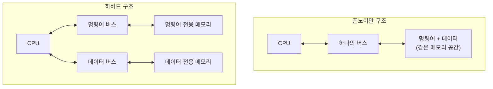

<Callout type="info">
  **이번 문서의 목표:** 이 파일을 다 읽으면 임베디드 시스템에서 쓰이는 메모리 종류(ROM, Flash, SRAM, EEPROM)의 차이를 용도와 함께 설명할 수 있고, 하버드 구조와 폰노이만 구조의 차이를 그림으로 그릴 수 있으며, Cortex-M의 전형적인 메모리 맵과 메모리 맵드 I/O 개념, MPU와 MMU의 차이를 구분할 수 있다.
</Callout>

## 왜 임베디드 시스템은 메모리 종류를 여러 개 섞어 쓸까

04편과 05편에서 MCU(Microcontroller Unit) 내부에 프로세서 코어와 함께 메모리가 통합되어 있다는 것을 배웠다. 그런데 이 메모리는 단일한 하나의 저장소가 아니라, **성격이 다른 여러 종류의 메모리가 목적에 맞게 조합**된 것이다. 프로그램 코드는 전원이 꺼져도 남아 있어야 하지만, 실행 중 변하는 변수 값은 빠르게 읽고 써야 한다. 이 두 요구를 하나의 메모리로 동시에 만족시키기 어렵기 때문에, 임베디드 시스템은 처음부터 여러 메모리를 역할별로 나눠 쓴다.

## 메모리 종류별 특징: ROM, Flash, SRAM, EEPROM

> **쉽게 말하면:** 전원이 꺼져도 내용이 남는 메모리(비휘발성)와, 전원이 꺼지면 내용이 사라지지만 빠른 메모리(휘발성)를 목적에 따라 나눠 쓴다.

| 메모리 | 휘발성 | 쓰기 방식 | 재기록 가능 횟수 | 주요 용도 |
|---|---|---|---|---|
| ROM(Read Only Memory) | 비휘발성 | 제조 시 한 번만 기록(마스크 ROM 기준) | 사실상 불가 | 변경되지 않는 고정 코드·데이터 |
| Flash 메모리 | 비휘발성 | 블록(섹터) 단위로 지우고 다시 씀 | 수만–수십만 회 | 펌웨어(firmware) 저장, 프로그램 코드 영역 |
| SRAM(Static RAM) | 휘발성 | 바이트 단위로 자유롭게 읽고 씀 | 제한 없음 | 실행 중 변수, 스택, 힙 |
| EEPROM(Electrically Erasable Programmable ROM) | 비휘발성 | 바이트 단위로 전기적으로 지우고 다시 씀 | 수십만 회 수준 | 설정값처럼 자주 바뀌지만 전원 꺼져도 보존해야 하는 소량 데이터 |

**비휘발성**(non-volatile)이란 전원 공급이 끊겨도 저장된 내용이 사라지지 않는 성질을, **휘발성**(volatile)이란 전원이 끊기면 내용이 사라지는 성질을 말한다. 오늘날 대부분의 MCU는 마스크 ROM 대신 **Flash 메모리**를 프로그램 저장 공간으로 쓴다. Flash는 한 번 쓴 뒤에도 다시 지우고 새 프로그램을 넣을 수 있어(그래서 "펌웨어 업데이트"가 가능하다), 개발 단계에서 반복적으로 코드를 올리고 테스트하는 데 훨씬 유리하기 때문이다.

Flash와 EEPROM은 둘 다 전기적으로 지우고 다시 쓸 수 있다는 점은 같지만, **지우는 단위**가 다르다. Flash는 한 번에 큰 블록(섹터, 보통 수 킬로바이트 단위)을 통째로 지워야 새로 쓸 수 있는 반면, EEPROM은 바이트 단위로 개별적으로 지우고 쓸 수 있다. 그래서 설정값처럼 자주, 조금씩 바뀌는 데이터는 EEPROM(또는 이를 흉내 낸 Flash의 일부 영역)에 저장하고, 크기가 크고 통째로 갱신되는 프로그램 코드는 Flash에 저장하는 것이 일반적인 역할 분담이다.

<Callout type="warning">
  시험 함정: **EEPROM과 Flash를 "휘발성 여부"로 구분하려는 함정에 빠지지 않아야 한다.** 둘 다 비휘발성이다. 둘의 진짜 차이는 지우고 쓰는 **단위**(EEPROM은 바이트, Flash는 블록)와 그로 인한 속도·용도 차이다.
</Callout>

**SRAM**(Static RAM)은 MCU 내부에서 실행 중인 프로그램의 변수, 함수 호출 스택, 힙(동적 할당 영역)을 담는 휘발성 메모리다. 바이트 단위로 자유롭게 읽고 쓸 수 있고 속도가 빠르지만, 전원이 꺼지면 내용이 모두 사라지므로 재부팅 후 복원해야 하는 값은 SRAM이 아니라 Flash나 EEPROM에 저장해 둬야 한다. (참고로 컴퓨터구조 과목에서 다루는 DRAM은 대용량 시스템의 주기억장치에 주로 쓰이며, 소형 MCU는 회로가 단순하고 접근 속도가 빠른 SRAM을 코어 옆에 내장하는 경우가 많다.)

## 하버드 구조와 폰노이만 구조

> **쉽게 말하면:** 명령어를 가져오는 길과 데이터를 가져오는 길을 아예 분리해 둔 것이 하버드 구조이고, 하나의 길로 명령어와 데이터를 모두 처리하는 것이 폰노이만 구조다.

**폰노이만 구조**(Von Neumann architecture)는 명령어와 데이터를 하나의 메모리 공간에 함께 저장하고, 하나의 버스(bus, 데이터가 오가는 통로)로 이 둘을 순서대로 실어 나른다. 구조가 단순하고 메모리를 유연하게 나눠 쓸 수 있다는 장점이 있지만, 명령어를 가져오는 것과 데이터를 가져오는 것이 같은 통로를 놓고 경쟁하므로 동시에 처리할 수 없다는 한계(폰노이만 병목, Von Neumann bottleneck)가 있다.

**하버드 구조**(Harvard architecture)는 명령어를 저장하는 메모리·버스와 데이터를 저장하는 메모리·버스를 물리적으로 분리한다. 그 결과 CPU는 **같은 클록 사이클에 명령어 인출과 데이터 접근을 동시에** 수행할 수 있어, 06편에서 다룬 파이프라인의 각 단계가 서로 방해받지 않고 겹쳐 돌아가는 데 유리하다.



ARM Cortex-M 계열은 실제로는 **개선된 하버드 구조**(modified Harvard architecture)를 쓴다. 명령어와 데이터를 위한 버스를 분리해 두면서도, 프로그래머 입장에서는 하나의 통합된 주소 공간(다음 절의 메모리 맵)으로 접근할 수 있게 만들어 두었다. 즉 물리적으로는 하버드처럼 버스를 나누되, 주소 체계는 폰노이만처럼 통합해 두 구조의 장점을 절충한 것이다.

<Callout type="warning">
  시험 함정: **하버드 구조가 "메모리 용량이 더 크다"거나 "가격이 더 싸다"는 의미가 아니다.** 하버드 구조의 핵심 이점은 명령어·데이터 접근을 동시에 할 수 있어 처리 속도(특히 파이프라인 효율)가 높아진다는 것이지, 용량이나 비용과는 직접 관련이 없다.
</Callout>

## 메모리 맵: 주소 공간을 역할별로 나눠 배치한다

> **쉽게 말하면:** MCU는 코드 영역, SRAM 영역, 주변장치 레지스터 영역처럼 서로 다른 성격의 저장 공간을 하나의 커다란 32비트 주소 공간 안에 구역별로 나눠 배치해 둔다.

**메모리 맵**(memory map)이란 프로세서가 접근할 수 있는 전체 주소 공간(Cortex-M의 경우 32비트, 즉 0번지부터 약 43억 번지까지)을 어떤 용도의 메모리·장치가 어느 주소 범위를 차지하는지 정리한 배치도다. Cortex-M 계열이 정의하는 전형적인 메모리 맵은 다음과 같다.

| 주소 범위(대표값) | 영역 이름 | 용도 |
|---|---|---|
| `0x00000000`–`0x1FFFFFFF` | Code | Flash 등 프로그램 코드 저장 영역 |
| `0x20000000`–`0x3FFFFFFF` | SRAM | 실행 중 변수·스택·힙 |
| `0x40000000`–`0x5FFFFFFF` | Peripheral | GPIO, 타이머, UART 등 주변장치의 제어 레지스터 |
| `0x60000000`–`0x9FFFFFFF` | External RAM | 외부에 연결한 추가 메모리 |
| `0xE0000000`–`0xFFFFFFFF` | Private Peripheral Bus 등 | NVIC, SysTick 등 코어 내부 제어 레지스터 |

이 배치는 벤더(제조사)마다 세부 범위가 조금씩 다를 수 있지만, "코드 영역은 낮은 주소, SRAM은 그다음, 주변장치는 그다음"이라는 큰 틀은 Cortex-M 계열이 공통으로 따르는 규약이다(참고자료의 Arm Cortex-M 문서 체계 참고).

### 메모리 맵드 I/O: 주변장치를 메모리 주소처럼 다룬다

메모리 맵에서 특히 중요한 것이 **Peripheral(주변장치) 영역**이다. Cortex-M을 비롯한 대부분의 MCU는 **메모리 맵드 I/O**(memory-mapped I/O)라는 방식을 쓰는데, 이는 GPIO나 타이머 같은 주변장치의 제어 레지스터를 별도의 명령어 없이 **일반 메모리 주소를 읽고 쓰는 것과 똑같은 방식**으로 조작하는 방식이다.

```c
/* 메모리 맵드 I/O: 특정 주소를 포인터로 캐스팅해 레지스터처럼 접근한다 */
#define GPIOA_ODR (*(volatile unsigned int *)0x40020014)  /* GPIOA 출력 데이터 레지스터 주소 */

GPIOA_ODR = 0x00000001;   /* 이 한 줄이 실제로는 GPIOA의 0번 핀에 전기 신호를 출력한다 */
```

이 코드에서 `0x40020014`는 앞서 본 메모리 맵의 Peripheral 영역 안에 들어 있는, GPIOA라는 주변장치의 "출력 데이터 레지스터"가 매핑된 주소다. C 코드에서는 이 주소를 `volatile`(08·12편에서 자세히 다룬다. 컴파일러가 이 값을 임의로 캐시하거나 최적화로 생략하지 못하게 막는 키워드) 포인터로 캐스팅해, 마치 평범한 변수에 대입하듯 값을 쓰면 실제 하드웨어 핀의 전압이 바뀐다. 이것이 "메모리에 값을 쓰는 것"과 "하드웨어를 제어하는 것"이 완전히 같은 문법으로 이뤄지는 메모리 맵드 I/O의 핵심이다. (이와 대비되는 방식으로 **포트 맵드 I/O**, port-mapped I/O가 있는데, 이는 별도의 전용 입출력 명령어와 독립된 주소 공간을 쓰는 방식으로 x86 계열에서 볼 수 있으며 Cortex-M은 이 방식을 쓰지 않는다.)

## MPU와 MMU: 이름은 비슷하지만 역할이 다르다

> **쉽게 말하면:** MMU는 가상주소를 물리주소로 변환해 주는 장치이고, MPU는 주소 변환 없이 "이 영역은 누가 접근해도 되는지"만 감시하는 훨씬 단순한 보호 장치다.

**MMU**(Memory Management Unit, 메모리 관리 장치)는 프로그램이 사용하는 **가상 주소**(virtual address)를 실제 물리 메모리의 **물리 주소**(physical address)로 변환해 주는 하드웨어다. 이 변환 덕분에 운영체제는 각 프로세스에게 "내가 메모리를 독차지하고 있다"는 착각을 줄 수 있고(가상 메모리), 프로세스마다 독립된 주소 공간을 부여해 서로의 메모리를 침범하지 못하게 막을 수 있다. 리눅스 같은 범용 운영체제를 올리는 상위급 프로세서(Cortex-A 계열)에는 MMU가 있다.

반면 **MPU**(Memory Protection Unit, 메모리 보호 장치)는 주소 변환을 하지 않는다. 대신 미리 정의된 몇 개의 영역(region)에 대해 "이 주소 범위는 읽기만 가능", "이 주소 범위는 특권 모드에서만 접근 가능"처럼 **접근 권한만 검사**한다. 실제 주소는 원래 그대로(가상 주소 개념 자체가 없다) 사용된다.

| 구분 | MMU | MPU |
|---|---|---|
| 핵심 기능 | 가상 주소 → 물리 주소 변환 | 정해진 영역에 대한 접근 권한 검사만 수행 |
| 가상 메모리 지원 | 지원(프로세스별 독립 주소 공간) | 지원하지 않음 |
| 하드웨어 복잡도 | 높음(페이지 테이블, TLB 등 필요) | 낮음(소수의 영역 설정 레지스터) |
| 대표 탑재 프로세서 | Cortex-A 계열(범용 OS용) | Cortex-M 계열(MCU, RTOS용) |
| 목적 | 멀티프로세스 격리, 가상 메모리 | 실시간성을 해치지 않는 최소한의 오류 방지·보호 |

Cortex-M 기반 MCU가 MMU 대신 MPU(그마저도 선택 사항인 경우가 많다)를 쓰는 이유는 명확하다. 임베디드·실시간 시스템은 **응답 시간의 예측 가능성**이 최우선인데, MMU의 페이지 테이블 탐색이나 TLB(Translation Lookaside Buffer, 주소 변환 결과를 캐싱하는 장치) 미스 같은 동작은 처리 시간이 상황에 따라 들쭉날쭉해질 수 있다. MPU는 훨씬 단순한 규칙(영역별 권한 비교)만 검사하므로 지연 시간이 일정하고 예측 가능해, 13편 이후에서 다룰 실시간 시스템의 요구사항과 잘 맞는다.

<Callout type="warning">
  시험 함정: **"Cortex-M에는 메모리 보호 기능이 전혀 없다"는 설명은 틀렸다.** MPU라는 형태로 접근 권한 보호 기능을 갖출 수 있다. 다만 MMU처럼 가상 주소 변환이나 프로세스별 독립 주소 공간까지는 제공하지 않는다는 점이 핵심 차이다.
</Callout>

### 자주 틀리는 점

- Flash와 EEPROM을 "휘발성 여부"로 구분하려는 오류. 둘 다 비휘발성이며, 차이는 지우기 단위(블록 대 바이트)다.
- 하버드 구조를 "메모리가 물리적으로 두 개라 용량이 두 배"라고 착각하는 오류. 핵심은 동시 접근이 가능해지는 속도 이점이다.
- MPU를 "MMU의 축소판이라 가상 메모리도 일부 지원한다"고 착각하는 오류. MPU는 주소 변환 자체를 하지 않는다.

## 핵심 정리

- ROM·Flash는 프로그램 코드처럼 잘 바뀌지 않는 비휘발성 저장에, SRAM은 휘발성이지만 빠른 실행 중 데이터 저장에, EEPROM은 자주 바뀌면서도 보존해야 하는 소량 데이터 저장에 쓰인다.
- 폰노이만 구조는 명령어·데이터를 하나의 버스로 공유해 병목이 생기고, 하버드 구조는 버스를 분리해 동시 접근이 가능하다. Cortex-M은 개선된 하버드 구조를 쓴다.
- Cortex-M의 메모리 맵은 Code, SRAM, Peripheral 등 영역을 32비트 주소 공간에 구역별로 배치하며, 주변장치를 메모리 주소처럼 접근하는 메모리 맵드 I/O를 쓴다.
- MMU는 가상 주소를 물리 주소로 변환해 가상 메모리·프로세스 격리를 지원하고, MPU는 주소 변환 없이 영역별 접근 권한만 검사한다.
- Cortex-M 계열은 예측 가능한 응답 시간이 중요하므로 MMU 대신 더 단순한 MPU를 쓴다.

## 마무리 복습

<Quiz
  questionNumber={1}
  question="Flash 메모리와 EEPROM의 가장 근본적인 차이로 옳은 것은?"
  options={['Flash는 휘발성이고 EEPROM은 비휘발성이다', 'Flash는 블록 단위로, EEPROM은 바이트 단위로 지우고 다시 쓴다', 'EEPROM은 전원이 꺼지면 내용이 사라진다', 'Flash는 읽기만 가능하고 쓰기는 불가능하다']}
  correctAnswer={2}
  explanation="Flash와 EEPROM은 둘 다 비휘발성이며 전기적으로 다시 쓸 수 있다는 공통점이 있다. 다만 Flash는 큰 블록 단위로, EEPROM은 바이트 단위로 지우고 다시 쓸 수 있다는 점이 핵심 차이다."
  optionExplanations={['둘 다 비휘발성 메모리다. 휘발성으로 구분하는 것은 틀렸다', '정답이다. 지우기·쓰기 단위(블록 대 바이트)가 핵심 차이다', 'EEPROM도 비휘발성이라 전원이 꺼져도 내용이 유지된다', 'Flash는 전기적으로 지우고 다시 쓸 수 있는 메모리다']}
/>

<Quiz
  questionNumber={2}
  question="하버드 구조에 대한 설명으로 옳은 것은?"
  options={['명령어와 데이터가 하나의 버스와 메모리 공간을 공유한다', '명령어 버스와 데이터 버스가 분리되어 있어 동시에 접근할 수 있다', '가상 주소를 물리 주소로 변환하는 구조다', '메모리 용량을 두 배로 늘리기 위한 구조다']}
  correctAnswer={2}
  explanation="하버드 구조는 명령어 전용 버스·메모리와 데이터 전용 버스·메모리를 물리적으로 분리해, 같은 사이클에 명령어 인출과 데이터 접근을 동시에 수행할 수 있게 한다."
  optionExplanations={['하나의 버스를 공유하는 것은 폰노이만 구조의 특징이다', '정답이다. 버스 분리로 동시 접근이 가능한 것이 하버드 구조의 핵심이다', '주소 변환은 MMU의 역할이며 하버드 구조와는 무관하다', '하버드 구조의 목적은 용량 증가가 아니라 동시 접근을 통한 속도 향상이다']}
/>

<Quiz
  questionNumber={3}
  question="Cortex-M의 전형적인 메모리 맵에서 GPIO, 타이머 등 주변장치의 제어 레지스터가 배치되는 영역은?"
  options={['Code 영역', 'SRAM 영역', 'Peripheral 영역', 'External RAM 영역']}
  correctAnswer={3}
  explanation="Cortex-M 메모리 맵에서 0x40000000대는 GPIO, 타이머, UART 등 주변장치의 제어 레지스터가 매핑되는 Peripheral 영역이다."
  optionExplanations={['Code 영역은 Flash 등 프로그램 코드가 저장되는 영역이다', 'SRAM 영역은 실행 중 변수·스택·힙이 저장되는 영역이다', '정답이다. 주변장치 제어 레지스터는 Peripheral 영역에 매핑된다', 'External RAM 영역은 외부에 연결한 추가 메모리를 위한 영역이다']}
/>

<Quiz
  questionNumber={4}
  question="메모리 맵드 I/O(memory-mapped I/O)에 대한 설명으로 옳은 것은?"
  options={['주변장치 접근에 전용 입출력 명령어와 독립된 주소 공간을 쓴다', '주변장치의 제어 레지스터를 일반 메모리 주소처럼 읽고 쓰는 방식이다', 'MMU가 있어야만 사용할 수 있는 방식이다', 'SRAM에만 적용되는 접근 방식이다']}
  correctAnswer={2}
  explanation="메모리 맵드 I/O는 GPIO나 타이머 같은 주변장치의 레지스터를 특별한 명령어 없이 일반 메모리 주소를 읽고 쓰는 것과 동일한 방식으로 접근하는 기법이다."
  optionExplanations={['전용 입출력 명령어와 독립된 주소 공간을 쓰는 것은 포트 맵드 I/O다', '정답이다. 일반 메모리 접근과 동일한 방식으로 주변장치를 제어하는 것이 메모리 맵드 I/O다', 'MMU 유무와 메모리 맵드 I/O 사용 여부는 직접적인 관련이 없다', '메모리 맵드 I/O는 SRAM이 아니라 Peripheral 영역에 매핑된 레지스터에 적용된다']}
/>

<Quiz
  questionNumber={5}
  question="MMU와 MPU의 차이에 대한 설명으로 옳지 않은 것은?"
  options={['MMU는 가상 주소를 물리 주소로 변환하지만 MPU는 변환하지 않는다', 'MPU는 정해진 영역에 대한 접근 권한만 검사한다', 'MPU도 MMU처럼 프로세스별 독립된 가상 주소 공간을 제공한다', 'Cortex-M 계열은 예측 가능한 응답 시간을 위해 MMU 대신 MPU를 주로 쓴다']}
  correctAnswer={3}
  explanation="MPU는 주소 변환 자체를 하지 않으므로 가상 주소 공간이라는 개념이 없고, 프로세스별 독립된 주소 공간도 제공하지 않는다. 이는 MMU만의 기능이다."
  optionExplanations={['MMU가 가상-물리 주소 변환을 담당하는 것은 옳은 설명이다', 'MPU가 영역별 접근 권한만 검사하는 것은 옳은 설명이다', '정답이다. MPU는 주소 변환을 하지 않으므로 가상 주소 공간을 제공하지 않는다', 'Cortex-M이 예측 가능한 응답 시간을 위해 MPU를 주로 쓰는 것은 옳은 설명이다']}
/>

<Quiz
  questionNumber={6}
  question="MCU에서 실행 중인 프로그램의 지역 변수와 함수 호출 스택이 저장되는 메모리로 가장 적절한 것은?"
  options={['ROM', 'Flash 메모리', 'SRAM', 'EEPROM']}
  correctAnswer={3}
  explanation="지역 변수와 스택은 실행 중 빠르게 읽고 써야 하며 전원이 꺼지면 사라져도 되는 데이터이므로, 바이트 단위로 자유롭게 접근 가능한 휘발성 메모리인 SRAM에 저장된다."
  optionExplanations={['ROM은 읽기 전용의 비휘발성 메모리로 변수 저장에 쓰이지 않는다', 'Flash는 프로그램 코드를 저장하는 비휘발성 메모리이며 블록 단위로만 지우고 쓸 수 있어 변수 저장에 부적합하다', '정답이다. SRAM이 실행 중 변수와 스택을 담는 휘발성 메모리다', 'EEPROM은 설정값처럼 소량이면서 전원이 꺼져도 보존해야 하는 데이터에 쓰인다']}
/>

## 참고 자료

- [Arm Cortex-M resources](https://developer.arm.com/community/arm-community-blogs/b/architectures-and-processors-blog/posts/cortex-m-resources)
- [ARM MCU Resources - Documentation](https://community.arm.com/arm-community-blogs/b/architectures-and-processors-blog/posts/arm-mcu-resources---documentation)
- [국가평생교육진흥원 독학학위제 - 시험안내(전공분야/과목)](https://bdes.nile.or.kr/nile/exam/nExam2_1.do)