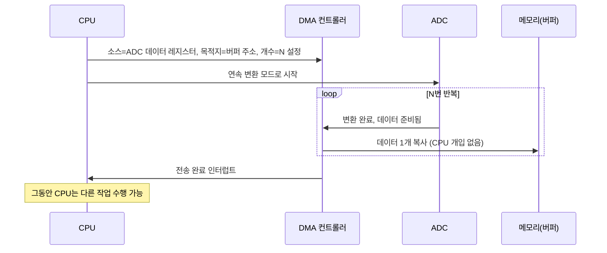

<Callout type="info">
  **이번 문서의 목표:** 이 파일을 다 읽으면 타이머 레지스터 값으로 PWM의 주파수와 듀티비를 직접 계산하고, 워치독 타이머의 타임아웃 시간을 구하며, ADC/DAC의 분해능에 따른 양자화 오차와 샘플링 주파수를 계산하고, DMA가 CPU 개입 없이 데이터를 옮기는 원리를 설명할 수 있다.
</Callout>

08편에서 GPIO(General Purpose Input Output, 범용 입출력)와 타이머·카운터(timer/counter)를 다뤘다. 타이머는 단순히 시간을 세는 것 말고도 **주기적인 신호를 만들거나(PWM), 시스템이 멈췄는지 감시하거나(WDT), 아날로그 신호를 처리하는 주변장치(ADC, DAC)와 짝을 이뤄 동작**한다. 이 편에서는 08에서 만든 타이머 기반 위에서 이 네 가지 주변장치 — PWM, WDT, ADC, DAC — 를 다루고, 마지막으로 이들을 CPU 없이 연결해주는 DMA(Direct Memory Access, 직접 메모리 접근)까지 정리한다.

## PWM: 디지털 핀으로 아날로그처럼 보이는 신호 만들기

### 왜 필요한가

MCU(Micro Controller Unit, 마이크로컨트롤러)의 GPIO 핀은 기본적으로 `0` 또는 `1`, 즉 켜짐과 꺼짐만 출력할 수 있다. 그런데 모터의 회전 속도를 절반으로 줄이거나 LED의 밝기를 중간 정도로 맞추려면 "중간값"이 필요하다. 디지털 핀 하나로 이 중간값을 흉내 내는 방법이 **PWM(Pulse Width Modulation, 펄스 폭 변조**)이다.

> **쉽게 말하면:** 핀을 아주 빠르게 켰다 껐다 반복하면서, 켜져 있는 시간의 비율을 조절해 "평균적으로" 중간 세기처럼 보이게 만드는 기법이다.

### 정의와 핵심 용어

PWM 신호는 일정한 주기(period)로 반복되는 사각파(square wave)이며, 한 주기 안에서 신호가 High(켜짐)로 유지되는 시간의 비율을 **듀티비(duty cycle**)라고 한다.

- **주기(period, `T`)**: 한 번의 On-Off 사이클이 걸리는 시간.
- **주파수(frequency, `f`)**: 1초에 반복되는 주기의 횟수. `f = 1 / T` (단위: Hz)
- **듀티비(duty cycle)**: 한 주기 중 High 구간이 차지하는 비율(퍼센트). 듀티비가 높을수록 평균 전압이 높아져 모터는 빠르게 돌고 LED는 밝아진다.

사람 눈이나 모터의 관성은 PWM 주파수가 충분히 빠르면(대개 수백 Hz~수십 kHz) On-Off 깜빡임을 인지하지 못하고, 평균 전압만 느낀다. 이것이 PWM으로 아날로그처럼 보이는 신호를 만들 수 있는 이유다.

### PWM은 타이머 레지스터에서 어떻게 만들어지는가

Cortex-M 계열 MCU의 타이머는 보통 아래 세 레지스터의 조합으로 PWM을 만든다.

- **타이머 클록(`f_TIMCLK`)**: 타이머에 공급되는 클록 주파수.
- **프리스케일러(prescaler, `PSC`)**: 타이머 클록을 몇 분의 1로 나눌지 정하는 값. 실제 카운트 클록은 `f_TIMCLK / (PSC + 1)`이 된다.
- **자동 재적재 레지스터(auto-reload register, `ARR`)**: 카운터가 몇까지 세고 0으로 되돌아갈지 정하는 값(카운터의 최댓값).
- **비교 레지스터(compare/capture register, `CCR`)**: 카운터 값이 이 값보다 작을 때는 High, 넘으면 Low로 출력을 바꾸는 기준값(모드에 따라 반대일 수도 있다).

### PWM 주파수 계산 — 전 과정

타이머 클록이 16MHz, 프리스케일러 `PSC = 15`, 자동 재적재 값 `ARR = 999`인 경우를 계산해 보자.

먼저 카운트 클록(실제로 카운터가 1씩 증가하는 속도)을 구한다.

$$
f_{count} = \frac{f_{TIMCLK}}{PSC + 1} = \frac{16{,}000{,}000}{15 + 1} = 1{,}000{,}000 \text{ Hz} = 1\text{MHz}
$$

카운터가 1MHz로 증가하면서 `0`부터 `ARR`(999)까지 센 뒤 다시 `0`으로 돌아가므로, 한 주기 동안 카운터는 총 `ARR + 1 = 1000`번 증가한다. 따라서 PWM 주기는 다음과 같다.

$$
T = \frac{ARR + 1}{f_{count}} = \frac{1000}{1{,}000{,}000} = 0.001\text{초} = 1\text{ms}
$$

주기의 역수를 취하면 PWM 주파수가 나온다.

$$
f_{PWM} = \frac{1}{T} = \frac{1}{0.001} = 1000\text{Hz} = 1\text{kHz}
$$

**결과 해석**: 이 설정은 1kHz, 즉 1초에 1000번 깜빡이는 PWM 신호를 만든다. LED 밝기 조절용으로 흔히 쓰이는 속도다.

### PWM 듀티비 계산 — 전 과정

같은 타이머에서 비교 레지스터를 `CCR = 250`으로 설정했다고 하자. 듀티비는 한 주기(`ARR + 1`) 중 카운터가 `CCR`보다 작은 구간(즉 출력이 High인 구간)이 차지하는 비율이다.

$$
duty = \frac{CCR}{ARR + 1} \times 100\% = \frac{250}{1000} \times 100\% = 25\%
$$

**결과 해석**: 카운터가 0~249일 때 High, 250~999일 때 Low가 되어, 한 주기 1ms 중 0.25ms 동안만 켜진다. 이 핀에 LED를 연결하면 최대 밝기의 25퍼센트로 보이고, 모터를 연결하면 평균 전압이 정격 전압의 25퍼센트가 되어 그만큼 천천히 돈다.


| 변경하는 값 | 영향받는 것 | 영향받지 않는 것 |
|---|---|---|
| `ARR` (자동 재적재 값) | 주파수(f_PWM) | – |
| `CCR` (비교 값), `ARR` 고정 | 듀티비 | 주파수 |
| `PSC` (프리스케일러) | 주파수(카운트 클록 자체) | – |


### 자주 틀리는 점

- **`CCR` 값만 늘리면 밝기(속도)가 무조건 세진다고 착각**하기 쉽다. 실제로는 `ARR`이 함께 바뀌면 듀티비 계산식의 분모가 달라지므로, 두 값을 같이 봐야 한다.
- **주파수와 듀티비를 하나의 레지스터로 착각**하는 경우가 많다. 주파수는 `ARR`(과 `PSC`)이, 듀티비는 `ARR` 대비 `CCR`의 비율이 결정한다 — 서로 다른 축이다.
- 시험에서는 "`PSC`, `ARR`, `CCR` 값을 주고 주파수와 듀티비를 구하라"는 계산형 문제가 자주 나오므로, 카운트 클록 → 주기 → 주파수 → 듀티비 순서를 몸에 익혀야 한다.

```c
/* Cortex-M 계열 타이머 레지스터를 이용한 PWM 설정 예시 (레지스터 이름은 개념 설명용) */
TIM2->PSC = 15;      /* 프리스케일러: 16MHz / 16 = 1MHz 카운트 클록 */
TIM2->ARR = 999;     /* 자동 재적재 값: 주기 1ms → 1kHz PWM */
TIM2->CCR1 = 250;    /* 비교 값: 듀티비 25% */
TIM2->CCER |= (1 << 0); /* 채널1 출력 활성화 */
TIM2->CR1 |= (1 << 0);  /* 타이머 카운터 동작 시작 */
```

## WDT: 시스템이 멈추면 스스로 재시작시키는 감시자

### 왜 필요한가

임베디드 시스템은 사람이 옆에서 리셋 버튼을 눌러줄 수 없는 곳(공장, 자동차, 원격지 센서)에 놓이는 경우가 많다. 소프트웨어 버그로 무한 루프에 빠지거나 하드웨어 노이즈로 폭주(runaway)하면, 그 상태로 영원히 멈춰버릴 수 있다. 이런 상황에서 사람 없이도 시스템을 스스로 복구시키는 안전장치가 **WDT(Watchdog Timer, 워치독 타이머**)다.

> **쉽게 말하면:** 정해진 시간 안에 소프트웨어가 "나 살아있어"라고 신호를 보내지 않으면, 하드웨어가 강제로 시스템을 리셋시키는 감시 타이머다.

### 동작 원리

WDT는 내부적으로 정해진 초기값에서 시작해 계속 감소(또는 증가)하는 카운터다. 소프트웨어는 정상 동작 중이라면 이 카운터가 0(또는 임계값)에 도달하기 전에 주기적으로 **리프레시(refresh, 또는 kick·feed라고도 부른다)** 명령을 보내 카운터를 초기값으로 되돌린다. 만약 소프트웨어가 무한 루프에 빠지거나 정지해서 리프레시를 하지 못하면, 카운터는 계속 감소해 결국 0에 도달하고, 이때 WDT 하드웨어가 시스템 리셋을 발생시킨다.

- **독립 워치독(Independent Watchdog, IWDT)**: 별도의 저속 내부 클록(예: LSI, Low-Speed Internal 32kHz)으로 동작해, 메인 시스템 클록이 고장 나도 독립적으로 작동한다.
- **윈도우 워치독(Window Watchdog, WWDT)**: 리프레시를 "너무 늦게" 할 뿐 아니라 "너무 일찍" 해도 리셋시킨다. 정해진 시간 창(window) 안에서만 리프레시를 허용해, 소프트웨어가 특정 구간을 건너뛰고 리프레시만 반복하는 비정상 패턴까지 잡아낸다.

### WDT 타임아웃 계산 — 전 과정

독립 워치독이 LSI 클록 32kHz를 쓰고, 프리스케일러가 클록을 4분의 1로 나누며, 리로드 값이 1600이라고 하자.

먼저 카운터 1틱(tick)이 걸리는 시간을 구한다.

$$
t_{tick} = \frac{prescaler}{f_{LSI}} = \frac{4}{32{,}000} = 0.000125\text{초} = 125\mu s
$$

이 틱이 리로드 값만큼 반복되어야 카운터가 0에 도달하므로, 타임아웃 시간은 다음과 같다.

$$
T_{timeout} = reload \times t_{tick} = 1600 \times 125\mu s = 200{,}000\mu s = 200\text{ms}
$$

**결과 해석**: 소프트웨어가 200ms 안에 한 번도 워치독을 리프레시하지 못하면 시스템이 강제로 재시작된다. 따라서 정상 동작 중인 태스크는 이 200ms보다 충분히 짧은 주기(예: 50ms)로 리프레시를 호출하도록 설계해야 한다.

```c
/* 워치독 리프레시 예시 - 메인 루프에서 주기적으로 호출 */
void main_loop(void) {
    while (1) {
        read_sensor();
        process_data();
        IWDG->KR = 0xAAAA;  /* 리로드 값으로 카운터 재설정(리프레시) */
    }
}
```

### 자주 틀리는 점

- 워치독 타임아웃보다 **긴 작업(대용량 Flash 쓰기, 긴 통신 대기**)을 리프레시 없이 실행하면, 정상 동작 중인데도 리셋이 걸린다. 긴 작업 중간에 리프레시를 넣거나 타임아웃을 늘려야 한다.
- 윈도우 워치독을 "너무 늦게만 조심하면 된다"고 오해하면 안 된다. **너무 빨리 리프레시해도 리셋**된다는 것이 일반 워치독과의 핵심 차이다.
- 디버깅 중에 브레이크포인트로 실행이 멈추면 워치독이 계속 감소해 디버거 세션이 끊기자마자 리셋되는 경우가 있다 — 디버그 모드에서는 보통 워치독을 정지시키는 설정을 함께 쓴다.

## ADC: 세상의 아날로그를 숫자로 바꾸기

### 왜 필요한가

온도, 소리, 빛, 배터리 전압 같은 물리량은 대부분 연속적으로 변하는 **아날로그(analog) 신호**다. 하지만 MCU는 `0`과 `1`만 다루는 디지털 회로다. 이 둘을 잇는 장치가 **ADC(Analog-to-Digital Converter, 아날로그-디지털 변환기**)다.

> **쉽게 말하면:** 연속적인 전압값을 "몇 단계로 쪼갠 눈금자"에 대보고, 가장 가까운 눈금의 번호(디지털 코드)로 바꿔주는 장치다.

### 분해능과 양자화 오차

ADC의 **분해능(resolution**)은 아날로그 입력 범위를 몇 단계로 나누는지를 비트(bit) 수로 나타낸 것이다. `n`비트 ADC는 입력 전압 범위를 $2^n$개의 눈금으로 나눈다.

한 눈금이 나타내는 전압 폭을 **양자화 스텝(quantization step, LSB 크기**)이라고 하며, 다음과 같이 구한다.

$$
V_{step} = \frac{V_{ref}}{2^n}
$$

- $V_{ref}$: 기준 전압(reference voltage). ADC가 다룰 수 있는 최대 전압.
- $n$: 분해능(비트 수).
- $V_{step}$: 한 눈금(디지털 코드 1 증가)에 해당하는 전압 폭.

이렇게 연속값을 유한한 눈금으로 근사하는 과정에서 실제 전압과 디지털 코드가 나타내는 전압 사이에 최대 $V_{step}/2$만큼의 오차가 생기는데, 이를 **양자화 오차(quantization error**)라고 한다.

### ADC 변환 계산 — 전 과정

12비트 ADC, 기준 전압 `Vref = 3.3V`, 실제 측정하려는 전압이 `1.65V`인 경우를 계산해 보자.

먼저 양자화 스텝을 구한다.

$$
V_{step} = \frac{3.3}{2^{12}} = \frac{3.3}{4096} \approx 0.000806\text{V} \approx 0.806\text{mV}
$$

이제 측정 전압이 몇 번째 눈금에 해당하는지(디지털 코드)를 구한다.

$$
D = round\left(\frac{V_{in}}{V_{step}}\right) = round\left(\frac{1.65}{0.000806}\right) = round(2048) = 2048
$$

**결과 해석**: 1.65V는 3.3V 범위의 정확히 절반이므로, 12비트(0~4095) 범위의 절반인 2048이 나온다. 이 값을 2진수로 표현하면 `100000000000`(12비트)이 된다. 만약 측정 전압이 눈금 사이 어중간한 값(예: 1.6503V)이라면, 반올림 과정에서 최대 $V_{step}/2 \approx 0.403mV$의 양자화 오차가 발생한다.

**분해능이 높을수록(비트 수가 클수록) $V_{step}$이 작아져 더 정밀하게 측정**할 수 있지만, 변환 시간이 길어지고 회로가 복잡해지는 대가가 따른다.

### 샘플링: 얼마나 자주 재볼 것인가

ADC는 한 순간의 전압을 하나의 디지털 값으로 바꿀 뿐이다. 계속 변하는 신호를 추적하려면 일정한 간격으로 반복해서 변환해야 하는데, 이 반복 빈도를 **샘플링 주파수(sampling frequency, `f_s`**)라고 한다.

샘플링이 너무 느리면 원래 신호의 빠른 변화를 놓쳐 다른 신호로 착각하는 **에일리어싱(aliasing, 왜곡 현상**)이 생긴다. 이를 막기 위한 최소 기준이 **나이퀴스트 정리(Nyquist theorem**)다.

$$
f_s \geq 2 \times f_{max}
$$

- $f_{max}$: 측정하려는 신호에 포함된 가장 높은 주파수 성분.
- $f_s$: 이 신호를 왜곡 없이 복원하기 위한 최소 샘플링 주파수(나이퀴스트 속도, Nyquist rate).

### 샘플링 주파수 계산 — 전 과정

진동 센서로 측정하려는 신호의 최고 주파수 성분이 2kHz라고 하자.

$$
f_{s,min} = 2 \times f_{max} = 2 \times 2000 = 4000\text{Hz} = 4\text{kHz}
$$

**결과 해석**: 최소 4kHz 이상으로 샘플링해야 2kHz까지의 신호 성분을 왜곡 없이 재구성할 수 있다. 실제 설계에서는 여유를 두어 이보다 높은 주파수(예: 10kHz)로 샘플링하는 경우가 많다. 이때 샘플링 주기(sampling period)는 다음과 같다.

$$
T_s = \frac{1}{f_s} = \frac{1}{10{,}000} = 0.0001\text{초} = 100\mu s
$$

즉 100µs마다 한 번씩 ADC 변환을 시작해야 한다는 뜻이다.

### 자주 틀리는 점

- **"분해능이 높으면 샘플링도 빨라진다"는 착각**이 흔하다. 분해능(비트 수)은 전압을 얼마나 세밀하게 나누는지의 문제이고, 샘플링 주파수는 시간축에서 얼마나 자주 재는지의 문제로 서로 독립적인 축이다.
- 나이퀴스트 조건은 "**딱 2배"가 아니라 "2배 이상**"이다. 실무에서는 안티에일리어싱 필터와 함께 여유 있게(2.5~10배) 잡는 경우가 많다.
- 양자화 오차를 "측정 오차가 전혀 없다"와 혼동하면 안 된다. 아무리 정밀한 ADC도 유한한 비트 수를 쓰는 한 오차는 항상 남는다.

## DAC: 숫자를 다시 아날로그로

**DAC(Digital-to-Analog Converter, 디지털-아날로그 변환기**)는 ADC의 반대 방향 장치로, 디지털 코드를 다시 연속적인 전압으로 바꾼다. 오디오 출력, 아날로그 제어 신호 생성 등에 쓰인다.

$$
V_{out} = V_{ref} \times \frac{D}{2^n}
$$

- $V_{out}$: 출력 전압.
- $D$: 입력 디지털 코드값.
- $n$: DAC 분해능(비트 수).

8비트 DAC, `Vref = 5V`, 입력 코드 `D = 200`인 경우를 계산해 보자.

$$
V_{out} = 5 \times \frac{200}{2^8} = 5 \times \frac{200}{256} \approx 3.91\text{V}
$$

**결과 해석**: 최대 입력값(255, 즉 $2^8 - 1$)에 근접한 200을 넣었으므로, 출력 전압도 최대 전압(5V)에 가까운 3.91V가 나온다. ADC와 마찬가지로 분해능이 높을수록 더 세밀한 전압 단계를 만들 수 있다.

## DMA: CPU 없이 데이터가 스스로 이동하게 하기

### 왜 필요한가

ADC가 매 100µs마다 새 데이터를 만든다고 해도, 그 값을 메모리로 옮기는 일을 CPU가 매번 인터럽트로 처리하면 CPU는 계속 방해받는다. 특히 샘플링 속도가 빠르거나 옮길 데이터양이 많으면(오디오, 이미지 센서), CPU가 다른 일을 할 시간이 크게 줄어든다. 이 문제를 해결하는 것이 **DMA(Direct Memory Access, 직접 메모리 접근**)다.

> **쉽게 말하면:** CPU가 "여기서 저기로 몇 개 옮겨줘"라고 한 번만 지시해두면, 그다음부터는 DMA 컨트롤러라는 전용 하드웨어가 CPU 없이 알아서 데이터를 옮겨준다.

### 동작 원리

DMA 컨트롤러는 CPU와는 독립적으로 메모리 버스에 접근할 수 있는 전용 하드웨어다. CPU는 전송 시작 전에 **소스 주소, 목적지 주소, 전송할 데이터 개수, 전송 방향**만 DMA 컨트롤러의 레지스터에 설정해두고 전송을 트리거한다. 이후 실제 데이터 이동은 DMA가 버스를 통해 직접 수행하며, 전송이 모두 끝나면 DMA가 완료 인터럽트를 발생시켜 CPU에게 알려준다.



- **일반 모드(normal mode)**: 지정한 개수만큼 전송하고 멈춘다.
- **순환 모드(circular mode)**: 전송이 끝나면 자동으로 처음 주소로 되돌아가 반복한다. 센서 값을 계속 갱신하는 버퍼에 적합하다.
- **전송 방향**: 메모리↔메모리, 메모리↔주변장치(peripheral) 양방향 모두 가능하다. ADC→메모리, 메모리→UART 송신 버퍼 등이 대표적인 조합이다.

### DMA와 인터럽트 방식의 비교


| 구분 | 인터럽트 기반 전송 | DMA 기반 전송 |
|---|---|---|
| 데이터 1개당 CPU 개입 | 매번 ISR 진입·복귀 필요 | 전송 시작 설정 후 개입 없음 |
| CPU 부담 | 데이터량에 비례해 증가 | 전송 개수와 거의 무관 |
| 적합한 상황 | 저속·저빈도 이벤트 | 고속·대량 데이터(ADC 연속 샘플링, 오디오) |
| 전력 측면 | 매번 깨어나 처리 | CPU가 저전력 모드로 대기 가능 |
| 완료 통지 | 매 데이터마다 인터럽트 | 전체(또는 절반) 전송 완료 시 1회 인터럽트 |


```c
/* ADC 결과를 DMA로 버퍼에 연속 저장하는 설정 예시 (개념 설명용 레지스터 이름) */
#define BUFFER_SIZE 100
uint16_t adc_buffer[BUFFER_SIZE];

void adc_dma_init(void) {
    DMA1_Channel1->CPAR  = (uint32_t)&ADC1->DR;      /* 소스: ADC 데이터 레지스터 */
    DMA1_Channel1->CMAR  = (uint32_t)adc_buffer;      /* 목적지: 버퍼 배열 */
    DMA1_Channel1->CNDTR = BUFFER_SIZE;               /* 전송 개수 */
    DMA1_Channel1->CCR  |= (1 << 5);  /* 순환 모드(circular mode) 활성화 */
    DMA1_Channel1->CCR  |= (1 << 0);  /* DMA 채널 활성화 */
    ADC1->CR2 |= (1 << 8);            /* ADC의 DMA 요청 활성화 */
}
/* 이후 CPU 개입 없이 adc_buffer가 계속 최신 샘플로 갱신된다 */
```

### 자주 틀리는 점

- DMA는 **인터럽트를 완전히 없애는 것이 아니라, "매번" 발생하던 인터럽트를 "전체 완료 시 1번"으로 줄여주는 것**이다. 완료 인터럽트 자체는 여전히 존재한다.
- DMA가 메모리 버스를 쓰는 동안 CPU도 같은 버스에 접근하려 하면 **버스 경합(bus contention**)이 생겨 CPU가 잠시 대기할 수 있다. "DMA는 CPU에 전혀 영향을 주지 않는다"는 말은 정확하지 않다.
- 순환 모드와 일반 모드를 혼동해 "전송이 끝나면 자동으로 반복된다"고 모든 DMA에 일반화하면 안 된다 — 설정에 따라 다르다.

## 핵심 정리

- PWM 주파수는 `ARR`(과 `PSC`)이, 듀티비는 `ARR` 대비 `CCR`의 비율이 결정한다. 카운트 클록 → 주기 → 주파수 → 듀티비 순서로 계산한다.
- 워치독 타이머(WDT)는 소프트웨어가 정해진 시간 안에 리프레시하지 않으면 시스템을 강제 리셋시키는 안전장치이며, 타임아웃은 `틱 시간 × 리로드 값`으로 계산한다.
- ADC/DAC의 분해능은 $2^n$ 단계로 전압을 나누는 정밀도를, 샘플링 주파수는 나이퀴스트 정리($f_s \geq 2f_{max}$)에 따라 시간축에서 신호를 얼마나 자주 측정할지를 결정하며, 이 둘은 서로 독립적인 축이다.
- DMA는 CPU 개입 없이 메모리와 주변장치 사이에서 데이터를 직접 옮기는 전용 하드웨어로, 고속·대량 데이터 전송에서 CPU 부담을 크게 줄인다.

## 마무리 복습

<Quiz
  questionNumber={1}
  question="타이머 클록이 8MHz이고 PSC=7, ARR=999로 설정된 PWM의 주파수는 얼마인가?"
  options={['500Hz', '1kHz', '2kHz', '8kHz']}
  correctAnswer={2}
  explanation="카운트 클록은 8MHz/(7+1)=1MHz이다. 주기는 (999+1)/1MHz=1ms이므로 주파수는 1/1ms=1kHz이다."
  optionExplanations={['프리스케일러 계산에서 분모를 잘못 적용한 경우 나올 수 있는 값이다', '카운트 클록 1MHz를 (ARR+1)=1000으로 나눈 정답이다', 'ARR을 500으로 착각했을 때 나오는 값이다', '프리스케일러를 적용하지 않고 계산했을 때 나오는 값과 다르다']}
/>

<Quiz
  questionNumber={2}
  question="위 문제와 같은 타이머에서 CCR=300으로 설정했을 때 듀티비는 얼마인가?"
  options={['3%', '25%', '30%', '70%']}
  correctAnswer={3}
  explanation="듀티비는 CCR/(ARR+1)×100%=300/1000×100%=30%이다."
  optionExplanations={['CCR 값을 소수점 자릿수를 잘못 옮겨 계산한 경우다', '이전 문제의 CCR=250일 때 듀티비(25%)와 혼동한 값이다', 'CCR/(ARR+1)을 정확히 계산한 정답이다', '100%에서 30%를 빼는 등 반대 개념과 혼동한 값이다']}
/>

<Quiz
  questionNumber={3}
  question="워치독 타이머(WDT)에 대한 설명으로 옳지 않은 것은?"
  options={['소프트웨어가 주기적으로 리프레시하지 않으면 시스템을 강제 리셋한다', '독립 워치독은 별도의 저속 클록으로 동작해 메인 클록 이상과 무관하게 작동할 수 있다', '윈도우 워치독은 리프레시를 너무 늦게 하는 경우만 리셋을 발생시킨다', '디버깅 중 실행이 멈추면 워치독 때문에 예상치 못한 리셋이 발생할 수 있다']}
  correctAnswer={3}
  explanation="윈도우 워치독은 정해진 시간 창 안에서만 리프레시를 허용하므로, 너무 늦게 하는 경우뿐 아니라 너무 일찍 하는 경우에도 리셋을 발생시킨다. 이 설명이 틀렸으므로 정답이다."
  optionExplanations={['WDT의 기본 동작 원리를 옳게 설명한 문장이다', '독립 워치독(IWDT)의 특징을 옳게 설명한 문장이다', '윈도우 워치독은 너무 일찍 리프레시해도 리셋되므로 이 설명은 틀렸다 — 정답', '디버그 중 브레이크포인트로 실행이 멈추는 상황을 옳게 설명한 문장이다']}
/>

<Quiz
  questionNumber={4}
  question="12비트 ADC의 기준 전압이 5V일 때, 양자화 스텝(한 눈금의 전압 폭)은 약 얼마인가?"
  options={['약 0.12mV', '약 1.22mV', '약 4.9mV', '약 19.5mV']}
  correctAnswer={2}
  explanation="양자화 스텝은 Vref/2^n=5/4096≈0.00122V≈1.22mV이다."
  optionExplanations={['16비트 ADC를 기준으로 계산했을 때 나올 수 있는 값과 유사하다', '5V를 4096으로 나눈 정답이다', '8비트 ADC(5/256)로 잘못 계산했을 때 나오는 값이다', '4096 대신 256으로 나누는 등 분모를 잘못 적용한 값이다']}
/>

<Quiz
  questionNumber={5}
  question="어떤 신호에 포함된 가장 높은 주파수 성분이 3kHz일 때, 에일리어싱 없이 샘플링하기 위한 최소 샘플링 주파수는?"
  options={['1.5kHz', '3kHz', '6kHz', '12kHz']}
  correctAnswer={3}
  explanation="나이퀴스트 정리에 따라 fs≥2×fmax=2×3kHz=6kHz가 최소 샘플링 주파수다."
  optionExplanations={['최고 주파수의 절반으로 계산한 값이며 나이퀴스트 조건을 만족하지 못한다', '최고 주파수와 같은 값으로, 나이퀴스트 조건(2배 이상)을 만족하지 못한다', '2×fmax를 정확히 계산한 정답이다', '4배로 과도하게 계산한 값이다']}
/>

<Quiz
  questionNumber={6}
  question="ADC 분해능과 샘플링 주파수의 관계에 대한 설명으로 가장 옳은 것은?"
  options={['분해능이 높아지면 자동으로 샘플링 주파수도 높아진다', '분해능은 전압을 나누는 정밀도이고 샘플링 주파수는 시간 간격의 문제로, 서로 독립적인 설계 변수다', '샘플링 주파수를 높이면 양자화 오차가 줄어든다', '두 값은 항상 같은 숫자로 설정해야 한다']}
  correctAnswer={2}
  explanation="분해능(비트 수)은 전압축의 정밀도를, 샘플링 주파수는 시간축에서 얼마나 자주 측정하는지를 결정하는 서로 다른 설계 변수다."
  optionExplanations={['분해능과 샘플링 주파수는 서로 다른 하드웨어 요소가 결정하는 독립적인 값이다', '두 값의 관계를 옳게 설명한 정답이다', '양자화 오차는 분해능(비트 수)이 결정하며 샘플링 주파수와는 무관하다', '두 값을 같은 숫자로 맞춰야 한다는 근거는 없다']}
/>

<Quiz
  questionNumber={7}
  question="DMA(Direct Memory Access)에 대한 설명으로 옳지 않은 것은?"
  options={['CPU가 소스·목적지 주소와 전송 개수를 설정해두면 이후 데이터 이동은 DMA 컨트롤러가 수행한다', '순환 모드로 설정하면 전송이 끝난 뒤 자동으로 처음 주소부터 반복 전송한다', 'DMA를 사용하면 완료 인터럽트를 포함해 어떤 인터럽트도 전혀 발생하지 않는다', 'DMA가 버스를 사용하는 동안 CPU도 같은 버스에 접근하려 하면 대기가 발생할 수 있다']}
  correctAnswer={3}
  explanation="DMA는 데이터 1개마다 발생하던 인터럽트를 줄여줄 뿐, 전송 완료(또는 절반 완료) 시점에는 여전히 인터럽트를 발생시킨다. 따라서 '어떤 인터럽트도 전혀 발생하지 않는다'는 설명이 틀렸다."
  optionExplanations={['DMA의 기본 동작 방식을 옳게 설명한 문장이다', '순환 모드(circular mode)의 특징을 옳게 설명한 문장이다', '완료 인터럽트는 여전히 발생하므로 이 설명은 틀렸다 — 정답', 'DMA와 CPU가 같은 메모리 버스를 공유할 때 발생할 수 있는 버스 경합을 옳게 설명한 문장이다']}
/>

## 참고 자료

- [Arm Cortex-M resources](https://developer.arm.com/community/arm-community-blogs/b/architectures-and-processors-blog/posts/cortex-m-resources)
- [CMSIS-Core (Cortex-M): Overview](https://arm-software.github.io/CMSIS_6/latest/Core/index.html)
