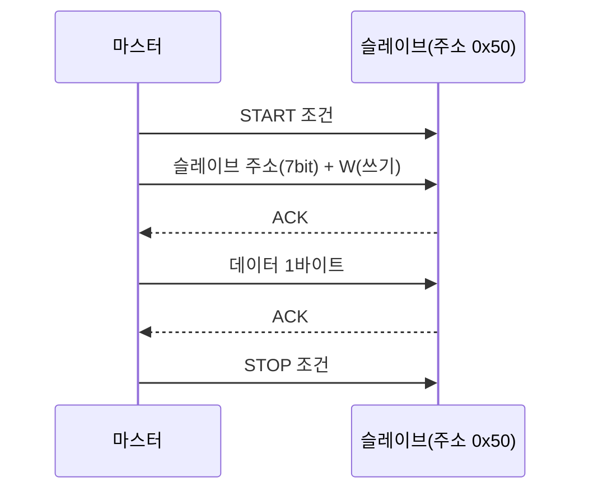

<Callout type="info">
  **이번 문서의 목표:** 이 파일을 다 읽으면 UART·SPI·I2C·CAN 각각의 동작 원리와 프레임 구조를 설명하고, 보율(baud rate)이나 클록 주파수가 주어졌을 때 실제 전송 시간을 계산하며, 네 방식을 배선 수·속도·다중 노드 지원 기준으로 비교해 상황에 맞는 통신 방식을 고를 수 있다.
</Callout>

08~09편에서 GPIO, 타이머, ADC/DAC 같은 MCU 내부·인접 주변장치를 다뤘다면, 이 편에서 다루는 UART·SPI·I2C·CAN은 **MCU가 다른 칩·다른 보드와 데이터를 주고받는 직렬 통신(serial communication)** 방식이다. 넷 다 "선을 몇 개 써서 비트를 어떤 순서로 보낼 것인가"를 다루지만, 설계 목표가 서로 달라 배선 수·속도·다중 기기 지원 방식이 크게 다르다. 이 차이가 독학사 시험에서 가장 자주 묻는 지점이다.

## 왜 이렇게 여러 방식이 있는가

병렬 통신(parallel communication)은 데이터 비트마다 별도의 선을 쓰기 때문에 빠르지만, 비트 수만큼 선이 필요해 배선이 복잡해지고 긴 거리에서는 각 선의 신호 도달 시간 차이(스큐, skew) 때문에 오류가 커진다. **직렬 통신(serial communication**)은 하나(또는 소수)의 선으로 비트를 순서대로 하나씩 보내, 배선은 단순해지는 대신 속도는 병렬보다 느리다. 임베디드 시스템은 배선 단순성과 비용이 중요하므로 대부분 직렬 통신을 쓰며, 용도에 따라 UART, SPI, I2C, CAN 중 하나(또는 여럿)를 골라 쓴다.

> **쉽게 말하면:** 두 칩이 "몇 개의 선으로, 누가 박자를 맞추며, 몇 명까지 한 선에 물릴 수 있는지"를 다르게 정한 네 가지 규칙이 UART·SPI·I2C·CAN이다.

## UART: 박자 없이 약속된 속도로 주고받기

### 정의와 동작 원리

**UART(Universal Asynchronous Receiver/Transmitter, 범용 비동기 송수신기**)는 클록 신호를 별도로 주고받지 않고, 송신 측과 수신 측이 미리 약속한 같은 속도로 비트를 보내고 받는 **비동기(asynchronous)** 방식이다. 클록선이 없으므로 TX(송신)와 RX(수신) 두 선만으로 통신할 수 있다.

클록이 없는데 어떻게 비트가 시작하고 끝나는 시점을 아는가는 **프레임(frame) 구조**로 해결한다.

- **시작 비트(start bit)**: 항상 Low로, "지금부터 데이터가 시작된다"는 신호.
- **데이터 비트(data bits)**: 보통 5~9비트(대개 8비트).
- **패리티 비트(parity bit)**: 선택적으로 추가하는 오류 검출용 비트(짝수/홀수 패리티).
- **정지 비트(stop bit)**: 항상 High로, 프레임의 끝을 알림(1비트 또는 2비트).

수신 측은 시작 비트를 감지한 뒤, 미리 약속된 **보율(baud rate, 초당 심볼 전송 수**)에 맞춰 정해진 시간 간격마다 비트를 읽어 들인다.

> **쉽게 말하면:** 클록선 없이, "이 속도로 보낼게"라고 약속만 해두고 시작·정지 비트로 프레임의 경계를 표시하는 방식이다.

### UART 타이밍 계산 — 전 과정

보율이 9600bps(bits per second)이고, 프레임 구성이 시작 비트 1 + 데이터 비트 8 + 패리티 비트 1 + 정지 비트 1(총 11비트)인 경우를 계산해 보자.

먼저 비트 하나를 전송하는 데 걸리는 시간(bit time)을 구한다.

$$
t_{bit} = \frac{1}{baud} = \frac{1}{9600} \approx 0.0001042\text{초} \approx 104.2\mu s
$$

한 프레임(1바이트)을 전송하려면 이 비트 시간이 11번 반복되어야 한다.

$$
t_{frame} = 11 \times t_{bit} = 11 \times 104.2\mu s \approx 1146\mu s \approx 1.15\text{ms}
$$

**결과 해석**: 9600bps로는 1바이트를 보내는 데 약 1.15ms가 걸린다. 초당 보낼 수 있는 최대 바이트 수는 대략 $9600 / 11 \approx 873$바이트/초다. 보율이 클수록 비트 시간이 짧아져 더 빨리 전송되지만, 배선이 길거나 노이즈가 많으면 송수신 측의 클록 오차가 누적돼 프레임을 놓치기 쉬워진다.

```c
/* UART 폴링 방식 1바이트 송신 예시 */
void uart_send_byte(uint8_t data) {
    while (!(USART1->SR & (1 << 7))) { }   /* 송신 레지스터 빔(TXE) 대기 */
    USART1->DR = data;                      /* 데이터 레지스터에 쓰면 전송 시작 */
}
```

## SPI: 클록을 함께 보내는 빠른 방식

### 정의와 동작 원리

**SPI(Serial Peripheral Interface, 직렬 주변장치 인터페이스**)는 클록선을 함께 두어 송수신 측이 클록에 맞춰 정확히 동기화되는 **동기(synchronous)** 방식이다. 보통 아래 4개의 선을 쓴다.

- **SCLK(Serial Clock)**: 마스터(master)가 만들어 공급하는 클록 신호.
- **MOSI(Master Out Slave In)**: 마스터에서 슬레이브(slave)로 가는 데이터선.
- **MISO(Master In Slave Out)**: 슬레이브에서 마스터로 가는 데이터선.
- **SS/CS(Slave Select/Chip Select)**: 마스터가 통신할 슬레이브를 선택하는 선. 슬레이브 개수만큼 필요하다.

MOSI와 MISO가 따로 있어 **전이중(full-duplex, 양쪽이 동시에 송수신 가능)** 통신이 가능하고, 클록에 맞춰 비트를 주고받으므로 UART보다 훨씬 빠르다. 다만 슬레이브가 늘어날수록 CS 선이 그만큼 늘어난다.

- **CPOL(Clock Polarity)**: 클록이 대기 상태(idle)일 때 High인지 Low인지.
- **CPHA(Clock Phase)**: 클록의 첫 번째 에지(edge)에서 데이터를 샘플링할지, 두 번째 에지에서 할지.

이 두 값의 조합(CPOL/CPHA 각각 0 또는 1)으로 SPI 모드 0~3이 정해지며, 마스터와 슬레이브의 모드가 일치해야 정상적으로 통신된다.

> **쉽게 말하면:** 클록선을 하나 더 깔아서 "지금이 몇 번째 비트인지"를 정확히 맞추는, UART보다 빠르지만 선이 더 필요한 방식이다.

### SPI 타이밍 계산 — 전 과정

SCLK 주파수가 1MHz이고 1바이트(8비트)를 전송하는 경우를 계산해 보자.

클록 한 주기(클록 period)를 먼저 구한다.

$$
t_{clk} = \frac{1}{f_{SCLK}} = \frac{1}{1{,}000{,}000} = 1\mu s
$$

1비트는 클록 1주기마다 전송되므로, 8비트(1바이트)를 보내는 데 걸리는 시간은 다음과 같다.

$$
t_{byte} = 8 \times t_{clk} = 8 \times 1\mu s = 8\mu s
$$

**결과 해석**: SPI는 같은 조건(1MHz)이라면 UART의 비동기 방식보다 프레임 오버헤드(시작·정지 비트)가 없어 순수 데이터 전송 시간이 짧다. 이 때문에 Flash 메모리, 디스플레이, 고속 센서처럼 짧은 시간에 많은 데이터를 옮겨야 하는 장치에 SPI가 자주 쓰인다.

## I2C: 두 선으로 여러 장치를 물리는 방식

### 정의와 동작 원리

**I2C(Inter-Integrated Circuit, 아이투씨**)는 클록선(SCL, Serial Clock)과 데이터선(SDA, Serial Data) 단 두 개만으로 여러 장치를 하나의 버스에 물릴 수 있는 동기식 방식이다. SPI처럼 장치마다 CS선을 두는 대신, 각 슬레이브에 고유한 **주소(address**)를 부여해 마스터가 그 주소를 불러 통신할 상대를 지정한다.

- **시작 조건(START condition)**: SCL이 High인 동안 SDA가 High에서 Low로 떨어지는 신호.
- **주소 프레임**: 7비트(또는 10비트) 슬레이브 주소 + 1비트 읽기/쓰기(R/W) 방향.
- **ACK/NACK**: 수신 측이 한 바이트를 받을 때마다 다음 클록에서 SDA를 Low(ACK, 정상 수신)로 당기거나 High(NACK, 미수신 또는 마지막)로 두어 응답한다.
- **정지 조건(STOP condition)**: SCL이 High인 동안 SDA가 Low에서 High로 올라가는 신호.

두 선을 여러 장치가 공유하므로 배선은 SPI보다 단순해지지만, 속도는 대개 SPI보다 느리다(표준 모드 100kHz, 고속 모드 400kHz, 그 이상의 모드도 존재).

> **쉽게 말하면:** 선 두 개만 깔아두고, 대신 각 장치에 이름표(주소)를 붙여 마스터가 "누구야"하고 부른 뒤 대화하는 방식이다.

### I2C 타이밍 계산 — 전 과정

표준 모드(Standard mode) 클록 주파수 100kHz로 1바이트 데이터를 전송(주소 프레임 뒤에 데이터 1바이트만 보내는 가장 단순한 경우)한다고 하자. 계산 대상 비트는 START/STOP을 제외하고 "주소 7비트 + R/W 1비트 + ACK 1비트 + 데이터 8비트 + ACK 1비트" 총 18비트다.

클록 한 주기를 먼저 구한다.

$$
t_{clk} = \frac{1}{f_{SCL}} = \frac{1}{100{,}000} = 10\mu s
$$

18비트를 전송하는 데 걸리는 시간은 다음과 같다.

$$
t_{transfer} = 18 \times t_{clk} = 18 \times 10\mu s = 180\mu s
$$

**결과 해석**: I2C는 주소 지정과 ACK 확인 절차가 있어 SPI보다 오버헤드가 크고, 클록 주파수 자체도 보통 SPI보다 낮게 설정된다. 대신 배선이 두 개뿐이라 여러 센서를 동시에 연결해야 할 때(온습도 센서, 가속도 센서, EEPROM 등을 한 보드에 여러 개) 배선 효율이 훨씬 좋다.



## CAN: 충돌해도 우선순위로 정리되는 버스

### 정의와 동작 원리

**CAN(Controller Area Network, 캔 통신**)은 여러 노드(node)가 하나의 버스에 동시에 물려 서로 데이터를 방송(broadcast)하는 방식으로, 자동차·산업 제어 분야에서 노이즈가 많은 환경에서도 안정적으로 통신하기 위해 설계됐다. CAN_H, CAN_L 두 선의 **전압 차이(차동 신호, differential signaling**)로 비트를 표현해 외부 노이즈의 영향을 크게 줄인다.

CAN에는 SPI의 CS나 I2C의 마스터 지정 같은 개념이 없다. 대신 모든 노드가 동등하게 버스를 사용하려 시도할 수 있는 **다중 마스터(multi-master)** 구조이며, 둘 이상이 동시에 전송을 시작하면 **중재(arbitration**)로 충돌을 해결한다.

- 각 CAN 프레임은 **식별자(identifier, ID**)를 가지며, ID 값이 작을수록 우선순위가 높다.
- 여러 노드가 동시에 전송을 시작하면, 각 노드는 자신이 보낸 비트와 버스 위의 실제 비트를 비교한다. 우성(dominant, 0)과 열성(recessive, 1) 비트가 부딪히면 우성 비트를 보낸 노드가 승리해 계속 전송하고, 열성 비트를 보내다 충돌을 감지한 노드는 즉시 전송을 멈추고 나중에 재시도한다.
- 이 과정에서 데이터가 파괴되지 않는다는 점이 이더넷 같은 충돌 후 재전송 방식과 다르다. **중재에서 진 노드는 애초에 프레임을 끝까지 보내지 않았을 뿐**이다.

> **쉽게 말하면:** 여러 노드가 동시에 말하려 하면, ID가 낮은(우선순위 높은) 쪽이 자동으로 먼저 말하게 되고 나머지는 조용히 기다리는 버스다.

### CAN 타이밍 감각 — 비트 시간과 프레임 길이

CAN 버스 속도(bit rate)가 500kbps인 경우, 비트 하나의 시간은 다음과 같다.

$$
t_{bit} = \frac{1}{500{,}000} = 2\mu s
$$

표준 CAN 프레임(11비트 ID, Standard Format)은 SOF(Start of Frame), 중재 필드(ID 11비트 + RTR), 제어 필드, 데이터 필드(최대 8바이트=64비트), CRC 필드, ACK 필드, EOF까지 합쳐 대략 44비트의 오버헤드에 데이터 필드가 더해지는 구조다. 데이터 8바이트(64비트)를 꽉 채운 프레임이라면 오버헤드(약 44비트) + 데이터(64비트) = 약 108비트가 되며, 여기에 비트 스터핑(bit stuffing, 같은 값이 5개 연속되면 반대 비트를 하나 끼워 넣는 규칙)으로 인한 약간의 추가 비트가 붙을 수 있다. 대략적인 전송 시간은 다음과 같다.

$$
t_{frame} \approx 108 \times 2\mu s = 216\mu s
$$

**결과 해석**: 정확한 비트 수는 스터핑 여부에 따라 달라지지만, 500kbps CAN에서 8바이트 데이터 프레임 하나를 보내는 데 대략 200µs 안팎이 걸린다는 감각을 잡아두면 시험의 개념형 문항(정확한 프레임 길이를 요구하지 않고 "대략 어느 자릿수인가"를 묻는 유형)에 대응할 수 있다.

## 네 방식 비교


| 구분 | UART | SPI | I2C | CAN |
|---|---|---|---|---|
| 동기 방식 | 비동기(클록선 없음) | 동기(클록선 있음) | 동기(클록선 있음) | 동기(비트 시간 공유, 별도 클록선 없음) |
| 필요 선 수 | 2개(TX, RX) | 최소 4개(SCLK, MOSI, MISO, CS×N) | 2개(SCL, SDA) | 2개(CAN_H, CAN_L) |
| 통신 구조 | 1대1 | 1마스터-N슬레이브(CS로 선택) | 1버스에 여러 장치, 주소로 구분 | 다중 마스터, 모든 노드가 버스 공유 |
| 다중 기기 지원 | 기본적으로 지원 안 함(포트별로 1대1) | CS 선을 늘려야 함 | 쉬움(주소만 다르면 됨) | 매우 쉬움(버스에 그냥 연결) |
| 전형적인 속도 | 수 kbps–수백 kbps | 수 Mbps–수십 Mbps | 100kHz(표준)–수 MHz(고속 모드) | 수십 kbps–1Mbps(Classical CAN 기준) |
| 충돌 처리 | 해당 없음(1대1) | 해당 없음(CS로 배타적 선택) | 멀티마스터 시 중재(간단한 형태) | ID 기반 중재로 우선순위 자동 결정 |
| 오류 검출 | 패리티 비트(선택적) | 별도 규정 없음(상위 프로토콜에 위임) | ACK/NACK | CRC, ACK, 형식 검사 등 강력한 오류 검출 |
| 대표 용도 | 디버그 콘솔, 저속 모듈 통신 | Flash, 디스플레이, 고속 센서 | 다중 저속 센서, EEPROM | 자동차 ECU 간 통신, 산업 제어 |


### 자주 틀리는 점

- **"클록선이 없다 = 느리다"로 단순화**하면 안 된다. UART가 비동기라 느린 것은 맞지만, CAN도 별도 클록선 없이 동기화되며 500kbps 이상도 가능하다 — 동기·비동기 구분과 속도는 별개의 축이다.
- I2C의 "**멀티마스터**"를 CAN의 중재와 똑같은 것으로 착각하기 쉽다. I2C는 마스터가 여러 개일 수 있다는 뜻이고, 실제 충돌 조정 방식은 CAN의 ID 기반 중재와 세부 동작이 다르다.
- SPI에 **슬레이브 주소 개념이 있다고 착각**하는 경우가 있다. SPI는 주소가 아니라 CS 선으로 물리적으로 상대를 선택하는 방식이다.
- CAN에서 **ID가 클수록 우선순위가 높다고 반대로 암기**하는 실수가 잦다. CAN은 ID가 **작을수록** 우선순위가 높다.

## 핵심 정리

- UART는 클록선 없이 약속된 보율과 시작/정지 비트로 프레임 경계를 표시하는 비동기 1대1 통신이며, 전송 시간은 `비트 수 × (1/보율)`로 계산한다.
- SPI는 클록선을 포함해 4개 이상의 선을 쓰는 동기 방식으로 속도가 빠르지만, 슬레이브마다 CS 선이 필요하다.
- I2C는 SCL·SDA 두 선만으로 여러 장치를 주소로 구분해 연결하는 동기 방식이며, ACK/NACK으로 수신 확인을 한다.
- CAN은 CAN_H/CAN_L 차동 신호와 ID 기반 중재로 다중 마스터 버스에서 충돌 없이 우선순위를 자동 결정하는 방식으로, 자동차·산업 제어에 널리 쓰인다.
- 네 방식의 선택 기준은 필요한 속도, 연결할 장치 수, 배선 여유, 노이즈 환경에 따라 달라지며 서로 배타적이지 않고 한 시스템에 함께 쓰이는 경우가 많다.

## 마무리 복습

<Quiz
  questionNumber={1}
  question="UART 통신에서 클록선을 사용하지 않고도 송신과 수신 측이 동기화될 수 있는 이유로 가장 옳은 것은?"
  options={['데이터선이 클록 역할을 겸하기 때문이다', '시작 비트와 정지 비트, 그리고 미리 약속된 보율로 비트의 경계를 판단하기 때문이다', 'UART는 실제로는 동기 통신이기 때문이다', '패리티 비트가 클록 신호를 대신하기 때문이다']}
  correctAnswer={2}
  explanation="UART는 클록선 없이, 시작 비트로 프레임 시작을 알리고 이후 약속된 보율에 따라 정해진 시간 간격으로 비트를 읽어 프레임을 해석하는 비동기 방식이다."
  optionExplanations={['데이터선은 데이터만 실어 나르며 클록 역할을 하지 않는다', 'UART의 핵심 동작 원리를 옳게 설명한 정답이다', 'UART는 정의상 비동기(Asynchronous) 통신이다', '패리티 비트는 오류 검출용이며 클록과는 무관하다']}
/>

<Quiz
  questionNumber={2}
  question="보율(baud rate)이 19200bps이고 프레임이 시작 비트 1 + 데이터 8 + 정지 비트 1(총 10비트)로 구성될 때, 1바이트 전송에 걸리는 시간은?"
  options={['약 52µs', '약 104µs', '약 520µs', '약 1040µs']}
  correctAnswer={3}
  explanation="비트 시간은 1/19200≈52.1µs이며, 10비트 프레임이므로 10×52.1µs≈521µs≈약 520µs이다."
  optionExplanations={['비트 시간(1비트) 자체와 비슷한 값으로, 프레임 전체 시간이 아니다', '9600bps 기준 비트 시간(104µs)과 혼동한 값이다', '비트 시간 10개를 곱한 정답이다', '20비트로 잘못 계산했을 때 나오는 값과 유사하다']}
/>

<Quiz
  questionNumber={3}
  question="SPI에 대한 설명으로 옳지 않은 것은?"
  options={['MOSI와 MISO가 분리되어 있어 전이중(full-duplex) 통신이 가능하다', 'CPOL과 CPHA의 조합으로 SPI 동작 모드가 결정된다', '슬레이브를 추가로 연결하려면 별도의 CS 선이 필요하다', '슬레이브를 구분하기 위해 7비트 주소를 사용한다']}
  correctAnswer={4}
  explanation="SPI는 주소가 아니라 CS(칩 선택) 선으로 상대 슬레이브를 물리적으로 선택한다. 7비트 주소를 사용하는 것은 I2C의 방식이므로 이 설명은 틀렸다."
  optionExplanations={['SPI가 MOSI·MISO를 분리해 전이중 통신을 지원한다는 옳은 설명이다', 'CPOL/CPHA 조합이 SPI 모드를 결정한다는 옳은 설명이다', 'SPI는 슬레이브마다 별도의 CS 선이 필요하다는 옳은 설명이다', 'SPI는 주소 지정 방식이 아니라 CS 선으로 슬레이브를 선택하므로 이 설명이 틀렸다 — 정답']}
/>

<Quiz
  questionNumber={4}
  question="I2C 통신에서 ACK(Acknowledge)의 역할로 가장 옳은 것은?"
  options={['버스의 클록 속도를 자동으로 조절한다', '수신 측이 한 바이트를 정상적으로 받았음을 송신 측에 알린다', '슬레이브의 고유 주소를 결정한다', 'START 조건과 STOP 조건을 구분한다']}
  correctAnswer={2}
  explanation="ACK는 수신 측이 한 바이트를 받을 때마다 다음 클록에서 SDA를 Low로 당겨 정상 수신을 알리는 신호다."
  optionExplanations={['클록 속도 조절은 ACK의 역할이 아니다', 'ACK/NACK의 역할을 옳게 설명한 정답이다', '슬레이브 주소는 설계 시 고정되어 부여되며 ACK와 무관하다', 'START/STOP 조건은 SDA와 SCL의 조합으로 별도로 정의된다']}
/>

<Quiz
  questionNumber={5}
  question="CAN 통신에서 서로 다른 두 노드가 동시에 전송을 시작했을 때 일어나는 일로 가장 옳은 것은?"
  options={['먼저 전송을 시작한 노드가 항상 승리한다', 'ID 값이 더 큰 노드가 우선순위를 가져 승리한다', 'ID 값이 더 작은 노드가 우선순위를 가져 승리하고, 진 노드는 즉시 전송을 멈춘다', '두 프레임이 모두 손상되어 두 노드 모두 처음부터 재전송해야 한다']}
  correctAnswer={3}
  explanation="CAN은 ID가 작을수록 우선순위가 높으며, 중재 과정에서 우성 비트를 보낸 노드가 계속 전송하고 열성 비트를 보내다 충돌을 감지한 노드는 데이터가 손상되지 않은 채로 전송을 멈춘다."
  optionExplanations={['CAN의 중재는 시작 시점이 아니라 ID(우선순위)로 결정된다', 'CAN은 ID 값이 작을수록 우선순위가 높다 — 반대로 서술된 오답이다', 'CAN 중재의 핵심 원리를 옳게 설명한 정답이다', 'CAN의 중재는 데이터 손상 없이 진행되므로 재전송이 필요한 충돌 방식이 아니다']}
/>

<Quiz
  questionNumber={6}
  question="UART, SPI, I2C, CAN 네 방식의 비교로 옳지 않은 것은?"
  options={['I2C는 SCL과 SDA 두 선만으로 여러 장치를 주소로 구분해 연결할 수 있다', 'SPI는 슬레이브 수가 늘어날수록 CS 선의 개수도 함께 늘어난다', 'CAN은 모든 노드가 버스를 공유하는 다중 마스터 구조다', 'UART는 클록선이 없으므로 네 방식 중 가장 빠른 통신 속도를 낼 수 있다']}
  correctAnswer={4}
  explanation="UART는 비동기 방식이라 오버헤드(시작·정지 비트)가 있고 전형적인 속도도 SPI·CAN보다 낮은 편이다. 클록선이 없다는 것과 속도가 빠르다는 것은 관계가 없으므로 이 설명이 틀렸다."
  optionExplanations={['I2C의 배선·주소 방식을 옳게 설명한 문장이다', 'SPI의 슬레이브 확장 방식을 옳게 설명한 문장이다', 'CAN의 다중 마스터 구조를 옳게 설명한 문장이다', '클록선 유무와 속도는 별개이며 UART가 가장 느린 편에 속하므로 이 설명이 틀렸다 — 정답']}
/>

<Quiz
  questionNumber={7}
  question="I2C 표준 모드(100kHz)에서 클록 한 주기(1비트 시간)는 얼마인가?"
  options={['1µs', '2.5µs', '10µs', '100µs']}
  correctAnswer={3}
  explanation="클록 한 주기는 1/f=1/100,000=10µs이다."
  optionExplanations={['1MHz 클록 기준 주기와 혼동한 값이다', '400kHz 근처 값을 어림잡아 잘못 계산한 값이다', '1/100kHz를 정확히 계산한 정답이다', '단위 환산에서 자릿수를 잘못 옮긴 값이다']}
/>

## 참고 자료

- [ARM Cortex-M resources](https://developer.arm.com/community/arm-community-blogs/b/architectures-and-processors-blog/posts/cortex-m-resources)
- [ARM MCU Resources - Documentation](https://community.arm.com/arm-community-blogs/b/architectures-and-processors-blog/posts/arm-mcu-resources---documentation)
