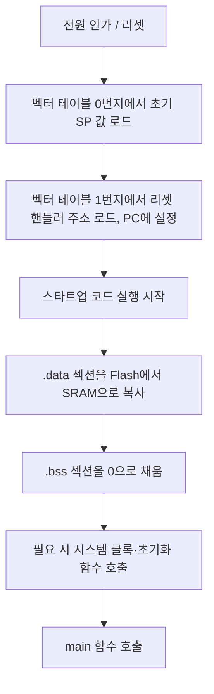
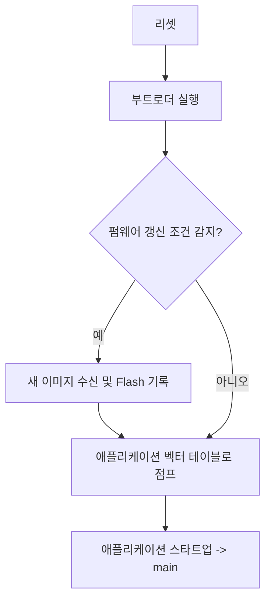
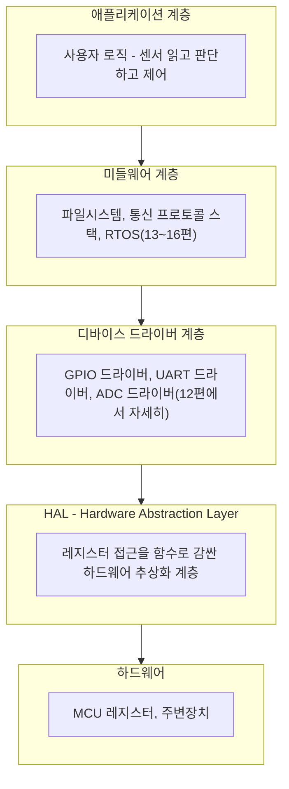

<Callout type="info">
  **이번 문서의 목표:** 이 파일을 다 읽으면 크로스 개발이 필요한 이유와 툴체인 구성 요소를 설명하고, 소스 코드가 컴파일·링크되어 실행 파일이 되는 과정과 전원이 켜진 뒤 `main` 함수에 도달하기까지의 스타트업 과정을 순서대로 설명하며, 부트로더와 애플리케이션의 역할 차이, 펌웨어의 계층 구조를 구분할 수 있다.
</Callout>

지금까지 07~10편에서 메모리 맵, GPIO·타이머, PWM·ADC·DMA, UART·SPI·I2C·CAN 같은 **하드웨어 관점**의 주변장치를 다뤘다. 이 편부터는 관점을 바꿔, 그 하드웨어 위에서 **소프트웨어가 어떻게 만들어지고, 전원이 켜진 뒤 어떤 순서로 실행되기 시작하는지**를 다룬다. 04편의 MCU 개념, 07편의 메모리 맵을 기반으로 이해한다.

## 크로스 개발: 내가 쓰는 컴퓨터와 실행될 컴퓨터가 다르다

### 왜 필요한가

일반 데스크톱 프로그램은 개발할 때 쓰는 컴퓨터(호스트, host)와 그 프로그램이 실제로 돌아가는 컴퓨터가 대개 같은 아키텍처(x86 등)다. 하지만 임베디드 개발에서는 개발자가 쓰는 PC(대부분 x86 아키텍처)와 실제로 프로그램이 돌아갈 MCU(대부분 ARM Cortex-M 아키텍처)가 **명령어 집합(instruction set) 자체가 다르다.** PC의 컴파일러가 만든 x86 기계어는 ARM MCU에서 실행할 수 없다.

> **쉽게 말하면:** 한국어(PC)로 대본을 쓰고, 실제 공연은 영어(MCU)로 해야 하니, 처음부터 영어 대본을 만들어주는 통역 도구가 필요하다.

이 문제를 해결하는 것이 **크로스 개발(cross development**)이다. 개발이 이루어지는 컴퓨터를 **호스트(host)**, 프로그램이 실제로 실행될 컴퓨터를 **타깃(target**)이라 부르고, 호스트에서 실행되지만 타깃용 기계어를 만들어내는 컴파일러를 **크로스 컴파일러(cross-compiler**)라고 한다. 예를 들어 `arm-none-eabi-gcc`는 x86 PC에서 실행되는 프로그램이지만, 그 출력물은 ARM Cortex-M이 실행할 수 있는 기계어다.

### 툴체인의 구성 요소

**툴체인(toolchain**)은 소스 코드를 실행 가능한 이미지로 만드는 데 필요한 도구 모음을 통칭한다. 임베디드 개발의 전형적인 툴체인은 다음 도구들로 구성된다.

- **크로스 컴파일러(cross-compiler)**: C/C++ 소스 코드를 타깃 아키텍처의 어셈블리 코드로 번역한다.
- **어셈블러(assembler)**: 어셈블리 코드를 오브젝트 파일(기계어에 가까운 중간 형태)로 변환한다.
- **링커(linker)**: 여러 오브젝트 파일과 라이브러리를 하나로 묶고, 각 코드·데이터가 실제 메모리의 어느 주소에 놓일지 배치를 확정해 최종 실행 이미지를 만든다.
- **오브젝트 파일 변환기(objcopy 등)**: 링커가 만든 ELF(Executable and Linkable Format) 파일을 MCU에 실제로 구울 수 있는 바이너리(`.bin`)나 인텔 헥스(`.hex`) 형식으로 변환한다.
- **디버거(debugger)**: JTAG/SWD(18편에서 다룬다)를 통해 타깃 MCU에 실행 이미지를 올리고, 브레이크포인트로 실행을 멈추거나 레지스터·메모리 값을 들여다본다.


## 링커와 메모리 섹션: 코드와 데이터를 메모리에 배치하기

### 왜 필요한가

07편에서 다뤘듯 MCU의 메모리는 Flash(비휘발성, 프로그램 저장용)와 SRAM(휘발성, 실행 중 변수 저장용)으로 나뉘어 있고 각각 정해진 주소 범위를 가진다. 컴파일러가 만든 코드와 변수들은 이 두 메모리 중 어디에 놓여야 할지 구분되어야 하는데, 이 배치 규칙을 정하는 것이 **링커 스크립트(linker script**)다.

> **쉽게 말하면:** 컴파일러가 "이 코드, 이 변수들을 만들었다"고 알려주면, 링커는 "그럼 코드는 Flash 몇 번지부터, 변수는 SRAM 몇 번지부터 놓을게"라고 실제 주소를 정해주는 역할이다.

### 주요 메모리 섹션

C 프로그램이 컴파일되면 아래와 같은 섹션(section)으로 나뉘어 관리된다.


| 섹션 이름 | 내용물 | 놓이는 곳(실행 시) | 특징 |
|---|---|---|---|
| `.text` | 함수의 실제 기계어 코드 | Flash | 실행 중 값이 바뀌지 않는다 |
| `.rodata` | `const`로 선언된 읽기 전용 데이터, 문자열 리터럴 | Flash | 읽기 전용 |
| `.data` | 초기값이 있는 전역·정적 변수(예: `int count = 5;`) | SRAM(단, 초깃값은 Flash에도 저장) | 실행 중 값이 바뀔 수 있다 |
| `.bss` | 초기값이 없거나 0으로 초기화되는 전역·정적 변수(예: `int flag;`) | SRAM | Flash에 실제 값을 저장할 필요가 없어 이미지 크기를 줄인다 |
| 스택(stack) | 함수 호출 시 지역 변수, 복귀 주소 | SRAM(보통 위쪽 끝에서 아래로 자람) | 링커 스크립트가 아니라 실행 중 CPU가 관리 |
| 힙(heap) | `malloc` 등으로 동적 할당된 메모리 | SRAM(보통 아래쪽에서 위로 자람) | 임베디드에서는 사용을 제한하거나 아예 쓰지 않는 경우가 많다 |


`.data`가 조금 특이한 이유는, **초깃값 자체는 전원이 꺼져도 사라지면 안 되므로 Flash에 저장**해두어야 하지만, 실행 중에는 빠르고 값이 바뀔 수 있는 SRAM에 있어야 하기 때문이다. 그래서 `.data`는 Flash에 초깃값 사본(로드 주소, LMA)을 갖고 있다가, 스타트업 코드가 실행되면서 이 값을 SRAM(실행 주소, VMA)으로 복사한다.

```c
/* 링커 스크립트 개념 예시 - 실제 문법은 툴체인마다 다르다 */
MEMORY
{
    FLASH (rx)  : ORIGIN = 0x08000000, LENGTH = 512K
    SRAM  (rwx) : ORIGIN = 0x20000000, LENGTH = 128K
}

SECTIONS
{
    .text : { *(.text) } > FLASH
    .rodata : { *(.rodata) } > FLASH
    .data : { *(.data) } > SRAM AT> FLASH  /* SRAM에 실행, 초깃값은 FLASH에 보관 */
    .bss : { *(.bss) } > SRAM
}
```

## 스타트업 코드: 전원이 켜진 뒤 `main`에 도달하기까지

### 왜 필요한가

C 프로그램은 `main` 함수부터 시작한다고 배우지만, 사실 전원이 켜진 직후 CPU는 `main`이 어디 있는지조차 모른다. **`main`을 부르기 전에 메모리를 사람이 기대하는 상태로 미리 정리해주는 코드**가 필요한데, 이것이 **스타트업 코드(startup code**)다.

> **쉽게 말하면:** `main`이 "변수들이 이미 올바른 초깃값을 가지고 있다"고 믿고 시작할 수 있도록, 그 믿음이 사실이 되게 미리 청소하고 세팅해두는 코드다.

### 부팅 순서 — 전 과정

ARM Cortex-M 계열은 05편에서 다룬 벡터 테이블(vector table)의 맨 앞 두 워드(word)에 **초기 스택 포인터(initial stack pointer) 값**과 **리셋 핸들러(reset handler)의 주소**를 갖고 있다. 전원이 켜지거나 리셋되면 CPU는 다음 순서로 동작한다.



1. **초기 스택 포인터 설정**: 벡터 테이블의 첫 워드 값을 스택 포인터(SP) 레지스터에 로드한다. 이 값이 잘못되면 함수 호출 자체가 불가능해진다.
2. **리셋 핸들러로 분기**: 벡터 테이블의 두 번째 워드에 있는 주소로 프로그램 카운터(PC)가 이동한다. 이 코드가 바로 스타트업 코드의 진입점이다.
3. **`.data` 복사**: Flash에 저장된 `.data`의 초깃값을 SRAM의 실제 변수 위치로 복사한다. 이 과정이 없으면 `int count = 5;`가 실행 중에 쓰레기값을 가질 수 있다.
4. **`.bss` 초기화**: 초깃값이 없는 전역 변수 영역을 전부 0으로 채운다. C 표준이 "초기화하지 않은 전역 변수는 0으로 시작한다"고 보장하는 부분이 바로 이 단계에서 구현된다.
5. **시스템 초기화**: 필요하다면 클록 트리 설정, FPU(부동소수점 유닛) 활성화 같은 하드웨어 초기화 함수를 호출한다.
6. **`main` 호출**: 이제야 비로소 `main` 함수를 호출한다. 이 시점에는 모든 전역 변수가 개발자가 기대한 값으로 준비되어 있다.

```c
/* 스타트업 코드가 하는 일을 C로 흉내 낸 의사코드 */
void Reset_Handler(void) {
    extern uint32_t _sidata, _sdata, _edata, _sbss, _ebss;
    uint32_t *src = &_sidata;   /* Flash에 있는 .data 초깃값 시작 주소 */
    uint32_t *dst = &_sdata;    /* SRAM에 있는 .data 실제 주소 */

    while (dst < &_edata) {     /* .data를 Flash에서 SRAM으로 복사 */
        *dst++ = *src++;
    }
    dst = &_sbss;
    while (dst < &_ebss) {      /* .bss를 0으로 채움 */
        *dst++ = 0;
    }
    SystemInit();                /* 클록 등 초기화(있다면) */
    main();                      /* 이제 main 호출 */
}
```

### 자주 틀리는 점

- **"전원이 켜지면 바로 `main`이 실행된다"는 오해**가 가장 흔하다. 실제로는 벡터 테이블 → 리셋 핸들러 → `.data`/`.bss` 정리 → `main` 순서를 거친다.
- `.bss`는 **"초깃값이 없다"와 "메모리를 안 쓴다"를 혼동**하기 쉽다. `.bss`도 실행 중에는 SRAM 공간을 차지하지만, Flash 이미지 크기에는 포함되지 않을 뿐이다.
- 스택이 다른 데이터 영역을 침범하는 **스택 오버플로(stack overflow**)는 임베디드에서 특히 치명적이다. 힙과 스택이 서로를 향해 자라도록 배치하는 것도 이 문제를 완화하기 위한 설계다.

## 부트로더: 애플리케이션을 실행하기 전에 먼저 도는 작은 프로그램

### 정의와 역할

**부트로더(bootloader**)는 MCU가 리셋된 직후 가장 먼저 실행되는, 애플리케이션과는 별도로 존재하는 작은 프로그램이다. 스타트업 코드가 "`main`에 도달하기 위한 메모리 준비 과정"이라면, 부트로더는 그보다 한 단계 위에서 **"어떤 애플리케이션을 실행할지, 혹은 새 애플리케이션으로 갱신할지"를 결정하는 관리자** 역할을 한다.

> **쉽게 말하면:** 애플리케이션을 실행하기 전에 먼저 켜져서 "새 프로그램이 도착했으면 그걸로 바꿔 끼우고, 아니면 원래 있던 프로그램을 실행해줘"라고 판단하는 작은 관리 프로그램이다.

전형적인 부트로더의 동작은 다음과 같다.

1. 리셋 후 부트로더 자신이 먼저 실행된다(Flash의 가장 낮은 주소에 위치).
2. 특정 조건(버튼 입력, 통신으로 새 펌웨어 수신 신호, 특정 플래그 값)을 확인해 **펌웨어 갱신 모드**로 들어갈지 판단한다.
3. 갱신 모드가 아니라면, Flash의 다른 영역(애플리케이션 영역)에 저장된 벡터 테이블 주소로 **점프(jump**)해 애플리케이션 스타트업 코드를 실행시킨다.
4. 갱신 모드라면 UART·USB·CAN 등을 통해 새 펌웨어 이미지를 받아 Flash에 기록한 뒤, 성공하면 애플리케이션으로 점프한다.



부트로더가 있는 시스템은 Flash 메모리를 **부트로더 영역**과 **애플리케이션 영역**으로 나누어 관리하며, 두 영역은 각자 독립된 벡터 테이블과 링커 스크립트를 갖는다. 애플리케이션 영역의 벡터 테이블 시작 주소가 부트로더 시작 주소와 다르므로, 애플리케이션 쪽 링커 스크립트에서는 벡터 테이블 오프셋을 별도로 지정해줘야 한다.

### 자주 틀리는 점

- 부트로더가 없어도 시스템은 동작한다 — **부트로더는 필수 구성 요소가 아니라, 현장에서 펌웨어를 갱신해야 하는 경우에 필요한 선택적 계층**이다. 작은 시스템은 부트로더 없이 애플리케이션이 리셋 직후 벡터 테이블 0번지에서 바로 시작하기도 한다.
- 부트로더의 "점프"를 함수 호출과 혼동하면 안 된다. 부트로더가 애플리케이션으로 넘어갈 때는 스택 포인터를 애플리케이션의 초기 SP 값으로 다시 설정하고, 벡터 테이블 위치도 애플리케이션 것으로 재지정해야 한다 — 단순히 애플리케이션의 `main` 주소로 점프하는 것만으로는 부족하다.

## 펌웨어의 계층 구조

실제 임베디드 소프트웨어는 하드웨어 레지스터를 직접 만지는 코드부터 사용자 로직까지 여러 층으로 나뉘어 있다. 층을 나누는 이유는 **상위 계층이 하드웨어 세부사항을 몰라도 되게 해서, MCU를 바꾸더라도 상위 코드의 수정을 최소화하기 위함**이다.



- **HAL(Hardware Abstraction Layer, 하드웨어 추상화 계층)**: 레지스터를 직접 건드리는 대신 `GPIO_SetPin()`처럼 함수 이름으로 하드웨어를 조작하게 해준다.
- **디바이스 드라이버(device driver)**: HAL 위에서 특정 주변장치(UART, ADC 등)의 초기화·읽기·쓰기 로직을 묶어 제공한다. 12편에서 자세히 다룬다.
- **미들웨어(middleware)**: 파일시스템, 통신 프로토콜 스택, RTOS(13~16편에서 다룬다)처럼 여러 애플리케이션이 공통으로 쓰는 서비스 계층이다.
- **애플리케이션(application)**: 실제 제품의 목적(온도를 재서 팬을 돌린다 등)을 구현하는 최상위 로직이다.

계층이 잘 나뉘어 있으면, 예를 들어 MCU를 다른 제조사 칩으로 바꾸더라도 HAL과 드라이버만 새로 맞추면 되고, 미들웨어와 애플리케이션 코드는 거의 그대로 재사용할 수 있다.

## 핵심 정리

- 크로스 개발은 호스트(개발 PC)와 타깃(MCU)의 아키텍처가 다르기 때문에 필요하며, 크로스 컴파일러·어셈블러·링커·objcopy·디버거로 이어지는 툴체인이 소스 코드를 실행 이미지로 만든다.
- 링커는 `.text`(코드), `.rodata`(읽기 전용 데이터), `.data`(초기화된 변수), `.bss`(초기화되지 않은 변수)를 Flash와 SRAM의 실제 주소에 배치하며, 이 규칙은 링커 스크립트로 지정한다.
- 전원이 켜지면 벡터 테이블에서 초기 스택 포인터와 리셋 핸들러 주소를 읽고, 스타트업 코드가 `.data`를 SRAM으로 복사하고 `.bss`를 0으로 채운 뒤에야 `main`이 호출된다.
- 부트로더는 애플리케이션과 별도로 존재하며, 펌웨어 갱신 여부를 판단해 새 이미지를 받아 기록하거나 기존 애플리케이션으로 점프하는 관리자 역할을 한다.
- 펌웨어는 HAL → 디바이스 드라이버 → 미들웨어 → 애플리케이션 순으로 계층화되어, 하드웨어 변경의 영향을 하위 계층에 가두는 것이 목표다.

## 마무리 복습

<Quiz
  questionNumber={1}
  question="임베디드 개발에서 크로스 컴파일러가 필요한 근본적인 이유는?"
  options={['MCU가 C 언어를 이해하지 못하기 때문이다', '개발 PC와 MCU의 명령어 집합(아키텍처)이 다르기 때문이다', 'MCU에는 운영체제가 없기 때문이다', '디버거를 사용하려면 반드시 크로스 컴파일러가 필요하기 때문이다']}
  correctAnswer={2}
  explanation="개발 PC(호스트, 대개 x86)와 MCU(타깃, 대개 ARM)는 명령어 집합 자체가 다르므로, 호스트에서 실행되면서 타깃용 기계어를 만들어내는 크로스 컴파일러가 필요하다."
  optionExplanations={['MCU는 C로 컴파일된 기계어를 실행할 뿐, C 언어 자체를 이해할 필요는 없다', '아키텍처 차이가 크로스 컴파일이 필요한 근본 이유다 — 정답', 'RTOS나 GPOS의 유무와 크로스 컴파일 필요성은 별개의 문제다', '디버거는 크로스 컴파일과 별도의 도구이며, 필요 이유가 다르다']}
/>

<Quiz
  questionNumber={2}
  question="다음 중 .bss 섹션에 대한 설명으로 옳은 것은?"
  options={['초기화 값이 있는 전역 변수를 저장하며 Flash에 초깃값 사본을 둔다', '함수의 실제 기계어 코드가 저장되는 영역이다', '초깃값이 없거나 0으로 초기화되는 전역·정적 변수가 저장되며, Flash 이미지 크기에는 포함되지 않는다', 'const로 선언된 읽기 전용 데이터가 저장되는 영역이다']}
  correctAnswer={3}
  explanation=".bss는 초기화되지 않은(또는 0으로 초기화되는) 전역·정적 변수를 위한 SRAM 공간이며, 실제 값을 Flash에 저장할 필요가 없어 이미지 크기를 줄여준다."
  optionExplanations={['이 설명은 .data 섹션에 대한 설명이다', '이 설명은 .text 섹션에 대한 설명이다', '.bss의 정의와 특징을 옳게 설명한 정답이다', '이 설명은 .rodata 섹션에 대한 설명이다']}
/>

<Quiz
  questionNumber={3}
  question="전원이 켜진 뒤 main 함수가 호출되기까지의 순서로 옳은 것은?"
  options={['main 호출 -> 벡터 테이블 로드 -> .data 복사 -> .bss 초기화', '벡터 테이블 로드 -> .data 복사 -> .bss 초기화 -> main 호출', '.bss 초기화 -> 벡터 테이블 로드 -> .data 복사 -> main 호출', '.data 복사 -> 벡터 테이블 로드 -> main 호출 -> .bss 초기화']}
  correctAnswer={2}
  explanation="리셋 후 벡터 테이블에서 초기 SP와 리셋 핸들러 주소를 읽고, 스타트업 코드가 .data를 SRAM으로 복사한 뒤 .bss를 0으로 채우고, 마지막으로 main을 호출한다."
  optionExplanations={['main은 메모리 준비가 끝난 뒤 마지막에 호출되어야 한다', '부팅 순서를 옳게 나열한 정답이다', '벡터 테이블 로드가 가장 먼저 일어나야 리셋 핸들러 자체를 실행할 수 있다', '벡터 테이블을 읽기 전에는 어떤 코드도 실행될 수 없으므로 순서가 맞지 않는다']}
/>

<Quiz
  questionNumber={4}
  question="부트로더(bootloader)에 대한 설명으로 옳지 않은 것은?"
  options={['모든 임베디드 시스템에 반드시 있어야 하는 필수 구성 요소다', '현장에서 펌웨어를 갱신해야 하는 시스템에서 흔히 사용된다', '애플리케이션으로 넘어갈 때는 스택 포인터와 벡터 테이블 위치를 애플리케이션 것으로 재설정해야 한다', 'Flash 메모리를 부트로더 영역과 애플리케이션 영역으로 나누어 관리한다']}
  correctAnswer={1}
  explanation="부트로더는 필수 구성 요소가 아니라 펌웨어 현장 갱신이 필요한 경우에 추가하는 선택적 계층이다. 작은 시스템은 부트로더 없이 리셋 즉시 애플리케이션 벡터 테이블부터 시작하기도 한다."
  optionExplanations={['부트로더는 선택적 구성 요소이므로 이 설명이 틀렸다 — 정답', '부트로더의 대표적인 용도를 옳게 설명한 문장이다', '부트로더가 애플리케이션으로 점프할 때 필요한 절차를 옳게 설명한 문장이다', '부트로더가 있는 시스템의 전형적인 Flash 구성을 옳게 설명한 문장이다']}
/>

<Quiz
  questionNumber={5}
  question="펌웨어의 계층 구조에서 HAL(Hardware Abstraction Layer)의 역할로 가장 옳은 것은?"
  options={['RTOS의 태스크 스케줄링을 담당한다', '레지스터를 직접 다루는 대신 함수 호출로 하드웨어를 조작할 수 있게 해준다', '사용자의 최종 제품 로직을 구현한다', '펌웨어 갱신 여부를 판단해 새 이미지를 받는다']}
  correctAnswer={2}
  explanation="HAL은 레지스터 접근을 함수로 감싸 상위 계층이 하드웨어 세부사항을 몰라도 되게 해주는 하드웨어 추상화 계층이다."
  optionExplanations={['태스크 스케줄링은 미들웨어 계층의 RTOS가 담당하는 역할이다', 'HAL의 정의를 옳게 설명한 정답이다', '최종 제품 로직은 애플리케이션 계층의 역할이다', '펌웨어 갱신 판단은 부트로더의 역할이다']}
/>

<Quiz
  questionNumber={6}
  question=".data 섹션이 Flash와 SRAM 양쪽에 관련되는 이유로 가장 옳은 것은?"
  options={['컴파일러의 버그로 인해 어쩔 수 없이 중복 저장되기 때문이다', '초깃값은 전원이 꺼져도 유지되어야 하므로 Flash에 두고, 실행 중에는 값이 바뀔 수 있어야 하므로 SRAM에 복사해 사용하기 때문이다', 'SRAM 용량이 부족할 때만 Flash를 함께 사용하기 때문이다', '링커가 임의로 두 곳에 나눠 저장하며 실질적인 이유는 없다']}
  correctAnswer={2}
  explanation=".data는 초기화된 전역 변수를 담는데, 초깃값 자체는 비휘발성인 Flash에 보관해야 전원이 꺼져도 사라지지 않고, 실행 중에는 값이 바뀔 수 있어야 하므로 휘발성이지만 빠른 SRAM으로 복사해 사용한다."
  optionExplanations={['이는 컴파일러 버그가 아니라 의도된 설계다', '.data가 Flash와 SRAM 양쪽에 관련되는 이유를 옳게 설명한 정답이다', 'SRAM 용량과 무관하게 항상 이 방식으로 동작한다', '이 배치는 링커 스크립트에 명시된 의도적인 설계다']}
/>

## 참고 자료

- [Cortex-M4 Technical Reference Manual](https://documentation-service.arm.com/static/5f19da2a20b7cf4bc524d99a)
- [CMSIS-Core (Cortex-M): Overview](https://arm-software.github.io/CMSIS_6/latest/Core/index.html)
