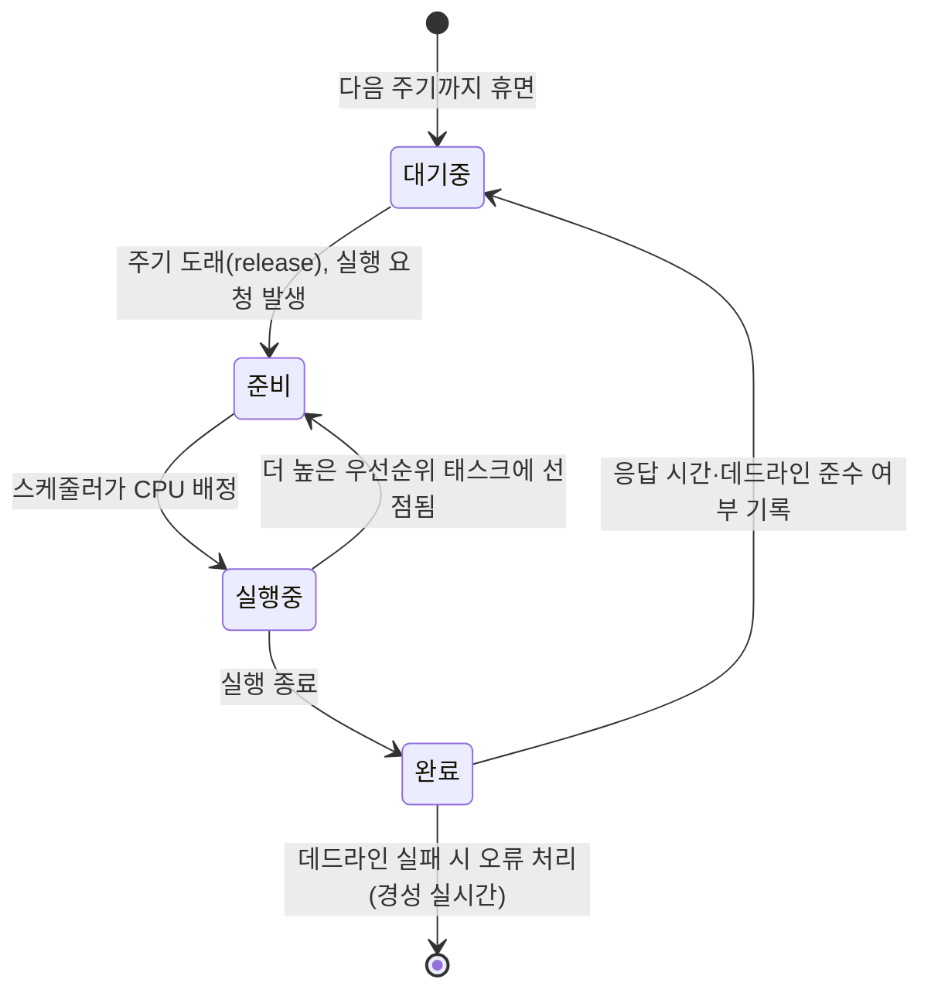

<Callout type="info">
  **이번 문서의 목표:** 이 파일을 다 읽으면 hard·soft·firm 실시간 시스템을 판별 기준으로 구분하고, 태스크의 주기·실행 시간·데드라인·응답 시간·지터를 숫자로 계산하며, "실시간 = 빠른 시스템"이라는 흔한 오해를 논리로 반박할 수 있다.
</Callout>

## 왜 "정답의 시각"까지 채점하는 시스템이 필요한가

01편에서 임베디드 시스템의 핵심 제약으로 **실시간성**(real-time)을 예고했고, 03편에서 임베디드 시스템의 정의와 제약을 다뤘습니다. 이번 편부터는 그 실시간성을 본격적으로 파고듭니다.

일반적인 데스크톱 프로그램에서 "정답"은 오직 **결과값이 맞는가**로 결정됩니다. 계산기 앱이 2+2를 계산하는 데 1밀리초가 걸리든 1초가 걸리든, 결과가 4이기만 하면 사용자는 크게 신경 쓰지 않습니다. 그런데 자동차의 에어백 제어기를 생각해 봅시다. 충돌 감지 센서가 신호를 보낸 뒤 에어백이 "언젠가는" 펼쳐지는 것으로는 부족합니다. 충돌 후 수십 밀리초 안에 펼쳐지지 않으면, 계산 자체는 정확했더라도 사람을 보호하지 못해 **시스템은 실패한 것**입니다.

**실시간 시스템**(real-time system)은 이렇게 계산 결과의 논리적 정확성뿐 아니라, **그 결과가 나오는 시각**까지 정답의 일부로 취급하는 시스템입니다. 국제적으로 널리 쓰이는 정의를 풀어 쓰면 다음과 같습니다.

> **쉽게 말하면:** 일반 시스템의 정답은 "무엇을(what)"만 맞으면 되지만, 실시간 시스템의 정답은 "무엇을, 언제까지(when)"까지 맞아야 합니다.

## 1. hard·soft·firm 실시간 — 데드라인을 놓쳤을 때 무슨 일이 벌어지는가

실시간 시스템은 하나의 종류가 아닙니다. **데드라인**(deadline, 결과가 나와야 하는 마감 시각)을 놓쳤을 때 그 대가가 얼마나 심각한지에 따라 세 종류로 나눕니다. 이 구분은 독학사 시험에서 "다음 중 hard real-time의 예로 옳은 것은?" 유형으로 자주 나옵니다.

- **경성 실시간**(hard real-time): 데드라인을 단 한 번이라도 놓치면 **시스템 전체가 실패**로 간주됩니다. 결과가 아무리 논리적으로 정확해도, 늦게 도착한 결과는 무가치하거나 오히려 위험합니다. 예: 에어백 전개, 항공기 비행 제어, 원자로 안전 정지, 공장 로봇팔의 충돌 회피.
- **연성 실시간**(soft real-time): 데드라인을 가끔 놓쳐도 시스템이 완전히 망가지지는 않지만, **품질(QoS)이 점진적으로 나빠집니다.** 예: 동영상 스트리밍의 프레임 지연, 온라인 게임의 입력 지연, 음성 통화의 패킷 지연.
- **강성 실시간**(firm real-time): 데드라인을 놓친 결과는 **아무 가치가 없어 그냥 버려지지만**, 그렇다고 시스템 전체가 안전 문제로 이어지지는 않습니다. 예: 주가 시세 갱신(늦은 시세는 버림), 방송 자막 동기화 데이터.

> **쉽게 말하면:** hard는 "늦으면 사고", soft는 "늦으면 불편", firm은 "늦으면 그 결과는 버리지만 사고는 아님"입니다.

| 구분 | 데드라인을 놓쳤을 때 | 결과의 가치 | 예시 |
|------|------|------|------|
| 경성(hard) | 시스템 실패로 간주 | 늦은 결과는 무가치를 넘어 위험할 수 있음 | 에어백, 비행 제어, 원자로 정지 |
| 연성(soft) | 품질 저하(누적되면 체감) | 늦은 결과도 어느 정도 가치가 있음 | 동영상 스트리밍, 화상 통화 |
| 강성(firm) | 그 결과만 폐기 | 늦은 결과는 가치가 0이지만 시스템은 안전 | 주가 시세, 방송 자막 |

**자주 틀리는 점**: "실시간 시스템은 무조건 빠른 시스템이다"는 진술은 틀렸습니다. 실시간 시스템의 핵심은 속도의 절댓값이 아니라 **정해진 데드라인을 예측 가능하게(deterministically) 지키는 것**입니다. 데드라인이 500밀리초로 널널해도 그 500밀리초를 단 한 번도 어기지 않는다면 hard real-time이 될 수 있고, 반대로 평균 응답이 1밀리초로 매우 빨라도 가끔 데드라인을 넘긴다면 hard real-time 요구사항을 만족하지 못합니다. "빠른 컴퓨터"와 "제때 답하는 컴퓨터"는 다른 목표입니다.

## 2. 태스크 — 실시간 시스템이 반복해서 처리하는 일의 단위

RTOS(Real-Time Operating System)에서 스케줄링과 자원 배분의 대상이 되는 실행 단위를 **태스크**(task)라고 부릅니다. 08편에서 배운 프로세스·스레드와 성격이 비슷하지만, 임베디드·RTOS 문맥에서는 보통 하나의 반복 실행 함수(주로 무한 루프 + 대기)로 구현되고, 주기적으로 반복 실행되는 경우가 많다는 점이 특징입니다.

주기적으로 반복 실행되는 태스크를 **주기 태스크**(periodic task)라 하며, 다음 세 값으로 나타냅니다.

- **실행 시간**(execution time, $C_i$): 태스크가 한 번 실행되는 데 CPU를 실제로 점유하는 시간. worst-case를 쓸 때는 **최악실행시간**(Worst-Case Execution Time, WCET)이라고 부릅니다.
- **주기**(period, $T_i$): 태스크가 반복해서 요청(release)되는 간격.
- **데드라인**(deadline, $D_i$): 그 요청 이후 결과가 반드시 나와야 하는 마감 시각. 데드라인이 주기와 같으면(즉 $D_i = T_i$) **암시적 데드라인**(implicit deadline)이라 부르고, 14편의 RM·EDF 계산도 기본적으로 이 가정을 씁니다.

이 세 값이 갖춰진 태스크 집합을 예로 들어 보겠습니다. 세탁기 제어 MCU에 세 가지 주기 태스크가 있다고 가정합니다.

| 태스크 | 하는 일 | 실행 시간 $C_i$ (ms) | 주기 $T_i$ (ms) | 데드라인 $D_i$ (ms) |
|------|------|------|------|------|
| $\tau_1$ | 도어락 센서 폴링 | 1 | 4 | 4 |
| $\tau_2$ | 온도 센서 읽기·제어 | 2 | 5 | 5 |
| $\tau_3$ | 디스플레이 갱신 | 2 | 20 | 20 |

이 표는 14편에서 RM(Rate Monotonic)·EDF(Earliest Deadline First) 스케줄링 가능성을 계산할 때 그대로 다시 씁니다. 지금은 "태스크 하나를 설명하려면 이 세 숫자가 필요하다"는 점만 확실히 잡고 넘어갑니다.

> **쉽게 말하면:** 태스크는 "몇 밀리초마다 한 번씩(주기), 몇 밀리초 동안 일하고(실행 시간), 몇 밀리초 안에는 끝내야 하는(데드라인) 반복 작업"입니다.

## 3. 응답 시간 — "요청부터 완료까지" 걸린 실제 시간

**응답 시간**(response time, $R_i$)은 태스크가 실행을 **요청받은 시각**(release time, 도착 시각)부터 실행을 **완전히 마친 시각**까지 걸린 시간입니다.

$$
R_i = \text{완료 시각} - \text{요청(도착) 시각}
$$

CPU가 그 태스크만 즉시, 방해 없이 실행해 준다면 응답 시간은 실행 시간과 같겠지만($R_i = C_i$), 실제로는 다른 태스크가 먼저 CPU를 쓰고 있거나 인터럽트 처리가 끼어들 수 있으므로 보통 $R_i \geq C_i$입니다. 이 편 2절의 $\tau_2$(온도 센서 태스크)를 예로 계산해 보겠습니다. $\tau_2$가 시각 10ms에 요청되었는데, 마침 $\tau_1$이 먼저 실행 중이어서 0.5ms 늦게 시작해 12.5ms에 실행을 마쳤다고 하면 다음과 같습니다.

$$
R_2 = 12.5 - 10 = 2.5 \text{ms}
$$

실행 시간 $C_2 = 2$ms인데 응답 시간은 2.5ms이므로, 그 차이 0.5ms는 다른 태스크나 인터럽트에 밀려 대기한 시간입니다. 실시간 시스템 설계에서 가장 중요하게 보는 값은 평균 응답 시간이 아니라 **최악응답시간**(Worst-Case Response Time, WCRT)입니다. 데드라인을 지킬 수 있는지 판정할 때는 항상 "가장 운이 나쁜 경우에도 데드라인 $D_i$ 안에 끝나는가"($WCRT_i \leq D_i$)를 확인해야 하기 때문입니다. 이 계산은 14편에서 스케줄링 알고리즘별로 전 과정을 다룹니다.

> **자주 틀리는 점**: "평균 응답 시간이 데드라인보다 짧으니 안전하다"는 판단은 hard real-time에서는 위험합니다. 평균이 짧아도 단 한 번의 최악 상황에서 데드라인을 넘기면 hard real-time 시스템은 실패로 간주되므로, 반드시 최악응답시간을 기준으로 판정해야 합니다.

## 4. 지터 — "제때 도착"이 아니라 "매번 똑같이 도착"의 문제

**지터**(jitter)는 반복되는 이벤트의 발생 시각이나 완료 시각이 **매번 얼마나 들쭉날쭉한가**를 나타내는 값입니다. 응답 시간이 매번 데드라인 안에 들어오더라도, 그 값 자체가 매번 크게 달라진다면 지터가 크다고 말합니다.

$$
\text{지터} = \text{응답 시간의 최댓값} - \text{응답 시간의 최솟값}
$$

지터가 문제 되는 대표적인 예가 오디오 샘플링과 모터 제어입니다. 1ms마다 한 번씩 모터의 회전 속도를 측정해 PID 제어값을 계산하는 태스크가 있다고 합시다. 데드라인(1ms)은 매번 지켰지만, 실제 실행 완료 시각이 0.3ms, 0.9ms, 0.5ms, 0.95ms처럼 들쭉날쭉하다면(지터 = 0.95 - 0.3 = 0.65ms), 제어 루프가 실제로 관찰하는 시간 간격이 매번 달라져 **제어 계산 자체의 정확도가 흔들립니다.** 모터는 "정확히 1ms 간격으로" 측정된다는 가정 위에서 속도·가속도를 계산하는데, 그 간격이 흔들리면 계산에 쓰인 시간 간격과 실제 시간 간격이 어긋나 제어 오차가 누적됩니다.

특히 태스크가 **요청되는 시각 자체**가 흔들리는 경우를 **릴리즈 지터**(release jitter)라고 따로 부릅니다. 예를 들어 센서 인터럽트가 정확히 1ms마다 오지 않고 인터럽트 우선순위 처리나 다른 하드웨어 지연 때문에 0.9~1.1ms 사이에서 흔들린다면, 이는 태스크가 실행되기도 전에 이미 시간축이 어긋난 것입니다.

> **쉽게 말하면:** 응답 시간은 "제때 도착했는가"를 보고, 지터는 "매번 똑같은 간격으로 도착했는가"를 봅니다. 버스가 정류장에 늦지 않게 오더라도, 어떤 날은 정각에 어떤 날은 4분 일찍 온다면 승객 입장에서는 예측이 어려워지는 것과 같습니다.

### 숫자로 확인하기

같은 주기(5ms)로 반복 요청되는 태스크의 응답 시간을 5회 측정했다고 하겠습니다.

| 회차 | 요청 시각(ms) | 완료 시각(ms) | 응답 시간(ms) |
|------|------|------|------|
| 1 | 0 | 2.0 | 2.0 |
| 2 | 5 | 7.6 | 2.6 |
| 3 | 10 | 12.1 | 2.1 |
| 4 | 15 | 17.8 | 2.8 |
| 5 | 20 | 22.3 | 2.3 |

$$
\text{지터} = 2.8 - 2.0 = 0.8 \text{ms}
$$

**결과 해석**: 데드라인이 5ms라면 응답 시간 최댓값 2.8ms도 여유 있게 지켰으므로 데드라인 관점에서는 문제가 없습니다. 그러나 지터가 0.8ms나 된다는 것은, 이 태스크의 결과가 나오는 시점이 매번 최대 0.8ms까지 흔들린다는 뜻입니다. 데드라인만 보고 "문제없다"고 결론 내리면 안 되는 이유가 여기 있습니다 — 정밀한 타이밍 제어(모터 PWM 듀티 갱신, 오디오 샘플 출력)에서는 지터 자체가 별도의 품질 지표로 관리됩니다.

## 5. 실시간 태스크의 생명주기

한 태스크가 요청되고 실행되어 완료되기까지의 흐름을 상태로 정리하면 다음과 같습니다.

**준비**(ready) 상태에 머무르는 시간이 길어질수록 응답 시간이 늘어나고, 이 대기 시간이 매번 달라질수록 지터가 커집니다. 즉 응답 시간과 지터는 모두 "준비 상태에서 얼마나 기다리는가"에서 비롯되며, 이 기다림을 통제하는 것이 14편의 스케줄링 알고리즘의 역할입니다.

## 핵심 정리

- 실시간 시스템은 결과의 논리적 정확성뿐 아니라 **결과가 나오는 시각**까지 정답의 일부로 취급한다.
- 경성(hard) 실시간은 데드라인을 놓치면 시스템 실패, 연성(soft)은 품질 저하, 강성(firm)은 그 결과만 폐기된다는 차이가 있다.
- "실시간 = 빠른 시스템"은 오해다. 실시간의 핵심은 데드라인을 **예측 가능하게** 지키는 것이다.
- 주기 태스크는 실행 시간 $C_i$, 주기 $T_i$, 데드라인 $D_i$ 세 값으로 나타내며, $D_i = T_i$인 경우를 암시적 데드라인이라 한다.
- 응답 시간은 요청부터 완료까지 걸린 시간이며, hard real-time 판정은 평균이 아니라 **최악응답시간**을 기준으로 한다.
- 지터는 응답(또는 릴리즈) 시각이 매번 얼마나 들쭉날쭉한지를 나타내며, 데드라인을 지켜도 지터가 크면 정밀 제어에 문제가 생길 수 있다.

## 마무리 복습

<Quiz
  questionNumber={1}
  question="경성 실시간(hard real-time)과 연성 실시간(soft real-time)의 구분 기준으로 가장 옳은 것은?"
  options={['시스템의 평균 처리 속도', '데드라인을 놓쳤을 때 시스템에 미치는 영향의 심각성', 'CPU 클록 주파수의 절대값', '사용하는 프로그래밍 언어의 종류']}
  correctAnswer={2}
  explanation="hard와 soft real-time의 구분 기준은 처리 속도가 아니라, 데드라인을 놓쳤을 때 시스템 실패로 이어지는지(hard) 아니면 품질 저하로 그치는지(soft)에 있다."
  optionExplanations={['평균 처리 속도는 실시간 등급을 구분하는 기준이 아니다.', '정답. 데드라인을 놓쳤을 때의 결과(시스템 실패 대 품질 저하)가 hard와 soft를 가르는 기준이다.', 'CPU 클록 주파수는 실시간성의 등급과 직접 관련이 없다.', '프로그래밍 언어는 실시간 등급 구분과 무관하다.']}
/>

<Quiz
  questionNumber={2}
  question="다음 중 강성 실시간(firm real-time)의 예로 가장 적절한 것은?"
  options={['에어백이 충돌 후 정해진 시간 안에 전개되지 않으면 인명 피해로 이어지는 시스템', '주가 시세를 정해진 주기 안에 갱신하지 못하면 그 시세 데이터만 폐기하고 다음 주기로 넘어가는 시스템', '동영상 스트리밍에서 프레임이 조금 늦게 도착해도 화질만 잠깐 저하되는 시스템', '데드라인 개념이 아예 없는 배치 처리 시스템']}
  correctAnswer={2}
  explanation="강성 실시간은 데드라인을 놓친 결과를 그냥 폐기하되, 그 자체가 안전 문제로 번지지는 않는 경우다. 주가 시세를 늦게 받으면 그 값만 버리고 다음 갱신을 기다리는 상황이 여기에 해당한다."
  optionExplanations={['인명 피해로 이어지는 시스템은 경성 실시간의 전형적인 예다.', '정답. 늦은 결과를 폐기하되 안전 문제로 번지지 않는 것이 강성 실시간의 특징이다.', '품질이 점진적으로 저하되는 경우는 연성 실시간의 예다.', '데드라인 개념이 없다면 애초에 실시간 시스템으로 분류되지 않는다.']}
/>

<Quiz
  questionNumber={3}
  question="주기 태스크의 실행 시간(C), 주기(T), 데드라인(D)에 대한 설명으로 옳지 않은 것은?"
  options={['실행 시간 C는 태스크가 한 번 실행되는 데 CPU를 점유하는 시간이다', '주기 T는 태스크가 반복해서 요청되는 간격이다', '데드라인 D가 주기 T와 같으면 이를 암시적 데드라인이라 부른다', '실행 시간 C는 항상 데드라인 D보다 커야 스케줄링이 가능하다']}
  correctAnswer={4}
  explanation="스케줄링이 가능하려면 오히려 실행 시간 C가 데드라인 D보다 작거나 같아야 한다(C ≤ D). C가 D보다 크면 아무리 CPU를 독점해도 데드라인 안에 끝낼 수 없으므로 이 진술은 옳지 않다."
  optionExplanations={['실행 시간의 정의를 정확히 설명하고 있다.', '주기의 정의를 정확히 설명하고 있다.', '암시적 데드라인의 정의를 정확히 설명하고 있다.', '정답. 실행 시간이 데드라인보다 크면 스케줄링 자체가 불가능하므로 이 진술은 옳지 않다.']}
/>

<Quiz
  questionNumber={4}
  question="어떤 태스크가 시각 20ms에 요청되어 시각 23.5ms에 실행을 완료했다면 이 태스크의 응답 시간은?"
  options={['3.5ms', '20ms', '23.5ms', '43.5ms']}
  correctAnswer={1}
  explanation="응답 시간은 완료 시각에서 요청(도착) 시각을 뺀 값이다. 23.5 - 20 = 3.5ms가 응답 시간이다."
  optionExplanations={['정답. 완료 시각 23.5에서 요청 시각 20을 뺀 3.5ms가 응답 시간이다.', '20ms는 요청 시각 자체이며 응답 시간이 아니다.', '23.5ms는 완료 시각 자체이며 응답 시간이 아니다.', '두 시각을 더한 값은 응답 시간의 정의와 무관하다.']}
/>

<Quiz
  questionNumber={5}
  question="hard real-time 시스템에서 데드라인 준수 여부를 판정할 때 기준으로 삼아야 하는 값은?"
  options={['평균 응답 시간', '최악응답시간(Worst-Case Response Time)', '최소 실행 시간', '응답 시간의 중앙값']}
  correctAnswer={2}
  explanation="hard real-time은 단 한 번의 데드라인 위반도 시스템 실패로 간주하므로, 평균이나 중앙값이 아니라 가장 운이 나쁜 경우인 최악응답시간이 데드라인 이하인지를 기준으로 판정해야 한다."
  optionExplanations={['평균이 짧아도 단 한 번의 최악 상황에서 데드라인을 넘기면 hard real-time은 실패로 간주된다.', '정답. 모든 경우에 데드라인을 지키는지 보장하려면 최악응답시간을 기준으로 판정해야 한다.', '최소 실행 시간은 가장 낙관적인 경우로, 안전한 판정 기준이 될 수 없다.', '중앙값 역시 최악의 경우를 대표하지 못해 hard real-time 판정 기준으로 부적절하다.']}
/>

<Quiz
  questionNumber={6}
  question="어떤 주기 태스크의 응답 시간을 측정한 결과 최댓값이 4.2ms, 최솟값이 3.1ms였다면 이 태스크의 지터는?"
  options={['1.1ms', '3.1ms', '4.2ms', '7.3ms']}
  correctAnswer={1}
  explanation="지터는 응답 시간의 최댓값에서 최솟값을 뺀 값이다. 4.2 - 3.1 = 1.1ms가 지터다."
  optionExplanations={['정답. 최댓값 4.2에서 최솟값 3.1을 뺀 1.1ms가 지터의 정의에 맞다.', '3.1ms는 응답 시간의 최솟값 자체이며 지터가 아니다.', '4.2ms는 응답 시간의 최댓값 자체이며 지터가 아니다.', '두 값을 더한 값은 지터의 정의와 무관하다.']}
/>

<Quiz
  questionNumber={7}
  question="지터(jitter)와 데드라인 준수에 대한 설명으로 옳은 것은?"
  options={['응답 시간이 매번 데드라인 안에 들어오면 지터는 항상 0이다', '데드라인을 매번 지키더라도 응답 시각이 들쭉날쭉하면 지터가 커서 정밀 제어에 문제가 생길 수 있다', '지터는 태스크의 실행 시간 C와 항상 같은 값이다', '지터가 크다는 것은 곧 데드라인을 놓쳤다는 뜻이다']}
  correctAnswer={2}
  explanation="지터는 데드라인 준수 여부와 별개의 지표다. 매번 데드라인 안에 들어오더라도 완료 시각이 들쭉날쭉하면 지터가 크며, 이는 모터 제어나 오디오 샘플링처럼 균일한 시간 간격을 전제하는 계산의 정확도를 떨어뜨릴 수 있다."
  optionExplanations={['데드라인을 지켜도 응답 시간 값 자체가 매번 다르면 지터는 0이 아닐 수 있다.', '정답. 데드라인 준수와 지터는 별개의 문제이며, 지터가 크면 정밀 제어에 악영향을 줄 수 있다.', '지터는 응답 시간의 최댓값과 최솟값의 차이이지 실행 시간 C와 같은 값이 아니다.', '지터가 크다고 해서 반드시 데드라인을 놓쳤다는 뜻은 아니며, 데드라인 안에서도 지터는 발생할 수 있다.']}
/>

## 참고 자료

- [국가평생교육진흥원 독학학위제 - 과목별 평가영역](https://bdes.nile.or.kr/nile/study/nStudy2_1.do)
- [FreeRTOS documentation](https://www.freertos.org/Documentation/00-Overview)
